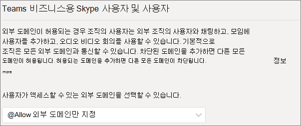
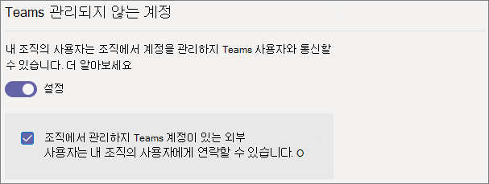
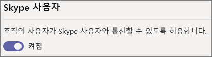

# <a name="manage-external-meetings-and-chat-in-microsoft-teams"></a>Microsoft Teams에서 외부 모임 및 채팅 관리

*외부 액세스* 기능을 사용하여 Teams에서 외부 모임 및 채팅을 구성할 수 있습니다. 외부 액세스는 조직 외부의 Teams 사용자가 Teams에서 사용자와 모임을 찾고, 통화하고, 채팅하고, 설정할 수 있는 방법입니다. 외부 액세스를 사용하여 비즈니스용 Skype(온라인 및 온-프레미스) 및 Skype를 계속 사용하는 다른 조직의 사용자와 통신할 수도 있습니다.

다른 조직의 사용자가 팀과 채널에 액세스할 수 있도록 하려면 게스트 액세스를 대신 사용합니다. 외부 액세스와 게스트 액세스 사이의 차이점에 대한 자세한 내용은 [외부 및 게스트 액세스 비교](communicate-with-users-from-other-organizations.md#compare-external-and-guest-access)를 참조하세요. 

다음과 같은 경우에 외부 액세스를 사용합니다.
  
- You have users in external domains who need to chat. For example, Rob@contoso.com and Ann@northwindtraders.com are working on a project together along with some others in the contoso.com and northwindtraders.com domains.

- 조직 내 사용자가 Teams를 사용하여 조직 외부의 특정 비즈니스에 참여하는 사용자와 연락하도록 하려는 경우

- Teams를 사용하는 전 세계의 모든 사람이 전자 메일 주소를 사용하여 사용자를 찾고 연락할 수 있게 하려고 합니다. 

## <a name="plan-for-external-meetings-and-chat"></a>외부 모임 및 채팅 계획

외부 액세스 정책에는 조직 및 사용자 수준 모두에 대한 제어가 포함됩니다. 조직 수준에서 정책을 끄면 사용자 수준 설정에 관계없이 모든 사용자에 대해 정책이 해제됩니다. 모든 외부 액세스 설정은 기본적으로 사용하도록 설정되어 있습니다.

Teams 관리 센터는 조직 수준에서 외부 액세스를 제어합니다. 대다수 옵션(도메인 제한 제외)은 PowerShell을 이용하여 사용자 수준에서 사용할 수 있습니다. 자세한 내용은 아래의 [PowerShell 사용](#using-powershell)을 참조하세요.

> [!NOTE]
> If you turn off external access in your organization, people outside your organization can still join meetings through anonymous join. To learn more, see [Manage meeting settings in Teams](meeting-settings-in-teams.md).

> [!NOTE]
> Teams 사용자는 다른 조직의 사용자와 모임 또는 채팅을 호스트할 때 앱을 추가할 수 있습니다. 또한 해당 조직에서 호스트하는 모임 또는 채팅에 참가할 때 다른 조직의 사용자가 공유하는 앱을 사용할 수도 있습니다. 호스팅 사용자 조직의 데이터 정책과 해당 사용자 조직에서 공유하는 타사 앱의 데이터 공유 사례가 적용됩니다.

## <a name="specify-trusted-organizations"></a>신뢰할 수 있는 조직 지정

조직에서 외부 모임 및 채팅에 대해 신뢰하는 조직을 정의하기 위해 특정 도메인을 허용하거나 차단할 수 있습니다. (다른 조직도 조직의 도메인을 허용해야 합니다.)

차단된 도메인을 추가하면 다른 모든 도메인이 허용됩니다. 허용된 도메인을 추가하면 다른 모든 도메인이 차단됩니다. 이 규칙의 예외는 익명 참가자가 모임에서 허용되는 경우입니다. Teams 관리 센터(**사용자** > **외부 액세스**)에서 외부 액세스를 설정하는 네 가지 시나리오가 있습니다.

- **모든 외부 도메인 허용**: Teams의 기본 설정이며 조직의 사용자가 모든 도메인에서 조직 외부 사용자와 모임을 찾고, 통화하고, 채팅하고, 설정할 수 있습니다.

    이 시나리오에서 사용자는 다른 테넌트도 외부 통신을 지원하는 한 Teams 또는 비즈니스용 Skype를 실행하는 모든 외부 도메인과 통신할 수 있습니다.
    
- **특정 외부 도메인만 허용**: **허용** 목록에 도메인을 추가하면 허용된 도메인으로만 외부 액세스를 제한할 수 있습니다. 허용된 도메인 목록을 설정하면 다른 모든 도메인은 차단됩니다. 

- **특정 도메인 차단** - **차단** 목록에 도메인을 추가하여 차단한 도메인을 *제외* 한 모든 외부 도메인과 통신할 수 있습니다.  차단된 도메인 목록을 설정하면 다른 모든 도메인은 허용됩니다.

- **모든 외부 도메인 차단** - 조직의 사용자가 모든 도메인에서 조직 외부의 사용자와 모임을 찾고, 통화하고, 채팅하고, 설정할 수 없도록 합니다.

> [!NOTE]
> 익명 액세스가 허용되는 경우 차단된 도메인의 사람 여전히 익명으로 모임에 참가할 수 있습니다.



**Microsoft Teams 관리 센터 사용**

특정 도메인을 허용하려면

1. Teams 관리 센터에서 **사용자** > **외부 액세스** 로 이동합니다.

2. **사용자가액세스할 수 있는 도메인을 선택하고**, **특정 외부 도메인만 허용을 선택합니다**.

3. **도메인 허용** 을 선택합니다.

4. **도메인** 상자에 허용할 도메인을 입력한 다음 **완료** 를 클릭합니다.

5. 다른 도메인을 허용하려면 **도메인 추가** 를 클릭합니다.

6. **저장** 을 클릭합니다.

특정 도메인을 차단하려면

1. Teams 관리 센터에서 **사용자** > **외부 액세스** 로 이동합니다.

2. **사용자가 액세스할 수 있는 도메인을 선택하고**, **특정 외부 도메인만 차단을 선택합니다**.

3. **도메인 차단** 을 선택합니다.

4. **도메인** 상자에 허용할 도메인을 입력한 다음 **완료** 를 클릭합니다.

5. 다른 도메인을 차단하려면 **도메인 추가** 를 클릭합니다.

6. **저장** 을 클릭합니다.

다른 테넌트와 통신하려면 **모든 외부 도메인 허용** 을 활성화하거나 위의 동일한 단계에 따라 허용된 도메인 목록에 테넌트를 추가해야 합니다.  

## <a name="manage-contact-with-external-teams-users-not-managed-by-an-organization"></a>조직에서 관리하지 않는 외부 Teams 사용자와의 연락처 관리

> [!NOTE]
> 이 문서에서 설명하는 Teams 및 Skype 상호 운용성 기능은 GCC, GCC High 또는 DOD 배포나 프라이빗 클라우드 환경에서 사용할 수 없습니다.

관리자는 조직에서 관리하지 않는 외부 Teams 사용자("관리되지 않음")와의 통신을 사용하거나 사용하지 않도록 선택할 수 있습니다. 사용하도록 설정된 경우 관리되지 않는 Teams 계정이 있는 사용자가 연락을 시작할 수 있는지 여부를 추가로 제어할 수도 있습니다(다음 이미지 참조). **조직에서 관리하지 않는 Teams 계정이 있는 외부 사용자가 내 조직의 사용자에게 연락할 수 있음** 이 꺼져 있으면 관리되지 않는 Teams 사용자는 전체 이메일 주소를 검색하여 조직 연락처 및 관리되지 않는 Teams와의 모든 커뮤니케이션을 찾을 수 없습니다. 사용자는 조직 사용자가 시작해야 합니다.

Teams 관리 센터에서 **사용자** > **외부 액세스** 로 이동합니다.



조직의 Teams 사용자가 조직에서 계정을 관리하지 않는 외부 Teams 사용자와 통신하지 못하도록 차단하려면:

1. **내 조직의 사용자는 조직에서 계정을 관리하지 않는 Teams 사용자와 통신할 수 있음** 설정을 끕니다.
2. **조직에서 관리하지 않는 Teams 계정을 가진 외부 사용자가 내 조직의 사용자에게 연락할 수 있음** 확인란의 선택을 취소합니다.

Teams 사용자가 연락처를 시작한 경우 조직의 Teams 사용자가 조직에서 계정을 관리하지 않는 외부 Teams 사용자와 통신할 수 있도록 하려면:

1. **내 조직의 사용자는 조직에서 계정을 관리하지 않는 Teams 사용자와 통신할 수 있음** 설정을 켭니다.
2. **조직에서 관리하지 않는 Teams 계정을 가진 외부 사용자가 내 조직의 사용자에게 연락할 수 있음** 확인란의 선택을 취소합니다.

내 조직의 Teams 사용자가 조직에서 관리하지 않는 계정을 가진 외부 Teams 사용자와 통신하도록 허용하고 해당 외부 Teams 사용자와 통신하게 해달라는 요청을 받으려면 다음을 수행합니다.

1. **내 조직의 사용자는 조직에서 계정을 관리하지 않는 Teams 사용자와 통신할 수 있음** 설정을 켭니다.
2. **조직에서 관리하지 않는 Teams 계정의 외부 사용자가 내 조직의 사용자에게 연락할 수 있음** 확인란을 선택합니다.

## <a name="communicate-with-skype-users"></a>Skype 사용자와 통신

조직의 Teams 사용자가 Skype 사용자와 채팅하고 통화하려면 다음 단계를 따르세요. 그런 다음 Teams 사용자는 일대일 텍스트 전용 대화 또는 Skype 사용자와의 음성/화상 통화를 검색 및 시작할 수 있으며 그 반대의 경우도 마찬가지입니다.



### <a name="using-the-microsoft-teams-admin-center"></a>Microsoft Teams 관리 센터 사용

1. 왼쪽 탐색 창에서 **사용자** > **외부 액세스** 로 이동합니다.

2. **조직의 사용자가 Skype 사용자와 통신할 수 있도록 허용** 설정을 켭니다.

적용되는 제한 사항을 포함하여 Teams 사용자 및 Skype 사용자가 통신할 수 있는 방법에 대한 자세한 내용은 [Teams 및 Skype 상호 운용성](teams-skype-interop.md)을 참조하세요.

### <a name="using-powershell"></a>PowerShell 사용

조직 수준 설정은 [Set-CSTenantFederationConfiguration](/powershell/module/skype/set-cstenantfederationconfiguration)을 사용하여 구성할 수 있고 사용자 수준 설정은 [Set-CsExternalAccessPolicy](/powershell/module/skype/set-csexternalaccesspolicy)를 사용하여 구성할 수 있습니다.

다음 표에는 페더레이션 구성에 사용되는 cmdlet 매개 변수가 나와 있습니다.

|구성|조직 수준(Set-CSTenantFederationConfiguration)|사용자 수준(Set-CsExternalAccessPolicy)|
|:-------|:--------|:------------------|
|다른 팀 조직 및 비즈니스용 Skype와의 페더레이션 사용/비활성화|`-AllowFederatedUsers`|`-EnableFederationAccess`|
|특정 도메인과의 페더레이션 사용|`-AllowedDomains`|사용할 수 없음|
|특정 도메인과의 페더레이션 비활성화|`-BlockedDomains`|사용할 수 없음|
|조직에서 관리하지 않는 Teams 사용자와의 페더레이션 사용/비활성화|`-AllowTeamsConsumer`|`-EnableTeamsConsumerAccess`|
|조직에서 관리하지 않는 Teams 사용자가 대화를 시작하지 못하도록 사용/비활성화|`-AllowTeamsConsumerInbound`|`-EnableTeamsConsumerInbound`|
|Skype와의 페더레이션 사용/비활성화|`-AllowPublicUsers`|`-EnablePublicCloudAccess`|

정책을 비활성화하면 테넌트에서 사용자로 "롤다운"된다는 점에 유의하는 것이 중요합니다. 예를 들면 다음과 같습니다.

```PowerShell
Set-CsTenantFederationConfiguration -AllowFederatedUsers $false
Set-CsExternalAccessPolicy -EnableFederationAccess $true
```

이 예에서는 사용자 수준 정책이 사용하도록 설정되어 있어도 조직 수준에서 이러한 유형의 페더레이션이 해제되어 있으므로 사용자가 관리되는 Teams 사용자 또는 비즈니스용 Skype 사용자와 통신할 수 없습니다. 따라서 일부 사용자에 대해 이러한 제어를 활성화하려면 조직 수준에서 제어를 켜고 두 개의 그룹 정책을 만들어야 합니다. 하나는 제어를 꺼야 하는 사용자에게 적용되고, 다른 하나는 컨트롤을 켜야 하는 사용자에게 적용되는 그룹 정책입니다.

## <a name="limit-external-access-to-specific-people"></a>특정 사용자에 대한 외부 액세스 제한

조직 수준에서 외부 액세스 제어를 사용하도록 설정한 경우 PowerShell을 이용하여 특정 사용자에 대한 외부 액세스를 제한할 수 있습니다.

다음 예제 스크립트를 사용할 수 있습니다. 변경하려는 컨트롤은 *Control*, 정책에 부여할 이름은 *PolicyName*, *UserName* 은 외부 액세스를 사용/비활성화하려는 각 사용자.

스크립트를 실행하기 전에 [Microsoft Teams PowerShell 모듈](/microsoftteams/teams-powershell-install)을 설치했는지 확인하세요.

```PowerShell
Connect-MicrosoftTeams

# Disable external access globally
Set-CsExternalAccessPolicy -<Control> $false

# Create a new external access policy
New-CsExternalAccessPolicy -Identity <PolicyName> -<Control> $true

# Assign users to the policy
$users_ids = @("<UserName1>", "<UserName2>")
New-CsBatchPolicyAssignmentOperation -PolicyType ExternalAccessPolicy -PolicyName "<PolicyName>" -Identity $users_ids

```

예를 들어 조직에서 관리하지 않는 외부 Teams 사용자와의 통신을 사용하도록 설정합니다.

```PowerShell
Connect-MicrosoftTeams

Set-CsExternalAccessPolicy -EnableTeamsConsumerAccess $false

New-CsExternalAccessPolicy -Identity ContosoExternalAccess -EnableTeamsConsumerAccess $true

$users_ids = @("MeganB@contoso.com", "AlexW@contoso.com")
New-CsBatchPolicyAssignmentOperation -PolicyType ExternalAccessPolicy -PolicyName "ContosoExternalAccess" -Identity $users_ids

```

사용자 목록을 컴파일하는 방법에 대한 추가 예는 [New-CsBatchPolicyAssignmentOperation](/powershell/module/teams/new-csbatchpolicyassignmentoperation)을 참조하세요.

`Get-CsExternalAccessPolicy`을(를) 실행하여 새 정책을 볼 수 있습니다.

[New-CsExternalAccessPolicy](/powershell/module/skype/new-csexternalaccesspolicy) 및 [Set-CsExternalAccessPolicy](/powershell/module/skype/set-csexternalaccesspolicy)도 참조하세요.

## <a name="common-external-access-scenarios"></a>일반적인 외부 액세스 시나리오

다음 섹션에서는 일반적인 외부 액세스 시나리오에서 페더레이션을 사용하도록 설정하는 방법과 TeamsUpgradePolicy에서 들어오는 채팅 및 통화의 전달을 결정하는 방법에 대해 설명합니다.

### <a name="enable-federation-between-users-in-your-organization-and-other-organizations"></a>조직의 사용자와 다른 조직 간의 페더레이션 사용

조직의 사용자가 다른 조직의 사용자와 통신할 수 있도록 설정하려면 두 조직 모두 페더레이션 기능을 사용하도록 설정해야 합니다. 특정 조직에 대해 페더레이션을 사용하도록 설정하는 단계는 조직이 온라인인지, 하이브리드인지 또는 온-프레미스인지에 따라 다를 수 있습니다.

| 조직에서 데스크톱 시각화에 대한 | 다음과 같이 페더레이션을 사용하는 경우 |
|:---------|:-----------------------|
|비즈니스용 Skype 온-프레미스가 아닌 사용자. 여기에는 TeamsOnly 사용자 및/또는 비즈니스용 Skype Online 사용자가 있는 조직이 포함됩니다.| Teams 관리 센터를 사용하는 경우: <br>- 통신하려는 도메인에 외부 액세스가 허용되는지 확인하세요.<br><br>PowerShell을 사용하는 경우:<br>- 테넌트가 페더레이션에 대해 `Get-CsTenantFederationConfiguration`이 `AllowFederatedUsers=true`를 표시하는지 확인합니다. <br>- `CsExternalAccessPolicy`의 사용자 유효 값이 `EnableFederationAccess=true`인지 확인하세요.<br>- 공개 페더레이션을 사용하지 않는 경우, 대상 도메인이 `CsTenantFederationConfiguration`의 `AllowedDomains`에 나열되어 있는지 확인합니다. |
|온-프레미스 전용| 온-프레미스 도구에서: <br>- 페더레이션이 `CsAccessEdgeConfiguration`에서 사용하도록 설정되어 있는지 확인합니다.<br>- 사용자에 대한 페더레이션이 `ExternalAccessPolicy`를 통해(또는 전역 정책, 사이트 정책 또는 사용자에게 할당된 정책) 사용하도록 설정되어 있는지 확인합니다. <br> - 공개 페더레이션을 사용하지 않는 경우, 대상 도메인이 `AllowedDomains`에 나열되어 있는지 확인합니다.|
|일부 사용자(비즈니스용 Skype 또는 Teams)와 사내 일부 사용자와의 하이브리드 기능을 제공합니다. | 온라인 및 온-프레미스 조직은 위의 단계를 따르세요. |

### <a name="delivery-of-incoming-chats-and-calls"></a>수신 채팅 및 통화 전달 

페더레이션 조직에서 들어오는 채팅 및 통화는 TeamsUpgradePolicy의 받는 사람 사용자 모드에 따라 사용자의 Teams 또는 비즈니스용 Skype 클라이언트에 도착합니다.

| 원하는 작업 | 방법 |
|:---------|:-----------------------|
|들어오는 페더레이션 채팅 및 통화가 사용자의 Teams 클라이언트에 도착하는지 확인합니다.|사용자를 TeamsOnly로 구성합니다.
|들어오는 페더레이션 채팅 및 통화가 사용자의 비즈니스용 Skype 클라이언트에 도착하는지 확인합니다.|사용자가 TeamOnly 이외의 다른 모드를 사용하도록 구성합니다.|

### <a name="enable-federation-between-users-in-your-organization-and-unmanaged-teams-users"></a>조직의 사용자와 관리되지 않는 Teams 사용자 간의 페더레이션 사용

조직의 사용자와 관리되지 않는 Teams 사용자 간의 페더레이션을 활성화하려면:

| 조직에서 데스크톱 시각화에 대한 | 다음과 같이 페더레이션을 사용하는 경우 |
|:---------|:-----------------------|
|비즈니스용 Skype 온-프레미스가 아닌 사용자. 여기에는 Teams 전용 사용자 및/또는 비즈니스용 Skype Online 사용자가 있는 조직이 포함됩니다.| Teams 관리 센터를 사용하는 경우:<br>-**외부 액세스** 에서 **내 조직의 사용자가 계정을 조직에서 관리하지 않는 Teams 사용자와 통신할 수 있음** 이 사용하도록 설정되어 있는지 확인합니다.<br>-관리되지 않는 Teams 계정이 채팅을 시작하도록 하려면 **조직에서 관리하지 않는 Teams 계정을 가진 외부 사용자가 내 조직의 사용자에게 연락할 수 있음** 확인란을 선택합니다.<br><br>PowerShell을 사용하는 경우:<br>-테넌트가 페더레이션에 대해 `Get-CsTenantFederationConfiguration`이 `AllowTeamsConsumer=true`를 표시하는지 확인합니다.<br>-`CsExternalAccessPolicy`의 사용자 유효 값이 `EnableTeamsConsumerAccess=true`인지 확인하세요.<br>-관리되지 않는 사용자가 채팅을 시작할 수 있도록 테넌트가 사용하도록 설정되어 있는지 확인합니다. `Get-CsTenantFederationConfiguration`은(는) `AllowTeamsConsumerInbound=true`를(를) 표시해야 합니다.<br>-`CsExternalAccessPolicy`의 사용자 유효 값이 `EnableTeamsConsumerInbound=true`인지 확인하세요.|
|온-프레미스 전용| 관리되지 않는 Teams 사용자와의 채팅은 온-프레미스 전용 조직에서 지원되지 않습니다.|
|일부 사용자(비즈니스용 Skype 또는 Teams)와 사내 일부 사용자와의 하이브리드 기능을 제공합니다. | 온라인 조직에 대해 이전에 설명한 단계를 따르세요. 관리되지 않는 Teams 사용자와의 채팅은 온-프레미스 사용자에게 지원되지 않습니다.|

> [!IMPORTANT]
> You don't have to add any **Teams domains** as allowed domains in order to enable Teams users to communicate with unmanaged Teams users outside your organization. All **unamanged Teams domains** are allowed.

### <a name="enable-federation-between-users-in-your-organization-and-consumer-users-of-skype"></a>조직의 사용자와 Skype 고객 사용자 간 페더레이션을 사용하도록 설정

조직의 사용자와 Skype 고객 사용자 간 페더레이션을 사용하도록 설정하는 방법

| 조직에서 데스크톱 시각화에 대한 | 다음과 같이 페더레이션을 사용하는 경우 |
|:---------|:-----------------------|
|비즈니스용 Skype 온-프레미스가 없는 온라인 전용. 여기에는 TeamsOnly 사용자 및/또는 비즈니스용 Skype Online 사용자가 있는 조직이 포함됩니다. | Teams 관리 센터를 사용하는 경우: <br>- 반드시 **조직의 사용자가 외부 액세스에서 Skype 사용자와 통신하도록 허용** 해야 합니다.<br><br>PowerShell을 사용하는 경우: <br>-테넌트가 페더레이션에 대해 `Get-CsTenantFederationConfiguration`이 `AllowPublicUsers=true`를 표시하는지 확인합니다. <br> - `CsExternalAccessPolicy`의 사용자 유효 값이 `EnablePublicCloudAccess=true`인지 확인하세요. |
|온-프레미스 전용| 온-프레미스 도구에서: <br> - Skype를 페더레이션되는 파트너로 사용하도록 설정되어 있는지 확인합니다. <br> - 사용자에 대한 `EnablePublicCloudAccess=true`가 `ExternalAccessPolicy`를 통해(또는 전역 정책, 사이트 정책 또는 사용자에게 할당된 정책) 사용하도록 설정되어 있는지 확인합니다.|
| 일부 사용자(비즈니스용 Skype 또는 Teams)와 사내 일부 사용자와의 하이브리드 기능을 제공합니다.| 온라인 및 온-프레미스 조직은 위의 단계를 따르세요.

> [!IMPORTANT]
> You don't have to add any **Skype domains** as allowed domains in order to enable Teams or Skype for Business Online users to communicate with Skype users inside or outside your organization. All **Skype domains** are allowed.

## <a name="federation-diagnostic-tool"></a>페더레이션 진단 도구

관리자인 경우 다음 진단 도구를 사용하여 Teams 사용자가 페더레이션된 Teams 사용자와 통신할 수 있는지 확인할 수 있습니다.

1. 아래의 **테스트 실행** 을 선택하면 Microsoft 365 관리 센터에서 진단이 채워집니다. 

   > [!div class="nextstepaction"]
   > [테스트 실행: Teams 페더레이션](https://aka.ms/TeamsFederationDiag)

2. 진단 실행 창에서 **SIP(Session Initiation Protocol) 주소** 및 **페더레이션 테넌트의 도메인 이름** 을 입력한 다음 **테스트 실행** 을 선택합니다.

3. 테스트는 페더레이션된 사용자와의 통신을 방해하는 테넌트 또는 정책 구성을 해결하기 위한 최상의 다음 단계를 반환합니다.

## <a name="user-level-controls"></a>사용자 수준 컨트롤

사용자가 조직 외부의 다른 사용자로부터 1:1 채팅을 받으면 메시지 **미리 보기** , 채팅 **수락** 또는 채팅을 보내는 사람 **차단** 을 선택할 수 있는 전체 화면 환경이 제공됩니다.

채팅 목록의 더 많은(**...**) 메뉴와 피플 카드의 더 많은(**...**) 메뉴를 포함하여 Teams 내의 여러 위치에서 외부 사용자 차단을 사용할 수 있습니다. 사용자는 채팅 목록의 더 많은 (**...**) 메뉴, 사람 카드의 더 많은 (**...**) 메뉴를 통해 또는 **설정** > **차단된 연락처****편집 차단** 연락처를 방문하여 외부 사용자를  >  차단 해제할 수도 있습니다. 차단은 메시지를 보내기 전이나 보낸 후에 사용할 수 있습니다.

외부 사용자를 차단하면 1:1 채팅에서 메시지를 보내고, 사용자를 새 그룹 채팅에 추가하고, 현재 상태를 볼 수 없습니다. 그룹 채팅 초대가 차단되는 동안 차단된 사용자는 차단되기 전에 채팅이 시작되었거나 다른 구성원이 그룹 채팅 초대를 보냈기 때문에 차단된 사용자와 동일한 채팅에 있을 수 있습니다.

> [!NOTE]
> 외부 사용자와의 채팅을 차단하는 사용자의 기능을 제어하는 Teams 관리자 설정 또는 정책이 없습니다.

## <a name="related-topics"></a>관련 항목

[외부 (페더레이션) 사용자를 위한 기본 채팅 환경](native-chat-for-external-users.md)
