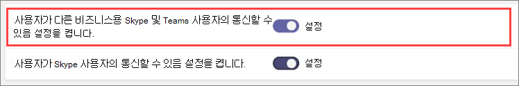

Microsoft 팀에서 외부 액세스 관리
======================================================

Microsoft 팀 외부 액세스를 사용 하면 다른 도메인의 팀 사용자가 채팅 및 통화에 참가할 수 있습니다. 비즈니스용 skype Online, 비즈니스용 Skype for-프레미스 또는 Skype를 사용 하는 othe 외부 사용자에 게 참가할 수도 있습니다.

다음과 같은 경우이 문서에 나와 있는 단계를 사용 합니다.
  
- 비즈니스의 다른 도메인에 사용자가 있는 경우 (예: Rob@contoso.com 및 Ann@northwindtraders.com)

- 조직의 사용자 들이 팀을 사용 하 여 조직 외부의 특정 비즈니스 사용자에 게 연락할 수 있도록 하려는 경우

- 팀을 사용 하는 세계의 다른 사용자가 전자 메일 주소를 사용 하 여 사용자를 찾고 연락할 수 있도록 하려는 경우 사용자와 다른 사용자가 모두 외부 액세스를 사용 하도록 설정 하 고 서로의 도메인을 허용 하는 경우이 작업이 작동 합니다. 사용할 수 없는 경우, 다른 사용자는 자신의 구성이 자신의 도메인을 차단 하 고 있지 않은지 확인 해야 합니다.

외부 액세스를 통해 외부 사용자가 인스턴트 메시지를 찾고, 호출 하 고, 보낼 수 있을 뿐만 아니라 모임을 설정할 수도 있습니다. 그러나 외부 사용자에 게 팀과 채널에 대 한 액세스 권한을 부여 하려는 경우 게스트 액세스를 사용 하는 것이 더 좋을 수 있습니다. 외부 access와 게스트 액세스의 차이점에 대 한 자세한 내용은 아래에서 [외부 액세스와 게스트 액세스 비교](#external-access-vs-guest-access)를 참조 하세요. 게스트 액세스를 설정 하려면 사용자가 통신할 수 있도록 [게스트 액세스 설정을](set-up-guests.md) 참조 하세요.

> [!IMPORTANT]
> 현재 Azure AD (Active Directory) 또는 테 넌 트에서 현재 게스트가 아닌 조직 외부의 외부 사용자에 게 Microsoft 팀 앱을 페더레이션 하려면 하이브리드에 대해 올바르게 설정 하 고 비즈니스용 Skype Online으로 이동 해야 합니다. 2/25/2019으로 인해 비즈니스용 Skype Online에서 SIP 프로필을 사용 하지 않고도 팀이 기본 페더레이션을 지원 합니다. 하이브리드 계정을 설정 하 고 팀으로 이동 하는 방법에 대해서는 [비즈니스용 Skype 하이브리드 배포를 팀으로 업그레이드](https://docs.microsoft.com/en-us/microsoftteams/upgrade-to-teams-execute-skypeforbusinesshybrid)를 참조 하세요.

## 외부 액세스와 게스트 액세스 비교

외부 액세스 (페더레이션)와 게스트 액세스는 서로 다릅니다.

- 게스트 액세스는 개인에 대 한 액세스 권한을 제공 합니다. 외부 액세스는 전체 도메인에 대 한 액세스 권한을 제공 합니다.

- 팀 소유자가 부여한 게스트 액세스는 게스트가 채널 토론 및 파일 등의 [리소스에 액세스](guest-experience.md)하 고, 특정 팀에 대해, 초대 받은 팀의 다른 사용자와 채팅을 할 수 있도록 합니다. 외부 채팅을 사용 하는 경우에는 외부 채팅 참가자가 초대 하는 조직의 팀 또는 팀 리소스에 액세스할 수 없습니다. 일대일 페더레이션된 채팅에만 참가할 수 있습니다. 테 넌 트 관리자는 외부 파티에 게 어떤 수준의 공동 작업을 사용할지에 따라 두 통신 옵션 중에서 선택할 수 있습니다. 관리자는 조직의 요구 사항에 따라 접근 권한 또는 두 가지 모두를 선택할 수 있지만, 보다 자세한 공동 작업 환경에서 게스트 액세스를 사용 하도록 설정 하는 것이 좋습니다. 

외부 및 게스트 액세스 기능의 비교는 다음 표를 참조 하세요.

| 요소 | 외부 access 사용자 | 게스트 액세스 사용자 |
|---------|-----------------------|--------------------|
| 다른 회사의 사용자와 채팅을 할 수 있습니다. | ' |' |
| 사용자가 다른 회사의 사람에 게 전화를 걸 수 있습니다. | ' | ' |
| 사용자가 다른 회사의 다른 사용자가 전화를 걸거나 채팅할 수 있는지 확인할 수 있습니다. | ' | 예1 |
| 사용자가 외부 테 넌 트를 통해 사용자를 검색할 수 있습니다. | 예2 | 아니요 |
| 사용자가 파일을 공유할 수 있음 | 아니요 | ' |
| 사용자가 팀 리소스에 액세스할 수 있습니다. | 아니요 | ' |
| 그룹 채팅에 사용자를 추가할 수 있습니다. | 아니요 | ' |
| 모임에 사용자를 추가할 수 있습니다. | ' | ' |
| 외부 사용자와의 채팅에 추가 사용자를 추가할 수 있습니다. | 3 없음 | 해당 없음 |
| 사용자가 외부 파티로 식별 됨 | ' | ' |
| 현재 상태 표시 | ' | ' |
| 부재 중 메시지 표시 됨 | 아니요 | ' |
| 개별 사용자를 차단할 수 있습니다. | 아니요 | ' |
| 지원 되는 @mentions | 아니요 | ' |
| 비공개 통화 만들기 | ' | ' |
| IP 영상 허용 | ' | ' |
| 화면 공유 모드 | 아니요 | ' |
| 모임 시작 허용 | 아니요 | ' |
| 보낸 메시지 편집 | 아니요 | ' |
| 보낸 메시지 삭제 가능 | 아니요 | ' |
| 대화에서 Giphy 사용 | 아니요 | ' |
| 대화에서 밈 사용 | 아니요 | ' |
| 대화에서 스티커 사용 | 아니요 | ' |
||||

사용자가 게스트로 추가 되 고 게스트 테 넌 트에 게스트로 로그인 한 경우 1 이 제공 됩니다. 
2 전자 메일 또는 SIP (세션 초기화 프로토콜) 주소로만 가능 합니다. 
3 외부 (페더레이션된) 채팅은 1:1 전용입니다.

게스트 기능 및 게스트 환경에 대 한 자세한 내용은 [Microsoft 팀에 대 한 게스트 액세스 설정 또는 해제](https://docs.microsoft.com/microsoftteams/set-up-guests) 와 [게스트 환경 기능](https://docs.microsoft.com/microsoftteams/guest-experience)을 참조 하세요.

무료 버전의 팀과 외부 Access에 있는 기능을 사용 하 여 작업 하는 방법에 대 한 자세한 내용은 [Microsoft 팀과 Microsoft 팀의 차이점](https://support.office.com/article/differences-between-microsoft-teams-and-microsoft-teams-free-0b69cf39-eb52-49af-b255-60d46fdf8a9c?ui=en-US&rs=en-US&ad=US)을 참고 하세요.

## 시나리오에 대 한 빠른 단계

|**원하는 ...**  |**빠른 단계**  |
|---------|-----------------------|
|조직의 **사용자가** 다른 (외부) 조직의 **팀 사용자** 와 통신할 수 있도록 하려는 경우|외부 액세스에서 허용 목록에 외부 도메인을 추가 하거나 개방형 페더레이션을 사용 합니다. 
그런 다음 다른 팀 조직의 관리자가 동일한 작업을 수행 하도록 합니다.      |
|조직의 **사용자가** 같은 조직의 **비즈니스용 Skype Online 사용자** 와 통신할 수 있도록 하려는 경우  |공존 모드를 사용 하도록 설정 하거나, 조직에서 비즈니스용 Skype 사용자를 지원 하기 위해 군도 업그레이드 모드를 선택 합니다.   |
|조직의 **사용자가** 다른 (외부) 조직의 **비즈니스용 Skype Online 사용자** 와 통신할 수 있도록 하려는 경우      |외부 액세스에서 허용 목록에 외부 도메인을 추가 하거나 개방형 페더레이션을 사용 합니다.  
사용자가 외부 액세스에서 비즈니스용 **Skype 및 팀 사용자 설정과 통신할 수** 있도록 설정 합니다. 
그런 다음 다른 팀 조직의 관리자가 동일한 작업을 수행 하도록 합니다. 
**참고**: 비즈니스용 skype 사용자가 있는 외부 도메인은 공존 모드를 사용 하도록 설정 하거나, 해당 조직의 비즈니스용 skype 사용자를 지원 하기 위해 군도 업그레이드 모드를 선택 해야 합니다.|
|조직의 **사용자가** 조직의 내부 또는 외부에서 **Skype** 사용자와 통신할 수 있도록 하려는 경우   | 지금은 지원 되지 않는 시나리오입니다. 
**중요**: 팀 사용자는 skype 사용자와 통신할 수 없지만 조직의 비즈니스용 skype 사용자는 다음 두 가지 요구 사항이 충족 되는 경우 조직 내부 또는 외부의 skype 사용자와 통신할 수 있습니다. 
1) **사용자가 비즈니스용 skype 및 팀 사용자와 통신할 수** 있도록 설정 하 고 비즈니스용 skype 사용자가 외부 액세스의 **skype 사용자 설정과 통신할 수** 있도록 합니다. 
 2) 조직이 공존 모드에서 실행 중입니다. |
|**팀** 이 온-프레미스 조직 및 **skype 사용자**의 비즈니스용 **Skype Online 사용자** 와 통신할 수 있도록 하려는 경우   |외부 액세스에서 허용 목록에 외부 도메인을 추가 하거나 개방형 페더레이션을 사용 합니다. . 
사용자가 외부 액세스에서 비즈니스용 **Skype 및 팀 사용자 설정과 통신할 수** 있도록 설정 합니다. 
비즈니스용 **skype 사용자가 외부 액세스에서 skype 사용자 설정과 통신할 수** 있도록 설정 합니다. 
 그런 다음 온-프레미스 조직의 관리자가 동일한 작업을 수행 하도록 합니다.
**중요** 이 시나리오에서 팀 사용자는 Skype 사용자와 통신할 수 없지만 조직의 비즈니스용 skype 사용자가 조직 내부 또는 외부의 Skype 사용자와 통신할 수 있도록 설정 하면 **사용자가 업무용 skype와 통신할 수 있습니다. 그리고 팀 사용자** 및 **비즈니스용 skype 사용자는 외부 액세스의 Skype 사용자 설정과 통신할 수 있습니다** .|
|**비즈니스용 Skype Online 사용자가** 다른 Office 365 조직의 **팀 사용자** 와 통신할 수 있도록 하려는 경우|공존 모드를 사용 하도록 설정 하거나, 조직에서 비즈니스용 Skype 사용자를 지원 하기 위해 군도 업그레이드 모드를 선택 합니다. 
외부 액세스에서 허용 목록에 외부 도메인을 추가 하거나 개방형 페더레이션을 사용 합니다.  
 사용자가 외부 액세스에서 비즈니스용 **Skype 및 팀 사용자 설정과 통신할 수** 있도록 설정 합니다. 
그런 다음 다른 팀 조직의 관리자가 동일한 작업을 수행 하도록 합니다. |
|**비즈니스용 Skype online 사용자가** 다른 Office 365 조 직의 **비즈니스용 skype online 사용자** 와 통신할 수 있도록 하려는 경우    | 공존 모드를 사용 하도록 설정 하거나, 조직에서 비즈니스용 Skype 사용자를 지원 하기 위해 군도 업그레이드 모드를 선택 합니다. 
외부 액세스에서 허용 목록에 외부 도메인을 추가 하거나 개방형 페더레이션을 사용 합니다. 
 사용자가 외부 액세스에서 비즈니스용 **Skype 및 팀 사용자 설정과 통신할 수** 있도록 설정 합니다.
그런 다음 다른 팀 조직의 관리자가 동일한 작업을 모두 수행 하도록 합니다. |
|**비즈니스용 Skype online 사용자가** 온-프레미스 조직에서 **비즈니스용 skype online 사용자** 와 통신할 수 있도록 하려는 경우     |공존 모드를 사용 하도록 설정 하거나, 조직에서 비즈니스용 Skype 사용자를 지원 하기 위해 군도 업그레이드 모드를 선택 합니다. 
외부 액세스에서 허용 목록에 외부 도메인을 추가 하거나 개방형 페더레이션을 사용 합니다.  
사용자가 외부 액세스에서 비즈니스용 **Skype 및 팀 사용자 설정과 통신할 수** 있도록 설정 합니다.  
 그런 다음 온-프레미스 조직의 관리자가 동일한 작업을 수행 하도록 합니다. |
|비즈니스용 **Skype Online 사용자가** **skype 사용자** (조직의 내부 또는 외부)와 통신 하도록 하려는 경우   |공존 모드를 사용 하도록 설정 하거나, 조직에서 비즈니스용 Skype 사용자를 지원 하기 위해 군도 업그레이드 모드를 선택 합니다. 
비즈니스용 **skype 사용자가 외부 액세스에서 skype 사용자와 통신할 수** 있도록 설정 합니다.         |
|**비즈니스용 Skype online 사용자가** 다른 조직의 비즈니스용 **skype online 사용자** 와 통신 하 고 조직의 내부 또는 외부에서 **skype 사용자** 와 통신할 수 있도록 하려는 경우    |공존 모드를 사용 하도록 설정 하거나, 조직에서 비즈니스용 Skype 사용자를 지원 하기 위해 군도 업그레이드 모드를 선택 합니다. 
외부 액세스에서 허용 목록에 외부 도메인을 추가 하거나 개방형 페더레이션을 사용 합니다.  
 **사용자가 비즈니스용 skype 및 팀 사용자와 통신할 수** 있도록 설정 하면 비즈니스용 **Skype 사용자가 외부 액세스에서 skype 사용자 설정과 통신할 수** 있습니다. 
그런 다음 다른 팀 조직의 관리자가 동일한 작업을 수행 하도록 합니다.       
 **참고**: 다른 외부 도메인의 관리자는 비즈니스용 **Skype 사용자가 외부 액세스에서 skype 사용자 설정으로 통신할 수** 있도록 설정할 필요가 없습니다.|

> [!IMPORTANT]
> 팀 또는 비즈니스용 Skype Online 사용자가 조직 내부 또는 외부의 Skype 사용자와 통신할 수 있도록 허용 된 도메인으로 **"Skype domains"** 를 추가할 필요가 없습니다. 모든 **Skype 도메인** 은 모든 도메인이 허용 되는 것을 의미 하는 허용 목록입니다.

## 팀 사용자가 다른 조직의 사용자와 채팅 하 고 통신 하도록 허용

외부 액세스를 통해 팀과 비즈니스용 Skype 사용자가 조직 외부의 다른 사용자와 통신할 수 있습니다. 기본적으로 조직은 모든 외부 도메인과 통신할 수 있습니다. 차단 된 도메인을 추가 하는 경우 다른 모든 도메인이 허용 되지만 허용 된 도메인을 추가 하면 다른 모든 도메인이 차단 됩니다. 조직에 대 한 외부 액세스를 쉽게 설정할 수 있습니다. 다음과 같은 세 가지 시나리오를 설정할 수 있습니다.

- **시나리오 1** - **OPEN FEDERATION**를 사용할 수 있습니다. 이는 기본 설정으로, 조직의 다른 사용자가 조직 외부의 사용자와 모임을 설정할 수 있을 뿐만 아니라, 메신저 대화/채팅을 찾고, 통화 하 고, 보낼 수도 있습니다.

    이 설정을 사용 하면 사용자가 팀 또는 비즈니스용 Skype를 실행 하는 모든 외부 도메인과 통신할 수 있으며, 개방 페더레이션을 사용 하거나 사용자의 도메인을 허용 목록에 추가 했습니다.

- **시나리오 2** - **허용** 목록에 도메인 또는 도메인을 추가할 수 있습니다. 이렇게 하려면 **도메인 추가**, 도메인 이름 추가, 작업을 차례로 클릭 **하 여이 도메인에서 실행**을 클릭 한 다음 **허용 됨**을 선택 합니다. 이 작업을 수행 하는 경우 다른 모든 도메인이 **차단** 된다는 것을 알아야 합니다.

- **시나리오 3** - **차단** 목록에 도메인 또는 도메인을 추가할 수 있습니다. 이렇게 하려면 **도메인 추가**, 도메인 이름 추가, **이 도메인에서 수행 하기 위해 동작**을 차례로 클릭 한 다음 **차단 됨**을 선택 합니다. 이 작업을 수행 하는 경우 다른 모든 도메인을 **허용** 한다는 것을 알아야 합니다.

도메인을 허용 하거나 차단 하려면 다음 단계를 따르세요.

### 1 단계-조직이 다른 팀 조직과 통신할 수 있도록 설정

**Microsoft 팀 관리 센터를 사용 하 여** microsoft 팀 로고를 표시 하는 아이콘  

1. 왼쪽 탐색 창에서 **조직 전체 설정** > **외부 액세스**로 이동 합니다.

2. **사용자가 비즈니스용 Skype 및 팀 사용자와 통신할 수** 있도록 설정/해제 **** 를 전환 합니다.

     .

3. 모든 팀 조직이 조직의 사용자와 통신할 수 있도록 허용 하려면 5 단계로 건너뜁니다.

4. 조직의 사용자와 통신할 수 있는 조직을 제한 하려면 일부 도메인을 제외 하 고 모두 허용 하거나 특정 도메인만 허용할 수 있습니다. 

    - 일부 도메인을 제외 하 고 모두 허용 하려면 **도메인 추가**를 클릭 하 여 차단 하려는 도메인을 추가 합니다. **도메인 추가** 창에서 도메인 이름을 입력 하 고 **차단 됨**을 클릭 한 후 **완료**를 clik. 
    - 특정 조직에 대 한 통신을 제한 하려면 **허용 됨**상태의 상태를 사용 하 여 해당 도메인을 목록에 추가 합니다. 허용 목록에 도메인을 추가 하 고 나면 다른 조직과의 통신은 해당 도메인이 허용 목록에 있는 조직 으로만 제한 됩니다. 

5. **저장**을 클릭 합니다.

6. 다른 팀 조직의 관리자가 동일한 단계를 완료 하는지 확인 합니다. 예를 들어 허용 된 **도메인** 목록에서 관리자가 사용자와 통신할 수 있는 조직을 제한 하는 경우 비즈니스 도메인을 입력 해야 합니다.

### 2 단계-테스트

설정을 테스트 하려면 방화벽 뒤에 있지 않은 팀 사용자가 필요 합니다.
  
1. 사용자와 조직의 관리자가 **외부 액세스** 설정을 변경한 후에는 계속 해 서 사용 하는 것이 좋습니다.

2. 팀 앱에서 전자 메일 주소를 기준으로 사람을 검색 하 고 채팅 요청을 보냅니다.

3. 팀 연락처에 게 채팅 요청을 보내세요. 요청을 받지 못한 경우 해당 방화벽 설정이 올바른 것으로 확인 되었다고 가정 하 여 문제가 방화벽 설정입니다.

4. 방화벽이 방화벽 뒤에 있지 않은 wifi 위치로 이동 하 여 문제가 발생 했는지 여부를 테스트 하는 또 다른 방법은 커피숍과 같이 팀을 사용 하 여 대화 상대에 게 채팅 요청을 보냅니다. 메시지가 wifi 위치에서 통과 하지만 작업 중에는 그렇지 않은 경우에는 방화벽에 문제가 있다는 것을 알 수 있습니다.

## 비즈니스용 Skype Online 조 직에서 사용자와 통신

팀이 사용자에 게 연락할 수 있는 사람을 제한 하는 비즈니스용 Skype 조직에 속한 사용자를 찾고 연락 하도록 외부 액세스를 설정 하는 경우 단계에 따라 도메인의 외부 액세스를 다른 조직의 도메인으로 설정 합니다. 그런 다음 다른 조직의 관리자에 게 다음 단계를 따라 비즈니스용 Skype Online에 대 한 외부 액세스를 구성 하도록 요청 합니다.

 **관리 센터를 사용 하 여** 비즈니스용 skype 로고를 표시 하는 아이콘

해당 조직의 관리자에 게 다음 단계를 수행 하도록 합니다.

1. Microsoft 365 관리 센터에서 **관리 센터** > **팀 & Skype** > **레거시 포털로**이동 합니다.
  
2. **비즈니스용 Skype 관리 센터**에서 **조직** > **외부 통신**을 선택 합니다.

3. 특정 비즈니스 또는 다른 도메인에 있는 사용자와의 통신을 설정 하려면 드롭다운 상자에서 **허용 된 도메인에만**설정을 선택 합니다.

    또는 비즈니스용 Skype 정책을 연 세계에 있는 모든 사람과 통신을 사용 하도록 설정 하려면 **차단 된 도메인을 제외 하 고**를 선택 합니다. 이는 기본 설정입니다.

4. **차단 되거나 허용 된 도메인**에서을 **+** 선택 하 고 허용 하려는 도메인의 이름을 추가 합니다.

## 관련 항목

Microsoft 팀의 게스트 액세스에 대 한 자세한 내용은 [Microsoft 팀에서 게스트 액세스 관리](manage-guests.md)를 참조 하세요.
