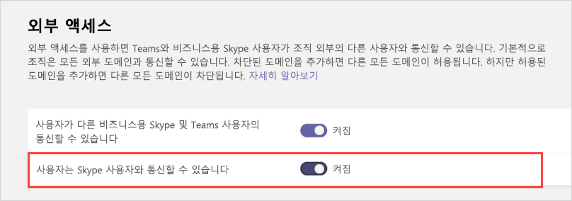

Microsoft Teams에서 외부 액세스 관리Manage external access in Microsoft Teams
======================================================

외부 액세스는 전체 외부 도메인의 팀 사용자가 팀에서 모임을 검색, 통화, 채팅 및 설정 하는 방법입니다.External access is a way for Teams users from an entire external domain to find, call, chat, and set up meetings with you in Teams. 외부 액세스를 사용 하 여 아직 비즈니스용 Skype (온라인 및 온-프레미스)와 Skype (미리 보기)를 사용 중인 외부 사용자와 통신할 수도 있습니다.You can also use external access to communicate with external users who are still using Skype for Business (online and on-premises) and Skype (in preview).

외부 사용자가 팀과 채널에 액세스할 수 있도록 하려면 게스트 액세스를 사용하는 것이 좋습니다.If you want external users to have access to teams and channels, guest access might be a better way to go. 외부 액세스와 게스트 액세스 사이의 차이점에 대한 자세한 내용은 [외부 및 게스트 액세스 비교](communicate-with-users-from-other-organizations.md#compare-external-and-guest-access)를 참조하세요.For more information about the differences between external access and guest access, see [Compare external and guest access](communicate-with-users-from-other-organizations.md#compare-external-and-guest-access). 

다음과 같은 경우에 외부 액세스를 사용합니다.Use external access when:
  
- 다른 도메인에 공동 작업을 해야 하는 사용자가 있는 경우You have users in different domains who need to collaborate. 예를 들어 Rob@contoso.com 및 Ann@northwindtraders.com은 contoso.com 및 northwindtraders.com 도메인의 다른 사용자들과 함께 프로젝트를 작업하고 있습니다.For example, Rob@contoso.com and Ann@northwindtraders.com are working on a project together along with some others in the contoso.com and northwindtraders.com domains.

- 조직 내 사용자가 Teams를 사용하여 조직 외부의 특정 비즈니스에 참여하는 사용자와 연락하도록 하려는 경우You want the people in your organization to use Teams to contact people in specific businesses outside of your organization.

- Teams를 사용하는 전 세계의 모든 사람이 전자 메일 주소를 사용하여 사용자를 찾고 연락할 수 있게 하려고 합니다.You want anyone else in the world who uses Teams to be able to find and contact you, using your email address. 

> [!IMPORTANT]
> 현재 Microsoft Teams 앱 내에서 현재 사용자의 Azure AD(Azure Active Directory) 또는 테넌트의 게스트가 아닌 조직 외부의 외부 사용자에게 페더레이션하려면 하이브리드용으로 올바르게 설정하고 비즈니스용 Skype Online으로 이동해야 합니다.Currently, to federate within the Microsoft Teams app to an external user outside of your organization who's not currently a guest of your Azure Active Directory (Azure AD) or tenant, you must be correctly set up for hybrid and moved to Skype for Business Online. 2019년 2월 25일 현재 Teams에서는 비즈니스용 Skype Online에 SIP 프로필 사용자가 없는 경우 네이티브 페더레이션을 지원하지 않습니다.As of February 25, 2019, Teams doesn't support native federation without the user of the SIP profile being homed in Skype for Business Online. 하이브리드 계정을 설정한 다음 Teams으로 이동하는 방법에 대한 자세한 내용은 [비즈니스용 Skype 하이브리드 배포를 Teams로 업그레이드](https://docs.microsoft.com/microsoftteams/upgrade-to-teams-execute-skypeforbusinesshybrid)를 참조하세요.For more on setting up your account for hybrid and then moving to Teams, see [Upgrade Skype for Business hybrid deployment to Teams](https://docs.microsoft.com/microsoftteams/upgrade-to-teams-execute-skypeforbusinesshybrid).

## 외부 액세스 계획Plan for external access

기본적으로 외부 액세스는 Teams에서 활성화되어 있습니다. 즉, 조직에서 모든 외부 도메인과 의사소통할 수 있습니다.By default, external access is turned on in Teams, which means that your organization can communicate with all external domains. 차단된 도메인을 추가하면 다른 모든 도메인이 허용됩니다. 허용된 도메인을 추가하면 다른 모든 도메인이 차단됩니다.If you add blocked domains, all other domains will be allowed; and if you add allowed domains, all other domains will be blocked. Teams 관리 센터에서 외부 액세스를 설정하는 세 가지 시나리오가 있습니다(**조직 전체 설정** > **외부 액세스**).There are three scenarios for setting up external access in the Teams admin center (**Org-wide settings** > **External access**):

- **열려 있는 페더레이션**: 이는 Teams의 기본 설정이며, 조직의 사용자가 조직 외부의 사용자를 찾아서 통화하고, IM/채팅을 전송하고, 모임을 설정할 수 있습니다.**Open federation**: This is the default setting in Teams, and it lets people in your organization find, call, chat, and set up meetings with people external to your organization in any domain.

    이 시나리오에서는 사용자가 Temas 또는 비즈니스용 Skype를 실행하고 열려 있는 페더레이션을 사용하거나 내 도메인을 허용 목록에 추가한 모든 외부 도메인과 통신할 수 있습니다.In this scenario, your users can communicate with all external domains that are running Teams or Skype for Business AND are using open federation OR have added your domain to their allow list.

- **특정 도메인 허용**: **허용** 목록에 도메인을 추가하여 외부 액세스를 허용된 도메인만으로 제한합니다.**Allow specific domains**: By adding domains to an **Allow** list, you limit external access to only the allowed domains. 허용된 도메인 목록을 설정하면 다른 모든 도메인은 차단됩니다.Once you set up a list of allowed domains, all other domains will be blocked. 특정 도메인을 허용하려면 **도메인 추가**를 클릭하고 도메인 이름을 추가하고 **이 도메인에서 수행할 작업**을 클릭한 다음 **허용됨**을 선택합니다.To allow specific domains, click **Add a domain**, add the domain name, click **Action to take on this domain**, and then select **Allowed**.

- **특정 도메인 차단** - **차단** 목록에 도메인을 추가하여 차단한 도메인을 *제외*한 모든 외부 도메인과 통신할 수 있습니다.**Block specific domains** - By adding domains to a **Block** list, you can communicate with all external domains *except* the ones you've blocked. 특정 도메인을 차단하려면 **도메인 추가**를 클릭하고 도메인 이름을 추가하고 **이 도메인에서 수행할 작업**을 클릭한 다음 **차단됨**을 선택합니다.To block specific domains, click **Add a domain**, add the domain name, click **Action to take on this domain**, and then select **Blocked**. 차단된 도메인 목록을 설정하면 다른 모든 도메인은 허용됩니다.Once you set up a list of blocked domains, all other domains will be allowed.

## 도메인 허용 또는 차단Allow or block domains

### 1단계 - 조직이 다른 Teams 조직과 통신할 수 있도록 설정Step 1 - Enable your organization to communicate with another Teams organization

  **Microsoft Teams 관리 센터 사용**  **Using the Microsoft Teams admin center**

1. 왼쪽 탐색에서 **조직 전체 설정** > **외부 액세스**로 이동합니다.In the left navigation, go to **Org-wide settings** > **External access**.

2. **사용자가 다른 비즈니스용 Skype 및 Teams 사용자의 통신할 수 있음** 설정을 켭니다.Turn on the **Users can communicate with other Skype for Business and Teams users** setting.

     ..

3. 모든 Teams 조직이 조직의 사용자와 통신하도록하려면 5단계로 건너뜁니다.If you want to allow all Teams organizations to communicate with users in your organization, skip to step 5.

4. 조직의 사용자와 통신할 수 있는 조직을 제한하려면 일부 도메인을 제외한 모든 도메인을 허용하거나 특정 도메인만 허용할 수 있습니다.If you want to limit the organizations that can communicate with users in your organization, you can either allow all except some domains, or you can allow only specific domains. 

    - 일부 도메인을 제외한 모든 도메인을 허용하려면 **도메인 추가**를 클릭하여 차단할 도메인을 추가합니다.To allow all except some domains, add the domains you want to block by clicking **Add domain**. **도메인 추가** 창에서 도메인 이름을 입력하고 **차단됨**을 클릭한 다음 **완료**를 클릭합니다.In the **Add a domain** pane, type the domain name, click **Blocked**, and then click **Done**. 
    - 특정 조직에 대한 통신을 제한하려면 해당 도메인을 **허용됨** 상태인 목록에 추가합니다.To limit communications to specific organizations, add those domains to the list with a status of **Allowed**. 도메인을 허용 목록에 추가하면 다른 조직과의 통신은 도메인이 허용 목록에 있는 조직으로만 제한됩니다.Once you have added any domain to the Allow list, communications with other organizations will be limited to only those organizations whose domains are in the Allow list. 

5. **저장**을 클릭합니다.Click **Save**.

6. 다른 Teams 조직의 관리자가 동일한 단계를 완료하도록 합니다.Make sure the admin in the other Teams organization completes these same steps. 예를 들어 **허용된 도메인** 목록에서 관리자가 사용자와 통신할 수있는 조직을 제한하는 경우 해당 관리자가 비즈니스 도메인을 입력해야 합니다.For example, in their **allowed domains** list, their admin needs to enter the domain for your business if they limit the organizations that can communicate with their users.

### 2단계 - 테스트Step 2 - Test it

설정을 테스트하려면 사용자의 방화벽 외부에 있는 Teams 사용자가 필요합니다.To test your setup, you need a Teams user who's not behind your firewall.
  
1. 사용자와 조직의 관리자가 **외부 액세스 설정**을 변경한 후에는 계속 진행할 수 있습니다.After you and the admin from the organization have changed the **External access** settings, you should be good to go.

2. Teams 앱에서 전자 메일 주소로 사용자를 검색하고 채팅 요청을 보냅니다.In the Teams app, search for the person by email address, and send a request to chat.

3. 사용자의 Teams 연락처에 요청하여 사용자에게 채팅 요청을 보냅니다.Ask your Teams contact to send you a request to chat. 요청을 받지 못한 경우 (방화벽 설정이 올바른지 이미 확인했다고 가정한다면) 방화벽 설정에 문제가 있는 것입니다.If you don't receive their request, the problem is your firewall settings (assuming they've already confirmed their firewall settings are correct).

4. 방화벽에 문제가 있는지 테스트하는 또 다른 방법은 방화벽 외부에 있는 WiFi 위치로 이동하는 것입니다.Another way to test whether the problem is your firewall is to go to a WiFi location not behind your firewall. 커피숍과 같은 위치에서 Teams를 사용하여 연락처에 채팅 요청을 보냅니다.such as a coffee shop, and use Teams to send a request to your contact to chat. 메시지가 WiFi 위치를 통과하지만, 회사 내부에 있을 때는 통과하지 않으면 방화벽에 문제가 있음을 알 수 있습니다.If the message goes through at the WiFi location, but does not when you're at work, then you know the problem is your firewall.

> [!NOTE]
> 사용자와 다른 사용자가 모두 외부 액세스를 켜고 서로의 도메인을 허용하는 경우 이 작업을 수행할 수 있습니다.If you and another user both turn on external access and allow one another's domains, this will work. 그래도 문제가 해결되지 않으면 다른 사용자가 구성에서 사용자의 도메인을 차단하고 있지 않은지 확인해야 합니다.If it doesn't work, the other user should make sure their configuration isn't blocking your domain.

## 비즈니스용 Skype Online 조직에서 사용자와의 통신Communicate with users in a Skype for Business Online organization

Teams 사용자가 사용자에게 연락할 수 있는 사람을 제한하는 비즈니스용 Skype 조직의 사용자를 찾고 연락할 수 있도록 설정하려는 경우 도메인에서 다른 조직의 도메인으로 외부 액세스를 설정하는 단계를 따르세요.If you're setting up external access to let your Teams users find and contact users in a Skype for Business organization that limits who can contact their users, follow the steps to set up external access from your domain to the other organization's domain. 그런 다음 다른 조직의 관리자에게 다음 단계에 따라 비즈니스용 Skype Online에 대한 외부 액세스를 구성하도록 요청합니다.Then ask the admin in the other organization to follow the steps below to configure external access for Skype for Business Online.

일반적인 비즈니스용 Skype Online 시나리오에 대한 구체적인 지침은 아래 [일반적인 외부 액세스 시나리오](#common-external-access-scenarios)를 참조하세요.For specific guidance on common Skype for Business Online scenarios, see [Common external access scenarios](#common-external-access-scenarios) below.

 **비즈니스용 Skype 관리 센터 사용** **Using the Skype for Business admin center**

해당 조직의 관리자에게 다음 단계를 수행하도록 합니다.Have the admin in that organization do these steps:

1. Microsoft 365 관리 센터에서 **관리 센터** > **Teams & Skype** > **레거시 포털**로 이동합니다.In the Microsoft 365 admin center, go to **Admin Centers** > **Teams & Skype** > **Legacy portal**.
  
2. **비즈니스용 Skype 관리 센터**에서 **조직** > **외부 통신**을 선택합니다.In the **Skype for Business admin center**, choose **Organization** > **External communications**.

3. 드롭다운 상자에서 특정 비즈니스 또는 다른 도메인의 사용자와의 통신을 설정하려면 **허용된 도메인에 대해서만**을 선택합니다.To set up communication with a specific business or with users in another domain, in the drop-down box, choose **On only for allowed domains**.

    또는 비즈니스용 Skype 정책을 공개한 전 세계의 모든 사용자와 통신할 수 있도록 설정하려는 경우 **차단된 도메인 제외**를 선택합니다.OR, if they want to enable communication with everyone else in the world who has open Skype for Business policies, choose **On except for blocked domains**. 기본 설정입니다.This is the default setting.

4. **차단되거나 허용되는 도메인**에서 **+** 을 선택한 다음 허용하려는 도메인의 이름을 추가합니다.Under **Blocked or allowed domains**, choose **+**, and then add the name of the domain you want to allow.

## Skype 사용자와의 통신(미리 보기)Communicate with Skype users (in preview)

조직의 Teams 사용자가 Skype 사용자와 채팅하고 통화하려면 다음 단계를 따르세요.Follow these steps to let Teams users in your organization chat with and call Skype users. 그런 다음 Teams 사용자는 일대일 텍스트 전용 대화 또는 Skype 사용자와의 음성/화상 통화를 검색 및 시작할 수 있으며 그 반대의 경우도 마찬가지입니다.Teams users can then search for and start a one-on-one text-only conversation or an audio/video call with Skype users and vice versa.

  **Microsoft Teams 관리 센터 사용**  **Using the Microsoft Teams admin center**

1. 왼쪽 탐색에서 **조직 전체 설정** > **외부 액세스**로 이동합니다.In the left navigation, go to **Org-wide settings** > **External access**.

2. **사용자가 Skype 사용자의 통신할 수 있음** 설정을 켭니다.Turn on the **Users can communicate with Skype users** setting.

    ..

적용되는 제한 사항을 포함하여 Teams 사용자 및 Skype 사용자가 통신할 수 있는 방법에 대한 자세한 내용은 [Teams 및 Skype 상호 운용성](teams-skype-interop.md)을 참조하세요.To learn more about the ways that Teams users and Skype users can communicate, including limitations that apply, see [Teams and Skype interoperability](teams-skype-interop.md).

## 일반적인 외부 액세스 시나리오Common external access scenarios

|**원하는 작업****If you want to....**  |**방법****Do this**  |
|---------|-----------------------|
|조직의 **Teams 사용자**가 다른 (외부) 조직의 **Teams 사용자**와 통신할 수 있도록 합니다.Let **Teams users** in your organization communicate with **Teams users** in another (external) organization.|외부 액세스에서 허용 목록에 외부 도메인을 추가하거나 열려 있는 페더레이션을 사용합니다.In External Access, add the external domain to the Allowed list or use open federation. 그런 다음 다른 Teams 조직의 관리자가 동일한 작업을 수행하도록 합니다.Then have the administrator in the other Teams organization do the same thing.      |
|조직의 **Teams 사용자**가 동일한 조직의 **비즈니스용 Skype Online 사용자**와 통신할 수 있도록 합니다.Let **Teams users**  in your organization  communicate with **Skype for Business Online users**  in the same organization.  |공존 모드를 사용하도록 설정하거나 Islands 업그레이드 모드를 선택하여 조직의 비즈니스용 Skype 사용자를 지원하세요.Enable Coexistence mode or choose the Islands upgrade mode to support Skype for Business users in your organization.   |
|조직의 **Teams 사용자**가 다른 (외부) 조직의 **비즈니스용 Skype Online 사용자**와 통신할 수 있도록 합니다.Let **Teams users** in your organization communicate with **Skype for Business Online users** in another (external) organization.      |외부 액세스에서 허용 목록에 외부 도메인을 추가하거나 열려 있는 페더레이션을 사용합니다.In External Access, add the external domain to the Allowed list or use open federation.   외부 액세스에서 **사용자가 다른 비즈니스용 Skype 및 Teams 사용자의 통신할 수 있음** 설정을 켭니다.Turn on **Users can communicate with other Skype for Business and Teams users** setting in External Access. 그런 다음 다른 Teams 조직의 관리자가 동일한 작업을 수행하도록 합니다.Then have the administrator in the other Teams organization do the same thing.   **참고**: 비즈니스용 Skype 사용자를 포함하는 외부 도메인은 공존 모드를 사용하도록 설정하거나 Islands 업그레이드 모드를 선택하여 해당 조직의 비즈니스용 Skype 사용자를 지원해야 합니다.**NOTE**: The external domain with Skype for Business users must enable Coexistence mode or choose the Islands upgrade mode to support Skype for Business users in that organization.|
|조직의 **Teams 사용자**가 **Skype** 사용자와 통신할 수 있도록 합니다.Let **Teams users** in your organization communicate with **Skype** users.  (미리 보기)(in preview)  |외부 액세스에서 **사용자가 Skype 사용자의 통신할 수 있음** 설정을 켭니다.Turn on the **Users can communicate with Skype users** setting in External Access. |
|**비즈니스용 Skype Online 사용자가** 다른 Microsoft 365 또는 Office 365에서 **팀 사용자** 와 통신할 수 있도록 합니다.Let your **Skype for Business Online users** communicate with **Teams users** in another Microsoft 365 or Office 365.| 비즈니스용 Skype Online 사용자는 Islands, SfBOnly, SfBWIthTeamsCollab, SfBWithTeamsCollabAndMeetings 업그레이드 모드 중 하나이고 다른 조직의 Teams 사용자가 TeamsOnly 모드인 경우 다른 조직의 Teams 사용자와 통신할 수 있습니다.Your Skype for Business Online users can communicate with Teams users in another organization if your users are in one of the following upgrade modes: Islands, SfBOnly, SfBWIthTeamsCollab, SfBWithTeamsCollabAndMeetings; and the other organization's Teams users are in TeamsOnly mode.   외부 액세스에서 **사용자가 다른 비즈니스용 Skype 및 Teams 사용자의 통신할 수 있음** 설정을 켭니다.Turn on the **Users can communicate with other Skype for Business and Teams users** setting in External Access. 그런 다음 다른 Teams 조직의 관리자가 동일한 작업을 수행하도록 합니다.Then have the administrator in the other Teams organization do the same things.|
|**Skype For Business online 사용자가** 다른 Microsoft 365 또는 Office 365의 비즈니스용 **skype online 사용자** 와 통신할 수 있도록 합니다.Let your **Skype for Business Online users** communicate with **Skype for Business Online users** from another Microsoft 365 or Office 365.    | 비즈니스용 Skype Online 사용자는 Islands, SfBOnly, SfBWIthTeamsCollab, SfBWithTeamsCollabAndMeetings 업그레이드 모드 중 하나이고 다른 조직의 비즈니스용 Skype Online 사용자가 Islands, SfBOnly, SfBWIthTeamsCollab, SfBWithTeamsCollabAndMeetings 업그레이드 모드 중 하나인 경우 다른 조직의 비즈니스용 Skype Online 사용자와 통신할 수 있습니다.Your Skype for Business Online users can communicate with Skype for Business Online users in another organization if your users are in one of the following upgrade modes: Islands, SfBOnly, SfBWIthTeamsCollab, SfBWithTeamsCollabAndMeetings; and the other organization's Skype for Business Online users are in one of the following upgrade modes: Islands, SfBOnly, SfBWIthTeamsCollab, SfBWithTeamsCollabAndMeetings.  외부 액세스에서 **사용자가 다른 비즈니스용 Skype 및 Teams 사용자의 통신할 수 있음** 설정을 켭니다.Turn on the **Users can communicate with other Skype for Business and Teams users** setting in External Access. 그런 다음 다른 Teams 조직의 관리자가 동일한 작업을 수행하도록 합니다.Then have the administrator in the other Teams organization do the same things.|
|**비즈니스용 Skype Online 사용자**가 온-프레미스 조직의 **비즈니스용 Skype 사용자**와 통신할 수 있도록 합니다.Let your **Skype for Business Online users** communicate with **Skype for Business users** from an on-premises organization.     |비즈니스용 Skype Online 사용자는 Islands, SfBOnly, SfBWIthTeamsCollab, SfBWithTeamsCollabAndMeetings 업그레이드 모드 중 하나이고 다른 조직의 비즈니스용 Skype Online 사용자가 Islands, SfBOnly, SfBWIthTeamsCollab, SfBWithTeamsCollabAndMeetings 업그레이드 모드 중 하나인 경우 온-프레미스 조직의 비즈니스용 Skype 사용자와 통신할 수 있습니다.Your Skype for Business Online users can communicate with Skype for Business users from an on-premises organization if your users are in one of the following upgrade modes: Islands, SfBOnly, SfBWIthTeamsCollab, SfBWithTeamsCollabAndMeetings; and the other organization's Skype for Business Online users are in one of the following upgrade modes: Islands, SfBOnly, SfBWIthTeamsCollab, SfBWithTeamsCollabAndMeetings.  외부 액세스에서 **사용자가 다른 비즈니스용 Skype 및 Teams 사용자의 통신할 수 있음** 설정을 켭니다.Turn on the **Users can communicate with other Skype for Business and Teams users** setting in External Access. 그런 다음 다른 Teams 조직의 관리자가 동일한 작업을 수행하도록 합니다.Then have the administrator in the other Teams organization do the same things.|
|**비즈니스용 Skype Online 사용자**가 (조직 내부 또는 외부의) **Skype 사용자**와 통신할 수 있도록 합니다.Let your **Skype for Business Online users** communicate with **Skype users** (inside or outside your organization).   |외부 액세스에서 **사용자가 Skype 사용자의 통신할 수 있음** 설정을 켭니다.Turn on the **Users can communicate with Skype users** setting in External Access.|

> [!IMPORTANT]
> Teams 또는 비즈니스용 Skype Online 사용자가 조직 내부 또는 외부의 Skype 사용자와 통신할 수 있도록 허용하려면 **Skype 도메인**을 허용된 도메인으로 추가할 필요가 없습니다.You don't have to add any **Skype domains** as allowed domains in order to enable Teams or Skype for Business Online users to communicate with Skype users inside or outside your organization. 모든 **Skype 도메인**이 허용 목록에 포함됩니다. 이것은 모든 도메인이 허용됨으로 간주됨을 의미합니다.All **Skype domains** are whitelisted, which means all of these domains are considered ALLOWED.

## 외부 액세스는 게스트 액세스와 어떻게 비교하나요?How does external access compare with guest access?

외부 액세스와 게스트 액세스의 차이점에 대한 자세한 내용은 [다른 조직의 사용자와 의사 소통](communicate-with-users-from-other-organizations.md)을 참조하세요.To learn about the difference between external access and guest access, read [Communicate with users from other organizations](communicate-with-users-from-other-organizations.md).

## 관련 항목Related topics

- [외부 (페더레이션) 사용자를 위한 기본 채팅 환경Native chat experience for external (federated) users](native-chat-for-external-users.md)
