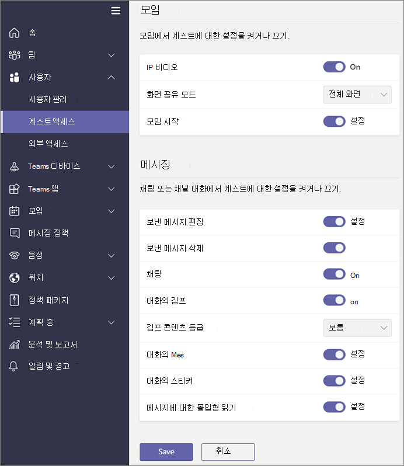

Microsoft 팀에서 게스트 액세스 관리
======================================

**게스트** 는 모든 Office 365 Business Premium, Office 365 Enterprise 및 Office 365 교육 구독에 포함 된 Microsoft 팀의 사용자/라이선스 유형입니다. 추가 Office 365 라이선스가 필요 하지 않습니다. 팀 게스트 액세스는 테 넌 트 수준 설정 이므로 기본적으로 꺼져 있습니다. 게스트 액세스를 사용 하도록 설정 하는 방법에 대 한 자세한 내용은 [Microsoft 팀에 대 한 게스트 액세스 설정 또는 해제](set-up-guests.md)를 참조 하세요.

**게스트** 사용자/라이선스 형식을 켠 후에는 [조직의 Microsoft 팀 설정 관리](enable-features-office-365.md) 에 설명 된 컨트롤을 통해 게스트에 대 한 설정을 구성 하 고 [새 Microsoft 팀으로 전환 하는 동안 팀을 관리할 수 있습니다. 관리 센터](manage-teams-skypeforbusiness-admin-center.md).     
    
IT 관리자는 테 넌 트 수준에서 게스트를 추가 하 고, 게스트 사용자 정책 및 사용 권한을 설정 및 관리 하 고, 게스트 사용자 활동에 대 한 보고서를 가져올 수 있습니다. 이러한 컨트롤은 Microsoft 팀 관리 센터를 통해 사용할 수 있습니다. 게스트 사용자 콘텐츠 및 활동은 Office 365의 나머지와 동일한 준수 및 감사 보호를 사용 합니다.

팀 소유자는 새 게스트를 초대 하 고 기존 디렉터리 게스트 사용자를 팀에 추가할 수 있습니다. 팀 소유자 **는 팀을** > **관리**하는 게스트 사용자를 식별 하 고, **조직 전체 설정** > **게스트 액세스**를 통해 guest에 대 한 채널 관련 기능을 설정 하 고, 게스트의 생성, 업데이트 및 사용을 허용할 수 있습니다. 다음 그림에 표시 된 대로 채널을 삭제 합니다.

  
Azure AD (Active Directory) 포털을 사용 하 여 게스트와 Office 365 및 팀 리소스에 대 한 액세스를 관리할 수 있습니다. 팀 게스트 액세스는 Azure AD business (B2B) 공동 작업 기능을 기본 인프라로 사용 하 여 id 속성, 멤버 자격, 다단계 인증 설정 등의 보안 원칙 정보를 저장 합니다. Azure AD B2B에 대 한 자세한 내용은 [AZURE AD b2b 공동 작업 이란 무엇 인가요?](https://go.microsoft.com/fwlink/p/?linkid=853011) [AZURE Active Directory B2B 공동 작업](https://go.microsoft.com/fwlink/p/?linkid=853020)에 대해 자세히 알아보세요.

> [!NOTE]
> Microsoft 팀은 테 넌 트에 대 한 게스트 사용자 추가를 허용 하거나 방지 하기 위해 항상 Azure AD 외부 설정을 따릅니다. 자세한 내용은 [Microsoft 팀에서 게스트 액세스 권한 부여](Teams-dependencies.md)를 참조 하세요.
  
## 게스트 액세스와 외부 액세스 (페더레이션) 비교

[!INCLUDE [guest-vs-external-access](includes/guest-vs-external-access.md)]

## 정기적으로 게스트 액세스 검토

팀에서 사용이 허가 된 각 사용자에 대해 5 개의 게스트를 추가할 수 있습니다. 이러한 제한 사항으로 인해 또는 테 넌 트를 최신 상태로 유지 하려는 경우 게스트 액세스를 정기적으로 검토 하 여 더 이상 필요 하지 않은 액세스 권한이 있는 사용자를 확인 해야 합니다. Azure AD를 사용 하 여 그룹 구성원 또는 응용 프로그램에 할당 된 사용자에 대 한 액세스 검토를 만들 수 있습니다. 되풀이 되는 access 리뷰를 만들면 시간을 절약할 수 있습니다. 응용 프로그램에 대 한 액세스 권한이 있거나 그룹의 구성원 인 사용자를 정기적으로 검토 해야 하는 경우 이러한 검토의 빈도를 정의할 수 있습니다. 

게스트 액세스 검토를 수행 하거나, 게스트에 게 자신의 구성원을 검토 하도록 요청 하거나, 응용 프로그램 소유자나 비즈니스 의사 결정권자에 게 액세스 검토를 수행 하도록 요청 합니다. Azure 포털을 사용 하 여 게스트 액세스 검토를 수행 합니다. 자세한 내용은 [AZURE AD access 리뷰를 사용 하 여 게스트 액세스 관리](https://docs.microsoft.com/en-us/azure/active-directory/governance/manage-guest-access-with-access-reviews)를 참조 하세요.

###  필요 조건

Microsoft Enterprise Mobility + Security, E5에 포함 되어 있는 Azure AD의 Premium P2 버전에서 Access 리뷰를 사용할 수 있습니다. 자세한 내용은 [Azure Active Directory 버전](https://docs.microsoft.com/en-us/azure/active-directory/fundamentals/active-directory-whatis)을 참조 하세요. 검토를 만들거나, 검토를 채우거 나, 액세스를 확인 하 여이 기능과 상호 작용 하는 각 사용자에 게 라이선스가 있어야 합니다.

팀에서 추가할 수 있는 관람객 수를 제한 하지 않습니다. 그러나 테 넌 트에 추가할 수 있는 총 게스트 수는 AAD 라이선스에서 허용 하는 것을 기반으로 합니다. 자세한 내용은 [AZURE AD B2B 공동 작업 라이선스](https://docs.microsoft.com/en-us/azure/active-directory/b2b/licensing-guidance)를 참조 하세요.

## 게스트 액세스 대기 시간

게스트 설정은 Azure AD에서 설정 됩니다. 변경 내용이 Office 365 조직에서 유효 하 게 유지 되려면 2 시간에서 24 시간 정도 걸립니다. 사용자가 팀에 게스트를 추가 하려고 할 때 "관리자에 게 문의" 라는 메시지가 표시 되 면 게스트 기능을 사용 하도록 설정 하지 않았거나 설정이 아직 유효 하지 않은 것일 수 있습니다.

## 추가 정보

PowerShell을 사용 하 여 게스트 액세스를 관리 하는 방법에 대 한 자세한 내용은 [powershell을 사용 하 여 팀의 게스트 액세스 제어를](guest-access-powershell.md)참조 하세요.

