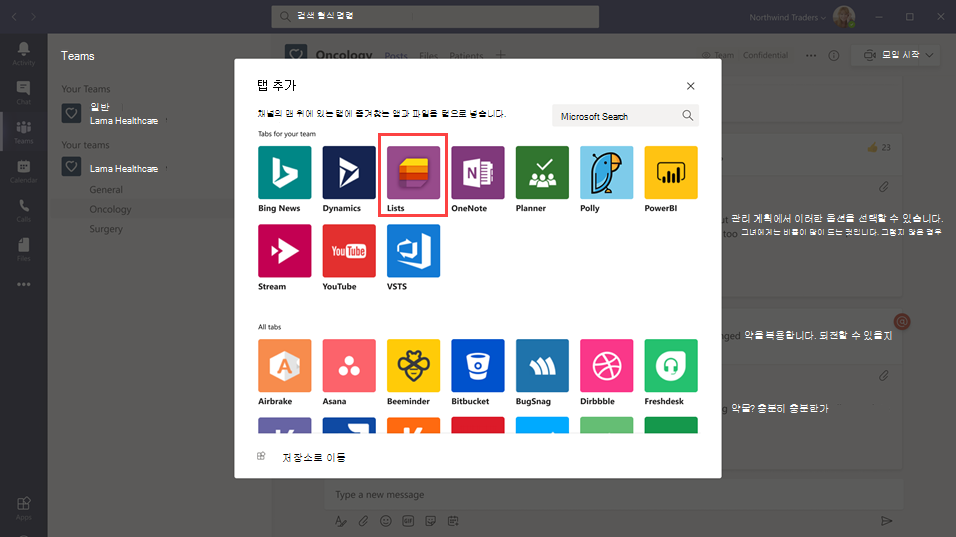

# Microsoft Teams에서 조직의 Lists 앱 관리

## 레이블 개요

Microsoft Teams의 Lists 앱을 사용하면 조직의 사용자가 정보를 추적하고, 작업을 구성하고, 워크플로를 관리할 수 있습니다. Lists를 통해 사용자는 사용자 지정 가능한 보기, 규칙, 알림을 사용하여 문제, 자산, 루틴, 연락처, 재고, 인시던트, 대출, 환자 등의 데이터를 추적하여 모든 사람을 팀에 동기화할 수 있습니다.

Teams에서 사용자는 채널의 탭에서 Lists에 액세스할 수 있습니다. 탭 갤러리를 열고 새 목록 앱 탭 인스턴스를 채널에 추가하여 시작하려면 선택합니다 **+** .

사용자는 새 목록을 만들거나 액세스 권한이 있는 동일한 팀 내에서 또는 다른 SharePoint 사이트에서 기존 목록을 고정할 수 있습니다. 새로운 목록은 처음부터 새로 작성하거나, 기본 제공 서식 파일, 기존 목록 구조에 따라 작성하거나, Excel 통합 문서에서 데이터를 가져와 작성할 수 있습니다. Lists 앱은 Teams 데스크톱, 웹 및 모바일 클라이언트에서 사용할 수 있습니다.

## 서식 파일

Lists의 서식 파일은 사용자에 대한 일반적인 정보 추적 시나리오에 맞게 조정됩니다. 각 서식 파일은 미리 정의된 목록 구조, 양식 레이아웃 및 서식 옵션이 모두 목록 보기 및 세부 정보 보기 수준으로 제공되어 사용자가 빠르게 시작할 수 있도록 합니다. 서식 파일을 선택하면 일부 샘플 데이터와 함께 목록의 모양을 미리 볼 수 있습니다. 다음은 조직의 팀에서 Lists에서 미리 정의된 서식 파일을 사용하는 방법에 대한 몇 가지 예입니다.

- 문제를 추적하고 문제 트래커 서식 파일을 사용하여 문제를 해결합니다.
- 이벤트 기간 서식 파일을 사용하여 모든 이벤트 세부 정보를 구성합니다.
- 환자 서식 파일을 사용하여 의료 조직에서 의료 팀의 환자 요구 및 상태를 기록하여 의료를 모니터링하고 조정합니다.
- 대출 서식 파일을 사용하여 대출 응용 프로그램의 상태를 추적합니다.

## 시나리오 예

지역 우체국은 지역 내 메일을 정렬하고 배달하는 업무를 담당합니다. 매일 아침, 우체국은 매일 목표를 검토하고, 공지 사항을 공유하고, 알려진 문제에 대해 눈의하는 팀이 있습니다.

메일 통신사는 메일 주소를 확인한 후 배달 경로를 시작합니다. 사고는 차량 사고, 개 관련 문제 또는 소셜 불안정 시위와 같은 경로를 따라 발생할 수 있습니다. 메일 통신사에서 인시던트가 발생하면 해당 모바일 장치에서 Teams를 사용하여 인시던트 세부 정보를 기록합니다. 인시던트 세부 정보는 팀 채널의 목록에서 추적됩니다. 현장에서 메일 통신 사업자 등 팀의 모든 사람이 이 정보를 보고 정보를 볼 수 있습니다.

Teams로 이동하기 전에 메일 운송업체는 우체국으로 돌아가서 인시던트를 보고하기 위해 하드 카피 양식을 작성해야 했고, 그런 다음 Excel 스프레드시트에 입력되었습니다. Teams는 메일 통신 사업자가 가장 먼저 목록을 사용하여 현장의 인시던트에 대해 보고하고, 팀 구성원과 사고 정보를 공유하고, 채널에서 해당 내용에 대한 대화를 나누고, 인시던트 해결을 위해 인시던트가 발생하게 하는 환경을 메일 통신사에 제공합니다.

## Lists에 대해 알아야 할 사항

### Lists는 모든 팀 및 채널에서 사용할 수 있습니다.

목록은 모든 Teams 사용자를 위해 미리 설치되어 있으며 모든 팀 및 채널의 탭 갤러리에서 직접 사용할 수 있습니다. 즉, 설치하기 위해 Teams 앱 스토어로 이동할 필요가 없습니다.

### Lists 및 SharePoint

Lists 데이터는 SharePoint Online 팀 사이트에 저장됩니다. Sharepoint Online과 Teams가 상호 작용하는 방법에 대한 자세한 내용은 [ShaprePoint Online과 비즈니스용 OneDrive가 Microsoft Teams와 상호 작용하는 방법](SharePoint-OneDrive-interact.md)을 참조하세요.

SharePoint에서 설정된 사용 권한은 Lists 앱에서 만든 목록에 적용됩니다. 기본적으로 목록은 속해 있는 사이트의 사용 권한을 상속합니다. 이러한 사용 권한은 사용자가 목록을 만들거나 편집할 수 있는지 여부와 같이 사용자가 수행할 수 있는 작업 유형에 따라 결정됩니다. 자세한 정보는 [SharePoint의 권한 정보](/sharepoint/understanding-permission-levels)와 [SharePoint Server의 사용자 권한 및 권한 수준](/sharepoint/sites/user-permissions-and-permission-levels)을 참조하세요.

특정 시나리오에서는 사용자가 목록에서 수행할 수 있는 작업을 제한할 수 있습니다. 예를 들어 팀의 한 사용자가 목록 보기를 편집하여 모든 팀 구성원에 대해 변경하고 팀 소유자 또는 특정 팀 구성원만 목록 보기를 편집할 수 있도록 허용합니다. 자세한 내용은 [SharePoint 목록 또는 라이브러리에 대한 사용 권한 사용자 지정](https://support.microsoft.com/office/customize-permissions-for-a-sharepoint-list-or-library-02d770f3-59eb-4910-a608-5f84cc297782#ID0EAACAAA=Online,_2019,_2016,_2013)을 참조하세요.

> [!NOTE]
> 이때 팀의 소유자 및 구성원 사용 권한은 목록 또는 Lists 앱의 동작을 변경하는 팀 사이트의 사용 권한에 어떤 방식으로도 연결되지 않습니다. 그러나 고객의 의견과 사용 현황을 기반으로 제품의 향후 이행에 고려됩니다.  

### 제한 사항

Lists를 통해 사용자는 데스크톱, 웹 및 모바일 환경을 사용할 수 있습니다. Teams 모바일 클라이언트의 목록을 사용하여 새 목록을 만들거나 기존 목록을 고정할 수 없습니다. Teams 모바일 클라이언트에서 목록을 보거나 편집하려면 먼저 Teams 데스크톱 또는 웹 클라이언트의 Lists를 사용하여 목록을 만들거나 추가해야 합니다.

게스트는 목록을 만들거나 삭제할 수 없습니다. 기존 목록에 목록 항목을 추가하고, 목록 항목에 대한 새 대화를 시작하고, 목록 항목에 대한 기존 대화에 회신할 수 있습니다.

### Lists 앱 및 SharePoint 앱

조직의 사용자가 SharePoint 앱을 사용하여 목록을 만든 경우 해당 목록은 사용자의 추가 작업 없이 자동으로 Lists로 이동됩니다. Teams에서 가장 풍부한 목록 통합 환경을 이용하려면 Lists 앱을 사용하여 기존 목록을 고정합니다.

## Lists 설정

### 조직에서 Lists를 사용 또는 사용하지 않도록 설정

Lists는 조직의 모든 Teams 사용자에 대해 기본적으로 사용하도록 설정됩니다. Microsoft Teams 관리자 센터의 [앱 관리](manage-apps.md) 페이지에서 조직 수준에서 앱을 끄거나 켤 수 있습니다.

1. Microsoft Teams 관리 센터의 왼쪽 창에서 **Teams 앱****관리 앱** > 으로 이동합니다.
2. 다음 중 하나를 수행합니다.

    - 조직의 목록을 해제하려면 목록 앱을 검색하고 선택한 다음 **차단** 을 선택합니다.
    - 조직의 목록을 켜려면 목록 앱을 검색하고 선택한 다음 **허용** 을 선택합니다.

### 조직의 특정 사용자에 대해 Lists를 사용 또는 사용하지 않도록 설정

조직의 특정 사용자가 Lists를 사용할 수 없도록 허용하거나 차단하려면 [앱 관리](manage-apps.md) 페이지에서 조직에 대해 Lists가 설정되어 있는지 확인한 다음 사용자 지정 앱 권한 정책을 만들어 사용자에게 할당합니다. 자세한 내용은 [Teams에서 앱 권한 정책 관리](teams-app-permission-policies.md)를 참조하세요.

## 목록 이벤트에 대한 감사 로그 검색

목록은 엔터프라이즈 수준 감사를 통해 사용하도록 설정되므로 보안 & 준수 센터의 감사 로그에서 목록 및 목록 항목 이벤트를 검색할 수 있습니다. 자세한 내용은 [보안 및 준수 센터에서 감사 로그 검색](/microsoft-365/compliance/search-the-audit-log-in-security-and-compliance)을 참조하세요.

Teams의 Lists 앱과 관련된 감사 이벤트 목록은[SharePoint 목록 활동](/microsoft-365/compliance/search-the-audit-log-in-security-and-compliance#sharepoint-list-activities)을 참조하세요.

감사 로그를 검색하려면 먼저 [보안 및 준수 센터](https://protection.office.com)에서 감사를 켜야 합니다. 감사 데이터는 감사가 켜진 시점부터만 사용할 수 있습니다.

## Power Automate, Power Apps 및 Graph API

Lists는 워크플로용 [Power Automate](/power-automate/flow-types) 및 목록 양식용 [Power Apps](/powerapps/maker/canvas-apps/customize-list-form)를 참조하세요. 개발자는 Microsoft Graph를 통해 [Lists API](/sharepoint/dev/sp-add-ins/working-with-lists-and-list-items-with-rest)를 사용하여 목록 데이터를 연결할 수 있습니다.

## 피드백을 제공하거나 문제 보고
  
피드백을 보내거나 문제를 보고하려면 Teams의 왼쪽 창 아래쪽에 있는 **도움말** 을 선택한 다음 **문제 보고를** 선택합니다. **Lists** 를 선택하고 현재 발생하는 문제에 대한 피드백이나 세부 정보를 입력합니다.

## 관련 기사

- [Lists도움말 문서](https://support.microsoft.com/office/apps-and-services-cc1fba57-9900-4634-8306-2360a40c665b#PickTab=Lists)
