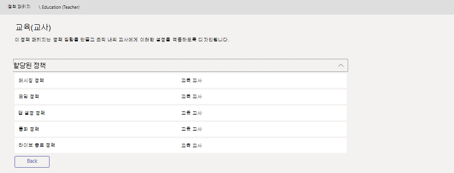

# Microsoft Teams에서 정책 패키지 관리

> [!NOTE]
> 이 문서에서 설명하는 기능 중 하나인 사용자 지정 정책 [패키지는](#custom-policy-packages)현재 비공개 미리 보기로 제공됩니다.

Microsoft Teams의 정책 패키지는 조직에서 유사한 역할을 가진 사용자에게 할당할 수 있는 미리 정의된 정책 및 정책 설정의 모음입니다. 조직 전체의 사용자 그룹에 대한 정책을 관리할 때 일관성을 제공, 간소화 및 지원하기 위한 정책 패키지를 구축했습니다.  

[Teams에 포함된](#policy-packages-included-in-teams) 정책 패키지를 사용하거나 사용자 지정 정책 패키지를 직접 만들 수 [있습니다(비공개](#custom-policy-packages) 미리 보기).

:::image type="content" source="media/policy-packages-admin-center.png" alt-text="관리 센터의 정책 패키지 페이지의 스크린샷":::

사용자의 요구에 맞게 정책 패키지에서 정책 설정을 사용자 지정할 수 있습니다. 패키지의 정책 설정을 변경하면 해당 패키지에 할당된 모든 사용자가 업데이트된 설정을 얻습니다. Microsoft Teams 관리 센터 또는 PowerShell을 사용하여 정책 패키지를 관리합니다.

## 정책 패키지란?

정책 패키지를 사용하면 조직 전체의 특정 사용자 집합을 허용하거나 제한하려는 Teams 기능을 제어할 수 있습니다. Teams의 각 정책 패키지는 사용자 역할을 중심으로 설계하고 해당 역할에 대한 일반적인 공동 작업 및 통신 활동을 지원하는 미리 정의된 정책 및 정책 설정을 포함합니다.

정책 패키지는 다음 Teams 정책 유형을 지원합니다.

- 메시징 정책
- 모임 정책
- 앱 설정 정책
- 통화 정책
- 라이브 이벤트 정책

## Teams에 포함된 정책 패키지

현재 팀은 다음과 같은 정책 패키지를 포함합니다.

|**패키지 이름**  |**설명** |
|---------|---------|
|교육(고등 교육 학생)    |고등 교육 학생들에게 적용되는 정책 및 정책 설정 집합을 만듭니다.|
|교육(초등학생)   |기본 학생에 적용되는 정책 및 정책 설정 집합을 만듭니다.|
|교육(중등학생)    |중등 학생에게 적용되는 정책 및 정책 설정 집합을 만듭니다.         |
|교육(교사)    |교사에게 적용되는 정책 및 정책 설정 집합을 만듭니다.      |
|교육(원격 학습을 사용하는 초등학교 교사)    |초등학교 교사에게 적용되는 정책 집합을 만들어 원격 학습을 사용할 때 학생의 보안 및 공동 작업을 극대화합니다.      |
|교육(원격 학습을 사용하는 초등학생)    |초등학교 학생에게 적용되는 정책 집합을 만들어 원격 학습을 사용할 때 학생의 보안 및 공동 작업을 극대화합니다.      |
|프런트라인 관리자 |정책 집합을 만들고 해당 설정을 조직의 Frontline 관리자에게 적용합니다. |
|프런트라인 작업자 |정책 집합을 만들고 조직의 Frontline 작업자에게 해당 설정을 적용합니다. |
|의료 임상 연구원  |등록된 간호사, 유료 간호사, 의사 및 사회복지사와 같은 의료진에게 채팅, 통화, 이동 관리 및 회의에 대한 완전한 액세스를 제공하는 정책 및 정책 설정을 만듭니다. |
|의료 정보 직원  |IT 직원, 정보 전문가, 재무 담당자 및 규정 준수 담당자와 같은 정보 직원에게 채팅, 통화 및 모임에 대한 전체 액세스 권한을 부여하는 정책 및 정책 설정 집합을 만듭니다.|
|의료 환자실  |의료 조직의 환자실에 적용되는 정책 및 정책 설정 집합을 만듭니다.|
|중소기업 사용자(비즈니스 음성) |비즈니스 음성 환경용 앱을 포함하는 앱 설정 정책을 만듭니다.|
|중소기업 사용자(비즈니스 음성이 없는 경우) |중소기업 Teams 사용자(비기업 음성 환경)에 관련된 앱 설정 정책을 만듭니다.
|공공 안전 책임자   |조직의 공공 안전 책임자에 적용되는 정책 및 정책 설정 집합을 만듭니다.|

> [!NOTE]
> Teams의 향후 릴리스에서 더 많은 정책 패키지가 추가될 예정이니 최신 정보를 다시 확인하세요.  

각 개별 정책은 정책 패키지의 이름이 지정되며 정책 패키지에 연결된 정책을 쉽게 식별할 수 있습니다.
예를 들어 학교의 교사에게 교육(교사) 정책 패키지를 할당하면 패키지의 각 정책에 대해 Education_Teacher 정책이 만들어집니다.

## 사용자 지정 정책 패키지

**이 기능은 비공개 리미 보기에 있습니다.**

사용자 지정 정책 패키지를 사용하면 조직에서 비슷한 역할을 하는 사용자에 대한 자체 정책 집합을 번들로 만들 수 있습니다. 필요한 정책 유형 및 정책을 추가하여 사용자만의 정책 패키지를 만들 수 있습니다.

새 사용자 지정 정책 패키지를 만들 경우:

1. Microsoft Teams 관리 센터의 왼쪽 탐색에서 정책 패키지를 **선택한** 다음 **추가를 클릭합니다.**
    :::image type="content" source="media/policy-packages-add.png" alt-text="관리 센터의 정책 패키지 페이지의 추가 단추 스크린샷":::
2. 패키지에 대한 이름과 설명을 입력합니다.
    :::image type="content" source="media/policy-packages-add-custom.png" alt-text="새 사용자 지정 정책 패키지 추가 스크린샷":::
3. 패키지에 포함할 정책 형식 및 정책 이름을 선택합니다.
4. **저장** 을 클릭합니다.

## 정책 패키지를 사용하는 방법

다음에서는 조직에서 정책 패키지를 사용하는 방법을 간략하게 설명합니다.

- **[보기](#view-the-settings-of-a-policy-in-a-policy-package)**: 정책 패키지에서 정책을 본다. 그런 다음 패키지를 할당하기 전에 패키지의 각 정책 설정을 확인합니다. 각 설정을 이해해야 합니다. 미리 정의된 값이 조직에 적합한지 또는 조직의 요구에 따라 더 제한적이거나 부적격으로 변경해야 하는지 여부를 결정합니다.

    정책이 삭제된 경우 설정을 계속 볼 수 있지만 설정을 변경할 수 없습니다. 정책 패키지를 할당할 때 미리 정의된 설정으로 삭제된 정책이 다시 만들어집니다.

- **[사용자 지정](#customize-policies-in-a-policy-package)**: 조직의 요구에 맞게 정책 패키지의 정책 설정을 사용자 지정합니다.

- **[할당](#assign-a-policy-package)**: 사용자에게 정책 패키지를 할당합니다.  

> [!NOTE]
> 패키지를 할당한 후 정책 패키지에서 정책 설정을 변경할 수 있습니다. 정책 설정에 대한 모든 변경 내용은 패키지가 할당된 사용자에게 자동으로 적용됩니다.

다음은 Microsoft Teams 관리 센터에서 정책 패키지를 보고, 할당하고, 사용자 지정하는 방법에 대한 단계입니다.

### 정책 패키지에서 정책 설정 보기

1. Microsoft Teams 관리 센터의 왼쪽 탐색에서 정책 패키지를 선택한 다음, 패키지 이름의 왼쪽을 클릭하여 정책 패키지를 선택합니다. 
2. 볼 정책을 클릭합니다.

### 정책 패키지에서 정책 사용자 지정

정책 패키지 페이지를 통해 또는  Microsoft Teams 관리 센터의 정책 페이지로 직접 이동하여 정책 설정을 편집할 수 있습니다.

1. Microsoft Teams 관리 센터의 왼쪽 탐색에서 다음 중 하나를 합니다.
    - 정책 **패키지를** 클릭한 다음 패키지 이름의 왼쪽을 클릭하여 정책 패키지를 선택합니다.
    - 정책 유형을 클릭합니다.  예를 들어 메시징 정책을 **클릭합니다.**
2. 편집할 정책을 선택합니다. 정책 패키지에 연결된 정책의 이름은 정책 패키지와 동일합니다.
3. 원하는 내용을 변경한 다음 저장을 **클릭합니다.**

### 정책 패키지 할당 

#### 한 사용자에게 정책 패키지 할당

1. Microsoft Teams 관리 센터의 왼쪽 탐색 창에서 **사용자** 로 이동한 후 해당 사용자를 클릭합니다.
2. 사용자의 페이지에서 정책을 클릭한 다음 정책 패키지 옆에 **있는** 편집을 **클릭합니다.**
3. 정책 **패키지** 할당 창에서 할당할 패키지를 선택한 다음 저장을 **클릭합니다.**

#### 여러 사용자에게 정책 패키지 할당

1. Microsoft Teams 관리 센터의 왼쪽 탐색에서 정책 패키지로 이동한 다음, 패키지 이름의 왼쪽을 클릭하여 할당할 정책 패키지를 선택합니다.
2. 사용자 **관리를 클릭합니다.**
3. **사용자 관리** 창에서 표시 이름 또는 사용자 이름으로 사용자를 검색하고 이름을 선택한 후 **추가** 를 클릭합니다. 추가할 각 사용자에 대해 이 단계를 반복합니다.
4. 사용자 추가가 완료되면 저장 을 **클릭합니다.**

#### 그룹에 정책 패키지 할당

그룹에 정책 패키지 할당을 사용하면 보안 그룹이나 배포 목록과 같은 사용자 그룹에 여러 정책을 할당할 수 있습니다. 정책 할당은 선행 규칙에 따라 그룹의 구성원에게 전파됩니다. 그룹에서 구성원이 추가되거나 제거되면 상속된 정책 할당이 그에 따라 업데이트됩니다. 이 방법은 최대 50,000명의 사용자가 있는 그룹에 적합하지만, 더 큰 그룹에도 적용됩니다.

자세한 내용은 [그룹에 정책 패키지 할당](assign-policies.md#assign-a-policy-package-to-a-group)을 참조하세요.

#### 대규모 사용자 집합(배치)에 정책 패키지 할당

한 번에 많은 사용자에게 정책 패키지를 할당하려면 배치 정책 패키지를 사용합니다. [New-CsBatchPolicyPackageAssignmentOperation](/powershell/module/teams/new-csbatchpolicypackageassignmentoperation) cmdlet을 사용하여 대규모 사용자와 할당하려는 정책 패키지를 제출합니다. 할당은 백그라운드 작업으로 처리되고 각 배치에 작업 ID가 생성됩니다.

배치에는 최대 5천 명의 사용자가 포함될 수 있습니다. 개체 ID, UPN, SIP 주소 또는 전자 메일 주소로 사용자를 지정할 수 있습니다. 자세한 내용은 [배치 사용자에게 정책 패키지 할당](assign-policies.md#assign-a-policy-package-to-a-batch-of-users)을 참조하세요.

## 문제 해결

**정책 패키지를 할당할 때 오류가 발생합니다.**

패키지의 하나 이상의 정책이 만들어지거나 성공적으로 적용되지 않은 경우 이 문제가 발생할 수 있습니다. 사용자에게 정책 패키지를 다시 재할당합니다. 작업을 다시 시도하는 경우 일반적으로 이 문제가 해결됩니다.

## 관련 항목

[Teams에서 사용자에게 정책 할당](assign-policies.md)

[EDU 관리자에 대한 Teams 정책 패키지](policy-packages-edu.md)

[의료용 Teams 정책 패키지](policy-packages-healthcare.md)

[정부용 Teams 정책 패키지](policy-packages-gov.md)