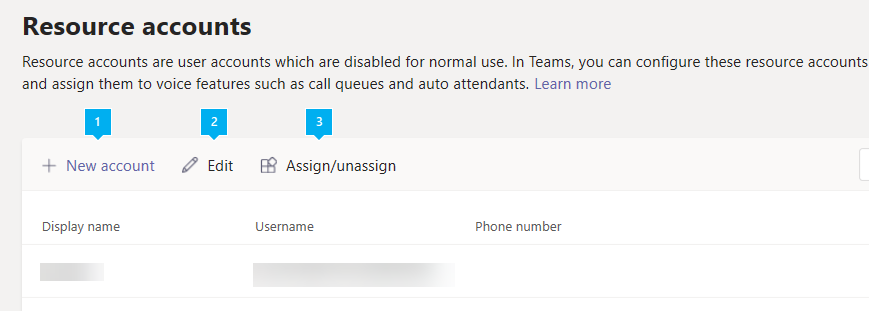
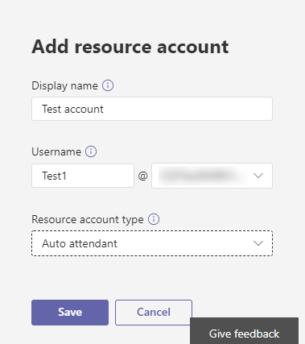

# <a name="manage-resource-accounts-in-microsoft-teams"></a>Microsoft Teams에서 리소스 계정 관리

리소스 계정은 Azure AD의 *비활성 사용자 개체* 라고도 하며 일반적인 리소스를 나타내는 데 사용 될 수 있습니다. Exchange에서 회의실을 나타내는 데 사용 될 수 있으며, 예를 들어 전화 번호를 받을 수 있습니다. Microsoft 365 또는 구내에서 비즈니스용 Skype Server 2019를 사용 하 여 리소스 계정을 설정할 수 있습니다.

Microsoft 팀 또는 비즈니스용 Skype Online에서는 연결 된 리소스 계정이 하나 이상 있어야 하는 각 전화 시스템 통화 큐 또는 자동 전화 교환이 필요 합니다. 자원 계정이 지정 된 전화 번호에 필요한 지 여부는 다음 다이어그램에 표시 된 것 처럼 관련 통화 대기열 또는 자동 전화 교환의 용도에 따라 달라 집니다. 전화 번호를 리소스 계정에 할당 하기 전에이 문서의 맨 아래에 연결 된 통화 대기열 및 자동 전화 교환 문서를 참조할 수도 있습니다.


> [!NOTE]
> 이 문서는 Microsoft 팀과 비즈니스용 Skype Online에 모두 적용 됩니다. 비즈니스용 Skype 서버 2019에 홈으로 표시 되는 리소스 계정의 경우 [리소스 계정 구성을](/SkypeForBusiness/hybrid/configure-onprem-ra)참조 하세요.

## <a name="assign-a-phone-number-to-a-phone-system-call-queue"></a>전화 시스템 통화 대기열에 전화 번호 지정

조직에서 이미 하나 이상의 전화 시스템 라이선스를 사용 하 고 있는 경우 전화 시스템 통화 대기열에 전화 번호를 지정 하는 절차는 다음과 같습니다.

1. 서비스 번호를 가져옵니다.
2. 무료 전화 시스템- [가상 사용자 라이선스](teams-add-on-licensing/virtual-user.md) 또는 리소스 계정이 나 전화 시스템 라이선스와 함께 사용 하는 유료 전화 시스템 라이선스를 취득 하세요.
3. 자원 계정을 만듭니다. 연결 된 리소스 계정이 있는 경우 자동 전화 교환 또는 통화 대기열이 필요 합니다.
4. 전화 시스템 또는 전화 시스템-가상 사용자 라이선스를 리소스 계정에 할당 합니다.
5. 방금 라이선스를 할당 한 리소스 계정에 서비스 전화 번호를 할당 합니다.
6. 전화 시스템 통화 대기열 또는 자동 전화 교환 만들기
7. 통화 대기열 또는 자동 전화 교환과 함께 리소스 계정을 연결 합니다.

<!-- Auto attendants created after November 1st, 2019 also create a new resource account that is associated with the auto attendant. If a phone number is applied to the auto attendant's resource account,  a Phone System - Virtual user license is applied to the resource account if one is available. -->

자동 전화 교환 또는 통화 대기열이 최상위 수준 자동 전화 교환 아래에 중첩 되는 경우 연결 된 리소스 계정은 자동 전화 교환 및 통화 대기열의 구조에 여러 항목을 입력 하려는 경우에만 전화 번호를 필요로 합니다.

온라인 상태인 조직 내 사용자에 게 통화를 리디렉션하려면 **전화 시스템** 라이선스가 있어야 하며 Enterprise Voice를 사용 하도록 설정 되어 있거나 Office 365 통화 계획이 있어야 합니다. [Microsoft 팀 추가 기능 라이선스 할당](teams-add-on-licensing/assign-teams-add-on-licenses.md)을 참조 하세요. 엔터프라이즈 음성에 대해 사용 하도록 설정 하려면 Windows PowerShell을 사용 하면 됩니다. 예를 들어 다음을 실행 합니다.`Set-CsUser -identity "Amos Marble" -EnterpriseVoiceEnabled $true`

> [!WARNING]
> 자원 계정 관련 문제가 발생 하지 않도록 하려면 다음 단계를 순서 대로 수행 합니다.

생성 하는 전화 시스템 통화 대기열 또는 자동 전화 교환이 중첩 되 고 전화 번호가 필요 하지 않은 경우 프로세스는 다음과 같습니다.

1. 자원 계정 만들기
2. 전화 시스템 통화 대기열 또는 자동 전화 교환 만들기
3. 전화 시스템에 리소스 계정 연결 통화 대기열 또는 자동 전화 교환

### <a name="create-a-resource-account-with-a-phone-number"></a>전화 번호를 사용 하 여 자원 계정 만들기

<a name="phonenumber"> </a>

> [!IMPORTANT]
> 전화 번호는 자동 전화 교환 또는 통화 대기열에 직접 할당 되지 않고 자동 전화 교환 또는 통화 대기열에 연결 된 리소스 계정으로 지정 됩니다.

최상위 자동 전화 교환 또는 통화 대기열이 있으면 전화 번호를 자동 전화 교환에 연결 해야 합니다. 전화 번호를 사용 하는 리소스 계정을 만들기 위해 프로세스는 다음과 같습니다.

1. 무료 또는 유료 서비스 번호를 사용 하거나 포트를 구입 합니다. 다른 음성 서비스나 리소스 계정에 번호를 배정할 수 없습니다.

   리소스 계정에 전화 번호를 지정 하기 전에 기존의 유료 또는 무료 서비스 번호를 가져오거나 이식 해야 합니다. 무료 또는 무료 서비스 전화 번호를 얻은 후에는 **Microsoft 팀 관리 센터**  >  **음성**  >  **전화 번호로**표시 되며, **번호 유형이** 서비스로 나열 됩니다 ( **무료)**. 서비스 번호를 얻으려면 [서비스 전화 번호 가져오기를](getting-service-phone-numbers.md) 참조 하거나 기존 서비스 번호를 전송 하려는 경우 [전화 번호를 팀에 게 양도](phone-number-calling-plans/transfer-phone-numbers-to-teams.md)를 참조 하세요.

   리소스 계정에 전화 번호를 지정 하는 경우, 이제 비용 무료 전화 시스템 가상 사용자 라이선스를 사용할 수 있습니다. 이렇게 하면 조직 수준에서 전화 시스템 기능을 전화 번호에 제공 하 고 자동 전화 교환 및 통화 대기열 기능을 만들 수 있습니다.

2. 전화 시스템 가상 사용자 라이선스 또는 일반 전화 시스템 라이선스를 얻습니다.

   가상 사용자 라이선스를 얻으려면 Microsoft 365 관리 센터에서 **청구**  >  **구입 서비스**  >  **추가 기능 구독** 으로 이동 하 여 끝으로 스크롤합니다. "전화 시스템-가상 사용자" 라이선스가 표시 됩니다. **지금 구입**을 선택 합니다. 비용이 0 인 경우에도 다음 단계를 따라 라이선스를 취득 해야 합니다.
3. 새 자원 계정을 만듭니다. [Microsoft 팀 관리 센터에서 자원 계정 만들기](#create-a-resource-account-in-microsoft-teams-admin-center) 또는 [Powershell에서 리소스 계정 만들기](#create-a-resource-account-in-powershell)를 참조 하세요.
4. 전화 시스템- [가상 사용자 라이선스](teams-add-on-licensing/virtual-user.md) 또는 전화 시스템 라이선스를 리소스 계정에 할당 합니다. [한 명의 사용자에 게](https://docs.microsoft.com/office365/admin/subscriptions-and-billing/assign-licenses-to-users?redirectSourcePath=%252farticle%252f997596b5-4173-4627-b915-36abac6786dc&view=o365-worldwide#assign-licenses-to-one-user) [Microsoft 팀 추가 기능 라이선스 할당](teams-add-on-licensing/assign-teams-add-on-licenses.md) 및 라이선스 할당을 참조 하세요.
5. 서비스 번호를 리소스 계정에 할당 합니다. [전화 번호 및 서비스 할당/할당 취소를](#assignunassign-phone-numbers-and-services)참조 하세요.
6. 다음 중 하나를 설정 합니다.
   - [클라우드 자동 전화 교환](create-a-phone-system-auto-attendant.md)
   - [클라우드 통화 대기열](create-a-phone-system-call-queue.md)
7. 자동 전화 교환 또는 통화 대기열에 리소스 계정을 연결 합니다. [전화 번호 및 서비스 할당/할당 취소를](#assignunassign-phone-numbers-and-services) 참조 하세요.

자동 전화 교환을 만드는 동안 리소스 계정을 만들면 라이선스가 자동으로 적용 됩니다.

### <a name="create-a-resource-account-without-a-phone-number"></a>전화 번호 없이 자원 계정 만들기

중첩 된 자동 전화 교환 또는 통화 대기열에는 리소스 계정이 필요 하지만 대부분의 경우 해당 리소스 계정은 전화 번호와 전화 번호를 지 원하는 데 필요한 라이선스가 필요 하지 않습니다. 전화 번호가 필요 하지 않은 리소스 계정을 만들려면 다음 작업을 순서 대로 수행 해야 합니다.

1. 새 자원 계정을 만듭니다. [Microsoft 팀 관리 센터에서 자원 계정 만들기](#create-a-resource-account-in-microsoft-teams-admin-center) 또는 [Powershell에서 리소스 계정 만들기](#create-a-resource-account-in-powershell)를 참조 하세요.
2. 다음 중 하나를 설정 합니다.
   - [클라우드 자동 전화 교환](create-a-phone-system-auto-attendant.md)
   - [클라우드 통화 대기열](create-a-phone-system-call-queue.md)
3. 통화 대기열 또는 자동 전화 교환에 리소스 계정을 할당 합니다. [전화 번호 및 서비스 할당/할당 취소를](#assignunassign-phone-numbers-and-services)참조 하세요.


## <a name="create-a-resource-account-in-microsoft-teams-admin-center"></a>Microsoft 팀 관리 센터에서 자원 계정 만들기

전화 시스템 라이선스를 구매한 후 Microsoft 팀 관리 센터를 사용 하 여 **조직 전체 설정**  >  **리소스 계정**으로 이동 합니다.




새 리소스 계정을 만들려면 **+ 추가**를 클릭 합니다. 팝업 창에서 **표시 이름**, **사용자 이름** (도메인 이름)을 자동으로 채워야 함) 및 리소스 계정의 **리소스 계정 종류** 를 입력 합니다. 리소스 계정 종류는 리소스 계정에 연결 하려는 앱에 따라 **자동 전화 교환** 또는 **통화 대기열** 이 될 수 있습니다. 준비가 되 면 **저장**을 클릭 합니다.



다음으로 [Office 365의 비즈니스용 사용자에 게 라이선스 할당](https://docs.microsoft.com/office365/admin/subscriptions-and-billing/assign-licenses-to-users?view=o365-worldwide)에서 설명한 대로 O365 관리 센터의 리소스 계정에 라이선스를 적용 합니다.

### <a name="edit-resource-account"></a>자원 계정 편집 

 **편집** 옵션을 사용 하 여 리소스 계정 **표시 이름** 및 **리소스 계정** 유형을 편집할 수 있습니다. 완료 되 면 **저장** 을 클릭 합니다.


<a name="phonenumber"> </a>

### <a name="assignunassign-phone-numbers-and-services"></a>전화 번호 및 서비스 할당/할당 취소

 리소스 계정을 생성 하 고 라이선스를 할당 한 후에는 **할당/할당** 취소를 클릭 하 여 리소스 계정에 서비스 번호를 할당 하거나, 전화 번호 유형을 설정 하거나, 이미 존재 하는 특정 자동 전화 교환 또는 통화 대기열에 리소스 계정을 할당할 수 있습니다. 직접 라우팅 번호 지정은 Cmdlet을 사용 하 여 수행할 수 있습니다. 리소스 계정에 연결할 통화 대기열 또는 자동 전화 교환을 아직 만들지 않은 경우에는 해당 필드를 비워 둡니다. 생성 하는 동안 리소스 계정을 연결할 수 있습니다. 완료 되 면 **저장** 을 클릭 합니다.

**전화 번호 형식** 에 대 한 옵션은 다음과 같습니다.

- 없음
- 온라인
- 무료
- 온-프레미스


리소스 계정에 직접 라우팅 또는 하이브리드 번호를 할당 하려면 PowerShell을 사용 해야 합니다. 다음 섹션을 참조 하세요.

> [!IMPORTANT]
> 리소스 계정에 유효한 라이선스가 없는 경우 리소스 계정에 전화 번호를 할당 하려고 하면 내부 검사에서 오류가 발생 합니다. 번호를 할당 하거나 리소스 계정을 통화 대기열 또는 자동 전화 교환에 연결할 수 없습니다.

> [!IMPORTANT]
> 전화 번호는 자동 전화 교환 또는 통화 대기열에 직접 할당 되지 않고 자동 전화 교환 또는 통화 대기열에 연결 된 리소스 계정으로 지정 됩니다.


## <a name="change-an-existing-resource-account-to-use-a-virtual-user-license"></a>가상 사용자 라이선스를 사용 하도록 기존 리소스 계정 변경

기존 리소스 계정의 라이선스를 전화 시스템 라이선스에서 가상 사용자 라이선스로 전환 하려는 경우 무료 가상 사용자 라이선스를 취득 한 다음 Microsoft 365 관리 센터의 연결 된 단계에 따라 [사용자를 다른 구독으로 이동](https://docs.microsoft.com/office365/admin/subscriptions-and-billing/assign-licenses-to-users?redirectSourcePath=%252farticle%252f997596b5-4173-4627-b915-36abac6786dc&view=o365-worldwide#move-users-to-a-different-subscription)해야 합니다. 

> [!WARNING]
> 항상 전체 전화 시스템 라이선스를 제거 하 고 동일한 라이선스 활동에 가상 사용자 라이선스를 할당 합니다. 이전 라이선스를 제거 하 고, 계정 변경 내용을 저장 하 고, 새 라이선스를 추가한 다음 계정 설정을 다시 저장 하면 리소스 계정이 더 이상 예상 대로 작동 하지 않을 수 있습니다. 이 문제가 발생 하는 경우 가상 사용자 라이선스에 대 한 새 리소스 계정을 만들고 끊어진 리소스 계정을 제거 하는 것이 좋습니다. 

## <a name="create-a-resource-account-in-powershell"></a>Powershell에서 리소스 계정 만들기

리소스 계정이 온라인 상태 인지 또는 비즈니스용 Skype Server 2019에 따라 관리자 권한을 사용 하 여 적절 한 Powershell 프롬프트에 연결 해야 합니다.

- 다음 Powershell cmdlet 예제에서는 [새 CsOnlineApplicationInstance](https://docs.microsoft.com/powershell/module/skype/new-CsOnlineApplicationInstance?view=skype-ps)를 사용 하 여 온라인으로 리소스 계정을 만드는 방법을 보여 줍니다. 

- 클라우드 통화 대기열 및 클라우드 자동 전화 교환에 사용할 수 있는 비즈니스용 Skype Server 2019에 있는 리소스 계정의 경우 [클라우드 통화 대기열 계획](/SkypeforBusiness/hybrid/plan-call-queue) 또는 [클라우드 자동 전화 교환 계획](/SkypeForBusiness/hybrid/plan-cloud-auto-attendant)을 참조 하세요. 하이브리드 구현 (직접 라우팅에 있는 숫자)은 온-프레미스 비즈니스용 Skype Server 2019 서버에서 [CsHybridApplicationEndpoint](https://docs.microsoft.com/powershell/module/skype/new-cshybridapplicationendpoint?view=skype-ps) cmdlet을 사용 하 여 구성 됩니다.

응용 프로그램 인스턴스를 만들 때 사용 해야 하는 응용 프로그램 ID는 다음과 같습니다.

- **자동 전화 교환:** ce933385-9390-45d1-9512-c8d228074e07
- **통화 대기열:** 11cd3e2e-fccb-42ad-ad00-878b93575e07

> [!NOTE]
> Skype For Business Server 2019 사용자가 통화 대기열 또는 자동 전화 교환을 검색 가능 하 게 하려면 온라인 리소스 계정이 Active Directory로 동기화 되지 않으므로 비즈니스용 Skype Server 2019에서 리소스 계정을 만들어야 합니다. Sipfederationtls 용 DNS SRV 레코드가 비즈니스용 Skype Server 2019에서 해결 되 면 SfB Management shell을 사용 하 여 비즈니스용 Skype Server 2019에서 리소스 계정을 만들고 온라인 Azure AD와 동기화 **해야 합니다** .

 

1. 자동 전화 교환에 사용할 리소스 계정을 온라인으로 만들려면 다음 명령을 사용 합니다.

    ``` Powershell
    New-CsOnlineApplicationInstance -UserPrincipalName testra1@contoso.com -ApplicationId "ce933385-9390-45d1-9512-c8d228074e07" -DisplayName "Resource account 1"
    ```

2. 라이선스를 적용 하기 전에는 리소스 계정을 사용할 수 없습니다. O365 관리 센터의 계정에 라이선스를 적용 하는 방법에 대 한 자세한 내용은 [Office 365에서 비즈니스용 사용자에](https://docs.microsoft.com/office365/admin/subscriptions-and-billing/assign-licenses-to-users?view=o365-worldwide#assign-licenses-to-one-user) 게 라이선스 할당 및 비즈니스용 [Skype 라이선스 할당](https://docs.microsoft.com/skypeforbusiness/skype-for-business-and-microsoft-teams-add-on-licensing/assign-skype-for-business-and-microsoft-teams-licenses)을 참고 하세요.

3. ) 자원 계정에 올바른 라이선스가 적용 되 면 아래와 같이 리소스 계정에 전화 번호를 할당할 수 있습니다. 일부 자원 계정에는 전화 번호가 필요 하지 않습니다. 자원 계정에 라이선스를 적용 하지 않은 경우에는 전화 번호 할당이 실패 합니다.

   ``` Powershell
   Set-CsOnlineVoiceApplicationInstance -Identity testra1@contoso.com -TelephoneNumber +14255550100
   Get-CsOnlineTelephoneNumber -TelephoneNumber +14255550100
   ```

   이 명령에 대 한 자세한 내용은 [Set-CsOnlineVoiceApplicationInstance](https://docs.microsoft.com/powershell/module/skype/set-csonlinevoiceapplicationinstance?view=skype-ps) 을 참조 하세요.

   > [!NOTE]
   > 앞에서 설명한 대로 Microsoft 팀 관리 센터를 사용 하 여 온라인 전화 번호를 설정 하는 것이 가장 쉽습니다.

   Microsoft 팀 또는 비즈니스용 Skype Server 2019에 있는 리소스 계정에 직접 라우팅 전화 번호를 할당 하려면 비즈니스용 Skype Online Powershell에 다음 cmdlet을 사용 합니다.

   ``` Powershell
   Set-CsOnlineApplicationInstance -Identity appinstance01@contoso.com -OnpremPhoneNumber +14250000000
   ```

## <a name="manage-resource-account-settings-in-microsoft-teams-admin-center"></a>Microsoft 팀 관리 센터에서 자원 계정 설정 관리

Microsoft 팀 관리 센터에서 자원 계정 설정을 관리 하려면 **조직 전체 설정**  >  **리소스 계정**으로 이동 하 여 설정을 변경 하는 데 필요한 리소스 계정을 선택한 다음 **편집** 단추를 클릭 합니다. **리소스 계정 편집** 화면에서 다음 설정을 변경할 수 있습니다.

- 계정의 **표시 이름**
- 계정을 사용 하는 통화 대기열 또는 자동 전화 교환
- 계정에 할당 된 전화 번호

완료 되 면 **저장**을 클릭 합니다.

## <a name="delete-a-resource-account"></a>자원 계정 삭제

서비스 번호가 보류 모드에서 중지 되지 않도록 하려면 먼저 리소스 계정에서 전화 번호를 분리 하 여 삭제 해야 합니다. 다음 이상 기능을 사용 하 여이 작업을 수행할 수 있습니다.

``` Powershell
Set-CsOnlineVoiceApplicationInstance -Identity <Resource Account oid> -TelephoneNumber $null
```

이렇게 하면 사용자 탭의 O365 관리 포털에서 리소스 계정을 삭제할 수 있습니다.

리소스 계정에서 직접 라우팅 전화 번호의 연관을 해제 하려면 다음 cmdlet을 사용 합니다.

``` Powershell
Set-CsOnlineApplicationInstance -Identity  <Resource Account oid> -OnpremPhoneNumber ""
```

## <a name="troubleshooting"></a>문제 해결

팀 관리 센터에서 자원 계정에 할당 된 전화 번호가 표시 되지 않고 해당 번호를 할당할 수 없는 경우 다음 사항을 확인 하세요.

``` Powershell
Get-MsolUser -UserPrincipalName "username@contoso.com"| fl objectID,department
```

부서 특성에 비즈니스용 Skype 응용 프로그램 종점이 표시 되는 경우 아래에서 cmdlet을 실행 하세요.

``` Powershell
Set-MsolUser -ObjectId -Department "Microsoft Communication Application Instance"
```

> [!NOTE]
> Cmldet을 실행 한 후 팀 관리 센터 웹 페이지를 새로 고치면 번호를 올바르게 할당할 수 있습니다.

## <a name="related-information"></a>관련 정보

비즈니스용 Skype 서버와 혼성으로 구현 하는 경우:

   [클라우드 자동 전화 교환 계획](/SkypeForBusiness/hybrid/plan-cloud-auto-attendant)
  
   [클라우드 통화 큐 계획](/SkypeforBusiness/hybrid/plan-call-queue)
   
   [프레미스 리소스 계정 구성](/SkypeForBusiness/hybrid/configure-onprem-ra)


팀 또는 비즈니스용 Skype Online에서의 구현:

   [클라우드 자동 전화 교환이란?](what-are-phone-system-auto-attendants.md)

   [클라우드 자동 전화 교환 설정](/microsoftteams/create-a-phone-system-auto-attendant)

   [소규모 기업 예제 - 자동 전화 교환 설정](/microsoftteams/tutorial-org-aa)

   [클라우드 통화 큐 만들기](/SkypeForBusiness/what-is-phone-system-in-office-365/create-a-phone-system-call-queue)

[새로운 CsHybridApplicationEndpoint](https://docs.microsoft.com/powershell/module/skype/new-cshybridapplicationendpoint?view=skype-ps)

[새로운 CsOnlineApplicationInstance](https://docs.microsoft.com/powershell/module/skype/new-csonlineapplicationinstance?view=skype-ps)

[새로운 CsOnlineApplicationInstanceAssociation](https://docs.microsoft.com/powershell/module/skype/new-csonlineapplicationinstanceassociation?view=skype-ps)

[전화 시스템-가상 사용자 라이선스](teams-add-on-licensing/virtual-user.md)
