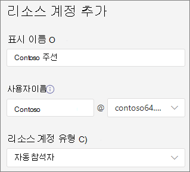

# <a name="manage-resource-accounts-in-microsoft-teams"></a><span data-ttu-id="d963b-103">Microsoft Teams에서 리소스 계정 관리</span><span class="sxs-lookup"><span data-stu-id="d963b-103">Manage resource accounts in Microsoft Teams</span></span>

<span data-ttu-id="d963b-104">리소스 계정은 Azure AD의 비활성 사용자 개체 이며 일반적인 리소스를 나타내는 데 사용 될 수 있습니다.</span><span class="sxs-lookup"><span data-stu-id="d963b-104">A resource account is a disabled user object in Azure AD, and can be used to represent resources in general.</span></span> <span data-ttu-id="d963b-105">예를 들어 Exchange에서 리소스 계정을 사용 하 여 회의실을 나타내고 전화 번호와 일정을 가질 수 있습니다.</span><span class="sxs-lookup"><span data-stu-id="d963b-105">For example, a resource account may be used in Exchange to represent conference rooms and allow them to have a phone number and calendar.</span></span> <span data-ttu-id="d963b-106">Microsoft 365 또는 구내에서 비즈니스용 Skype Server 2019를 사용 하 여 리소스 계정을 설정할 수 있습니다.</span><span class="sxs-lookup"><span data-stu-id="d963b-106">A resource account can be homed in Microsoft 365 or on premises using Skype for Business Server 2019.</span></span>

<span data-ttu-id="d963b-107">Microsoft 팀에서는 각 자동 전화 교환 또는 통화 대기열에 대해 리소스 계정이 필요 합니다.</span><span class="sxs-lookup"><span data-stu-id="d963b-107">In Microsoft Teams, a resource account is required for each auto attendant or call queue.</span></span> <span data-ttu-id="d963b-108">또한 리소스 계정에는 서비스 전화 번호를 할당할 수 있습니다.</span><span class="sxs-lookup"><span data-stu-id="d963b-108">Resource accounts may also be assigned service telephone numbers.</span></span> <span data-ttu-id="d963b-109">전화 번호를 자동 전화 교환에 할당 하 고 외부 팀의 호출자가 자동 전화 교환 또는 통화 대기열에 도달할 수 있도록 하는 방법입니다.</span><span class="sxs-lookup"><span data-stu-id="d963b-109">This is how you assign phone numbers to auto attendants and call queues allowing callers from outside Teams to reach the auto attendant or call queue.</span></span>

<span data-ttu-id="d963b-110">이 문서에서는 자동 전화 교환 및 통화 대기열에 사용할 수 있도록 리소스 계정을 만들고 준비 하는 방법에 대해 설명 합니다.</span><span class="sxs-lookup"><span data-stu-id="d963b-110">This article covers how to create resource accounts and ready them for use with auto attendants and call queues.</span></span>

<span data-ttu-id="d963b-111">이 문서의 절차를 시작 하기 전에 다음을 완료 했는지 확인 합니다.</span><span class="sxs-lookup"><span data-stu-id="d963b-111">Before you start the procedures in this article, ensure you've done the following:</span></span>

- [<span data-ttu-id="d963b-112">가상 사용자 라이선스 획득</span><span class="sxs-lookup"><span data-stu-id="d963b-112">Obtain virtual user licenses</span></span>](#obtain-virtual-user-licenses)
- [<span data-ttu-id="d963b-113">서비스 번호 가져오기</span><span class="sxs-lookup"><span data-stu-id="d963b-113">Obtain service numbers</span></span>](#obtain-service-numbers)

### <a name="obtain-virtual-user-licenses"></a><span data-ttu-id="d963b-114">가상 사용자 라이선스 획득</span><span class="sxs-lookup"><span data-stu-id="d963b-114">Obtain virtual user licenses</span></span>

<span data-ttu-id="d963b-115">자동 전화 교환 및 통화 대기열 작업을 위해서는 각 리소스 계정에 라이선스가 필요 합니다.</span><span class="sxs-lookup"><span data-stu-id="d963b-115">Each resource account requires a license in order to work with auto attendants and call queues.</span></span> <span data-ttu-id="d963b-116">무료 *Microsoft 365 전화 시스템-가상 사용자* 라이선스를 사용할 수 있습니다.</span><span class="sxs-lookup"><span data-stu-id="d963b-116">You can use a free *Microsoft 365 Phone System - Virtual User* license.</span></span> <span data-ttu-id="d963b-117">이러한 라이선스를 얻으려면 [가상 사용자 라이선스](teams-add-on-licensing/virtual-user.md)를 참조 하세요.</span><span class="sxs-lookup"><span data-stu-id="d963b-117">To obtain these licenses, see [Virtual User license](teams-add-on-licensing/virtual-user.md).</span></span>

<span data-ttu-id="d963b-118">이 문서의 뒷부분에 나오는 리소스 계정에 라이선스를 할당 하는 방법을 다룹니다.</span><span class="sxs-lookup"><span data-stu-id="d963b-118">We cover how to assign the license to a resource account later in this article.</span></span>

<span data-ttu-id="d963b-119">가상 사용자 라이선스를 얻으려면 Microsoft 365 관리 센터에서 **청구**  >  **구입 서비스**  >  **추가 기능 구독** 으로 이동 하 여 끝으로 스크롤합니다. 그러면 *전화 시스템-가상 사용자* 라이선스가 표시 됩니다.</span><span class="sxs-lookup"><span data-stu-id="d963b-119">To get the Virtual User license, in the Microsoft 365 admin center, go to **Billing** > **Purchase services** > **Add-on subscriptions** and scroll to the end - you will see *Phone System - Virtual User* license.</span></span> <span data-ttu-id="d963b-120">**지금 구입** 을 선택 합니다.</span><span class="sxs-lookup"><span data-stu-id="d963b-120">Select **Buy now**.</span></span> <span data-ttu-id="d963b-121">비용이 0 인 경우에도 다음 단계를 따라 라이선스를 취득 해야 합니다.</span><span class="sxs-lookup"><span data-stu-id="d963b-121">There is a zero cost, but you still need to follow these steps to acquire the license.</span></span>

### <a name="obtain-service-numbers"></a><span data-ttu-id="d963b-122">서비스 번호 가져오기</span><span class="sxs-lookup"><span data-stu-id="d963b-122">Obtain service numbers</span></span>

<span data-ttu-id="d963b-123">서비스 번호는 자동 전화 교환 및 통화 대기열에 대 한 선택 사항 이지만, 발신자가 자동 전화 교환 및 통화 대기열 구성에 도달 하려면 적어도 하나 이상의 서비스 번호가 필요 합니다.</span><span class="sxs-lookup"><span data-stu-id="d963b-123">Service numbers are optional for auto attendants and call queues, however you will need at least one service number in order for callers to reach your auto attendant and call queue configuration.</span></span> <span data-ttu-id="d963b-124">서비스 번호로 직접 연결할 수 있는 자동 전화 교환 또는 통화 대기열에 대해 연결 된 서비스 번호가 있는 리소스 계정이 있어야 합니다.</span><span class="sxs-lookup"><span data-stu-id="d963b-124">For any auto attendant or call queue that you want to be reachable directly by a service number, you must have a resource account with an associated service number.</span></span>

<span data-ttu-id="d963b-125">리소스 계정은 유료 또는 무료 서비스 번호 중 하나를 사용할 수 있습니다.</span><span class="sxs-lookup"><span data-stu-id="d963b-125">Resource accounts can use either toll or toll-free service numbers.</span></span> <span data-ttu-id="d963b-126">다른 통신 업체에서 새 번호를 요청 하거나 기존 번호를 포트 할 수 있습니다.</span><span class="sxs-lookup"><span data-stu-id="d963b-126">You can request new numbers or port existing numbers from another carrier.</span></span>

<span data-ttu-id="d963b-127">새로운 서비스 번호를 얻으려면 [서비스 전화 번호 받기를](getting-service-phone-numbers.md)참조 하세요.</span><span class="sxs-lookup"><span data-stu-id="d963b-127">To get new service numbers, see [Getting service phone numbers](getting-service-phone-numbers.md).</span></span>

<span data-ttu-id="d963b-128">다른 통신 회사의 번호를 이식 하려면 [팀에 전화 번호 전송을](phone-number-calling-plans/transfer-phone-numbers-to-teams.md)참조 하세요.</span><span class="sxs-lookup"><span data-stu-id="d963b-128">To port a number from another carrier, see [Transfer phone numbers to Teams](phone-number-calling-plans/transfer-phone-numbers-to-teams.md).</span></span>

## <a name="create-a-resource-account"></a><span data-ttu-id="d963b-129">자원 계정 만들기</span><span class="sxs-lookup"><span data-stu-id="d963b-129">Create a resource account</span></span>

<span data-ttu-id="d963b-130">팀 관리 센터에서 자원 계정을 만들 수 있습니다.</span><span class="sxs-lookup"><span data-stu-id="d963b-130">You can create a resource account in the Teams admin center.</span></span>



1. <span data-ttu-id="d963b-132">팀 관리 센터에서 **조직 전체 설정을** 확장 한 다음 **리소스 계정을** 클릭 합니다.</span><span class="sxs-lookup"><span data-stu-id="d963b-132">In the Teams admin center, expand **Org-wide settings** , and then click **Resource accounts**.</span></span>

2. <span data-ttu-id="d963b-133">**추가** 를 클릭 합니다.</span><span class="sxs-lookup"><span data-stu-id="d963b-133">Click **Add**.</span></span>

3. <span data-ttu-id="d963b-134">**리소스 계정 추가** 창에서 **표시 이름** , **사용자 이름** , **리소스 계정 유형을** 입력 합니다.</span><span class="sxs-lookup"><span data-stu-id="d963b-134">In the **Add resource account** pane, fill out **Display name** , **Username** , and the **Resource account type**.</span></span> <span data-ttu-id="d963b-135">리소스 계정 유형은이 리소스 계정의 사용 방법에 따라 **자동 전화 교환** 또는 **통화 대기열** 중 하나가 될 수 있습니다.</span><span class="sxs-lookup"><span data-stu-id="d963b-135">The resource account type can be either **Auto attendant** or **Call queue** , depending how you intend to use this resource account.</span></span>

4. <span data-ttu-id="d963b-136">**저장** 을 클릭합니다.</span><span class="sxs-lookup"><span data-stu-id="d963b-136">Click **Save**.</span></span>


## <a name="assign-a-license"></a><span data-ttu-id="d963b-138">라이선스 할당</span><span class="sxs-lookup"><span data-stu-id="d963b-138">Assign a license</span></span>

<span data-ttu-id="d963b-139">각 자원 계정에 대해 *Microsoft 365 전화 시스템-가상 사용자* 라이선스 또는 *전화 시스템* 라이선스를 할당 해야 합니다.</span><span class="sxs-lookup"><span data-stu-id="d963b-139">For each resource account, you must assign a *Microsoft 365 Phone System - Virtual User* license or *Phone System* license.</span></span>


1. <span data-ttu-id="d963b-141">Microsoft 365 관리 센터에서 라이선스를 할당 하려는 리소스 계정을 클릭 합니다.</span><span class="sxs-lookup"><span data-stu-id="d963b-141">In the Microsoft 365 admin center, click the resource account to which you want to assign a license.</span></span>

2. <span data-ttu-id="d963b-142">**라이선스 및 앱** 탭의 **라이선스** 에서 **Microsoft 365 전화 시스템-가상 사용자** 를 선택 합니다.</span><span class="sxs-lookup"><span data-stu-id="d963b-142">On the **Licenses and Apps** tab, under **Licenses** , select **Microsoft 365 Phone System - Virtual User**.</span></span>

3. <span data-ttu-id="d963b-143">**변경 내용 저장** 을 클릭 합니다.</span><span class="sxs-lookup"><span data-stu-id="d963b-143">Click **Save changes**.</span></span>

## <a name="assign-a-service-number"></a><span data-ttu-id="d963b-144">서비스 번호 할당</span><span class="sxs-lookup"><span data-stu-id="d963b-144">Assign a service number</span></span>

<span data-ttu-id="d963b-145">서비스 번호가 필요한 자동 전화 교환 또는 통화 대기열에 리소스 계정을 사용 하려는 경우 리소스 계정에 번호를 할당 합니다.</span><span class="sxs-lookup"><span data-stu-id="d963b-145">If you're planning to use the resource account with an auto attendant or call queue that requires a service number, assign a number to the resource account.</span></span>


1. <span data-ttu-id="d963b-147">팀 관리 센터의 **리소스 계정** 페이지에서 서비스 번호를 할당 하려는 리소스 계정을 선택한 다음 **할당/할당** 취소를 클릭 합니다.</span><span class="sxs-lookup"><span data-stu-id="d963b-147">In the Teams admin center, on the **Resource accounts** page, select the resource account to which you want to assign a service number, and then click **Assign/unassign**.</span></span>

2. <span data-ttu-id="d963b-148">**전화 번호 형식** 드롭다운에서 사용할 번호 유형을 선택 합니다.</span><span class="sxs-lookup"><span data-stu-id="d963b-148">In the **Phone number type** dropdown, choose the type of number that you want to use.</span></span>

3. <span data-ttu-id="d963b-149">지정 된 **전화 번호** 상자에서 사용 하려는 번호를 검색 하 고 **추가** 를 클릭 합니다.</span><span class="sxs-lookup"><span data-stu-id="d963b-149">In the **Assigned phone number** box, search for the number you want to use and click **Add**.</span></span>

4. <span data-ttu-id="d963b-150">**저장** 을 클릭합니다.</span><span class="sxs-lookup"><span data-stu-id="d963b-150">Click **Save**.</span></span>


<span data-ttu-id="d963b-151">리소스 계정에 직접 라우팅 또는 하이브리드 번호를 할당 하려면 PowerShell을 사용 해야 합니다.</span><span class="sxs-lookup"><span data-stu-id="d963b-151">To assign a direct routing or hybrid number to a resource account you need to use PowerShell:</span></span>

`Set-CsOnlineApplicationInstance -Identity aa-contoso_main@contoso64.net -OnpremPhoneNumber +19295550150`

## <a name="next-steps"></a><span data-ttu-id="d963b-152">다음 단계</span><span class="sxs-lookup"><span data-stu-id="d963b-152">Next steps</span></span>

<span data-ttu-id="d963b-153">리소스 계정 설정을 완료 하 고 필요한 경우 서비스 번호를 할당 하면 자동 전화 교환 또는 통화 대기열에 리소스 계정을 사용할 준비가 된 것입니다.</span><span class="sxs-lookup"><span data-stu-id="d963b-153">Once you've completed the resource account setup and assigning a service number if needed, you're ready to use the resource account with an auto attendant or call queue.</span></span>

<span data-ttu-id="d963b-154">다음 참조를 참조 하세요.</span><span class="sxs-lookup"><span data-stu-id="d963b-154">See the following references:</span></span>

 - [<span data-ttu-id="d963b-155">클라우드 자동 전화 교환</span><span class="sxs-lookup"><span data-stu-id="d963b-155">Cloud auto attendant</span></span>](create-a-phone-system-auto-attendant.md)

 - [<span data-ttu-id="d963b-156">클라우드 통화 대기열</span><span class="sxs-lookup"><span data-stu-id="d963b-156">Cloud call queue</span></span>](create-a-phone-system-call-queue.md)

<span data-ttu-id="d963b-157">**편집** 옵션을 사용 하 여 리소스 계정 **표시 이름** 및 **리소스 계정** 유형을 편집할 수 있습니다.</span><span class="sxs-lookup"><span data-stu-id="d963b-157">You can edit the resource account **Display name** and **Resource account** type using the **Edit** option.</span></span> <span data-ttu-id="d963b-158">완료 되 면 **저장** 을 클릭 합니다.</span><span class="sxs-lookup"><span data-stu-id="d963b-158">Click **Save** when you are done.</span></span>

## <a name="change-an-existing-resource-account-to-use-a-virtual-user-license"></a><span data-ttu-id="d963b-159">가상 사용자 라이선스를 사용 하도록 기존 리소스 계정 변경</span><span class="sxs-lookup"><span data-stu-id="d963b-159">Change an existing resource account to use a Virtual User license</span></span>

<span data-ttu-id="d963b-160">기존 리소스 계정의 라이선스를 **전화 시스템** 라이선스에서 가상 사용자 라이선스로 전환 하려는 경우 무료 가상 사용자 라이선스를 취득 한 다음 Microsoft 365 관리 센터의 단계를 따라 [사용자를 다른 구독으로 이동](https://docs.microsoft.com/microsoft-365/admin/manage/assign-licenses-to-users#move-users-to-a-different-subscription)해야 합니다.</span><span class="sxs-lookup"><span data-stu-id="d963b-160">If you decide to switch the licenses on your existing resource account from a **Phone System** license to a Virtual User license, you'll need to acquire the free Virtual User license, and then follow the steps in the Microsoft 365 admin center to [Move users to a different subscription](https://docs.microsoft.com/microsoft-365/admin/manage/assign-licenses-to-users#move-users-to-a-different-subscription).</span></span>

> [!WARNING]
> <span data-ttu-id="d963b-161">항상 전체 전화 시스템 라이선스를 제거 하 고 동일한 라이선스 활동에 가상 사용자 라이선스를 할당 합니다.</span><span class="sxs-lookup"><span data-stu-id="d963b-161">Always remove a full Phone System License and assign the Virtual User license in the same license activity.</span></span> <span data-ttu-id="d963b-162">이전 라이선스를 제거 하 고, 계정 변경 내용을 저장 하 고, 새 라이선스를 추가한 다음 계정 설정을 다시 저장 하면 리소스 계정이 더 이상 예상 대로 작동 하지 않을 수 있습니다.</span><span class="sxs-lookup"><span data-stu-id="d963b-162">If you remove the old license, save the account changes, add the new license, and then save the account settings again, the resource account may no longer function as expected.</span></span> <span data-ttu-id="d963b-163">이 문제가 발생 하는 경우 가상 사용자 라이선스에 대 한 새 리소스 계정을 만들고 끊어진 리소스 계정을 제거 하는 것이 좋습니다.</span><span class="sxs-lookup"><span data-stu-id="d963b-163">If this happens, we recommend you create a new resource account for the Virtual User license and remove the broken resource account.</span></span>

## <a name="skype-for-business-server-2019"></a><span data-ttu-id="d963b-164">비즈니스용 Skype 서버 2019</span><span class="sxs-lookup"><span data-stu-id="d963b-164">Skype For Business Server 2019</span></span>

<span data-ttu-id="d963b-165">클라우드 통화 대기열 및 클라우드 자동 전화 교환에 사용할 수 있는 비즈니스용 Skype Server 2019에 있는 리소스 계정의 경우 [클라우드 통화 대기열 계획](/SkypeforBusiness/hybrid/plan-call-queue) 또는 [클라우드 자동 전화 교환 계획](/SkypeForBusiness/hybrid/plan-cloud-auto-attendant)을 참조 하세요.</span><span class="sxs-lookup"><span data-stu-id="d963b-165">For resource accounts homed on Skype For Business Server 2019 that can be used with cloud call queues and cloud auto attendants, see [Plan Cloud call queues](/SkypeforBusiness/hybrid/plan-call-queue) or [Plan Cloud auto attendants](/SkypeForBusiness/hybrid/plan-cloud-auto-attendant).</span></span> <span data-ttu-id="d963b-166">하이브리드 구현 (직접 라우팅에 있는 숫자)은 온-프레미스 비즈니스용 Skype Server 2019 서버에서 [CsHybridApplicationEndpoint](https://docs.microsoft.com/powershell/module/skype/new-cshybridapplicationendpoint) cmdlet을 사용 하 여 구성 됩니다.</span><span class="sxs-lookup"><span data-stu-id="d963b-166">Hybrid implementations (numbers homed on Direct Routing) are configured using the [New-CsHybridApplicationEndpoint](https://docs.microsoft.com/powershell/module/skype/new-cshybridapplicationendpoint) cmdlet on an on-premises Skype for Business Server 2019 server.</span></span>

<span data-ttu-id="d963b-167">응용 프로그램 인스턴스를 만들 때 사용 해야 하는 응용 프로그램 Id는 다음과 같습니다.</span><span class="sxs-lookup"><span data-stu-id="d963b-167">The application IDs that you need to use while creating the application instances are:</span></span>

- <span data-ttu-id="d963b-168">**자동 전화 교환:** ce933385-9390-45d1-9512-c8d228074e07</span><span class="sxs-lookup"><span data-stu-id="d963b-168">**Auto Attendant:** ce933385-9390-45d1-9512-c8d228074e07</span></span>
- <span data-ttu-id="d963b-169">**통화 대기열:** 11cd3e2e-fccb-42ad-ad00-878b93575e07</span><span class="sxs-lookup"><span data-stu-id="d963b-169">**Call Queue:** 11cd3e2e-fccb-42ad-ad00-878b93575e07</span></span>

> [!NOTE]
> <span data-ttu-id="d963b-170">Skype For Business Server 2019 사용자가 통화 대기열 또는 자동 전화 교환을 검색 가능 하 게 하려면 온라인 리소스 계정이 Active Directory로 동기화 되지 않으므로 비즈니스용 Skype Server 2019에서 리소스 계정을 만들어야 합니다.</span><span class="sxs-lookup"><span data-stu-id="d963b-170">If you want the call queue or auto attendant to be searchable by Skype For Business Server 2019 users, you should create your resource accounts on Skype For Business Server 2019, since online resource accounts are not synced down to Active Directory.</span></span> <span data-ttu-id="d963b-171">Sipfederationtls에 대 한 DNS SRV 레코드가 비즈니스용 Skype 서버 2019를 해결 하는 경우 SfB Management shell을 사용 하 여 비즈니스용 Skype Server 2019에 리소스 계정을 만들고 Azure AD와 동기화 **해야 합니다** .</span><span class="sxs-lookup"><span data-stu-id="d963b-171">When DNS SRV records for sipfederationtls resolve to Skype for Business Server 2019, then resource accounts **must** be created on Skype For Business Server 2019 using SfB Management shell and synchronized to Azure AD.</span></span>

<span data-ttu-id="d963b-172">비즈니스용 Skype 서버와 혼성으로 구현 하는 경우:</span><span class="sxs-lookup"><span data-stu-id="d963b-172">For implementations that are hybrid with Skype for Business Server:</span></span>

   [<span data-ttu-id="d963b-173">클라우드 자동 전화 교환 계획</span><span class="sxs-lookup"><span data-stu-id="d963b-173">Plan Cloud auto attendants</span></span>](/SkypeForBusiness/hybrid/plan-cloud-auto-attendant)
  
   [<span data-ttu-id="d963b-174">클라우드 통화 큐 계획</span><span class="sxs-lookup"><span data-stu-id="d963b-174">Plan Cloud call queues</span></span>](/SkypeforBusiness/hybrid/plan-call-queue)
   
   [<span data-ttu-id="d963b-175">프레미스 리소스 계정 구성</span><span class="sxs-lookup"><span data-stu-id="d963b-175">Configure on-prem resource accounts</span></span>](/SkypeForBusiness/hybrid/configure-onprem-ra)


## <a name="delete-a-resource-account"></a><span data-ttu-id="d963b-176">자원 계정 삭제</span><span class="sxs-lookup"><span data-stu-id="d963b-176">Delete a resource account</span></span>

<span data-ttu-id="d963b-177">서비스 번호가 보류 모드에서 중지 되지 않도록 하려면 먼저 리소스 계정에서 전화 번호를 분리 하 여 삭제 해야 합니다.</span><span class="sxs-lookup"><span data-stu-id="d963b-177">Make sure you dissociate the telephone number from the resource account before deleting it, to avoid getting your service number stuck in pending mode.</span></span>

<span data-ttu-id="d963b-178">이 작업을 수행한 후에는 Microsoft 365 관리 센터의 사용자 탭에서 리소스 계정을 삭제할 수 있습니다.</span><span class="sxs-lookup"><span data-stu-id="d963b-178">After you do that, you can delete the resource account in the Microsoft 365 admin center, under the Users tab.</span></span>

<span data-ttu-id="d963b-179">리소스 계정에서 직접 라우팅 전화 번호의 연관을 해제 하려면 다음 cmdlet을 사용 합니다.</span><span class="sxs-lookup"><span data-stu-id="d963b-179">To disassociate a direct routing telephone number from the resource account, use the following cmdlet:</span></span>

```powershell
Set-CsOnlineApplicationInstance -Identity  <Resource Account oid> -OnpremPhoneNumber ""
```
