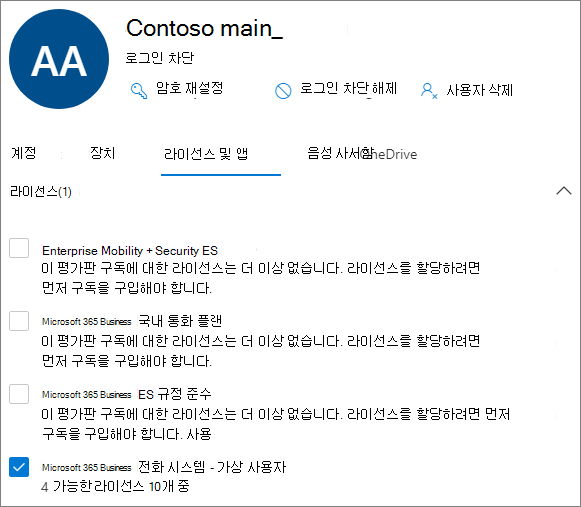

# <a name="manage-resource-accounts-in-microsoft-teams"></a>Microsoft Teams에서 리소스 계정 관리

리소스 계정은 Azure AD의 비활성 사용자 개체 이며 일반적인 리소스를 나타내는 데 사용 될 수 있습니다. 예를 들어 Exchange에서 리소스 계정을 사용 하 여 회의실을 나타내고 전화 번호와 일정을 가질 수 있습니다. Microsoft 365 또는 구내에서 비즈니스용 Skype Server 2019를 사용 하 여 리소스 계정을 설정할 수 있습니다.

Microsoft 팀에서는 각 자동 전화 교환 또는 통화 대기열에 대해 리소스 계정이 필요 합니다. 또한 리소스 계정에는 서비스 전화 번호를 할당할 수 있습니다. 전화 번호를 자동 전화 교환에 할당 하 고 외부 팀의 호출자가 자동 전화 교환 또는 통화 대기열에 도달할 수 있도록 하는 방법입니다.

이 문서에서는 자동 전화 교환 및 통화 대기열에 사용할 수 있도록 리소스 계정을 만들고 준비 하는 방법에 대해 설명 합니다.

이 문서의 절차를 시작 하기 전에 다음을 완료 했는지 확인 합니다.

- [가상 사용자 라이선스 획득](#obtain-virtual-user-licenses)
- [서비스 번호 가져오기](#obtain-service-numbers)

### <a name="obtain-virtual-user-licenses"></a>가상 사용자 라이선스 획득

자동 전화 교환 및 통화 대기열 작업을 위해서는 각 리소스 계정에 라이선스가 필요 합니다. 무료 *Microsoft 365 전화 시스템-가상 사용자* 라이선스를 사용할 수 있습니다. 이러한 라이선스를 얻으려면 [가상 사용자 라이선스](teams-add-on-licensing/virtual-user.md)를 참조 하세요.

이 문서의 뒷부분에 나오는 리소스 계정에 라이선스를 할당 하는 방법을 다룹니다.

가상 사용자 라이선스를 얻으려면 Microsoft 365 관리 센터에서 **청구**  >  **구입 서비스**  >  **추가 기능 구독** 으로 이동 하 여 끝으로 스크롤합니다. 그러면 *전화 시스템-가상 사용자* 라이선스가 표시 됩니다. **지금 구입** 을 선택 합니다. 비용이 0 인 경우에도 다음 단계를 따라 라이선스를 취득 해야 합니다.

### <a name="obtain-service-numbers"></a>서비스 번호 가져오기

서비스 번호는 자동 전화 교환 및 통화 대기열에 대 한 선택 사항 이지만, 발신자가 자동 전화 교환 및 통화 대기열 구성에 도달 하려면 적어도 하나 이상의 서비스 번호가 필요 합니다. 서비스 번호로 직접 연결할 수 있는 자동 전화 교환 또는 통화 대기열에 대해 연결 된 서비스 번호가 있는 리소스 계정이 있어야 합니다.

리소스 계정은 유료 또는 무료 서비스 번호 중 하나를 사용할 수 있습니다. 다른 통신 업체에서 새 번호를 요청 하거나 기존 번호를 포트 할 수 있습니다.

새로운 서비스 번호를 얻으려면 [서비스 전화 번호 받기를](getting-service-phone-numbers.md)참조 하세요.

다른 통신 회사의 번호를 이식 하려면 [팀에 전화 번호 전송을](phone-number-calling-plans/transfer-phone-numbers-to-teams.md)참조 하세요.

## <a name="create-a-resource-account"></a>자원 계정 만들기

팀 관리 센터에서 자원 계정을 만들 수 있습니다.


1. 팀 관리 센터에서 **조직 전체 설정을** 확장 한 다음 **리소스 계정을** 클릭 합니다.

2. **추가** 를 클릭 합니다.

3. **리소스 계정 추가** 창에서 **표시 이름** , **사용자 이름** , **리소스 계정 유형을** 입력 합니다. 리소스 계정 유형은이 리소스 계정의 사용 방법에 따라 **자동 전화 교환** 또는 **통화 대기열** 중 하나가 될 수 있습니다.

4. **저장** 을 클릭합니다.


## <a name="assign-a-license"></a>라이선스 할당

각 자원 계정에 대해 *Microsoft 365 전화 시스템-가상 사용자* 라이선스 또는 *전화 시스템* 라이선스를 할당 해야 합니다.



1. Microsoft 365 관리 센터에서 라이선스를 할당 하려는 리소스 계정을 클릭 합니다.

2. **라이선스 및 앱** 탭의 **라이선스** 에서 **Microsoft 365 전화 시스템-가상 사용자** 를 선택 합니다.

3. **변경 내용 저장** 을 클릭 합니다.

## <a name="assign-a-service-number"></a>서비스 번호 할당

서비스 번호가 필요한 자동 전화 교환 또는 통화 대기열에 리소스 계정을 사용 하려는 경우 리소스 계정에 번호를 할당 합니다.


1. 팀 관리 센터의 **리소스 계정** 페이지에서 서비스 번호를 할당 하려는 리소스 계정을 선택한 다음 **할당/할당** 취소를 클릭 합니다.

2. **전화 번호 형식** 드롭다운에서 사용할 번호 유형을 선택 합니다.

3. 지정 된 **전화 번호** 상자에서 사용 하려는 번호를 검색 하 고 **추가** 를 클릭 합니다.

4. **저장** 을 클릭합니다.


리소스 계정에 직접 라우팅 또는 하이브리드 번호를 할당 하려면 PowerShell을 사용 해야 합니다.

`Set-CsOnlineApplicationInstance -Identity aa-contoso_main@contoso64.net -OnpremPhoneNumber +19295550150`

## <a name="next-steps"></a>다음 단계

리소스 계정 설정을 완료 하 고 필요한 경우 서비스 번호를 할당 하면 자동 전화 교환 또는 통화 대기열에 리소스 계정을 사용할 준비가 된 것입니다.

다음 참조를 참조 하세요.

 - [클라우드 자동 전화 교환](create-a-phone-system-auto-attendant.md)

 - [클라우드 통화 대기열](create-a-phone-system-call-queue.md)

**편집** 옵션을 사용 하 여 리소스 계정 **표시 이름** 및 **리소스 계정** 유형을 편집할 수 있습니다. 완료 되 면 **저장** 을 클릭 합니다.

## <a name="change-an-existing-resource-account-to-use-a-virtual-user-license"></a>가상 사용자 라이선스를 사용 하도록 기존 리소스 계정 변경

기존 리소스 계정의 라이선스를 **전화 시스템** 라이선스에서 가상 사용자 라이선스로 전환 하려는 경우 무료 가상 사용자 라이선스를 취득 한 다음 Microsoft 365 관리 센터의 단계를 따라 [사용자를 다른 구독으로 이동](https://docs.microsoft.com/microsoft-365/admin/manage/assign-licenses-to-users#move-users-to-a-different-subscription)해야 합니다.

> [!WARNING]
> 항상 전체 전화 시스템 라이선스를 제거 하 고 동일한 라이선스 활동에 가상 사용자 라이선스를 할당 합니다. 이전 라이선스를 제거 하 고, 계정 변경 내용을 저장 하 고, 새 라이선스를 추가한 다음 계정 설정을 다시 저장 하면 리소스 계정이 더 이상 예상 대로 작동 하지 않을 수 있습니다. 이 문제가 발생 하는 경우 가상 사용자 라이선스에 대 한 새 리소스 계정을 만들고 끊어진 리소스 계정을 제거 하는 것이 좋습니다.

## <a name="skype-for-business-server-2019"></a>비즈니스용 Skype 서버 2019

클라우드 통화 대기열 및 클라우드 자동 전화 교환에 사용할 수 있는 비즈니스용 Skype Server 2019에 있는 리소스 계정의 경우 [클라우드 통화 대기열 계획](/SkypeforBusiness/hybrid/plan-call-queue) 또는 [클라우드 자동 전화 교환 계획](/SkypeForBusiness/hybrid/plan-cloud-auto-attendant)을 참조 하세요. 하이브리드 구현 (직접 라우팅에 있는 숫자)은 온-프레미스 비즈니스용 Skype Server 2019 서버에서 [CsHybridApplicationEndpoint](https://docs.microsoft.com/powershell/module/skype/new-cshybridapplicationendpoint) cmdlet을 사용 하 여 구성 됩니다.

응용 프로그램 인스턴스를 만들 때 사용 해야 하는 응용 프로그램 Id는 다음과 같습니다.

- **자동 전화 교환:** ce933385-9390-45d1-9512-c8d228074e07
- **통화 대기열:** 11cd3e2e-fccb-42ad-ad00-878b93575e07

> [!NOTE]
> Skype For Business Server 2019 사용자가 통화 대기열 또는 자동 전화 교환을 검색 가능 하 게 하려면 온라인 리소스 계정이 Active Directory로 동기화 되지 않으므로 비즈니스용 Skype Server 2019에서 리소스 계정을 만들어야 합니다. Sipfederationtls에 대 한 DNS SRV 레코드가 비즈니스용 Skype 서버 2019를 해결 하는 경우 SfB Management shell을 사용 하 여 비즈니스용 Skype Server 2019에 리소스 계정을 만들고 Azure AD와 동기화 **해야 합니다** .

비즈니스용 Skype 서버와 혼성으로 구현 하는 경우:

   [클라우드 자동 전화 교환 계획](/SkypeForBusiness/hybrid/plan-cloud-auto-attendant)
  
   [클라우드 통화 큐 계획](/SkypeforBusiness/hybrid/plan-call-queue)
   
   [프레미스 리소스 계정 구성](/SkypeForBusiness/hybrid/configure-onprem-ra)


## <a name="delete-a-resource-account"></a>자원 계정 삭제

서비스 번호가 보류 모드에서 중지 되지 않도록 하려면 먼저 리소스 계정에서 전화 번호를 분리 하 여 삭제 해야 합니다.

이 작업을 수행한 후에는 Microsoft 365 관리 센터의 사용자 탭에서 리소스 계정을 삭제할 수 있습니다.

리소스 계정에서 직접 라우팅 전화 번호의 연관을 해제 하려면 다음 cmdlet을 사용 합니다.

```powershell
Set-CsOnlineApplicationInstance -Identity  <Resource Account oid> -OnpremPhoneNumber ""
```
