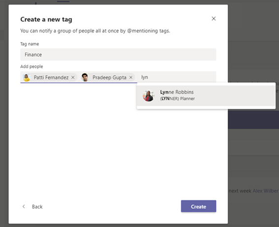

# Microsoft 팀의 태그 관리Manage tags in Microsoft Teams

Microsoft 팀의 태그를 통해 사용자가 팀의 일부 사용자와 통신할 수 있습니다.Tags in Microsoft Teams let users communicate with a subset of people on a team. 한 명 또는 여러 팀 구성원에 게 태그를 추가 하 여 사용자의 올바른 하위 집합으로 쉽게 연결할 수 있습니다.Tags can be added to one or multiple team members to easily connect with the right subset of people. 팀 소유자 및 구성원 (기능을 사용 하도록 설정 된 경우) 사용자에 게 하나 이상의 태그를 추가할 수 있습니다.Team owners and members (if the feature is enabled for them) can add one or more tags to a person. 그런 다음 팀의 모든 사용자가 채널을 게시할 때 태그를 사용 하거나 해당 태그를 할당 한 사람만 대화를 시작 하는 것을 @mentions 수 있습니다.The tags can then be used in @mentions by anyone on the team in a channel post or to start a conversation with only those people who are assigned that tag.

> [!NOTE]
> 태그는 개인 채널에서 아직 지원 되지 않습니다.Tags are not yet supported in private channels. 미국 정부 커뮤니티 클라우드 (GCC), GCC High 또는 보안 부서 (DoD) 조직에서는 아직 태그를 사용할 수 없습니다.Tags are not yet available in US Government Community Cloud (GCC), GCC High, or Department of Defense (DoD) organizations. 

## 태그가 작동 하는 방식How tags work

특정 팀의 사용자에 게 태그를 추가할 수 있습니다.A tag can be added to a person on a specific team. 태그를 추가한 후에는 채팅 또는 팀의 표준 채널에서 @mentions에 사용할 수 있습니다.After a tag is added, it can be used in @mentions in a chat or in any standard channel of the team. 다음은 팀에서 태그를 사용 하는 방법에 대 한 몇 가지 예입니다.Here's some examples of how tags can be used in Teams:

- 스토어 관리자가 채널에 알림을 게시 하 고 모든 cashiers에 게 알려야 합니다.A store manager wants to post an announcement to a channel and notify all cashiers.
- 그룹 제품 관리자가 채널의 모든 제품 관리자에 게 메시지를 전송 하려고 합니다.A group product manager wants to message all product managers in a channel.
- 병원 관리자가 채널의 모든 radiologists에 게 메시지를 보내려고 합니다.A hospital administrator wants to send a message to all radiologists in a channel.
- 마케팅 관리자가 모든 설계자와 그룹 채팅을 시작 하려고 합니다.A marketing manager wants to start a group chat with all designers. 

자세한 내용은 [팀에서 태그를 사용 하 여](https://support.office.com/article/using-tags-in-teams-667bd56f-32b8-4118-9a0b-56807c96d91e)확인해 보세요.To learn more, check out [Using tags in Teams](https://support.office.com/article/using-tags-in-teams-667bd56f-32b8-4118-9a0b-56807c96d91e).

## 조직의 태그 관리Manage tags for your organization

관리자는 Microsoft 팀 관리 센터에서 태그를 추가할 수 있는 사람과 사용자의 조직에서 태그를 사용 하는 방법을 제어할 수 있습니다.As an admin, you can control who can add tags and how tags are used across your organization in the Microsoft Teams admin center.

### 태그를 추가할 수 있는 사용자 설정Set who can add tags

기본적으로 팀 소유자는 태그를 추가할 수 있습니다.By default, team owners can add tags. 팀 소유자와 팀 구성원이 태그를 추가할 수 있도록이 설정을 변경 하거나 조직의 태그를 해제할 수 있습니다.You can change this setting to allow team owners and team members to add tags or you can turn off tags for your organization.

1. Microsoft 팀 관리 센터의 왼쪽 탐색 모음에서 **조직 전체 설정** > **팀 설정을**클릭 합니다.In the left navigation of the Microsoft Teams admin center, click **Org-wide settings** > **Teams settings**.
2. **태깅**아래에서 **태그**지정 옆에 있는에서 다음 옵션 중 하나를 선택 합니다.Under **Tagging**, next to **Tagging is enabled for**, select one of the following options:

    - **팀 소유자 및 구성원**: 팀 소유자 및 구성원이 태그를 추가할 수 있도록 허용 합니다.**Team owners and members**: Allow team owners and members to add tags.
    - **팀 소유자**: 팀 소유자가 태그를 추가할 수 있도록 허용 합니다.**Team owners**: Allow team owners to add tags.
    - **사용 안 함**: 태그 끄기.**Disabled**: Turn off tags.

### 태그 설정 구성Configure tags settings

조직에서 태그를 사용 하는 방법을 제어 하도록 다음 태그 설정을 구성할 수 있습니다.You can configure the following tags settings to control how tags are used across your organization.

1. Microsoft 팀 관리 센터의 왼쪽 탐색 모음에서 **조직 전체 설정** > **팀 설정을**클릭 합니다.In the left navigation of the Microsoft Teams admin center, click **Org-wide settings** > **Teams settings**.
2. **태그**아래에서 조직의 요구 사항에 따라 다음을 설정 합니다.Under **Tagging**, set the following, depending on the needs of your organization.

    - **팀 소유자는 태그를 적용할 수 있는 사람을 무시할 수**있습니다 .이 옵션이 설정 되어 있는 경우 팀 소유자는 구성원에 게 팀 설정에서 태그를 추가 하도록 허용 하거나 허용 하지 않을 수 있습니다.**Team owner can override who can apply tags**: When this is turned on, team owners can allow or disallow members to add tags in team settings.
    - **구성원은 추가 태그를 추가할 수**있습니다. 팀 구성원이 태그를 추가할 수 있도록 허용 하는 경우, 사용자가 설정한 제안 된 기본 태그 이외의 태그를 팀 구성원이 추가 하도록 설정 합니다.**Members can add additional tags**: If you allow team members to add tags, turn this on to let team members add tags other than the suggested default tags that you set. 이 옵션이 해제 되어 있는 경우 팀 구성원은 기본 태그만 사용할 수 있습니다.If this is turned off, team members can only use the default tags.
    - **제안 된 기본 태그**:이를 사용 하 여 기본 태그 집합을 추가 합니다.**Suggested default tags**: Use this to add a set of default tags. 태그는 최대 25 개까지 추가할 수 있으며, 각 태그는 25 자까지 입력할 수 있습니다.You can add up to 25 tags, and each tag can contain a maximum of 25 characters. 팀 소유자 및 구성원 (해당 기능이 해당 기능을 사용 하도록 설정 된 경우)을 사용 하거나, 해당 제안에 추가 하거나, 새 태그 집합을 만들 수 있습니다.Team owners and members (if the feature is enabled for them) can use these suggestions, add to them, or create a new set of tags.

## 팀의 태그 설정 관리Manage tags settings for a team

팀 소유자가 Microsoft 팀 관리 센터에서 **태그를 적용할 수 있는 사용자를 재정의할 수** 있는 경우 팀 소유자는 멤버가 팀 수준에서 태그를 추가할 수 있는지 여부를 설정할 수 있습니다.If you turned on the **Team owner can override who can apply tags** setting in the Microsoft Teams admin center, team owners can set whether members can add tags at the team level. 이렇게 하려면 팀의 **설정** 탭에서 **태그로**이동한 다음 태그를 추가할 수 있는 사용자를 선택 합니다.To do this, on the **Settings** tab for a team, go to **Tags**, and then choose who can add tags.

## 팀에서 태그 추가Add tags in Teams

팀에서 팀원에 대 한 팀 관리 페이지의 **구성원** 탭에는 **태그** 열이 포함 됩니다.In Teams, the **Members** tab of the Manage team page for a team includes a **Tags** column. 팀 소유자 및 구성원 (이 기능을 사용 하도록 설정 된 경우) 구성원 옆에 있는 **태그 관리** 를 클릭 하 여 해당 구성원에 대 한 추천 태그 목록을 표시 하 고 목록에 태그를 추가할 수 있습니다.Team owners and members (if the feature is enabled for them) can click **Manage tags** next to a member to see the list of suggested tags for that member and add tags to the list.

 
