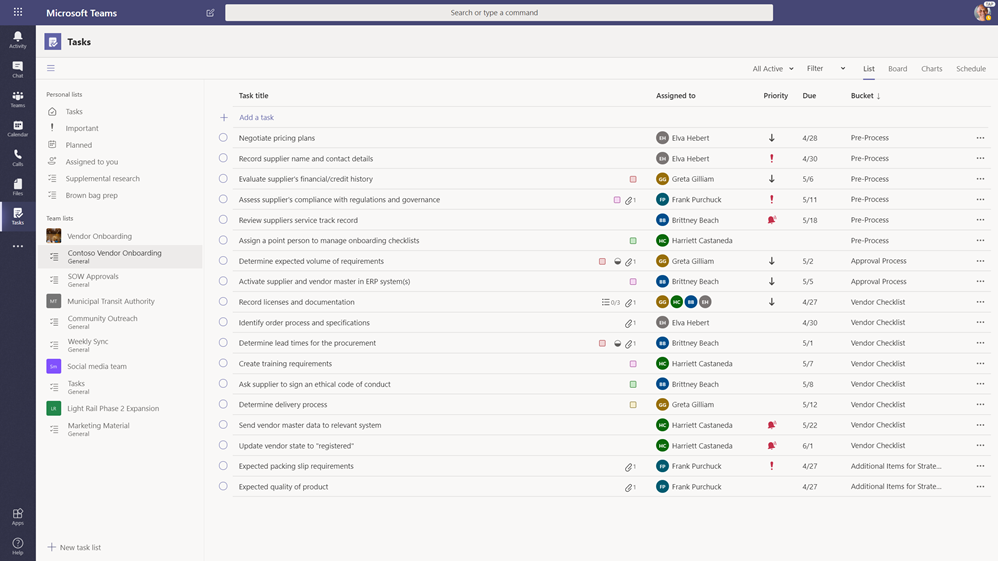

# Microsoft Teams에서 조직의 작업 앱 관리

## 작업 개요

작업 앱은 [Microsoft 할 일](https://todo.microsoft.com/tasks/)에서 제공한 개별 작업과 Planner에서 제공한 팀 작업을 통합하여 Microsoft Teams에 통합된 작업 관리 체험을 제공합니다.  사용자는 Teams 왼쪽의 앱으로 작업을 액세스하고 개별 팀 내의 채널에서 탭으로 작업에 액세스할 수 있습니다. 작업에서 **내 작업** 및 **공유 계획** 은 개별 및 팀 작업을 보고 관리할 수 있으며 작업의 우선 순위를 지정할 수 있습니다. 작업은 Teams 데스크톱, 웹 및 모바일 클라이언트에서 사용할 수 있습니다. 

> [!NOTE]
> Teams 데스크톱 클라이언트에 작업 환경을 제공하면, 처음에는 앱 이름이 사용자에게 **Planner** 로 표시됩니다. 그런 다음 **Planner 및 할 일별 작업** 으로 이름이 일시적으로 변경됩니다. 나중에는 **작업** 으로 다시 변경됩니다. Teams 모바일 클라이언트에서 사용자는 항상 앱 이름을 **작업** 으로 보게 됩니다. 데스크톱 환경을 사용할 수 있는 후 모바일 환경의 가용성이 잠시 지연될 수 있습니다.

   

일선 작업자의 작업 관리를 간소화하려는 조직을 위해, 작업에도 일선 작업자 전반에서 작업을 대상으로 비율 관련 지정, 게시 및 추적할 수 있는 기능이 포함되어 있습니다. 예를 들어, 기업 및 지역 리더십은 특정 소매점과 같은 관련 위치를 대상으로 하는 작업 목록을 만들어 게시하고 실시간 보고서를 통해 진행 상황을 추적할 수 있습니다. 관리자는 직원들의 위치 내에서 작업을 할당하고 직접 작업을 할당할 수 있으며, 일선 작업자는 모바일 또는 데스크톱에서 할당된 작업에 대한 우선 순위를 소유합니다. [작업 게시](#task-publishing)를 사용하도록 설정하려면, 먼저 계층 구조의 모든 팀이 서로 연관되는 방법을 정의하는 조직에 대해 팀 대상 계층 구조를 설정해야 합니다.

## 작업에 대해 알아야 할 작업

작업은 앱과 채널의 탭으로 사용할 수 있습니다. 앱은 할 일의 개별 작업과 Planner의 팀 작업으로 구성되는 반면, 탭에는 팀 작업만 표시됩니다.

사용자는 작업을 통해 데스크톱, 웹 및 모바일 환경을 사용할 수 있습니다. Teams 데스크톱 클라이언트에 작업이 설치된 경우, 사용자는 Teams 웹 및 모바일 클라이언트에서도 작업을 보게됩니다. 게스트 사용자만 예외입니다. 게스트가 Teams 모바일 클라이언트에서만 작업에 앱으로만 액세스할 수 있음에 유의합니다. 게스트는 Teams 데스크톱 및 웹 클라이언트 모두에서 작업 탭을 보게됩니다.

**내 작업** 에 사용자의 개별 작업이 표시되어 있습니다. **공유 계획** 이 전체 팀이 작업하고 있는 작업을 표시하고 채널에 작업 탭으로 추가된 모든 작업 목록을 포함합니다. 다음에 유의하세요.

- 작업 앱에서 사용자가 만든 작업 목록은 해당 사용자의 할 일 클라이언트에도 나타납니다. 마찬가지로 할 일에 사용자가 만든 작업 목록은 해당 사용자 작업의 **내 작업** 에 표시됩니다. 개별 작업도 마찬가지입니다.

- 채널에 추가된 모든 작업 탭은 Planner 클라이언트에도 나타납니다. 사용자가 Planner에서 계획을 만드는 경우, 계획이 채널에 탭으로 추가되지 않는 한 해당 계획이 작업 또는 Planner 앱에 계획이 표시되지 않습니다. 사용자가 새 작업 탭을 추가하면, 새 목록이나 계획을 만들거나 기존 목록을 선택할 수 있습니다.

## 작업 설정

> [!IMPORTANT]
> Planner에 대해 구성한 설정 및 정책이 작업에도 적용됩니다.

### 조직에서 작업을 사용 또는 사용하지 않도록 설정

작업은 조직의 모든 Teams 사용자에 대해 기본적으로 사용하도록 설정됩니다. Microsoft Teams 관리자 센터의 [앱 관리](manage-apps.md) 페이지에서 조직 수준에서 앱을 끄거나 켤 수 있습니다.

1. Microsoft Teams 관리 센터의 왼쪽 탐색 창에서 **Teams 앱** > **앱 관리** 로 이동합니다.
2. 앱 목록에서 다음 중 하나를 실행합니다.

    - 조직의 작업을 해제하려면, 작업 앱을 검색하고 선택한 다음 **차단** 을 클릭합니다.
    - 조직에 대해 작업을 켜려면 작업 앱을 검색하고 선택한 다음 **허용** 을 클릭합니다.

> [!NOTE]
> 작업 앱을 찾을 수 없는 경우, 이 문서의 첫 번째 노트에서 이름을 검색합니다. 앱의 이름을 계속 재명명하는 중일 수 있습니다.

### 조직의 특정 사용자에 대해 작업 사용 또는 사용하지 않도록 설정

조직의 특정 사용자가 작업을 사용할 수 있도록 허용하거나 차단하려면, [앱 관리](manage-apps.md) 페이지에서 조직에 대해 작업이 켜져 있는지 확인한 다음 사용자 지정 앱 사용 권한 정책을 만들어 해당 사용자에게 할당합니다. 자세한 내용은 Teams 에서 [앱 사용 권한 정책 관리](teams-app-permission-policies.md)를 참조하세요.

### 앱 설치 정책을 사용하여 Teams에 작업 고정

앱 설정 정책을 사용하면 Teams를 사용자 지정하여 조직의 사용자에게 가장 중요한 앱을 강조할 수 있습니다. 정책에 설정한 앱은 Teams 데스크톱 클라이언트의 측면&mdash;표시줄에 있는 앱 바와   Teams 데스크톱 클라이언트의 하단에 고정되어 있어, &mdash;사용자가 빠르고 쉽게 액세스할 수 있습니다.

사용자에 대해 작업 앱을 고정하려면, 전역(Org-wide 기본값) 정책을 편집하거나 사용자 지정 앱 설정 정책을 만들고 할당할 수 있습니다. 자세한 내용은 [Teams에서 앱 설정 정책 관리](teams-app-setup-policies.md)를 참조하세요.

### 사용자의 내 작업은 사용자가 Exchange Online에 대한 사용 허가를 받은 경우 표시됩니다.

사용자가 **내 작업** 을 못보게 하려면, 숨길 수 있습니다. 이 작업을 위해 [사용자의 Exchange Online 라이선스를 제거합니다](https://docs.microsoft.com/microsoft-365/admin/manage/remove-licenses-from-users). Exchange Online 라이선스를 제거한 후 사용자가 더 이상 사서함에 액세스할 수 없음을 알아야 합니다.  사서함 데이터는 30일 동안 유지되고, 이 후 데이터가 제거되며, 사서함이 [원본 위치 유지 또는 소송 보존](https://docs.microsoft.com/exchange/security-and-compliance/in-place-and-litigation-holds)에 배치하지 않으면, 복구할 수 없습니다.

정보 근로자에게는 이를 권장하지 않지만, 전자 메일에 의존하지 않는 일선 작업자의 경우와 같이 이러한 경우에 해당될 수 있는 시나리오가 있을 수 있습니다.

## 작업 게시

작업 게시를 통해 조직은 조직 전체의 특정 위치(팀)를 대상으로 하는 작업 목록을 게시하여 해당 위치에서 완료할 작업 계획을 정의하고 공유할 수 있습니다.

- 회사 또는 지역 리더십과 같은 게시 팀의 사람들은 작업 목록을 만들어 특정 팀에 게시할 수 있습니다. 
    
- 받는 팀의 관리자는 게시된 작업 목록을 검토하고 팀 구성원에게 개별 작업을 할당할 수 있습니다. 
    
- 일선 작업자는 자신에게 할당된 작업을 모는 간단한 모바일 환경을 소유합니다. 적절한 경우 사진을 첨부하여 작업을 표시하고 작업을 완료로 표시할 수 있습니다.
- 게시자 및 관리자는 보고서를 보고 위치(팀), 작업 목록, 개별 작업 등 각 수준에서 작업의 배정 및 완료 상태를 확인할 수 있습니다. 
    

사용자는 작업 탭의 **게시된 목록** 탭에서 작업 목록을 만들고 관리하고 게시합니다. 이 탭은 조직에서 [계층 구조 대상 설정하고](#set-up-your-team-targeting-hierarchy) 사용자가 계층 구조에 포합된 팀에 있는 경우 사용자에게만 표시됩니다. 계층 구조에 따라 사용자가 작업 목록을 게시하거나 받을 수 있는지와 받은 목록에 대한 보고를 볼 수 있는지가 결정됩니다.

### 시나리오 예

작업 게시 작동 방식의 예는 다음과 같습니다.

Contoso는 새로운 음식 인출 및 배달 프로모션을 진행하고 있습니다. 일관된 브랜드 환경을 유지하려면, 300개가 넘는 매장에서 일관된 출시 실행을 조정해야 합니다.

마케팅 팀은 홍보 세부 정보 및 해당 작업 목록을 소매 통신 관리자와 공유합니다. 매장의 관문 역할을 하는 소매 통신 관리자는 정보를 검토하고 프로모션을 위한 작업 목록을 만든 다음 영향을 받는 각 매장에서 수행해야 하는 각 작업 단위에 대한 작업을 만듭니다. 작업 목록이 완료되면 작업을 완료해야 하는 매장을 선택해야 합니다. 이 경우 프로모션은 매장 식당이 있는 미국 내 매장에만 적용됩니다. 작업에서는 매장 식당 특성을 기준으로 스토어 목록을 필터하고 계층 구조에서 일치하는 미국 위치를 선택한 다음, 해당 매장에 작업 목록을 게시합니다.

각 위치에 있는 매장 관리자는 게시된 작업의 복사본을 받고 해당 작업을 팀 구성원에게 할당합니다. 관리자는 작업 환경을 사용하여 매장에서 필요한 모든 작업을 이해할 수 있습니다. 또한 사용 가능한 필터를 사용하여 기한이 오늘인 작업이나 특정 영역의 작업과 같은 특정 작업 집합에 집중할 수도 있습니다.

이제 각 매장의 일선 작업자는 자신의 모바일 장치의 작업에서 작업의 우선 순위가 지정됩니다. 작업을 완료하면 완료로 표시됩니다. 일부 작업은 작업을 표시하기 위해 사진을 업로드하고 작업에 첨부할 수도 있습니다.

Contoso 본사 및 중간 관리자는 보고를 열람하여 각 매장 및 매장 전체에서 작업의 배정 및 완료 상태를 확인할 수 있습니다. 특정 작업의 드릴다운을 수행하여 다른 매장의 상태를 확인할 수도 있습니다. 시작 날짜가 가까워지면, 비정상을 확인하고 필요한 경우 팀에 체크 인할 수 있습니다. 이러한 가시성을 통해 Contoso는 출시의 효율성을 개선하고 매장 전체에서 더 일관된 환경을 제공할 수 있습니다.

### 팀 대상 계층 구조 설정

조직에서 작업 게시를 사용하려면, 먼저 .CSV 파일에서 팀 대상 지정 스키마를 설정해야 합니다 스키마는 계층 구조의 모든 팀이 서로 어떻게 관련되어 있으며, 팀을 필터링하고 선택하는 데 사용되는 특성을 정의합니다. 스키마를 만든 후 Teams에 업로드하여 조직에 적용합니다. 그런 다음 예제 시나리오에서 소매 통신 관리자와 같은 게시 팀의 구성원은 계층 구조, 특성 또는 둘 다의 조합별로 통해 팀을 필터링하여, 작업 목록을 받을 관련 팀을 선택한 다음 해당 팀에 작업 목록을 게시할 수 있습니다.

팀 대상 계층 구조를 설정하는 방법에 대한 단계는 [팀 대상 계층 구조 설정](set-up-your-team-hierarchy.md)을 참고합니다.

## Power Automate 및 Graph API

작업은 할 일용 Power Automate 및 Planner용 Graph API를 지원합니다. 자세한 내용은 다음을 참조하세요.

- [Planner 작업 및 계획 API 개요](https://docs.microsoft.com/graph/planner-concept-overview)
- [Power Automate로 Microsoft To Do 사용](https://support.office.com/article/using-microsoft-to-do-with-power-automate-526e8f75-217b-46e0-9e06-44780b72c295)
