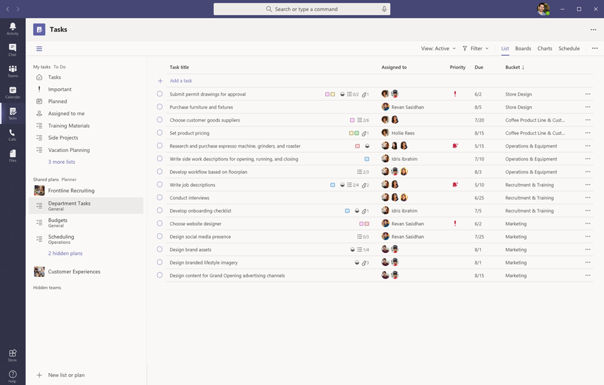

# Microsoft Teams에서 조직의 작업 앱 관리Manage the Tasks app for your organization in Microsoft Teams

> **이 기능은 현재 비공개 미리 보기 상태입니다.****This feature is currently in private preview.**

## 작업 개요Overview of Tasks

작업 앱을 사용하여 Microsoft Teams에 일상적인 작업 관리 환경을 제공하여 [Microsoft To Do](https://todo.microsoft.com/tasks/) 및 팀에서 플래너를 지원하는 개별 작업을 한위치에 통합할 수 있습니다.The Tasks app brings a cohesive task management experience to Microsoft Teams, integrating individual tasks powered by [Microsoft To Do](https://todo.microsoft.com/tasks/) and team tasks powered by Planner in one place. 사용자는 Teams 왼쪽에서 앱으로 작업에 액세스하고 개별 팀 내 채널의 탭으로 작업에 액세스할 수 있습니다.Users can access Tasks as an app on the left side of Teams and as a tab in a channel within individual teams. **작업의** 내 **작업 및 공유 계획을** 통해 사용자는 모든 개인 작업과 팀 작업을 보고 관리하며 작업의 우선 순위를 지정할 수 있습니다.**My tasks** and **Shared plans** in Tasks let users view and manage all their individual and team tasks and prioritize their work. 작업은 Teams 데스크톱, 웹, 모바일 클라이언트에서 사용할 수 있습니다.Tasks is available in Teams desktop, web, and mobile clients. 

> [!NOTE]
> Teams 데스크톱 클라이언트에서 작업 환경을 배포할 때 쪽에는 앱 이름이 **사용자에게 Planner로 표시됩니다.**As we roll out the Tasks experience on Teams desktop clients, the app name will initially appear as **Planner** to users. 그런 다음 **플래너**및 할 일로 의해 이름이 일시적으로 변경됩니다. 나중에는 이름이 작업으로 바식됩니다. **Tasks**The name will then temporarily change to **Tasks by Planner and To Do**, and later on, it will be renamed to **Tasks**. Teams 모바일 클라이언트에서는 앱 이름이 항상 작업으로 **표시됩니다.**On Teams mobile clients, users will always see the app name as **Tasks**. 데스크톱 환경을 사용할 수 있게 된 후 탐색 환경의 사용 가능성에 약간 지연이 있을 수 있습니다.There may be a short delay in the availability of the mobile experience after the desktop experience is available.

   

일선 직원을 위한 작업 관리를 간소화할 조직의 경우, 작업에는 일선 직원의 역할을 대상으로 작업을 승계하고, 게시하고, 추적할 수 있는 기능도 포함되어 있습니다.For organizations who want to streamline task management for Firstline Workers, Tasks also includes capabilities that enable you to target, publish, and track tasks at scale across your Firstline Workforce. 예를 들어 기업 및 지역의 경영진은 특정 소매매매장과 같은 관련 위치에 대한 대상의 작업 목록을 만들어 게시하고, 실시간 보고서를 통해 진행 상황을 추적할 수 있습니다.For example, corporate and regional leadership can create and publish task lists targeted to relevant locations, such as specific retail stores, and track progress through real-time reports. 관리자는 작업을 직원에게 할당하고 해당 위치 내에서 직접 활동을 수행할 수 있으며, 일선 직원은 모바일이나 데스크톱에 할당된 작업의 우선 순위가 지정된 목록을 포함합니다.Managers can assign tasks to their staff and direct activities within their locations, and Firstline Workers have a prioritized list of their assigned tasks on mobile or desktop. 작업 [게시를 사용하려면](#task-publishing)먼저 조직의 모든 팀이 서명과 관련된 방법을 정의하는 조직의 대상 계층 구조를 설정해야 합니다.To enable [task publishing](#task-publishing), you'll first need to set up a team targeting hierarchy for your organization, which defines how all teams in the hierarchy are related to each other.

## 작업에 대해 알아야 할 사항What you need to know about Tasks

작업은 앱 및 채널의 탭으로 사용할 수 있습니다.Tasks is available as an app and as a tab in a channel. 이 경우 앱이 Planner의 개별 작업과 팀 작업으로 구성된다는 점에 유의하세요. 이 탭에는 팀 작업만 표시됩니다.Keep in mind that the app comprises both individual tasks from To Do and team tasks from Planner whereas the tab shows only team tasks.

작업을 사용하여 사용자는 데스크톱, 웹 및 모바일 환경을 구경받아보세요.With Tasks, users get a desktop, web, and mobile experience. Teams 데스크톱 클라이언트에 작업이 설치되어 있는 경우 Teams 웹 및 모바일 클라이언트에서도 작업이 표시됩니다.If Tasks is installed on the Teams desktop client, users will also see it on their Teams web and mobile clients. 예외는 게스트 사용자입니다.The exception is guest users. 게스트가 Teams 모바일 클라이언트에서만 작업에 액세스할 수 있는다는 점을 아는 아리기이어야 합니다.It's important to know that guests can only access Tasks as an app from the Teams mobile client. 게스트에 Teams 데스크톱 및 웹 클라이언트 모두에 작업 탭이 표시됩니다.Guests will see Tasks tabs on both Teams desktop and web clients.

**사용자의** 개별 작업에는 내 설정이 표시됩니다.**My tasks** shows a user's individual tasks. **공유 계획은** 전체 팀이 작업 중이고 채널에 작업 탭으로 추가되는 작업 목록을 포함합니다.**Shared plans** show tasks that the whole team is working on and includes any task list that's added as a Tasks tab to a channel. 다음 사항을 참조하세요.Note the following:

- 작업 앱에서 사용자가 만든 작업 목록도 해당 사용자의 할 일 클라이언트에 나타납니다.Task lists that a user creates in the Tasks app will also appear in To Do clients for that user. 마찬가지로, 할 일에서 사용자가 만든 작업 목록이 해당 사용자에 대한 **내 작업에** 표시됩니다.Similarly, task lists that a user creates in To Do will appear in **My tasks** in Tasks for that user. 개별 작업의 경우에도 마무리입니다.The same is true for individual tasks.

- 채널에 추가된 모든 작업 탭도 Planner 클라이언트에 나타납니다.Any Tasks tab that's added to a channel will also appear in Planner clients. 사용자가 Planner에서 계획을 만들면 채널에 탭으로 추가되지 않는 한 플랜이 Planner 앱에 표시되지 않습니다.When a user creates a plan in Planner, the plan won't show in the Tasks or Planner app unless it's added as a tab to a channel. 사용자가 새 작업 탭을 추가하면 새 목록 또는 계획을 만들거나 기존 작업 탭을 선택할 수 있습니다.When a user adds a new Tasks tab, they can create a new list or plan or choose an existing one.

## 작업 설정Set up Tasks

> [!IMPORTANT]
> Planner에 대해 구성한 설정 및 정책이 작업에도 적용됩니다.Settings and policies that you configured for Planner will also apply to Tasks.

### 조직에서 작업을 사용하거나 사용하지 않도록 설정Enable or disable Tasks in your organization

작업은 조직의 모든 Teams 사용자에 대해 기본적으로 사용하도록 설정됩니다.Tasks is enabled by default for all Teams users in your organization. Microsoft Teams 관리 센터의 앱 관리 페이지에서 조직 수준에서 [앱을](manage-apps.md) 설정 또는 해제할 수 있습니다.You can turn off or turn on the app at the org level on the [Manage apps](manage-apps.md) page in the Microsoft Teams admin center.

1. Microsoft Teams 관리 센터의 왼쪽 탐색에서 Teams 앱 관리 **앱으로**  >  **이동합니다.**In the left navigation of the Microsoft Teams admin center, go to **Teams apps** > **Manage apps** .
2. 앱 목록에서 다음 중 하나를 수행합니다.In the list of apps, do one of the following:

    - 조직의 작업을 해제하려면 작업 앱을 검색하여 선택한 다음 차단을 **클릭합니다.**To turn off Tasks for your organization, search for the Tasks app, select it, and then click **Block**.
    - 조직에 대해 작업을 설정하려면 작업 앱을 검색하여 선택한 다음 허용을 **클릭합니다.**To turn on Tasks for your organization, search for the Tasks app, select it, and then click **Allow**.

### 조직의 특정 사용자에 대해 작업을 사용하거나 사용하지 않도록 설정Enable or disable Tasks for specific users in your organization

조직의 특정 사용자가 작업을 사용하지 않도록 허용하거나 차단하려면 앱 [Manage apps](manage-apps.md) 관리 페이지에서 조직에서 작업을 설정해야 합니다. 그런 다음 사용자 지정 앱 사용 권한 정책을 만들어 해당 사용자에게 할당합니다.To allow or block specific users in your organization from using Tasks, make sure Tasks is turned on for your organization on the [Manage apps](manage-apps.md) page, and then create a custom app permission policy and assign it to those users. 자세히 알아보려면 [Teams에서 앱 사용 권한 정책 관리를 참조하세요.](teams-app-permission-policies.md)To learn more, see [Manage app permission policies in Teams](teams-app-permission-policies.md).

### 앱 설정 정책을 사용하여 Teams에 작업 고정Use an app setup policy to pin Tasks to Teams

앱 설정 정책을 통해 Teams를 사용자 지정하여 조직의 사용자에게 가장 중요한 앱을 강조 표시할 수 있습니다.App setup policies let you customize Teams to highlight the apps that are most important for users in your organization. 정책에서 설정한 앱은 Teams 데스크톱 클라이언트의 측면 및 Teams 모바일 클라이언트의 아래쪽에 있는 앱 바에 &mdash; 고정되며, 사용자가 쉽고 빠르게 액세스할 &mdash; 수 있습니다.The apps you set in a policy are pinned to the app bar&mdash;the bar on the side of the Teams desktop client and at the bottom of the Teams mobile clients&mdash;where users can quickly and easily access them.

사용자에 대해 작업 앱을 고정하려면 전역(조직 전체) 정책을 편집하거나 사용자 지정 앱 설정 정책을 만들고 할당하면 됩니다.To pin the Tasks app for your users, you can edit the global (Org-wide default) policy or create and assign a custom app setup policy. 자세히 알아보려면 [Teams에서 앱 설치 정책 관리를 참조하세요.](teams-app-setup-policies.md)To learn more, see [Manage app setup policies in Teams](teams-app-setup-policies.md).

### Exchange Online에 대한 라이선스가 있는 경우 사용자의 내 작업이 표시됩니다.A user's My tasks is visible if the user is licensed for Exchange Online

사용자가 내 작업을 표시하지 **않도록 하려면 작업을**숨기면 됩니다.If you don't want a user to see **My tasks**, you can hide it. 이렇게 하려면 해당 [사용자의 Exchange Online 라이선스를 제거합니다.](https://docs.microsoft.com/microsoft-365/admin/manage/remove-licenses-from-users)To do this, [remove the user's Exchange Online license](https://docs.microsoft.com/microsoft-365/admin/manage/remove-licenses-from-users). Exchange Online 라이선스를 제거한 후에는 해당 사용자가 사서함에 더 이상 액세스할 수 없다는 점을 알아두어야 합니다.It's important to know that after you remove an Exchange Online license, the user no longer has access to their mailbox.  30일 간의 사서함 데이터는 사서함 데이터가 유지되며 사서함이 원본 위치 유지 또는 소송 보존에 적용되지 않은 경우 해당 데이터가 제거되며 [복구할 수 없습니다.](https://docs.microsoft.com/exchange/security-and-compliance/in-place-and-litigation-holds)Mailbox data is held for 30 days, after which the data will be removed and can't be recovered unless the mailbox is placed on [In-Place Hold or Litigation Hold](https://docs.microsoft.com/exchange/security-and-compliance/in-place-and-litigation-holds).

정보 관리자에게 이 방법을 권장하지 않지만 전자 메일에 종속하지 않는 일선 직원의 경우와 같이 이러한 시나리오가 적용될 수 있는 몇 가지 시나리오가 있을 수 있습니다.We don't recommend this for information workers, but there may be some scenarios where this could apply, such as for Firstline Workers who don't depend on email.

## 작업 게시Task publishing

작업 게시를 사용하여 조직에서 특정 위치(팀)에 대상이 지정된 작업 목록을 게시하여 다음 위치에 완료할 작업 계획을 정의하고 공유할 수 있습니다.With task publishing, your organization can publish task lists targeted to specific locations (teams) across your organization to define and share a work plan to be completed at those locations.

- 기업 또는 지역 상표와 같은 게시 팀구성원은 작업 목록을 만들어 특정 팀에 게시할 수 있습니다.People on the publishing team, such as corporate or regional leadership, can create task lists and publish them to specific teams. 
    
- 받는 사람 팀의 관리자는 게시된 작업 목록을 검토하고 개별 작업을 팀 구성원에게 할당할 수 있습니다.Managers on the recipient teams can review the published task lists and assign individual tasks to team members. 
    
- 일선 직원에게는 자신에게 할당된 작업을 볼 수 있는 간단한 모바일 환경이 있습니다.Firstline Workers have a simple mobile experience to see tasks assigned to them. 사진을 첨부하여 적절히 작업을 표시하고 작업을 완료로 표시할 수 있습니다.They can attach photos to show their work when appropriate and mark their tasks as completed.
- 게시자와 관리자는 보고서를 보고 위치(팀), 작업 목록, 개별 작업을 포함하여 각 수준에서 작업의 할당 및 완료 상태를 확인할 수 있습니다.Publishers and managers can view reports to see assignment and completion status of tasks at each level, including by location (team), task list, and individual task. 
    

사용자는 작업 앱의 게시된 목록 탭에서 **작업 목록을 만들고, 관리하고,** 게시합니다.Users create, manage, and publish task lists on the **Published lists** tab in the Tasks app. 이 탭은 조직에서 팀 대상 계층 구조를 설정하고 [사용자가](#set-up-your-team-targeting-hierarchy) 계층 구조에 포함된 팀에 있는 경우 해당 탭만 사용자를 보여 주도록 합니다.This tab only shows for a user if your organization [set up a team targeting hierarchy](#set-up-your-team-targeting-hierarchy) and the user is on a team that's included in the hierarchy. 계층 구조는 사용자가 작업 목록을 게시하거나 받을 수 있는지 여부를 결정하고 받은 목록에 대한 보고를 확인할 수 있는지 결정합니다.The hierarchy determines whether the user can publish or receive task lists and view reporting for received lists.

### 예제 시나리오Example scenario

다음은 작업 게시 작동 방식의 예입니다.Here's an example of how task publishing works.

Contoso는 새식 회수 및 배달 프로모션입니다.Contoso is rolling out a new food takeout and delivery promotion. 일관된 브라우터 환경을 유지하려면 스토어 위치에 있는 출시의 일관된 실행을 유지해야 합니다.To maintain a consistent brand experience, they need to coordinate consistent execution of the rollout across over 300 store locations.

마케팅 팀은 프로모션 세부 정보 및 해당 작업 목록을 RETAIL Communications Manager와 공유합니다.The Marketing team shares the promotion details and the corresponding list of tasks with the Retail Communications Manager. Retail Communications Manager는 Microsoft Store를 게이트보관에 대한 게이트보관자로 제공하고, 정보를 검토하고, 홍보를 위한 작업 목록을 생성한 다음 이에 해당하는 각 스토어에서 수행해야 하는 각 작업 단위에 대한 작업을 만듭니다.The Retail Communications Manager, who serves as the gatekeeper for stores, reviews the information, creates a task list for the promotion, and then creates a task for each unit of work that needs to be performed by each of the affected stores. 작업 목록이 완료되면 작업을 완료해야 하는 스토어를 선택해야 합니다.When the task list is complete, she needs to select the stores that must complete the work. 이 경우 프로모션은 스토어 내 복정이 있는 미국의 스토어에만 적용됩니다.In this case, the promotion only applies to stores in the United States that have an in-store restaurant. 작업에서 스토어 내 저장소 사용자 지정 특성을 기반으로 스토어 목록을 필터링하고 계층 구조에서 일치하는 미국 위치를 선택한 다음 해당 저장소에 작업 목록을 게시합니다.In Tasks, she filters the store list based on the in-store restaurant attribute, selects the matching United States locations in the hierarchy, and then publishes the task list to those stores.

각 위치에 저장 관리자는 게시된 작업의 사본을 받고 해당 작업을 팀 구성원에게 할당합니다.Store managers at each location receive a copy of the published tasks and assign those tasks to their team members. 관리자는 작업 환경을 사용하여 저장소에서 필요한 모든 작업을 이해할 수 있습니다.Managers can use the Tasks experience to understand all the work required across their store. 사용 가능한 필터를 사용하여 오늘날의 기한이나 특정 영역의 작업과 같은 특정 작업 집합에 집중할 수도 있습니다.They can also use the available filters to focus on a specific set of work, such as work due today or work in a particular area.

각 매토드 위치의 일선 작업자들이 해당 모바일 장치의 작업에 대한 우선 순위가 지정된 목록을 제공합니다.Firstline Workers at each store location now have a prioritized list of their work in Tasks on their mobile device. 작업을 완료하면 작업이 완료로 표시됩니다.When they finish a task, they mark it complete. 일부는 작업을 표시하도록 사진을 업로드하고 첨부하도록 선택할 수도 있습니다.Some may even choose to upload and attach a photo to the task to show their work.

Contoso 본사 및 중간 관리자는 보고를 보고하여 각 스토어와 저장소에서 각 스토어 및 작업의 할당 및 완료 상태를 확인할 수 있습니다.Contoso headquarters and intermediate managers can view reporting to see the assignment and completion status of tasks at each store and across stores. 또한 특정 작업을 다른 작업으로 드릴다운하여 여러 상황 내에서 상태를 볼 수도 있습니다.They can also drill down to a specific task to see the status within different stores. 출시 날짜가 가까우면 이름을 어디든지 대화하고 팀에 확인할 수 있습니다.As the launch date gets closer, they can spot any abnormalities and check in with their teams as needed. 이 표시 유형을 통해 Contoso는 제공의 유용성을 향상시키고 해당 상소에 더 일관된 환경을 제공할 수 있습니다.This visibility allows Contoso to improve the efficiency of the rollout and provide a more consistent experience across their stores.

### 팀의 대상 계층 구조 설정Set up your team targeting hierarchy

조직에서 작업 게시를 설정하려면 먼저 팀 구성원을 대상으로 하는 팀 을 설정해야 합니다. CSV 파일.To enable task publishing in your organization, you have to first set up your team targeting schema in a .CSV file. 스키마는 계층 구조에 있는 모든 팀이 서로관련된 방법과 팀을 필터링하고 선택하는 데 사용되는 특성을 정의합니다.The schema defines how all the teams in your hierarchy are related to each other and the attributes used to filter and select teams. 스키마를 만든 후 Teams에 업로드하여 조직에 적용합니다.After you create the schema, upload it to Teams to apply it to your organization. 예제 시나리오에서 RETAIL Communications Manager와 같은 게시 팀의 구성원은 계층 구조나 특성 또는 둘 다를 조합하여 작업 목록을 받아볼 해당 팀을 선택한 다음 해당 팀에 작업 목록을 게시할 수 있습니다.Members of the publishing team, such as the Retail Communications Manager in the example scenario, can then filter teams by hierarchy, attributes, or a combination of both to select the relevant teams that should receive the task lists, and then publish the task lists to those teams.

팀의 대상 계층 구조를 설정하는 방법에 대한 단계는 [팀의 대상 계층 구조설정을 참조하세요.](set-up-your-team-hierarchy.md)For steps on how to set up your team targeting hierarchy, see [Set up your team targeting hierarchy](set-up-your-team-hierarchy.md).

## 파워 자동화 및 그래프 APIPower Automate and Graph API

작업은 할 일 및 그래프 API에 대해 전원 자동화를 지원합니다.Tasks supports Power Automate for To Do and Graph APIs for Planner. 자세한 내용은 다음을 참조하세요.To learn more, see:

- [Planner 작업 및 계획 API 개요Planner tasks and plans API overview](https://docs.microsoft.com/graph/planner-concept-overview)
- [파워 자동화 기능으로 Microsoft To Do 사용Using Microsoft To Do with Power Automate](https://support.office.com/article/using-microsoft-to-do-with-power-automate-526e8f75-217b-46e0-9e06-44780b72c295)
