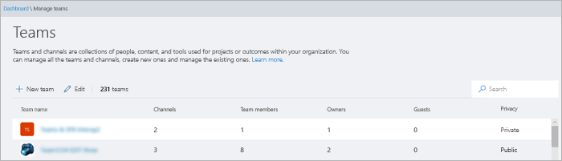
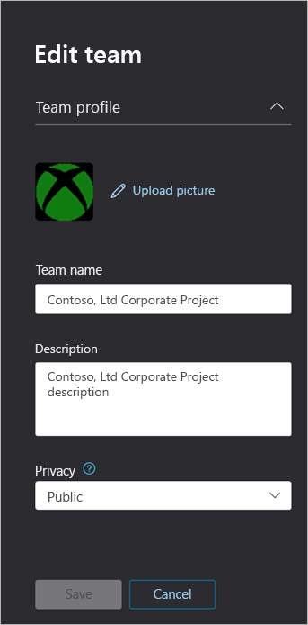

Microsoft 팀원 관리 센터에서 팀 관리Manage teams in the Microsoft Teams admin center
==========================================

## 개요Overview

IT 관리자는 조직이 공동 작업을 위해 설정한 팀을 확인 하거나 업데이트 해야 하거나 팀 구성원 수 감소에 대 한 소유자 할당과 같은 재구성 작업을 수행 해야 할 수도 있습니다.As an IT admin, you may need to view or update the teams that your organization has set up for collaboration, or you might need to perform remediation actions such as assigning owners for ownerless teams. Microsoft 팀 PowerShell 모듈 및 Microsoft 팀 관리 센터를 통해 조직에서 사용 되는 팀을 관리할 수 있습니다.You can manage the teams used in your organization through both the Microsoft Teams PowerShell module and the Microsoft Teams admin center. 이러한 두 도구 집합을 사용 하는 전체 관리 기능을 보려면 다음 역할 중 하나를 할당 했는지 확인 해야 합니다.For full administration capabilities using these two toolsets, you should make sure that you are assigned one of the following roles:

- 전역 관리자Global Administrator
- 팀 서비스 관리자Teams Service Administrator

팀에서 관리자 역할에 대 한 자세한 정보를 확인 하 여 팀을 [관리 하](using-admin-roles.md)고, [microsoft 팀 cmdlet 참조](https://docs.microsoft.com/powershell/teams/?view=teams-ps)에서 팀을 관리 하는 PowerShell cmdlet을 사용 하는 방법에 대해 자세히 알아볼 수 있습니다.You can learn more about admin roles in Teams in [Use Microsoft Teams admin roles to manage Teams](using-admin-roles.md), and you can read more about how to use the PowerShell cmdlets for managing teams in the [Microsoft Teams cmdlet reference](https://docs.microsoft.com/powershell/teams/?view=teams-ps).  

이 문서에서는 Microsoft 팀 관리 센터의 팀을 위한 관리 도구에 대 한 개요를 제공 합니다.This article provides an overview of the management tools for teams in the Microsoft Teams admin center.

## 팀 개요 그리드Teams overview grid

팀의 관리 도구는 Microsoft 팀 관리 센터의 **팀** 노드 아래에 있습니다.Management tools for teams are under the **Teams** node in the Microsoft Teams admin center. (관리 센터에서 팀 \*\*\*\* > **관리**를 선택 합니다.) 각 팀은 Office 365 그룹에서 지원 되며,이 노드는 조직에서 Microsoft 팀을 사용 하도록 설정 된 그룹의 보기를 제공 합니다.(In the admin center, select **Teams** > **Manage teams**.) Each team is backed by an Office 365 group, and this node provides a view of groups that have been Microsoft Teams-enabled in your organization.

  

눈금에는 다음 속성이 표시 됩니다.The grid displays the following properties:

- **팀 이름****Team name**
- **채널** -기본 일반 채널을 포함 하 여 팀에 있는 모든 채널의 수입니다.**Channels** - a count of all channels in the team, including the default General channel.
- **사용자** -테 넌 트의 소유자, 게스트 및 구성원을 비롯 한 총 사용자 수입니다.**Users** - a count of total users, including owners, guests, and members from your tenant.
- **소유자** -이 팀의 소유자 수입니다.**Owners** - a count of owners for this team.
- **게스트** -이 팀의 구성원 인 Azure ACTIVE Directory B2B 게스트 사용자의 수입니다.**Guests** - a count of Azure Active Directory B2B guest users who are members of this team.
- **프라이버시** -Office 365의 지원 그룹의 가시성/AccessType.**Privacy** - the Visibility/AccessType of the backing Office 365 group.
- **상태** -이 팀의 보관 또는 활성 상태입니다.**Status** - the Archived or Active status for this team.  [보관 또는 팀 복원](https://support.office.com/article/archive-or-restore-a-team-dc161cfd-b328-440f-974b-5da5bd98b5a7)에 대 한 팀의 보관에 대해 자세히 알아보세요.Learn more about archiving teams in the [Archive or restore a team](https://support.office.com/article/archive-or-restore-a-team-dc161cfd-b328-440f-974b-5da5bd98b5a7).
- **GroupID** -지원 Office 365 그룹의 고유 GroupID입니다.**GroupID** - the unique GroupID of the backing Office 365 group
- **분류** -조직에서 사용 되는 경우 지원 Office 365 그룹에 할당 된 분류입니다.**Classification** - the classification (if used in your organization) assigned to the backing Office 365 group.  [조직의 Office 그룹에 대 한 만들기 분류의](https://docs.microsoft.com/office365/enterprise/powershell/manage-office-365-groups-with-powershell#create-classifications-for-office-groups-in-your-organization)분류에 대해 자세히 알아보세요.Learn more about classifications at [Create classifications for Office groups in your organization](https://docs.microsoft.com/office365/enterprise/powershell/manage-office-365-groups-with-powershell#create-classifications-for-office-groups-in-your-organization).
- **Description** -Office 백업 365 그룹에 대 한 설명**Description** - the description set for the backing Office 365 group

### 찾아Search

검색에서는 현재 "시작 문자" 문자열을 지원 하 고 **팀 이름** 필드를 검색 합니다.Search currently supports the string "Begins with" and searches the **Team name** field.

### 편집한Edit

표에서 팀을 선택한 다음 **편집** 단추를 선택 하 여 그룹 및 팀 관련 설정을 편집할 수 있습니다.You can edit group and team-specific settings by selecting a team from the grid and then selecting the **Edit** button.

## 팀 프로필Team profile

팀 이름을 클릭 하 여 주 팀 개요 표에서 팀의 팀 프로필 페이지로 이동할 수 있습니다.You can navigate to the team profile page of any team from the main teams overview grid by clicking on the team name. 팀 프로필 페이지에는 팀 (및 해당 지원 O365 그룹)에 속한 구성원, 소유자, 게스트, 팀의 채널 및 설정도 표시 됩니다.The team profile page shows the members, owners, and guests that belong to the team (and its backing O365 Group), as well as the team’s channels and settings. 팀 프로필 페이지에서 다음을 수행할 수 있습니다.From the team profile page, you can:

- 구성원 및 소유자를 추가 하거나 제거 합니다.Add or remove members and owners.
- 채널 추가 또는 제거 (일반 채널은 제거할 수 없음)Add or remove channels (Note that you cannot remove the General channel).
- 팀 및 그룹 설정을 업데이트 합니다.Update team and group settings.
 

## 팀 변경 하기Making changes to teams

팀의 다음 요소를 변경할 수 있습니다.You can change the following elements of a team:
- **팀의 사용자** -구성원을 추가 또는 제거 하 고 소유자의 상태를 올리거나 내릴 수 있습니다.**Users in the team** - you can add or remove members, and promote or demote owners
- **채널** -새 채널을 추가 하거나 기존 채널을 제거할 수 있습니다.**Channels** - you can add new channels or remove existing channels.  기본 "일반" 채널을 삭제할 수 없으며, 만든 후에는 채널 이름만 편집할 수 있습니다 (설명은 아님).You cannot delete the default "General" channel, and once created you can only edit channel name, not description.
- **팀 이름****Team name**
- **팀 설명****Team description**
- **팀 개인 정보** -공개 또는 비공개**Team privacy** - public or private
- **팀 분류** -Office 365 그룹 분류에 의해 지원 됩니다.**Team classification** - backed by your Office 365 group classifications
- **팀 구성원 설정** -팀 구성원 설정 선택**Team member settings** - select team member settings

## 팀에 대해 지원 되는 다른 변경 사항Other supported changes to teams

- **삭제** -팀은 팀 및 해당 하는 Office 365 그룹의 일시 삭제입니다.**Delete** - Deleting a team is a soft-delete of the team and corresponding Office 365 group.  실수로 삭제 된 팀을 복원 하려면 [삭제 된 Office 365 그룹 복원](https://docs.microsoft.com/office365/admin/create-groups/restore-deleted-group?view=o365-worldwide)의 지침을 따릅니다.To restore a mistakenly deleted team, follow the instructions at [Restore a deleted Office 365 Group](https://docs.microsoft.com/office365/admin/create-groups/restore-deleted-group?view=o365-worldwide).
- **보관** -팀을 Microsoft 팀 내에서 읽기 전용 모드로 전환 합니다.**Archive** - Archiving a team puts the team into read-only mode within Microsoft Teams.  관리자는 관리 포털을 통해 조직을 대신 하 여 팀을 보관 하 고 보관할 수 있습니다.As an admin, you can archive and unarchive teams on behalf of your organization via the admin portal.

팀에 대해 변경한 내용이 기록 됩니다.The changes that you make to a team are logged. 그룹 설정을 수정 하는 경우 (이름, 설명, 사진, 개인 정보, 분류 또는 팀 구성원을 변경 하는 경우), 감사 파이프라인을 통해 이러한 변경 내용이 적용 됩니다.If you are modifying group settings (changing the name, description, photo, privacy, classification, or team members), these changes will be attributed to you through the audit pipeline. 팀 관련 설정에 대해 작업을 수행 하는 경우 변경 내용이 추적 되어 팀의 일반 채널에서 사용자에 게 특성화 됩니다.If you are performing actions against Teams-specific settings, your changes will be tracked and attributed to you in the general channel of the team.

## 해결사Troubleshooting

**문제: 팀 개요 표에서 누락 된 팀****Issue: Teams missing from the Team Overview Grid**

Microsoft 팀 관리 센터에 진입 하는 경우 팀의 \*\*\*\* 일부 팀이 팀 개요 그리드 목록에서 누락 되었습니다.When you enter the Microsoft Teams admin center, under the **Teams** option some of your teams are missing from the listing in the Teams Overview Grid.

**원인**:이 문제는 시스템에서 앱을 잘못 (또는 아직) 프로 파일링 했을 때 해당 항목이 인식 될 수 있는 속성 누락으로 이어질 때 발생 합니다.**Cause**: This issue occurs when the team was incorrectly (or not yet) profiled by the system which can lead to a missing property for it to be recognized.

**해결: MS Graph를 통해 수동으로 속성을 올바른 값으로 설정 합니다.****Resolution: Manually set the property to the correct value via MS Graph**

**"[UnifiedGroup](https://docs.microsoft.com/powershell/module/exchange/users-and-groups/get-unifiedgroup?view=exchange-ps)"** cmdlet을 사용 하 여 "**Externaldirectoryobjectid**" 특성으로 Exchange Online powershell을 통해 얻을 수 있는 실제 groupid 인 쿼리의 **{groupid}** 을 (를) 바꿉니다.Replace **{groupid}** in the Query for the actual GroupId in question, which you can get via the Exchange Online powershell, with the **"[Get-UnifiedGroup](https://docs.microsoft.com/powershell/module/exchange/users-and-groups/get-unifiedgroup?view=exchange-ps)"** cmdlet, as the "**ExternalDirectoryObjectId**" attribute.

1. Access [그래프 탐색기](https://developer.microsoft.com/en-us/graph/graph-explorer)Access [Graph Explorer](https://developer.microsoft.com/en-us/graph/graph-explorer)

2. 왼쪽 메뉴의 그래프 탐색기에 로그인Sign in to Graph Explorer on the left menu

3. 쿼리 줄을 다음으로 변경: 패치 > v 1.0 >https://graph.microsoft.com/v1.0/groups/{groupid}Change the query line to: PATCH > v1.0 > https://graph.microsoft.com/v1.0/groups/{groupid}

4. 요청 본문에 다음 값을 추가 합니다. {"resourceProvisioningOptions": ["팀"]}Add the following value on the request body: {"resourceProvisioningOptions": ["Team"]}

5. 오른쪽 위에서 쿼리를 실행 합니다.Run the query on the top-right.

6. Microsoft 팀 관리 센터에서 팀이 올바르게 표시 되는지 확인-팀 개요Confirm the team appears correctly in the Microsoft Teams admin center - Team Overview

## 더 알아보세요Learn more

[Microsoft 팀 cmdlet 참조Microsoft Teams cmdlet reference](https://docs.microsoft.com/powershell/teams/?view=teams-ps)  
[Microsoft 팀의 관리자 역할Admin roles in Microsoft Teams](using-admin-roles.md)
<!--
[Plan for Teams Lifecycle Management](plan-for-teams-lifecycle-management.md)
-->

