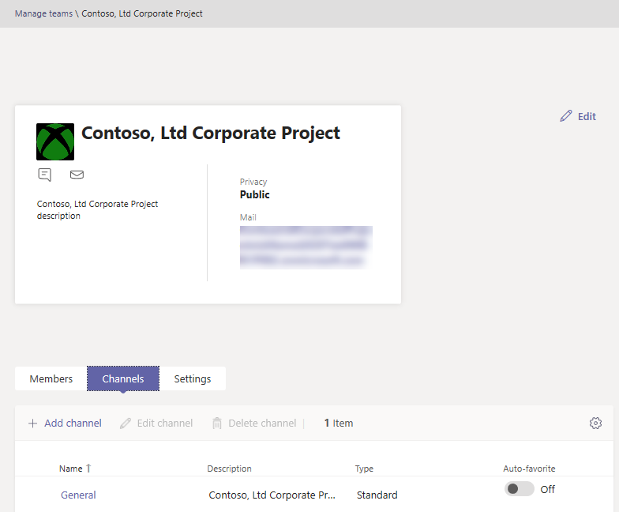

# Microsoft Teams 관리 센터에서 팀 관리

## 개요

이 문서에서는 Microsoft Teams 관리 센터의 Teams 관리 도구에 대한 개요를 제공합니다.

관리자는 조직에서 공동 작업을 위해 설정한 팀을 보거나 업데이트해야 하거나 소유자가 없는 팀에 소유자를 할당하는 등의 수정 작업을 수행해야 할 수 있습니다. Microsoft Teams PowerShell 모듈과 Microsoft Teams 관리 센터를 통해 조직에서 사용하는 팀을 관리할 수 있습니다. <a href="https://go.microsoft.com/fwlink/p/?linkid=2024339" target="_blank">https://admin.microsoft.com</a>에서 관리 센터에 액세스할 수 있습니다. 이 두 가지 도구 세트를 사용하여 전체 관리 기능을 사용하려면 다음 역할 중 하나가 할당되었는지 확인해야 합니다.

- 전역 관리자
- Teams 관리자

[Microsoft Teams 관리자 역할을 사용하여 Teams 관리](using-admin-roles.md)에서 Teams의 관리자 역할에 대해 자세히 알아볼 수 있으며, [Microsoft Teams cmdlet 참조](/powershell/teams/)에서 PowerShell cmdlet을 사용하여 팀을 관리하는 방법에 대해 자세히 알아볼 수 있습니다.

## Teams 개요 그리드

팀을 위한 관리 도구는 Microsoft Teams 관리 센터의 **Teams** 노드에 ​​있습니다. (관리 센터에서 **Teams** > **팀 관리** 를 선택합니다.) 각 팀은 Microsoft 365 그룹의 지원을 받으며 이 노드는 귀하의 조직에서 Microsoft Teams를 사용했던 그룹에 대한 보기를 제공합니다.

  

그리드는 다음 속성을 표시합니다.

- **팀 이름**
- **채널** - 기본 일반 채널을 포함하여 팀의 모든 채널 수입니다.
- **팀 구성원** - 소유자, 게스트, 테넌트 구성원을 포함한 총 사용자 수입니다.
- **소유자** - 이 팀의 소유자 수입니다.
- **게스트** - 이 팀의 구성원인 Azure Active Directory B2B 게스트 사용자 수입니다.
- **개인 정보** - 지원 Microsoft 365 그룹의 가시성/액세스 유형입니다.
- **상태** - 이 팀의 보관됨 또는 활성 상태입니다. [팀 보관 또는 복원](https://support.office.com/article/archive-or-restore-a-team-dc161cfd-b328-440f-974b-5da5bd98b5a7)에서 팀 보관에 대해 자세히 알아보세요.
- **설명** - 지원 Microsoft 365 그룹에 대한 설명입니다.
- **분류** - 지원 Microsoft 365 그룹에 할당된 분류(조직에서 사용되는 경우)입니다. [조직의 Office 그룹에 대한 분류 만들기](/office365/enterprise/powershell/manage-office-365-groups-with-powershell#create-classifications-for-office-groups-in-your-organization)에서 분류에 대해 자세히 알아보세요.
- **GroupID** - 지원하는 Microsoft 365 그룹의 고유한 GroupID입니다.

> [!NOTE]
> 그리드에 이러한 속성이 모두 표시되지 않으면 **열 수정** 아이콘을 클릭하세요. **열 수정** 창에서 토글을 사용하여 그리드의 열을 켜거나 끌 수 있습니다. 완료되면 **적용** 을 클릭합니다.

### 추가

새 팀을 추가하려면 **추가** 을 클릭합니다. **새 팀 추가** 창에서 팀 이름과 설명을 제공하고 비공개 팀으로 만들지 공개 팀으로 만들지 여부를 설정하고 분류를 설정합니다.

> [!NOTE]
> Outlook과 같은 다른 클라이언트의 경험과 달리 새로 만든 팀은 Teams 관리 센터에서 바로 관리할 수 있습니다.

### 편집

그룹 및 팀별 설정을 수정하려면 팀 이름의 왼쪽을 클릭하여 팀을 선택한 다음 **수정** 을 선택합니다.

### 보관

팀을 보관할 수 있습니다. 팀을 보관하면 팀이 Teams 내에서 읽기 전용 모드로 전환됩니다. 관리자는 관리 센터에서 조직을 대신하여 팀을 보관 및 보관 취소할 수 있습니다. 

### 삭제

팀 삭제는 팀 및 해당 Microsoft 365 그룹에 대한 일시 삭제입니다. 실수로 삭제한 팀을 복원하려면 [삭제된 그룹 복원](/microsoft-365/admin/create-groups/restore-deleted-group)의 지침을 따르세요.

### 검색

검색은 현재 "Begins with" 문자열을 지원하고 **팀 이름** 필드를 검색합니다.

## 팀 프로필

팀 이름을 클릭하여 기본 팀 개요 표에서 팀의 팀 프로필 페이지로 이동할 수 있습니다. 팀 프로필 페이지에는 팀(및 지원 Microsoft 365 그룹)에 속한 구성원, 소유자 및 게스트와 팀의 채널 및 설정이 표시됩니다. 팀 프로필 페이지에서 다음을 수행할 수 있습니다.

- 구성원 및 소유자를 추가하거나 제거합니다.
- 채널을 추가하거나 제거합니다(일반 채널은 제거할 수 없음).
- 팀 및 그룹 설정을 변경합니다.
 

## 팀 변경

팀 프로필 페이지에서 팀의 다음 요소를 변경할 수 있습니다.

- **구성원** - 구성원을 추가 또는 제거하고 소유자를 승격 또는 강등시킵니다.
- **채널** - 새 채널을 추가하고 기존 채널을 수정하거나 제거합니다. 기본 일반 채널은 삭제할 수 없습니다.
- **팀 이름**
- **설명**
- **개인정보** - 팀이 공개인지 비공개인지 설정합니다.
- **분류** - Microsoft 365 그룹 ​​분류를 기반으로 합니다. **기밀**, **극비** 또는 **일반** 을 선택합니다.
- **대화 설정** - 구성원이 보낸 메시지를 수정하고 삭제할 수 있는지 여부를 설정합니다.
- **채널 설정** - 회원이 새 채널을 만들고 기존 채널을 편집하고 탭, 커넥터 및 앱을 추가, 편집 및 제거할 수 있는지 여부를 설정합니다.

팀에 대한 변경 사항이 기록됩니다. 그룹 설정을 수정하는 경우(이름, 설명, 사진, 개인 정보, 분류 또는 팀 구성원 변경) 변경 사항은 감사 파이프라인을 통해 사용자에게 귀속됩니다. Teams 관련 설정에 대해 작업을 수행 중인 경우 변경 내용이 추적되고 팀의 일반 채널에서 사용자에게 귀속됩니다.

## 문제 해결

**문제: 팀 개요 표에서 Teams 누락**

Teams 개요 표의 팀 목록에서 일부 팀이 누락되었습니다.

**원인**: 이 문제는 시스템에서 팀을 잘못 프로파일링하여(또는 아직 프로파일링하지 않아) 인식할 속성이 누락될 수 있는 경우에 발생합니다.

**해결 방법: MS 그래프를 통해 속성을 올바른 값으로 수동 설정**

Exchange Online PowerShell을 통해 얻을 수 있는 해당 실제 GroupId에 대한 쿼리에서 **{groupid}** 을(를) "**ExternalDirectoryObjectId**" 속성인 **"[Get-UnifiedGroup](/powershell/module/exchange/users-and-groups/get-unifiedgroup)"** cmdlet으로 바꿉니다.

1. [그래프 탐색기](https://developer.microsoft.com/graph/graph-explorer)에 액세스합니다.

2. 왼쪽 메뉴에서 그래프 탐색기에 로그인합니다.

3. 쿼리 줄을 PATCH > v1.0 > https://graph.microsoft.com/v1.0/groups/{groupid}(으)로 변경합니다.

4. 요청 본문에 {"resourceProvisioningOptions": ["Team"]} 값을 추가합니다.

5. 오른쪽 상단에서 쿼리를 실행합니다.

6. Microsoft Teams 관리 센터 - 팀 개요에 팀이 올바르게 표시되는지 확인합니다.

## 자세한 정보

- [Teams cmdlet 참조](/powershell/teams/)  
- [Teams 관리자 역할을 사용하여 Teams 관리](using-admin-roles.md)
- [Teams에서 수명 주기 관리 계획](plan-teams-lifecycle.md)
