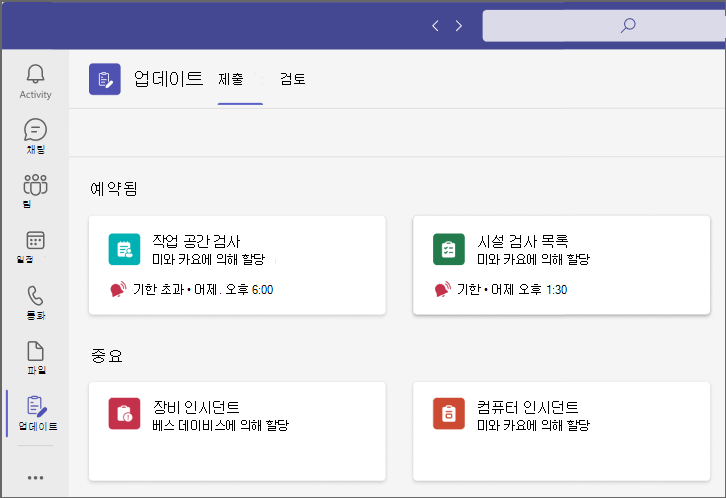
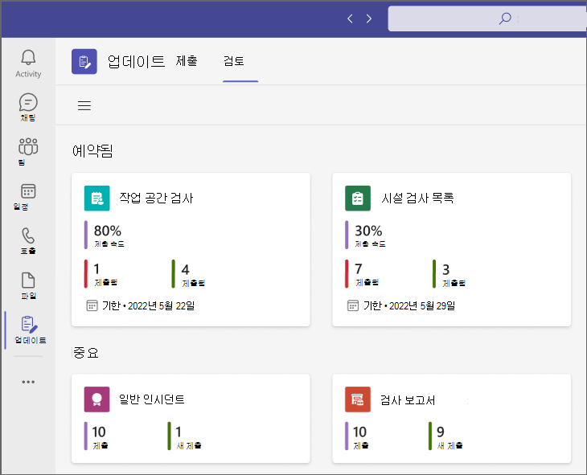
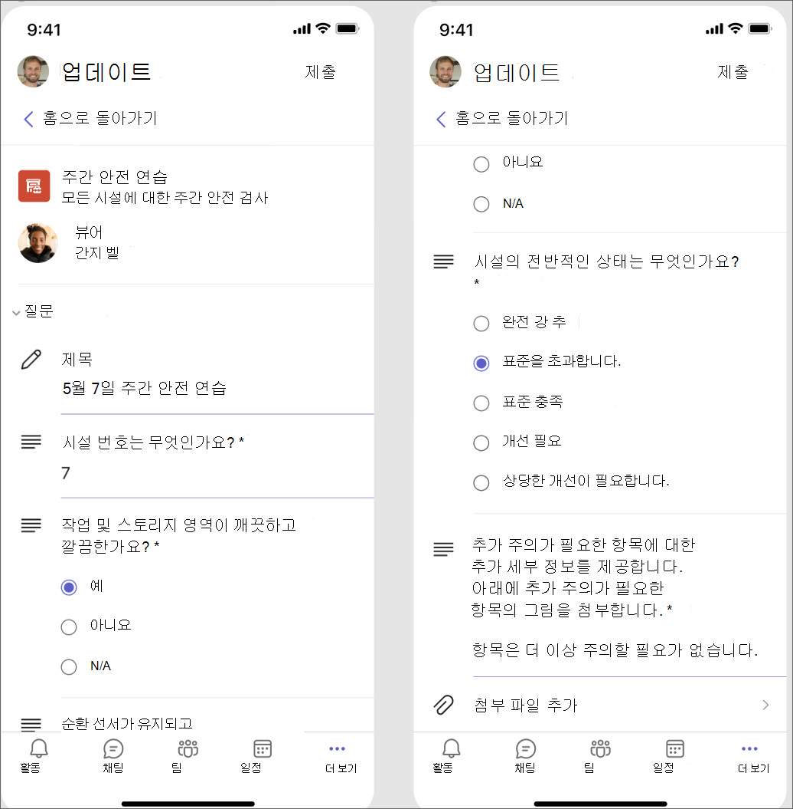
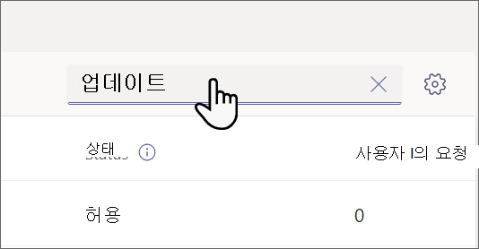
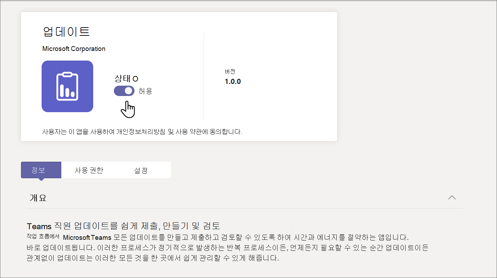

# Microsoft Teams에서 조직의 업데이트 앱 관리

## 업데이트 앱이란?

Microsoft Teams 앱의 업데이트 조직의 구성원이 업데이트를 만들고, 검토하고, 제출할 수 있는 중앙 집중식 위치를 제공합니다. 템플릿을 만들면 업데이트 앱을 사용하여 조직에 필요한 모든 항목을 추적할 수 있습니다. 업데이트 데스크톱과 모바일 모두에서 사용할 수 있습니다.

Teams에서 사용자는 Teams 앱 스토어에서 업데이트 받을 수 있습니다. **제출** 페이지에 제출해야 하는 모든 업데이트가 표시됩니다. [업데이트 문서의 시작을](https://support.microsoft.com/office/get-started-in-updates-c03a079e-e660-42dc-817b-ca4cfd602e5a) 사용자와 공유하여 사용자가 업데이트 편안하게 사용할 수 있도록 도와줄 수 있습니다.

사용자는 **검토** 페이지에서 할당한 업데이트를 볼 수 있습니다.

사용자에게 업데이트가 할당되면 Teams 활동 피드에 표시됩니다. 사용자는 업데이트 앱에서 모든 현재 업데이트 요청 및 이전 제출을 볼 수도 있습니다. 또한 누구나 템플릿을 만들고 업데이트 요청을 보낼 수 있습니다.

업데이트 일반적인 비즈니스 시나리오에 대한 기본 제공 템플릿과 고유한 템플릿을 만드는 옵션이 함께 제공됩니다. 누구나 새로운 유형의 업데이트에 대한 템플릿을 만들 수 있습니다.

## 시나리오 예

의류 매장의 직원은 매일 매장을 열고 닫을 책임이 있습니다. 매일 아침, 시프트 리더는 업데이트 앱의 기본 템플릿인 스토어 열기 업데이트를 채웁니다. 이 업데이트에서는 전날 밤 폐점과 관련된 문제를 설명하고, 매장의 청결에 대한 질문에 답하고, 보충이 필요한 모든 물품을 보고합니다. 업데이트를 제출하면 저장소에 대한 요구 사항과 문제를 빠르고 효율적으로 전달할 수 있습니다. 일일 업데이트는 또한 매장 동료에게 잘 진행되고 있는 일을 강조할 수 있는 기회를 제공합니다.

매장의 제조 시설에서 직원들은 모바일 장치를 사용하여 업데이트 안전 검사를 수행합니다.

한편, 원격 작업자 팀이 매장의 웹 사이트를 업데이트하고 있습니다. 표준 시간대에 분산되어 있으므로 매일 스탠드업 모임이 편리하지 않습니다. 대신 각 팀 구성원은 팀 리더에게 진행 상황에 대한 매일 업데이트 보고서를 제출합니다.

[업데이트 lookbook을 다운로드하여 업데이트](https://go.microsoft.com/fwlink/?linkid=2197649&clcid=0x409) 수행할 수 있는 작업의 더 많은 예제를 확인합니다.

## 필요한 권한 및 라이선스

업데이트 배포하려면 다음 항목에 대한 권한이 필요합니다.

- Microsoft Dataverse 데이터베이스를 만들 수 있는 권한입니다.

- [powerautomate.microsoft.com](https://powerautomate.microsoft.com/) 계정입니다.

- 대상 환경의 관리자 역할입니다.

- Power Automate, Office 365 또는 Dynamics 365에 대한 라이선스입니다.

- 사용자가 새 템플릿을 설정하려면 Microsoft Forms 대한 라이선스가 필요합니다.

## Microsoft Dataverse를 사용하는 스토리지

CDM(Common Data Model)은 Microsoft Dataverse의 비즈니스 및 분석 애플리케이션에서 사용하는 공유 데이터 언어입니다. Microsoft와 파트너가 게시한 표준화되고 확장 가능한 데이터 스키마 집합으로 구성되며, 이를 통해 애플리케이션 및 비즈니스 프로세스에서 데이터의 일관성과 그 의미를 구현할 수 있습니다. [공통 데이터 모델에](/common-data-model/) 대해 자세히 알아봅니다.

템플릿에서 만든 업데이트 제목, 세부 정보, 템플릿 ID 등과 같은 데이터를 Microsoft Dataverse에 저장합니다.  [Microsoft Forms 데이터 스토리지에](https://support.microsoft.com/office/data-storage-for-microsoft-forms-97a34e2e-98e1-4dc2-b6b4-7a8444cb1dc3#:~:text=Where%20data%20is%20stored%20for%20Microsoft%20Forms.%20Microsoft,European-based%20tenants%20is%20stored%20on%20servers%20in%20Europe) 대해 자세히 알아봅니다.

>[!Note]
>Microsoft Forms 사이트에서 양식 서식 파일을 삭제하면 업데이트 서식 파일이 중단되고 사용자가 업데이트를 제출할 수 없습니다. 사용자는 Microsoft Forms 삭제된 템플릿을 열려고 할 때 "CDB TableNotFound" 오류가 발생합니다.

## Teams 앱 권한 업데이트

업데이트 Teams 앱을 사용하면 다음 기능에 액세스할 수 있습니다.

- 메시지에 제공하는 메시지 및 데이터를 수신합니다.

- 메시지 및 알림을 보냅니다.

- Teams이 제공한 헤더 없이 개인 앱 및 대화 상자를 렌더링합니다.

- 이름, 전자 메일 주소, 회사 이름 및 기본 설정 언어와 같은 프로필 정보에 액세스합니다.

- Teams 구성원이 채널에 제공하는 메시지 및 데이터를 수신합니다.

- 채널에서 메시지 및 알림을 보냅니다.

- 다음과 같은 Teams 정보에 액세스합니다.
  - 팀 이름
  - 채널 목록
  - 명단(팀 구성원의 이름 및 전자 메일 주소)

- 팀의 정보를 사용하여 팀에 연락하세요.

## 업데이트 앱 사용 안 함

업데이트 앱은 기본적으로 사용할 수 있습니다. Teams 관리 센터에서 앱을 비활성화할 수 있습니다.

  1. Teams 관리 센터에 로그인합니다.

  2. **Teams 앱** > **앱 관리** 로 이동합니다.

  3. 업데이트 앱을 검색합니다.

     

  4. **업데이트** 선택합니다.

  5. 조직에 대한 앱을 비활성화하려면 토글을 선택합니다.
    

## Teams에 업데이트 고정

앱 설정 정책을 사용하면 Teams를 사용자 지정하여 사용자의 사용자에게 가장 중요한 앱을 고정할 수 있습니다. 앱은 사용자가 빠르고 쉽게 액세스할 수 있는 Teams 데스크톱 클라이언트의 측면과 Teams 모바일 클라이언트 아래쪽에 있는 표시줄인 앱 바에 고정됩니다.

사용자에 대한 업데이트 앱을 고정하려면 전역(조직 전체 기본값) 정책을 편집하거나 사용자 지정 앱 설정 정책을 만들고 할당할 수 있습니다. 자세한 내용은 [Teams에서 앱 설정 정책 관리](teams-app-setup-policies.md)를 참조하세요.

## 보존 정책

업데이트 앱에서 만든 업데이트 현재 백업을 지원하지 않는 기본 Microsoft Dataverse 환경에 저장됩니다. [환경을 백업 및 복원하는 방법에 대해 자세히 알아보세요. PowerPlatform \|Microsoft Docs](/power-platform/admin/backup-restore-environments).

양식에 저장된 데이터는 템플릿 작성자가 Microsoft Forms 웹앱의 **삭제된 양식** 탭에서 정리할 때까지 삭제되지 않습니다.

## 조건부 액세스 및 권한 정책

Teams의 업데이트 앱은 현재 Microsoft Teams에 대해 설정된 조건부 액세스 정책을 지원하지 않습니다.

[Teams 앱 권한 정책을](teams-app-permission-policies.md) 사용하여 업데이트 관리할 수 있습니다.

## 데이터 제한 사항

각 사용자는 최대 400개의 업데이트 템플릿을 만들 수 있으며, 각 템플릿은 Microsoft Forms 현재 기능에 따라 최대 50,000개의 요청을 수집할 수 있습니다.

## 보안

Teams 업데이트 앱에서 사용자는 새 업데이트를 만들고 보내고 받은 업데이트를 볼 수 있습니다. 사용자는 요청의 뷰어가 아닌 한 다른 사용자가 만든 업데이트 액세스할 수 없습니다.

> [!Note]
> 업데이트 보고서가 만들어진 채팅 또는 채널의 일부이거나 템플릿 작성자가 수동으로 뷰어로 추가하는 경우 사용자에게 요청의 뷰어 역할이 부여됩니다. 보고서를 만들 때 해당 역할이 부여되지 않은 경우 요청에 대해 조치를 취할 수 없습니다.
