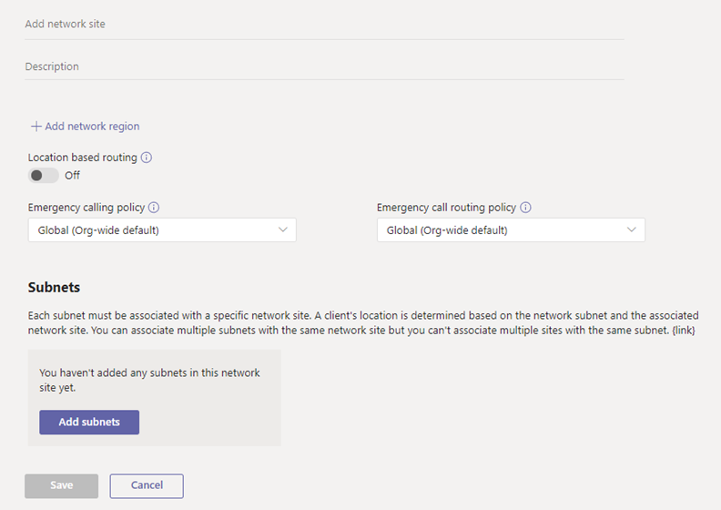

# <a name="manage-your-network-topology-for-cloud-voice-features-in-microsoft-teams"></a><span data-ttu-id="01234-103">Microsoft 팀의 클라우드 음성 기능에 대 한 네트워크 토폴로지 관리</span><span class="sxs-lookup"><span data-stu-id="01234-103">Manage your network topology for cloud voice features in Microsoft Teams</span></span>

<span data-ttu-id="01234-104">조직에서 직접 라우팅 또는 [동적 비상 전화](configure-dynamic-emergency-calling.md) [에 대 한 위치 기반 라우팅을](location-based-routing-plan.md) 배포 하는 경우에는 Microsoft 팀의 이러한 클라우드 음성 기능에 사용할 네트워크 설정을 구성 해야 합니다.</span><span class="sxs-lookup"><span data-stu-id="01234-104">If your organization is deploying [Location-Based Routing for Direct Routing](location-based-routing-plan.md) or [dynamic emergency calling](configure-dynamic-emergency-calling.md), you must configure network settings for use with these cloud voice features in Microsoft Teams.</span></span> <span data-ttu-id="01234-105">네트워크 설정은 팀 클라이언트의 위치를 확인 하 고 네트워크 지역, 네트워크 사이트, 서브넷, 신뢰할 수 있는 IP 주소를 포함 하는 데 사용 됩니다.</span><span class="sxs-lookup"><span data-stu-id="01234-105">Network settings are used to determine the location of a Teams client and include network regions, network sites, subnets, and trusted IP addresses.</span></span> <span data-ttu-id="01234-106">배포 하는 클라우드 음성 기능 및 기능에 따라 이러한 설정을 일부 또는 모두 구성 합니다.</span><span class="sxs-lookup"><span data-stu-id="01234-106">Depending on the cloud voice feature and capability that you're deploying, you configure some or all these settings.</span></span> <span data-ttu-id="01234-107">이러한 용어에 대 한 자세한 내용은 [클라우드 음성 기능에 대 한 네트워크 설정을](cloud-voice-network-settings.md)참조 하세요.</span><span class="sxs-lookup"><span data-stu-id="01234-107">To learn more about these terms, see [Network settings for cloud voice features](cloud-voice-network-settings.md).</span></span>

<span data-ttu-id="01234-108">Microsoft 팀 관리 센터의 **네트워크 토폴로지** 페이지에서 또는 Windows PowerShell을 사용 하 여 네트워크 설정을 구성 합니다.</span><span class="sxs-lookup"><span data-stu-id="01234-108">You configure network settings on the **Network topology** page of the Microsoft Teams admin center or by using Windows PowerShell.</span></span>

## <a name="configure-network-settings-in-the-microsoft-teams-admin-center"></a><span data-ttu-id="01234-109">Microsoft 팀 관리 센터에서 네트워크 설정 구성</span><span class="sxs-lookup"><span data-stu-id="01234-109">Configure network settings in the Microsoft Teams admin center</span></span>

[!INCLUDE [preview-feature](includes/preview-feature.md)]

<span data-ttu-id="01234-110">네트워크 **토폴로지** 페이지의 **네트워크 사이트** 탭에서 네트워크 지역, 네트워크 사이트 및 서브넷을 정의 합니다.</span><span class="sxs-lookup"><span data-stu-id="01234-110">You define network regions, network sites, and subnets on the **Network sites** tab of the **Network topology** page.</span></span> <span data-ttu-id="01234-111">여기서는 네트워크 사이트를 만들거나 수정 하 고, 사이트와 네트워크 영역을 연결 하 고, 서브넷을 사이트에 연결 하 고, 위치 기반 라우팅을 설정 하 고, 사이트에 응급 정책을 할당할 수 있습니다.</span><span class="sxs-lookup"><span data-stu-id="01234-111">Here, you can create or modify a network site, associate a site with a network region, associate a subnet to the site, turn on Location-based Routing, and assign emergency policies to the site.</span></span> <span data-ttu-id="01234-112">모든 사이트에 전체적으로 사용할 수 있는 네트워크 지역을 추가할 수도 있습니다.</span><span class="sxs-lookup"><span data-stu-id="01234-112">You can also add network regions that can be used globally for all sites.</span></span>

#### <a name="add-and-configure-a-network-site"></a><span data-ttu-id="01234-113">네트워크 사이트 추가 및 구성</span><span class="sxs-lookup"><span data-stu-id="01234-113">Add and configure a network site</span></span>

1. <span data-ttu-id="01234-114">Microsoft 팀 관리 센터의 왼쪽 탐색 창에서 **위치**  >  **네트워크 토폴로지로**이동한 다음 **네트워크 사이트** 탭을 클릭 합니다.</span><span class="sxs-lookup"><span data-stu-id="01234-114">In the left navigation of the Microsoft Teams admin center, go to **Locations** > **Network topology**, and then click the **Network sites** tab.</span></span>
2. <span data-ttu-id="01234-115">**추가**를 클릭 한 다음 사이트의 이름과 설명을 입력 합니다.</span><span class="sxs-lookup"><span data-stu-id="01234-115">Click **Add**, and then enter a name and description for the site.</span></span>

    

3. <span data-ttu-id="01234-117">사이트를 네트워크 지역에 연결 하려면 **네트워크 지역 추가**를 클릭 하 고 기존 지역을 선택 하거나 **추가** 를 클릭 하 여 지역을 추가한 다음 **링크**를 클릭 합니다.</span><span class="sxs-lookup"><span data-stu-id="01234-117">To associate the site with a network region, click **Add network region**, select an existing region or click **Add** to add a region, and then click **Link**.</span></span>  
4. <span data-ttu-id="01234-118">사이트의 위치 기반 라우팅을 사용 하려면 **위치 기반 라우팅을**설정 합니다.</span><span class="sxs-lookup"><span data-stu-id="01234-118">To enable Location-Based Routing for the site, turn on **Location based routing**.</span></span>
5. <span data-ttu-id="01234-119">사이트에 응급 서비스 정책을 할당 하려면 다음 중 하나 또는 모두를 수행 합니다.</span><span class="sxs-lookup"><span data-stu-id="01234-119">To assign emergency services policies to the site, do one or both of the following:</span></span>

    - <span data-ttu-id="01234-120">조직에서 통화 계획 또는 배포 된 전화 시스템 직접 라우팅을 사용 하는 경우 **비상 전화 정책**에서 원하는 정책을 선택 합니다.</span><span class="sxs-lookup"><span data-stu-id="01234-120">If your organization uses Calling Plans or deployed Phone System Direct Routing, under **Emergency calling policy**, select the policy that you want.</span></span>
    - <span data-ttu-id="01234-121">조직에서 전화 시스템 직접 라우팅을 배포한 경우 **비상 전화 라우팅 정책**에서 원하는 정책을 선택 합니다.</span><span class="sxs-lookup"><span data-stu-id="01234-121">If your organization deployed Phone System Direct Routing, under **Emergency call routing policy**, select the  policy that you want.</span></span>

6. <span data-ttu-id="01234-122">서브넷을 사이트에 연결 하려면 **서브넷**에서 **서브넷 추가**를 클릭 합니다.</span><span class="sxs-lookup"><span data-stu-id="01234-122">To associate a subnet to the site, under **Subnets**, click **Add subnets**.</span></span> <span data-ttu-id="01234-123">IP 버전, IP 주소, 네트워크 범위, 설명 추가를 지정 하 고 **적용**을 클릭 합니다.</span><span class="sxs-lookup"><span data-stu-id="01234-123">Specify the IP version, IP address, network range, add a description, and then click **Apply**.</span></span> <span data-ttu-id="01234-124">각 서브넷은 특정 사이트와 연결 되어야 합니다.</span><span class="sxs-lookup"><span data-stu-id="01234-124">Each subnet must be associated with a specific site.</span></span>
7. <span data-ttu-id="01234-125">**저장**을 클릭합니다.</span><span class="sxs-lookup"><span data-stu-id="01234-125">Click **Save**.</span></span>

#### <a name="modify-a-network-site"></a><span data-ttu-id="01234-126">네트워크 사이트 수정</span><span class="sxs-lookup"><span data-stu-id="01234-126">Modify a network site</span></span>

1. <span data-ttu-id="01234-127">Microsoft 팀 관리 센터의 왼쪽 탐색 창에서 **위치**  >  **네트워크 토폴로지로**이동한 다음 **네트워크 사이트** 탭을 클릭 합니다.</span><span class="sxs-lookup"><span data-stu-id="01234-127">In the left navigation of the Microsoft Teams admin center, go to **Locations** > **Network topology**, and then click the **Network sites** tab.</span></span>
2. <span data-ttu-id="01234-128">사이트 이름 왼쪽에 있는을 클릭 하 여 사이트를 선택 하 고 **편집**을 클릭 합니다.</span><span class="sxs-lookup"><span data-stu-id="01234-128">Select the site by clicking to the left of the site name, and then click **Edit**.</span></span>
3. <span data-ttu-id="01234-129">원하는 변경 작업을 수행한 다음 저장을 클릭 **합니다.**</span><span class="sxs-lookup"><span data-stu-id="01234-129">Make the changes that you want, and then click **Save.**</span></span>

### <a name="manage-external-trusted-ip-addresses"></a><span data-ttu-id="01234-130">신뢰할 수 있는 외부 IP 주소 관리</span><span class="sxs-lookup"><span data-stu-id="01234-130">Manage external trusted IP addresses</span></span>

<span data-ttu-id="01234-131">Microsoft 팀 관리 센터의 **네트워크 토폴로지** 페이지에서 **신뢰할** 수 있는 ip 주소를 관리 합니다.</span><span class="sxs-lookup"><span data-stu-id="01234-131">You manage external trusted IP addresses on the **Trusted IPs** tab on the **Network topology** page of the Microsoft Teams admin center.</span></span> <span data-ttu-id="01234-132">외부 신뢰 IP 주소를 무제한으로 추가할 수 있습니다.</span><span class="sxs-lookup"><span data-stu-id="01234-132">You can add an unlimited number of external trusted IP addresses.</span></span>

#### <a name="add-a-trusted-ip-address"></a><span data-ttu-id="01234-133">신뢰할 수 있는 IP 주소 추가</span><span class="sxs-lookup"><span data-stu-id="01234-133">Add a trusted IP address</span></span>

1. <span data-ttu-id="01234-134">Microsoft 팀 관리 센터의 왼쪽 탐색 창에서 **위치**  >  **네트워크 토폴로지로**이동한 다음 **신뢰할 수 있는 ip** 탭을 클릭 합니다.</span><span class="sxs-lookup"><span data-stu-id="01234-134">In the left navigation of the Microsoft Teams admin center, go to **Locations** > **Network topology**, and then click the **Trusted IPs** tab.</span></span>
2. <span data-ttu-id="01234-135">**새로 만들기**를 클릭 합니다.</span><span class="sxs-lookup"><span data-stu-id="01234-135">Click **New**.</span></span>
3. <span data-ttu-id="01234-136">**신뢰할 수 있는 ip 주소 추가** 창에서 ip 버전, ip 주소, 네트워크 범위, 설명 추가를 지정 하 고 **적용**을 클릭 합니다.</span><span class="sxs-lookup"><span data-stu-id="01234-136">In the **Add trusted IP address** pane, specify the IP version, IP address, network range, add a description, and then click **Apply**.</span></span>

    

#### <a name="edit-a-trusted-ip-address"></a><span data-ttu-id="01234-138">신뢰할 수 있는 IP 주소 편집</span><span class="sxs-lookup"><span data-stu-id="01234-138">Edit a trusted IP address</span></span>

1. <span data-ttu-id="01234-139">Microsoft 팀 관리 센터의 왼쪽 탐색 창에서 **위치**  >  **네트워크 토폴로지로**이동한 다음 **신뢰할 수 있는 ip** 탭을 클릭 합니다.</span><span class="sxs-lookup"><span data-stu-id="01234-139">In the left navigation of the Microsoft Teams admin center, go to **Locations** > **Network topology**, and then click the **Trusted IPs** tab.</span></span>
2. <span data-ttu-id="01234-140">왼쪽을 클릭 하 여 IP 주소를 선택 하 고 **편집**을 클릭 합니다.</span><span class="sxs-lookup"><span data-stu-id="01234-140">Select the IP address by clicking to the left of it, and then click **Edit**.</span></span>
3. <span data-ttu-id="01234-141">**신뢰할 수 있는 IP 주소 편집** 창에서 원하는 변경 작업을 수행 하 고 **적용**을 클릭 합니다.</span><span class="sxs-lookup"><span data-stu-id="01234-141">In the **Edit trusted IP address** pane, make the changes that you want, and then click **Apply**.</span></span>

## <a name="configure-network-settings-using-powershell"></a><span data-ttu-id="01234-142">PowerShell을 사용 하 여 네트워크 설정 구성</span><span class="sxs-lookup"><span data-stu-id="01234-142">Configure network settings using PowerShell</span></span>

<span data-ttu-id="01234-143">이 섹션의 단계를 완료 하려면 PowerShell cmdlet에 대해 잘 알고 있어야 합니다.</span><span class="sxs-lookup"><span data-stu-id="01234-143">To complete the steps in this section, you'll need some familiarity with PowerShell cmdlets.</span></span> <span data-ttu-id="01234-144">자세히 알아보려면 [팀 PowerShell 개요](teams-powershell-overview.md)를 참조 하세요.</span><span class="sxs-lookup"><span data-stu-id="01234-144">To learn more, see [Teams PowerShell Overview](teams-powershell-overview.md).</span></span>

### <a name="define-network-regions"></a><span data-ttu-id="01234-145">네트워크 지역 정의</span><span class="sxs-lookup"><span data-stu-id="01234-145">Define network regions</span></span>

 <span data-ttu-id="01234-146">[새-Csten앤틸리스 지역](https://docs.microsoft.com/powershell/module/skype/New-CsTenantNetworkRegion) cmdlet을 사용 하 여 네트워크 지역을 정의 합니다.</span><span class="sxs-lookup"><span data-stu-id="01234-146">Use the [New-CsTenantNetworkRegion](https://docs.microsoft.com/powershell/module/skype/New-CsTenantNetworkRegion) cmdlet to define network regions.</span></span> <span data-ttu-id="01234-147">영역 ID 매개 변수는 영역의 지리를 나타내는 논리 이름이 며, 종속성 또는 제한이 없으며 CentralSite &lt; SITE ID &gt; 매개 변수는 선택 사항입니다.</span><span class="sxs-lookup"><span data-stu-id="01234-147">Note that the RegionID parameter is a logical name that represents the geography of the region and has no dependencies or restrictions and the CentralSite &lt;site ID&gt; parameter is optional.</span></span>

```PowerShell
New-CsTenantNetworkRegion -NetworkRegionID <region ID>  
```

<span data-ttu-id="01234-148">이 예제에서는 인도 라는 네트워크 영역을 만듭니다.</span><span class="sxs-lookup"><span data-stu-id="01234-148">In this example, we create a network region named India.</span></span>
```PowerShell
New-CsTenantNetworkRegion -NetworkRegionID "India"  
```

<span data-ttu-id="01234-149">[집합-Csten\ 네트워크 지역](https://docs.microsoft.com/powershell/module/skype/set-cstenantnetworkregion)도 참조 하세요.</span><span class="sxs-lookup"><span data-stu-id="01234-149">See also [Set-CsTenantNetworkRegion](https://docs.microsoft.com/powershell/module/skype/set-cstenantnetworkregion).</span></span>

### <a name="define-network-sites"></a><span data-ttu-id="01234-150">네트워크 사이트 정의</span><span class="sxs-lookup"><span data-stu-id="01234-150">Define network sites</span></span>

<span data-ttu-id="01234-151">[새-Csten앤틸리스 site](https://docs.microsoft.com/powershell/module/skype/new-cstenantnetworksite?view=skype-ps) cmdlet을 사용 하 여 네트워크 사이트를 정의 합니다.</span><span class="sxs-lookup"><span data-stu-id="01234-151">Use the [New-CsTenantNetworkSite](https://docs.microsoft.com/powershell/module/skype/new-cstenantnetworksite?view=skype-ps) cmdlet to define network sites.</span></span> <span data-ttu-id="01234-152">각 네트워크 사이트는 네트워크 지역과 연결 되어 있어야 합니다.</span><span class="sxs-lookup"><span data-stu-id="01234-152">Each network site must be associated with a network region.</span></span>

```PowerShell
New-CsTenantNetworkSite -NetworkSiteID <site ID> -NetworkRegionID <region ID>
```

<span data-ttu-id="01234-153">이 예제에서는 인도 지역에 2 개의 새 네트워크 사이트, 뉴델리 및 Hyderabad을 만듭니다.</span><span class="sxs-lookup"><span data-stu-id="01234-153">In this example, we create two new network sites, Delhi and Hyderabad, in the India region.</span></span>

```PowerShell
New-CsTenantNetworkSite -NetworkSiteID "Delhi" -NetworkRegionID "India"
New-CsTenantNetworkSite -NetworkSiteID "Hyderabad" -NetworkRegionID "India"
```

<span data-ttu-id="01234-154">다음 표에는이 예제에 정의 된 네트워크 사이트가 나와 있습니다.</span><span class="sxs-lookup"><span data-stu-id="01234-154">The following table shows the network sites defined in this example.</span></span>

||<span data-ttu-id="01234-155">사이트 1</span><span class="sxs-lookup"><span data-stu-id="01234-155">Site 1</span></span> |<span data-ttu-id="01234-156">사이트 2</span><span class="sxs-lookup"><span data-stu-id="01234-156">Site 2</span></span> |
|---------|---------|---------|
|<span data-ttu-id="01234-157">사이트 ID</span><span class="sxs-lookup"><span data-stu-id="01234-157">Site ID</span></span>    |    <span data-ttu-id="01234-158">사이트 1(뉴델리)</span><span class="sxs-lookup"><span data-stu-id="01234-158">Site 1 (Delhi)</span></span>     |  <span data-ttu-id="01234-159">Site 2 (Hyderabad)</span><span class="sxs-lookup"><span data-stu-id="01234-159">Site 2 (Hyderabad)</span></span>       |
|<span data-ttu-id="01234-160">지역 ID</span><span class="sxs-lookup"><span data-stu-id="01234-160">Region ID</span></span>  |     <span data-ttu-id="01234-161">지역 1 (인도)</span><span class="sxs-lookup"><span data-stu-id="01234-161">Region 1 (India)</span></span>    |   <span data-ttu-id="01234-162">지역 1 (인도)</span><span class="sxs-lookup"><span data-stu-id="01234-162">Region 1 (India)</span></span>      |

<span data-ttu-id="01234-163">[집합-Csten\ 네트워크 지역](https://docs.microsoft.com/powershell/module/skype/set-cstenantnetworksite)도 참조 하세요.</span><span class="sxs-lookup"><span data-stu-id="01234-163">See also [Set-CsTenantNetworkRegion](https://docs.microsoft.com/powershell/module/skype/set-cstenantnetworksite).</span></span>

### <a name="define-network-subnets"></a><span data-ttu-id="01234-164">네트워크 서브넷 정의</span><span class="sxs-lookup"><span data-stu-id="01234-164">Define network subnets</span></span>

<span data-ttu-id="01234-165">[새-Csten앤틸리스 subnet](https://docs.microsoft.com/powershell/module/skype/new-cstenantnetworksubnet?view=skype-ps) cmdlet을 사용 하 여 네트워크 서브넷을 정의 하 고 네트워크 사이트에 연결 합니다.</span><span class="sxs-lookup"><span data-stu-id="01234-165">Use the [New-CsTenantNetworkSubnet](https://docs.microsoft.com/powershell/module/skype/new-cstenantnetworksubnet?view=skype-ps) cmdlet to define network subnets and associate them to network sites.</span></span> <span data-ttu-id="01234-166">각 네트워크 서브넷은 한 사이트에만 연결 될 수 있습니다.</span><span class="sxs-lookup"><span data-stu-id="01234-166">Each network subnet can only be associated with one site.</span></span>

```PowerShell
New-CsTenantNetworkSubnet -SubnetID <Subnet IP address> -MaskBits <Subnet bitmask> -NetworkSiteID <site ID>
```

<span data-ttu-id="01234-167">이 예제에서는 서브넷 192.168.0.0과 뉴델리 네트워크 사이트 간 연결과 서브넷 2001 간 연결 (4898: e8:25:844e: 926f: 85ad: dd8e 및 Hyderabad network site를 만듭니다.</span><span class="sxs-lookup"><span data-stu-id="01234-167">In this example, we create an association between subnet 192.168.0.0 and the Delhi network site and between subnet 2001:4898:e8:25:844e:926f:85ad:dd8e and the Hyderabad network site.</span></span>

```PowerShell
New-CsTenantNetworkSubnet -SubnetID "192.168.0.0" -MaskBits "24" -NetworkSiteID "Delhi"
New-CsTenantNetworkSubnet -SubnetID "2001:4898:e8:25:844e:926f:85ad:dd8e" -MaskBits "120" -NetworkSiteID "Hyderabad"
```

<span data-ttu-id="01234-168">다음 표에는이 예제에 정의 된 서브넷이 나와 있습니다.</span><span class="sxs-lookup"><span data-stu-id="01234-168">The following table shows the subnets defined in this example.</span></span>

||<span data-ttu-id="01234-169">사이트 1</span><span class="sxs-lookup"><span data-stu-id="01234-169">Site 1</span></span> |<span data-ttu-id="01234-170">사이트 2</span><span class="sxs-lookup"><span data-stu-id="01234-170">Site 2</span></span> |
|---------|---------|---------|
|<span data-ttu-id="01234-171">서브넷 ID</span><span class="sxs-lookup"><span data-stu-id="01234-171">Subnet ID</span></span>   |    <span data-ttu-id="01234-172">192.168.0.0</span><span class="sxs-lookup"><span data-stu-id="01234-172">192.168.0.0</span></span>     |  <span data-ttu-id="01234-173">2001:4898: e8:25:844e: 926f: 85ad: dd8e</span><span class="sxs-lookup"><span data-stu-id="01234-173">2001:4898:e8:25:844e:926f:85ad:dd8e</span></span>     |
|<span data-ttu-id="01234-174">마스킹하</span><span class="sxs-lookup"><span data-stu-id="01234-174">Mask</span></span>  |     <span data-ttu-id="01234-175">fps</span><span class="sxs-lookup"><span data-stu-id="01234-175">24</span></span>    |   <span data-ttu-id="01234-176">120</span><span class="sxs-lookup"><span data-stu-id="01234-176">120</span></span>      |
|<span data-ttu-id="01234-177">사이트 ID</span><span class="sxs-lookup"><span data-stu-id="01234-177">Site ID</span></span>  | <span data-ttu-id="01234-178">사이트 (뉴델리)</span><span class="sxs-lookup"><span data-stu-id="01234-178">Site (Delhi)</span></span> | <span data-ttu-id="01234-179">Site 2 (Hyderabad)</span><span class="sxs-lookup"><span data-stu-id="01234-179">Site 2 (Hyderabad)</span></span> |

<span data-ttu-id="01234-180">여러 서브넷의 경우 다음과 같은 스크립트를 사용 하 여 CSV 파일을 가져올 수 있습니다.</span><span class="sxs-lookup"><span data-stu-id="01234-180">For multiple subnets, you can import a CSV file by using a script such as the following.</span></span>

```PowerShell
Import-CSV C:\subnet.csv | foreach {New-CsTenantNetworkSubnet –SubnetID $_.SubnetID-MaskBits $_.Mask -NetworkSiteID $_.SiteID}  
```

<span data-ttu-id="01234-181">이 예제에서 CSV 파일은 다음과 같습니다.</span><span class="sxs-lookup"><span data-stu-id="01234-181">In this example, the CSV file looks something like this:</span></span>

```console
Identity, Mask, SiteID
172.11.12.0, 24, Redmond
172.11.13.0, 24, Chicago
172.11.14.0, 25, Vancouver
172.11.15.0, 28, Paris
```

<span data-ttu-id="01234-182">[집합-Csten앤틸리스 서브넷](hhttps://docs.microsoft.com/powershell/module/skype/set-cstenantnetworksubnet)을 참조 하세요.</span><span class="sxs-lookup"><span data-stu-id="01234-182">See also [Set-CsTenantNetworkSubnet](hhttps://docs.microsoft.com/powershell/module/skype/set-cstenantnetworksubnet).</span></span>

### <a name="define-external-subnets-external-trusted-ip-addresses"></a><span data-ttu-id="01234-183">외부 서브넷 정의 (외부 신뢰할 수 있는 IP 주소)</span><span class="sxs-lookup"><span data-stu-id="01234-183">Define external subnets (external trusted IP addresses)</span></span>

<span data-ttu-id="01234-184">[New-CsTenantTrustedIPAddress](https://docs.microsoft.com/powershell/module/skype/new-cstenanttrustedipaddress?view=skype-ps) cmdlet을 사용 하 여 외부 서브넷을 정의 하 고 테 넌 트에 할당 합니다.</span><span class="sxs-lookup"><span data-stu-id="01234-184">Use the [New-CsTenantTrustedIPAddress](https://docs.microsoft.com/powershell/module/skype/new-cstenanttrustedipaddress?view=skype-ps) cmdlet to define external subnets and assign them to the tenant.</span></span> <span data-ttu-id="01234-185">테 넌 트에 대 한 무제한 개수의 외부 서브넷을 정의할 수 있습니다.</span><span class="sxs-lookup"><span data-stu-id="01234-185">You can define an unlimited number of external subnets for a tenant.</span></span>

```PowerShell
New-CsTenantTrustedIPAddress -IPAddress <External IP address> -MaskBits <Subnet bitmask> -Description <description> 
```

<span data-ttu-id="01234-186">예를 들면 다음과 같습니다.</span><span class="sxs-lookup"><span data-stu-id="01234-186">For example:</span></span>

```PowerShell
New-CsTenantTrustedIPAddress -IPAddress 198.51.100.0 -MaskBits 30 -Description "Contoso address"  
```

<span data-ttu-id="01234-187">[Set-CsTenantTrustedIPAddress](https://docs.microsoft.com/powershell/module/skype/set-cstenanttrustedipaddress)를 참조 하세요.</span><span class="sxs-lookup"><span data-stu-id="01234-187">See also [Set-CsTenantTrustedIPAddress](https://docs.microsoft.com/powershell/module/skype/set-cstenanttrustedipaddress).</span></span>

## <a name="related-topics"></a><span data-ttu-id="01234-188">관련 항목</span><span class="sxs-lookup"><span data-stu-id="01234-188">Related topics</span></span>

- [<span data-ttu-id="01234-189">팀의 클라우드 음성 기능에 대 한 네트워크 설정</span><span class="sxs-lookup"><span data-stu-id="01234-189">Network settings for cloud voice features in Teams</span></span>](cloud-voice-network-settings.md)
