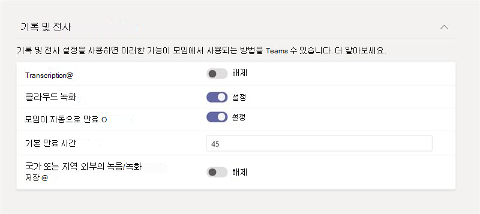

# <a name="meeting-policies-and-meeting-expiration-in-microsoft-teams"></a>Microsoft Teams의 모임 정책 및 모임 만료

Microsoft Teams의 [모임 정책은](meeting-policies-overview.md) 조직의 사용자가 모임을 시작하고 예약할 수 있는지 여부와 사용자가 예약한 모임 참가자가 사용할 수 있는 기능을 제어하는 데 사용됩니다. 전역(조직 전체 기본값) 정책을 사용하거나 사용자 지정 정책을 만들어 사용자에게 할당할 수 있습니다. Microsoft Teams 관리 센터에서 또는 [Get](/powershell/module/skype/get-csteamsmeetingpolicy), [New](/powershell/module/skype/new-csteamsmeetingpolicy), [Set](/powershell/module/skype/set-csteamsmeetingpolicy), [Remove](/powershell/module/skype/remove-csteamsmeetingpolicy), [Grant](/powershell/module/skype/grant-csteamsmeetingpolicy) -CsTeamsMeetingPolicy PowerShell cmdlet을 사용하여 모임 정책을 관리합니다.

사용자가 모임을 시작 및 예약할 수 있는지 여부를 제어하고 사용자가 예약한 모임의 만료를 제어하는 모임 정책 설정입니다. 모임 참가 링크 및 모임의 전화 회의 ID가 만료되면 아무도 모임에 참가할 수 없습니다. 다음 모임 정책 설정은 사용자가 Teams에서 모임을 시작하고 예약할 수 있는지 여부를 결정합니다. 이 문서의 모임 설정에 대해 설명합니다.

- [채널에서 지금 모임: 사용자가 채널에서](meeting-policies-in-teams-general.md#meet-now-in-channels) 즉석 모임을 시작할 수 있는지 여부를 제어합니다.
- [채널 모임 일정](meeting-policies-in-teams-general.md#channel-meeting-scheduling): 사용자가 채널에서 모임을 예약할 수 있는지 여부를 제어합니다.
- [비공개 모임 예약](meeting-policies-in-teams-general.md#private-meeting-scheduling): 사용자가 Teams에서 비공개 모임을 예약할 수 있는지 여부를 제어합니다. 모임이 팀의 채널에 게시되지 않은 경우 비공개 모임에 해당합니다.
- [Outlook 추가](meeting-policies-in-teams-general.md#outlook-add-in) 기능: 사용자가 Outlook에서 비공개 모임을 예약할 수 있는지 여부를 제어합니다. 모임이 팀의 채널에 게시되지 않은 경우 비공개 모임에 해당합니다.
- [비공개 모임에서 지금 모임](meeting-policies-in-teams-general.md#meet-now-in-private-meetings): 사용자가 즉석 비공개 모임을 시작할 수 있는지 여부를 제어합니다.

기본적으로 이러한 설정은 켜집니다. 이러한 설정이 꺼져 있으면 정책이 할당된 모든 사용자는 해당 유형의 새 모임을 시작하거나 예약할 수 없습니다. 동시에 사용자가 이전에 시작하거나 예약한 모든 기존 모임의 모임 참가 링크 및 회의 ID가 만료됩니다.

예를 들어 사용자에게 이러한 모임 정책 설정이 **켜** 짐으로 설정된 모임 정책이 할당된 다음 **채널 설정에서 모임 허용** 을 해제하면 해당 사용자는 더 이상 채널에서 즉석 모임을 시작할 수 없으며, 이제 사용자가 이전에 만든 채널 모임 참가 링크가 만료됩니다. 사용자는 다른 모임 유형을 시작 및 예약하고 다른 사용자가 구성한 모임에 참가할 수 있습니다.

## <a name="what-happens-when-the-meeting-join-link-and-conference-id-expire"></a>모임 참가 링크 및 회의 ID가 만료되면 어떻게 됩니까?

모임 참가 링크 및 모임의 전화 회의 ID가 만료되면 아무도 모임에 참가할 수 없습니다. 사용자가 링크 또는 전화를 통해 모임에 참가하려고 하면 모임을 더 이상 사용할 수 없다는 메시지가 표시됩니다. 대화, 파일, 화이트보드, 녹음/녹화, 대화 내용 및 모임과 관련된 기타 콘텐츠는 유지되며 사용자는 계속 액세스할 수 있습니다.

## <a name="what-happens-when-you-turn-on-and-turn-off-a-meeting-policy-setting"></a>모임 정책 설정을 켜고 끄면 어떻게 됩니까?

### <a name="switch-a-meeting-policy-setting-from-on-to-off"></a>모임 정책 설정을 켜기에서 끄기로 전환

모임 정책 설정을 **켜** 기로 설정하면 정책이 할당된 사용자는 해당 유형의 모임을 시작하거나 예약할 수 있으며 모든 사용자가 참가할 수 있습니다. 모임 정책 설정을 **끄** 기로 전환하면 정책이 할당된 사용자는 해당 유형의 새 모임을 시작하거나 예약할 수 없으며, 사용자가 이전에 예약한 기존 모임의 모임 참가 링크 및 회의 ID가 만료됩니다.

사용자가 다른 사용자가 구성한 모임에 참가할 수 있습니다.

### <a name="switch-a-meeting-policy-setting-from-off-to-on"></a>모임 정책 설정을 끄기에서 켜기로 전환

모임 정책 설정을 **끄** 기에서 **켜** 기로 전환하면 정책이 할당된 사용자는 해당 유형의 모임을 시작하거나 예약할 수 있습니다. 사용자에 대해 모임 정책 설정을 해제한 다음 다시 켜면 사용자가 구성한 이전에 예약된(만료된) 모임이 모두 활성화되고 모임 참가 링크 또는 전화를 사용하여 사용자가 모임에 참가할 수 있습니다.  

## <a name="meeting-expiration-scenarios"></a>모임 만료 시나리오

다음은 이 문서에서 설명하는 각 모임 정책 설정에 대해 모임 만료가 작동하는 방식에 대한 요약입니다.

|원하는 경우...&nbsp;&nbsp; |이 작업을 수행합니다.&nbsp;&nbsp;&nbsp;&nbsp;  |모임 참가 동작&nbsp;&nbsp;&nbsp;&nbsp;  |
|---------------------------|---------------------|---------|
|사용자가 시작한 비공개 모임 만료&nbsp;&nbsp;|**비공개 모임에서 지금 모임을 끕니다**.&nbsp;&nbsp;|이제 사용자가 시작한 비공개 **모임** 에 참가할 수 없습니다.|
|사용자가 예약한 비공개 모임 만료&nbsp;&nbsp;|**비공개 모임 예약을** 끄고 **Outlook 추가 기능을** _끕니다_. &nbsp;&nbsp;|사용자가 예약한 비공개 모임에는 아무도 참가할 수 없습니다. 이렇게 하면 사용자가 다음 모임에 참가할 수 없습니다.<ul><li>과거에 발생한 비공개 모임입니다.</li><li>향후 예정되고 아직 발생하지 않은 비공개 모임입니다.</li><li>되풀이 비공개 모임의 향후 인스턴스입니다.</li></ul><br>사용자가 예약 **한 비공개 모임을** 만료하려면 비공개 모임 일정과 **Outlook 추가** 기능을 모두 해제해야 합니다. 한 설정이 꺼져 있고 다른 설정이 켜진 경우 기존 모임의 모임 참가 링크 및 회의 ID는 활성 상태로 유지되며 만료되지 않습니다.|
|만료 채널 **모임 지금** 사용자가 시작한 모임&nbsp;&nbsp;|**채널에서 지금 모임을** 끄고 **채널 모임 일정을** _끕니다_.&nbsp;&nbsp;|사용자가 시작한 모임을 **이제 채널 모임** 에 참가할 수 없습니다.|
|사용자가 예약한 채널 모임 만료&nbsp;&nbsp;|**채널 모임 예약을 끕니다**.&nbsp;&nbsp;|사용자가 예약한 채널 모임에 참가할 수 있는 사람은 아무도 없습니다. 이렇게 하면 사용자가 다음 모임에 참가할 수 없습니다.<ul><li>과거에 발생한 채널 모임입니다.</li><li>향후에 예정되고 아직 발생하지 않은 채널 모임입니다.</li><li>되풀이 채널 모임의 향후 인스턴스입니다.</li></ul>|

사용자가 이전에 예약되었거나 특정 사용자가 시작한 모임에 액세스하도록 하려면 다음을 수행할 수 있습니다.

- 해당 사용자에 대한 모임 정책 설정을 켭니다.
- 해당 사용자에 대한 모임 정책 설정을 해제하고 정책 설정을 사용하도록 설정한 다른 사용자가 만료된 모임을 대체할 새 모임을 만들도록 합니다.

> [!NOTE]
> 관리자와 같은 다른 사람을 대신하여 모임 초대를 보낼 수 있는 권한이 부여된 대리인이 모임을 보낸 경우 모임 정책 설정은 사용 권한(관리자)에게 적용됩니다.

## <a name="changes-to-meeting-expiration"></a>모임 만료에 대한 변경 내용

새로 만든 모든 Teams 모임 녹음/녹화(TMR)의 기본 만료 시간은 120일입니다. 이는 모든 테넌트에 대해 기본적으로 설정됩니다. 즉, 기본적으로 *이 기능이 켜진 후* 생성된 모든 TMR은 생성 날짜 120일 후에 삭제됩니다. 관리자는 모임을 **자동 만료되지** 않도록 설정할 수도 있습니다. OneDrive 및 SharePoint 시스템은 모든 TMR에 설정된 만료 날짜를 모니터링하고 만료 날짜에 TMR을 휴지통으로 자동으로 이동합니다.

> [!NOTE]
> 모임 대화 내용의 복사본 1개는 OneDrive SharePoint에 저장되고 두 번째 복사본은 Exchange에 임시 저장소에 저장됩니다. TMR이 자동으로 만료되면 OSDP 복사본이 만료됩니다.

자동 모임 만료는 이전 TMR에서 만든 스토리지 혼란을 줄이기 위한 간단한 하우스키핑 메커니즘입니다. 평균적으로 모든 고객에서 TMR의 96%는 60일 후에 시청되지 않으며 99%는 110일 후에 시청되지 않습니다. 거의 모든 고객이 60일 후에 다시 시청하지 않을 가능성이 있는 기록을 제거하여 테넌트의 스토리지 부하를 줄일 수 있다고 믿습니다. 기본적으로 모든 고객에게 가능한 한 깨끗한 환경을 제공하는 것이 우리의 목표입니다.

모임 만료를 사용하여 Teams 모임 레코드에서 구동하는 클라우드 스토리지 사용량에 대한 OneDrive 또는 SharePoint를 제한합니다. 일반적인 모임 녹음/녹화는 시간당 약 400MB의 녹음/녹화를 사용합니다.

> [!NOTE]
> A1 사용자의 최대 기본 만료 날짜는 30일입니다.

### <a name="expiration-date"></a>만료 날짜

- 만료 날짜는 **만든 날** 과 **관리자가 Teams 정책에 설정한 기본 일수** 로 계산됩니다.
- 재생은 만료 날짜에 영향을 주지 않습니다.

### <a name="change-the-default-expiration-date"></a>기본 만료 날짜 변경

관리자는 PowerShell 또는 Teams 관리 센터에서 기본 만료 설정을 편집할 수 있습니다. 모든 변경 내용은 해당 시점부터 *새로 만든* TMR에만 적용됩니다. 해당 날짜 이전에 만든 녹음/녹화에는 영향을 주지 않습니다. 관리자는 기존 TMR의 만료 날짜를 변경할 수 없습니다. 이는 TMR을 소유한 사용자의 결정을 보호하기 위해 수행됩니다. 모임과 통화는 이 설정으로 제어할 수 있습니다.

만료 날짜 값은 다음과 같이 설정할 수 있습니다.

- 최소값: **1일**
- 최대값: **99999일**
- PowerShell에서 만료 날짜를 **-1** 로 설정하여 기록이 만료되지 않도록 할 수도 있습니다.

예제 PowerShell 명령:

```powershell
Set-CsTeamsMeetingPolicy -Identity Global -NewMeetingRecordingExpirationDays 50
```

Teams 관리 센터에서 **모임 정책에** 따라 만료 날짜를 설정할 수 있습니다. **모임이 자동으로 만료** 되면 녹음/녹화 만료를 설정하는 옵션이 제공됩니다.



### <a name="compliance"></a>규정 준수

최종 사용자가 제어하는 모든 녹음/녹화의 만료 날짜를 수정할 수 있으므로 법적 보호를 위해 TMR 만료 설정을 사용하면 안 됩니다.

#### <a name="teams-meeting-recording-expiration-settings-and-microsoft-365-retention-policies-in-microsoft-purview"></a>Microsoft Purview의 Teams 모임 녹음/녹화 만료 설정 및 Microsoft 365 보존 정책

파일 보존은 파일 삭제보다 우선합니다. Purview 보존 정책을 사용하는 모임 녹음/녹화는 보존 기간이 완료될 때까지 TMR 만료 정책에 의해 삭제할 수 없습니다. 예를 들어 파일이 5년 동안 유지되고 TMR 만료 정책이 60일 동안 설정된다는 Purview 임대 정책이 있는 경우 TMR 만료 정책은 5년 후에 기록을 삭제합니다.  

TMR 만료 정책과 삭제 날짜가 다른 Purview 삭제 정책이 있는 경우 파일은 두 날짜 중 가장 빠른 시간에 삭제됩니다. 예를 들어 1년 후에 파일이 삭제되고 TMR 만료가 120일 동안 설정된다는 Purview 삭제 정책이 있는 경우 TMR 만료 설정은 120일 후에 파일을 삭제합니다.

### <a name="enforcement-of-file-retention-with-the-teams-meeting-recording-expiration-setting"></a>Teams 모임 녹음/녹화 만료 설정을 사용하여 파일 보존 적용

이 기능 또는 해당 설정으로 인해 파일이 보존되지 않습니다. 삭제 권한이 있는 사용자가 만료 설정이 있는 TMR을 삭제하려고 하면 해당 사용자의 삭제 작업이 실행됩니다.

### <a name="what-skus-are-required-for-this-feature"></a>이 기능에 필요한 SKU는 무엇인가요?

- 모든 SKU에는 기본적으로 이 기능이 있습니다.
- A1 사용자는 최대 30일의 만료 기간으로 기본 설정되지만 필요에 따라 만료 날짜를 변경할 수 있습니다.

### <a name="what-if-i-want-the-admin-to-have-full-control-over-the-lifecycle-of-meeting-recordings-and-dont-want-to-give-end-users-the-ability-to-override-the-expiration-date"></a>관리자가 모임 녹음/녹화의 수명 주기를 완전히 제어하고 최종 사용자에게 만료 날짜를 재정의할 수 있는 기능을 제공하지 않으려면 어떻게 해야 하나요?

보안 및 규정 준수 보존 및/또는 삭제 정책을 사용하는 것이 좋습니다. 이 제품은 복잡한 정책 및 SLA 중심의 행정적 법적 문제를 해결하기 위한 것입니다.

자동 만료 기능은 이전 Teams 모임 녹음/녹화에서 생성된 스토리지 혼란을 줄이기 위한 간단한 하우스키핑 메커니즘으로만 사용됩니다.

### <a name="will-future-tmrs-migrated-from-classic-stream-after-this-feature-is-released-have-auto-expiration-applied-to-them-too"></a>이 기능이 출시된 후 기본 스트림에서 마이그레이션된 향후 TMR에도 자동 만료가 적용되나요?

아니오, 마이그레이션된 TMR에는 그에 대해 설정된 만기 날짜가 함께 제공되지 않습니다. 대신 관리자가 보유하려는 TMR만 마이그레이션하도록 권장합니다. 자세한 내용은 마이그레이션 문서에서 제공됩니다.

### <a name="how-is-this-feature-different-from-the-expiration-message-i-see-when-a-tmr-upload-to-onedrive-and-sharepoint-fails"></a>이 기능은 OneDrive 및 SharePoint에 대한 TMR 업로드가 실패할 때 표시되는 만료 메시지와 어떻게 다른가요?

녹음/녹화가 OneDrive 또는 SharePoint에 업로드되지 않으면 Teams 애플리케이션은 사용자가 Teams 서버에서 영구적으로 삭제되기 전에 TMR을 다운로드하는 데 최대 21일이 걸리는 메시지를 채팅에 표시합니다. TMR 업로드 실패로 인한 이 기존 만료 환경은 도움말 문서에서 설명하는 OneDrive 및 SharePoint 자동 만료 기능과 관련이 없습니다.

### <a name="how-do-i-know-the-distribution-of-tmr-playbacks-so-i-know-what-the-optimal-auto-expiration-default-should-be-for-my-tenant"></a>어떻게 할까요? TMR 재생의 배포를 알고 있으므로 테넌트에 대해 최적의 자동 만료 기본값이 무엇인지 알 수 있나요?

1. 라이브러리에서 비디오를 찾습니다.
1. ...를 선택합니다 **.** >  **세부 정보**
1. 세부 정보 창 맨 위에 있는 보기 수를 선택합니다.

다음과 같은 파일 통계가 표시됩니다.

- 고유 뷰어 수
- 총 보기 수
- 지난 90일 동안 매일 시청자와 뷰의 추세
- 시청률 보존(동영상의 어느 부분을 보았는지 여부)

### <a name="when-will-the-file-be-deleted"></a>파일은 언제 삭제되나요?

녹음/녹화는 일반적으로 만료 날짜 이후 1일 이내에 삭제되지만 드문 경우는 5일 정도 걸릴 수 있습니다. 녹음/녹화가 만료되면 파일 소유자는 전자 메일 알림을 받고 녹음/녹화를 복구하기 위해 휴지통으로 전달됩니다.

> [!NOTE]
> 만료 날짜에 기록이 휴지통으로 이동되고 만료 날짜 필드가 지워집니다. 휴지통에서 기록을 복구하는 경우 만료 날짜가 지워졌기 때문에 이 기능에서 다시 삭제되지 않습니다.

## <a name="related-topics"></a>관련 주제

[모임 만료 날짜 변경 - 최종 사용자 컨트롤](https://support.microsoft.com/office/record-a-meeting-in-teams-34dfbe7f-b07d-4a27-b4c6-de62f1348c24#bkmk_view_change_expiration_date)

[Teams에서의 모임 정책 관리](meeting-policies-overview.md)

[Teams에서 사용자에게 정책 할당](policy-assignment-overview.md)

[Teams PowerShell 개요](teams-powershell-overview.md)

[Microsoft Teams의 제한 사항 및 사양](/microsoftteams/limits-specifications-teams)
