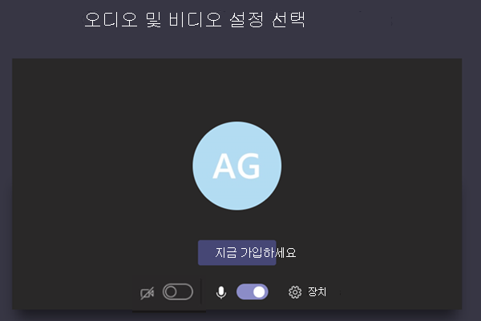
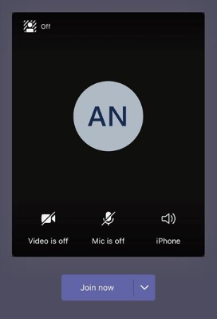

# 오디오 비디오에 대한 모임 정책 & 설정

이 문서에서는 오디오 및 비디오와 관련한 모임 정책 설정을 설명합니다. 여기에는 다음이 포함됩니다.

- [기록 허용](#allow-transcription)
- [클라우드 녹음/녹화 허용](#allow-cloud-recording)
- [IP 오디오 모드](#mode-for-ip-audio)
- [IP 비디오 모드](#mode-for-ip-video)
- [IP 비디오 허용](#allow-ip-video)
- [미디어 비트 전송률(Kb)](#media-bit-rate-kbs)
- [비디오 필터 모드](#video-filters-mode)
- [사용자 지정 배경 설정 허용](#allow-custom-background-settings)

### 기록 허용

이끌이 및 사용자당 정책의 조합입니다. 이 설정은 모임 녹음/녹화 재생 중에 캡션 및 전사 기능을 사용할 수 있는지 여부를 제어합니다. 이 옵션을 해제하면 모임 녹음/녹화를 재생하는 동안 **검색** 및 **CC** 옵션을 사용할 수 없습니다. 녹음/녹화를 시작한 사용자는 녹음/녹화에 전사도 포함되도록 이 설정을 설정해야 합니다.

기록된 모임에 대한 전사는 현재 영어로 설정되어 있는 사용자와 모임에서 영어를 Teams 사용자만 지원됩니다.

### 클라우드 녹음/녹화 허용

이끌이 및 사용자당 정책의 조합입니다. 이 설정은 이 사용자의 모임을 기록할 수 있는지 여부를 제어합니다. 참가자에 대한 정책 설정이 켜져 있으며 동일한 조직의 인증된 사용자인 경우 모임 이끌이 또는 다른 모임 참가자가 녹음을 시작할 수 있습니다.

페더레이션 사용자 및 익명 사용자와 같은 조직 외부의 사용자는 녹음/녹화를 시작할 수 없습니다. 게스트 사용자는 녹음/녹화를 시작하거나 중지할 수 없습니다.

다음 예를 살펴봅시다.

|사용자 |모임 정책  |클라우드 녹음/녹화 허용 |
|---------|---------|---------|
|Daniela | 전역   | 해제 |
|Amanda | Location1MeetingPolicy | 설정|
|John(외부 사용자) | 해당 사항 없음 | 해당 사항 없음|

Daniela가 조직한 모임은 녹화할 수 없습니다. 정책 설정을 사용하도록 설정된 Amanda는 Daniela에서 조직한 모임을 기록할 수 없습니다. Amanda에서 조직된 모임을 기록할 수 있습니다. 그러나 정책 설정을 사용하지 않도록 설정한 다니엘라와 외부 사용자인 John은 Amanda에서 조직한 모임을 녹화할 수 없습니다.

클라우드 모임 녹음/녹화에 대해 자세히 알아보려면 [Teams 클라우드 모임 녹음/녹화](cloud-recording.md)를 참조하세요.

### IP 오디오 모드

사용자별 정책에 해당합니다. 이 설정은 모임 및 그룹 통화에서 오디오를 설정할 수 있는지 여부를 제어합니다. 이 설정의 값은 다음과 같습니다.

|설정값 |동작  |
|---------|---------|
|**발신 및 수신 오디오 사용**    |발신 및 수신 오디오가 모임에서 허용됩니다. 이 설정은 기본 설정입니다. |
|**사용 안 함**     |모임에서 발신 및 수신 오디오가 해제되었습니다.     |

사용자에 대해 **사용** 안 하도록 설정한 경우 해당 사용자는 여전히 모임을 예약하고 구성할 수 있지만 오디오를 사용할 수 없습니다. 모임에 참가하기 위해 PSTN(공용 전환 전화 네트워크)을 통해 전화 접속하거나 모임에 전화를 걸고 전화로 참가해야 합니다. 정책이 할당되지 않은 모임 참가자(예: 익명 참가자)는 기본적으로 **발신 및 수신 오디오 사용** 으로 설정되어 있습니다. Teams 모바일 클라이언트에서 이 설정을 사용하지 않도록 설정한 경우 사용자는 PSTN을 통해 모임에 전화를 걸어야 합니다.

이 설정은 일대일 통화에는 적용되지 않습니다. 일대일 통화를 제한하려면 Teams [통화 정책](teams-calling-policy.md)을 구성하고 **개인 전화 걸기** 설정을 해제합니다. 이 설정은 Surface Hub 및 Microsoft Teams 룸 장치와 같은 회의실 장치에도 적용되지 않습니다.

Microsoft 365 정부 커뮤니티 클라우드(GCC), GCC High 또는 국방부(DoD) 환경에서는 아직 이 설정을 사용할 수 없습니다.

자세한 내용은 [모임 참가자용 오디오/비디오 관리](#manage-audiovideo-for-meeting-participants)를 참조하세요.

### IP 비디오 모드

사용자별 정책에 해당합니다. 이 설정은 모임 및 그룹 통화에서 비디오를 설정할 수 있는지 여부를 제어합니다. 이 설정의 값은 다음과 같습니다.

|설정값 |동작  |
|---------|---------|
|**발신 및 수신 비디오 사용**    | 모임에서 내보내기 및 들어오는 비디오가 허용됩니다. 기본 설정입니다. |
|**사용 안 함**     | 모임에서 발신 및 수신 비디오가 해제되었습니다. Teams 모바일 클라이언트 사용자는 모임에서 비디오나 사진을 공유할 수 없습니다.   IP 오디오 **모드가** 비활성화된 경우 **IP** 비디오 모드도 비활성화 상태로 유지됩니다.  |

사용자에 대해 **사용 안 함** 설정되어 있으면 해당 사용자는 비디오를 켜거나 다른 모임 참가자가 공유한 비디오를 볼 수 없습니다. 정책이 할당되지 않은 모임 참가자(예: 익명 참가자)는 기본적으로 **발신 및 수신 비디오 사용** 으로 설정되어 있습니다.

이 설정은 Surface Hub 및 Microsoft Teams 룸 장치와 같은 회의실 장치에는 적용되지 않습니다.

Microsoft 365 정부 커뮤니티 클라우드(GCC), GCC High 또는 국방부(DoD) 환경에서는 아직 이 설정을 사용할 수 없습니다.

> [!NOTE]
> 이 설정은 발신 및 수신 비디오를 모두 제어하는 반면, **IP 비디오 허용** 설정은 발신 비디오만을 제어합니다. 자세한 내용은 다음 [IP 비디오 정책 설정 우선 순위](#which-ip-video-policy-setting-takes-precedence) 및 [모임 참가자용 오디오/비디오 관리](#manage-audiovideo-for-meeting-participants)를 참조하세요.

자세한 내용은 [모임 참가자용 오디오/비디오 관리](#manage-audiovideo-for-meeting-participants)를 참조하세요.

### IP 비디오 허용

이끌이 및 사용자당 정책의 조합입니다. 비디오는 중요한 모임 구성 요소입니다. 일부 조직에서는 관리자가 비디오 사용 사용자 모임에 대해 더 많은 제어권을 필요로 할 수 있습니다. 이 설정은 사용자가 호스트하는 일대일 모임과 사용자가 시작한 그룹 통화에서 비디오를 설정할 수 있는지 여부를 제어합니다. 모바일 Teams 경우 이 설정은 사용자가 모임에서 사진 및 비디오를 공유할 수 있는지 여부를 제어합니다.

이 정책 설정을 사용하도록 설정한 사용자가 이끄는 모임은 모임에서 모임 참가자에 의한 비디오 공유를 허용합니다. 단 모임 참가자 또한 정책 설정을 사용 설정해야 합니다. 정책이 할당되지 않은 모임 참가자(예: 익명 및 페더레이션 참가자)는 모임 이끌이의 정책을 이어 받습니다.

> [!NOTE]
> 이 설정은 발신 비디오를 제어하는 반면, **IP 비디오 허용** 설정은 발신 및 수신 비디오를 모두 제어합니다. 자세한 내용은 다음 [IP 비디오 정책 설정 우선 순위](#which-ip-video-policy-setting-takes-precedence) 및 [모임 참가자용 오디오/비디오 관리](#manage-audiovideo-for-meeting-participants)를 참조하세요.

| Teams 데스크톱 및 웹 클라이언트 |Teams 모바일 클라이언트  |
|:-------:|:-------:|
|    |          |

다음 예를 살펴봅시다.

|사용자 |모임 정책  |IP 비디오 허용 |
|---------|---------|---------|
|Daniela   | 전역   | 설정       |
|Amanda    | Location1MeetingPolicy        | 해제      |

Daniela가 호스트한 모임에서 비디오를 켜도록 허용합니다. Daniela는 모임에 참가하여 비디오를 켤 수 있습니다. Amanda의 정책은 비디오를 허용하지 않는 것으로 설정되어 있기 때문에 Daniela의 모임에서 비디오를 설정할 수 없습니다. Amanda는 모임의 다른 참가자가 공유한 비디오를 볼 수 있습니다.

Amanda가 호스트한 모임에서는 누구도 할당된 비디오 정책에 관계없이 비디오를 켤 수 없습니다. 즉 Daniela는 Amanda가 이끄는 모임에서 비디오를 켤 수 없습니다.  

Daniela가 비디오를 켠 채로 Amanda에게 전화하는 경우 Amanda는 오디오만 켜진 채로 통화에 응답할 수 있습니다.  통화가 연결되면 Amanda는 Daniela의 비디오를 볼 수 있지만 비디오를 켜지 못합니다. Amanda가 Daniela에게 전화를 걸면 Daniela는 비디오 및 오디오를 사용하여 통화에 응답할 수 있습니다. 통화가 연결되면 Daniela는 필요에 따라 비디오를 켜거나 끌 수 있습니다.

자세한 내용은 [모임 참가자용 오디오/비디오 관리](#manage-audiovideo-for-meeting-participants)를 참조하세요.

#### 우선 순위가 어떤 IP 비디오 정책 설정인가요?

사용자를 기준으로 가장 제한적인 비디오 정책 설정이 우선합니다. 몇 가지 예제는 다음과 같습니다.

|IP 비디오 허용|IP 비디오 모드|모임 환경|
|---------|---------|---------|
|이끌이: **켜짐**  참가자: **켜짐** |참가자: **사용 안 함**        |**IP 비디오 모드** 설정이 우선합니다. 이 정책이 할당된 참가자는 비디오를 켜거나 다른 사용자들이 공유한 비디오를 볼 수 없습니다.|
|이끌이: **켜짐**  참가자: **켜짐** |참가자: **발신 및 수신 비디오 사용**          |이 정책이 할당된 참가자는 비디오를 켜거나 다른 사용자들이 공유한 비디오를 볼 수 있습니다.         |
|이끌이: **켜짐**  참가자: **꺼짐** |참가자: **발신 및 수신 비디오 사용**         |**IP 비디오 허용** 설정이 우선합니다. 참가자는 수신 비디오만 볼 수 있으며 발신 비디오를 전송할 수 없습니다.         |
|이끌이: **켜짐**  참가자: **꺼짐** |참가자: **사용 안 함**         |**IP 비디오 모드** 설정이 우선합니다. 참가자는 수신 또는 발신 비디오를 볼 수 없습니다.|
|이끌이: **꺼짐**    |       |이끌이에 대해 꺼져 있으므로 **IP 비디오 허용** 설정이 우선합니다. 이제 누구도 이 정책이 할당된 사용자가 이끄는 모임에서 비디오를 켤 수 없습니다.         |

### 모임 참가자용 오디오/비디오 관리

|수행하려는 작업...  |가능한 정책 설정  |
|---------|---------|
|모임 참가자의 오디오 및 비디오 비활성화  |IP 오디오 모드: **사용 안 함**  IP 비디오 모드: **사용 안 함** IP 비디오 허용: N/A       |
|모임 참가자에 대해 수신 비디오 및 오디오만 사용하도록 설정  |IP 오디오 모드: **발신 및 수신 오디오 사용**  IP 비디오 모드: **발신 및 수신 비디오 사용** IP 비디오 허용: **꺼짐**       |
|모임 참가자에 대해 비디오 비활성화(참가자는 오디오만 사용)|  IP 오디오 모드: **발신 및 수신 오디오 활성화**  IP 비디오 모드: **사용 안 함** IP 비디오 허용: N/A
|모임 참가자의 오디오 및 비디오 활성화    |IP 오디오 모드: **발신 및 수신 오디오 사용**(기본 설정)  IP 비디오 모드: **발신 및 수신 비디오 사용**(기본 설정) IP 비디오 허용: **켜짐**(기본 설정)    |

모임 이끌이의 정책과 사용자 정책 간의 가장 제한적인 정책이 적용됩니다. 예를 들어 이끌이 정책이 비디오를 제한하고 사용자 정책이 비디오를 제한하지 않는 경우 모임 참가자는 모임 이끌이의 정책을 상속하고 모임에서 비디오에 액세스할 수 없습니다. 즉, 오디오만 켜진 상태에서 모임에 참가할 수 있습니다.

> [!NOTE]
> 사용자가 전화로 연결하는 그룹 통화를 시작하면 **음성 전화 사용** 화면이 나타나지 않습니다. 이 문제는 알려진 문제이며 현재 해결하기 위해 작업 중입니다. 이 문제를 해결하려면 **다른 참가 옵션** 에서 **음성전화** 를 선택합니다.  

#### Teams 모바일 클라이언트

모바일 Teams 사용자의 경우 모임 중에 사진 및 비디오를 공유할 수 있는 능력은 IP 비디오 허용 또는 **IP** 비디오 모드 설정에 **따라 결정됩니다.** 우선하는 정책 설정에 따라 비디오 및 사진을 공유하는 기능을 사용할 수 없습니다. 이 설정은 화면 공유에는 영향을 미치지 않으며, 이는 별도로 [화면 공유 모드](meeting-policies-content-sharing.md#screen-sharing-mode) 설정을 사용하여 구성합니다. 또한 휴대폰 사용자가 휴대폰 연결을 통해 IP 비디오를 사용하지 못하도록 [Teams 이동성 정책](/powershell/module/skype/new-csteamsmobilitypolicy)을 설정할 수 있습니다. 이러면 Wi-Fi 연결을 사용해야 합니다.

### 미디어 비트 전송률(Kb)

사용자별 정책에 해당합니다. 이 설정은 사용자에 대한 통화 및 모임에서 오디오, 비디오 및 비디오 기반 앱 공유 전송에 대한 미디어 비트 전송률을 결정합니다. 이 설정은 통화 또는 모임 사용자의 업링크 및 다운링크 미디어 통과 모두에 적용됩니다. 이 설정으로 조직의 대역폭 관리를 세밀하게 제어할 수 있습니다. 사용자가 요구한 모임 시나리오에 따라 양질의 환경을 보장하기 위해 충분한 대역폭을 확보하는 것이 좋습니다. 최소값은 30Kbps이고 최대값은 모임 시나리오에 따라 다릅니다. 양질의 Teams 모임, 통화 및 라이브 이벤트를 위한 권장 최소 대역폭에 대해 자세히 알아보려면 [대역폭 요구 사항](prepare-network.md#bandwidth-requirements)을 참조하세요.

모임 대역폭이 충분하지 않으면 네트워크 품질이 열악함을 나타내는 메시지가 참가자에게 표시됩니다.

CEO 이사회 모임 및 Teams 라이브 이벤트와 같이 최고 품질의 비디오 환경이 필요한 모임의 경우 대역폭을 10Mbps로 설정하는 것이 좋습니다. 최대한의 환경을 설정한 경우에도 Teams 미디어 스택은 시나리오에 따라 특정 네트워크 상태가 감지될 때 낮은 대역폭 조건에 맞게 조정됩니다.

## 비디오 필터 모드

사용자당 정책입니다. 이 설정으로 사용자가 모임에서 비디오 배경을 사용자 지정할 수 있는지 여부를 제어합니다.

현재는 PowerShell을 사용해서만 이 정책을 설정할 수 있습니다. [Set-CsTeamsMeetingPolicy](/powershell/module/skype/set-csteamsmeetingpolicy) cmdlet을 사용하여 기존의 Teams 모임 정책을 편집할 수 있습니다. 또는 [New-CsTeamsMeetingPolicy](/powershell/module/skype/new-csteamsmeetingpolicy) cmdlet을 사용하여 새로운 Teams 모임 정책을 만든 다음 그 정책을 사용자에게 할당합니다.

사용자가 모임에서 비디오 배경을 사용자 지정할 수 있는지 여부를 지정하려면 **VideoFiltersMode** 매개 변수를 다음과 같이 설정합니다.

|PowerShell 설정값 |동작  |
|---------|---------|
|**NoFilters**     |사용자는 비디오 배경을 사용자 지정할 수 없습니다.|
|**BlurOnly**     |사용자는 비디오 배경을 흐리게 할 수 있는 옵션이 있습니다. |
|**BlurandDefaultBackgrounds**     |사용자는 비디오 배경의 초점을 흐리거나 배경으로 사용할 기본 이미지 집합에서 선택할 수 있습니다. |
|**AllFilters**     |사용에는 비디오 배경을 흐리게하거나, 기본 이미지 집합에서 선택하거나 배경으로 사용할 사용자 지정 이미지를 업로드하는 옵션이 있습니다. |

> [!NOTE]
> 사용자가 업로드한 이미지는 Teams에서 선별되지 않습니다. **AllFilters** 설정을 사용하는 경우 사용자가 불쾌감을 주거나 부적절한 이미지 또는 내 조직에 Teams 모임 배경으로 사용할 수 있는 권리가 없는 이미지를 업로드하지 못하도록 내부 조직 정책을 마련해야 합니다.

### 사용자 지정 배경 설정 허용

테넌트당 사용할 사용자 지정 배경 이미지를 추가할 수 있습니다. 이 기능을 사용하면 회사가 회사 브랜디드를 모임에 적용할 Teams 수 있습니다.

1. Teams 관리 센터에 로그인합니다.

2. 모임 **정책 사용자** 지정 모임 이미지를  >  **선택합니다.**

   

3. Org **넓은** 배경 **이미지에서 On을 선택합니다.**

4. **+ 이미지 추가를 선택합니다.**

5. 배경 관리 패널에서 이미지 추가 **를 선택합니다.**

6. 이미지가 다음 요구 사항을 충족하는지 확인합니다.
  
   - 최소 크기 360 px
   - 최대 크기 2048 px
   - PNG, JPG 또는 BMP의 파일 형식
   - 최대 50개 이미지를 업로드할 수 있습니다.

7. 선택한 이미지를 미리 보고 닫기 를 **선택합니다.**

8. 이미지를 검토하고 필요한 경우 더 추가합니다.

9. **저장** 을 선택합니다.

모임 참석자는 모임에 참석할 때 사용할 수 있는 다양한 배경 이미지를 볼 수 있습니다.

> [!NOTE]
> 변경 내용이 적용될 경우 최대 24시간이 걸릴 수 있습니다.

## 관련 항목

- [Teams PowerShell 개요](teams-powershell-overview.md)
- [Teams에서 사용자에게 정책 할당](assign-policies.md)
