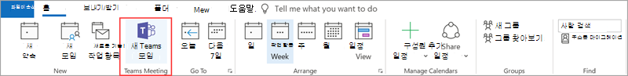

# 모임 정책 설정 - 일반Meeting policy settings - General

이 문서에서는 Teams 모임에 대한 다음 일반 정책 설정을 설명합니다.This article describes the following general policy settings for Teams meetings:

- [채널에서 지금 만나기 허용Allow Meet now in channels](#allow-meet-now-in-channels)
- [Outlook 추가 기능 허용Allow the Outlook add-in](#allow-the-outlook-add-in)
- [채널 모임일정 허용Allow channel meeting scheduling](#allow-channel-meeting-scheduling)
- [비공개 모임을 허용합니다.Allow scheduling private meetings](#allow-scheduling-private-meetings)
- [비공개 모임에서 지금 모임 허용Allow Meet now in private meetings](#allow-meet-now-in-private-meetings)
- [지정된 발표자 역할 모드Designated presenter role mode](#designated-presenter-role-mode)
- [모임 참석 보고서Meeting attendance report](#meeting-attendance-report)
- [제도 모드에 대한 모임 공급자Meeting provider for Islands mode](#meeting-provider-for-islands-mode)

## 채널에서 지금 만나기 허용Allow Meet now in channels

이는 사용자당 정책으로 모임이 시작되기 전에 적용됩니다.This is a per-user policy and applies before a meeting starts. 이 설정은 사용자가 Teams 채널에서 모임을 시작할 수 있는지 여부를 제어합니다.This setting controls whether a user can start an ad hoc meeting in a Teams channel. 이 기능을 설정하면 사용자는 모임  단추를 클릭하여 모임을 시작하거나 채널에서 모임을 예약할 수 있습니다.If you turn this on, users can click the **Meet** button to start an ad hoc meeting or schedule a meeting in the channel. 기본값은 True입니다.The default value is True.

## Outlook 추가 기능 허용Allow the Outlook add-in

이는 사용자당 정책으로 모임이 시작되기 전에 적용됩니다.This is a per-user policy and applies before a meeting starts. 이 설정은 Outlook(Windows, Mac, 웹 및 모바일) 내에서 Teams 모임을 예약할 수 있는지 여부를 제어합니다.This setting controls whether Teams meetings can be scheduled from within Outlook (Windows, Mac, web, and mobile).

이 기능을 해제하면 사용자가 Outlook에서 새 모임을 만들 때 Teams 모임을 예약할 수 없습니다.If you turn this off, users are unable to schedule Teams meetings when they create a new meeting in Outlook. 예를 들어 Windows의 Outlook에서  새 팀 모임 옵션이 리본에 표시되지 않습니다.For example, in Outlook on Windows, the **New Teams Meeting** option won't show up in the ribbon.

## 채널 모임일정 허용Allow channel meeting scheduling

기존 AllowChannelMeetingScheduling 정책을 사용하여 팀 채널 일정에서 만들 수 있는 이벤트 유형을 제어합니다.Use the existing AllowChannelMeetingScheduling policy to control the types of events that can be created on the team channel calendars. 이는 사용자당 정책으로 모임이 시작되기 전에 적용됩니다.This is a per-user policy and applies before a meeting starts. 이 설정은 사용자가 Teams 채널에서 모임을 예약할 수 있는지 여부를 제어합니다.This setting controls whether users can schedule a meeting in a Teams channel. 기본적으로 이 설정은 켜져 있습니다.By default, this setting is turned on. 

이 정책이 해제된 경우 사용자는 새 채널 모임을 만들 수 없습니다.If this policy is turned off, users will not be able to create new channel meetings. 그러나 기존 채널 모임은 이벤트 이끌이가 편집할 수 있습니다.However, existing channel meetings can be edited by the organizer of the event.

모임 예약이 비활성화됩니다.Schedule a meeting will be disabled.

채널 선택을 사용할 수 없습니다.Channel selection is disabled.

[모임을 예약할 채널을 선택하는 일정 옵션을 보여주는 ](media/meeting-policies-select-a-channel-to-meet-in.png#lightbox)

채널 게시물 페이지에서는 다음을 사용하지 않도록 설정됩니다.In the channel posts page, the following will be disabled:

- **채널 회신** 작성 상자에서 모임 단추를 예약합니다.**Schedule a meeting** button on the channel reply compose box.
  
  
- **채널 헤더에서** 모임 단추를 예약합니다.**Schedule a meeting** button on the channel header.
  

채널 달력에서:In the channel calendar:

- **채널 일정 헤더에** 새 이벤트 단추를 추가하면 비활성화됩니다.**Add new event** button on channel calendar header will be disabled.
  

- 사용자는 채널 일정에서 시간 블록을 끌어 채널 모임을 만들 수 없습니다.Users will not be able to drag and select a time block on the channel calendar to create a channel meeting.

- 사용자는 바로 가기 키를 사용하여 채널 일정에서 모임을 만들 수 없습니다.Users cannot use Keyboard shortcuts to create a meeting on the channel calendar.

관리 센터에서:In the admin center:

채널 일정 앱은 앱 권한 정책 페이지의 **Microsoft 앱** 섹션에 표시됩니다.The channel calendar app will show up in the **Microsoft apps** section on the app permission policies page.

## 비공개 모임을 허용합니다.Allow scheduling private meetings

이는 사용자당 정책으로 모임이 시작되기 전에 적용됩니다.This is a per-user policy and applies before a meeting starts. 이 설정은 사용자가 Teams에서 비공개 모임을 예약할 수 있는지 여부를 제어합니다.This setting controls whether users can schedule private meetings in Teams. 모임은 팀의 채널에 게시되지 않은 경우 비공개입니다.A meeting is private when it's not published to a channel in a team.

비공개 모임 예약  허용을 해제하고 채널 모임 예약 허용을 해제하면 Teams의 사용자에 대해  필수 참석자 추가 및 채널 추가 옵션을 사용하지 않도록 설정됩니다. Note that if you turn off **Allow scheduling private meetings** and **Allow channel meeting scheduling**,  the **Add required attendees** and **Add channel** options are disabled for users in Teams. 기본적으로 이 설정은 켜져 있습니다.By default, this setting is turned on.

## 비공개 모임에서 지금 모임 허용Allow Meet now in private meetings

이는 사용자당 정책으로 모임이 시작되기 전에 적용됩니다.This is a per-user policy and applies before a meeting starts. 이 설정은 사용자가 비공개 모임을 시작할 수 있는지 여부를 제어합니다.This setting controls whether a user can start an ad hoc private meeting.  기본적으로 이 설정은 켜져 있습니다.By default, this setting is turned on.

## 지정된 발표자 역할 모드Designated presenter role mode

사용자당 정책입니다.This is a per-user policy. 이 설정을 사용하면 Teams 클라이언트의 모임 옵션에서  발표할 수 있는 **사람의** 기본값을 변경할 수 있습니다.This setting lets you change the default value of the **Who can present?** setting in **Meeting options** in the Teams client. 이 정책 설정은 모임 지금 모임을 포함하여 모든 모임에 영향을 미치게 됩니다.This policy setting affects all meetings, including Meet Now meetings.

발표할 **수 있는 사람?** 설정을 사용하면 모임 이끌이가 모임에서 발표자가 될 수 있는 인원을 선택할 수 있습니다.The **Who can present?** setting lets meeting organizers choose who can be presenters in a meeting. 자세한 내용은 Teams 모임의 [Teams](https://support.microsoft.com/article/change-participant-settings-for-a-teams-meeting-53261366-dbd5-45f9-aae9-a70e6354f88e) 모임 및 역할에 대한 참가자 설정 [변경을 참조하세요.](https://support.microsoft.com/article/roles-in-a-teams-meeting-c16fa7d0-1666-4dde-8686-0a0bfe16e019)To learn more, see [Change participant settings for a Teams meeting](https://support.microsoft.com/article/change-participant-settings-for-a-teams-meeting-53261366-dbd5-45f9-aae9-a70e6354f88e) and [Roles in a Teams meeting](https://support.microsoft.com/article/roles-in-a-teams-meeting-c16fa7d0-1666-4dde-8686-0a0bfe16e019).

현재 PowerShell을 사용하여 이 정책 설정을 구성할 수 있습니다.Currently, you can only use PowerShell to configure this policy setting. [Set-CsTeamsMeetingPolicy](https://docs.microsoft.com/powershell/module/skype/set-csteamsmeetingpolicy) cmdlet을 사용하여 기존 Teams 모임 정책을 편집할 수 있습니다.You can edit an existing Teams meeting policy by using the [Set-CsTeamsMeetingPolicy](https://docs.microsoft.com/powershell/module/skype/set-csteamsmeetingpolicy) cmdlet. 또는 [New-CsTeamsMeetingPolicy](https://docs.microsoft.com/powershell/module/skype/new-csteamsmeetingpolicy) cmdlet을 사용하여 새 Teams 모임 정책을 만들고 사용자에게 할당합니다.Or, create a new Teams meeting policy by using the [New-CsTeamsMeetingPolicy](https://docs.microsoft.com/powershell/module/skype/new-csteamsmeetingpolicy) cmdlet and assign it to users.

Teams에서 표시할 수 있는 **사람의** 기본값을 지정하기 위해 Teams에서 **DesignatedPresenterRoleMode** 매개 변수를 다음 중 하나로 설정합니다.To specify the default value of the **Who can present?** setting in Teams, set the **DesignatedPresenterRoleMode** parameter to one of the following:

- **EveryoneUserOverride:** 모든 모임 참가자가 발표자일 수 있습니다.**EveryoneUserOverride**:  All meeting participants can be presenters. 기본값입니다.This is the default value. 이 매개 변수는 **Teams의 모든 사용자** 설정에 해당합니다.This parameter corresponds to the **Everyone** setting in Teams.
- **EveryoneInCompanyUserOverride:** 게스트 사용자를 포함하여 조직의 인증된 사용자가 발표자일 수 있습니다.**EveryoneInCompanyUserOverride**: Authenticated users in the organization, including guest users, can be presenters. 이 매개 변수는 Teams의 내 조직 **설정의 사용자에** 해당합니다.This parameter corresponds to the **People in my organization** setting in Teams.
- **OrganizerOnlyUserOverride:** 모임 이끌이만 발표자가 될 수 있으며 모든 모임 참가자는 참석자로 지정됩니다.**OrganizerOnlyUserOverride**: Only the meeting organizer can be a presenter and all meeting participants are designated as attendees. 이 매개 변수는 **Teams의 나만** 설정에 해당합니다.This parameter corresponds to the **Only me** setting in Teams.

기본값을 설정한 후에도 모임 이끌이는 Teams에서 이 설정을 변경하고 예약한 모임에 참석할 수 있는 사용자도 선택할 수 있습니다.Keep in mind that after you set the default value, meeting organizers can still change this setting in Teams and choose who can present in the meetings that they schedule.

## 모임 참석 보고서Meeting attendance report

사용자당 정책입니다.This is a per-user policy. 이 설정은 모임 이끌이가 모임 참석 보고서를 다운로드할 수 있는지 [여부를 제어합니다.](teams-analytics-and-reports/meeting-attendance-report.md)This setting controls whether meeting organizers can download the [meeting attendance report](teams-analytics-and-reports/meeting-attendance-report.md).

현재 PowerShell을 사용하여 이 정책 설정을 구성할 수 있습니다.Currently, you can only use PowerShell to configure this policy setting. [Set-CsTeamsMeetingPolicy](https://docs.microsoft.com/powershell/module/skype/set-csteamsmeetingpolicy) cmdlet을 사용하여 기존 Teams 모임 정책을 편집할 수 있습니다.You can edit an existing Teams meeting policy by using the [Set-CsTeamsMeetingPolicy](https://docs.microsoft.com/powershell/module/skype/set-csteamsmeetingpolicy) cmdlet. 또는 [New-CsTeamsMeetingPolicy](https://docs.microsoft.com/powershell/module/skype/new-csteamsmeetingpolicy) cmdlet을 사용하여 새 Teams 모임 정책을 만들고 사용자에게 할당합니다.Or, create a new Teams meeting policy by using the [New-CsTeamsMeetingPolicy](https://docs.microsoft.com/powershell/module/skype/new-csteamsmeetingpolicy) cmdlet and assign it to users.

모임 이끌이가 모임 참석 보고서를 다운로드하도록 설정하려면 **AllowEngagementReport** 매개 변수를 사용 으로 **설정합니다.**To enable a meeting organizer to download the meeting attendance report, set the **AllowEngagementReport** parameter  to **Enabled**. 이 옵션을 사용하도록 설정하면 보고서를 다운로드하는  옵션이 참가자 창에 표시됩니다.When enabled, the option to download the report is displayed in the **Participants** pane.

모임 이끌이가 보고서를 다운로드하지 못하게하려면 매개 변수를 사용 안 으로 **설정합니다.**To prevent a meeting organizer from downloading the report, set the parameter to **Disabled**. 기본적으로 이 설정은 비활성화되어 있으며 보고서를 다운로드하는 옵션을 사용할 수 없습니다.By default, this setting is disabled and the option to download the report isn't available.

## 제도 모드에 대한 모임 공급자Meeting provider for Islands mode

사용자당 정책입니다.This is a per-user policy. 이 설정은 아일랜드 모드인 사용자에게 사용되는 Outlook 모임 추가 기능을 *제어합니다.*This setting controls which Outlook meeting add-in is used for *users who are in Islands mode*. 사용자가 Teams 모임 추가 기능만 사용할 수 있는지 또는 Teams 모임 및 비즈니스용 Skype 모임 추가 기능을 모두 사용하여 Outlook에서 회의를 예약할 수 있는지 여부를 지정할 수 있습니다.You can specify whether users can only use the Teams Meeting add-in or both the Teams Meeting and Skype for Business Meeting add-ins to schedule meetings in Outlook.

이 정책은 아일랜드 모드이면서 Teams 모임 정책에서 **AllowOutlookAddIn** 매개 변수가 **True** 로 설정된 사용자에게만 적용할 수 있습니다.You can only apply this policy to users who are in Islands mode and have the **AllowOutlookAddIn** parameter set to **True** in their Teams meeting policy.

현재 PowerShell을 사용하여 이 정책을 설정할 수 있습니다.Currently, you can only use PowerShell to set this policy. [Set-CsTeamsMeetingPolicy](https://docs.microsoft.com/powershell/module/skype/set-csteamsmeetingpolicy) cmdlet을 사용하여 기존 Teams 모임 정책을 편집할 수 있습니다.You can edit an existing Teams meeting policy by using the [Set-CsTeamsMeetingPolicy](https://docs.microsoft.com/powershell/module/skype/set-csteamsmeetingpolicy) cmdlet. 또는 [New-CsTeamsMeetingPolicy](https://docs.microsoft.com/powershell/module/skype/new-csteamsmeetingpolicy) cmdlet을 사용하여 새 Teams 모임 정책을 만들고 사용자에게 할당합니다.Or, create a new Teams meeting policy by using the [New-CsTeamsMeetingPolicy](https://docs.microsoft.com/powershell/module/skype/new-csteamsmeetingpolicy) cmdlet and assign it to users.

사용자가 사용할 수 있는 모임 추가 기능을 지정하기 위해 다음과 같이 **PreferredMeetingProviderForIslandsMode** 매개 변수를 설정합니다.To specify which meeting add-in you want to be available to users, set the **PreferredMeetingProviderForIslandsMode** parameter as follows:

- **TeamsAndSfB로** 매개 변수를 설정하여 Outlook에서 Teams 모임 추가 기능 및 비즈니스용 Skype 추가 기능을 모두 사용하도록 설정합니다.Set the parameter to **TeamsAndSfB** to enable both the Teams Meeting add-in and Skype for Business add-in in Outlook. 기본값입니다.This is the default value.
- Outlook에서 **Teams** 모임 추가 기능만 사용하도록 설정하려면 매개 변수를 Teams로 설정합니다.Set the parameter to **Teams** to enable only the Teams Meeting add-in in Outlook. 이 정책 설정은 향후 모든 모임에 Teams 모임 조인 링크가 있도록 합니다.This policy setting ensures that all future meetings have a Teams meeting join link. 기존 비즈니스용 Skype 모임 참가 링크를 Teams로 마이그레이션하지 않습니다.It doesn't migrate existing Skype for Business meeting join links to Teams. 이 정책 설정은 비즈니스용 Skype의 현재 상태, 채팅, PSTN 통화 또는 기타 기능에 영향을 주지 않습니다. 즉, 사용자는 이러한 기능에 대해 비즈니스용 Skype를 계속 사용할 수 있습니다.This policy setting doesn't affect presence, chat, PSTN calling, or any other capabilities in Skype for Business, which means that users will continue to use Skype for Business for these capabilities.

  매개 변수를 **Teams로** 설정한 다음 **TeamsAndSfB로** 다시 전환하면 두 모임 추가 기능이 모두 활성화됩니다.If you set the parameter to **Teams**, and then switch back to **TeamsAndSfB**, both meeting add-ins are enabled. 그러나 기존 Teams 모임 조인 링크는 비즈니스용 Skype로 마이그레이션되지 않습니다.However, note that existing Teams meeting join links won't be migrated to Skype for Business. 변경 후 예약된 비즈니스용 Skype 모임만 비즈니스용 Skype 모임 참가 링크가 있습니다.Only Skype for Business meetings scheduled after the change will have a Skype for Business meeting join link.

## 모임 반응Meeting reactions

AllowMeetingReactions 설정은 PowerShell을 사용하여만 적용할 수 있습니다.The AllowMeetingReactions setting can only be applied using PowerShell. Teams 관리 센터에서 AllowMeetingReactions를 설정하거나 해제하는 옵션은 없습니다.There is no option to toggle AllowMeetingReactions on or off from the Teams admin center.

모임 반응은 기본적으로 꺼집니다.Meeting reactions are Off by default. 사용자에 대한 반응을 끄는 것은 사용자가 예약한 모임에서 반응을 사용할 수 없습니다.Turning off reactions for a user doesn't mean that a user can't use reactions in meetings they schedule. 모임 이끌이는 기본 설정에 관계없이 모임 옵션 페이지에서 여전히 반응을 설정할 수 있습니다.The meeting organizer can still turn on reactions from the meeting option page, regardless of the default setting.

## 관련 항목Related topics

- [Teams PowerShell 개요Teams PowerShell overview](teams-powershell-overview.md)
- [Teams에서 사용자에게 정책 할당Assign policies to your users in Teams](assign-policies.md)
- [사용자로부터 RestrictedAnonymousAccesss Teams 모임 정책 제거Remove the RestrictedAnonymousAccess Teams meeting policy from users](meeting-policies-restricted-anonymous-access.md)
