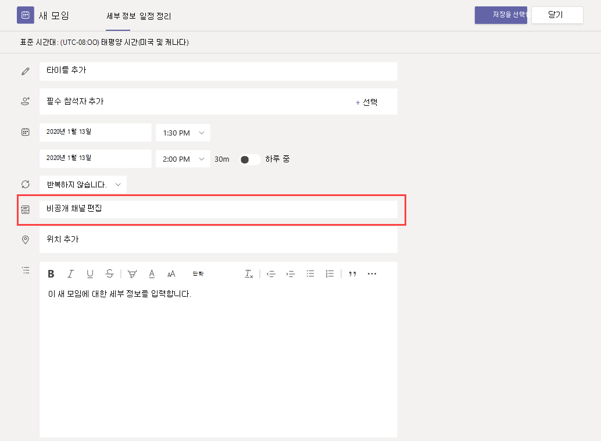

# 모임 정책 설정 - 일반

이 문서에서는 Teams 모임에 대한 다음 일반 정책 설정을 설명합니다.

- [채널에서 지금 만나기 허용](#allow-meet-now-in-channels)
- [Outlook 추가 기능 허용](#allow-the-outlook-add-in)
- [채널 모임일정 허용](#allow-channel-meeting-scheduling)
- [비공개 모임을 허용합니다.](#allow-scheduling-private-meetings)
- [비공개 모임에서 지금 모임 허용](#allow-meet-now-in-private-meetings)
- [지정된 발표자 역할 모드](#designated-presenter-role-mode)
- [모임 참석 보고서](#meeting-attendance-report)
- [제도 모드에 대한 모임 공급자](#meeting-provider-for-islands-mode)

## 채널에서 지금 만나기 허용

이는 사용자당 정책으로 모임이 시작되기 전에 적용됩니다. 이 설정은 사용자가 Teams 채널에서 모임을 시작할 수 있는지 여부를 제어합니다. 이 기능을 설정하면 사용자는 모임  단추를 클릭하여 모임을 시작하거나 채널에서 모임을 예약할 수 있습니다. 기본값은 True입니다.

## Outlook 추가 기능 허용

이는 사용자당 정책으로 모임이 시작되기 전에 적용됩니다. 이 설정은 Outlook(Windows, Mac, 웹 및 모바일) 내에서 Teams 모임을 예약할 수 있는지 여부를 제어합니다.

이 기능을 해제하면 사용자가 Outlook에서 새 모임을 만들 때 Teams 모임을 예약할 수 없습니다. 예를 들어 Windows의 Outlook에서  새 팀 모임 옵션이 리본에 표시되지 않습니다.

## 채널 모임일정 허용

기존 AllowChannelMeetingScheduling 정책을 사용하여 팀 채널 일정에서 만들 수 있는 이벤트 유형을 제어합니다. 이는 사용자당 정책으로 모임이 시작되기 전에 적용됩니다. 이 설정은 사용자가 Teams 채널에서 모임을 예약할 수 있는지 여부를 제어합니다. 기본적으로 이 설정은 켜져 있습니다. 

이 정책이 해제된 경우 사용자는 새 채널 모임을 만들 수 없습니다. 그러나 기존 채널 모임은 이벤트 이끌이가 편집할 수 있습니다.

모임 예약이 비활성화됩니다.

채널 선택을 사용할 수 없습니다.

[모임을 예약할 채널을 선택하는 일정 옵션을 보여주는 ](media/meeting-policies-select-a-channel-to-meet-in.png#lightbox)

채널 게시물 페이지에서는 다음을 사용하지 않도록 설정됩니다.

- **채널 회신** 작성 상자에서 모임 단추를 예약합니다.
  
  
- **채널 헤더에서** 모임 단추를 예약합니다.
  

채널 달력에서:

- **채널 일정 헤더에** 새 이벤트 단추를 추가하면 비활성화됩니다.
  

- 사용자는 채널 일정에서 시간 블록을 끌어 채널 모임을 만들 수 없습니다.

- 사용자는 바로 가기 키를 사용하여 채널 일정에서 모임을 만들 수 없습니다.

관리 센터에서:

채널 일정 앱은 앱 권한 정책 페이지의 **Microsoft 앱** 섹션에 표시됩니다.

## 비공개 모임을 허용합니다.

이는 사용자당 정책으로 모임이 시작되기 전에 적용됩니다. 이 설정은 사용자가 Teams에서 비공개 모임을 예약할 수 있는지 여부를 제어합니다. 모임은 팀의 채널에 게시되지 않은 경우 비공개입니다.

비공개 모임 예약  허용을 해제하고 채널 모임 예약 허용을 해제하면 Teams의 사용자에 대해  필수 참석자 추가 및 채널 추가 옵션을 사용하지 않도록 설정됩니다.  기본적으로 이 설정은 켜져 있습니다.

## 비공개 모임에서 지금 모임 허용

이는 사용자당 정책으로 모임이 시작되기 전에 적용됩니다. 이 설정은 사용자가 비공개 모임을 시작할 수 있는지 여부를 제어합니다.  기본적으로 이 설정은 켜져 있습니다.

## 지정된 발표자 역할 모드

사용자당 정책입니다. 이 설정을 사용하면 Teams 클라이언트의 모임 옵션에서  발표할 수 있는 **사람의** 기본값을 변경할 수 있습니다. 이 정책 설정은 모임 지금 모임을 포함하여 모든 모임에 영향을 미치게 됩니다.

발표할 **수 있는 사람?** 설정을 사용하면 모임 이끌이가 모임에서 발표자가 될 수 있는 인원을 선택할 수 있습니다. 자세한 내용은 Teams 모임의 [Teams](https://support.microsoft.com/article/change-participant-settings-for-a-teams-meeting-53261366-dbd5-45f9-aae9-a70e6354f88e) 모임 및 역할에 대한 참가자 설정 [변경을 참조하세요.](https://support.microsoft.com/article/roles-in-a-teams-meeting-c16fa7d0-1666-4dde-8686-0a0bfe16e019)

현재 PowerShell을 사용하여 이 정책 설정을 구성할 수 있습니다. [Set-CsTeamsMeetingPolicy](https://docs.microsoft.com/powershell/module/skype/set-csteamsmeetingpolicy) cmdlet을 사용하여 기존 Teams 모임 정책을 편집할 수 있습니다. 또는 [New-CsTeamsMeetingPolicy](https://docs.microsoft.com/powershell/module/skype/new-csteamsmeetingpolicy) cmdlet을 사용하여 새 Teams 모임 정책을 만들고 사용자에게 할당합니다.

Teams에서 표시할 수 있는 **사람의** 기본값을 지정하기 위해 Teams에서 **DesignatedPresenterRoleMode** 매개 변수를 다음 중 하나로 설정합니다.

- **EveryoneUserOverride:** 모든 모임 참가자가 발표자일 수 있습니다. 기본값입니다. 이 매개 변수는 **Teams의 모든 사용자** 설정에 해당합니다.
- **EveryoneInCompanyUserOverride:** 게스트 사용자를 포함하여 조직의 인증된 사용자가 발표자일 수 있습니다. 이 매개 변수는 Teams의 내 조직 **설정의 사용자에** 해당합니다.
- **OrganizerOnlyUserOverride:** 모임 이끌이만 발표자가 될 수 있으며 모든 모임 참가자는 참석자로 지정됩니다. 이 매개 변수는 **Teams의 나만** 설정에 해당합니다.

기본값을 설정한 후에도 모임 이끌이는 Teams에서 이 설정을 변경하고 예약한 모임에 참석할 수 있는 사용자도 선택할 수 있습니다.

## 모임 참석 보고서

사용자당 정책입니다. 이 설정은 모임 이끌이가 모임 참석 보고서를 다운로드할 수 있는지 [여부를 제어합니다.](teams-analytics-and-reports/meeting-attendance-report.md)

현재 PowerShell을 사용하여 이 정책 설정을 구성할 수 있습니다. [Set-CsTeamsMeetingPolicy](https://docs.microsoft.com/powershell/module/skype/set-csteamsmeetingpolicy) cmdlet을 사용하여 기존 Teams 모임 정책을 편집할 수 있습니다. 또는 [New-CsTeamsMeetingPolicy](https://docs.microsoft.com/powershell/module/skype/new-csteamsmeetingpolicy) cmdlet을 사용하여 새 Teams 모임 정책을 만들고 사용자에게 할당합니다.

모임 이끌이가 모임 참석 보고서를 다운로드하도록 설정하려면 **AllowEngagementReport** 매개 변수를 사용 으로 **설정합니다.** 이 옵션을 사용하도록 설정하면 보고서를 다운로드하는  옵션이 참가자 창에 표시됩니다.

모임 이끌이가 보고서를 다운로드하지 못하게하려면 매개 변수를 사용 안 으로 **설정합니다.** 기본적으로 이 설정은 비활성화되어 있으며 보고서를 다운로드하는 옵션을 사용할 수 없습니다.

## 제도 모드에 대한 모임 공급자

사용자당 정책입니다. 이 설정은 아일랜드 모드인 사용자에게 사용되는 Outlook 모임 추가 기능을 *제어합니다.* 사용자가 Teams 모임 추가 기능만 사용할 수 있는지 또는 Teams 모임 및 비즈니스용 Skype 모임 추가 기능을 모두 사용하여 Outlook에서 회의를 예약할 수 있는지 여부를 지정할 수 있습니다.

이 정책은 아일랜드 모드이면서 Teams 모임 정책에서 **AllowOutlookAddIn** 매개 변수가 **True** 로 설정된 사용자에게만 적용할 수 있습니다.

현재 PowerShell을 사용하여 이 정책을 설정할 수 있습니다. [Set-CsTeamsMeetingPolicy](https://docs.microsoft.com/powershell/module/skype/set-csteamsmeetingpolicy) cmdlet을 사용하여 기존 Teams 모임 정책을 편집할 수 있습니다. 또는 [New-CsTeamsMeetingPolicy](https://docs.microsoft.com/powershell/module/skype/new-csteamsmeetingpolicy) cmdlet을 사용하여 새 Teams 모임 정책을 만들고 사용자에게 할당합니다.

사용자가 사용할 수 있는 모임 추가 기능을 지정하기 위해 다음과 같이 **PreferredMeetingProviderForIslandsMode** 매개 변수를 설정합니다.

- **TeamsAndSfB로** 매개 변수를 설정하여 Outlook에서 Teams 모임 추가 기능 및 비즈니스용 Skype 추가 기능을 모두 사용하도록 설정합니다. 기본값입니다.
- Outlook에서 **Teams** 모임 추가 기능만 사용하도록 설정하려면 매개 변수를 Teams로 설정합니다. 이 정책 설정은 향후 모든 모임에 Teams 모임 조인 링크가 있도록 합니다. 기존 비즈니스용 Skype 모임 참가 링크를 Teams로 마이그레이션하지 않습니다. 이 정책 설정은 비즈니스용 Skype의 현재 상태, 채팅, PSTN 통화 또는 기타 기능에 영향을 주지 않습니다. 즉, 사용자는 이러한 기능에 대해 비즈니스용 Skype를 계속 사용할 수 있습니다.

  매개 변수를 **Teams로** 설정한 다음 **TeamsAndSfB로** 다시 전환하면 두 모임 추가 기능이 모두 활성화됩니다. 그러나 기존 Teams 모임 조인 링크는 비즈니스용 Skype로 마이그레이션되지 않습니다. 변경 후 예약된 비즈니스용 Skype 모임만 비즈니스용 Skype 모임 참가 링크가 있습니다.

## 모임 반응

AllowMeetingReactions 설정은 PowerShell을 사용하여만 적용할 수 있습니다. Teams 관리 센터에서 AllowMeetingReactions를 설정하거나 해제하는 옵션은 없습니다.

모임 반응은 기본적으로 꺼집니다. 사용자에 대한 반응을 끄는 것은 사용자가 예약한 모임에서 반응을 사용할 수 없습니다. 모임 이끌이는 기본 설정에 관계없이 모임 옵션 페이지에서 여전히 반응을 설정할 수 있습니다.

## 관련 항목

- [Teams PowerShell 개요](teams-powershell-overview.md)
- [Teams에서 사용자에게 정책 할당](assign-policies.md)
- [사용자로부터 RestrictedAnonymousAccesss Teams 모임 정책 제거](meeting-policies-restricted-anonymous-access.md)
