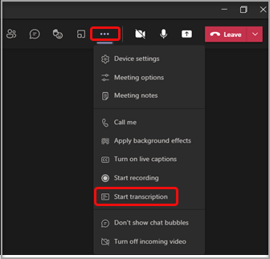

# Teams에서의 모임 정책 관리

::: zone target="docs"
모임 정책을 사용하여 조직 내 사용자가 예약한 모임의 참가자가 사용할 수 있는 기능을 제어합니다. 자동 생성된 전역(조직 전체의 기본값) 정책을 사용하거나 사용자 지정 정책을 만들어서 할당할 수 있습니다. Microsoft Teams 관리 센터에서 아니면 [PowerShell](teams-powershell-overview.md)을 사용하여 모임 정책을 관리합니다.

> [!NOTE]
> 역할을 사용하여 모임 발표자 및 참석자 권한 관리하기에 대한 자세한 내용은[ Teams 모임에서 역할](https://support.microsoft.com/office/roles-in-a-teams-meeting-c16fa7d0-1666-4dde-8686-0a0bfe16e019?ui=en-us&rs=en-us&ad=us)을 참조하세요.

다음 방법으로 정책을 구현하면 이 정책은 모임이 시작되기 전이나, 모임 도중이나 모임 후에 사용자의 모임 환경에 영향을 미칩니다.

|구현 유형  |설명  |
|---------|---------|
|모임 이끌이별    |이끌이별 정책을 구현하면 모임의 모든 참가자가 이끌이의 정책을 이어 받습니다. 예를 들어 **자동으로 사용자 입장** 은 이끌이별 정책에 해당하며 사용자가 바로 모임에 참가할지 또는 정책을 할당받은 사용자가 예약한 모임을 위해 로비에서 대기할지 여부를 제어합니다.          |
|사용자별    |사용자별 정책을 구현하는 경우 사용자별 정책이 적용되어 이끌이 및/또는 모임 참가자의 특정 기능을 제한합니다. 예를 들어 **지금 채널에서 모임 시작 허용** 은 사용자별 정책에 해당합니다.     |
|이끌이별 및 사용자별     |이끌이별 및 사용자별 정책 조합을 구현하는 경우 해당 정책 및 이끌이의 정책에 따라 모임 참가자의 특정 기능이 제한됩니다. 예를 들어 **클라우드 녹음/녹화 허용** 은 이끌이별 및 사용자별 정책입니다. 사용자가 녹음을 시작 및 중지하도록 허용하려면 이 설정을 사용합니다.

전역 정책의 설정을 편집하거나 하나 이상의 사용자 지정 정책을 만들어 할당할 수 있습니다. 사용자 지정 정책을 만들고 할당하지 않으면 사용자에게 전역 정책이 적용됩니다.

> [!NOTE]
> 사용자가 오디오 회의 라이선스를 사용하도록 설정하거나 사용자가 오디오 회의에 포함되어 있는 경우 모임 세부 정보 단추를 사용할 수 있습니다. 그렇지 않은 경우 모임 세부 정보를 사용할 수 없습니다.

## 사용자 지정 모임 정책 만들기

1. Microsoft Teams 관리 센터의 왼쪽 탐색 창에서 **모임** > **모임 정책** 으로 이동합니다.
2. **추가** 를 선택합니다.
3. 정책의 이름과 설명을 입력합니다. 이름에 특수 문자가 들어가거나 64자를 초과할 수 없습니다.
4. 원하는 설정을 선택합니다.
5. **저장** 을 선택합니다.

예를 들어, 사용자 수가 많은데 모임에 필요한 대역폭의 양을 제한하려고 한다고 가정해 보겠습니다. "제한된 대역폭"이라는 새 사용자 지정 정책을 만들고 다음 설정을 사용하지 않도록 설정합니다.

**오디오 및 비디오** 에서:

- 클라우드 녹음/녹화 허용을 끕니다.
- IP 비디오 허용을 끕니다.

**콘텐츠 공유** 에서:

- 화면 공유 모드를 사용하지 않도록 설정합니다.
- 화이트보드 허용을 끕니다.
- 공유 노트 허용을 끕니다.

그 다음 사용자에게 정책을 할당합니다.

## 모임 정책 편집

전역 정책 및 직접 만든 사용자 지정 정책을 편집할 수 있습니다.

1. Microsoft Teams 관리 센터의 왼쪽 탐색 창에서 **모임** > **모임 정책** 으로 이동합니다.
2. 정책 이름 왼쪽을 클릭하여 정책을 선택한 다음 **편집** 을 선택합니다.
3. 여기서 원하는 대로 변경합니다.
4. **저장** 을 선택합니다.

> [!NOTE]
> 한 번에 한 개의 모임 정책만 사용자에게 할당됩니다.

## 사용자에게 모임 정책 할당

[!INCLUDE [assign-policy](includes/assign-policy.md)]

> [!NOTE]
> 사용자에게 할당된 정책을 삭제할 수 없습니다. 먼저 영향을 받는 모든 사용자에게 다른 정책을 할당한 후에 처음의 정책을 삭제할 수 있습니다.

## 모임 정책 설정

**모임 정책** 페이지에서 기존 정책을 선택하거나 **추가** 를 선택하여 새로운 정책을 추가합니다. 다음 항목에 대한 설정을 구성합니다.

- [일반](#meeting-policy-settings---general)
- [오디오 및 비디오](#meeting-policy-settings---audio--video)
- [콘텐츠 공유](#meeting-policy-settings---content-sharing)
- [참가자 및 게스트](#meeting-policy-settings---participants--guests)

::: zone-end

## 모임 정책 설정 - 일반

- [지금 채널에서 모임 시작 허용](#allow-meet-now-in-channels)
- [Outlook 추가 기능 허용](#allow-the-outlook-add-in)
- [채널 모임 예약 허용](#allow-channel-meeting-scheduling)
- [비공개 모임 예약 허용](#allow-scheduling-private-meetings)
- [비공개 모임으로 지금 모임 시작 허용](#allow-meet-now-in-private-meetings)

### 지금 채널에서 모임 시작 허용

**지금 모임 시작** 허용은 사용자별 정책에 해당하며 모임이 시작되기 전에 적용됩니다. 이 설정은 사용자가 Teams 채널에서 계획되지 않은 모임을 시작할 수 있는지 여부를 제어합니다. 이 설정을 사용하면 사용자는 **모임 시작** 단추를 선택하여 계획되지 않은 모임을 시작하거나 채널 모임을 예약할 수 있습니다. 기본값은 True입니다.

### Outlook 추가 기능 허용

Outlook 추가 기능 허용은 사용자별 정책에 해당하며 모임이 시작되기 전에 적용됩니다. 이 설정은 Teams 모임을 Outlook(Windows, Mac, 웹 및 모바일)에서 예약 가능한지 여부를 제어합니다.

이 기능을 해제하면 사용자는 모임을 예약할 수 없습니다. Outlook에서 새 모임을 만들면 Teams 모임입니다. 예를 들어 Windows 기반 Outlook에서는 **새 Teams 모임** 옵션이 리본에 표시되지 않습니다.

### 채널 모임 예약 허용

기존 AllowChannelMeetingScheding 정책을 사용하여 팀 채널 일정에서 만들 수 있는 이벤트 유형을 제어합니다. 이 정책은 사용자별 정책에 해당하며 모임이 시작되기 전에 적용됩니다. 이 설정은 사용자가 Teams 채널의 모임을 예약할 수 있는지 여부를 제어합니다. 이 설정은 기본적으로 켜져 있습니다.

이 정책이 꺼져 있는 경우 사용자는 새 채널 모임을 만들 수 없습니다. 단 이벤트 이끌이가 기존 채널 모임을 편집할 수는 있습니다.

모임 예약을 사용할 수 없습니다.

 

채널 선택을 사용할 수 없습니다.

채널 게시물 페이지에서 다음 기능을 사용할 수 없습니다.

- 채널 회신 작성란의 **모임 예약** 단추
  
  
- 채널 헤더의 **모임 예약** 단추
  

채널 일정에서:

- 채널 일정의 **새 이벤트 추가** 단추를 사용할 수 없습니다.
  

- 사용자는 채널 일정의 시간 블록을 끌어서 선택하여 채널 모임을 만들 수 없습니다.

- 사용자는 바로 가기 키를 사용하여 채널 일정에서 모임을 만들 수 없습니다.

관리 센터에서:

채널 일정 앱이 앱 사용 권한 정책 페이지의 **Microsoft 앱** 섹션에 표시됩니다.

 

### 비공개 모임 예약 허용

비공개 모임 예약 정책은 사용자별 정책에 해당하며 모임이 시작되기 전에 적용됩니다. 이 설정은 사용자가 Teams에서 비공개 모임을 예약할 수 있는지 여부를 제어합니다. 모임이 팀의 채널에 게시되지 않은 경우 비공개 모임에 해당합니다.

**비공개 모임 예약 허용** 및 **채널 모임 예약 허용** 정책을 끈 경우 Teams 사용자는 **필수 참석자 추가** 및 **채널 추가** 옵션을 사용할 수 없습니다. 이 설정은 기본적으로 켜져 있습니다.

### 비공개 모임으로 지금 모임 시작 허용

이 정책은 사용자별 정책에 해당하며 모임이 시작되기 전에 적용됩니다. 이 설정은 사용자가 계획되지 않은 비공개 모임을 시작할 수 있는지 여부를 제어합니다. 이 설정은 기본적으로 켜져 있습니다.

## 모임 정책 설정 - 오디오 및 비디오

- [기록 허용](#allow-transcription)
- [클라우드 녹음/녹화 허용](#allow-cloud-recording)
- [IP 오디오 모드](#mode-for-ip-audio)
- [IP 비디오 모드](#mode-for-ip-video)
- [IP 비디오 허용](#allow-ip-video)
- [미디어 비트 전송률(Kb)](#media-bit-rate-kbs)

### 기록 허용

이 정책은 실시간 받아쓰기 기능을 설정합니다. 기록 허용은 사용자별 정책입니다. 이 설정은 이 특정 팀의 모임을 글로 옮길 수 있는지 여부를 제어합니다.

실시간 받아쓰기는 거의 실시간으로 Teams 모임 도중 중 말한 음성 콘텐츠를 텍스트로 보여줍니다. 발표자 이름 및 타임스탬프를 포함한 텍스트는 모임 동영상 옆에 표시됩니다. 자세한 내용을 보려면 [Teams 모임의 실시간 받아쓰기 보기](https://support.microsoft.com/office/view-live-transcription-in-a-teams-meeting-dc1a8f23-2e20-4684-885e-2152e06a4a8b)를 참조하세요.

현재 Teams 데스크톱 클라이언트에서 실시간 받아쓰기가 지원됩니다. 미국 구어 영어에 대한 받아쓰기가 지원됩니다. Teams 데스크톱 또는 웹에서 모임 후에 기록을 사용할 수 있습니다.

**기록 허용** 및 **클라우드 녹음/녹화 허용** 정책 설정이 함께 작동하는 방식은 다음과 같습니다. 다음 표에는 이러한 설정의 값과 모임 동작에 대한 설명이 나와 있습니다.

|기록 허용|클라우드 녹음/녹화 허용|동작|
|---------|---------|---------|
|**설정**|**설정**|**받아쓰기 시작** 옵션은 Teams 모임에서 사용할 수 있습니다. 모임 이끌이 또는 모임 참가자는 기록을 시작하거나 중지할 수 있습니다. **녹음/녹화 시작** 옵션은 Teams 모임에서 사용할 수 있습니다. 모임 이끌이 또는 모임 참가자는 녹음/녹화를 시작하거나 중지할 수 있습니다. |
|**설정**|**해제**|**받아쓰기 시작** 옵션은 Teams 모임에서 사용할 수 있습니다. **녹음/녹화 시작** 옵션은 Teams 모임에서 사용할 수 없습니다. |
|**해제**|**설정**|**녹음/녹화 시작** 옵션은 Teams 모임에서 사용할 수 있습니다. **받아쓰기 시작** 옵션은 Teams 모임에서는 사용할 수 없습니다.|
|**해제**|**해제**|Teams 모임에서 녹음/녹화 및 받아쓰기를 사용할 수 없습니다.  |

### 클라우드 녹음/녹화 허용

클라우드 녹음/녹화 허용은 사용자별 정책에 따라 제어됩니다. 이 설정은 사용자가 기록할 수 있는지 여부를 제어합니다. 특정 정책 설정을 사용하고 모임 이끌이 또는 다른 모임 참가자가 이끌이와 같은 조직의 인증된 사용자인 경우 모임 이끌이 또는 다른 모임 참가자가 녹음/녹화를 시작할 수 있습니다.

페더레이션 사용자 및 익명 사용자와 같은 조직 외부의 사용자는 녹음/녹화를 시작할 수 없습니다. 게스트 사용자는 녹음/녹화를 시작하거나 중지할 수 없습니다.

다음 예를 살펴봅시다.

|사용자 |모임 정책  |클라우드 녹음/녹화 허용 |
|---------|---------|---------|
|Daniela | 전역   | 해제 |
|Amanda | Location1MeetingPolicy | 설정|
|John(외부 사용자) | 해당 사항 없음 | 해당 사항 없음|

Daniela는 모임 이끌이지만 해당 정책이 해제 설정되어 기록할 수 없습니다. Amanda는 정책 설정을 사용하도록 설정했으므로 Daniela가 이끄는 모임을 포함하여 모임을 기록할 수 있습니다. Amanda가 모임 이끌이라면 해당 모임을 기록할 수 있습니다. 그렇지만 정책 설정을 사용 안 함 설정한 Daniela와 외부 사용자인 John은 해당 모임을 기록할 수 없습니다.

클라우드 모임 녹음/녹화에 대해 자세히 알아보려면 [Teams 클라우드 모임 녹음/녹화](cloud-recording.md)를 참조하세요.

### IP 오디오 모드

IP 오디오 모드는 사용자별 정책입니다. 이 설정은 모임 및 그룹 통화에서 오디오를 설정할 수 있는지 여부를 제어합니다. 이 설정의 값은 다음과 같습니다.

|설정값 |동작  |
|---------|---------|
|**발신 및 수신 오디오 사용**    |모임에서 발신 및 수신 오디오가 허용됩니다. 기본 설정입니다. |
|**사용 안 함**     |모임에서 발신 및 수신 오디오가 해제되었습니다.     |

사용자에 대해 **사용 안 함** 설정되어 있는 경우 해당 사용자는 계속 모임을 예약하고 구성할 수 있지만 오디오를 사용할 수 없습니다. 모임에 참가하기 위해 사용자는 공중 전화망(PSTN)을 통해 전화를 걸거나 전화로 사용자를 연결하는 모임 통화를 해야 합니다. 정책이 할당되지 않은 모임 참가자(예: 익명 참가자)는 기본적으로 **발신 및 수신 오디오 사용** 으로 설정되어 있습니다. Teams 모바일 클라이언트에서 이 설정을 사용하지 않도록 설정한 경우 사용자는 PSTN을 통해 모임에 전화를 걸어야 합니다.

이 설정은 일대일 통화에는 적용되지 않습니다. 일대일 통화를 제한하려면 Teams [통화 정책](teams-calling-policy.md)을 구성하고 **개인 전화 걸기** 설정을 해제합니다. 이 설정은 Surface Hub 및 Microsoft Teams 룸 장치와 같은 회의실 장치에도 적용되지 않습니다.

Microsoft 365 정부 커뮤니티 클라우드(GCC), GCC High 또는 국방부(DoD) 환경에서는 아직 이 설정을 사용할 수 없습니다.

자세한 내용은 [모임 참가자용 오디오/비디오 관리](#manage-audiovideo-for-meeting-participants)를 참조하세요.

### IP 비디오 모드

IP 비디오 모드는 사용자별 정책입니다. 이 설정은 모임 및 그룹 통화에서 비디오를 설정할 수 있는지 여부를 제어합니다. 이 설정의 값은 다음과 같습니다.

|설정값 |동작  |
|---------|---------|
|**발신 및 수신 비디오 사용**    | 모임에서 발신 및 수신 비디오 허용이 기본 설정입니다. |
|**사용 안 함**     | 모임에서 발신 및 수신 비디오가 해제되었습니다. Teams 모바일 클라이언트 사용자는 모임에서 비디오나 사진을 공유할 수 없습니다.   **IP 오디오 모드** 를 사용하지 않으면 **IP 비디오 모드** 또한 사용 안 함으로 남아 있습니다.  |

사용자에 대해 **사용 안 함** 설정되어 있으면 해당 사용자는 비디오를 켜거나 다른 모임 참가자가 공유한 비디오를 볼 수 없습니다. 정책이 할당되지 않은 모임 참가자(예: 익명 참가자)는 기본적으로 **발신 및 수신 비디오 사용** 으로 설정되어 있습니다.

이 설정은 Surface Hub 및 Microsoft Teams 룸 장치와 같은 회의실 장치에는 적용되지 않습니다.

Microsoft 365 정부 커뮤니티 클라우드(GCC), GCC High 또는 국방부(DoD) 환경에서는 아직 이 설정을 사용할 수 없습니다.

> [!NOTE]
> 이 설정은 발신 및 수신 비디오를 모두 제어하는 반면, **IP 비디오 허용** 설정은 발신 비디오만을 제어합니다. 자세한 내용은 다음 [IP 비디오 정책 설정 우선 순위](#which-ip-video-policy-setting-takes-precedence) 및 [모임 참가자용 오디오/비디오 관리](#manage-audiovideo-for-meeting-participants)를 참조하세요.

자세한 내용은 [모임 참가자용 오디오/비디오 관리](#manage-audiovideo-for-meeting-participants)를 참조하세요.

### IP 비디오 허용

IP 비디오 허용은 이끌이별 정책과 사용자별 정책이 조합된 형태의 정책입니다. 비디오는 중요한 모임 구성 요소입니다. 일부 조직에서는 관리자가 비디오 사용 사용자 모임에 대해 더 많은 제어권을 필요로 할 수 있습니다. 이 설정은 사용자가 호스트하는 일대일 모임과 사용자가 시작한 그룹 통화에서 비디오를 설정할 수 있는지 여부를 제어합니다. Teams 모바일 클라이언트에서 이 설정은 사용자가 모임에서 사진 및 비디오를 공유할 수 있는지 여부를 제어합니다.

이 정책 설정을 사용하도록 설정한 사용자가 이끄는 모임은 모임에서 모임 참가자에 의한 비디오 공유를 허용합니다. 단 모임 참가자 또한 정책 설정을 사용 설정해야 합니다. 정책이 할당되지 않은 모임 참가자(예: 익명 및 페더레이션 참가자)는 모임 이끌이의 정책을 이어 받습니다.

> [!NOTE]
> 이 설정은 발신 비디오를 제어하는 반면, **IP 비디오 허용** 설정은 발신 및 수신 비디오를 모두 제어합니다. 자세한 내용은 다음 [IP 비디오 정책 설정 우선 순위](#which-ip-video-policy-setting-takes-precedence) 및 [모임 참가자용 오디오/비디오 관리](#manage-audiovideo-for-meeting-participants)를 참조하세요.

| Teams 데스크톱 및 웹 클라이언트 |Teams 모바일 클라이언트  |
|:-------:|:-------:|
|    |          |

다음 예를 살펴봅시다.

|사용자 |모임 정책  |IP 비디오 허용 |
|---------|---------|---------|
|Daniela   | 전역   | 설정       |
|Amanda    | Location1MeetingPolicy        | 해제      |

Daniela가 호스트한 모임에서 비디오를 켜도록 허용합니다. Daniela는 모임에 참가하여 비디오를 켤 수 있습니다. Amanda의 정책은 비디오를 허용하지 않도록 설정되어 있으므로 Amanda는 Daniela가 이끄는 모임에서 비디오를 켤 수 없습니다. Amanda는 모임의 다른 참가자가 공유한 비디오를 볼 수 있습니다.

Amanda가 호스트한 모임에서는 누구도 할당된 비디오 정책에 관계없이 비디오를 켤 수 없습니다. 즉 Daniela는 Amanda가 이끄는 모임에서 비디오를 켤 수 없습니다.  

Daniela가 비디오를 켠 채로 Amanda에게 전화하는 경우 Amanda는 오디오만 켜진 채로 통화에 응답할 수 있습니다. 통화가 연결되면 Amanda는 Daniela의 비디오를 볼 수 있지만 비디오를 켜지 못합니다. Amanda가 Daniela에게 전화를 걸면 Daniela는 비디오 및 오디오를 사용하여 통화에 응답할 수 있습니다. 통화가 연결되면 Daniela는 필요에 따라 비디오를 켜거나 끌 수 있습니다.

자세한 내용은 [모임 참가자용 오디오/비디오 관리](#manage-audiovideo-for-meeting-participants)를 참조하세요.

#### IP 비디오 정책 설정 우선 순위

사용자를 기준으로 가장 제한적인 비디오 정책 설정이 우선합니다. 예를 들면 다음과 같습니다.

|IP 비디오 허용|IP 비디오 모드|모임 환경|
|---------|---------|---------|
|이끌이: **켜짐**  참가자: **켜짐** |참가자: **사용 안 함**        |**IP 비디오 모드** 설정이 우선합니다. 이 정책이 할당된 참가자는 비디오를 켜거나 다른 사용자들이 공유한 비디오를 볼 수 없습니다.|
|이끌이: **켜짐**  참가자: **켜짐** |참가자: **발신 및 수신 비디오 사용**          |이 정책이 할당된 참가자는 비디오를 켜거나 다른 사용자들이 공유한 비디오를 볼 수 있습니다.         |
|이끌이: **켜짐**  참가자: **꺼짐** |참가자: **발신 및 수신 비디오 사용**         |**IP 비디오 허용** 설정이 우선합니다. 참가자는 수신 비디오만 볼 수 있으며 발신 비디오를 전송할 수 없습니다.         |
|이끌이: **켜짐**  참가자: **꺼짐** |참가자: **사용 안 함**         |**IP 비디오 모드** 설정이 우선합니다. 참가자는 수신 또는 발신 비디오를 볼 수 없습니다.|
|이끌이: **꺼짐**    |       |이끌이에 대해 꺼져 있으므로 **IP 비디오 허용** 설정이 우선합니다. 이제 누구도 이 정책이 할당된 사용자가 이끄는 모임에서 비디오를 켤 수 없습니다.         |

### 모임 참가자용 오디오/비디오 관리

|수행하려는 작업...  |가능한 정책 설정  |
|---------|---------|
|모임 참가자의 오디오 및 비디오 비활성화  |IP 오디오 모드: **사용 안 함**  IP 비디오 모드: **사용 안 함** IP 비디오 허용: N/A       |
|모임 참가자에 대해 수신 비디오 및 오디오만 사용하도록 설정  |IP 오디오 모드: **발신 및 수신 오디오 사용**  IP 비디오 모드: **발신 및 수신 비디오 사용** IP 비디오 허용: **꺼짐**       |
|모임 참가자에 대해 비디오 비활성화(참가자는 오디오만 사용)|  IP 오디오 모드: **발신 및 수신 오디오 활성화**  IP 비디오 모드: **사용 안 함** IP 비디오 허용: N/A
|모임 참가자의 오디오 및 비디오 활성화    |IP 오디오 모드: **발신 및 수신 오디오 사용**(기본 설정)  IP 비디오 모드: **발신 및 수신 비디오 사용**(기본 설정) IP 비디오 허용: **켜짐**(기본 설정)    |

모임 이끌이의 정책과 사용자 정책 간의 가장 제한적인 정책이 적용됩니다. 예를 들어 이끌이 정책이 비디오를 제한하고 사용자 정책이 비디오를 제한하지 않는 경우 모임 참가자는 모임 이끌이의 정책을 상속하고 모임에서 비디오에 액세스할 수 없습니다. 즉, 오디오만 켜진 상태에서 모임에 참가할 수 있습니다.

> [!NOTE]
> 사용자가 전화로 연결하는 그룹 통화를 시작하면 **음성 전화 사용** 화면이 나타나지 않습니다. 이 문제는 알려진 문제이며 현재 해결하기 위해 작업 중입니다. 이 문제를 해결하려면 **다른 참가 옵션** 에서 **음성전화** 를 선택합니다.  

#### Teams 모바일 클라이언트

Teams 모바일 클라이언트 사용자인 경우 모임 중에 사진과 비디오를 공유할 수 있는 기능이 **IP 비디오 허용** 또는 **IP 비디오 모드** 설정으로 결정됩니다. 우선하는 정책 설정에 따라 비디오 및 사진을 공유하는 기능을 사용할 수 없습니다. 이 설정은 화면 공유에는 영향을 미치지 않으며, 이는 별도로 [화면 공유 모드](#screen-sharing-mode) 설정을 사용하여 구성합니다. 또한 휴대폰 사용자가 휴대폰 연결을 통해 IP 비디오를 사용하지 못하도록 [Teams 이동성 정책](/powershell/module/skype/new-csteamsmobilitypolicy)을 설정할 수 있습니다. 이러면 Wi-Fi 연결을 사용해야 합니다.

### 미디어 비트 전송률(Kb)

사용자별 정책에 해당합니다. 이 설정은 사용자 통화 및 모임 내 오디오, 비디오 및 비디오 기반 앱 공유 전송의 합계 평균 미디어 비트 전송률을 결정합니다. 이 설정은 통화 또는 모임 사용자의 업링크 및 다운링크 미디어 통과 모두에 적용됩니다. 이 설정으로 조직의 대역폭 관리를 세밀하게 제어할 수 있습니다. 사용자가 요구한 모임 시나리오에 따라 양질의 환경을 보장하기 위해 충분한 대역폭을 확보하는 것이 좋습니다. 최소값은 30Kbps이고 최대값은 모임 시나리오에 따라 다릅니다. 양질의 Teams 모임, 통화 및 라이브 이벤트를 위한 권장 최소 대역폭에 대해 자세히 알아보려면 [대역폭 요구 사항](prepare-network.md#bandwidth-requirements)을 참조하세요.

모임 대역폭이 충분하지 않으면 네트워크 품질이 열악함을 나타내는 메시지가 참가자에게 표시됩니다.

CEO 이사회 모임 및 Teams 라이브 이벤트와 같이 최고 품질의 비디오 환경이 필요한 모임의 경우 대역폭을 10Mbps로 설정하는 것이 좋습니다. 최대한의 환경을 설정한 경우에도 Teams 미디어 스택은 시나리오에 따라 특정 네트워크 상태가 감지될 때 낮은 대역폭 조건에 맞게 조정됩니다.

## 모임 정책 설정 - 콘텐츠 공유

- [화면 공유 모드](#screen-sharing-mode)
- [참가자가 제어권을 주거나 요청하도록 허용](#allow-a-participant-to-give-or-request-control)
- [외부 참가자가 제어권을 주거나 요청하도록 허용](#allow-an-external-participant-to-give-or-request-control)
- [PowerPoint 공유 허용](#allow-powerpoint-sharing)
- [화이트보드 허용](#allow-whiteboard)
- [공유 메모 허용](#allow-shared-notes)

### 화면 공유 모드

> [!NOTE]
> 이 기능은 아직 개발 중입니다. 화면 공유는 참가자별 정책이지만 이 섹션에 설명된 바와 같이 모임 이끌이의 화면 공유 설정이 영향을 미칠 수 있습니다.

이 설정은 사용자 모임에서 바탕화면 및/또는 창 공유를 허용할지 여부를 제어합니다. 정책이 할당되지 않은 모임 참가자(예: 익명, 게스트, B2B 및 페더레이션 참가자)는 모임 이끌이의 정책을 이어 받습니다.

|설정값 |동작  |
|---------|---------|
|**전체 화면**    | 모임에서 전체 바탕화면 공유 및 응용 프로그램 공유가 허용됩니다. |
|**단일 응용 프로그램**   | 모임에서 응용 프로그램 공유가 허용됩니다.        |
|**사용 안 함**     |모임에서 화면 공유 및 응용 프로그램 공유가 해제되어 있습니다.       |

다음 예를 살펴봅시다.

|사용자 |모임 정책 |화면 공유 모드 |
|---------|---------|---------|
|Daniela  | 전역   | 전체 화면 |
|Amanda   | Location1MeetingPolicy  | 사용 안 함 |

Daniela가 호스트하는 모임에서는 모임 참가자가 그의 전체 화면 또는 특정 응용 프로그램을 공유할 수 있도록 허용합니다. Amanda가 Daniela의 모임에 참가하더라도 Amanda는 그녀의 정책 설정이 비활성화되어 있으므로 해당 화면이나 특정 응용 프로그램을 공유할 수 없습니다. Amanda가 호스트하는 모임의 경우 화면 공유 모드 정책 할당에 관계없이 누구도 화면 또는 단일 응용 프로그램을 공유할 수 없습니다. 즉, Daniela 또한 Amanda의 모임에서는 화면이나 단일 응용 프로그램을 공유할 수 없습니다.  

현재 사용자가 Google Chrome을 사용하는 경우 Teams 모임에서 비디오를 재생하거나 화면을 공유할 수 없습니다.

### 참가자가 제어권을 주거나 요청하도록 허용

사용자별 정책에 해당합니다. 이 설정으로 사용자가 다른 모임 참가자에게 공유 바탕화면 또는 창의 제어권을 줄 수 있는지 여부를 제어합니다. 제어권을 주려면 화면 위쪽으로 마우스를 가져갑니다.

이 설정이 사용자에 대해 켜져 있는 경우 공유 세션의 위쪽 막대에 **제어권 제공** 옵션이 표시됩니다.

사용자에 대해 설정이 꺼져 있는 경우 **제어권 제공** 옵션을 사용할 수 없습니다.

다음 예를 살펴봅시다.

|사용자 |모임 정책  |참가자가 제어권을 주거나 요청하도록 허용 |
|---------|---------|---------|
|Daniela   | 전역   | 설정       |
|Babek    | Location1MeetingPolicy        | 해제   |

Daniela는 Babek가 이끄는 모임의 다른 참가자에게 공유 바탕화면 또는 창의 제어권을 줄 수 있는 반면 Babek는 다른 참가자에게 제어권을 줄 수 없습니다.

PowerShell을 사용하여 제어권을 주거나 제어권 요청을 수락할 수 있는 사용자를 제어하려면 AllowParticipantGiveRequestControl cmdlet을 사용합니다.

> [!NOTE]
> 공유하는 동안 공유 콘텐츠에 대한 제어권을 부여하거나 제어권을 차지하려면 양측이 Teams 데스크톱 클라이언트를 사용하고 있어야 합니다. 컨트롤은 어느 쪽이든 브라우저에서 Teams를 실행 중인 경우 지원되지 않습니다. 이것은 해결하려고 하는 기술적 제한 때문입니다.

### 외부 참가자가 제어권을 주거나 요청하도록 허용

사용자별 정책에 해당합니다. 조직이 사용자에 대해 이 정책을 설정했는지 여부는 모임 이끌이의 설정과 관계없이 외부 참가자가 수행할 수 있는 작업을 제어하지 않습니다. 이 매개 변수는 공유자가 소속 조직의 모임 정책 내에서 설정한 정책에 따라 외부 참가자가 공유자 화면의 제어권을 받거나 제어권을 요청할 수 있는지 여부를 제어합니다. Teams 모임의 외부 참가자는 다음과 같이 분류할 수 있습니다.  

- 익명 사용자
- 게스트 사용자  
- B2B 사용자
- 페더레이션 사용자  

소속 조직의 **외부 참가자가 제어권을 주거나 요청하도록 허용** 설정으로 공유가 제어되는 동안 페더레이션 사용자가 외부 사용자에게 제어권을 제공할 수 있는지 여부입니다.

PowerShell을 사용하여 외부 참가자가 제어권을 주거나 제어권 요청을 수락할 수 있는지 여부를 제어하려면 AllowExternalParticipantGiveRequestControl cmdlet을 사용합니다.

### PowerPoint 공유 허용

사용자별 정책에 해당합니다. 이 설정으로 사용자가 모임에서 PowerPoint 슬라이드 데크를 공유할 수 있는지 여부를 제어합니다. 익명, 게스트 및 페더레이션 사용자를 포함한 외부 사용자는 모임 이끌이의 정책을 이어 받습니다.

다음 예를 살펴봅시다.

|사용자 |모임 정책  |PowerPoint 공유 허용 |
|---------|---------|---------|
|Daniela   | 전역   | 설정       |
|Amanda   | Location1MeetingPolicy        | 해제   |

Amanda는 본인이 모임 이끌이인 경우에도 모임에서 PowerPoint 슬라이드 데크를 공유할 수 없습니다. Daniela는 모임을 Amanda가 이끄는 경우에도 PowerPoint 슬라이드 데크를 공유할 수 있습니다. Amanda는 본인이 PowerPoint 슬라이드 데크를 공유할 수 없는 경우에도 모임의 다른 참가자가 공유한 PowerPoint 슬라이드 데크를 볼 수 있습니다.

### 화이트보드 허용

사용자별 정책에 해당합니다. 이 설정으로 사용자가 모임에서 화이트보드를 공유할 수 있는지 여부를 제어합니다. 익명, B2B 및 페더레이션 사용자를 포함한 외부 사용자는 모임 이끌이의 정책을 이어 받습니다.

다음 예를 살펴봅시다.

|사용자 |모임 정책  |화이트보드 허용|
|---------|---------|---------|
|Daniela   | 전역   | 설정       |
|Amanda   | Location1MeetingPolicy        | 해제   |

Amanda는 본인이 모임 이끌이인 경우에도 모임에서 화이트보드를 공유할 수 없습니다. Daniela는 모임을 Amanda가 이끄는 경우에도 화이트보드를 공유할 수 있습니다.  

### 공유 메모 허용

사용자별 정책에 해당합니다. 이 설정으로 사용자가 모임에서 메모를 작성하고 공유할 수 있는지 여부를 제어합니다. 익명, B2B 및 페더레이션 사용자를 포함한 외부 사용자는 모임 이끌이의 정책을 이어 받습니다. **모임 메모** 탭은 참가자가 최대 100명인 모임에서 지원됩니다.

다음 예를 살펴봅시다.

|사용자 |모임 정책  |공유 메모 허용 |
|---------|---------|---------|
|Daniela   | 전역   | 설정       |
|Amanda   | Location1MeetingPolicy | 해제 |

Daniela는 Amanda의 모임에서 메모를 작성할 수 있고 Amanda는 어떤 모임에서도 메모를 작성할 수 없습니다.

<!-- Bookmark used by Context Sensitive Help (CSH). Do not delete. -->

<!-- Do not remove the bookmark link above. -->

## 모임 정책 설정 - 참가자 및 게스트

이러한 설정은 참가자가 대기실에서 대기한 후에 모임 입장이 허락되는 모임과 모임에서 참가자에게 허용되는 참여 수준을 제어합니다.

- [익명 사용자의 모임 시작 허용](#let-anonymous-people-start-a-meeting)
- [자동으로 사용자 입장](#automatically-admit-people)
- [전화 접속 사용자의 대기실 우회 허용](#allow-dial-in-users-to-bypass-the-lobby)
- [라이브 캡션 사용](#enable-live-captions)
- [모임에서 채팅 허용](#allow-chat-in-meetings)

> [!NOTE]
>모임 참가 옵션은 각 Teams 그룹의 설정 및 연결 방법에 따라 다릅니다. 그룹에 오디오 회의 옵션이 있고 해당 옵션을 사용하여 연결하는 경우 [오디오 회의](./audio-conferencing-in-office-365.md)를 참조하세요. Teams 그룹에 오디오 회의 옵션이 없는 경우 [Teams에서 모임 참가](https://support.office.com/article/join-a-meeting-in-teams-1613bb53-f3fa-431e-85a9-d6a91e3468c9)를 참조하세요.

### 익명 사용자의 모임 시작 허용

이 설정은 이끌이 없는 회의 모임을 감안한 이끌이별 정책입니다. 이 설정으로 익명 사용자가 조직의 인증된 사용자의 참석 없이 모임에 참가할 수 있는지 여부를 제어합니다. 이 설정은 기본적으로 해제되어 있습니다. 즉, 익명 사용자는 조직의 인증된 사용자가 모임에 참가할 때까지 대기실에서 기다립니다.

> [!NOTE]
> 이 설정이 해제되어 있으며 익명 사용자가 먼저 모임에 참가하여 대기실에 있는 경우 조직 사용자는 대기실 사용자의 입장을 허락하기 위해 Teams 클라이언트에서 모임에 참가해야 합니다. 전화 접속 사용자는 대기실 컨트롤을 사용할 수 없습니다.

### 자동으로 사용자 입장

이 설정은 이끌이별 정책입니다. 이 설정으로 사용자가 바로 모임에 참가할지 아니면 인증된 사용자의 인정을 받을 때까지 대기실에서 대기하는지 여부를 제어합니다. 이 설정은 전화 접속 사용자에게는 적용되지 않습니다.

 모임 이끌이는 모임 초대장의 **모임 옵션** 을 선택하여 본인이 예약하는 각 모임에 대해 이 설정을 변경할 수 있습니다.

> [!NOTE]
> 모임 옵션에서 이 설정은 "대기실을 지나갈 수 있는 사용자"라는 레이블이 지정됩니다. 아무 사용자에 대해서든 기본 설정을 변경하는 경우 해당 사용자가 이끄는 모든 새 모임 및 사용자가 모임 옵션을 수정하지 않은 이전 모임에 변경된 설정이 적용됩니다.
  
|설정값  |참가 동작 |
|---------|---------|
|**모든 사용자**   |모든 모임 참가자가 대기실에서 기다리지 않고 바로 모임에 참가합니다. 여기에는 인증된 사용자, 신뢰할 수 있는 조직의 외부 사용자(페더레이션), 게스트 및 익명 사용자도 포함됩니다.     |
|**사용자 조직 및 페더레이션 조직의 모든 사용자**     |게스트 사용자 및 신뢰할 수 있는 조직의 사용자를 포함하여 조직 내 인증된 사용자는 대기실에서 기다리지 않고 바로 모임에 참가합니다.  익명 사용자는 대기실에서 기다립니다.   |
|**사용자 조직의 모든 사용자**    |게스트 사용자를 포함하여 조직 내의 인증된 사용자는 대기실에서 기다리지 않고 바로 모임에 참가합니다.  신뢰할 수 있는 조직의 사용자와 익명 사용자는 대기실에서 기다립니다. 기본 설정입니다.           |
|**모임 이끌이만**    |모임 이끌이만 대기실에서 기다리지 않고 바로 모임에 참가할 수 있습니다. 조직 내 인증된 사용자, 게스트 사용자, 신뢰할 수 있는 조직의 사용자 및 익명 사용자 등 그 외 모든 사용자는 대기실에서 대기해야 합니다.           |

### 전화 접속 사용자의 대기실 우회 허용

이 설정은 이끌이별 정책입니다. 이 설정으로 전화 접속한 참가자가 **자동으로 사용자 입장** 설정과 관계없이 바로 모임에 참가할지 아니면 대기실에서 기다릴지를 제어합니다. 기본적으로 이 설정은 꺼져 잇습니다. 이 설정을 끄면 전화 접속 사용자는 조직 사용자가 Teams 클라이언트에서 모임에 참가하여 입장을 허락할 때까지 대기실에서 기다립니다. 이 설정이 켜져 있는 경우 전화 접속 사용자는 조직 사용자가 모임에 참가할 때 자동으로 모임에 참가합니다.

> [!NOTE]
> 조직 사용자가 모임에 참가하기 전에 전화 접속 사용자가 모임에 참가하는 경우 조직 사용자가 Teams 클라이언트를 사용하여 모임에 참가한 다음 해당 전화 접속 사용자를 인정할 때까지 대기실에 배치됩니다. 아무 사용자에 대해서든 기본 설정을 변경하는 경우 해당 사용자가 이끄는 모든 새 모임 및 사용자가 모임 옵션을 수정하지 않은 이전 모임에 변경된 설정이 적용됩니다.

### 라이브 캡션 사용

이 정책은 사용자별 정책이며 모임 중에 적용됩니다. 이 설정으로 사용자가 참석하는 모임에서 사용자가 라이브 캡션을 설정 및 해제하는 데 **라이브 캡션 켜기** 옵션을 사용할 수 있는지 여부를 제어합니다.  

|설정값 |동작  |
|---------|---------|
|**사용하지 않도록 설정되었지만 사용자 재정의 가능**     | 라이브 캡션 기능은 모임 중인 사용자에 대해 자동으로 설정되어 있지 않습니다. 사용자가 기능을 켜도록 넘침 단추(**...**) 메뉴에서 **라이브 캡션 켜기** 옵션이 보입니다. 기본 설정입니다. |
|**사용 안 함**     | 라이브 캡션 기능이 모임 중인 사용자에 대해 비활성화되었습니다. 사용자에게 이 기능을 켜는 옵션이 없습니다.          |

### 모임에서 채팅 허용

참가자별 설정입니다. 이 설정으로 사용자 모임에서 모임 채팅을 허용할지 여부를 제어합니다.

## 모임 정책 설정 - 지정된 발표자 역할 모드

사용자별 정책에 해당합니다. 이 설정으로 Teams 클라이언트의 **모임 옵션** 에서 **발표할 수 있는 사람** 설정 기본값을 변경합니다. 이 정책 설정은 지금 모임 시작 모임을 비롯한 모든 모임에 영향을 미칩니다.

**발표할 수 있는 사람** 설정을 통해 모임 이끌이는 모임의 발표자 역할을 할 수 있는 사람을 선택합니다. 자세한 내용은 [Teams 모임의 참가자 설정 변경](https://support.microsoft.com/article/change-participant-settings-for-a-teams-meeting-53261366-dbd5-45f9-aae9-a70e6354f88e) 및 [Teams 모임에서의 역할](https://support.microsoft.com/article/roles-in-a-teams-meeting-c16fa7d0-1666-4dde-8686-0a0bfe16e019)을 참조하세요.

[Set-CsTeamsMeetingPolicy](/powershell/module/skype/set-csteamsmeetingpolicy) cmdlet을 사용하여 기존의 Teams 모임 정책을 편집할 수 있습니다. 또는 [New-CsTeamsMeetingPolicy](/powershell/module/skype/new-csteamsmeetingpolicy) cmdlet을 사용하여 새로운 Teams 모임 정책을 만들고 이를 사용자에게 할당합니다.

Teams의 **발표할 수 있는 사람** 설정 기본값을 지정하려면 **DesignatedPresenterRoleMode** 매개 변수를 다음 중 하나로 설정합니다.

- **EveryoneUserOverride**: 모든 모임 참가자가 발표자가 될 수 있습니다. 이 값은 기본값입니다. 이 매개 변수는 Teams의 **모든 사용자** 설정에 해당합니다.
- **EveryoneInCompanyUserOverride**: 게스트 사용자를 포함한 조직의 인증된 사용자가 발표자가 될 수 있습니다. 이 매개 변수는 Teams의 **내 조직의 사용자** 설정에 해당합니다.
- **OrganizerOnlyUserOverride**: 모임 이끌이만 발표자가 될 수 있으며 모든 모임 참가자는 참석자로 지정됩니다. 이 매개 변수는 Teams의 **나만** 설정에 해당합니다.

또한 Teams 관리 센터에서 이 정책을 편집할 수 있습니다.

기본값을 설정한 후에도 모임 이끌이는 여전히 Teams에서 이 설정을 변경하고 본인이 예약하는 모임에서 발표할 수 있는 사용자를 선택할 수 있습니다.

## 모임 정책 설정 - 모임 참석 보고서

사용자별 정책에 해당합니다. 이 설정으로 모임 이끌이가 [모임 참석 보고서](teams-analytics-and-reports/meeting-attendance-report.md)를 다운로드할 수 있는지 여부를 제어합니다.

현재 PowerShell을 사용해서만 이 정책 설정을 구성할 수 있습니다. [Set-CsTeamsMeetingPolicy](/powershell/module/skype/set-csteamsmeetingpolicy) cmdlet을 사용하여 기존의 Teams 모임 정책을 편집할 수 있습니다. 또는 [New-CsTeamsMeetingPolicy](/powershell/module/skype/new-csteamsmeetingpolicy) cmdlet을 사용하여 새로운 Teams 모임 정책을 만들고 이를 사용자에게 할당합니다.

모임 이끌이가 모임 참석자 보고서를 다운로드할 수 있도록 설정하려면 **AllowEngagementReport** 매개 변수를 **사용** 으로 설정합니다. 사용하도록 설정하면 보고서 다운로드 옵션이 **참가자** 창에 표시됩니다.

모임 이끌이가 보고서를 다운로드하지 못하게 하려면 매개 변수를 **사용 안 함** 으로 설정합니다. 기본적으로 이 설정은 비활성화되어 있으며 보고서 다운로드 옵션은 사용할 수 없습니다.

## 모임 정책 설정 - 아일랜드 모드용 모임 공급자

사용자별 정책에 해당합니다. 이 설정으로 *아일랜드 모드 사용자* 에 대해 사용할 Outlook 모임 추가 기능을 제어합니다. 사용자가 Teams 모임 추가 기능만 사용할 수 있는지 또는 Teams 모임 및 비즈니스용 Skype 모임 추가 기능을 모두 사용하여 Outlook에서 회의를 예약할 수 있는지 여부를 지정할 수 있습니다.

이 정책은 아일랜드 모드이면서 Teams 모임 정책에서 **AllowOutlookAddIn** 매개 변수가 **True** 로 설정된 사용자에게만 적용할 수 있습니다.

현재는 PowerShell을 사용해서만 이 정책을 설정할 수 있습니다. [Set-CsTeamsMeetingPolicy](/powershell/module/skype/set-csteamsmeetingpolicy) cmdlet을 사용하여 기존의 Teams 모임 정책을 편집할 수 있습니다. 또는 [New-CsTeamsMeetingPolicy](/powershell/module/skype/new-csteamsmeetingpolicy) cmdlet을 사용하여 새로운 Teams 모임 정책을 만들고 이를 사용자에게 할당합니다.

사용자가 사용할 수 있게 하려는 모임 추가 기능을 지정하려면 **PreferredMeetingProviderForIslandsMode** 매개 변수를 다음과 같이 설정합니다.

- Outlook에서 Teams 모임 추가 기능과 비즈니스용 Skype 추가 기능을 모두 사용하려면 매개 변수를 **TeamsAndSfB** 로 설정합니다. 이 값은 기본값입니다.
- Outlook에서 Teams 모임 추가 기능만 사용하려면 매개 변수를 **Teams** 로 설정합니다. 이 정책을 설정하면 향후 모든 모임에 Teams 모임 참가 링크가 생깁니다. 기존의 비즈니스용 Skype 모임 참가 링크는 Teams로 마이그레이션되지 않습니다. 이 정책을 설정해도 현재 상태, 채팅, PSTN 통화 또는 비즈니스용 Skype의 다른 모든 기능에 영향을 미치지 않습니다. 즉, 사용자는 계속 이들 기능을 위해 비즈니스용 Skype를 사용하게 됩니다.

  매개 변수를 **Teams** 로 설정했다가 다시 **TeamsAndSfB** 로 전환하면 두 모임 추가 기능이 모두 활성화됩니다. 기존의 Teams 모임 참가 링크는 비즈니스용 Skype로 **마이그레이션되지 않습니다**. 변경 후 예약된 비즈니스용 Skype 모임만 비즈니스용 Skype 모임 참가 링크가 생깁니다.

## 모임 정책 설정 - 비디오 필터 모드

사용자별 정책에 해당합니다. 이 설정으로 사용자가 모임에서 비디오 배경을 사용자 지정할 수 있는지 여부를 제어합니다.

현재는 PowerShell을 사용해서만 이 정책을 설정할 수 있습니다. [Set-CsTeamsMeetingPolicy](/powershell/module/skype/set-csteamsmeetingpolicy) cmdlet을 사용하여 기존의 Teams 모임 정책을 편집할 수 있습니다. 또는 [New-CsTeamsMeetingPolicy](/powershell/module/skype/new-csteamsmeetingpolicy) cmdlet을 사용하여 새로운 Teams 모임 정책을 만든 다음 그 정책을 사용자에게 할당합니다.

사용자가 모임에서 비디오 배경을 사용자 지정할 수 있는지 여부를 지정하려면 **VideoFiltersMode** 매개 변수를 다음과 같이 설정합니다.

|PowerShell 설정값 |동작  |
|---------|---------|
|**NoFilters**     |사용자는 비디오 배경을 사용자 지정할 수 없습니다.|
|**BlurOnly**     |사용자는 비디오 배경의 초점을 흐릴 수 있습니다. |
|**BlurandDefaultBackgrounds**     |사용자는 비디오 배경의 초점을 흐리거나 배경으로 사용할 기본 이미지 집합에서 선택할 수 있습니다. |
|**AllFilters**     |사용자는 비디오 배경의 초점을 흐리거나 기본 이미지 집합에서 선택하거나, 배경으로 사용할 사용자 지정 이미지를 업로드할 수 있습니다. |

> [!IMPORTANT]
> 사용자가 업로드한 이미지는 Teams에서 선별되지 않습니다. **AllFilters** 설정을 사용하는 경우 사용자가 불쾌감을 주거나 부적절한 이미지 또는 내 조직에 Teams 모임 배경으로 사용할 수 있는 권리가 없는 이미지를 업로드하지 못하도록 내부 조직 정책을 마련해야 합니다.

> [!NOTE]
> 이러한 기능은 일부 Teams 클라이언트에서는 사용할 수 없습니다. 자세한 내용은 [모임 및 라이브 이벤트](https://support.microsoft.com/office/meetings-and-live-events-5c3e0646-dc37-45ad-84a4-1666fac62d4e)의 _비디오 및 배경_ 제목을 참조하세요.

## 모임 정책 설정 - 모임 반응

AllowMeetingReactions 설정은 PowerShell을 사용하는 경우에만 적용할 수 있습니다. Teams 관리 센터에서 AllowMeetingReactions를 설정하거나 해제하는 옵션은 없습니다.

모임 반응은 기본적으로 해제되어 있습니다. 사용자의 반응 설정을 꺼도 사용자는 본인이 예약한 모임에서 반응을 사용할 수 있습니다. 모임 이끌이는 기본 설정에 관계없이 계속 모임 옵션 페이지에서 반응을 켤 수 있습니다.

## 관련 항목

- [Teams PowerShell 개요](teams-powershell-overview.md)
- [Teams에서 사용자에게 정책 할당](assign-policies.md)
- [사용자의 RestrictedAnonymousAccess Teams 모임 정책 삭제](meeting-policies-restricted-anonymous-access.md)
