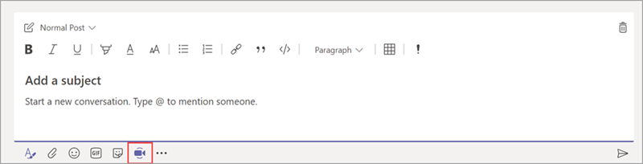
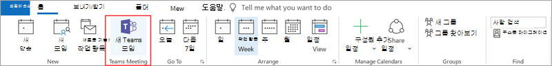
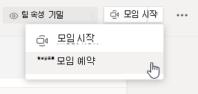
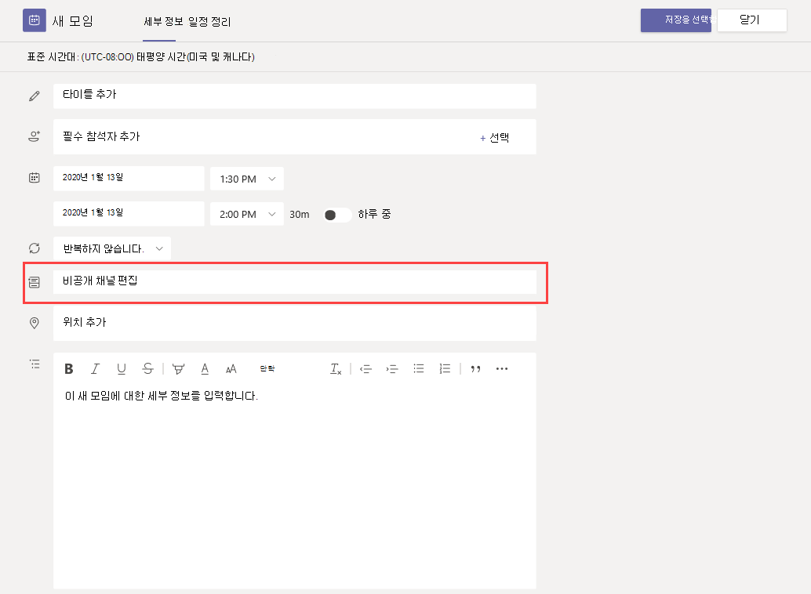
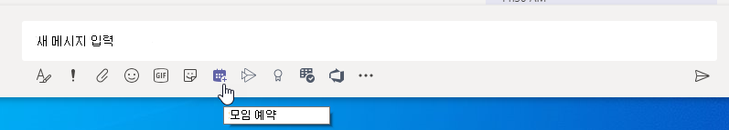
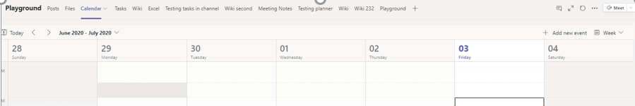
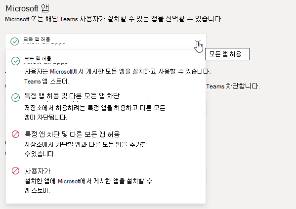
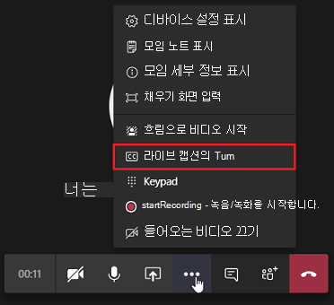
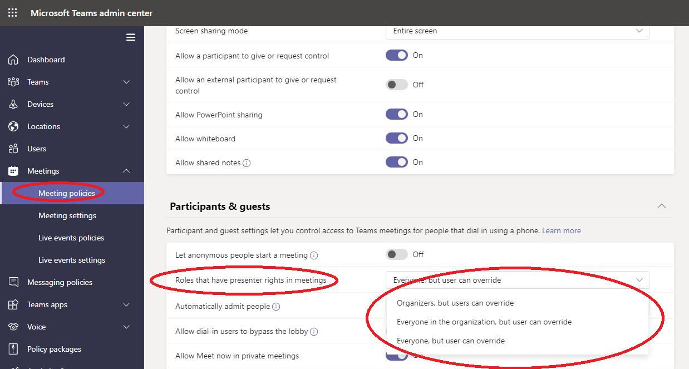

# Teams에서 모임 정책 관리Manage meeting policies in Teams

::: zone target="docs"
모임 정책은 조직에서 사용자가 예약한 모임 참가자가 사용할 수 있는 기능을 제어하는 데 사용됩니다.Meeting policies are used to control the features that are available to meeting participants for meetings that are scheduled by users in your organization. 자동으로 생성되거나 사용자 지정 정책을 만들고 할당하는 전역(전체 기본) 정책을 사용할 수 있습니다.You can use the global (Org-wide default) policy that's automatically created or create and assign custom policies. Microsoft Teams 관리 센터에서 또는 [PowerShell을](teams-powershell-overview.md)사용하여 모임 정책을 관리합니다.You manage meeting policies in the Microsoft Teams admin center or by using [PowerShell](teams-powershell-overview.md).

> [!NOTE]
> 역할을 사용하여 모임 발표자 및 참석자 권한을 관리하는 자세한 내용은 Teams 모임의 역할을 [참조하세요.](https://support.microsoft.com/office/roles-in-a-teams-meeting-c16fa7d0-1666-4dde-8686-0a0bfe16e019?ui=en-us&rs=en-us&ad=us)For information about using roles to manage the permissions of meeting presenters and attendees, see [Roles in a Teams meeting](https://support.microsoft.com/office/roles-in-a-teams-meeting-c16fa7d0-1666-4dde-8686-0a0bfe16e019?ui=en-us&rs=en-us&ad=us).

다음과 같은 방법으로 정책을 구현할 수 있습니다. 이 정책은 모임이 시작되기 전, 모임 중 또는 모임 후에 사용자의 모임 경험에 영향을 미치게 됩니다.You can implement policies in the following ways, which affect the meeting experience for users before a meeting starts, during a meeting, or after a meeting.

|구현 유형Implementation type  |설명Description  |
|---------|---------|
|이끌이당Per-organizer    |이끌이당 정책을 구현할 때 모든 모임 참가자는 이끌이의 정책을 상속합니다.When you implement a per-organizer policy, all meeting participants inherit the policy of the organizer. 예를 들어 **사용자를** 자동으로 인정하는 것은 이끌이 정책으로, 사용자가 직접 모임에 참가할지 아니면 정책이 할당된 사용자가 예약한 모임을 대기실에서 대기할지 여부를 제어합니다.For example, **Automatically admit people** is a per-organizer policy and controls whether users join the meeting directly or wait in the lobby for meetings scheduled by the user who is assigned the policy.          |
|사용자당Per-user    |사용자당 정책을 구현하는 경우 이끌이 및/또는 모임 참가자에 대한 특정 기능을 제한하기 위해 사용자당 정책만 적용됩니다.When you implement a per-user policy, only the per-user policy applies to restrict certain features for the organizer and/or meeting participants. 예를 들어 **채널에서 지금 Meet 허용은** 사용자당 정책입니다.For example, **Allow Meet now in channels** is a per-user policy.     |
|이끌이 및 사용자당Per-organizer and per-user     |이끌이 및 사용자당 정책의 조합을 구현할 때 특정 기능은 해당 정책 및 이끌이의 정책에 따라 모임 참가자에 대해 제한됩니다.When you implement a combination of a per-organizer and per-user policy, certain features are restricted for meeting participants based on their policy and the organizer's policy. 예를 들어 클라우드 **기록 허용은** 이끌이 및 사용자당 정책입니다.For example, **Allow cloud recording** is a per-organizer and per-user policy. 사용자가 녹음/녹화를 시작하고 중지할 수 있도록 이 설정을 켜면 됩니다.Turn on this setting to allow users to start and stop a recording.

전역 정책에서 설정을 편집하거나 하나 이상의 사용자 지정 정책을 만들고 할당할 수 있습니다.You can edit the settings in the global policy or create and assign one or more custom policies. 사용자 지정 정책을 만들고 할당하지 않는 한 사용자는 전역 정책을 얻게 됩니다.Users will get the global policy unless you create and assign a custom policy.

> [!NOTE]
> 사용자가 오디오 회의 라이선스를 사용하도록 설정하거나 사용자가 오디오 회의를 허용하는 경우 모임 세부 정보 단추를 사용할 수 있습니다. 그렇지 않은 경우 모임 세부 정보를 사용할 수 없습니다.Meeting details button will be available if a user has the audio conference licenses enabled or the user is allow for audio conferencing, if not, the meeting details will not be available.

## 사용자 지정 모임 정책 만들기Create a custom meeting policy

1. Microsoft Teams 관리 센터의 왼쪽 탐색 모음에서 모임 모임  >  **정책으로 이동하세요.**In the left navigation of the Microsoft Teams admin center, go to **Meetings** > **Meeting policies**.
2. **추가** 를 선택합니다.Select **Add**.
3. 정책의 이름과 설명을 입력합니다.Enter a name and description for the policy. 이름은 특수 문자가 포함될 수 없으며 64자를 초과할 수 없습니다.The name can't contain special characters or be longer than 64 characters.
4. 원하는 설정을 선택합니다.Choose the settings that you want.
5. 저장을 **선택합니다.**Select **Save**.

예를 들어, 사용자 수가 많은데 모임에 필요한 대역폭의 양을 제한하려고 한다고 가정해 보겠습니다.For example, say you have a bunch of users and you want to limit the amount of bandwidth that their meeting would require. "제한된 대역폭"이라는 새 사용자 지정 정책을 만들고 다음 설정을 사용하지 않도록 설정합니다.You would create a new custom policy named "Limited bandwidth" and disable the following settings:

**오디오 및 비디오** 에서:Under **Audio & video**:

- 클라우드 녹음/녹화 허용을 끕니다.Turn off Allow cloud recording.
- IP 비디오 허용을 끕니다.Turn off Allow IP video.

**콘텐츠 공유** 에서:Under **Content sharing**:

- 화면 공유 모드를 사용하지 않도록 설정합니다.Disable screen sharing mode.
- 화이트보드 허용을 끕니다.Turn off Allow whiteboard.
- 공유 노트 허용을 끕니다.Turn off Allow shared notes.

그 다음 사용자에게 정책을 할당합니다.Then assign the policy to the users.

## 모임 정책 편집Edit a meeting policy

전역 정책 및 만드는 모든 사용자 지정 정책을 편집할 수 있습니다.You can edit the global policy and any custom policies that you create.

1. Microsoft Teams 관리 센터의 왼쪽 탐색 모음에서 모임 모임  >  **정책으로 이동하세요.**In the left navigation of the Microsoft Teams admin center, go to **Meetings** > **Meeting policies**.
2. 정책 이름 왼쪽을 클릭하여 정책을 선택한 다음 편집을 **선택합니다.**Select the policy by clicking to the left of the policy name, and then select **Edit**.
3. 여기서 원하는 내용을 변경합니다.From here, make the changes that you want.
4. 저장을 **선택합니다.**Select **Save**.

> [!NOTE]
> 한 번의 모임 정책만 사용자에게 할당할 수 있습니다.A user can be assigned only one meeting policy at a time.

## 사용자에게 모임 정책 할당Assign a meeting policy to users

[!INCLUDE [assign-policy](includes/assign-policy.md)]

> [!NOTE]
> 사용자가 할당된 경우 정책을 삭제할 수 없습니다.You can't delete a policy if users are assigned to it. 먼저 영향을 받는 모든 사용자에게 다른 정책을 할당한 다음 원래 정책을 삭제할 수 있습니다.You must first assign a different policy to all affected users, and then you can delete the original policy.

## 모임 정책 설정Meeting policy settings

모임 정책 페이지에서 기존  정책을 선택하거나  추가를 선택하여 새 정책을 추가하는 경우 다음에 대한 설정을 구성할 수 있습니다.When you select an existing policy on the **Meeting policies** page or select **Add** to add a new policy, you can configure settings for the following.

- [일반General](#meeting-policy-settings---general)
- [오디오 & 비디오Audio & video](#meeting-policy-settings---audio--video)
- [콘텐츠 공유Content sharing](#meeting-policy-settings---content-sharing)
- [게스트를 & 참가자Participants & guests](#meeting-policy-settings---participants--guests)

::: zone-end

## 모임 정책 설정 - 일반Meeting policy settings - General

- [채널에서 지금 만나기 허용Allow Meet now in channels](#allow-meet-now-in-channels)
- [Outlook 추가 기능 허용Allow the Outlook add-in](#allow-the-outlook-add-in)
- [채널 모임 참석 허용Allow channel meeting scheduling](#allow-channel-meeting-scheduling)
- [비공개 모임을 허용합니다.Allow scheduling private meetings](#allow-scheduling-private-meetings)
- [비공개 모임에서 모임 허용Allow Meet now in private meetings](#allow-meet-now-in-private-meetings)

### 채널에서 지금 만나기 허용Allow Meet now in channels

모임 **허용은** 사용자당 정책으로, 모임이 시작되기 전에 적용됩니다.Allow **Meet now** is a per-user policy and applies before a meeting starts. 이 설정은 사용자가 Teams 채널에서 계획되지 않은 모임을 시작할 수 있는지 여부를 제어합니다.This setting controls whether a user can start an unplanned meeting in a Teams channel. 이 설정을 켜면 사용자는 모임  단추를 선택하여 계획되지 않은 모임을 시작하거나 채널에서 모임을 예약할 수 있습니다.If you turn on this setting, users can select the **Meet** button to start an unplanned meeting or schedule a meeting in the channel. 기본값은 True입니다.The default value is True.

### Outlook 추가 기능 허용Allow the Outlook add-in

이는 사용자당 정책으로, 모임이 시작되기 전에 적용됩니다.This is a per-user policy and applies before a meeting starts. 이 설정은 Outlook(Windows, Mac, 웹 및 모바일) 내에서 Teams 모임을 예약할 수 있는지 여부를 제어합니다.This setting controls whether Teams meetings can be scheduled from within Outlook (Windows, Mac, web, and mobile).

이 기능을 해제하면 사용자가 예약할 수 없습니다.If you turn this off, users are unable to schedule. Outlook에서 새 모임을 만들 때 Teams 모임을 만들 수 있습니다.Teams meetings when they create a new meeting in Outlook. 예를 들어 Windows용 Outlook에서는 새 **Teams** 모임 옵션이 리본에 표시되지 않습니다.For example, in Outlook on Windows, the **New Teams Meeting** option won't show up in the ribbon.

### 채널 모임 참석 허용Allow channel meeting scheduling

기존 AllowChannelMeetingScheduling 정책을 사용하여 팀 채널 일정에서 만들 수 있는 이벤트 유형을 제어합니다.Use the existing AllowChannelMeetingScheduling policy to control the types of events that can be created on the team channel calendars. 이는 사용자당 정책으로, 모임이 시작되기 전에 적용됩니다.This is a per-user policy and applies before a meeting starts. 이 설정은 사용자가 Teams 채널에서 모임을 예약할 수 있는지 여부를 제어합니다.This setting controls whether users can schedule a meeting in a Teams channel. 기본적으로 이 설정은 켜져 있습니다.By default, this setting is turned on.

이 정책이 해제되어 있는 경우 사용자는 새 채널 모임을 만들 수 없습니다.If this policy is turned off, users won't be able to create new channel meetings. 그러나 이벤트 이끌이가 기존 채널 모임을 편집할 수 있습니다.However, existing channel meetings can be edited by the organizer of the event.

모임 예약이 비활성화됩니다.Schedule a meeting will be disabled.

 

채널 선택이 비활성화되어 있습니다.Channel selection is disabled.

채널 게시물 페이지에서 다음 기능이 비활성화됩니다.In the channel posts page, the following features will be disabled:

- **채널 회신** 작성 상자의 모임 예약 단추**Schedule a meeting** button on the channel reply compose box.
  
  
- **채널 헤더의** 모임 예약 단추**Schedule a meeting** button on the channel header.
  

채널 일정에서:In the channel calendar:

- **채널 일정 헤더에** 새 이벤트 추가 단추가 비활성화됩니다.**Add new event** button on channel calendar header will be disabled.
  

- 사용자는 채널 일정에서 시간 블록을 끌어서 선택하여 채널 모임을 만들 수 없습니다.Users won't be able to drag and select a time block on the channel calendar to create a channel meeting.

- 사용자는 바로 가기 키를 사용하여 채널 일정에서 모임을 만들 수 없습니다.Users can't use Keyboard shortcuts to create a meeting on the channel calendar.

관리 센터에서:In the admin center:

채널 일정 앱은 앱 사용 권한 정책 페이지의 **Microsoft** 앱 섹션에 표시됩니다.The channel calendar app will show up in the **Microsoft apps** section on the app permission policies page.

 

### 비공개 모임을 허용합니다.Allow scheduling private meetings

이는 사용자당 정책으로, 모임이 시작되기 전에 적용됩니다.This is a per-user policy and applies before a meeting starts. 이 설정은 사용자가 Teams에서 비공개 모임을 예약할 수 있는지 여부를 제어합니다.This setting controls whether users can schedule private meetings in Teams. 모임은 팀의 채널에 게시되지 않은 경우 비공개입니다.A meeting is private when it's not published to a channel in a team.

비공개 모임 예약  및 채널 **모임** 예약 허용을 해제하면 Teams의 사용자에  대해 필요한 참석자  추가 및 채널 추가 옵션이 비활성화됩니다.Note that if you turn off **Allow scheduling private meetings** and **Allow channel meeting scheduling**,  the **Add required attendees** and **Add channel** options are disabled for users in Teams. 기본적으로 이 설정은 켜져 있습니다.By default, this setting is turned on.

### 비공개 모임에서 모임 허용Allow Meet now in private meetings

이는 사용자당 정책으로, 모임이 시작되기 전에 적용됩니다.This is a per-user policy and applies before a meeting starts. 이 설정은 사용자가 계획되지 않은 비공개 모임을 시작할 수 있는지 여부를 제어합니다.This setting controls whether a user can start an unplanned private meeting.  기본적으로 이 설정은 켜져 있습니다.By default, this setting is turned on.

## 모임 정책 설정 - 오디오 & 비디오Meeting policy settings - Audio & video

- [전사 허용Allow transcription](#allow-transcription)
- [클라우드 녹음/녹화 허용Allow cloud recording](#allow-cloud-recording)
- [IP 오디오 모드Mode for IP audio](#mode-for-ip-audio)
- [IP 비디오 모드Mode for IP video](#mode-for-ip-video)
- [IP 비디오 허용Allow IP video](#allow-ip-video)
- [미디어 비트 속도(KBS)Media bit rate (Kbs)](#media-bit-rate-kbs)

### 전사 허용Allow transcription

이끌이 및 사용자당 정책의 조합입니다.This is a combination of a per-organizer and per-user policy. 이 설정은 모임 녹화를 재생하는 동안 캡션 및 전사 기능을 사용할 수 있는지 여부를 제어합니다.This setting controls whether captions and transcription features are available during playback of meeting recordings. 이 기능을 해제하면  모임 녹화를 재생하는 동안 검색 및 **CC** 옵션을 사용할 수 없습니다.If you turn this off, the **Search** and **CC** options won't be available during playback of a meeting recording. 기록을 시작한 사람은 기록도 포함하기 위해 이 설정을 켜야 합니다.The person who started the recording needs this setting turned on so that the recording also includes transcription.

기록된 모임에 대한 전사는 현재 Teams의 언어가 영어로 설정된 사용자와 모임에서 영어를 사용할 때만 지원됩니다.Note that transcription for recorded meetings is currently only supported for users who have the language in Teams set to English and when English is spoken in the meeting.

### 클라우드 녹음/녹화 허용Allow cloud recording

이 정책은 사용자당 정책에서 제어됩니다.This is controlled at a per-user policy. 이 설정은 사용자가 기록할 수 있는지 여부를 제어합니다.This setting controls whether a user can record. 특정 정책 설정이 켜져 있으며 이끌이와 동일한 조직의 인증된 사용자인 경우 모임 이끌이 또는 다른 모임 참가자가 기록을 시작할 수 있습니다.The recording can be started by the meeting organizer or by another meeting participant if their specific policy setting is turned on and if they're an authenticated user from the same organization as the organizer.

페더러드 및 익명 사용자와 같은 조직 외부의 사용자는 기록을 시작할 수 없습니다.People outside your organization, such as federated and anonymous users, can't start the recording. 게스트 사용자는 기록을 시작하거나 중지할 수 없습니다.Guest users can't start or stop the recording.

다음 예제를 살펴보겠습니다.Let's look at the following example.

|사용자User |모임 정책Meeting policy  |클라우드 녹음/녹화 허용Allow cloud recording |
|---------|---------|---------|
|DanielaDaniela | 전역Global   | 끄기Off |
|아만다Amanda | Location1MeetingPolicyLocation1MeetingPolicy | OnOn|
|John(외부 사용자)John (external user) | 해당 사항 없음Not applicable | 해당 사항 없음Not applicable|

Daniela는 이끌이인 경우에도 정책이 꺼지기 때문에 기록할 수 없습니다.Daniela, even if she were the organizer cannot record because her policy is set to off. 정책 설정을 사용하도록 설정한 Amanda는 Daniela가 구성한 모임도 녹화할 수 있습니다.Amanda, who has the policy setting enabled, can record meetings even those organized by Daniela. Amanda가 모임을 구성하는 경우 이 모임을 기록할 수 있습니다. 그러나 정책 설정을 사용할 수 없는 Daniela와 외부 사용자인 John은 해당 모임을 기록할 수 없습니다.If Amanda were to organize a meeting, she will be able to record that meeting, however,  Daniela, who has the policy setting disabled and John who is an external user, can not record that meeting.

클라우드 모임 녹화에 대한 자세한 내용은 Teams 클라우드 모임 [녹화를 참조합니다.](cloud-recording.md)To learn more about cloud meeting recording, see [Teams cloud meeting recording](cloud-recording.md).

### IP 오디오 모드Mode for IP audio

사용자당 정책입니다.This is a per-user policy. 이 설정은 모임 및 그룹 통화에서 오디오를 설정할 수 있는지 여부를 제어합니다.This setting controls whether audio can be turned on in meetings and group calls. 이 설정에 대한 값은 다음과 같습니다.Here are the values for this setting.

|값 설정Setting value |동작Behavior  |
|---------|---------|
|**수신 오디오 및 수신 오디오 사용****Outgoing and incoming audio enabled**    |모임에서 유출 및 수신 오디오가 허용됩니다.Outgoing and incoming audio is allowed in the meeting. 기본 설정입니다.This is the default setting. |
|**사용 안****Disabled**     |모임에서 걸고 받는 오디오가 꺼져 있습니다.Outgoing and incoming audio is turned off in the meeting.     |

사용자에 대해 **사용** 안 하도록 설정한 경우 해당 사용자는 모임을 예약하고 구성할 수 있지만 오디오를 사용할 수 없습니다.If set to **Disabled** for a user, that user can still schedule and organize meetings but they can't use audio. 모임에 참가하기 위해 PSTN(공용 전화망)을 통해 전화를 걸거나 모임에 전화를 걸고 전화로 참가해야 합니다.To join a meeting, they have to dial in through the Public Switched Telephone Network (PSTN) or have the meeting call and join them by phone. 정책이 할당되지 않은 모임 참가자(예: 익명 참가자)는 이 설정을 기본적으로 수신 및 수신 오디오로 **설정합니다.**Meeting participants who don't have any policies assigned (for example, anonymous participants) have this set to **Outgoing and incoming audio enabled** by default. Teams 모바일 클라이언트에서 이 설정을 사용하지 않도록 설정한 경우 사용자는 PSTN을 통해 모임에 전화 접속해야 합니다.On Teams mobile clients, if this setting is disabled, the user has to dial in to the meeting through the PSTN.

이 설정은 1:1 호출에 적용되지 않습니다.This setting doesn't apply to 1:1 calls. 1:1 통화를 제한하기 위해 [Teams](teams-calling-policy.md) 통화 정책을 구성하고 비공개 통화 설정 기능을 **해제합니다.**To restrict 1:1 calls, configure a Teams [calling policy](teams-calling-policy.md) and turn off the **Make private calls** setting. 이 설정은 Surface Hub 및 Microsoft Teams Room 장치와 같은 회의실 장치에도 적용되지 않습니다.This setting also doesn't apply to conference room devices such as Surface Hub and Microsoft Teams Rooms devices.

이 설정은 Microsoft 365 GCC(Government Community Cloud), GCC High 또는 DoD(국방부) 환경에서는 아직 사용할 수 없습니다.This setting isn't yet available for Microsoft 365 Government Community Cloud (GCC), GCC High, or Department of Defense (DoD) environments.

자세한 내용은 모임 [참가자에 대한 오디오/비디오 관리를 참조합니다.](#manage-audiovideo-for-meeting-participants)To learn more, see [Manage audio/video for meeting participants](#manage-audiovideo-for-meeting-participants).

### IP 비디오 모드Mode for IP video

사용자당 정책입니다.This is a per-user policy. 이 설정은 모임 및 그룹 통화에서 비디오를 설정할 수 있는지 여부를 제어합니다.This setting controls whether video can be turned on in meetings and group calls. 이 설정에 대한 값은 다음과 같습니다.Here are the values for this setting.

|값 설정Setting value |동작Behavior  |
|---------|---------|
|**유출 및 수신 비디오 사용****Outgoing and incoming video enabled**    | 모임에서 유출 및 수신 비디오가 허용됩니다.Outgoing and incoming video is allowed in the meeting. 기본 설정입니다.This is the default setting. |
|**사용 안****Disabled**     | 모임에서 유출 및 수신 비디오가 꺼져 있습니다.Outgoing and incoming video is turned off in the meeting. Teams 모바일 클라이언트에서는 사용자가 모임의 비디오 또는 사진을 공유할 수 없습니다.On Teams mobile clients, users can't share videos or photos in the meeting.   IP 오디오 **모드가 비활성화된** 경우 **IP** 비디오 모드도 비활성화된 상태로 유지됩니다.Note that if **Mode for IP audio** is disabled, then **Mode for IP video** will also remain disabled.  |

사용자에 대해 **사용** 안 하도록 설정한 경우 해당 사용자는 비디오를 켜거나 다른 모임 참가자가 공유한 비디오를 볼 수 없습니다.If set to **Disabled** for a  user, that user can't turn on video or view videos shared by other meeting participants. 정책이 할당되지 않은 모임 참가자(예: 익명 참가자)는 이 설정을 기본적으로 수신 및 수신 비디오로 **설정합니다.**Meeting participants who don't have any policies assigned (for example, anonymous participants) have this set to **Outgoing and incoming video enabled** by default.

이 설정은 Surface Hub 및 Microsoft Teams Room 장치와 같은 회의실 장치에는 적용되지 않습니다.This setting doesn't apply to conference room devices such as Surface Hub and Microsoft Teams Rooms devices.

이 설정은 Microsoft 365 GCC(Government Community Cloud), GCC High 또는 DoD(국방부) 환경에서는 아직 사용할 수 없습니다.This setting isn't yet available for Microsoft 365 Government Community Cloud (GCC), GCC High, or Department of Defense (DoD) environments.

> [!NOTE]
> 이 설정은 내보이는 비디오와 들어오는 비디오를 제어하는 반면 **IP** 비디오 허용 설정은 진행하는 비디오를 제어합니다.Keep in mind that this setting controls both outgoing and incoming video whereas the **Allow IP video** setting controls outgoing video. 자세한 내용은 어떤 IP 비디오 정책 설정이 [우선하나요?](#which-ip-video-policy-setting-takes-precedence) 및 모임 참가자를 위한 [오디오/비디오 관리를 참조하세요.](#manage-audiovideo-for-meeting-participants)To learn more, see [Which IP video policy setting takes precedence?](#which-ip-video-policy-setting-takes-precedence) and [Manage audio/video for meeting participants](#manage-audiovideo-for-meeting-participants).

자세한 내용은 모임 [참가자에 대한 오디오/비디오 관리를 참조합니다.](#manage-audiovideo-for-meeting-participants)To learn more, see [Manage audio/video for meeting participants](#manage-audiovideo-for-meeting-participants).

### IP 비디오 허용Allow IP video

이끌이 및 사용자당 정책의 조합입니다.This is a combination of a per-organizer and per-user policy. 비디오는 모임의 핵심 구성 요소입니다.Video is a key component to meetings. 일부 조직에서는 관리자가 비디오가 있는 사용자의 모임에 대한 제어를 더 많이 원할 수 있습니다.In some organizations, admins might want more control over which users' meetings have video. 이 설정은 사용자가 호스트하는 모임 및 사용자가 시작한 1:1 및 그룹 통화에서 비디오를 설정할 수 있는지 여부를 제어합니다.This setting controls whether video can be turned on in meetings hosted by a user and in 1:1 and group calls started by a user. Teams 모바일 클라이언트에서 이 설정은 사용자가 모임에서 사진과 비디오를 공유할 수 있는지 여부를 제어합니다.On Teams mobile clients, this setting control whether users can share photos and videos in a meeting.

이 정책 설정을 사용하도록 설정한 사용자가 구성한 모임은 모임 참가자가 정책 설정도 사용하도록 설정한 경우 모임 참가자가 모임에서 비디오 공유를 허용합니다.Meetings organized by a user who has this policy setting enabled, allow video sharing in the meeting by the meeting participants, if the participants also have the policy setting enabled. 정책이 할당되지 않은 모임 참가자(예: 익명 및 페더러드 참가자)는 모임 이끌이의 정책을 상속합니다.Meeting participants who don't have any policies assigned (for example, anonymous and federated participants) inherit the policy of the meeting organizer.

> [!NOTE]
> 이 설정은 나선 비디오를 제어하는 반면 **IP** 비디오 설정 모드는 나선 비디오와 들어오는 비디오를 모두 제어합니다.Keep in mind that this setting controls outgoing video whereas the **Mode for IP video** setting controls both outgoing and incoming video. 자세한 내용은 어떤 IP 비디오 정책 설정이 [우선하나요?](#which-ip-video-policy-setting-takes-precedence) 및 모임 참가자를 위한 [오디오/비디오 관리를 참조하세요.](#manage-audiovideo-for-meeting-participants)To learn more, see [Which IP video policy setting takes precedence?](#which-ip-video-policy-setting-takes-precedence) and [Manage audio/video for meeting participants](#manage-audiovideo-for-meeting-participants).

| Teams 데스크톱 및 웹 클라이언트Teams desktop and web client |Teams 모바일 클라이언트Teams mobile client  |
|:-------:|:-------:|
|    |          |

다음 예제를 살펴보겠습니다.Let's look at the following example.

|사용자User |모임 정책Meeting policy  |IP 비디오 허용Allow IP video |
|---------|---------|---------|
|DanielaDaniela   | 전역Global   | OnOn       |
|아만다Amanda    | Location1MeetingPolicyLocation1MeetingPolicy        | 끄기Off      |

Daniela가 주최하는 모임에서는 비디오를 하도록 허용합니다.Meetings hosted by Daniela allow video to be turned on. Daniela는 모임에 참가하고 비디오를 끄는 데 사용할 수 있습니다.Daniela can join the meeting and turn on video. Amanda의 정책이 비디오를 허용하지 않는 것으로 설정되어 있기 때문에 Daniela의 모임에서 Amanda는 비디오를 설정할 수 없습니다.Amanda can't turn on video in Daniela's meeting because Amanda's policy is set to not allow video. Amanda는 모임의 다른 참가자가 공유한 비디오를 볼 수 있습니다.Amanda can see videos shared by other participants in the meeting.

Amanda가 호스트하는 모임에서는 할당된 비디오 정책에 관계없이 아무도 비디오를 끄지 않습니다.In meetings hosted by Amanda, no one can turn on video, regardless of the video policy assigned to them. 즉, Daniela는 Amanda의 모임에서 비디오를 끄지 못합니다.This means Daniela can't turn on video in Amanda's meetings.  

Daniela가 비디오로 Amanda를 호출하면 Amanda는 오디오로만 통화에 응답할 수 있습니다.If Daniela calls Amanda with video on, Amanda can answer the call with audio only.  통화가 연결되면 Amanda에서 Daniela의 비디오를 볼 수 있지만 비디오를 켜지 못합니다.When the call is connected, Amanda can see Daniela's video, but can't turn on video. Amanda가 Daniela를 호출하면 Daniela는 비디오 및 오디오로 통화에 응답할 수 있습니다.If Amanda calls Daniela, Daniela can answer the call with video and audio. 통화가 연결되면 Daniela는 필요한 경우 자신의 비디오를 설정하거나 해제할 수 있습니다.When the call is connected, Daniela can turn on or turn off her video, as needed.

자세한 내용은 모임 [참가자에 대한 오디오/비디오 관리를 참조합니다.](#manage-audiovideo-for-meeting-participants)To learn more, see [Manage audio/video for meeting participants](#manage-audiovideo-for-meeting-participants).

#### 우선적으로 적용되는 IP 비디오 정책 설정Which IP video policy setting takes precedence

사용자의 경우 비디오에 대한 가장 제한적인 정책 설정이 우선합니다.For a user, the most restrictive policy setting for video takes precedence. 다음은 몇 가지 예입니다.Here's some examples.

|IP 비디오 허용Allow IP video|IP 비디오 모드Mode for IP video|모임 환경Meeting experience|
|---------|---------|---------|
|이끌이: Organizer: **On**  참가자: Participant: **On** |참가자: **사용 안**Participant: **Disabled**        |**IP 비디오 설정에 대한 모드가** 우선합니다.The **Mode for IP video** setting takes precedence. 이 정책이 할당된 참가자는 다른 사람이 공유한 비디오를 켜거나 볼 수 없습니다.The participant who is assigned this policy can't turn on or view videos shared by others.|
|이끌이: Organizer: **On**  참가자: Participant: **On** |참가자: **유출 및 수신 비디오 사용**Participant: **Outgoing and incoming video enabled**          |이 정책이 할당된 참가자는 다른 사람이 공유한 비디오를 켜거나 볼 수 있습니다.The participant who is assigned this policy can turn on or view videos shared by others.         |
|이끌이: Organizer: **On**  참가자: **끄기**Participant: **Off** |참가자: **유출 및 수신 비디오 사용**Participant: **Outgoing and incoming video enabled**         |IP **비디오 허용 설정이** 우선합니다.The **Allow IP video** setting takes precedence. 참가자는 들어오는 비디오만 볼 수 있으며 보내는 비디오를 보낼 수 없습니다.Participants can only see incoming video and can't send outgoing video.         |
|이끌이: Organizer: **On**  참가자: **끄기**Participant: **Off** |참가자: **사용 안**Participant: **Disabled**         |**IP 비디오 설정에 대한 모드가** 우선합니다.The **Mode for IP video** setting takes precedence. 참가자가 수신 또는 유출 비디오를 볼 수 없는 경우The participant can't see incoming or outgoing video.|
|이끌이: **끄기**Organizer: **Off**    |       |IP **비디오** 허용 설정이 이끌이에 대해 꺼져 있기 때문에 우선적으로 적용됩니다.The **Allow IP video** setting takes precedence because it's turned off for the organizer. 이 정책이 할당된 사용자가 구성한 모임에서 비디오를 끄는 사용자는 없습니다.No one can turn on video in meetings organized by the user who is assigned this policy.         |

### 모임 참가자를 위한 오디오/비디오 관리Manage audio/video for meeting participants

|원하는 경우...If you want to...  |다음 정책 설정 설정Set the following policy settings  |
|---------|---------|
|모임 참가자의 오디오 및 비디오 사용 안Disable audio and video for participants in meetings  |IP 오디오 모드: **사용 안**Mode for IP audio: **Disabled**  IP 비디오 모드: **사용 안**Mode for IP video: **Disabled** IP 비디오 허용: N/AAllow IP video: N/A       |
|모임 참가자에 대해 들어오는 비디오 및 오디오만 사용하도록 설정Enable only incoming video and audio for participants in meetings  |IP 오디오 모드: **내보내기** 및 수신 오디오 사용Mode for IP audio: **Outgoing and incoming audio enabled**  IP 비디오 모드: **유출 및** 수신 비디오 사용Mode for IP video: **Outgoing and incoming video enabled** IP 비디오 허용: **끄기**Allow IP video: **Off**       |
|모임 참가자에 대한 비디오 사용 안 하게 설정(참가자는 오디오만 사용)Disable video for participants in meetings (participants have audio only)|  IP 오디오 모드: **내보내기 및** 들어오는 오디오 사용Mode for IP audio: **Enable outgoing and incoming audio**  IP 비디오 모드: **사용 안**Mode for IP video: **Disabled** IP 비디오 허용: N/AAllow IP video: N/A
|모임 참가자에 대한 오디오 및 비디오 사용Enable audio and video for participants in meetings    |IP 오디오 모드: 수신 및 수신 **오디오** 사용(기본값)Mode for IP audio: **Outgoing and incoming audio enabled** (default)  IP 비디오 모드: 유출 및 들어오는 **비디오 사용(기본값)**Mode for IP video: **Outgoing and incoming video enabled** (default) IP 비디오  허용: 설정(기본값)Allow IP video: **On** (default)    |

모임 이끌이의 정책과 사용자의 정책 간에 가장 제한적인 정책이 적용됩니다.The most restrictive policy between the meeting organizer’s policy and the user’s policy applies. 예를 들어 이끌이에게 비디오를 제한하는 정책이 있으며 사용자의 정책이 비디오를 제한하지 않는 경우 모임 참가자는 모임 이끌이의 정책을 상속받고 모임의 비디오에 액세스할 수 없습니다.For example, if an organizer has a policy that restricts video and a user’s policy doesn't restrict video, meeting participants inherit the policy of the meeting organizer and don't have access to video in meetings. 즉, 오디오로만 모임에 참가할 수 있습니다.This means that they can join the meeting with audio only.

> [!NOTE]
> 사용자가 전화로 참가하기 위한 그룹 통화를 시작하면 오디오 화면에 휴대폰 사용이 나타나지 않습니다. When a user starts a group call to join by phone, the **Use phone for audio** screen doesn't appear. 이 문제는 해결하기 위해 작업하고 있는 알려진 문제입니다.This is a known issue that we're working to resolve. 이 문제를 해결하려면 기타 조인 옵션에서 전화 **오디오를** **선택합니다.**To work around this issue, select **Phone audio** under **Other join options**.  

#### Teams 모바일 클라이언트Teams mobile clients

Teams 모바일 클라이언트의 사용자의 경우 모임 중에 사진 및 비디오를 공유하는 능력도 IP 비디오 또는 **IP** 비디오 모드 허용 설정에 **따라 결정됩니다.**For users on Teams mobile clients, the ability to share photos and videos during a meeting is also determined by the **Allow IP video** or **IP video mode** setting. 어떤 정책 설정이 우선적으로 적용될지에 따라 비디오 및 사진을 공유하는 기능을 사용할 수 없습니다.Depending on which policy setting takes precedence, the ability to share videos and photos won't be available. 별도의 화면 공유 모드 설정을 사용하여 구성하는 화면 공유에는 [영향을 주지](#screen-sharing-mode) 않습니다.This doesn't affect screen sharing, which you configure using a separate [Screen sharing mode](#screen-sharing-mode) setting. 또한 모바일 사용자가 셀룰러 연결을 통해 IP 비디오를 사용하지 못하게 하는 [Teams](https://docs.microsoft.com/powershell/module/skype/new-csteamsmobilitypolicy) 모바일 정책을 설정할 수 있습니다. 즉, WiFi 연결을 사용해야 합니다.Additionally, you can set a [Teams mobility policy](https://docs.microsoft.com/powershell/module/skype/new-csteamsmobilitypolicy) to prevent mobile users from using IP video over a cellular connection, which means they must use a WiFi connection.

### 미디어 비트 속도(KBS)Media bit rate (Kbs)

사용자당 정책입니다.This is a per-user policy. 이 설정은 사용자의 통화 및 모임에서 오디오, 비디오 및 비디오 기반 앱 공유 전송에 대한 미디어 비트 전송률을 결정합니다.This setting determines the media bit rate for audio, video, and video-based app sharing transmissions in calls and meetings for the user. 통화 또는 모임의 사용자에 대한 업링크 및 다운링크 미디어 트래버스 모두에 적용됩니다.It's applied to both the uplink and downlink media traversal for users in the call or meeting. 이 설정은 조직의 대역폭 관리를 세밀하게 제어할 수 있습니다.This setting gives you granular control over managing bandwidth in your organization. 사용자가 요구하는 모임 시나리오에 따라 양호한 품질 환경을 위해 충분한 대역폭을 사용하는 것이 좋습니다.Depending on the meetings scenarios required by users, we recommend having enough bandwidth in place for a good quality experience. 최소값은 30 Kbps로, 최대값은 모임 시나리오에 따라 다릅니다.The minimum value is 30 Kbps and the maximum value depends on the meeting scenario. Teams에서 양질의 모임, 통화 및 라이브 이벤트에 권장되는 최소 대역폭에 대한 자세한 내용은 대역폭 요구 [사항을 참조하세요.](prepare-network.md#bandwidth-requirements)To learn more about the minimum recommended bandwidth for good quality meetings, calls, and live events in Teams, see [Bandwidth requirements](prepare-network.md#bandwidth-requirements).

모임에 대한 대역폭이 충분하지 않은 경우 참가자에게 네트워크 품질이 나쁨을 나타내는 메시지가 표시됩니다.If there isn't enough bandwidth for a meeting, participants see a message that indicates poor network quality.

최고 품질의 비디오 환경(예: CEO 보드 모임 및 Teams 라이브 이벤트)이 필요한 모임의 경우 대역폭을 10Mbps로 설정하는 것이 좋습니다.For meetings that need the highest-quality video experience, such as CEO board meetings and Teams live events, we recommend you set the bandwidth to 10 Mbps. 최대 환경을 설정한 경우에도 Teams 미디어 스택은 시나리오에 따라 특정 네트워크 조건이 감지될 때 낮은 대역폭 조건에 맞게 조정됩니다.Even when the maximum experience is set, the Teams media stack adapts to low-bandwidth conditions when certain network conditions are detected, depending on the scenario.

## 모임 정책 설정 - 콘텐츠 공유Meeting policy settings - Content sharing

- [화면 공유 모드Screen sharing mode](#screen-sharing-mode)
- [참가자가 제어권 제공 또는 요청 허용Allow a participant to give or request control](#allow-a-participant-to-give-or-request-control)
- [외부 참가자가 제어권 제공 또는 요청 허용Allow an external participant to give or request control](#allow-an-external-participant-to-give-or-request-control)
- [PowerPoint 공유 허용Allow PowerPoint sharing](#allow-powerpoint-sharing)
- [화이트보드 허용Allow whiteboard](#allow-whiteboard)
- [공유 노트 허용Allow shared notes](#allow-shared-notes)

### 화면 공유 모드Screen sharing mode

> [!NOTE]
> 이 기능은 아직 개발 중입니다.This feature is still in development. 화면 공유는 참가자당 정책입니다. 그러나 이 섹션에 설명된 바와 같이 이끌이의 화면 공유 설정에 의해 영향을 받을 수 있습니다.Screen sharing is a per-participant policy, however, it can be affected by the organizer's screen sharing settings, as described in this section.

이 설정은 데스크톱 및/또는 창 공유가 사용자의 모임에서 허용될지 여부를 제어합니다.This setting controls whether desktop and/or window sharing is allowed in the user's meeting. 정책이 할당되지 않은 모임 참가자(예: 익명, 게스트, B2B 및 페더러드 참가자)는 모임 이끌이의 정책을 상속합니다.Meeting participants who don't have any policies assigned (for example, anonymous, guest, B2B, and federated participants) inherit the policy of the meeting organizer.

|값 설정Setting value |동작Behavior  |
|---------|---------|
|**전체 화면****Entire screen**    | 모임에서 전체 데스크톱 공유 및 응용 프로그램 공유가 허용됩니다.Full desktop sharing and application sharing are allowed in the meeting |
|**단일 애플리케이션****Single application**   | 모임에서 응용 프로그램 공유가 허용됩니다.Application sharing is allowed in the meeting        |
|**사용 안****Disabled**     |모임에서 화면 공유 및 응용 프로그램 공유가 해제되어 있습니다.Screen sharing and application sharing turned off in the meeting.       |

다음 예제를 살펴보겠습니다.Let's look at the following example.

|사용자User |모임 정책Meeting policy |화면 공유 모드Screen sharing mode |
|---------|---------|---------|
|DanielaDaniela  | 전역Global   | 전체 화면Entire screen |
|아만다Amanda   | Location1MeetingPolicyLocation1MeetingPolicy  | 사용 안Disabled |

Daniela가 주최하는 모임을 통해 모임 참가자가 전체 화면 또는 특정 응용 프로그램을 공유할 수 있습니다.Meetings hosted by Daniela allow meeting participants to share their entire screen or a specific application. Amanda가 Daniela의 모임에 참가하는 경우 Amanda는 정책 설정이 비활성화되어 자신의 화면 또는 특정 응용 프로그램을 공유할 수 없습니다.If Amanda joins Daniela's meeting, Amanda can't share her screen or a specific application as her policy setting is disabled. Amanda에서 호스트하는 모임에서는 할당된 화면 공유 모드 정책에 관계없이 누구도 자신의 화면 또는 단일 응용 프로그램을 공유할 수 없습니다.In meetings hosted by Amanda, no one is allowed to share their screen or a single application, regardless of the screen sharing mode policy assigned to them. 즉, Daniela는 Amanda의 모임에서 자신의 화면 또는 단일 응용 프로그램을 공유할 수 없습니다.This means that Daniela can't share her screen or a single application in Amanda's meetings.  

현재 사용자는 Google Chrome을 사용하는 경우 Teams 모임에서 비디오를 재생하거나 화면을 공유할 수 없습니다.Currently, users can't play video or share their screen in a Teams meeting if they're using Google Chrome.

### 참가자가 제어권 제공 또는 요청 허용Allow a participant to give or request control

사용자당 정책입니다.This is a per-user policy. 이 설정은 사용자가 공유 데스크톱 또는 창을 다른 모임 참가자에게 제어할 수 있는지 여부를 제어합니다.This setting controls whether the user can give control of the shared desktop or window to other meeting participants. 제어권을 제공하기 위해 화면 위쪽을 마우스로 니다.To give control, hover over the top of the screen.

사용자에 대해 이 설정이 켜져 있는 경우 **제어권** 제공 옵션이 공유 세션의 위쪽 표시줄에 표시됩니다.If this setting is turned on for the user, the **Give Control** option is displayed in the top bar in a sharing session.

사용자에 대한 설정이 꺼져  있는 경우 제어권 제공 옵션을 사용할 수 없습니다.If the setting is turned off for the user, the **Give Control** option isn't available.

다음 예제를 살펴보겠습니다.Let's look at the following example.

|사용자User |모임 정책Meeting policy  |참가자가 제어권 제공 또는 요청 허용Allow participant to give or request control |
|---------|---------|---------|
|DanielaDaniela   | 전역Global   | OnOn       |
|바베크어Babek    | Location1MeetingPolicyLocation1MeetingPolicy        | 끄기Off   |

Daniela는 Babek가 구성한 모임의 다른 참가자에게 공유 데스크톱 또는 창을 제어할 수 있는 반면 Babek는 다른 참가자에게 제어를 줄 수 없습니다.Daniela can give control of the shared desktop or window to other participants in a meeting organized by Babek whereas Babek can't give control to other participants.

PowerShell을 사용하여 제어 요청을 제어하거나 수락할 수 있는 사용자 제어를 위해 AllowParticipantGiveRequestControl cmdlet을 사용 합니다.To use PowerShell to control who can give control or accept requests for control, use the AllowParticipantGiveRequestControl cmdlet.

> [!NOTE]
> 공유 중에 공유 콘텐츠를 제공하고 제어하려면 두 당사자 모두 Teams 데스크톱 클라이언트를 사용하고 있어야 합니다.To give and take control of shared content during sharing, both parties must be using the Teams desktop client. 컨트롤은 어느 쪽이든 브라우저에서 Teams를 실행 중인 경우 지원되지 않습니다.Control isn't supported when either party is running Teams in a browser. 이것은 해결하려고 하는 기술적 제한 때문입니다.This is due to a technical limitation that we're planning to fix.

### 외부 참가자가 제어권 제공 또는 요청 허용Allow an external participant to give or request control

사용자당 정책입니다.This is a per-user policy. 조직에서 사용자에 대해 이 설정이 설정되어 있는지 여부는 모임 이끌이가 설정한 일과 관계 없이 외부 참가자가 할 수 있는 작업을 제어하지 않습니다.Whether an organization has this set for a user doesn't control what external participants can do, regardless of what the meeting organizer has set. 이 매개 변수는 공유자가 조직의 모임 정책 내에서 설정한 값에 따라 외부 참가자에게 공유자 화면의 제어 또는 요청 제어를 부여할 수 있는지 여부를 제어합니다.This parameter controls whether external participants can be given control or request control of the sharer's screen, depending on what the sharer has set within their organization's meeting policies. Teams 모임의 외부 참가자는 다음과 같이 분류할 수 있습니다.External participants in Teams meetings can be categorized as follows:  

- 익명 사용자Anonymous user
- 게스트 사용자Guest users  
- B2B 사용자B2B user
- 페더리된 사용자Federated user  

페더링된 사용자가 공유하는 동안 외부 사용자에게 제어권  제공 여부는 외부 참가자가 조직에서 제어 설정을 제공하거나 요청할 수 있도록 허용합니다.Whether federated users can give control to external users while sharing is controlled by the **Allow an external participant to give or request control** setting in their organization.

PowerShell을 사용하여 외부 참가자가 제어를 위한 제어를 제공하거나 제어 요청을 수락할 수 있는지 여부를 제어하기 위해 AllowExternalParticipantGiveRequestControl cmdlet을 사용 합니다.To use PowerShell to control whether external participants can give control or accept requests for control, use the AllowExternalParticipantGiveRequestControl cmdlet.

### PowerPoint 공유 허용Allow PowerPoint sharing

사용자당 정책입니다.This is a per-user policy. 이 설정은 사용자가 모임에서 PowerPoint 슬라이드 데크를 공유할 수 있는지 여부를 제어합니다.This setting controls whether the user can share PowerPoint slide decks in a meeting. 익명, 게스트 및 페더러드 사용자를 포함한 외부 사용자는 모임 이끌이의 정책을 상속합니다.External users, including anonymous, guest, and federated users, inherit the policy of the meeting organizer.

다음 예제를 살펴보겠습니다.Let's look at the following example.

|사용자User |모임 정책Meeting policy  |PowerPoint 공유 허용Allow PowerPoint sharing |
|---------|---------|---------|
|DanielaDaniela   | 전역Global   | OnOn       |
|아만다Amanda   | Location1MeetingPolicyLocation1MeetingPolicy        | 끄기Off   |

Amanda는 모임 이끌이인 경우에도 모임에서 PowerPoint 슬라이드 데크를 공유할 수 없습니다.Amanda can't share PowerPoint slide decks in meetings even if she's the meeting organizer. Daniela는 모임이 Amanda에서 구성한 경우에도 PowerPoint 슬라이드 데크를 공유할 수 있습니다.Daniela can share PowerPoint slide decks even if the meeting is organized by Amanda. Amanda는 PowerPoint 슬라이드 데크를 공유할 수 없는 경우에도 모임에 있는 다른 사람이 공유한 PowerPoint 슬라이드 데크를 볼 수 있습니다.Amanda can view the PowerPoint slide decks shared by others in the meeting, even though she can't share PowerPoint slide decks.

### 화이트보드 허용Allow whiteboard

사용자당 정책입니다.This is a per-user policy. 이 설정은 사용자가 모임에서 화이트보드를 공유할 수 있는지 여부를 제어합니다.This setting controls whether a user can share the whiteboard in a meeting. 익명, B2B 및 페더러드 사용자를 포함한 외부 사용자는 모임 이끌이의 정책을 상속합니다.External users, including anonymous, B2B, and federated users, inherit the policy of the meeting organizer.

다음 예제를 살펴보겠습니다.Let's look at the following example.

|사용자User |모임 정책Meeting policy  |화이트보드 허용Allow whiteboard|
|---------|---------|---------|
|DanielaDaniela   | 전역Global   | OnOn       |
|아만다Amanda   | Location1MeetingPolicyLocation1MeetingPolicy        | 끄기Off   |

Amanda는 모임 이끌이인 경우에도 모임에서 화이트보드를 공유할 수 없습니다.Amanda can't share the whiteboard in a meeting even if she's the meeting organizer. Daniela는 Amanda에서 모임을 구성하는 경우에도 화이트보드를 공유할 수 있습니다.Daniela can share the whiteboard even if a meeting is organized by Amanda.  

### 공유 노트 허용Allow shared notes

사용자당 정책입니다.This is a per-user policy. 이 설정은 사용자가 모임에서 노트를 만들고 공유할 수 있는지 여부를 제어합니다.This setting controls whether a user can create and share notes in a meeting. 익명, B2B 및 페더러드 사용자를 포함한 외부 사용자는 모임 이끌이의 정책을 상속합니다.External users, including anonymous, B2B, and federated users, inherit the policy of the meeting organizer. 모임 **노트 탭은** 최대 100명이 참여하는 모임에서 지원됩니다.The **Meeting Notes** tab is supported in meetings with up to 100 participants.

다음 예제를 살펴보겠습니다.Let's look at the following example.

|사용자User |모임 정책Meeting policy  |공유 노트 허용Allow shared notes |
|---------|---------|---------|
|DanielaDaniela   | 전역Global   | OnOn       |
|아만다Amanda   | Location1MeetingPolicyLocation1MeetingPolicy | 끄기Off |

Daniela는 Amanda의 모임에서 메모를 기록할 수 있으며 Amanda는 모임에서 메모를 기록할 수 없습니다.Daniela can take notes in Amanda's meetings and Amanda can't take notes in any meetings.

## 모임 정책 설정 - 참가자 & 게스트Meeting policy settings - Participants & guests

이러한 설정은 모임에 참가하기 전에 대기실에서 대기하는 모임 참가자와 모임에 허용되는 참가 수준을 제어합니다.These settings control which meeting participants wait in the lobby before they are admitted to the meeting and the level of participation they are allowed in a meeting.

- [익명 사용자가 모임을 시작할 수 있습니다.Let anonymous people start a meeting](#let-anonymous-people-start-a-meeting)
- [자동으로 사람 입력Automatically admit people](#automatically-admit-people)
- [전화 접속 사용자가 로비를 우회하도록 허용Allow dial-in users to bypass the lobby](#allow-dial-in-users-to-bypass-the-lobby)
- [라이브 캡션 사용Enable live captions](#enable-live-captions)
- [모임에서 채팅 허용Allow chat in meetings](#allow-chat-in-meetings)

> [!NOTE]
>모임에 참가하는 옵션은 각 Teams 그룹의 설정 및 연결 방법에 따라 달라집니다.Options to join a meeting will vary, depending on the settings for each Teams group, and the connection method. 그룹에 오디오 회의가 있으며 이를 사용하여 연결하는 경우 [오디오 회의를 참조합니다.](https://docs.microsoft.com/microsoftteams/audio-conferencing-in-office-365)If your group has audio conferencing, and uses it to connect, see [Audio Conferencing](https://docs.microsoft.com/microsoftteams/audio-conferencing-in-office-365). Teams 그룹에 오디오 회의가 없는 경우 Teams에서 모임 [참가를 참조합니다.](https://support.office.com/article/join-a-meeting-in-teams-1613bb53-f3fa-431e-85a9-d6a91e3468c9)If your Teams group doesn't have audio conferencing, refer to [Join a meeting in Teams](https://support.office.com/article/join-a-meeting-in-teams-1613bb53-f3fa-431e-85a9-d6a91e3468c9).

### 익명 사용자가 모임을 시작할 수 있습니다.Let anonymous people start a meeting

이 정책은 리더 없는 전화 접속 회의 모임을 허용하는 이끌이당 정책입니다.This is a per-organizer policy that allows for leaderless dial-in conferencing meetings. 이 설정은 전화 접속 사용자가 조직의 인증된 사용자가 참석하지 않고 모임에 참가할 수 있는지 여부를 제어합니다.This setting controls whether dial-in users can join the meeting without an authenticated user from the organization in attendance. 기본적으로 이 설정은 해제되어 있습니다. 즉, 전화 접속 사용자는 조직의 인증된 사용자가 모임에 참가할 때까지 대기실에서 대기합니다.By default, this setting is turned off which means dial-in users will wait in the lobby until an authenticated user from the organization joins the meeting.

> [!NOTE]
> 이 설정이 해제되어 있으며 전화 접속 사용자가 먼저 모임에 참가하고 로비에 배치된 경우 조직 사용자는 Teams 클라이언트와 모임에 참가하여 로비에서 사용자를 인정해야 합니다.If this setting is turned off and a dial-in user joins the meeting first and is placed in the lobby, an organization user must join the meeting with a Teams client to admit the user from the lobby. 전화 접속 사용자에 사용할 수 있는 로비 컨트롤은 없습니다.There are no lobby controls available for dialed in users.

### 자동으로 사람 입력Automatically admit people

이 정책은 구성자당 정책입니다.This is a per-organizer policy. 이 설정은 사용자가 직접 모임에 참가할지 또는 인증된 사용자가 입원할 때까지 대기실에서 대기하는지 여부를 제어합니다.This setting controls whether people join a meeting directly or wait in the lobby until they are admitted by an authenticated user. 이 설정은 전화 접속 사용자에게는 적용되지 않습니다.This setting does not apply to dial-in users.

 모임 이끌이는 **모임** 초대에서 모임 옵션을 선택하여 예약하는 각 모임에 대해 이 설정을 변경할 수 있습니다.Meeting organizers can select **Meeting Options** in the meeting invitation to change this setting for each meeting they schedule.

> [!NOTE]
> 모임 옵션에서 설정에는 "로비를 무시할 수 있는 사용자"라는 레이블이 지정됩니다.In the meeting options the setting is labeled "Who can bypass the lobby". 사용자에 대한 기본 설정을 변경하면 해당 사용자가 구성한 모든 새 모임 및 사용자가 모임 옵션을 수정하지 않은 이전 모임에 적용됩니다.If you change the default setting for any user, it will apply to all new meetings organized by that user and any prior meetings where the user didn't modify Meeting options.
  
|값 설정Setting value  |조인 동작Join behavior |
|---------|---------|
|**모든 사용자****Everyone**   |모든 모임 참가자는 대기실에서 기다리지 않고 바로 모임에 참가합니다.All meeting participants join the meeting directly without waiting in the lobby. 여기에는 인증된 사용자, 신뢰할 수 있는 조직의 외부 사용자(페더러드), 게스트 및 익명 사용자가 포함됩니다.This includes authenticated users, external users from trusted organizations (federated), guests, and anonymous users.     |
|**조직 및 페더러드 조직의 모든 사용자****Everyone in your organization and federated organizations**     |게스트 사용자 및 신뢰할 수 있는 조직의 사용자를 포함하여 조직 내에서 인증된 사용자는 대기실에서 기다리지 않고 바로 모임에 참가합니다.Authenticated users within the organization, including guest users and the users from trusted organizations, join the meeting directly without waiting in the lobby.  익명 사용자는 대기실에서 대기합니다.Anonymous users wait in the lobby.   |
|**조직의 모든 사용자****Everyone in your organization**    |게스트 사용자를 포함하여 조직 내에서 인증된 사용자는 대기실에서 기다리지 않고 직접 모임에 참가합니다.Authenticated users from within the organization, including guest users, join the meeting directly without waiting in the lobby.  신뢰할 수 있는 조직의 사용자와 익명 사용자의 대기실에서 대기합니다.Users from trusted organizations and anonymous users wait in the lobby. 기본 설정입니다.This is the default setting.           |
|**이끌이만 해당****Organizer only**    |모임 이끌이만 대기실에서 기다리지 않고 바로 모임에 참가할 수 있습니다.Only meeting organizers can join the meeting directly without waiting in the lobby. 조직 내의 인증된 사용자, 게스트 사용자, 신뢰할 수 있는 조직의 사용자 및 익명 사용자 등 다른 모든 사용자는 대기실에서 기다려야 합니다.Everyone else, including authenticated users within the organization, guest users, users from trusted organizations and anonymous users must wait in the lobby.           |

### 전화 접속 사용자가 로비를 우회하도록 허용Allow dial-in users to bypass the lobby

이 정책은 구성자당 정책입니다.This is a per-organizer policy. 이 설정은 전화로 전화 접속하는 사람이 모임에 직접 참가하거나 대기실에서 대기하는지 여부를 자동으로 사용자 설정에 관계없이 **제어합니다.**This setting controls whether people who dial in by phone join the meeting directly or wait in the lobby regardless of the **Automatically admit people** setting. 기본적으로 이 설정은 해제되어 있습니다.By default, this setting is turned off. 이 설정이 해제되어 있는 경우 전화 접속 사용자는 조직 사용자가 Teams 클라이언트로 모임에 참가하고 이를 인정할 때까지 대기실에서 대기합니다.When this setting is turned off, dial-in users will wait in the lobby until an organization user joins the meeting with a Teams client and admits them. 이 설정이 설정되어 있는 경우 조직 사용자가 모임에 참가하면 전화 접속 사용자가 자동으로 모임에 참가합니다.When this setting is turned on, dial-in users will automatically join the meeting when an organization user joins the meeting.

> [!NOTE]
> 조직 사용자가 모임에 참가하기 전에 전화 접속 사용자가 모임에 참가하는 경우 조직 사용자가 Teams 클라이언트를 사용하여 모임에 참가하고 해당 사용자가 모임에 참가할 때까지 대기실에 배치됩니다.If a dial-in user joins a meeting before an organization user joins the meeting, they will be placed in the lobby until an organization user joins the meeting using a Teams client and admits them. 사용자에 대한 기본 설정을 변경하면 해당 사용자가 구성한 모든 새 모임 및 사용자가 모임 옵션을 수정하지 않은 이전 모임에 적용됩니다.If you change the default setting for any user, it will apply to all new meetings organized by that user and any prior meetings where the user didn't modify Meeting options.

### 라이브 캡션 사용Enable live captions

이는 사용자당 정책으로, 모임 중에 적용됩니다.This is a per-user policy and applies during a meeting. 이 설정은 사용자가  참석하는 모임에서 라이브 캡션을 켜고 끄기 위해 라이브 캡션 켜기 옵션을 사용할 수 있는지 여부를 제어합니다.This setting controls whether the **Turn on live captions** option is available for the user to turn on and turn off live captions in meetings that the user attends.  

|값 설정Setting value |동작Behavior  |
|---------|---------|
|**사용 안 되지만 사용자가 을(를)****Disabled but the user can override**     | 모임 중에 사용자에 대해 라이브 캡션이 자동으로 설정되지 않습니다.Live captions aren't automatically turned on for the user during a meeting. 사용자는 오버플로(...) 메뉴에 라이브 캡션켜기 옵션을 표시하여 켜세요. The user sees the **Turn on live captions** option in the overflow (**...**) menu to turn them on. 기본 설정입니다.This is the default setting. |
|**사용 안****Disabled**     | 모임 중에 사용자가 라이브 캡션을 사용할 수 없습니다.Live captions are disabled for the user during a meeting. 사용자에게는 설정하는 옵션이 없습니다.The user doesn't have the option to turn them on.          |

### 모임에서 채팅 허용Allow chat in meetings

이는 참가자당 설정입니다.This is a per-participant setting. 이 설정은 사용자의 모임에서 모임 채팅을 허용할지 여부를 제어합니다.This setting controls whether meeting chat is allowed in the user's meeting.

## 모임 정책 설정 - 지정된 발표자 역할 모드Meeting policy settings - Designated presenter role mode

사용자당 정책입니다.This is a per-user policy. 이 설정을 사용하면 Teams 클라이언트의 모임 옵션에서 발표할 수 있는 **사람에** 대한 **기본값을** 변경할 수 있습니다.This setting lets you change the default value of the **Who can present?** setting in **Meeting options** in the Teams client. 이 정책 설정은 모임 시작을 포함하여 모든 모임에 영향을 미치고 있습니다.This policy setting affects all meetings, including Meet Now meetings.

누가 발표할 수 **있나요?** 설정을 사용하면 모임 이끌이가 모임에서 발표자가 될 수 있는 사람 선택이 있습니다.The **Who can present?** setting lets meeting organizers choose who can be presenters in a meeting. 자세한 내용은 Teams 모임에서 [Teams](https://support.microsoft.com/article/change-participant-settings-for-a-teams-meeting-53261366-dbd5-45f9-aae9-a70e6354f88e) 모임 및 역할에 대한 참가자 설정 [변경을 참조하세요.](https://support.microsoft.com/article/roles-in-a-teams-meeting-c16fa7d0-1666-4dde-8686-0a0bfe16e019)To learn more, see [Change participant settings for a Teams meeting](https://support.microsoft.com/article/change-participant-settings-for-a-teams-meeting-53261366-dbd5-45f9-aae9-a70e6354f88e) and [Roles in a Teams meeting](https://support.microsoft.com/article/roles-in-a-teams-meeting-c16fa7d0-1666-4dde-8686-0a0bfe16e019).

[Set-CsTeamsMeetingPolicy](https://docs.microsoft.com/powershell/module/skype/set-csteamsmeetingpolicy) cmdlet을 사용하여 기존 Teams 모임 정책을 편집할 수 있습니다.You can edit an existing Teams meeting policy by using the [Set-CsTeamsMeetingPolicy](https://docs.microsoft.com/powershell/module/skype/set-csteamsmeetingpolicy) cmdlet. 또는 [New-CsTeamsMeetingPolicy](https://docs.microsoft.com/powershell/module/skype/new-csteamsmeetingpolicy) cmdlet을 사용하여 새 Teams 모임 정책을 만들고 사용자에게 할당합니다.Or, create a new Teams meeting policy by using the [New-CsTeamsMeetingPolicy](https://docs.microsoft.com/powershell/module/skype/new-csteamsmeetingpolicy) cmdlet and assign it to users.

Teams에서 사용할 수  있는 사용자 설정의 기본값을 지정하기 위해 **DesignatedPresenterRoleMode** 매개 변수를 다음 중 하나로 설정하세요.To specify the default value of the **Who can present?** setting in Teams, set the **DesignatedPresenterRoleMode** parameter to one of the following:

- **EveryoneUserOverride:** 모든 모임 참가자가 발표자일 수 있습니다.**EveryoneUserOverride**:  All meeting participants can be presenters. 기본값입니다.This is the default value. 이 매개 변수는 Teams의 **모든 사용자** 설정에 해당합니다.This parameter corresponds to the **Everyone** setting in Teams.
- **EveryoneInCompanyUserOverride:** 게스트 사용자를 포함하여 조직의 인증된 사용자는 발표자일 수 있습니다.**EveryoneInCompanyUserOverride**: Authenticated users in the organization, including guest users, can be presenters. 이 매개 변수는 Teams의 조직 **설정에 있는** 사용자에 해당합니다.This parameter corresponds to the **People in my organization** setting in Teams.
- **OrganizerOnlyUserOverride:** 모임 이끌이만 발표자가 될 수 있으며 모든 모임 참가자는 참석자로 지정됩니다.**OrganizerOnlyUserOverride**: Only the meeting organizer can be a presenter and all meeting participants are designated as attendees. 이 매개 변수는 Teams의 **유일한** 설정에 해당합니다.This parameter corresponds to the **Only me** setting in Teams.

또한 Teams 관리 센터에서 이 정책을 편집할 수 있습니다.Additionally, you can edit this policy in the Teams admin center. 

기본값을 설정한 후에도 모임 이끌이는 Teams에서 이 설정을 변경하고 예약하는 모임에 참석할 수 있는 사용자도 선택할 수 있습니다.Keep in mind that after you set the default value, meeting organizers can still change this setting in Teams and choose who can present in the meetings that they schedule.

## 모임 정책 설정 - 모임 참석자 보고서Meeting policy settings - Meeting attendance report

사용자당 정책입니다.This is a per-user policy. 이 설정은 모임 이끌이가 모임 참석자 보고서를 [다운로드할 수 있는지 여부를 제어합니다.](teams-analytics-and-reports/meeting-attendance-report.md)This setting controls whether meeting organizers can download the [meeting attendance report](teams-analytics-and-reports/meeting-attendance-report.md).

현재는 PowerShell만 사용하여 이 정책 설정을 구성할 수 있습니다.Currently, you can only use PowerShell to configure this policy setting. [Set-CsTeamsMeetingPolicy](https://docs.microsoft.com/powershell/module/skype/set-csteamsmeetingpolicy) cmdlet을 사용하여 기존 Teams 모임 정책을 편집할 수 있습니다.You can edit an existing Teams meeting policy by using the [Set-CsTeamsMeetingPolicy](https://docs.microsoft.com/powershell/module/skype/set-csteamsmeetingpolicy) cmdlet. 또는 [New-CsTeamsMeetingPolicy](https://docs.microsoft.com/powershell/module/skype/new-csteamsmeetingpolicy) cmdlet을 사용하여 새 Teams 모임 정책을 만들고 사용자에게 할당합니다.Or, create a new Teams meeting policy by using the [New-CsTeamsMeetingPolicy](https://docs.microsoft.com/powershell/module/skype/new-csteamsmeetingpolicy) cmdlet and assign it to users.

모임 이끌이가 모임 참석자 보고서를 다운로드할 수 있도록 설정하려면 **AllowEngagementReport** 매개 변수를 **사용으로 설정합니다.**To enable a meeting organizer to download the meeting attendance report, set the **AllowEngagementReport** parameter  to **Enabled**. 사용하도록 설정하면 보고서를 다운로드하는 옵션이 참가자 **창에** 표시됩니다.When enabled, the option to download the report is displayed in the **Participants** pane.

모임 이끌이가 보고서를 다운로드하지 못하게 방지하려면 매개 변수를 사용 안 으로 **설정합니다.**To prevent a meeting organizer from downloading the report, set the parameter to **Disabled**. 기본적으로 이 설정은 사용하지 않도록 설정되어 있으며 보고서를 다운로드하는 옵션을 사용할 수 없습니다.By default, this setting is disabled and the option to download the report isn't available.

## 모임 정책 설정 - 모임 공급자 for Islands 모드Meeting policy settings - Meeting provider for Islands mode

사용자당 정책입니다.This is a per-user policy. 이 설정은 제도 모드에 있는 사용자에게 사용되는 Outlook 모임 추가 기능을 *제어합니다.*This setting controls which Outlook meeting add-in is used for *users who are in Islands mode*. 사용자가 Teams 모임 추가 기능만 사용할 수 있는지 또는 Teams 모임 및 비즈니스용 Skype 모임 추가 기능을 모두 사용하여 Outlook에서 회의를 예약할 수 있는지 여부를 지정할 수 있습니다.You can specify whether users can only use the Teams Meeting add-in or both the Teams Meeting and Skype for Business Meeting add-ins to schedule meetings in Outlook.

이 정책은 아일랜드 모드이면서 Teams 모임 정책에서 **AllowOutlookAddIn** 매개 변수가 **True** 로 설정된 사용자에게만 적용할 수 있습니다.You can only apply this policy to users who are in Islands mode and have the **AllowOutlookAddIn** parameter set to **True** in their Teams meeting policy.

현재는 PowerShell만 사용하여 이 정책을 설정할 수 있습니다.Currently, you can only use PowerShell to set this policy. [Set-CsTeamsMeetingPolicy](https://docs.microsoft.com/powershell/module/skype/set-csteamsmeetingpolicy) cmdlet을 사용하여 기존 Teams 모임 정책을 편집할 수 있습니다.You can edit an existing Teams meeting policy by using the [Set-CsTeamsMeetingPolicy](https://docs.microsoft.com/powershell/module/skype/set-csteamsmeetingpolicy) cmdlet. 또는 [New-CsTeamsMeetingPolicy](https://docs.microsoft.com/powershell/module/skype/new-csteamsmeetingpolicy) cmdlet을 사용하여 새 Teams 모임 정책을 만들고 사용자에게 할당합니다.Or, create a new Teams meeting policy by using the [New-CsTeamsMeetingPolicy](https://docs.microsoft.com/powershell/module/skype/new-csteamsmeetingpolicy) cmdlet and assign it to users.

사용자가 사용할 수 있는 모임 추가 기능을 지정하려는 경우 다음과 같이 **PreferredMeetingProviderForIslandsMode** 매개 변수를 설정합니다.To specify which meeting add-in you want to be available to users, set the **PreferredMeetingProviderForIslandsMode** parameter as follows:

- Outlook에서 Teams 모임 추가 기능 및 비즈니스용 Skype 추가 기능을 모두 사용하도록 설정하려면 이 매개 변수를 **TeamsAndSfB로** 설정하세요.Set the parameter to **TeamsAndSfB** to enable both the Teams Meeting add-in and Skype for Business add-in in Outlook. 기본값입니다.This is the default value.
- Outlook에서 Teams 모임 추가 기능만 사용하도록 설정하려면 매개 변수를 **Teams로** 설정합니다.Set the parameter to **Teams** to enable only the Teams Meeting add-in in Outlook. 이 정책 설정은 향후 모든 모임에 Teams 모임 참가 링크가 있도록 합니다.This policy setting ensures that all future meetings have a Teams meeting join link. 기존 비즈니스용 Skype 모임 참가 링크를 Teams로 마이그레이션하지 않습니다.It doesn't migrate existing Skype for Business meeting join links to Teams. 이 정책 설정은 현재 상태, 채팅, PSTN 통화 또는 비즈니스용 Skype의 기타 기능에 영향을 주지 않습니다. 즉, 사용자가 이러한 기능을 위해 비즈니스용 Skype를 계속 사용할 수 있습니다.This policy setting doesn't affect presence, chat, PSTN calling, or any other capabilities in Skype for Business, which means that users will continue to use Skype for Business for these capabilities.

  매개 변수를 **Teams로** 설정한 다음 **TeamsAndSfB로** 다시 전환하면 두 모임 추가 기능이 모두 활성화됩니다.If you set the parameter to **Teams**, and then switch back to **TeamsAndSfB**, both meeting add-ins are enabled. 그러나 기존 Teams 모임 참가 링크는 비즈니스용 Skype로 마이그레이션되지 않습니다.However, note that existing Teams meeting join links won't be migrated to Skype for Business. 변경 후 예약된 비즈니스용 Skype 모임만 비즈니스용 Skype 모임 참가 링크가 있습니다.Only Skype for Business meetings scheduled after the change will have a Skype for Business meeting join link.

## 모임 정책 설정 - 비디오 필터 모드Meeting policy settings - Video filters mode

사용자당 정책입니다.This is a per-user policy. 이 설정은 사용자가 모임에서 자신의 비디오 배경을 사용자 지정할 수 있는지 여부를 제어합니다.This setting controls whether users can customize their video background in a meeting.

현재는 PowerShell만 사용하여 이 정책을 설정할 수 있습니다.Currently, you can only use PowerShell to set this policy. [Set-CsTeamsMeetingPolicy](https://docs.microsoft.com/powershell/module/skype/set-csteamsmeetingpolicy) cmdlet을 사용하여 기존 Teams 모임 정책을 편집할 수 있습니다.You can edit an existing Teams meeting policy by using the [Set-CsTeamsMeetingPolicy](https://docs.microsoft.com/powershell/module/skype/set-csteamsmeetingpolicy) cmdlet. 또는 [New-CsTeamsMeetingPolicy](https://docs.microsoft.com/powershell/module/skype/new-csteamsmeetingpolicy) cmdlet을 사용하여 새 Teams 모임 정책을 만든 다음 사용자에게 정책을 할당합니다.Or, create a new Teams meeting policy by using the [New-CsTeamsMeetingPolicy](https://docs.microsoft.com/powershell/module/skype/new-csteamsmeetingpolicy) cmdlet, and then assign the policy to users.

사용자가 모임에서 비디오 배경을 사용자 지정할 수 있는지 여부를 지정하기 위해 **VideoFiltersMode** 매개 변수를 다음과 같이 설정합니다.To specify whether users can customize their video background in a meeting, set the **VideoFiltersMode** parameter as follows:

|PowerShell에서 값 설정Setting value in PowerShell |동작Behavior  |
|---------|---------|
|**NoFilters****NoFilters**     |사용자는 자신의 비디오 배경을 사용자 지정할 수 없습니다.User can't customize their video background.|
|**BlurOnly****BlurOnly**     |사용자는 비디오 배경을 흐리게 하는 옵션이 있습니다.User has the option to blur their video background. |
|**BlurandDefaultBackgrounds****BlurandDefaultBackgrounds**     |사용자는 비디오 배경을 흐리게 지정하거나 배경으로 사용할 기본 이미지 집합에서 선택할 수 있습니다.User has the option to blur their video background or choose from the default set of images to use as their background. |
|**AllFilters****AllFilters**     |사용자는 비디오 배경을 흐리게 만들거나, 기본 이미지 집합에서 선택하거나, 배경으로 사용할 사용자 지정 이미지를 업로드할 수 있습니다.User has the option to blur their video background, choose from the default set of images, or upload custom images to use as their background. |

> [!IMPORTANT]
> 사용자가 업로드한 이미지는 Teams에서 화면이 표시되지 않습니다.Images uploaded by users aren't screened by Teams. **AllFilters** 설정을 사용하는 경우 사용자가 부적절하거나 부적절한 이미지를 업로드하지 못하게 하는 내부 조직 정책이 필요합니다. 조직에 Teams 모임 배경에 사용할 수 있는 권한은 없습니다.When you use the **AllFilters** setting, you should have internal organization policies to prevent users from uploading offensive or inappropriate images, or images your organization don't have rights to use for Teams meeting backgrounds.

> [!NOTE]
> 이러한 기능은 모든 Teams 클라이언트에서 사용할 수 없습니다.These features are not available for all Teams clients. 자세한 내용은 모임  및 라이브 이벤트의 비디오 및 배경 [제목을 참조하세요.](https://support.microsoft.com/office/meetings-and-live-events-5c3e0646-dc37-45ad-84a4-1666fac62d4e)For more information, see the _Video and backgrounds_ title in [Meetings and live events](https://support.microsoft.com/office/meetings-and-live-events-5c3e0646-dc37-45ad-84a4-1666fac62d4e).

## 관련 항목Related topics

- [Teams PowerShell 개요Teams PowerShell overview](teams-powershell-overview.md)
- [Teams에서 사용자에게 정책 할당Assign policies to your users in Teams](assign-policies.md)
- [사용자에서 RestrictedAnonymousAccess Teams 모임 정책 제거Remove the RestrictedAnonymousAccess Teams meeting policy from users](meeting-policies-restricted-anonymous-access.md)
