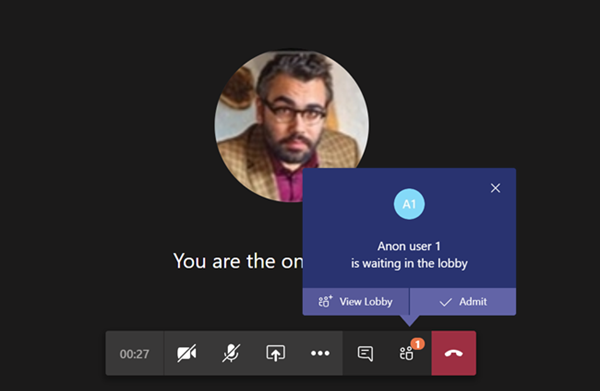

# 팀에서 모임 정책 관리Manage meeting policies in Teams

::: zone target="docs"
모임 정책은 조직의 사용자가 예약한 모임에 대해 모임 참가자가 사용할 수 있는 기능을 제어 하는 데 사용 됩니다.Meeting policies are used to control the features that are available to meeting participants for meetings that are scheduled by users in your organization. 정책을 만들고 변경한 후 정책에 사용자를 할당할 수 있습니다.After you create a policy and make your changes, you can then assign users to the policy. Microsoft 팀 관리 센터에서 또는 [PowerShell을 사용](teams-powershell-overview.md)하 여 모임 정책을 관리할 수 있습니다.You manage meeting policies in the Microsoft Teams admin center or by [using PowerShell](teams-powershell-overview.md).

모임 시작, 모임 중 또는 모임 이후 사용자의 모임 환경에 영향을 주는 다음과 같은 방법으로 정책을 구현할 수 있습니다.You can implement policies in the following ways, which affect the meeting experience for users before a meeting starts, during a meeting, or after a meeting. 

|구현 형식Implementation type  |설명Description  |
|---------|---------|
|이끌이 별Per-organizer    |이끌이 별 정책을 구현 하는 경우 모든 모임 참가자는 해당 이끌이의 정책을 상속 합니다.When you implement a per-organizer policy, all meeting participants inherit the policy of the organizer. 예를 들어 사용자가 **자동으로** 허용 이끌이 정책 이며 사용자가 모임에 직접 참가 하는지 여부를 제어 하 고 정책에 할당 된 사용자가 예약한 모임에 대해 대기실에서 대기 합니다.For example, **Automatically admit people** is a per-organizer policy and controls whether users join the meeting directly or wait in the lobby for meetings scheduled by the user who is assigned the policy.          |
|사용자별Per-user    |사용자별 정책을 구현할 때, 이끌이 및/또는 모임 참가자에 대 한 특정 기능을 제한 하는 사용자별 정책만 적용 됩니다.When you implement a per-user policy, only the per-user policy applies to restrict certain features for the organizer and/or meeting participants. 예를 들어 **모임 시작 허용** 은 사용자별 정책입니다.For example, **Allow Meet now** is a per-user policy.     |
|이끌이와 사용자 단위Per-organizer and per-user     |이끌이 및 사용자별 정책 조합을 구현 하는 경우 특정 기능은 해당 정책 및 이끌이의 정책에 따라 모임 참가자에 대해 제한 됩니다.When you implement a combination of a per-organizer and per-user policy, certain features are restricted for meeting participants based on their policy and the organizer's policy. 예를 들어 **클라우드 기록은 허용** -이끌이 및 사용자별 정책입니다.For example, **Allow cloud recording** is a per-organizer and per-user policy. 이 설정을 사용 하 여 모임 이끌이 및 참가자가 녹음/녹화를 시작 하 고 중지할 수 있습니다.Turn on this setting to allow the meeting organizer and participants to start and stop a recording. 

기본적으로 Global (조직 전체 기본값) 이라는 정책이 만들어집니다.By default, a policy named Global (org-wide default) is created. 조직의 모든 사용자에 게이 모임 정책이 기본적으로 할당 됩니다.All users in your organization will be assigned this meeting policy by default. 이 정책을 변경 하거나 하나 이상의 사용자 지정 정책을 만들어 사용자를 할당할 수 있습니다.You can either make changes to this policy or create one or more custom policies and assign users to them. 사용자 지정 정책을 만들 때 사용자가 특정 기능을 사용할 수 있도록 허용 하거나 금지할 수 있으며 설정을 적용할 사용자 하나 이상에 게 할당 합니다.When you create a custom policy, you can allow or prevent certain features from being available to your users, and then assign it to one or more users who will have the settings applied to them. 

## 모임 정책 변경 또는 만들기Change or create a meeting policy

모임 정책을 변경 하거나 만들려면 Microsoft 팀 관리 센터 > **모임** > **모임 정책**으로 이동 합니다.To change or create a meeting policy, go to the Microsoft Teams admin center > **Meetings** > **Meeting policies**. 목록에서 정책을 선택 하거나 **새 정책을**선택 합니다.Select a policy from the list or select **New policy**. 새 정책을 만드는 경우 이름 및 설명을 추가 합니다.If you're creating a new policy, add a name and description. 이름은 특수 문자를 포함 하거나 64 자를 초과할 수 없습니다.The name can't contain special characters or be longer than 64 characters. 설정을 선택 하 고 **저장**을 선택 합니다.Choose your settings, and then select **Save**.

예를 들어 사용자가 여러 명 있고 모임에 필요한 대역폭의 양을 제한 하려고 한다고 가정해 보세요.For example, say you have a bunch of users and you want to limit the amount of bandwidth that their meeting would require. "제한 된 대역폭" 이라는 새 사용자 지정 정책을 만들고 다음 설정을 사용 하지 않도록 설정 합니다.You would create a new custom policy named "Limited bandwidth" and disable the following settings:

**오디오 & 비디오**:Under **Audio & video**:
- 구름 기록 해제Turn off cloud recording
- IP 비디오 허용 해제Turn off Allow IP video

**콘텐츠 공유**에서:Under **Content sharing**:
- 화면 공유 모드 해제Disable screen sharing mode
- 화이트 보드 끄기Turn off whiteboard
- 공유 메모 해제Turn off shared notes

그런 다음 사용자에 게 정책을 할당 합니다.Then assign the policy to the users.

> [!NOTE] 
> 사용자는 한 번에 하나의 모임 정책만 할당할 수 있습니다.A user can be assigned only one meeting policy at a time. 

## 사용자에 게 모임 정책 할당Assign a meeting policy to users

한 사용자에 게 정책을 적용 하는 경우 왼쪽 탐색 창에서 **사용자** 를 선택한 다음 사용자의 표시 이름을 클릭 합니다.If you're applying the policy to one user, select **Users** on the left navigation pane, and then click the user's display name. 사용자의 페이지에서 **할당 된 정책**옆에 있는 **편집**을 선택 합니다.On the user's page, next to **Assigned policies**, select **Edit**. 그런 다음 **사용자 정책 편집** 창의 **모임 정책**아래에 있는 드롭다운 목록에서 모임 정책을 선택한 다음 **저장**을 선택 합니다.Then, in the **Edit user policies** pane, under **Meeting policy**, select the meeting policy from the drop-down list, and then select **Save**. 사용자 목록에서 정책을 할당할 수도 있습니다.You can also assign policies from the list of users. 이렇게 하려면 사용자의 표시 이름 왼쪽을 클릭 하 여 사용자를 선택 합니다.To do this, select the user by clicking to the left of the user's display name. **설정 편집**을 선택 합니다.Select **Edit settings**. 그런 다음 **설정 편집** 창의 **모임 정책**아래에 있는 드롭다운 목록에서 정책을 선택한 다음 **저장**을 선택 합니다.Then, on the **Edit settings** pane, under **Meeting policy**, select the policy from the drop-down list, and then select **Save**. 
 
정책을 두 명 이상의 사용자에 게 적용 하는 경우 왼쪽 탐색 창에서 **사용자** 를 선택한 다음 사용자 이름 왼쪽을 클릭 하 여 각 사용자를 선택 하 고 **설정 편집**을 클릭 합니다.If you're applying a policy to more than one user, select **Users** on the left navigation pane, and then select each user by clicking to the left of the user name, and then click **Edit settings**. **설정 편집** 창의 **모임 정책**아래에 있는 드롭다운 목록에서 정책을 선택한 다음 **저장**을 선택 합니다.On the **Edit Settings** pane, under **Meeting policy**, select the policy from the drop-down list, and then select **Save**.
 
다음과 같이 한 명 이상의 사용자에 게 모임 정책을 할당할 수도 있습니다.You can also assign a meeting policy to one or more users as follows:

1. **Microsoft 팀 관리 센터** > **모임** > **정책**으로 이동 합니다.Go to **Microsoft Teams admin center** > **Meetings** > **Meeting policies**.
2. 정책 이름 왼쪽에 있는을 클릭 하 여 정책을 선택 합니다.Select the policy by clicking to the left of the policy name.
3. **사용자 관리**를 선택 합니다.Select **Manage users**.
4. **사용자 관리** 창에서 표시 이름 또는 사용자 이름을 사용 하 여 사용자를 검색 하 고 이름을 선택한 다음 **추가**를 선택 합니다.In the **Manage users** pane, search for the user by display name or by user name, select the name, and then select **Add**. 추가 하려는 각 사용자에 대해이 단계를 반복 합니다.Repeat this step for each user that you want to add.
5. 사용자 추가를 마쳤으면 **저장**을 선택 합니다.When you're finished adding users, select **Save**.
 
> [!NOTE] 
> 사용자가 할당 된 정책은 삭제할 수 없습니다.You can't delete a policy if users are assigned to it. 먼저 영향을 받는 모든 사용자에 게 다른 정책을 할당 한 다음 원래 정책을 삭제할 수 있습니다.You must first assign a different policy to all affected users, and then you can delete the original policy.
 
## 모임 정책 설정Meeting policy settings

**모임 정책** 페이지의 기존 정책을 선택 하거나 새 정책을 선택 하 여 \*\*\*\* 새 정책을 추가 하면 다음에 대 한 설정을 구성할 수 있습니다.When you select an existing policy on the **Meeting policies** page or select **New policy** to add a new policy, you can configure settings for the following.

- [일반General](#meeting-policy-settings---general)
- [오디오 & 비디오Audio & video](#meeting-policy-settings---audio--video)
- [콘텐츠 공유Content sharing](#meeting-policy-settings---content-sharing)
- [참가자가 게스트를 &Participants & guests](#meeting-policy-settings---participants--guests)

::: zone-end 

## 모임 정책 설정-일반Meeting policy settings - General

- [채널에서 모임 시작 허용Allow Meet now in channels](#allow-meet-now-in-channels)
- [바로 비공개 모임 허용 (예정 대로)Allow private Meet now (coming soon)](#allow-private-meet-now-coming-soon)
- [Outlook 추가 기능 허용Allow the Outlook add-in](#allow-the-outlook-add-in)
- [채널 모임 예약 허용Allow channel meeting scheduling](#allow-channel-meeting-scheduling)
- [개인 모임 예약 허용Allow scheduling private meetings](#allow-scheduling-private-meetings)

### 채널에서 모임 시작 허용Allow Meet now in channels

이것은 사용자별 정책으로, 모임이 시작 되기 전에 적용 됩니다.This is a per-user policy and applies before a meeting starts. 이 설정은 사용자가 팀 채널에서 임시 모임을 시작할 수 있는지 여부를 제어 합니다.This setting controls whether a user can start an ad-hoc meeting in a Teams channel. 이 기능을 설정 하면 사용자가 팀 채널에서 메시지를 게시할 때 작성 상자 아래에 있는 모임 시작 \*\*\*\* 을 클릭 하 여 채널에서 임시 모임을 시작할 수 있습니다.If you turn this on, when a user posts a message in a Teams channel, the user can click **Meet now** beneath the compose box to start an ad-hoc meeting in the channel.

### 바로 비공개 모임 허용 (예정 대로)Allow private Meet now (coming soon)

이것은 사용자별 정책으로, 모임이 시작 되기 전에 적용 됩니다.This is a per-user policy and applies before a meeting starts. 이 설정은 사용자가 임시 비공개 모임을 시작할 수 있는지 여부를 제어 합니다.This setting controls whether a user can start an ad hoc private meeting.  

### Outlook 추가 기능 허용Allow the Outlook add-in

이것은 사용자별 정책으로, 모임이 시작 되기 전에 적용 됩니다.This is a per-user policy and applies before a meeting starts. 이 설정은 Outlook (Windows, Mac, 웹, 모바일)에서 팀 모임을 예약할 수 있는지 여부를 제어 합니다.This setting controls whether Teams meetings can be scheduled from within Outlook (Windows, Mac, web, and mobile).

이 기능을 해제 하면 사용자가 Outlook에서 새 모임을 만들 때 팀 회의를 예약할 수 없습니다.If you turn this off, users are unable to schedule Teams meetings when they create a new meeting in Outlook. 예를 들어 Windows의 Outlook에서는 **새 팀 모임** 옵션이 리본 메뉴에 표시 되지 않습니다.For example, in Outlook on Windows, the **New Teams Meeting** option won't show up in the ribbon.

### 채널 모임 예약 허용Allow channel meeting scheduling

이것은 사용자별 정책으로, 모임이 시작 되기 전에 적용 됩니다.This is a per-user policy and applies before a meeting starts. 이 설정은 사용자가 팀 채널에서 모임을 예약할 수 있는지 여부를 제어 합니다.This setting controls whether users can schedule a meeting in a Teams channel.  이 기능을 해제 한 경우 팀 채널에서 모임을 시작할 때 사용자가 **모임 예약** 옵션을 사용할 수 없으며 팀의 모임에서 모임을 예약 하는 경우 사용자가 모임 **에 대 한 채널 선택** 옵션을 사용할 수 없습니다.If you turn this off, the **Schedule a meeting** option won't be available to the user when they start a meeting in a Teams channel and the **Select a channel to meet** option won't be available to the user when they schedule a meeting from Meetings in Teams.

### 개인 모임 예약 허용Allow scheduling private meetings

이것은 사용자별 정책으로, 모임이 시작 되기 전에 적용 됩니다.This is a per-user policy and applies before a meeting starts. 이 설정은 사용자가 팀에서 비공개 모임을 예약할 수 있는지 여부를 제어 합니다.This setting controls whether users can schedule private meetings in Teams. 모임이 팀의 채널에 게시 되지 않은 경우 비공개 모임입니다.A meeting is private when it's not published to a channel in a team.

**비공개 모임 예약 허용** 을 해제 하 고 **채널 모임 예약을 허용**하면 **모임 예약** 옵션을 사용할 수 없으며 사용자가 팀에서 모임을 예약할 수 없습니다.Note that if you turn off **Allow scheduling private meetings** and **Allow channel meeting scheduling**,  the **Schedule a meeting** option won't be available and users will be unable to schedule meetings in Teams.

## 모임 정책 설정-오디오 & 비디오Meeting policy settings - Audio & video

- [내용 허용Allow transcription](#allow-transcription)
- [클라우드 기록 허용Allow cloud recording](#allow-cloud-recording)
- [IP 영상 허용Allow IP video](#allow-ip-video)
- [미디어 비트 전송률 (KBs)Media bit rate (KBs)](#media-bit-rate-kbs)
- [실시간 캡션 사용 (곧 출시)Enable live captions (coming soon)](#enable-live-captions-coming-soon)

### 내용 허용Allow transcription

이는 구성 단위 및 사용자별 정책 조합입니다.This is a combination of a per-organizer and per-user policy. 이 설정은 모임 녹음/녹화를 재생 하는 동안 캡션과 기록 기능을 사용할 수 있는지 여부를 제어 합니다.This setting controls whether captions and transcription features are available during playback of meeting recordings. 이 기능을 해제 하면 모임 녹음/녹화를 재생 하는 동안 **검색** 및 **참조** 옵션을 사용할 수 없습니다.If you turn this off, the **Search** and **CC** options won't be available during playback of a meeting recording. 녹음/녹화를 시작한 사람에 게는 녹음/녹화가 포함 되도록이 설정이 켜져 있어야 합니다.The person who started the recording needs this setting turned on so that the recording also includes transcription. 

기록 된 모임에 대 한 정보는 현재 팀의 언어를 영어로 설정한 경우와 모임에서 영어를 사용 하 고 있는 사용자만 지원 합니다.Note that transcription for recorded meetings is currently only supported for users who have the language in Teams set to English and when English is spoken in the meeting.

### 클라우드 기록 허용Allow cloud recording

이는 구성 단위 및 사용자별 정책 조합입니다.This is a combination of a per-organizer and per-user policy. 이 설정은 사용자의 모임을 녹화할 수 있는지 여부를 제어 합니다.This setting controls whether this user's meetings can be recorded. 참가자에 대해 정책 설정이 설정 된 경우와 다른 모임 참가자가 같은 조직의 인증 된 사용자 인 경우 기록을 시작할 수 있습니다.The recording can be started by the meeting organizer or by another meeting participant if the policy setting is turned on for the participant and if they're an authenticated user from the same organization.

페더레이션 및 익명 사용자 등 조직 외부의 사용자가 녹음/녹화를 시작할 수 없습니다.People outside your organization, such as federated and anonymous users, can't start the recording. 게스트 사용자는 녹음/녹화를 시작 하거나 중지할 수 없습니다.Guest users can't start or stop the recording. 

다음 예제를 살펴보겠습니다.Let's look at the following example.

|클릭할User |모임 정책Meeting policy  |클라우드 기록 허용Allow cloud recording |
|---------|---------|---------|
|DanielaDaniela | 전역Global   | 해제False |
|AmandaAmanda | Location1MeetingPolicyLocation1MeetingPolicy | FalseTrue|
|John (외부 사용자)John (external user) | 해당 없음Not applicable | 해당 없음Not applicable|

Daniela에서 구성한 모임은 기록 하 고 Amanda 수 있으며, 정책 설정을 사용 하도록 설정한 경우 Daniela로 구성 된 모임을 녹화할 수 없습니다.Meetings organized by Daniela can't be recorded and Amanda, who has the policy setting enabled, can't record meetings organized by Daniela. Amanda에서 구성한 모임은 녹화할 수 있지만, Daniela는 정책 설정을 사용 하지 않도록 설정 하 고 외부 사용자 인 John은 Amanda으로 구성 된 모임을 기록할 수 없습니다.Meetings organized by Amanda can be recorded, however,  Daniela, who has the policy setting disabled and John who is an external user, can't record meetings organized by Amanda.

클라우드 모임 기록에 대해 자세히 알아보려면 [팀 클라우드 모임 기록을](cloud-recording.md)참조 하세요.To learn more about cloud meeting recording, see [Teams cloud meeting recording](cloud-recording.md).

### IP 영상 허용Allow IP video

이는 구성 단위 및 사용자별 정책 조합입니다.This is a combination of a per-organizer and per-user policy. 비디오는 모임에 대 한 주요 구성 요소입니다.Video is a key component to meetings. 일부 조직에서는 관리자가 어떤 사용자의 모임이 비디오를 보유 하 고 있는지 더 자세히 관리할 수 있습니다.In some organizations, admins might want more control over which users’ meetings have video. 이 설정은 사용자가 호스트 하는 모임 및 사용자가 시작한 1:1 통화 및 그룹 통화에서 비디오를 켤 수 있는지 여부를 제어 합니다.This setting controls whether video can be turned on in meetings hosted by a user and in 1:1 calls and group calls started by a user. 이 정책을 사용 하도록 설정한 사용자가 구성한 모임에는 모임 참가자가 정책을 사용 하도록 설정한 경우 모임 참가자가 모임에서 비디오 공유를 사용할 수 있습니다.Meetings organized by a user who has this policy enabled, allow video sharing in the meeting by the meeting participants, if the meeting participants also have the policy enabled. 배정 된 정책이 없는 모임 참가자 (예: 익명 및 페더레이션 참가자)는 모임 이끌이의 정책을 상속 합니다.Meeting participants who don't have any policies assigned (for example, anonymous and federated participants) inherit the policy of the meeting organizer.

다음 예제를 살펴보겠습니다.Let's look at the following example.

|클릭할User |모임 정책Meeting policy  |IP 영상 허용Allow IP Video |
|---------|---------|---------|
|DanielaDaniela   | 전역Global   | FalseTrue        |
|AmandaAmanda    | Location1MeetingPolicyLocation1MeetingPolicy        | 해제False      |

Daniela에서 호스팅하는 모임은 영상 통화를 켤 수 있습니다.Meetings hosted by Daniela allow video to be turned on. Daniela 모임에 참가 하 고 비디오를 켤 수 있습니다.Daniela can join the meeting and turn on video. Amanda의 정책이 비디오를 허용 하지 않도록 설정 되어 있기 때문에 Daniela 모임에서 비디오를 켤 수 없습니다 Amanda.Amanda can't turn on video in Daniela's meeting because Amanda’s policy is set to not allow video. Amanda는 모임의 다른 참가자가 공유 하는 비디오를 볼 수 있습니다.Amanda can see videos shared by other participants in the meeting.

Amanda에서 호스팅하는 모임에서 할당 된 비디오 정책에 관계 없이 비디오를 켤 수 없습니다.In meetings hosted by Amanda, no one can turn on video, regardless of the video policy assigned to them. 이는 Daniela에서 Amanda의 모임에서 비디오를 켤 수 없음을 의미 합니다.This means Daniela can't turn on video in Amanda’s meetings.  

Daniela에서 비디오를 사용 하 여 Amanda를 호출 하는 경우 Amanda는 오디오 만으로 전화를 받을 수 있습니다.If Daniela calls Amanda with video on, Amanda can answer the call with audio only.  통화가 연결 되 면 Amanda에서 Daniela의 비디오를 볼 수 있지만 영상 통화는 켜지 지 않습니다.When the call is connected, Amanda can see Daniela’s video, but can't turn on video. Amanda에서 Daniela를 호출 하는 경우 Daniela는 비디오 및 오디오로 전화를 받을 수 있습니다.If Amanda calls Daniela, Daniela can answer the call with video and audio. 통화가 연결 되 면 필요에 따라 Daniela에서 비디오를 켜거나 끌 수 있습니다.When the call is connected, Daniela can turn on or turn off her video, as needed.

### 미디어 비트 전송률 (KBs)Media bit rate (KBs)

이것은 사용자별 정책입니다.This is a per-user policy. 이 설정에 따라 사용자에 대 한 통화 및 모임에서 오디오, 비디오 및 비디오 기반 앱 공유 전송의 미디어 비트 전송률이 결정 됩니다.This setting determines the media bit rate for audio, video, and video-based app sharing transmissions in calls and meetings for the user. 통화 또는 모임에서 사용자의 업링크 및 다운 링크 미디어 트래버스 둘 다에 적용 됩니다.It's applied to both the uplink and downlink media traversal for users in the call or meeting. 이 설정을 사용 하면 조직의 대역폭을 관리 하는 방법을 세부적으로 제어할 수 있습니다.This setting gives you granular control over managing bandwidth in your organization. 사용자에 게 필요한 모임 시나리오에 따라 좋은 품질 환경을 위해 적절 한 대역폭을 확보 하는 것이 좋습니다.Depending on the meetings scenarios required by users, we recommend having enough bandwidth in place for a good quality experience. 최소값은 30kbps이 고 최대값은 모임 시나리오에 따라 달라 집니다.The minimum value is 30 Kbps and the maximum value depends on the meeting scenario. 팀에서 좋은 음질의 모임, 통화, 라이브 이벤트에 권장 되는 최소 대역폭에 대해 자세히 알아보려면 [대역폭 요구 사항을](prepare-network.md#bandwidth-requirements)참조 하세요.To learn more about the minimum recommended bandwidth for good quality meetings, calls, and live events in Teams, see [Bandwidth requirements](prepare-network.md#bandwidth-requirements).

모임에 대 한 대역폭이 충분 하지 않은 경우 참가자는 네트워크 품질이 좋지 않다는 메시지가 표시 됩니다.If there isn’t enough bandwidth for a meeting, participants see a message that indicates poor network quality.

CEO 보드 모임 및 팀 라이브 이벤트와 같이 고품질의 비디오 환경을 필요로 하는 모임의 경우 대역폭을 10mbps로 설정 하는 것이 좋습니다.For meetings that need the highest quality video experience, such as CEO board meetings and Teams live events, we recommend you set the bandwidth to 10 Mbps. 최대 환경이 설정 된 경우에도 시나리오에 따라 특정 네트워크 조건이 감지 되는 경우 팀 미디어 스택이 낮은 대역폭 조건에 적응 합니다.Even when the maximum experience is set, the Teams media stack adapts to low bandwidth conditions when certain network conditions are detected, depending on the scenario. 

### 실시간 캡션 사용 (곧 출시)Enable live captions (coming soon)

이것은 사용자별 정책으로 모임 중에 적용 됩니다.This is a per-user policy and applies during a meeting. 이 설정을 사용 하는 경우 모임 중에 캡션을 표시 하는 옵션을 사용자가 볼 수 있습니다.If this setting is on, the user sees an option to display captions during a meeting.

## 모임 정책 설정-콘텐츠 공유Meeting policy settings - Content sharing

- [화면 공유 모드Screen sharing mode](#screen-sharing-mode)
- [참가자가 제어권을 부여 하거나 요청할 수 있도록 허용Allow a participant to give or request control](#allow-a-participant-to-give-or-request-control)
- [외부 참가자가 제어권을 부여 하거나 요청할 수 있도록 허용Allow an external participant to give or request control](#allow-an-external-participant-to-give-or-request-control)
- [PowerPoint 공유 허용Allow PowerPoint sharing](#allow-powerpoint-sharing)
- [화이트 보드 허용Allow whiteboard](#allow-whiteboard)
- [공유 메모 허용Allow shared notes](#allow-shared-notes)
- [모임에서 채팅 허용 (예정 대로)Allow chat in meetings (coming soon)](#allow-chat-in-meetings-coming-soon)

### 화면 공유 모드Screen sharing mode

이는 구성 단위 및 사용자별 정책 조합입니다.This is a combination of a per-organizer and per-user policy. 이 설정은 사용자의 모임에서 데스크톱 및/또는 창 공유를 허용할지 여부를 제어 합니다.This setting controls whether desktop and/or window sharing is allowed in the user's meeting. 배정 된 정책이 없는 모임 참가자 (예: 익명, 게스트, B2B, 페더레이션 참가자)는 모임 이끌이의 정책을 상속 합니다.Meeting participants who don't have any policies assigned (for example, anonymous, guest, B2B, and federated participants) inherit the policy of the meeting organizer.

|값 설정Setting value |결과가Behavior  |
|---------|---------|
|**전체 화면****Entire screen**    | 모임에서 전체 데스크톱 공유 및 응용 프로그램 공유를 허용 합니다.Full desktop sharing and application sharing is allowed in the meeting |
|**단일 응용 프로그램****Single application**   | 모임에서 응용 프로그램 공유가 허용 됨Application sharing is allowed in the meeting        |
|**비활성화****Disabled**     |모임에서 화면 공유 및 응용 프로그램 공유 기능을 해제 했습니다.Screen sharing and application sharing turned off in the meeting.       |

다음 예제를 살펴보겠습니다.Let's look at the following example.

|클릭할User |모임 정책Meeting policy |화면 공유 모드Screen sharing mode |
|---------|---------|---------|
|DanielaDaniela  | 전역Global   | 전체 화면Entire screen |
|AmandaAmanda   | Location1MeetingPolicyLocation1MeetingPolicy  | 비활성화Disabled |

Daniela에서 호스팅하는 모임은 모임 참가자가 전체 화면 또는 특정 응용 프로그램을 공유할 수 있습니다.Meetings hosted by Daniela allow meeting participants to share their entire screen or a specific application. Amanda 참가 Daniela의 모임이 Amanda, 화면을 공유할 수 없거나, 정책 설정에 따라 특정 응용 프로그램을 사용 하지 않는 것입니다.If Amanda joins Daniela’s meeting, Amanda can't share her screen or a specific application as her policy setting is disabled. Amanda에서 호스트 하는 모임에서는 자신에 게 할당 된 화면 공유 모드 정책에 관계 없이 화면 또는 단일 응용 프로그램을 공유할 수 없습니다.In meetings hosted by Amanda, no one is allowed to share their screen or a single application, regardless of the screen sharing mode policy assigned to them. 즉, Daniela는 Amanda 모임의 화면 또는 단일 응용 프로그램을 공유할 수 없습니다.This means that Daniela can't share her screen or a single application in Amanda’s meetings.  

현재 사용자는 Google Chrome을 사용 하는 경우 팀 모임에서 비디오를 재생 하거나 화면을 공유할 수 없습니다.Currently, users can't play video or share their screen in a Teams meeting if they're using Google Chrome.

### 참가자가 제어권을 부여 하거나 요청할 수 있도록 허용Allow a participant to give or request control

이것은 사용자별 정책입니다.This is a per-user policy. 이 설정은 사용자가 공유 데스크톱 또는 창을 다른 모임 참가자에 게 제어권을 부여할 수 있는지 여부를 제어 합니다.This setting controls whether the user can give control of the shared desktop or window to other meeting participants. 컨트롤을 제공 하려면 화면 위쪽을 마우스로 가리킵니다.To give control, hover over the top of the screen. 

사용자에 대해이 설정이 설정 된 경우 **제어권 제공** 옵션이 공유 세션의 위쪽 표시줄에 표시 됩니다.If this setting is turned on for the user, the **Give Control** option is displayed in the top bar in a sharing session. 

사용자에 대해 설정이 꺼져 있으면 **제어권 제공** 옵션을 사용할 수 없습니다.If the settings is turned off for the user, the **Give Control** option isn't available.

다음 예제를 살펴보겠습니다.Let's look at the following example.

|클릭할User |모임 정책Meeting policy  |참가자가 제어권을 부여 하거나 요청할 수 있도록 허용Allow participant to give or request control |
|---------|---------|---------|
|DanielaDaniela   | 전역Global   | FalseTrue       |
|BabekBabek    | Location1MeetingPolicyLocation1MeetingPolicy        | 해제False   |

Daniela는 다른 참가자에 게 제어권을 부여할 수 없기 때문에 Babek에서 구성한 모임의 다른 참가자에 게 공유 데스크톱 또는 창을 제어 합니다.Daniela can give control of the shared desktop or window to other participants in a meeting organized by Babek whereas Babek can't give control to other participants.

### 외부 참가자가 제어권을 부여 하거나 요청할 수 있도록 허용Allow an external participant to give or request control

이것은 사용자별 정책입니다.This is a per-user policy. 이 설정은 모임의 외부 참가자가 모임의 다른 참가자에 게 공유 데스크톱 또는 창을 제어할 수 있는지 여부를 제어 합니다.This setting controls whether external participants in a meeting can give control of their shared desktop or window to other participants in the meeting. 팀 회의의 외부 참가자는 다음과 같이 분류할 수 있습니다.External participants in Teams meetings can be categorized as follows:  

   - 익명 사용자Anonymous user
   - 게스트 사용자Guest users  
   - B2B 사용자B2B user
   - 페더레이션 사용자Federated user  

공유 된 사용자가 외부 참가자가 조직에서 **제어권을 부여 하거나 요청할 수 있도록 허용을** 제어 하도록 설정 되어 있는 동안 페더레이션 사용자가 해당 사용자에 게 제어권을 부여할 수 있는지 여부Whether federated users can give control to external users while sharing is controlled by the **Allow an external participant to give or request control** setting in their organization.

### PowerPoint 공유 허용Allow PowerPoint sharing

이것은 사용자별 정책입니다.This is a per-user policy. 이 설정은 사용자가 모임에서 PowerPoint 슬라이드 데크를 공유할 수 있는지 여부를 제어 합니다.This setting controls whether the user can share PowerPoint slide decks in a meeting. 익명, 게스트, 페더레이션 사용자를 비롯 한 외부 사용자가 모임 이끌이의 정책을 상속 합니다.External users, including anonymous, guest, and federated users, inherit the policy of the meeting organizer.

다음 예제를 살펴보겠습니다.Let's look at the following example.

|클릭할User |모임 정책Meeting policy  |PowerPoint 공유 허용Allow PowerPoint sharing |
|---------|---------|---------|
|DanielaDaniela   | 전역Global   | FalseTrue       |
|AmandaAmanda   | Location1MeetingPolicyLocation1MeetingPolicy        | 해제False   |

Amanda 모임 이끌이 인 경우에도 모임에서 PowerPoint 슬라이드 데크를 공유할 수 없습니다.Amanda can't share PowerPoint slide decks in meetings even if she's the meeting organizer. Daniela는 모임이 Amanda으로 구성 된 경우에도 PowerPoint 슬라이드 데크를 공유할 수 있습니다.Daniela can share PowerPoint slide decks even if the meeting is organized by Amanda. Amanda는 PowerPoint 슬라이드 데크를 공유할 수는 없지만 모임에서 다른 사용자가 공유한 PowerPoint 슬라이드 데크를 볼 수 있습니다.Amanda can view the PowerPoint slide decks shared by others in the meeting, even though she can't share PowerPoint slide decks.

### 화이트 보드 허용Allow whiteboard

이것은 사용자별 정책입니다.This is a per-user policy. 이 설정은 사용자가 모임에서 화이트 보드를 공유할 수 있는지 여부를 제어 합니다.This setting controls whether a user can share the whiteboard in a meeting. 익명, B2B, 페더레이션 사용자 등의 외부 사용자는 모임 이끌이의 정책을 상속 합니다.External users, including anonymous, B2B, and federated users, inherit the policy of the meeting organizer. 

다음 예제를 살펴보겠습니다.Let's look at the following example.

|클릭할User |모임 정책Meeting policy  |화이트 보드 허용Allow whiteboard|
|---------|---------|---------|
|DanielaDaniela   | 전역Global   | FalseTrue       |
|AmandaAmanda   | Location1MeetingPolicyLocation1MeetingPolicy        | 해제False   |

Amanda 모임 이끌이 인 경우에도 모임에서 화이트 보드를 공유할 수 없습니다.Amanda can't share the whiteboard in a meeting even if she's the meeting organizer. Daniela는 모임이 Amanda으로 구성 된 경우에도 화이트 보드를 공유할 수 있습니다.Daniela can share the whiteboard even if a meeting is organized by Amanda.  

### 공유 메모 허용Allow shared notes

이것은 사용자별 정책입니다.This is a per-user policy. 이 설정은 사용자가 모임에서 노트를 만들고 공유할 수 있는지 여부를 제어 합니다.This setting controls whether a user can create and share notes in a meeting. 익명, B2B, 페더레이션 사용자 등의 외부 사용자는 모임 이끌이의 정책을 상속 합니다.External users, including anonymous, B2B, and federated users, inherit the policy of the meeting organizer. **모임 메모** 탭은 현재 20 명 미만의 참가자가 있는 모임 에서만 지원 됩니다.The **Meeting Notes** tab is currently only supported in meetings that have less than 20 participants. 

다음 예제를 살펴보겠습니다.Let's look at the following example.

|클릭할User |모임 정책Meeting policy  |공유 메모 허용Allow shared notes |
|---------|---------|---------|
|DanielaDaniela   | 전역Global   | FalseTrue       |
|AmandaAmanda   | Location1MeetingPolicyLocation1MeetingPolicy | 해제False |

Daniela는 Amanda의 모임에 메모를 기록 하 고 모든 모임에서 메모를 찍을 수 없습니다.Daniela can take notes in Amanda's meetings and Amanda can't take notes in any meetings.

### 모임에서 채팅 허용 (예정 대로)Allow chat in meetings (coming soon)

이는 이끌이 별 정책입니다.This is a per-organizer policy. 이 설정은 사용자의 모임에서 모임 채팅을 허용할지 여부를 제어 합니다.This setting controls whether meeting chat is allowed in the user's meeting. 

## 모임 정책 설정-게스트 & 참가자Meeting policy settings - Participants & guests

이 설정은 모임에 참가 하기 전에 대기실에서 대기 하는 모임 참가자와 모임에서 허용 되는 참여 수준을 제어 합니다.These settings control which meeting participants wait in the lobby before they are admitted to the meeting and the level of participation they are allowed in a meeting.

- [자동으로 사람들의 입장Automatically admit people](#automatically-admit-people)
- [익명 사용자가 모임을 시작 하도록 허용Allow anonymous people to start a meeting](#allow-anonymous-people-to-start-a-meeting)
- [전화 접속 사용자가 대기실를 우회할 수 있도록 허용Allow dial-in users to bypass the lobby](#allow-dial-in-users-to-bypass-the-lobby-coming-soon)
- [이끌이가 대기실 설정 보다 우선 하도록 허용Allow organizers to override lobby settings](#allow-organizers-to-override-lobby-settings-coming-soon)

> [!NOTE]
>모임에 참가 하는 옵션은 각 팀 그룹의 설정 및 연결 방법에 따라 달라 집니다.Options to join a meeting will vary, depending on the settings for each Teams group, and the connection method. 그룹에 오디오 회의가 있고이를 사용 하 여 연결 하는 경우 [Office 365의 오디오 회의](https://docs.microsoft.com/microsoftteams/audio-conferencing-in-office-365)를 참조 하세요.If your group has audio conferencing, and uses it to connect, see [Audio Conferencing in Office 365](https://docs.microsoft.com/microsoftteams/audio-conferencing-in-office-365). 팀 그룹에 오디오 회의가 없는 경우 [팀에서 모임 참가](https://support.office.com/article/join-a-meeting-in-teams-1613bb53-f3fa-431e-85a9-d6a91e3468c9)를 참조 하세요.If your Teams group does not have audio conferencing, refer to [Join a meeting in Teams](https://support.office.com/article/join-a-meeting-in-teams-1613bb53-f3fa-431e-85a9-d6a91e3468c9).

### 자동으로 사람들의 입장Automatically admit people

이는 이끌이 별 정책입니다.This is a per-organizer policy. 이 설정은 사용자가 인증 된 사용자가 참여 하 게 될 때까지 자신이 모임에 직접 참가 하거나 대기실에서 대기할지 여부를 제어 합니다.This setting controls whether people join a meeting directly or wait in the lobby until they are admitted by an authenticated user.

 모임 이끌이는 모임 초대에서 **모임 옵션** 을 클릭 하 여 자신이 예약한 각 모임에 대해이 설정을 변경할 수 있습니다.Meeting organizers can click **Meeting Options** in the meeting invitation to change this setting for each meeting they schedule. **(출시 예정)****(coming soon)**
  
|값 설정Setting value  |조인 동작Join behavior |
|---------|---------|
|**가****Everyone**   |모든 모임 참가자는 대기실에서 대기 하지 않고 바로 모임에 참가 합니다.All meeting participants join the meeting directly without waiting in the lobby. 여기에는 인증 된 사용자, 페더레이션 사용자, 게스트, 익명 사용자, 휴대폰으로 전화 접속 하는 사용자 등이 포함 됩니다.This includes authenticated users, federated users, guests, anonymous users, and people who dial in by phone.       |
|**조직 및 페더레이션된 조직의 모든 사용자****Everyone in your organization and federated organizations**     |게스트 사용자 및 페더레이션된 조직의 사용자를 포함 하 여 조직 내에서 인증 된 사용자가 대기실에서 대기 하지 않고 바로 모임에 참가 합니다.Authenticated users within the organization, including guest users and the users from federated organizations, join the meeting directly without waiting in the lobby.  익명 사용자 및 전화를 통해 전화를 거는 사용자는 대기실에서 대기 합니다.Anonymous users and users who dial in by phone wait in the lobby.   |
|**조직의 모든 사용자****Everyone in your organization**    |게스트 사용자를 포함 하 여 조직 내에서 인증 된 사용자가 대기실에서 대기 하지 않고 바로 모임에 참가 합니다.Authenticated users from within the organization, including guest users, join the meeting directly without waiting in the lobby.  연결 된 사용자, 익명 사용자, 휴대폰으로 전화를 걸고 있는 사용자는 대기실에서 대기 합니다.Federated users, anonymous users, and users who dial in by phone wait in the lobby.           |

### 익명 사용자가 모임을 시작 하도록 허용Allow anonymous people to start a meeting

이는 이끌이 별 정책입니다.This is a per-organizer policy. 이 설정은 B2B, 페더레이션 사용자 등의 익명 사용자가 조직에서 인증 된 사용자가 아닌 사용자의 모임에 참석할 수 있는지 여부를 제어 합니다.This setting controls whether anonymous people, including B2B, and federated users, can join the user's meeting without an authenticated user from the organization in attendance. 

인증 된 사용자가 모임에 참석 하는 경우 익명 사용자의 참가 동작입니다.Here's the join behavior of anonymous people when authenticated users are present in the meeting.

|익명 사용자가 모임을 시작 하도록 허용Allow anonymous people to start a meeting  |자동으로 사람들의 입장Automatically admit people |익명 사용자의 참가 동작Join behavior of anonymous people |
|---------|---------|---------|
|FalseTrue    | 가Everyone      | 직접 참가Join directly         |
|   | 조직의 모든 사용자Everyone in your organization       | 대기실에서 대기Wait in lobby        |
|   | 조직 및 페더레이션된 조직의 모든 사용자Everyone in your organization and federated organizations       | 대기실에서 대기Wait in lobby         |
|해제False    | 가Everyone        | 직접 참가Join directly        |
|   | 조직의 모든 사용자Everyone in your organization     | 대기실에서 대기Wait in lobby        |
|   | 조직 및 페더레이션된 조직의 모든 사용자Everyone in your organization and federated organizations      | 대기실에서 대기Wait in lobby         |

다음은 인증 된 사용자가 모임에 없는 경우의 익명 사용자의 참가 동작입니다.Here's the join behavior of anonymous people when no authenticated users are present in the meeting.

|익명 사용자가 모임을 시작 하도록 허용Allow anonymous people to start a meeting |자동으로 사람들의 입장Automatically admit people  |익명 사용자의 참가 동작Join behavior of anonymous people |
|---------|---------|---------|
|FalseTrue    | 가Everyone      | 직접 참가Join directly         |
|   | 조직의 모든 사용자Everyone in your organization       | 대기실에서 대기Wait in lobby        |
|   | 조직 및 페더레이션된 조직의 모든 사용자Everyone in your organization and federated organizations       | 대기실에서 대기Wait in lobby         |
|해제False    | 가Everyone        | 대기실에서 기다립니다.Wait in lobby. 인증 된 첫 번째 사용자가 모임에 참가 하면 사용자가 자동으로 허가 됩니다.Users are automatically admitted when the first authenticated user joins the meeting.        |
|   | 조직의 모든 사용자Everyone in your organization     |대기실에서 대기Wait in lobby         |
|   | 조직 및 페더레이션된 조직의 모든 사용자Everyone in your organization and federated organizations      | 대기실에서 대기Wait in lobby         |

### 전화 접속 사용자가 대기실를 우회할 수 있도록 허용 (예정 대로)Allow dial-in users to bypass the lobby (coming soon)

이는 이끌이 별 정책입니다.This is a per-organizer policy. 이 설정은 전화를 통해 전화를 거는 사용자가 모임에 직접 참가 하거나 **자동으로** 허용 되는 사용자 설정에 관계 없이 대기실에서 대기할지 여부를 제어 합니다.This setting controls whether people who dial in by phone join the meeting directly or wait in the lobby regardless of the **Automatically admit people** setting.

휴대폰에서 전화를 거는 사용자의 참가 동작입니다.Here's the join behavior of people who dial in by phone.

|전화 접속 사용자가 대기실를 우회할 수 있도록 허용Allow dial-in users to bypass the lobby  |자동으로 사용자를 인정 합니다.Automatically admit users  |전화 접속 사용자의 참가 동작Join behavior of people who dial in |
|---------|---------|---------|
|FalseTrue    | 가Everyone      | 직접 참가Join directly         |
|   | 조직의 모든 사용자Everyone in your organization       | 직접 참가Join directly        |
|   | 조직 및 페더레이션된 조직의 모든 사용자Everyone in your organization and federated organizations       | 직접 참가Join directly         |
|해제False    | 가Everyone        | 직접 참가Join directly        |
|   | 조직의 모든 사용자Everyone in your organization     |대기실에서 대기Wait in lobby         |
|   | 조직 및 페더레이션된 조직의 모든 사용자Everyone in your organization and federated organizations      | 대기실에서 대기Wait in lobby         |

### 이끌이를 사용 하 여 로비 설정 재정의 (예정 대로)Allow organizers to override lobby settings (coming soon)

이는 이끌이 별 정책입니다.This is a per-organizer policy. 이 설정은 모임 이끌이가 관리자가 설정 하는 **자동으로 사용자** 를 허용 하 고 **전화 접속 사용자가** 새 모임을 예약할 때 대기실를 우회 하도록 하는 로비 설정을 무시할 수 있는지 여부를 제어 합니다.This setting controls whether the meeting organizer can override the lobby settings that an admin set in **Automatically admit people** and **Allow dial-in users to bypass the lobby** when they schedule a new meeting. 

모임 이끌이는 모임 초대에서 **모임 옵션** 을 클릭 하 여 자신이 예약한 각 모임에 대 한 로비 설정을 변경할 수 있습니다.Meeting organizers can click **Meeting Options** in the meeting invitation to change lobby settings for each meeting they schedule. 

이 설정은 모임 이끌이가 이끌이 일정을 각 모임에 대해 **자동으로** 허용 하는 사용자 설정을 변경할 수 있는지 여부에 영향을 줍니다.Here's how this setting affects whether the meeting organizer can change the **Automatically admit people** setting for each meeting the organizer schedules.

|이끌이가 대기실 설정 보다 우선 하도록 허용Allow organizers to override lobby settings  |자동으로 사람들의 입장Automatically admit people  |결과가Behavior |
|---------|---------|---------|
|FalseTrue    | 가Everyone      | 이끌이는 설정을 다른 값으로 변경할 수 있습니다.Organizer can change the setting to any other value. |
|   | 조직의 모든 사용자Everyone in your organization       | 이끌이는 설정을 다른 값으로 변경할 수 있습니다.Organizer can change the setting to any other value.|
|   | 조직 및 페더레이션된 조직의 모든 사용자Everyone in your organization and federated organizations       | 이끌이는이를 다른 값으로 변경할 수 있습니다.Organizer can change this to any other value.         |
|해제False    | 가Everyone        | 이끌이는 설정을 다른 값으로 변경할 수 있습니다.Organizer can change the setting to any other value.|
|   | 조직의 모든 사용자Everyone in your organization     |이끌이는 **조직의 모든 사용자**에 게 설정을 변경할 수 있습니다.Organizer can change the setting to **Everyone in your organization**. |
|   | 조직 및 페더레이션된 조직의 모든 사용자Everyone in your organization and federated organizations      | 이끌이는 대기실 설정을 무시할 수 없습니다.Organizer can't override the lobby setting. |

이 설정은 모임 이끌이가 **전화 접속 사용자가** 모임 이끌이가 일정을 예약 하는 데 사용 하는 로비 설정을 무시할 수 있는지 여부에 영향을 주는 방법입니다.Here's how this setting affects whether the meeting organizer can change the **Allow dial-in users to bypass the lobby** setting for each meeting the organizer schedules.
    
|이끌이가 대기실 설정 보다 우선 하도록 허용Allow organizers to override lobby settings  |전화 접속 사용자가 대기실를 우회할 수 있도록 허용Allow dial-in users to bypass the lobby  |결과가Behavior |
|---------|---------|---------|
|FalseTrue    |  FalseTrue        | 이끌이는 설정을 False로 변경할 수 있습니다.Organizer can change the setting to False.       |
|FalseTrue      | 해제False         | 이끌이는 설정을 True로 변경할 수 있습니다.Organizer can change the setting to True.        |
|해제False     | FalseTrue        |이끌이는 설정을 False로 변경할 수 있습니다.Organizer can change the setting to False.         |
|해제False      |해제False          |이끌이는 로비 설정을 무시할 수 없으며 전화 접속 사용자가 모임에서 대기실를 우회 하는 것을 허용 하지 않습니다.Organizer can't override the lobby setting and can't allow dial-in users to bypass the lobby in the meeting.        |

[전체 문서Full article](meeting-policies-in-teams.md)

## 관련 항목Related topics
[팀의 메시징 정책Messaging policies in Teams](messaging-policies-in-teams.md)
