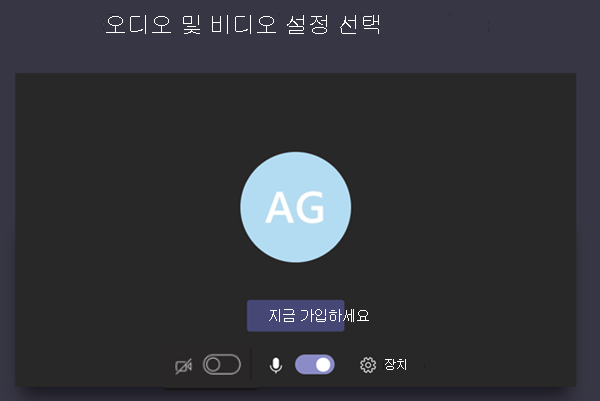

# 팀에서 모임 정책 관리Manage meeting policies in Teams

::: zone target="docs"
모임 정책은 조직에서 사용자가 예약한 모임 참가자가 사용할 수 있는 기능을 제어하는 데 사용됩니다.Meeting policies are used to control the features that are available to meeting participants for meetings that are scheduled by users in your organization. 자동으로 생성 되는 전역 (조직 차원의 기본) 정책을 사용 하거나 사용자 지정 정책을 만들고 할당할 수 있습니다.You can use the global (Org-wide default) policy that's automatically created or create and assign custom policies. Microsoft 팀 관리 센터에서 또는 [PowerShell](teams-powershell-overview.md)을 사용 하 여 모임 정책을 관리할 수 있습니다.You manage meeting policies in the Microsoft Teams admin center or by using [PowerShell](teams-powershell-overview.md).

> [!NOTE]
> 역할을 사용 하 여 모임 발표자 및 참석자의 사용 권한을 관리 하는 방법에 대 한 자세한 내용은 [팀 모임에서 역할](https://support.microsoft.com/office/roles-in-a-teams-meeting-c16fa7d0-1666-4dde-8686-0a0bfe16e019?ui=en-us&rs=en-us&ad=us)을 참조 하세요.For information about using roles to manage the permissions of meeting presenters and attendees, see [Roles in a Teams meeting](https://support.microsoft.com/office/roles-in-a-teams-meeting-c16fa7d0-1666-4dde-8686-0a0bfe16e019?ui=en-us&rs=en-us&ad=us).

모임 시작, 모임 중 또는 모임 이후 사용자의 모임 환경에 영향을 주는 다음과 같은 방법으로 정책을 구현할 수 있습니다.You can implement policies in the following ways, which affect the meeting experience for users before a meeting starts, during a meeting, or after a meeting.

|구현 형식Implementation type  |설명Description  |
|---------|---------|
|이끌이 별Per-organizer    |이끌이 별 정책을 구현 하는 경우 모든 모임 참가자는 해당 이끌이의 정책을 상속 합니다.When you implement a per-organizer policy, all meeting participants inherit the policy of the organizer. 예를 들어 사용자가 **자동으로** 허용 이끌이 정책 이며 사용자가 모임에 직접 참가 하는지 여부를 제어 하 고 정책에 할당 된 사용자가 예약한 모임에 대해 대기실에서 대기 합니다.For example, **Automatically admit people** is a per-organizer policy and controls whether users join the meeting directly or wait in the lobby for meetings scheduled by the user who is assigned the policy.          |
|사용자별Per-user    |사용자별 정책을 구현할 때, 이끌이 및/또는 모임 참가자에 대 한 특정 기능을 제한 하는 사용자별 정책만 적용 됩니다.When you implement a per-user policy, only the per-user policy applies to restrict certain features for the organizer and/or meeting participants. 예를 들어 **채널에서 모임** 시작을 허용 하는 것은 사용자별 정책입니다.For example, **Allow Meet now in channels** is a per-user policy.     |
|이끌이와 사용자 단위Per-organizer and per-user     |이끌이 및 사용자별 정책 조합을 구현 하는 경우 특정 기능은 해당 정책 및 이끌이의 정책에 따라 모임 참가자에 대해 제한 됩니다.When you implement a combination of a per-organizer and per-user policy, certain features are restricted for meeting participants based on their policy and the organizer's policy. 예를 들어 **클라우드 기록은 허용** -이끌이 및 사용자별 정책입니다.For example, **Allow cloud recording** is a per-organizer and per-user policy. 이 설정을 사용 하 여 모임 이끌이 및 참가자가 녹음/녹화를 시작 하 고 중지할 수 있습니다.Turn on this setting to allow the meeting organizer and participants to start and stop a recording.

전역 정책에서 설정을 편집 하거나 하나 이상의 사용자 지정 정책을 만들어 할당할 수 있습니다.You can edit the settings in the global policy or create and assign one or more custom policies. 사용자 지정 정책을 만들고 할당 하지 않으면 사용자가 글로벌 정책을 받습니다.Users will get the global policy unless you create and assign a custom policy.

> [!NOTE]
> 모임 세부 정보 단추는 사용자가 음성 회의 라이선스를 사용 하도록 설정 했거나 사용자가 오디오 회의를 허용 하는 경우 모임 세부 정보를 사용할 수 없는 경우 사용할 수 있습니다.Meeting details button will be available if a user has the audio conference licenses enabled or the user is allow for audio conferencing, if not, the meeting details will not be available.

## 사용자 지정 모임 정책 만들기Create a custom meeting policy

1. Microsoft 팀 관리 센터의 왼쪽 탐색 창에서 **모임**  >  **모임 정책**으로 이동 합니다.In the left navigation of the Microsoft Teams admin center, go to **Meetings** > **Meeting policies**.
2. **추가**를 클릭 합니다.Click **Add**.
3. 정책의 이름과 설명을 입력합니다.Enter a name and description for the policy. 이름은 특수 문자가 포함될 수 없으며 64자를 초과할 수 없습니다.The name can't contain special characters or be longer than 64 characters.
4. 원하는 설정을 선택 합니다.Choose the settings that you want.
5. **저장**을 클릭합니다.Click **Save**.

예를 들어, 사용자 수가 많은데 모임에 필요한 대역폭의 양을 제한하려고 한다고 가정해 보겠습니다.For example, say you have a bunch of users and you want to limit the amount of bandwidth that their meeting would require. "제한된 대역폭"이라는 새 사용자 지정 정책을 만들고 다음 설정을 사용하지 않도록 설정합니다.You would create a new custom policy named "Limited bandwidth" and disable the following settings:

**오디오 및 비디오**에서:Under **Audio & video**:

- 클라우드 녹음/녹화 허용을 끕니다.Turn off Allow cloud recording.
- IP 비디오 허용을 끕니다.Turn off Allow IP video.

**콘텐츠 공유**에서:Under **Content sharing**:

- 화면 공유 모드를 사용하지 않도록 설정합니다.Disable screen sharing mode.
- 화이트보드 허용을 끕니다.Turn off Allow whiteboard.
- 공유 노트 허용을 끕니다.Turn off Allow shared notes.

그 다음 사용자에게 정책을 할당합니다.Then assign the policy to the users.

## 모임 정책 편집Edit a meeting policy

만드는 모든 사용자 지정 정책에 대 한 전역 정책을 편집할 수 있습니다.You can edit the global policy an any custom policies that you create.

1. Microsoft 팀 관리 센터의 왼쪽 탐색 창에서 **모임**  >  **모임 정책**으로 이동 합니다.In the left navigation of the Microsoft Teams admin center, go to **Meetings** > **Meeting policies**.
2. 정책 이름 왼쪽을 클릭 하 여 정책을 선택한 다음 **편집**을 클릭 합니다.Select the policy by clicking to the left of the policy name, and then click **Edit**.
3. 여기서 원하는 대로 변경 합니다.From here, make the changes that you want.
4. **저장**을 클릭합니다.Click **Save**.

> [!NOTE]
> 사용자는 한 번에 하나의 모임 정책만 할당할 수 있습니다.A user can be assigned only one meeting policy at a time.

## 사용자에게 모임 정책 할당Assign a meeting policy to users

[!INCLUDE [assign-policy](includes/assign-policy.md)]

> [!NOTE]
> 사용자가 할당 된 정책은 삭제할 수 없습니다.You can't delete a policy if users are assigned to it. 먼저 영향을 받는 모든 사용자에 게 다른 정책을 할당 한 다음 원래 정책을 삭제할 수 있습니다.You must first assign a different policy to all affected users, and then you can delete the original policy.

## 모임 정책 설정Meeting policy settings

**모임 정책** 페이지에서 기존 정책을 선택 하거나 **추가** 를 선택 하 여 새 정책을 추가 하면 다음에 대 한 설정을 구성할 수 있습니다.When you select an existing policy on the **Meeting policies** page or select **Add** to add a new policy, you can configure settings for the following.

- [일반General](#meeting-policy-settings---general)
- [오디오 & 비디오Audio & video](#meeting-policy-settings---audio--video)
- [콘텐츠 공유Content sharing](#meeting-policy-settings---content-sharing)
- [참가자가 게스트를 &Participants & guests](#meeting-policy-settings---participants--guests)

::: zone-end

## 모임 정책 설정-일반Meeting policy settings - General

- [채널에서 모임 시작 허용Allow Meet now in channels](#allow-meet-now-in-channels)
- [Outlook 추가 기능 허용Allow the Outlook add-in](#allow-the-outlook-add-in)
- [채널 모임 예약 허용Allow channel meeting scheduling](#allow-channel-meeting-scheduling)
- [개인 모임 예약 허용Allow scheduling private meetings](#allow-scheduling-private-meetings)
- [비공개 모임에서 모임 시작 허용Allow Meet now in private meetings](#allow-meet-now-in-private-meetings)

### 채널에서 모임 시작 허용Allow Meet now in channels

이것은 사용자별 정책으로, 모임이 시작 되기 전에 적용 됩니다.This is a per-user policy and applies before a meeting starts. 이 설정은 사용자가 팀 채널에서 임시 모임을 시작할 수 있는지 여부를 제어 합니다.This setting controls whether a user can start an ad hoc meeting in a Teams channel. 이 기능을 설정 하면 사용자가 팀 채널에서 메시지를 게시할 때 작성 **상자 아래에 있는 모임 시작** 을 클릭 하 여 채널에서 특별 모임을 시작할 수 있습니다.If you turn this on, when a user posts a message in a Teams channel, the user can click **Meet now** under the compose box to start an ad hoc meeting in the channel. 기본값은 True입니다.The default value is True.

### Outlook 추가 기능 허용Allow the Outlook add-in

이것은 사용자별 정책으로, 모임이 시작 되기 전에 적용 됩니다.This is a per-user policy and applies before a meeting starts. 이 설정은 Outlook (Windows, Mac, 웹, 모바일)에서 팀 모임을 예약할 수 있는지 여부를 제어 합니다.This setting controls whether Teams meetings can be scheduled from within Outlook (Windows, Mac, web, and mobile).

이 기능을 해제 하면 사용자가 Outlook에서 새 모임을 만들 때 팀 회의를 예약할 수 없습니다.If you turn this off, users are unable to schedule Teams meetings when they create a new meeting in Outlook. 예를 들어 Windows의 Outlook에서는 **새 팀 모임** 옵션이 리본 메뉴에 표시 되지 않습니다.For example, in Outlook on Windows, the **New Teams Meeting** option won't show up in the ribbon.

### 채널 모임 예약 허용Allow channel meeting scheduling

기존 AllowChannelMeetingScheduling 정책을 사용 하 여 팀 채널 일정에 만들 수 있는 이벤트 유형을 제어 합니다.Use the existing AllowChannelMeetingScheduling policy to control the types of events that can be created on the team channel calendars. 이것은 사용자별 정책으로, 모임이 시작 되기 전에 적용 됩니다.This is a per-user policy and applies before a meeting starts. 이 설정은 사용자가 팀 채널에서 모임을 예약할 수 있는지 여부를 제어 합니다.This setting controls whether users can schedule a meeting in a Teams channel. 기본값은 True입니다.The default value is True.

이 정책을 끄면 사용자가 새 채널 모임을 만들 수 없게 됩니다.If this policy is OFF, users will not be able to create new channel meetings. 그러나 기존 채널 모임은 이벤트 구성 도우미를 통해 편집할 수 있습니다.However, existing channel meetings can be edited by the organizer of the event.

모임 예약을 사용할 수 없게 됩니다.Schedule a meeting will be disabled.

채널 선택을 사용할 수 없습니다.Channel selection is disabled.

채널 게시물 페이지에서 다음을 사용 하지 않도록 설정 합니다.In the channel posts page, the following will be disabled:

- 채널 회신 작성 상자에서 **모임 예약** 단추**Schedule a meeting** button on the channel reply compose box.

- 채널 헤더에서 **모임 예약** 단추**Schedule a meeting** button on the channel header.

채널 일정에서 다음을 수행 합니다.In the channel calendar:

- 채널 달력 머리글의 **새 이벤트 추가** 단추를 사용할 수 없게 됩니다.**Add new event** button on channel calendar header will be disabled.

- 사용자는 채널 일정에서 시간 블록을 끌어서 선택 하지 못하게 하 여 채널 모임을 만들 수 없습니다.Users will not be able to drag and select a time block on the channel calendar to create a channel meeting.
- 사용자는 바로 가기 키를 사용 하 여 채널 일정에서 모임을 만들 수 없습니다.Users cannot use Keyboard shortcuts to create a meeting on the channel calendar.

관리 센터에서 다음을 수행 합니다.In the Admin Center:

채널 일정 앱은 권한 정책에 대 한 관리 패널의 **Microsoft apps** 섹션 아래에 표시 됩니다.The channel calendar app will show up under the **Microsoft apps** section in the admin panel for permission policies.

### 개인 모임 예약 허용Allow scheduling private meetings

이것은 사용자별 정책으로, 모임이 시작 되기 전에 적용 됩니다.This is a per-user policy and applies before a meeting starts. 이 설정은 사용자가 팀에서 비공개 모임을 예약할 수 있는지 여부를 제어 합니다.This setting controls whether users can schedule private meetings in Teams. 모임이 팀의 채널에 게시 되지 않은 경우 비공개 모임입니다.A meeting is private when it's not published to a channel in a team.

**개인 모임 예약 허용** 을 해제 하 고 **채널 모임 예약을 허용**하는 경우 팀의 사용자는 **필수 참석자 추가** 및 **채널 추가** 옵션을 사용할 수 없습니다.Note that if you turn off **Allow scheduling private meetings** and **Allow channel meeting scheduling**,  the **Add required attendees** and **Add channel** options are disabled for users in Teams. 기본값은 True입니다.The default value is True.

### 비공개 모임에서 모임 시작 허용Allow Meet now in private meetings

이것은 사용자별 정책으로, 모임이 시작 되기 전에 적용 됩니다.This is a per-user policy and applies before a meeting starts. 이 설정은 사용자가 임시 비공개 모임을 시작할 수 있는지 여부를 제어 합니다.This setting controls whether a user can start an ad hoc private meeting.  기본값은 True입니다.The default value is True.

## 모임 정책 설정-오디오 & 비디오Meeting policy settings - Audio & video

- [내용 허용Allow transcription](#allow-transcription)
- [클라우드 기록 허용Allow cloud recording](#allow-cloud-recording)
- [IP 비디오 허용Allow IP video](#allow-ip-video)
- [미디어 비트 전송률 (Kbs)Media bit rate (Kbs)](#media-bit-rate-kbs)

### 내용 허용Allow transcription

이는 구성 단위 및 사용자별 정책 조합입니다.This is a combination of a per-organizer and per-user policy. 이 설정은 모임 녹음/녹화를 재생 하는 동안 캡션과 기록 기능을 사용할 수 있는지 여부를 제어 합니다.This setting controls whether captions and transcription features are available during playback of meeting recordings. 이 기능을 해제 하면 모임 녹음/녹화를 재생 하는 동안 **검색** 및 **참조** 옵션을 사용할 수 없습니다.If you turn this off, the **Search** and **CC** options won't be available during playback of a meeting recording. 녹음/녹화를 시작한 사람에 게는 녹음/녹화가 포함 되도록이 설정이 켜져 있어야 합니다.The person who started the recording needs this setting turned on so that the recording also includes transcription.

기록 된 모임에 대 한 정보는 현재 팀의 언어를 영어로 설정한 경우와 모임에서 영어를 사용 하 고 있는 사용자만 지원 합니다.Note that transcription for recorded meetings is currently only supported for users who have the language in Teams set to English and when English is spoken in the meeting.

### 클라우드 기록 허용Allow cloud recording

이는 구성 단위 및 사용자별 정책 조합입니다.This is a combination of a per-organizer and per-user policy. 이 설정은 사용자의 모임을 녹화할 수 있는지 여부를 제어 합니다.This setting controls whether this user's meetings can be recorded. 참가자에 대해 정책 설정이 설정 된 경우와 다른 모임 참가자가 같은 조직의 인증 된 사용자 인 경우 기록을 시작할 수 있습니다.The recording can be started by the meeting organizer or by another meeting participant if the policy setting is turned on for the participant and if they're an authenticated user from the same organization.

페더레이션 및 익명 사용자 등 조직 외부의 사용자가 녹음/녹화를 시작할 수 없습니다.People outside your organization, such as federated and anonymous users, can't start the recording. 게스트 사용자는 녹음/녹화를 시작 하거나 중지할 수 없습니다.Guest users can't start or stop the recording.

다음 예제를 살펴보겠습니다.Let's look at the following example.

|사용자User |모임 정책Meeting policy  |클라우드 기록 허용Allow cloud recording |
|---------|---------|---------|
|DanielaDaniela | 전역Global   | 해제False |
|AmandaAmanda | Location1MeetingPolicyLocation1MeetingPolicy | FalseTrue|
|John (외부 사용자)John (external user) | 해당 사항 없음Not applicable | 해당 사항 없음Not applicable|

Daniela에서 구성한 모임은 기록 하 고 Amanda 수 있으며, 정책 설정을 사용 하도록 설정한 경우 Daniela로 구성 된 모임을 녹화할 수 없습니다.Meetings organized by Daniela can't be recorded and Amanda, who has the policy setting enabled, can't record meetings organized by Daniela. Amanda에서 구성한 모임은 녹화할 수 있지만, Daniela는 정책 설정을 사용 하지 않도록 설정 하 고 외부 사용자 인 John은 Amanda으로 구성 된 모임을 기록할 수 없습니다.Meetings organized by Amanda can be recorded, however,  Daniela, who has the policy setting disabled and John who is an external user, can't record meetings organized by Amanda.

클라우드 모임 기록에 대해 자세히 알아보려면 [팀 클라우드 모임 기록을](cloud-recording.md)참조 하세요.To learn more about cloud meeting recording, see [Teams cloud meeting recording](cloud-recording.md).

### IP 비디오 허용Allow IP video

이는 구성 단위 및 사용자별 정책 조합입니다.This is a combination of a per-organizer and per-user policy. 비디오는 모임에 대 한 주요 구성 요소입니다.Video is a key component to meetings. 일부 조직에서는 관리자가 어떤 사용자의 모임이 비디오를 보유 하 고 있는지 더 자세히 관리할 수 있습니다.In some organizations, admins might want more control over which users' meetings have video. 이 설정은 사용자가 호스트 하는 모임 및 사용자가 시작한 1:1 통화 및 그룹 통화에서 비디오를 켤 수 있는지 여부를 제어 합니다.This setting controls whether video can be turned on in meetings hosted by a user and in 1:1 calls and group calls started by a user. 이 정책을 사용 하도록 설정한 사용자가 구성한 모임에는 모임 참가자가 정책을 사용 하도록 설정한 경우 모임 참가자가 모임에서 비디오 공유를 사용할 수 있습니다.Meetings organized by a user who has this policy enabled, allow video sharing in the meeting by the meeting participants, if the meeting participants also have the policy enabled. 배정 된 정책이 없는 모임 참가자 (예: 익명 및 페더레이션 참가자)는 모임 이끌이의 정책을 상속 합니다.Meeting participants who don't have any policies assigned (for example, anonymous and federated participants) inherit the policy of the meeting organizer.

다음 예제를 살펴보겠습니다.Let's look at the following example.

|사용자User |모임 정책Meeting policy  |IP 영상 허용Allow IP Video |
|---------|---------|---------|
|DanielaDaniela   | 전역Global   | FalseTrue        |
|AmandaAmanda    | Location1MeetingPolicyLocation1MeetingPolicy        | 해제False      |

Daniela에서 호스팅하는 모임은 영상 통화를 켤 수 있습니다.Meetings hosted by Daniela allow video to be turned on. Daniela 모임에 참가 하 고 비디오를 켤 수 있습니다.Daniela can join the meeting and turn on video. Amanda의 정책이 비디오를 허용 하지 않도록 설정 되어 있기 때문에 Daniela 모임에서 비디오를 켤 수 없습니다 Amanda.Amanda can't turn on video in Daniela's meeting because Amanda's policy is set to not allow video. Amanda는 모임의 다른 참가자가 공유 하는 비디오를 볼 수 있습니다.Amanda can see videos shared by other participants in the meeting.

Amanda에서 호스팅하는 모임에서 할당 된 비디오 정책에 관계 없이 비디오를 켤 수 없습니다.In meetings hosted by Amanda, no one can turn on video, regardless of the video policy assigned to them. 이는 Daniela에서 Amanda의 모임에서 비디오를 켤 수 없음을 의미 합니다.This means Daniela can't turn on video in Amanda's meetings.  

Daniela에서 비디오를 사용 하 여 Amanda를 호출 하는 경우 Amanda는 오디오 만으로 전화를 받을 수 있습니다.If Daniela calls Amanda with video on, Amanda can answer the call with audio only.  통화가 연결 되 면 Amanda에서 Daniela의 비디오를 볼 수 있지만 영상 통화는 켜지 지 않습니다.When the call is connected, Amanda can see Daniela's video, but can't turn on video. Amanda에서 Daniela를 호출 하는 경우 Daniela는 비디오 및 오디오로 전화를 받을 수 있습니다.If Amanda calls Daniela, Daniela can answer the call with video and audio. 통화가 연결 되 면 필요에 따라 Daniela에서 비디오를 켜거나 끌 수 있습니다.When the call is connected, Daniela can turn on or turn off her video, as needed.

### 미디어 비트 전송률 (Kbs)Media bit rate (Kbs)

이것은 사용자별 정책입니다.This is a per-user policy. 이 설정에 따라 사용자에 대 한 통화 및 모임에서 오디오, 비디오 및 비디오 기반 앱 공유 전송의 미디어 비트 전송률이 결정 됩니다.This setting determines the media bit rate for audio, video, and video-based app sharing transmissions in calls and meetings for the user. 통화 또는 모임에서 사용자의 업링크 및 다운 링크 미디어 트래버스 둘 다에 적용 됩니다.It's applied to both the uplink and downlink media traversal for users in the call or meeting. 이 설정을 사용 하면 조직의 대역폭을 관리 하는 방법을 세부적으로 제어할 수 있습니다.This setting gives you granular control over managing bandwidth in your organization. 사용자에 게 필요한 모임 시나리오에 따라 좋은 품질 환경을 위해 적절 한 대역폭을 확보 하는 것이 좋습니다.Depending on the meetings scenarios required by users, we recommend having enough bandwidth in place for a good quality experience. 최소값은 30kbps이 고 최대값은 모임 시나리오에 따라 달라 집니다.The minimum value is 30 Kbps and the maximum value depends on the meeting scenario. 팀에서 좋은 음질의 모임, 통화, 라이브 이벤트에 권장 되는 최소 대역폭에 대해 자세히 알아보려면 [대역폭 요구 사항을](prepare-network.md#bandwidth-requirements)참조 하세요.To learn more about the minimum recommended bandwidth for good quality meetings, calls, and live events in Teams, see [Bandwidth requirements](prepare-network.md#bandwidth-requirements).

모임에 대 한 대역폭이 충분 하지 않은 경우 참가자는 네트워크 품질이 좋지 않다는 메시지가 표시 됩니다.If there isn't enough bandwidth for a meeting, participants see a message that indicates poor network quality.

CEO 보드 모임 및 팀 라이브 이벤트와 같이 고품질의 비디오 환경을 필요로 하는 모임의 경우 대역폭을 10mbps로 설정 하는 것이 좋습니다.For meetings that need the highest quality video experience, such as CEO board meetings and Teams live events, we recommend you set the bandwidth to 10 Mbps. 최대 환경이 설정 된 경우에도 시나리오에 따라 특정 네트워크 조건이 감지 되는 경우 팀 미디어 스택이 낮은 대역폭 조건에 적응 합니다.Even when the maximum experience is set, the Teams media stack adapts to low bandwidth conditions when certain network conditions are detected, depending on the scenario.

## 모임 정책 설정-콘텐츠 공유Meeting policy settings - Content sharing

- [화면 공유 모드Screen sharing mode](#screen-sharing-mode)
- [참가자가 제어권을 부여 하거나 요청할 수 있도록 허용Allow a participant to give or request control](#allow-a-participant-to-give-or-request-control)
- [외부 참가자가 제어권을 부여 하거나 요청할 수 있도록 허용Allow an external participant to give or request control](#allow-an-external-participant-to-give-or-request-control)
- [PowerPoint 공유 허용Allow PowerPoint sharing](#allow-powerpoint-sharing)
- [화이트 보드 허용Allow whiteboard](#allow-whiteboard)
- [공유 메모 허용Allow shared notes](#allow-shared-notes)

### 화면 공유 모드Screen sharing mode

이는 구성 단위 및 사용자별 정책 조합입니다.This is a combination of a per-organizer and per-user policy. 이 설정은 사용자의 모임에서 데스크톱 및/또는 창 공유를 허용할지 여부를 제어 합니다.This setting controls whether desktop and/or window sharing is allowed in the user's meeting. 배정 된 정책이 없는 모임 참가자 (예: 익명, 게스트, B2B, 페더레이션 참가자)는 모임 이끌이의 정책을 상속 합니다.Meeting participants who don't have any policies assigned (for example, anonymous, guest, B2B, and federated participants) inherit the policy of the meeting organizer.

|값 설정Setting value |결과가Behavior  |
|---------|---------|
|**전체 화면****Entire screen**    | 모임에서 전체 데스크톱 공유 및 응용 프로그램 공유를 허용 합니다.Full desktop sharing and application sharing is allowed in the meeting |
|**단일 응용 프로그램****Single application**   | 모임에서 응용 프로그램 공유가 허용 됨Application sharing is allowed in the meeting        |
|**비활성화****Disabled**     |모임에서 화면 공유 및 응용 프로그램 공유 기능을 해제 했습니다.Screen sharing and application sharing turned off in the meeting.       |

다음 예제를 살펴보겠습니다.Let's look at the following example.

|사용자User |모임 정책Meeting policy |화면 공유 모드Screen sharing mode |
|---------|---------|---------|
|DanielaDaniela  | 전역Global   | 전체 화면Entire screen |
|AmandaAmanda   | Location1MeetingPolicyLocation1MeetingPolicy  | 비활성화Disabled |

Daniela에서 호스팅하는 모임은 모임 참가자가 전체 화면 또는 특정 응용 프로그램을 공유할 수 있습니다.Meetings hosted by Daniela allow meeting participants to share their entire screen or a specific application. Amanda 참가 Daniela의 모임이 Amanda, 화면을 공유할 수 없거나, 정책 설정에 따라 특정 응용 프로그램을 사용 하지 않는 것입니다.If Amanda joins Daniela's meeting, Amanda can't share her screen or a specific application as her policy setting is disabled. Amanda에서 호스트 하는 모임에서는 자신에 게 할당 된 화면 공유 모드 정책에 관계 없이 화면 또는 단일 응용 프로그램을 공유할 수 없습니다.In meetings hosted by Amanda, no one is allowed to share their screen or a single application, regardless of the screen sharing mode policy assigned to them. 즉, Daniela는 Amanda 모임의 화면 또는 단일 응용 프로그램을 공유할 수 없습니다.This means that Daniela can't share her screen or a single application in Amanda's meetings.  

현재 사용자는 Google Chrome을 사용 하는 경우 팀 모임에서 비디오를 재생 하거나 화면을 공유할 수 없습니다.Currently, users can't play video or share their screen in a Teams meeting if they're using Google Chrome.

### 참가자가 제어권을 부여 하거나 요청할 수 있도록 허용Allow a participant to give or request control

이것은 사용자별 정책입니다.This is a per-user policy. 이 설정은 사용자가 공유 데스크톱 또는 창을 다른 모임 참가자에 게 제어권을 부여할 수 있는지 여부를 제어 합니다.This setting controls whether the user can give control of the shared desktop or window to other meeting participants. 컨트롤을 제공 하려면 화면 위쪽을 마우스로 가리킵니다.To give control, hover over the top of the screen.

사용자에 대해이 설정이 설정 된 경우 **제어권 제공** 옵션이 공유 세션의 위쪽 표시줄에 표시 됩니다.If this setting is turned on for the user, the **Give Control** option is displayed in the top bar in a sharing session.

사용자에 대해 설정이 꺼져 있으면 **제어권 제공** 옵션을 사용할 수 없습니다.If the settings is turned off for the user, the **Give Control** option isn't available.

다음 예제를 살펴보겠습니다.Let's look at the following example.

|사용자User |모임 정책Meeting policy  |참가자가 제어권을 부여 하거나 요청할 수 있도록 허용Allow participant to give or request control |
|---------|---------|---------|
|DanielaDaniela   | 전역Global   | FalseTrue       |
|BabekBabek    | Location1MeetingPolicyLocation1MeetingPolicy        | 해제False   |

Daniela는 다른 참가자에 게 제어권을 부여할 수 없기 때문에 Babek에서 구성한 모임의 다른 참가자에 게 공유 데스크톱 또는 창을 제어 합니다.Daniela can give control of the shared desktop or window to other participants in a meeting organized by Babek whereas Babek can't give control to other participants.

PowerShell을 사용 하 여 제어권을 제공 하거나 제어권 요청을 받을 수 있는 사람을 제어 하려면 AllowParticipantGiveRequestControl cmdlet을 사용 합니다.To use PowerShell to control who can give control or accept requests for control, use the AllowParticipantGiveRequestControl cmdlet.

> [!NOTE]
> 공유 중 공유 콘텐츠를 관리 하 고 제어 하려면 두 파티 모두 팀 데스크톱 클라이언트를 사용 해야 합니다.To give and take control of shared content during sharing, both parties must be using the Teams desktop client. 컨트롤은 어느 쪽이든 브라우저에서 Teams를 실행 중인 경우 지원되지 않습니다.Control isn't supported when either party is running Teams in a browser. 이것은 해결하려고 하는 기술적 제한 때문입니다.This is due to a technical limitation that we're planning to fix.

### 외부 참가자가 제어권을 부여 하거나 요청할 수 있도록 허용Allow an external participant to give or request control

이것은 사용자별 정책입니다.This is a per-user policy. 조직에서이 사용자에 대해이 집합을 보유 하 고 있는지 여부는 모임 이끌이가 설정한 내용에 관계 없이 외부 참가자가 수행할 수 있는 작업을 제어 하지 않습니다.Whether an organization has this set for a user doesn't control what external participants can do, regardless of what the meeting organizer has set. 이 매개 변수는 해당 조직의 모임 정책 내에서 설정한 공유자에 따라 외부 참가자가 제어권을 부여 하거나 공유자 화면 제어권을 요청할 수 있는지 여부를 제어 합니다.This parameter controls whether external participants can be given control or request control of the sharer's screen, depending on what the sharer has set within their organization's meeting policies. 팀 회의의 외부 참가자는 다음과 같이 분류할 수 있습니다.External participants in Teams meetings can be categorized as follows:  

- 익명 사용자Anonymous user
- 게스트 사용자Guest users  
- B2B 사용자B2B user
- 페더레이션 사용자Federated user  

공유 된 사용자가 외부 참가자가 조직에서 **제어권을 부여 하거나 요청할 수 있도록 허용을** 제어 하도록 설정 되어 있는 동안 페더레이션 사용자가 해당 사용자에 게 제어권을 부여할 수 있는지 여부Whether federated users can give control to external users while sharing is controlled by the **Allow an external participant to give or request control** setting in their organization.

PowerShell을 사용 하 여 외부 참가자가 제어권을 제공 하거나 제어권 요청을 수락할 수 있는지 여부를 제어 하려면 AllowExternalParticipantGiveRequestControl cmdlet을 사용 합니다.To use PowerShell to control whether external participants can give control or accept requests for control, use the AllowExternalParticipantGiveRequestControl cmdlet.

### PowerPoint 공유 허용Allow PowerPoint sharing

이것은 사용자별 정책입니다.This is a per-user policy. 이 설정은 사용자가 모임에서 PowerPoint 슬라이드 데크를 공유할 수 있는지 여부를 제어 합니다.This setting controls whether the user can share PowerPoint slide decks in a meeting. 익명, 게스트, 페더레이션 사용자를 비롯 한 외부 사용자가 모임 이끌이의 정책을 상속 합니다.External users, including anonymous, guest, and federated users, inherit the policy of the meeting organizer.

다음 예제를 살펴보겠습니다.Let's look at the following example.

|사용자User |모임 정책Meeting policy  |PowerPoint 공유 허용Allow PowerPoint sharing |
|---------|---------|---------|
|DanielaDaniela   | 전역Global   | FalseTrue       |
|AmandaAmanda   | Location1MeetingPolicyLocation1MeetingPolicy        | 해제False   |

Amanda 모임 이끌이 인 경우에도 모임에서 PowerPoint 슬라이드 데크를 공유할 수 없습니다.Amanda can't share PowerPoint slide decks in meetings even if she's the meeting organizer. Daniela는 모임이 Amanda으로 구성 된 경우에도 PowerPoint 슬라이드 데크를 공유할 수 있습니다.Daniela can share PowerPoint slide decks even if the meeting is organized by Amanda. Amanda는 PowerPoint 슬라이드 데크를 공유할 수는 없지만 모임에서 다른 사용자가 공유한 PowerPoint 슬라이드 데크를 볼 수 있습니다.Amanda can view the PowerPoint slide decks shared by others in the meeting, even though she can't share PowerPoint slide decks.

### 화이트 보드 허용Allow whiteboard

이것은 사용자별 정책입니다.This is a per-user policy. 이 설정은 사용자가 모임에서 화이트 보드를 공유할 수 있는지 여부를 제어 합니다.This setting controls whether a user can share the whiteboard in a meeting. 익명, B2B, 페더레이션 사용자 등의 외부 사용자는 모임 이끌이의 정책을 상속 합니다.External users, including anonymous, B2B, and federated users, inherit the policy of the meeting organizer.

다음 예제를 살펴보겠습니다.Let's look at the following example.

|사용자User |모임 정책Meeting policy  |화이트 보드 허용Allow whiteboard|
|---------|---------|---------|
|DanielaDaniela   | 전역Global   | FalseTrue       |
|AmandaAmanda   | Location1MeetingPolicyLocation1MeetingPolicy        | 해제False   |

Amanda 모임 이끌이 인 경우에도 모임에서 화이트 보드를 공유할 수 없습니다.Amanda can't share the whiteboard in a meeting even if she's the meeting organizer. Daniela는 모임이 Amanda으로 구성 된 경우에도 화이트 보드를 공유할 수 있습니다.Daniela can share the whiteboard even if a meeting is organized by Amanda.  

### 공유 메모 허용Allow shared notes

이것은 사용자별 정책입니다.This is a per-user policy. 이 설정은 사용자가 모임에서 노트를 만들고 공유할 수 있는지 여부를 제어 합니다.This setting controls whether a user can create and share notes in a meeting. 익명, B2B, 페더레이션 사용자 등의 외부 사용자는 모임 이끌이의 정책을 상속 합니다.External users, including anonymous, B2B, and federated users, inherit the policy of the meeting organizer. **모임 메모** 탭은 현재 20 명 미만의 참가자가 있는 모임 에서만 지원 됩니다.The **Meeting Notes** tab is currently only supported in meetings that have less than 20 participants.

다음 예제를 살펴보겠습니다.Let's look at the following example.

|사용자User |모임 정책Meeting policy  |공유 메모 허용Allow shared notes |
|---------|---------|---------|
|DanielaDaniela   | 전역Global   | FalseTrue       |
|AmandaAmanda   | Location1MeetingPolicyLocation1MeetingPolicy | 해제False |

Daniela는 Amanda의 모임에 메모를 기록 하 고 모든 모임에서 메모를 찍을 수 없습니다.Daniela can take notes in Amanda's meetings and Amanda can't take notes in any meetings.

## 모임 정책 설정-게스트 & 참가자Meeting policy settings - Participants & guests

이 설정은 모임에 참가 하기 전에 대기실에서 대기 하는 모임 참가자와 모임에서 허용 되는 참여 수준을 제어 합니다.These settings control which meeting participants wait in the lobby before they are admitted to the meeting and the level of participation they are allowed in a meeting.

- [익명 사용자가 모임을 시작 하도록 허용Let anonymous people start a meeting](#let-anonymous-people-start-a-meeting)
- [자동으로 사람들의 입장Automatically admit people](#automatically-admit-people)
- [전화 접속 사용자가 대기실를 우회할 수 있도록 허용Allow dial-in users to bypass the lobby](#allow-dial-in-users-to-bypass-the-lobby)
- [라이브 캡션 사용Enable live captions](#enable-live-captions)
- [모임에서 채팅 허용Allow chat in meetings](#allow-chat-in-meetings)

> [!NOTE]
>모임에 참가 하는 옵션은 각 팀 그룹의 설정 및 연결 방법에 따라 달라 집니다.Options to join a meeting will vary, depending on the settings for each Teams group, and the connection method. 그룹에 오디오 회의가 있고이를 사용 하 여 연결 하는 경우 [오디오 회의](https://docs.microsoft.com/microsoftteams/audio-conferencing-in-office-365)를 참조 하세요.If your group has audio conferencing, and uses it to connect, see [Audio Conferencing](https://docs.microsoft.com/microsoftteams/audio-conferencing-in-office-365). 팀 그룹에 오디오 회의가 없는 경우 [팀에서 모임 참가](https://support.office.com/article/join-a-meeting-in-teams-1613bb53-f3fa-431e-85a9-d6a91e3468c9)를 참조 하세요.If your Teams group does not have audio conferencing, refer to [Join a meeting in Teams](https://support.office.com/article/join-a-meeting-in-teams-1613bb53-f3fa-431e-85a9-d6a91e3468c9).

### 익명 사용자가 모임을 시작 하도록 허용Let anonymous people start a meeting

회의 모임에서 leaderless 전화 걸기를 허용 하는 이끌이 별 정책입니다.This is a per-organizer policy that allows for leaderless dial in conferencing meetings. 이 설정은 사용자가 전화 접속을 통해 조직에서 인증 된 사용자 없이 모임에 참가할 수 있는지 여부를 제어 합니다.This setting controls whether dial in users can join the meeting without an authenticated user from the organization in attendance. 기본값은 False 이며, 사용자의 전화 접속은 조직의 인증 된 사용자가 모임에 참가할 때까지 대기실에서 대기 합니다.The default value is False which means dial in users will wait in the lobby until an authenticated user from the organization joins the meeting.

**참고** False 인 경우 전화 접속 사용자가 모임에 먼저 참가 하 고 대기실에 배치 된 경우 조직 사용자는 팀 클라이언트와 모임에 참가 하 여 사용자가 대기실에서 작업을 허용 해야 합니다.**Note** If False and a dial in user joins the meeting first and is placed in the lobby, an organization user must join the meeting with a Teams client to admit the user from the lobby. 사용자에 게 전화를 걸 수 있는 로비 컨트롤이 없습니다.There are no lobby controls available for dialed in users.

### 자동으로 사람들의 입장Automatically admit people

이는 이끌이 별 정책입니다.This is a per-organizer policy. 이 설정은 사용자가 인증 된 사용자가 참여 하 게 될 때까지 자신이 모임에 직접 참가 하거나 대기실에서 대기할지 여부를 제어 합니다.This setting controls whether people join a meeting directly or wait in the lobby until they are admitted by an authenticated user. 이 설정은 사용자의 전화 접속에는 적용 되지 않습니다.This setting does not apply to dial in users.

 모임 이끌이는 모임 초대에서 **모임 옵션** 을 클릭 하 여 자신이 예약한 각 모임에 대해이 설정을 변경할 수 있습니다.Meeting organizers can click **Meeting Options** in the meeting invitation to change this setting for each meeting they schedule.

 **참고** 모임 옵션에 "대기실를 무시할 수 있는 사람" 이라고 표시 된 설정**Note** In the meeting options the setting is labeled "Who can bypass the lobby"
  
|값 설정Setting value  |조인 동작Join behavior |
|---------|---------|
|**모든 사용자****Everyone**   |모든 모임 참가자는 대기실에서 대기 하지 않고 바로 모임에 참가 합니다.All meeting participants join the meeting directly without waiting in the lobby. 여기에는 인증 된 사용자, 신뢰할 수 있는 조직 (페더레이션된)의 외부 사용자, 게스트 및 익명 사용자가 포함 됩니다.This includes authenticated users, external users from trusted organizations (federated), guests, and anonymous users.     |
|**조직 및 페더레이션된 조직의 모든 사용자****Everyone in your organization and federated organizations**     |게스트 사용자와 신뢰할 수 있는 조직의 사용자를 포함 하 여 조직 내에서 인증 된 사용자가 대기실에서 대기 하지 않고 바로 모임에 참가 합니다.Authenticated users within the organization, including guest users and the users from trusted organizations, join the meeting directly without waiting in the lobby.  익명 사용자가 대기실에서 대기 합니다.Anonymous users wait in the lobby.   |
|**조직의 모든 사용자****Everyone in your organization**    |게스트 사용자를 포함 하 여 조직 내에서 인증 된 사용자가 대기실에서 대기 하지 않고 바로 모임에 참가 합니다.Authenticated users from within the organization, including guest users, join the meeting directly without waiting in the lobby.  신뢰할 수 있는 조직과 익명 사용자의 사용자가 대기실에서 대기 합니다.Users from trusted organizations and anonymous users wait in the lobby. 기본 설정입니다.This is the default setting.           |

### 전화 접속 사용자가 대기실를 우회할 수 있도록 허용Allow dial-in users to bypass the lobby

이는 이끌이 별 정책입니다.This is a per-organizer policy. 이 설정은 전화를 통해 전화를 거는 사용자가 모임에 직접 참가 하거나 **자동으로** 허용 되는 사용자 설정에 관계 없이 대기실에서 대기할지 여부를 제어 합니다.This setting controls whether people who dial in by phone join the meeting directly or wait in the lobby regardless of the **Automatically admit people** setting. 기본값은 False입니다.The default value is False. False 인 경우 전화 접속 사용자는 조직 사용자가 팀 클라이언트와 모임에 참가 하 고 입장할 때까지 대기실에서 대기 합니다.When False, dial in users will wait in the lobby until a organization user joins the meeting with a Teams client and admits them. True 인 경우 사용자의 전화 접속은 조직 사용자가 모임에 참가할 때 자동으로 모임에 참가 합니다.When True, dial in users will automatically join the meeting when an organization user joins the meeting.

**참고** 조직 사용자가 모임에 참가 하기 전에 전화 접속 사용자가 모임에 참가 하는 경우 조직 사용자가 팀 클라이언트를 사용 하 여 모임에 참가 하 고 입장할 때까지 로비에 배치 됩니다.**Note** If a dial in user joins a meeting before an organization user joins the meeting, they will be placed in the lobby until an organization user joins the meeting using a Teams client and admits them.

### 라이브 캡션 사용Enable live captions

이것은 사용자별 정책으로 모임 중에 적용 됩니다.This is a per-user policy and applies during a meeting. 이 설정은 사용자가 참석할는 모임에서 실시간 **캡션 켜기** 옵션을 사용 하 여 live 캡션을 켜고 끌 것인지 여부를 제어 합니다.This setting controls whether the **Turn on live captions** option is available for the user to turn on and turn off live captions in meetings that the user attends.  

|값 설정Setting value |결과가Behavior  |
|---------|---------|
|**사용 하지 않도록 설정 되어 있지만 사용자가 무시할 수 있음****Disabled but the user can override**     | Live 캡션은 모임 중에 사용자에 대해 자동으로 설정 되지 않습니다.Live captions aren't automatically turned on for the user during a meeting. 사용자는 오버플로 (**...**) 메뉴에서 **라이브 캡션 켜기** 옵션을 표시 하 여 설정 합니다.The user sees the **Turn on live captions** option in the overflow (**...**) menu to turn them on. 기본 설정입니다.This is the default setting. |
|**비활성화****Disabled**     | 모임 중에는 사용자가 실시간 캡션을 사용할 수 없습니다.Live captions are disabled for the user during a meeting. 사용자는이 옵션을 켤 수 없습니다.The user doesn't have the option to turn them on.          |

### 모임에서 채팅 허용Allow chat in meetings

이는 이끌이 별 정책입니다.This is a per-organizer policy. 이 설정은 사용자의 모임에서 모임 채팅을 허용할지 여부를 제어 합니다.This setting controls whether meeting chat is allowed in the user's meeting.

## 모임 정책 설정-지정 된 발표자 역할 모드Meeting policy settings - Designated presenter role mode

이것은 사용자별 정책입니다.This is a per-user policy. 이 설정을 사용 하면 팀 클라이언트의 **모임 옵션** 에서 설정할 **수 있는 사용자** 의 기본값을 변경할 수 있습니다.This setting lets you change the default value of the **Who can present?** setting in **Meeting options** in the Teams client. 이 정책 설정은 모임 시작 모임을 포함 하 여 모든 모임에 영향을 줍니다.This policy setting affects all meetings, including Meet Now meetings.

**누가 발표할 수 있나요?** 모임 이끌이가 모임에 발표자가 될 수 있는 사용자를 선택 하면이 설정을 사용 합니다.The **Who can present?** setting lets meeting organizers choose who can be presenters in a meeting. 자세히 알아보려면 [팀 모임에서](https://support.microsoft.com/article/roles-in-a-teams-meeting-c16fa7d0-1666-4dde-8686-0a0bfe16e019) [팀 모임 및 역할에 대 한 참가자 설정 변경을](https://support.microsoft.com/article/change-participant-settings-for-a-teams-meeting-53261366-dbd5-45f9-aae9-a70e6354f88e) 참조 하세요.To learn more, see [Change participant settings for a Teams meeting](https://support.microsoft.com/article/change-participant-settings-for-a-teams-meeting-53261366-dbd5-45f9-aae9-a70e6354f88e) and [Roles in a Teams meeting](https://support.microsoft.com/article/roles-in-a-teams-meeting-c16fa7d0-1666-4dde-8686-0a0bfe16e019).

현재는 PowerShell을 사용 하 여이 정책 설정을 구성할 수만 있습니다.Currently, you can only use PowerShell to configure this policy setting. [Set-CsTeamsMeetingPolicy](https://docs.microsoft.com/powershell/module/skype/set-csteamsmeetingpolicy) cmdlet을 사용 하 여 기존 팀 모임 정책을 편집할 수 있습니다.You can edit an existing Teams meeting policy by using the [Set-CsTeamsMeetingPolicy](https://docs.microsoft.com/powershell/module/skype/set-csteamsmeetingpolicy) cmdlet. 또는 [CsTeamsMeetingPolicy](https://docs.microsoft.com/powershell/module/skype/new-csteamsmeetingpolicy) cmdlet을 사용 하 여 새 팀 모임 정책을 만들고 사용자에 게 할당 합니다.Or, create a new Teams meeting policy by using the [New-CsTeamsMeetingPolicy](https://docs.microsoft.com/powershell/module/skype/new-csteamsmeetingpolicy) cmdlet and assign it to users.

**표시할 수 있는 사용자** 의 기본값을 지정 하려면 팀에서 **DesignatedPresenterRoleMode** 매개 변수를 다음 중 하나로 설정 합니다.To specify the default value of the **Who can present?** setting in Teams, set the **DesignatedPresenterRoleMode** parameter to one of the following:

- **EveryoneUserOverride**: 모든 모임 참가자는 발표자가 될 수 있습니다.**EveryoneUserOverride**:  All meeting participants can be presenters. 기본값입니다.This is the default value. 이 매개 변수는 팀의 **모든 사용자** 설정에 해당 합니다.This parameter corresponds to the **Everyone** setting in Teams.
- **EveryoneInCompanyUserOverride**: 게스트 사용자를 포함 하 여 조직에서 인증 된 사용자가 발표자가 될 수 있습니다.**EveryoneInCompanyUserOverride**: Authenticated users in the organization, including guest users, can be presenters. 이 매개 변수는 팀의 **조직 내 사용자** 설정에 해당 합니다.This parameter corresponds to the **People in my organization** setting in Teams.
- **OrganizerOnlyUserOverride**: 모임 이끌이만 발표자가 될 수 있으며 모든 모임 참가자가 참석자로 지정 됩니다.**OrganizerOnlyUserOverride**: Only the meeting organizer can be a presenter and all meeting participants are designated as attendees. 이 매개 **변수는 팀의 자신만 설정** 에 해당 합니다.This parameter corresponds to the **Only me** setting in Teams.

기본값을 설정한 후에도 모임 이끌이는 팀에서이 설정을 변경 하 고 자신이 예약한 모임에 발표할 수 있는 사람을 선택할 수 있다는 점에 유의 하세요.Keep in mind that after you set the default value, meeting organizers can still change this setting in Teams and choose who can present in the meetings that they schedule.

## 모임 정책 설정-모임 참석 보고서Meeting policy settings - Meeting attendance report

이것은 사용자별 정책입니다.This is a per-user policy. 이 설정은 모임 이끌이가 [모임 참석 보고서](teams-analytics-and-reports/meeting-attendance-report.md)를 다운로드할 수 있는지 여부를 제어 합니다.This setting controls whether meeting organizers can download the [meeting attendance report](teams-analytics-and-reports/meeting-attendance-report.md).

현재는 PowerShell을 사용 하 여이 정책 설정을 구성할 수만 있습니다.Currently, you can only use PowerShell to configure this policy setting. [Set-CsTeamsMeetingPolicy](https://docs.microsoft.com/powershell/module/skype/set-csteamsmeetingpolicy) cmdlet을 사용 하 여 기존 팀 모임 정책을 편집할 수 있습니다.You can edit an existing Teams meeting policy by using the [Set-CsTeamsMeetingPolicy](https://docs.microsoft.com/powershell/module/skype/set-csteamsmeetingpolicy) cmdlet. 또는 [CsTeamsMeetingPolicy](https://docs.microsoft.com/powershell/module/skype/new-csteamsmeetingpolicy) cmdlet을 사용 하 여 새 팀 모임 정책을 만들고 사용자에 게 할당 합니다.Or, create a new Teams meeting policy by using the [New-CsTeamsMeetingPolicy](https://docs.microsoft.com/powershell/module/skype/new-csteamsmeetingpolicy) cmdlet and assign it to users.

모임 이끌이가 모임 참석 보고서를 다운로드 하도록 설정 하려면 **AllowEngagementReport** 매개 변수를 **Enabled**로 설정 합니다.To enable a meeting organizer to download the meeting attendance report, set the **AllowEngagementReport** parameter  to **Enabled**. 이 설정을 사용 하면 **참가자** 창에 보고서를 다운로드 하는 옵션이 표시 됩니다.When enabled, the option to download the report is displayed in the **Participants** pane.

모임 이끌이가 보고서를 다운로드 하지 못하도록 하려면 매개 변수를 **Disabled**로 설정 합니다.To prevent a meeting organizer from downloading the report, set the parameter to **Disabled**. 기본적으로이 설정은 비활성화 되어 있으며 보고서를 다운로드 하는 옵션을 사용할 수 없습니다.By default, this setting is disabled and the option to download the report isn't available.

## 모임 정책 설정-제도 모드의 모임 공급자Meeting policy settings - Meeting provider for Islands mode

이것은 사용자별 정책입니다.This is a per-user policy. 이 설정은 *아일랜드 모드에 있는 사용자*에 게 어떤 Outlook 모임 추가 기능을 사용 하는 지를 제어 합니다.This setting controls which Outlook meeting add-in is used for *users who are in Islands mode*. 사용자가 팀 모임 추가 기능을 사용할 수 있는지, 팀 모임이 나 비즈니스용 Skype 모임 추가 기능을 모두 사용 하 여 Outlook에서 모임을 예약할 수도 있습니다.You can specify whether users can only use the Teams Meeting add-in or both the Teams Meeting and Skype for Business Meeting add-ins to schedule meetings in Outlook.

이 정책은 아일랜드 모드에 있는 사용자 에게만 적용할 수 있으며 팀 모임 정책에서 **AllowOutlookAddIn** 매개 변수를 **True** 로 설정 합니다.You can only apply this policy to users who are in Islands mode and have the **AllowOutlookAddIn** parameter set to **True** in their Teams meeting policy.

현재는 PowerShell을 사용 하 여이 정책을 설정할 수 있습니다.Currently, you can only use PowerShell to set this policy. [Set-CsTeamsMeetingPolicy](https://docs.microsoft.com/powershell/module/skype/set-csteamsmeetingpolicy) cmdlet을 사용 하 여 기존 팀 모임 정책을 편집할 수 있습니다.You can edit an existing Teams meeting policy by using the [Set-CsTeamsMeetingPolicy](https://docs.microsoft.com/powershell/module/skype/set-csteamsmeetingpolicy) cmdlet. 또는 [CsTeamsMeetingPolicy](https://docs.microsoft.com/powershell/module/skype/new-csteamsmeetingpolicy) cmdlet을 사용 하 여 새 팀 모임 정책을 만들고 사용자에 게 할당 합니다.Or, create a new Teams meeting policy by using the [New-CsTeamsMeetingPolicy](https://docs.microsoft.com/powershell/module/skype/new-csteamsmeetingpolicy) cmdlet and assign it to users.

사용자에 게 제공 하려는 모임 추가 기능을 지정 하려면 다음과 같이 **PreferredMeetingProviderForIslandsMode** 매개 변수를 설정 합니다.To specify which meeting add-in you want to be available to users, set the **PreferredMeetingProviderForIslandsMode** parameter as follows:

- Outlook에서 팀 모임 추가 기능 및 비즈니스용 Skype 추가 기능을 모두 사용 하도록 매개 변수를 **TeamsAndSfB** 로 설정 합니다.Set the parameter to **TeamsAndSfB** to enable both the Teams Meeting add-in and Skype for Business add-in in Outlook. 기본값입니다.This is the default value.
- Outlook에서 팀 모임 추가 기능만 사용할 수 있도록 하려면 해당 매개 변수를 **팀** 으로 설정 합니다.Set the parameter to **Teams** to enable only the Teams Meeting add-in in Outlook. 이 정책 설정은 이후의 모든 모임에 팀 모임 참가 링크가 있는지 확인 합니다.This policy setting ensures that all future meetings have a Teams meeting join link. 팀에 대 한 기존 비즈니스용 Skype 모임 참가 링크는 마이그레이션하지 않습니다.It doesn't migrate existing Skype for Business meeting join links to Teams. 이 정책 설정은 현재 상태, 채팅, PSTN 통화 또는 비즈니스용 Skype의 기타 기능에는 영향을 주지 않으며,이는 사용자가 이러한 기능을 위해 계속 해 서 비즈니스용 Skype를 사용 하는 것을 의미 합니다.This policy setting doesn't affect presence, chat, PSTN calling, or any other capabilities in Skype for Business, which means that users will continue to use Skype for Business for these capabilities.

  매개 변수를 **팀**으로 설정한 다음 다시 **TeamsAndSfB**로 전환 하는 경우 두 모임 추가 기능이 모두 사용 하도록 설정 됩니다.If you set the parameter to **Teams**, and then switch back to **TeamsAndSfB**, both meeting add-ins are enabled. 그러나 기존 팀 모임 참가 링크는 비즈니스용 Skype로 마이그레이션되지 않습니다.However, note that existing Teams meeting join links won't be migrated to Skype for Business. 변경 후에 예약 된 비즈니스용 Skype 모임에는 비즈니스용 Skype 모임 참가 링크가 있습니다.Only Skype for Business meetings scheduled after the change will have a Skype for Business meeting join link.

## 모임 정책 설정-비디오 필터 모드Meeting policy settings - Video filters mode

이것은 사용자별 정책입니다.This is a per-user policy. 이 설정은 사용자가 모임에서 비디오 배경을 사용자 지정할 수 있는지 여부를 제어 합니다.This setting controls whether users can customize their video background in a meeting.

현재는 PowerShell을 사용 하 여이 정책을 설정할 수 있습니다.Currently, you can only use PowerShell to set this policy. [Set-CsTeamsMeetingPolicy](https://docs.microsoft.com/powershell/module/skype/set-csteamsmeetingpolicy) cmdlet을 사용 하 여 기존 팀 모임 정책을 편집할 수 있습니다.You can edit an existing Teams meeting policy by using the [Set-CsTeamsMeetingPolicy](https://docs.microsoft.com/powershell/module/skype/set-csteamsmeetingpolicy) cmdlet. 또는 [새 CsTeamsMeetingPolicy](https://docs.microsoft.com/powershell/module/skype/new-csteamsmeetingpolicy) cmdlet을 사용 하 여 새 팀 모임 정책을 만든 다음 사용자에 게 정책을 할당 합니다.Or, create a new Teams meeting policy by using the [New-CsTeamsMeetingPolicy](https://docs.microsoft.com/powershell/module/skype/new-csteamsmeetingpolicy) cmdlet, and then assign the policy to users.

사용자가 모임에서 비디오 배경을 사용자 지정할 수 있는지 여부를 지정 하려면 다음과 같이 **VideoFiltersMode** 매개 변수를 설정 합니다.To specify whether users can customize their video background in a meeting, set the **VideoFiltersMode** parameter as follows:

|PowerShell에서 값 설정Setting value in PowerShell |결과가Behavior  |
|---------|---------|
|**NoFilters****NoFilters**     |사용자가 비디오 배경을 사용자 지정할 수 없습니다.User can't customize their video background.|
|**BlurOnly****BlurOnly**     |사용자가 비디오 배경을 흐리게 하는 옵션을 선택할 수 있습니다.User has the option to blur their video background. |
|**BlurandDefaultBackgrounds****BlurandDefaultBackgrounds**     |사용자는 비디오 배경을 흐리게 하거나 기본 이미지 집합 중에서 선택 하 여 배경으로 사용할 수 있습니다.User has the option to blur their video background or choose from the default set of images to use as their background. |
|**AllFilters****AllFilters**     |사용에는 비디오 배경을 흐리게 하거나 기본 이미지 집합에서 선택 하거나 배경으로 사용할 사용자 지정 이미지를 업로드 하는 옵션이 있습니다.Use has the option to blur their video background, choose from the default set of images, or upload custom images to use as their background. |

> [!NOTE]
> 사용자가 업로드 한 이미지는 팀에 의해 차단 되지 않습니다.Images uploaded by users aren't screened by Teams. **Allfilters** 설정을 사용 하는 경우 사용자가 공격적인 또는 부적절 한 이미지를 업로드 하거나 조직에 팀 모임 배경에 사용할 권한이 없는 이미지를 보호 하기 위한 내부 조직 정책이 있어야 합니다.When you use the **AllFilters** setting, you should have internal organization policies to prevent users from uploading offensive or inappropriate images, or images your organization don't have rights to use for Teams meeting backgrounds.

## 관련 항목Related topics

- [Teams PowerShell 개요Teams PowerShell overview](teams-powershell-overview.md)
- [팀에서 사용자에 게 정책 할당Assign policies to your users in Teams](assign-policies.md)
- [사용자의 RestrictedAnonymousAccess 팀 모임 정책 제거Remove the RestrictedAnonymousAccess Teams meeting policy from users](meeting-policies-restricted-anonymous-access.md)
