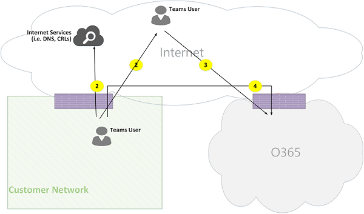
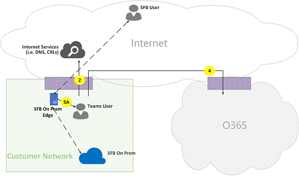
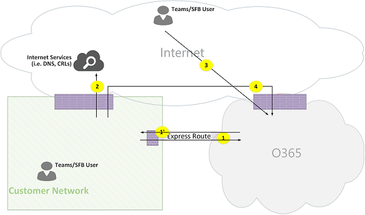

# Microsoft 팀 통화 흐름

> [!Tip]
> 팀 네트워크를 활용 하는 방법과 최적의 네트워크 연결을 계획 하는 방법에 대 한 자세한 내용은 다음 세션을 시청 하세요. [팀 네트워크 계획](https://aka.ms/teams-networking)

## 개요
이 문서에서는 팀이 다양 한 토폴로지에서 Office 365 호출 흐름을 사용 하는 방법에 대해 설명 합니다. 또한 피어 투 피어 미디어 통신에 사용 되는 고유한 팀 흐름에 대해 설명 합니다. 이 문서에서는 이러한 흐름, 해당 용도, 그리고 네트워크의 원본 및 종료에 대해 설명 합니다. 이 문서의 목적을 위해 다음과 같은 사항을 가정 합니다.

- 흐름 X는 온-프레미스 Office 365 클라이언트에서 클라우드의 Office 365 서비스와 통신 하는 데 사용 됩니다. 이는 고객 네트워크에서 발생 하며 Office 365의 끝점으로 종료 됩니다.

- 흐름 Y는 온-프레미스 Office 365 클라이언트에서 Office 365에 종속 된 인터넷 서비스와 통신 하는 데 사용 됩니다. 이는 고객 네트워크에서 발생 하며 인터넷의 끝점으로 종료 됩니다.

이 문서에는 다음 섹션이 포함 되어 있습니다.

- **백그라운드** -Office 365 흐름이 통과 하는 네트워크, 트래픽 종류, 고객 네트워크에서 Office 365 서비스 끝점으로의 연결 지침, 타사 구성 요소와의 상호 운용성 등의 배경 정보를 제공 합니다. 팀에서 미디어 흐름을 선택 하는 데 사용 하는 원칙입니다.

- **다양 한 토폴로지의 통화 흐름** -다양 한 토폴로지에서의 통화 흐름 사용을 보여 줍니다. 각 토폴로지에 대해 섹션은 지원 되는 모든 흐름을 열거 하 고 여러 사용 사례를 통해 이러한 흐름을 사용 하는 방법을 보여 줍니다. 각 사용 사례에 대해 흐름 다이어그램을 통해 흐름의 순서 및 선택 영역을 설명 합니다. 

- **Express 경로 최적화를 사용** 하는 팀-빠른 경로가 최적화를 위해 배포 될 때 이러한 흐름을 사용 하는 방법을 설명 합니다 (간단한 토폴로지를 통해 설명).

## 배경
### 네트워크 세그먼트
**고객 네트워크**: 사용자가 제어 하 고 관리 하는 네트워크 세그먼트입니다. 여기에는 유선 또는 무선, 사무실 건물, 온-프레미스 데이터 센터, 인터넷 공급자, Express 경로 또는 기타 사설 피어 링에 대 한 연결 등 고객 사무실 내의 모든 고객 연결이 포함 됩니다. 

일반적으로 고객 네트워크에는 방화벽 및/또는 프록시 서버와의 여러 네트워크 perimeters 있으므로 조직의 보안 정책을 적용 하 고 설정 하 고 구성한 특정 네트워크 트래픽만 허용 합니다. 이 네트워크를 관리 하기 때문에 네트워크의 성능을 직접 제어 하는 것이 좋으며 네트워크의 사이트 내에서 그리고 네트워크에서 Office 365 네트워크로의 성능에 대 한 유효성을 검사 하기 위해 네트워크 평가를 완료 하는 것이 좋습니다. 

**인터넷**: 고객 네트워크 외부에서 Office 365에 연결 하는 사용자가 사용할 전체 네트워크의 일부인 네트워크 세그먼트입니다. 또한 일부는 고객 네트워크에서 Office 365에 이르기까지 일부 소통에도 사용 됩니다. 

**방문한/게스트 개인 네트워크**:이 네트워크 세그먼트는 사용자 및/또는 게스트가 방문할 수 있는 고객 네트워크 외부에 있지만, 공개 인터넷에 있지는 않습니다. 예를 들어 홈 개인 네트워크 또는 팀 서비스와 상호 작용 하는 사용자 및/또는 고객이 상주할 수 있는 팀을 배포 하지 않는 엔터프라이즈 개인 네트워크입니다.

>**참고**: Office 365에 대 한 연결도 다음 네트워크에 적용 됩니다.

**Office 365**: office 365 서비스를 지 원하는 네트워크 세그먼트입니다. 대부분의 지역에서 고객 네트워크에 근접 한 가장자리를 사용 하 여 전세계에 배포 됩니다. 이 문서에 언급 된 함수에는 전송 릴레이, 회의 서버, 미디어 프로세서 등이 포함 됩니다. 

**Express 경로 (선택 사항)**: 사용자가 Office 365 네트워크에 대 한 전용 개인 연결을 제공 하는 전체 네트워크의 일부인 네트워크 세그먼트입니다.

### 트래픽 종류

**실시간 미디어**: RTP (실시간 전송 프로토콜) 내에서 오디오, 비디오 및 화면 공유 작업을 지 원하는 데이터 캡슐화 일반적으로 미디어 트래픽은 매우 많은 대기 시간을 차지 하므로,이 트래픽을 최대한의 직접적인 경로를 사용 하 고, 품질 관점에서 대화형 실시간 미디어에 가장 적합 한 전송 계층 프로토콜로 UDP와 TCP를 함께 사용할 수 있도록 해야 합니다. . (참고: 미디어는 마지막 수단으로 TCP/IP를 사용 하 고 HTTP 프로토콜 내 에서도 터널링 될 수 있지만 잘못 된 품질에 영향을 미치지 않습니다.) RTP 흐름은 페이로드만 암호화 되는 SRTP를 통해 보호 됩니다.

**신호**: 클라이언트와 서버 간의 통신 링크 또는 활동을 제어 하는 데 사용 되는 다른 클라이언트 (예를 들어 통화가 시작 되는 경우) 및 인스턴트 메시지를 제공 합니다. 대부분의 신호 트래픽은 HTTPS 기반 REST 인터페이스를 사용 하지만 (예: Office 365와 세션 경계 컨트롤러 간 연결) SIP 프로토콜을 사용 합니다. 이 소통량은 대기 시간에 대 한 중요 한 영향을 받지만, 끝점 간의 대기 시간이 몇 초를 초과 하는 경우 서비스 중단 또는 호출 시간 초과가 발생할 수 있다는 점을 이해 하는 것이 중요 합니다. 

### Office 365에 대 한 연결

팀이 [인터넷에 연결](https://support.office.com/article/connectivity-to-the-internet-64b420ef-0218-48f6-8a34-74bb27633b10)되어 있어야 합니다. [Office 365 url 및 ip 주소 범위](https://docs.microsoft.com/office365/enterprise/urls-and-ip-address-ranges)에 팀 끝점 URL 및 ip 주소 범위가 나열 됩니다. (참고: TCP 포트 80 및 443에 대 한 연결이 열려 있고 UDP 포트 3478 ~ 3481이 필요 합니다.) 또한, 팀이 인터넷에 연결 되어 있어야 하는 비즈니스용 Skype Online에 종속 되어 있습니다.

팀 미디어 흐름 연결은 표준 IETF ICE (대화형 연결 설정) 절차를 통해 구현 됩니다.

### 상호 운용성 제한
**제 3 자 미디어 릴레이**: 팀 미디어 흐름 (즉, 미디어 끝점 중 하나가 팀) 인 경우 팀 또는 비즈니스용 Skype 기본 미디어 릴레이만 통과할 수 있습니다. 타사 미디어 릴레이와의 상호 운용성은 지원 되지 않습니다. (참고: PSTN을 사용 하는 경계의 타사 SBC는 RTP/RTCP 스트림을 종료 하 고 SRTP를 통해 보호 되며 다음 홉으로 릴레이 하지 않아야 합니다.)

**제 3 자 SIP 프록시 서버**: 타사 SBC 및/또는 게이트웨이에서 SIP 대화를 통해 신호를 보내는 팀이 팀 또는 비즈니스용 SKYPE 기본 SIP 프록시를 통과 했을 수 있습니다. 타사 SIP 프록시와의 상호 운용성은 지원 되지 않습니다.

타사 **B2BUA (즉, SBC)**: PSTN에서/로의 팀 미디어 흐름은 제 3 자 SBC에 의해 종료 됩니다. 그러나 팀 네트워크 내의 타사 SBC와의 상호 운용성 (즉, 타사 SBC mediates 두 팀/비즈니스용 Skype 끝점)은 지원 되지 않습니다.

### Microsoft 팀에 권장 되지 않는 기술

**VPN 네트워크**: 미디어 트래픽 (즉, 흐름 2)에는 권장 되지 않습니다. VPN 클라이언트는에 https://blogs.technet.microsoft.com/nexthop/2011/11/14/enabling-lync-media-to-bypass-a-vpn-tunnel/지정 된 대로 vpn 분할을 사용 하 고 외부 이외의 모든 사용자와 같은 미디어 트래픽을 라우팅 해야 합니다.

>**참고**: 제목은 Lync 이지만 팀에도 적용 됩니다.

**패킷 shapers**: 모든 종류의 패킷 snippers, 패킷 검사 또는 패킷 shaper 장치는 권장 되지 않으며 품질을 대폭 저하 시킬 수 있습니다. 

### 원칙은
Microsoft 팀의 통화 흐름을 이해 하는 데 도움이 되는 네 가지 일반적인 원칙이 있습니다.
 
1.  Microsoft 팀 회의는 첫 번째 참가자가 참여 한 동일한 지역에서 Office 365을 통해 호스팅됩니다. (참고: 일부 토폴로지에서는이 규칙에 대 한 예외가 발생 하는 경우이 문서에서 설명 하 고 적절 한 호출 흐름에 의해 제시 됩니다.)

2.  Office 365의 팀 미디어 끝점은 미디어 처리 요구 사항에 기반 하 여 통화 유형을 기반으로 하지 않는 경우에 사용 됩니다. 예를 들어 지점 간 통화는 클라우드에서 미디어 끝점을 사용 하 여 레코딩 및/또는 녹음/녹화에 대 한 미디어를 처리 하는 반면, 참가자 두 명의 회의가 클라우드의 미디어 끝점을 사용 하지 못할 수 있습니다. 그러나 대부분의 컨퍼런스는 회의가 호스팅되는 위치에 할당 된 혼합 및 라우팅 목적으로 미디어 끝점을 사용 합니다. 클라이언트에서 미디어 끝점으로 전송 된 미디어 트래픽은 직접 라우팅하거나 고객 네트워크 방화벽 제한으로 인해 필요한 경우 Office 365에서 전송 릴레이를 사용할 수 있습니다. 

3.  피어 투 피어 통화에 대 한 미디어 트래픽은 호출이 클라우드에서 미디어 끝점을 요구 하지 않는다고 가정 하 여 사용할 수 있는 가장 직접적인 경로를 사용 합니다 (위 #2 참조). 기본 설정 경로는 원격 피어 (클라이언트)로 직접 이동 하지만 해당 경로를 사용할 수 없는 경우 하나 이상의 전송 중계에서 트래픽을 릴레이 합니다. 미디어 트래픽은 미디어 품질에 영향을 주므로 패킷 shapers, VPN 서버 등의 서버에는이를 가로 방향으로 설정 하지 않는 것이 좋습니다.

4.  신호 소통량은 항상 사용자에 게 가장 가까운 서버로 이동 합니다. 

선택한 미디어 경로의 세부 정보에 대 한 자세한 내용은을 참조 https://www.youtube.com/watch?v=1tmHMIlAQdo하세요.

## 다양 한 토폴로지의 통화 흐름
### 팀 토폴로지
이 토폴로지는 비즈니스용 Skype Server 또는 전화 시스템 다이렉트 라우팅과 같이 온-프레미스 배포를 사용 하지 않고 클라우드에서 팀 서비스를 활용 하는 고객에 게 사용 됩니다. 또한 Office 365에 대 한 인터페이스는 Azure Express 경로가 없는 인터넷을 통해 수행 됩니다. 

*그림 1-팀 토폴로지*

다음 사항에 유의 하세요.

- 위의 다이어그램에 있는 화살표의 방향은 엔터프라이즈 perimeters 연결에 영향을 주는 통신의 시작 방향을 반영 합니다. 미디어에 대 한 UDP의 경우 첫 번째 패킷이 역방향으로 흐를 수 있지만 다른 방향의 패킷이 흐를 때까지 이러한 패킷이 차단 될 수 있습니다.
- 팀은 비즈니스용 Skype Online과 나란히 배포 되므로 클라이언트는 "팀/SFB 사용자"로 표시 됩니다.

나중에이 문서에서 다음 선택적 토폴로지에 대 한 자세한 내용을 확인할 수 있습니다.

- 비즈니스용 Skype 온-프레미스 배포는 **팀 하이브리드 토폴로지에서**설명 합니다.
- 휴대폰 시스템 다이렉트 라우팅 (PSTN 연결의 경우)은 **다이렉트 라우팅 토폴로지가 있는 팀**에 설명 되어 있습니다.
- Express 경로는 **Express 경로 최적화를 사용 하 여 팀**에서 설명 합니다.

**흐름 설명**:
- **흐름 2** – 사용자의 팀 경험의 일부로 고객 네트워크의 사용자가 인터넷으로 시작 하는 흐름을 나타냅니다. 이러한 흐름의 예로는 DNS 및 피어 투 피어 미디어가 있습니다.
- **흐름 2 '** – 고객 네트워크에 대 한 VPN을 사용 하 여 원격 모바일 팀 사용자가 시작한 흐름을 나타냅니다. 
- **흐름 3** – 원격 모바일 팀 사용자가 Office 365/팀 끝점으로 시작 하는 흐름을 나타냅니다. 
- **흐름 4** – 고객 네트워크의 사용자가 Office 365/팀 끝점으로 시작 하는 흐름을 나타냅니다.
- **흐름 5** – 고객 네트워크 내의 팀 사용자와 다른 팀 또는 비즈니스용 Skype 사용자 간 피어 투 피어 미디어 흐름을 나타냅니다.
- **흐름 6** – 원격 모바일 팀 사용자와 다른 원격 모바일 팀과 인터넷을 통한 비즈니스용 Skype 사용자 간의 피어 투 피어 미디어 흐름을 나타냅니다.

#### 사용 사례: 일대일
일대일 통화는 호출자가 IP 주소/포트 (즉, 릴레이에 표시 되는 클라이언트의 공용 IP 주소) 후보를 포함 하는 여러 후보를 사용 하는 모델을 만듭니다. 발신자는이 후보를 호출한 파티에 보냅니다. 또한 호출 당사자는 유사한 후보 집합을 가져와 호출자에 게 보냅니다. STUN 연결 검사 메시지를 사용 하 여 어떤 호출자/호출 된 파티 미디어 경로가 작동 하 고 가장 적합 한 작업 경로가 선택 되어 있는지 확인 합니다. 미디어 (즉, SRTP를 통해 보안 된 RTP/RTCP packets)는 선택한 후보 쌍을 사용 하 여 전송 됩니다. 전송 릴레이가 Office 365의 일부로 배포 됩니다.

로컬 IP 주소/포트 후보자 또는 재귀 후보의 연결 되 면 클라이언트 (또는 NAT)를 통해 미디어에 대 한 직접 경로를 선택 합니다. 클라이언트가 고객 네트워크에 있는 경우 직접 경로를 선택 해야 합니다. 이를 위해서는 고객 네트워크 내에서 직접 UDP 연결이 필요 합니다. 클라이언트가 nomadic 클라우드 사용자 이면 NAT/방화벽에 따라 미디어에서 직접 연결을 사용할 수 있습니다.

클라이언트가 고객 네트워크 내부에 있고 한 클라이언트가 외부 (예: 모바일 클라우드 사용자) 인 경우에는 로컬 또는 재귀 후보자 간의 직접 연결이 작동 하지 않을 수 있습니다. 이 경우, 예를 들어 내부 클라이언트가 Office 365의 전송 릴레이에서 릴레이 후보를 획득 한 경우, 외부 클라이언트는 STUN/RTP/RTCP packets를 다음에 보낼 수 있어야 하는 경우와 같이 두 클라이언트의 전송 릴레이 후보 중 하나를 사용 하는 옵션이 있습니다. 전송 릴레이). 또 다른 옵션은 내부 클라이언트가 모바일 클라우드 클라이언트에서 받은 릴레이 후보로 전송 하는 것입니다. 미디어에 대 한 UDP 연결을 적극 권장 하지만, TCP가 지원 된다는 점에 유의 하세요.

**상위 수준 단계**:
1. 팀 사용자 A flow2를 통해 DNS (URL 도메인 이름)를 확인 합니다.
2. 팀 사용자 A가 흐름 4를 통해 팀 전송 릴레이의 미디어 릴레이 포트를 할당 합니다.
3. 팀 사용자 A가 흐름 4를 통해 Office 365으로 "초대"를 보냅니다.
4. Office 365에서 흐름 4를 통해 팀 사용자 B에 게 알림 전송
5. 팀 사용자 B가 흐름 4를 통해 팀 전송 릴레이의 미디어 릴레이 포트를 할당 합니다.
6. 팀 사용자 B는 흐름 4를 통해 "answer" 라는 발송 후보로 전송 되며 흐름 4를 통해 다시 팀 사용자 A로 착신 전환 됩니다.
7. 팀 사용자 A 및 팀 사용자 B가 ICE connectivity 테스트를 호출 하 고 가장 적합 한 미디어 경로가 선택 되어 있습니다 (다양 한 사용 사례를 보려면 아래 다이어그램 참조).
8. 팀 사용자가 흐름 4를 통해 Office 365로 원격 분석을 보냅니다.

**고객 네트워크 내:**

*그림 2-고객 네트워크 내*
 
7 단계에서 피어 투 피어 미디어 흐름 5가 선택 됩니다.
 
미디어는 양방향입니다. 흐름 5의 방향은이 문서의 모든 흐름과 일관성을 유지 하면서 연결 관점에서 통신을 시작 함을 나타냅니다. 이 경우 두 종점이 모두 고객 네트워크 내에 있기 때문에 사용 되는 방향은 중요 하지 않습니다.

**외부 사용자에 대 한 고객 네트워크 (팀에서 전송 릴레이가 전달 하는 미디어 릴레이):**

*그림 3-외부 사용자에 대 한 고객 네트워크 (팀에서 전송 릴레이가 전달 하는 미디어 릴레이)*
 
7 단계에서 고객 네트워크에서 Office 365로 이동 하 고, 원격 모바일 팀 사용자에서 Office 365로 흐름 3을 선택 합니다. 이러한 흐름은 Office 365 내의 팀 전송 릴레이가 릴레이 합니다.

미디어는 양방향 이며, 방향은 연결 관점에서 통신을 시작 하는 측면을 나타냅니다. 이 경우 이러한 흐름은 다른 전송 프로토콜과 주소를 통해 신호 및 미디어에 사용 됩니다.

**외부 사용자에 대 한 고객 네트워크 (직접 미디어):**

*그림 4-외부 사용자에 대 한 고객 네트워크 (직접 미디어)*
 
7 단계에서 고객 네트워크에서 인터넷 (클라이언트 피어)으로 흐름 2가 선택 되었습니다.
- 원격 모바일 사용자와의 다이렉트 미디어 (즉, Office 365를 통해 릴레이할 수 없음)는 선택 사항입니다. 즉, 고객은이 경로를 차단 하 여 Office 365의 전송 릴레이를 통해 미디어 경로를 적용할 수 있습니다.

- 미디어는 양방향입니다. 흐름 2에서 원격 모바일 사용자에 대 한 방향은 연결 관점에서 통신을 시작 한다는 것을 나타냅니다. 

**내부 사용자에 대 한 VPN 사용자 (팀에서 전송 하는 미디어 릴레이)**

*그림 5-내부 사용자에 대 한 VPN 사용자 (팀에서 전송 하는 미디어 릴레이)*
 
VPN을 고객 네트워크로 보내는 신호는 흐름 2를 통해 수신 합니다. 고객 네트워크와 Office 365 간의 신호는 흐름 4를 통해 구분 됩니다. 그러나 미디어는 VPN을 우회 하 고 Office 365의 흐름 3 및 4에서 팀 미디어 릴레이를 통해 라우팅되는 것입니다.

**내부 사용자에 대 한 VPN 사용자 (직접 미디어)**

*그림 6-내부 사용자에 대 한 VPN 사용자 (직접 미디어)*

VPN을 고객 네트워크로 보내는 신호는 흐름 2를 통해 수신 합니다. 고객 네트워크와 Office 365 간의 신호는 흐름 4를 통해 구분 됩니다. 그러나 미디어는 VPN을 우회 하 고 고객 네트워크의 흐름 2를 통해 인터넷에 전달 됩니다.

미디어는 양방향입니다. 원격 모바일 사용자에 대 한 흐름 2의 방향은 연결 관점에서 통신을 시작 한다는 것을 나타냅니다.

**외부 사용자에 대 한 VPN 사용자 (직접 미디어)**

*그림 7-외부 사용자에 대 한 VPN 사용자 (직접 미디어)*

VPN 사용자와 고객 네트워크 간 신호는 흐름 2 ' 및 흐름 4를 통해 Office 365를 통해 수신 합니다. 그러나 미디어는 VPN을 우회 하 고 흐름 6을 통해 라우팅됩니다.

미디어는 양방향입니다. 원격 모바일 사용자에 대 한 흐름 6의 방향은 연결 관점에서 통신을 시작 한다는 것을 나타냅니다.

#### 사용 사례: Office 365 트렁크를 통해 PSTN에 대 한 팀
Office 365에는 PSTN (공공 교환 전화 네트워크)에서 전화를 걸고 받을 수 있는 전화기 시스템이 있습니다. PSTN 트렁크가 전화 시스템 통화 요금제를 통해 연결 된 경우에는이 사용 사례에 대 한 특별 한 연결 요구 사항이 없습니다. (사용자의 온-프레미스 PSTN 트렁크를 Office 365에 연결 하려는 경우 전화 시스템 다이렉트 라우팅을 사용할 수 있습니다.)

*그림 8-Office 365 트렁크를 통해 PSTN 용 팀*

#### 사용 사례: 팀 모임

오디오/비디오/화면 공유 (VBSS) 회의 서버는 Office 365의 일부입니다. 이 주소에는 고객 네트워크에서 접근할 수 있어야 하 고 Nomadic 클라우드 클라이언트에서 연결할 수 있어야 하는 공용 IP 주소가 있습니다. 각 클라이언트/끝점은 회의 서버에 연결할 수 있어야 합니다.

내부 클라이언트는 일대일 통화에 대해 설명 하는 것과 동일한 방식으로 로컬, 재귀 및 릴레이 후보를 가져옵니다. 클라이언트는이 후보자를 초대의 회의 서버로 보냅니다. 회의 서버에는 공용으로 연결할 수 있는 IP 주소가 있으므로 릴레이가 사용 되지 않으므로 해당 로컬 IP 주소 후보에 응답 합니다. 클라이언트와 회의 서버는 일대일 통화에 대해 설명 된 것과 동일한 방식으로 연결을 확인 합니다. 

다음 사항에 유의 하세요.

- 팀 클라이언트는 비즈니스용 Skype 모임에 참가할 수 없으며 비즈니스용 Skype 클라이언트가 팀 모임에 참가할 수 없습니다.

- 사용자가 모임 이끌이 PSTN 통화 및/또는 회의 프로 비전에 따라 선택적으로 "전화를 거는" 또는 "전화 걸기"로 설정 됩니다. 

- 게스트 사용자 또는 고객 사용자는 엄격한 규칙이 있는 FW/NAT를 통해 보호 되는 게스트 개인 네트워크에서 참가할 수 있습니다.

*그림 9-팀 모임*

#### 사용 사례: 비즈니스용 Skype를 사용 하 여 온-프레미스 페더레이션

**Office 365의 팀에서 전송 릴레이가 전달 하는 미디어 릴레이**

*그림 10-Office 365에서 팀이 전송 하는 미디어 릴레이*

다음 사항에 유의 하세요.

- 페더레이션은 두 테 넌 트 간의 통신을 정의 합니다. 이 경우 테 넌 트 A는 비즈니스용 Skype를 사용 하는 테 넌 트 B를 사용 하는 federates 팀을 사용 합니다. 테 넌 트 B도 Office 365를 사용 하는 경우 비즈니스용 Skype 클라이언트는 흐름 3을 사용 하 여 Office 365에 연결 합니다.

- 페더레이션된 Skype for Business 클라이언트에서 온-프레미스 비즈니스용 Skype Server로의 신호 및 미디어는이 문서의 범위를 벗어났습니다. 이해를 돕기 위해 여기에 설명 되어 있습니다.

- Office 365의 게이트웨이에서 팀과 비즈니스용 Skype 간의 신호를 브리지로 사용할 수 있습니다.

- 이 경우 미디어는 Office 365의 팀 전송 릴레이가 흐름 4를 통해 고객 네트워크 및 원격 비즈니스용 Skype 클라이언트에 의해 릴레이 됩니다.

**페더레이션된 테 넌 트의 비즈니스용 Skype 미디어 릴레이에서 릴레이 된 미디어**

*그림 11-페더레이션된 테 넌 트의 비즈니스용 Skype 미디어 릴레이에서 릴레이 된 미디어*

다음 사항에 유의 하세요.

- 페더레이션된 Skype for Business 클라이언트에서 온-프레미스 비즈니스용 Skype 서버의 신호 및 미디어는이 문서의 범위를 벗어났습니다. 이해를 돕기 위해 여기에 설명 되어 있습니다.

- Office 365의 게이트웨이에서 팀과 비즈니스용 Skype 간의 신호를 브리지로 사용할 수 있습니다.

- 이 경우 미디어는 비즈니스용 Skype 온-프레미스 미디어 릴레이가 흐름 2를 통해 고객 네트워크에 릴레이 됩니다. (팀 사용자가 페더레이션된 고객 네트워크의 원격 미디어 릴레이로의 트래픽은 처음에는 역방향 방향의 트래픽이 흐름에 도달할 때까지 미디어 중계에 의해 차단 됨을 참고 하세요. 하지만 양방향 흐름은 양방향으로 연결을 엽니다.

**Direct (피어 투 피어)**

*그림 12-다이렉트 (피어 투 피어)*

### 팀 하이브리드 토폴로지
이 토폴로지에는 비즈니스용 Skype 온-프레미스 배포가 있는 팀이 포함 되어 있습니다.

*그림 13-팀 하이브리드 토폴로지*
 
- 위의 다이어그램에 있는 화살표의 방향은 엔터프라이즈 perimeters 연결에 영향을 주는 통신의 시작 방향을 반영 합니다. 미디어에 대 한 UDP의 경우 첫 번째 패킷이 역방향으로 흐를 수 있지만 다른 방향의 패킷이 흐를 때까지 이러한 패킷이 차단 될 수 있습니다.

- 팀은 비즈니스용 Skype Online과 나란히 배포 되므로 클라이언트는 "팀/SFB 사용자"로 표시 됩니다.

추가 흐름 (팀 토폴로지 맨 위):
- **흐름 5a** – 고객 네트워크 내의 팀 사용자와 고객 네트워크 Edge의 비즈니스용 Skype 온-프레미스 미디어 릴레이 간 피어 투 피어 미디어 흐름을 나타냅니다.

#### 사용 사례: 비즈니스용 Skype 일대일/one 팀
**고객 네트워크 내부의 하이브리드**

*그림 14-고객 네트워크 내의 하이브리드*
 
Office 365의 게이트웨이에서 팀과 비즈니스용 Skype 간의 신호를 브리지로 사용할 수 있습니다. 그러나 미디어는 고객 네트워크 내에서 흐름 5를 통해 직접 피어 투 피어에 전달 됩니다.

**외부 비즈니스용 Skype 사용자와 하이브리드 고객 네트워크-Office 365에서 릴레이**

*그림 15-외부 비즈니스용 Skype 사용자가 있는 하이브리드 고객 네트워크-Office 365에서 릴레이*

다음 사항에 유의 하세요.

- 비즈니스용 Skype 클라이언트에서 온-프레미스 비즈니스용 Skype 서버에 대 한 신호 및 미디어는이 문서의 범위를 벗어났습니다. 이해를 돕기 위해 여기에 설명 되어 있습니다.

- Office 365의 게이트웨이에서 팀과 비즈니스용 Skype 간의 신호를 브리지로 사용할 수 있습니다.

- 미디어는 Office 365의 팀 전송 릴레이가 흐름 4를 통해 고객 네트워크로 릴레이 됩니다.

**외부 비즈니스용 Skype 사용자와 하이브리드 고객 네트워크-온-프레미스 Edge로 릴레이**

*그림 16-온-프레미스 Edge로 릴레이할 비즈니스용 Skype 사용자와 하이브리드 고객 네트워크*
 
다음 사항에 유의 하세요.

- 비즈니스용 Skype 클라이언트에서 온-프레미스 비즈니스용 Skype 서버에 대 한 신호 및 미디어는이 문서의 범위를 벗어났습니다. 이해를 돕기 위해 여기에 설명 되어 있습니다.

- 신호는 Office 365의 게이트웨이에서 브리지 됩니다.

- 미디어는 비즈니스용 Skype 온-프레미스 Edge 내의 비즈니스용 skype 미디어 릴레이에서 미디어 흐름 5A를 통해 고객 네트워크 내의 팀 사용자에 게 전달 됩니다.

### 전화 시스템 다이렉트 라우팅 토폴로지가 있는 팀
이 토폴로지에는 전화 시스템 다이렉트 라우팅이 있는 팀이 포함 됩니다. 

직접 라우팅은 지원 되는 온-프레미스 고객 소유 세션 경계 컨트롤러 (SBC) 하드웨어 장치를 Office 365와 연결 하 여 타사의 PSTN (공개 통신 네트워크) 서비스 공급자를 사용할 수 있도록 합니다. 해당 장치 

이 시나리오를 지원 하려면 고객은 Microsoft의 인증 파트너 중 하나에서 직접 라우팅에 대 한 인증 된 SBC를 배포 해야 합니다. SBC는 공급 업체에서 권장 하는 대로 구성 되어야 하 고, 직접 UDP 트래픽을 위해 Office 365에서 라우팅할 수 있습니다. 미디어는 팀 및/또는 비즈니스용 Skype 클라이언트에서 SBC로 직접 흐를 수 있습니다 (팀 게이트웨이 건너뜀) 또는 팀 게이트웨이를 통과 합니다. SBC와의 연결은 팀 게이트웨이를 우회 하도록 구성 된 경우 SBC에서 ICE가 지원 되는 얼음에 기반을 둔 반면, Business/비즈니스용 Skype media 끝점은 얼음으로 가득 찬 것을 지원 합니다. 

* 그림 17-전화 시스템 다이렉트 라우팅 토폴로지가 있는 팀

다음 사항에 유의 하세요.

- 위의 다이어그램에 있는 화살표의 방향은 엔터프라이즈 perimeters 연결에 영향을 주는 통신의 시작 방향을 반영 합니다. 미디어에 대 한 UDP의 경우 첫 번째 패킷이 역방향으로 흐를 수 있지만 다른 방향의 패킷이 흐를 때까지 이러한 패킷이 차단 될 수 있습니다.

- 팀은 비즈니스용 Skype Online과 나란히 배포 되므로 클라이언트는 "팀/SFB 사용자"로 표시 됩니다.

추가 흐름 (팀 온라인 토폴로지 맨 위):
- **흐름 4 '** -Office 365부터 고객 네트워크 까지의 흐름을 나타내며, 클라우드의 SBC를 사용 하 여 클라우드에서 팀 미디어 서버 간 연결을 설정 하는 데 사용 됩니다.
- **흐름 5b** – 우회 모드의 다이렉트 라우팅 SBC를 사용 하 여 고객 네트워크 내의 팀 사용자 간 미디어 흐름을 나타냅니다.
- **흐름 5c** – PSTN 연결 호출 우회 모드에서 직접 라우팅 sbc와 다른 직접 라우팅 sbc 사이의 미디어 흐름을 나타냅니다.

**직접적인 라우팅이 있는 내부 사용자 (Office 365의 팀에서 미디어를 릴레이 하는 방법 전송 릴레이)**

*그림 18-직접 라우팅이 있는 내부 사용자 (Office 365의 팀에서 전송 릴레이가 미디어를 릴레이할 때)*

다음 사항에 유의 하세요.
 
- SBC에는 Office 365에서 라우팅할 수 있는 공용 IP 주소가 있어야 합니다.

- SBC에서 Office 365로 신호 및 미디어를 보내고, 흐름 4 및/또는 흐름 4를 사용 합니다.

- 고객 네트워크 내의 클라이언트에서 Office 365으로 이동 하는 신호 및 미디어를 사용 하는 방법 4.

**직접 라우팅이 있는 원격 사용자 (미디어는 Office 365의 media server (MP)를 통해 라우트 됨)**

*그림 19-직접 라우팅이 있는 원격 사용자 (미디어는 Office 365의 media server (MP)를 통해 라우트됩니다)*
 
다음 사항에 유의 하세요.

- SBC에는 Office 365에서 라우팅할 수 있는 공용 IP 주소가 있어야 합니다.

- SBC에서 Office 365로 신호 및 미디어를 보내고, 흐름 4 및/또는 흐름 4를 사용 합니다.

- 인터넷의 클라이언트에서 Office 365로 신호 및 미디어를 사용 하는 것이 흐름 3

**내부 사용자 직접 라우팅 (미디어 바이패스)**

*그림 20-내부 사용자 직접 라우팅 (미디어 바이패스)*
 
다음 사항에 유의 하세요.

- SBC에는 Office 365에서 라우팅할 수 있는 공용 IP 주소가 있어야 합니다.

- SBC에서 Office 365로 신호를 보내고 그 반대의 경우 흐름 4 및/또는 흐름 4 '를 사용 합니다.

- 고객 네트워크 내의 클라이언트에서 Office 365으로 전송 되는 신호는 흐름 4를 사용 합니다.

- 고객 네트워크 내의 클라이언트에서 고객 네트워크에 있는 SBC에 대 한 미디어는 flow 5B로 사용 합니다.

**직접 라우팅이 있는 원격 사용자 (Office 365의 팀에서 전송 릴레이가 미디어를 우회 하 여 릴레이)**

*그림 21-직접 라우팅이 있는 원격 사용자 (Office 365의 팀에서 미디어를 사용 하 여 릴레이 전송 릴레이가 전달 됩니다.)*

다음 사항에 유의 하세요.

- SBC에는 Office 365 및 인터넷에서 라우팅할 수 있는 공용 IP 주소가 있어야 합니다.

- SBC에서 Office 365로 신호를 보내고 그 반대의 경우 흐름 4 및/또는 흐름 4를 사용 합니다.

- 인터넷의 클라이언트에서 Office 365로 신호를 보내는 것은 흐름 3을 사용 합니다.

- 고객 네트워크 내의 SBC에 대 한 인터넷 클라이언트의 미디어는 3 번 및 4 흐름을 사용 하 고, Office 365의 팀 전송 릴레이가 릴레이 합니다. 

**원격 사용자 직접 라우팅 (미디어 바이패스 다이렉트)**

*그림 22-원격 사용자 직접 라우팅 (미디어 바이패스 다이렉트)*
 
다음 사항에 유의 하세요.

- SBC에는 Office 365 및 인터넷에서 라우팅할 수 있는 공용 IP 주소가 있어야 합니다.

- SBC에서 Office 365로 신호를 보내고 그 반대의 경우 흐름 4 및/또는 흐름 4를 사용 합니다.

- 인터넷의 클라이언트에서 Office 365로 신호를 보내는 것은 흐름 3을 사용 합니다.

- 고객 네트워크 내의 SBC에 대 한 인터넷 클라이언트의 미디어는 흐름 2를 사용 합니다.

**다이렉트 라우팅 (미디어 바이패스) – PSTN 연결 통화 (착신 통화/전송로 인해)**

*그림 23-다이렉트 라우팅 (미디어 바이패스)-PSTN 연결 통화 (착신 통화/전송로 인해)*
 
다음 사항에 유의 하세요.

- SBC에는 Office 365에서 라우팅할 수 있는 공용 IP 주소가 있어야 합니다.

- SBC에서 Office 365로 신호를 보내고 그 반대의 경우 흐름 4 및/또는 흐름 4를 사용 합니다.

- 클라이언트가 PSTN에서 PSTN으로 전화를 hairpinned 후 신호 및 미디어 루프를 벗어났습니다.

- 고객 네트워크 내의 sbc 인스턴스 A의 미디어를 고객 네트워크 내의 SBC 인스턴스 B (여기서, A 및 B는 같은 인스턴스일 수 있음)에서 흐름 5C를 사용 합니다.

**다이렉트 라우팅 (Office 365)-2 개의 테 넌 트를 통해 PSTN 연결 통화**

*그림 24-다이렉트 라우팅 (Office 365)-2 개의 테 넌 트를 통해 PSTN 연결 통화*
 
다음 사항에 유의 하세요.

- SBC에는 Office 365에서 라우팅할 수 있는 공용 IP 주소가 있어야 합니다.

- SBC에서 Office 365로 신호를 보내고 그 반대의 경우 흐름 4 및/또는 흐름 4를 사용 합니다.

- 클라이언트가 PSTN에서 PSTN으로 전화를 hairpinned 후 신호 및 미디어 루프를 벗어났습니다.

- 고객 네트워크 X의 sbc 인스턴스 B에 있는 SBC 인스턴스 A의 미디어는 Office 365 미디어 서버를 통해 릴레이 되어야 하며 우회 모드를 사용할 수 없습니다.

## Express 경로 최적화를 사용 하는 팀

*그림 25-Express 경로 최적화를 사용 하는 팀*
 
Express 경로를 정당화 및 배포 하는 경우 팀 흐름이 흐름 4에서 흐름 1, 흐름 4 '에서 흐름 1 '으로 다시 라우팅될 수 있습니다. 그러나 팀 응용 프로그램에는 다른 Office 365에서 흐름 4 및 4를 통해 인터넷을 통해 전달 되는 하드 종속성이 있습니다. 따라서 이러한 흐름은 차단 되지 않아야 합니다. 

비즈니스용 Skype 하이브리드 Edge 트래픽은 인터넷으로 라우팅되며, 외부 사용자와 통신 하 고 다른 테 넌 트와 페더레이션 하기 위해 경로를 표현할 수 없습니다. 

비대칭 흐름을 방지 하려면 다시 라우팅이 양방향으로 진행 되어야 합니다. 즉, 고객 네트워크 내의 주소는 최적화에 기반 하 여 인터넷 또는 Express 경로를 통해 라우팅할 수 있지만 두 가지를 모두 사용 하지는 않습니다.

예를 들면 다음과 같습니다.

**외부 사용자에 대 한 고객 네트워크 (팀에서 전송 릴레이가 전달 하는 미디어 릴레이):**

*그림 26-외부 사용자에 대 한 고객 네트워크 (팀에서 전송 릴레이가 전달 하는 미디어 릴레이)*
 
**상위 수준 단계:**
1. 고객 네트워크 내의 팀 사용자가 flow2를 통해 DNS (URL 도메인 이름)를 확인 합니다.
2. 고객 네트워크 내의 팀 사용자는 흐름 1을 통해 팀의 전송 릴레이가 미디어 릴레이 포트를 할당 합니다.
3. 고객 네트워크 내의 팀 사용자는 흐름 1을 통해 Office 365를 통해 "초대"를 얼음 후보로 보냅니다.
4. OFFICE 365에서는 흐름 3을 통해 외부 팀 사용자에 게 알림을 보냅니다.
5. 팀 외부 사용자는 흐름 3을 통해 팀의 전송 릴레이에 미디어 릴레이 포트를 할당 합니다.
6. 팀 외부 사용자는 흐름 3을 통해 ICE 후보자와 "answer"를 전송 하 여 흐름 1 사용자 A로 다시 착신 전환 되는를 팀에 전달 합니다.
7. 팀 사용자 A 및 팀 사용자 B가 ICE connectivity 테스트를 호출 하 고, Office 365의 팀 전송 릴레이가 릴레이할 흐름 1 및 3을 선택 합니다.
8. 팀 사용자는 흐름 1 및 3을 통해 Office 365에 원격 분석을 보냅니다.

>**참고**: 흐름 4를 요구 하는 다른 마이크로 서비스에서 팀 응용 프로그램에 대 한 종속성을 지원 하려면 흐름 4를 사용 하도록 설정 해야 합니다.
