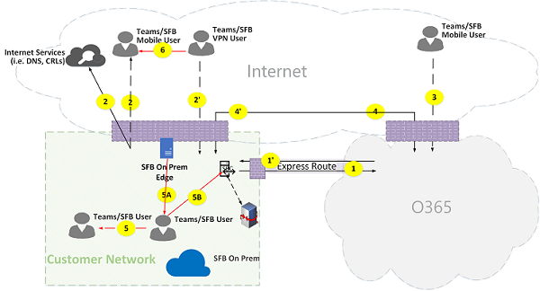

# Microsoft Teams 통화 흐름

> [!TIP]
> 이 세션에서는 Teams가 네트워크를 활용하는 방법과 최적의 네트워크 연결을 계획하는 방법( [Teams 네트워크 계획)을 알아보는 세션을 시청합니다.](https://aka.ms/teams-networking)

## 개요

이 문서에서는 Teams가 다양한 토폴로지에서 Microsoft 365 또는 Office 365 통화 흐름을 사용하는 방법을 설명하고 있습니다. 또한 피어 투 피어 미디어 통신에 사용되는 고유한 Teams 흐름에 대해 설명하고 있습니다. 이 문서에서는 이러한 흐름, 해당 목적 및 네트워크의 원본 및 종료에 대해 설명하고 있습니다. 이 문서에서는 다음을 가정합니다.

- Flow X는 클라우드에서 Microsoft 365 또는 Office 365 서비스와 통신하는 데는 클라우드 클라이언트에서 사용됩니다. 고객 네트워크에서 시작하여 Microsoft 365 또는 Office 365에서 엔드포인트로 종료됩니다.

- Flow Y는 Microsoft 365 또는 Office 365가 종속된 인터넷의 서비스와 통신하는 데 사용할 수 있습니다. 고객 네트워크에서 시작되고 인터넷의 엔드포인트로 종료됩니다.

이 문서에서는 다음 정보를 다 제공합니다.

- **배경.** 흐름이 트래버스할 수 있는 네트워크, 트래픽 유형, 고객 네트워크에서 Microsoft 365 또는 Office 365 서비스 엔드포인트로의 연결 지침, 타사 구성 요소와의 상호 연동성, Teams에서 미디어 흐름을 선택하는 데 사용하는 원칙 등의 배경 정보를 제공합니다.

- **다양한 토폴로지에서 흐름을 호출합니다.** 다양한 토폴로지에서 호출 흐름을 사용하는 방법을 보여 합니다. 각 토폴로지의 경우 섹션에서는 지원되는 모든 흐름을 열회하고 이러한 흐름이 여러 사용 사례에서 사용되는 방법을 설명합니다. 각 사용 사례에 대해 흐름 다이어그램을 사용하여 흐름의 시퀀스 및 선택을 설명합니다.

- **Express 경로 최적화가 있는 Teams.** 간단한 토폴로지로 설명된 Express Route가 최적화를 위해 배포될 때 이러한 흐름이 사용되는 방법을 설명하고 있습니다.

## 배경

### 네트워크 세그먼트

**고객 네트워크.** 제어하고 관리하는 네트워크 세그먼트입니다. 여기에는 유선 또는 무선, 사무실 건물 간 연결, 프레미스 데이터 센터에 대한 연결, 인터넷 공급자, Express Route 또는 기타 개인 피어링에 대한 연결 등 고객 사무실 내의 모든 고객 연결이 포함됩니다.

일반적으로 고객 네트워크에는 방화벽 및/또는 프록시 서버가 있는 여러 네트워크 경계가 있습니다. 이 경계는 조직의 보안 정책을 적용하고 설정 및 구성한 특정 네트워크 트래픽만 허용합니다. 이 네트워크를 관리하기 때문에 네트워크 성능을 직접 제어할 수 있으며 네트워크 내의 사이트와 네트워크에서 Microsoft 365 또는 Office 365 네트워크로의 성능 유효성을 검사하기 위해 네트워크 평가를 완료하는 것이 좋습니다.

**인터넷.** 고객 네트워크 외부에서 Microsoft 365 또는 Office 365에 연결하는 사용자가 사용할 전체 네트워크의 일부인 네트워크 세그먼트입니다. 고객 네트워크에서 Microsoft 365 또는 Office 365로의 일부 트래픽에서도 사용됩니다.

**방문한 또는 게스트 개인 네트워크.** 이는 사용자와 게스트가 방문할 수 있는 공용 인터넷 외부의 네트워크 세그먼트입니다(예: 홈 개인 네트워크 또는 엔터프라이즈 개인 네트워크, Teams 서비스를 조작하는 사용자와 해당 고객이 있을 수 있는 Teams를 배포하지 않는 경우).

> [!NOTE]
> Microsoft 365 또는 Office 365에 대한 연결은 이러한 네트워크에도 적용할 수 있습니다.

**Microsoft 365 또는 Office 365.** Microsoft 365 또는 Office 365 서비스를 지원하는 네트워크 세그먼트입니다. 대부분의 위치에서 고객 네트워크에 근접한 에지가 있는 전 세계에 배포됩니다. 함수에는 전송 릴레이, 회의 서버 및 미디어 프로세서가 포함됩니다.

**Express Route(선택 사항)**. Microsoft 365 또는 Office 365 네트워크에 대한 전용 개인 연결을 제공하게 될 전체 네트워크의 일부인 네트워크 세그먼트입니다.

### 트래픽 유형

**실시간 미디어.** 오디오, 비디오 및 화면 공유 워크로드를 지원하는 RTP(실시간 전송 프로토콜) 내에서 캡슐화되는 데이터입니다. 일반적으로 미디어 트래픽은 대기 시간이 매우 길기 때문에 이 트래픽이 가능한 가장 직접적인 경로를 사용하게 하고, 품질 관점에서 대화형 실시간 미디어에 가장 적합한 전송 계층 프로토콜로 UDP와 TCP를 사용하려는 것입니다. (마지막 수단으로 미디어는 TCP/IP를 사용할 수 있으며 HTTP 프로토콜 내에서 터널링될 수도 있지만 품질이 나쁘기 때문에 권장되지 않습니다.) RTP 흐름은 페이로드만 암호화되는 SRTP를 사용하여 보호됩니다.

**신호.** 클라이언트와 서버 간의 통신 링크 또는 활동을 제어하는 데 사용되는 다른 클라이언트(예: 호출이 시작될 때) 및 인스턴트 메시지를 전달하는 데 사용됩니다. 대부분의 신호 트래픽은 HTTPS 기반 REST 인터페이스를 사용하며, 일부 시나리오(예: Microsoft 365 또는 Office 365와 세션 테두리 컨트롤러 간의 연결)에서는 SIP 프로토콜을 사용합니다. 이 트래픽은 대기 시간에 훨씬 덜 민감하지만 엔드포인트 간의 대기 시간이 몇 초를 초과하는 경우 서비스 중단 또는 호출 시간 제한이 발생할 수 있다는 것을 이해하는 것이 중요합니다.

### Microsoft 365 또는 Office 365에 연결

Teams는 [인터넷에 연결해야 합니다.](https://docs.microsoft.com/office365/enterprise/assessing-network-connectivity) Teams 엔드포인트 URL 및 IP 주소 범위는 [Office 365 URL](https://docs.microsoft.com/office365/enterprise/urls-and-ip-address-ranges)및 IP 주소 범위에 나열됩니다. (TCP 포트 80 및 443 및 UDP 포트 3478~3481에 대한 개방형 연결이 필요합니다.) 또한 Teams는 비즈니스용 Skype Online에 종속되고 인터넷에도 연결되어야 합니다.

Teams 미디어 흐름 연결은 표준 IETF ICE(대화형 연결 수립) 절차를 사용하여 구현됩니다.

### 상호 연동성 제한

**타사 미디어 릴레이.** Teams 미디어 흐름(즉, 미디어 끝점 중 하나는 Teams)은 Teams 또는 비즈니스용 Skype 네이티브 미디어 릴레이만 트래버스할 수 있습니다. 타사 미디어 릴레이와의 상호 연동성은 지원되지 않습니다. (PSTN을 사용하는 경계의 타사 SBC는 SRTP를 사용하여 보호되는 RTP/RTCP 스트림을 종료하고 다음 홉에 릴레이하지 말아야 합니다.)

**타사 SIP 프록시 서버.** 타사 SBC 및/또는 게이트웨이를 통해 SIP 대화 상자를 신호를 전송하는 Teams는 Teams 또는 비즈니스용 Skype 네이티브 SIPx를 트래버스할 수 있습니다. 타사 SIP 프록시와의 상호 연동성은 지원되지 않습니다.

**타사 B2BUA(또는 SBC)** PSTN과의 Teams 미디어 흐름은 타사 SBC에 의해 종료됩니다. 그러나 Teams 네트워크 내에서 타사 SBC와의 상호 연동성(타사 SBC가 Teams 또는 비즈니스용 Skype 엔드포인트 두 개를 중재하는 경우)은 지원되지 않습니다.

### Microsoft Teams에서 권장되지 않는 기술

**VPN 네트워크.** 미디어 트래픽(또는 흐름 2)에는 권장되지 않습니다. VPN 클라이언트는 분할된 VPN을 사용하고 Lync 미디어에서 VPN 터널을 우회하도록 설정에 지정된 모든 외부 비 VPN 사용자와 같은 미디어 트래픽을 [라우팅해야 합니다.](https://techcommunity.microsoft.com/t5/Skype-for-Business-Blog/Enabling-Lync-Media-to-Bypass-a-VPN-Tunnel/ba-p/620210)

> [!NOTE]
> 타이틀은 Lync를 나타내지만 Teams에도 적용할 수 있습니다.

**패킷 셰이더.** 모든 종류의 패킷 캡처, 패킷 검사 또는 패킷 셰이더 디바이스는 권장되지 않고 품질이 크게 저하될 수 있습니다.

### 원칙

Microsoft Teams의 통화 흐름을 이해하는 데 도움이 되는 네 가지 일반적인 원칙이 있습니다.

- Microsoft Teams 회의는 첫 번째 참가자가 참가한 동일한 지역에서 Microsoft 365 또는 Office 365에서 주최됩니다. (일부 토폴로지에서 이 규칙에 대한 예외가 있는 경우 이 문서에서 설명하고 적절한 호출 흐름에 의해 설명됩니다.)

- Microsoft 365 또는 Office 365의 Teams 미디어 엔드포인트는 통화 유형이 아닌 미디어 처리 요구에 따라 사용됩니다. (예를 들어 지점 간 호출은 클라우드의 미디어 엔드포인트를 사용하여 전사 또는 기록을 위해 미디어를 처리하고 두 참가자와의 회의는 클라우드에서 미디어 엔드포인트를 사용하지 않을 수 있습니다.) 그러나 대부분의 회의는 믹싱 및 라우팅을 위해 미디어 엔드포인트를 사용하며, 회의가 호스트되는 위치로 할당됩니다. 클라이언트에서 미디어 엔드포인트로 전송된 미디어 트래픽은 고객 네트워크 방화벽 제한으로 인해 필요한 경우 Microsoft 365 또는 Office 365에서 전송 릴레이를 직접 라우팅하거나 사용할 수 있습니다.

- 피어 투 피어 호출에 대한 미디어 트래픽은 호출이 클라우드의 미디어 엔드포인트를 지시하지 않는다고 전제로 하여 사용할 수 있는 가장 직접적인 경로를 취합니다(이전 원칙 참조). 기본 경로는 원격 피어(클라이언트)로 직접 연결되지만 해당 경로를 사용할 수 없는 경우 하나 이상의 전송 릴레이가 트래픽을 릴레이합니다. 미디어 품질에 영향을 미치기 때문에 미디어 트래픽은 패킷 셰이더, VPN 서버 등의 서버를 버스하지 않는 것이 좋습니다.

- 신호 트래픽은 항상 사용자에게 가장 가까운 서버로 전송됩니다.

선택한 미디어 경로에 대한 자세한 내용은 Microsoft Teams의 미디어 흐름 이해 [- BRK4016을 참조합니다.](https://www.youtube.com/watch?v=1tmHMIlAQdo)

## 다양한 토폴로지의 호출 흐름

### Teams 토폴로지

이 토폴로지는 비즈니스용 Skype 서버 또는 전화 시스템 직접 라우팅과 같은 모든 프레미스 배포 없이 클라우드에서 Teams 서비스를 활용하는 고객이 사용됩니다. 또한 Microsoft 365 또는 Office 365에 대한 인터페이스는 Azure Express Route 없이 인터넷을 통해 수행됩니다.

*그림 1 - Teams 토폴로지*

다음에 유의합니다.

- 위 다이어그램의 화살표 방향은 엔터프라이즈 경계의 연결에 영향을 주는 통신의 시작 방향을 반영합니다. 미디어용 UDP의 경우 첫 번째 패킷이 역방향으로 흐를 수 있지만, 다른 방향의 패킷이 흐를 때까지 이러한 패킷이 차단될 수 있습니다.
- Teams는 비즈니스용 Skype Online과 나란히 배포되어 클라이언트가 "Teams/SFB 사용자"로 표시됩니다.

이 문서의 나중에 다음 선택적 토폴로지에 대한 자세한 정보를 찾을 수 있습니다.

- 비즈니스용 Skype-프레미스 배포는 Teams 하이브리드 **토폴로지에서 설명합니다.**
- 전화 시스템 직접 라우팅(PSTN 연결용)은 직접 라우팅 토폴로지가 있는 **Teams에서 설명됩니다.**
- Express Route는 **Teams에서 Express Route 최적화를 통해 설명됩니다.**

**흐름 설명:**

- **흐름 2** – 고객의 Teams 환경의 일부로 고객 네트워크의 사용자가 인터넷에 시작한 흐름을 나타 내는 것입니다. 이러한 흐름의 예로는 DNS 및 피어 투 피어 미디어가 있습니다.
- **흐름 2'** – 고객 네트워크에 대한 VPN을 사용하여 원격 모바일 Teams 사용자가 시작한 흐름을 나타내며,
- **흐름 3** – 원격 모바일 Teams 사용자가 Microsoft 365 또는 Office 365/Teams 엔드포인트로 시작한 흐름을 나타내며,
- **흐름 4** – 고객 네트워크의 사용자가 Microsoft 365 또는 Office 365/Teams 엔드포인트에 대해 시작한 흐름을 나타내며,
- **흐름 5** – Teams 사용자와 다른 Teams 또는 고객 네트워크 내의 비즈니스용 Skype 사용자 간에 피어 투 피어 미디어 흐름을 나타내고 있습니다.
- **Flow 6** – 원격 모바일 Teams 사용자와 다른 원격 모바일 Teams 또는 인터넷을 통해 비즈니스용 Skype 사용자 간에 피어 투 피어 미디어 흐름을 나타 내는 경우

#### 사용 사례: 일대일

일대일 호출은 호출자가 로컬, 릴레이 및 reflexive(릴레이에서 볼 수 있는 클라이언트의 공용 IP 주소)를 포함하여 IP 주소/포트로 구성된 후보 집합을 얻는 공통 모델을 사용합니다. 호출자는 이러한 후보를 호출된 파티에 전송합니다. 또한 호출된 파티는 비슷한 후보 집합을 획득하여 발신자에게 전송합니다. STUN 연결 확인 메시지는 어떤 호출자/호출자 미디어 경로가 작동하고, 최상의 작업 경로가 선택된 것을 찾는 데 사용됩니다. 미디어(즉, SRTP를 사용하여 보호되는 RTP/RTCP 패킷)는 선택한 후보 쌍을 사용하여 전송됩니다. 전송 릴레이는 Microsoft 365 및 Office 365의 일부로 배포됩니다.

로컬 IP 주소/포트 후보 또는 반사 후보가 연결되면 클라이언트 간의 직접 경로(또는 NAT 사용)가 미디어에 대해 선택됩니다. 클라이언트가 모두 고객 네트워크에 있는 경우 직접 경로를 선택해야 합니다. 이렇게 하려면 고객 네트워크 내에서 직접 UDP 연결이 필요합니다. 클라이언트가 모두 유성 클라우드 사용자인 경우 NAT/방화벽에 따라 미디어가 직접 연결을 사용할 수 있습니다.

한 클라이언트가 고객 네트워크에 내부에 있으며 한 클라이언트가 외부 클라이언트(예: 모바일 클라우드 사용자)인 경우 로컬 또는 반사 후보 간의 직접 연결이 작동하지는 않습니다. 이 경우 옵션은 두 클라이언트에서 전송 릴레이 후보 중 하나를 사용하는 것입니다(예: 내부 클라이언트가 Microsoft 365 또는 Office 365의 전송 릴레이에서 릴레이 후보를 획득했습니다. 외부 클라이언트는 STUN/RTP/RTCP 패킷을 전송 릴레이로 보낼 수 있습니다. 또 다른 옵션은 내부 클라이언트가 모바일 클라우드 클라이언트에서 획득한 릴레이 후보로 보내는 것입니다. 미디어에 대한 UDP 연결이 권장되는 경우 TCP가 지원됩니다.

**고급 단계:**

1. Teams 사용자 A는 흐름 2를 사용하여 DNS(URL 도메인 이름)를 확인합니다.
1. Teams 사용자 A는 흐름 4를 사용하여 Teams 전송 릴레이에 미디어 릴레이 포트를 할당합니다.
1. Teams 사용자 A는 흐름 4를 사용하여 ICE 후보와 함께 "초대"를 Microsoft 365 또는 Office 365로 전송합니다.
1. Microsoft 365 또는 Office 365는 흐름 4를 사용하여 Teams 사용자 B에게 알림을 전송합니다.
1. Teams 사용자 B는 흐름 4를 사용하여 Teams 전송 릴레이에 미디어 릴레이 포트를 할당합니다.
1. Teams 사용자 B는 흐름 4를 사용하여 ICE 후보와 "답변"을 전송합니다. 흐름 4를 사용하여 Teams 사용자 A에게 다시 전달됩니다.
1. Teams 사용자 A와 Teams 사용자 B가 ICE 연결 테스트를 호출하고 사용 가능한 최상의 미디어 경로가 선택됩니다(다양한 사용 사례는 아래 다이어그램 참조).
1. Teams 사용자는 흐름 4를 사용하여 Microsoft 365 또는 Office 365에 원격 분석 데이터를 전송합니다.

**고객 네트워크 내에서:**

*그림 2 - 고객 네트워크 내*

7단계에서 피어 투 피어 미디어 흐름 5가 선택됩니다.

미디어는 양방향입니다. 흐름 5의 방향은 한 쪽이 연결 관점에서 통신을 시작하고 이 문서의 모든 흐름과 일치하다는 것입니다. 이 경우 두 엔드포인트가 모두 고객 네트워크 내에 있기 때문에 어떤 방향이 사용되는지 중요하지 않습니다.

**고객 네트워크-외부 사용자(Teams 전송 릴레이에서 릴레이된 미디어):**

*그림 3 - 외부 사용자에 대한 고객 네트워크(Teams 전송 릴레이에서 릴레이된 미디어)*

7단계에서는 고객 네트워크에서 Microsoft 365 또는 Office 365로의 흐름 4, 그리고 원격 모바일 Teams 사용자에서 Microsoft 365 또는 Office 365로의 흐름 3이 선택됩니다. 이러한 흐름은 Microsoft 365 또는 Office 365 내에서 Teams 전송 릴레이에 의해 릴레이됩니다.

미디어는 양방향입니다. 여기서 방향은 연결 관점에서 통신을 시작하는 쪽을 나타냅니다. 이 경우 이러한 흐름은 서로 다른 전송 프로토콜 및 주소를 사용하여 신호 및 미디어에 사용됩니다.

**외부 사용자(직접 미디어)에 대한 고객 네트워크:**

*그림 4 - 외부 사용자에 대한 고객 네트워크(직접 미디어)*

7단계에서 고객 네트워크에서 인터넷(클라이언트의 피어)으로의 흐름 2가 선택됩니다.

- 원격 모바일 사용자가 있는 직접 미디어(Microsoft 365 또는 Office 365를 통해 릴레이되지 않은)는 선택 사항입니다. 즉, 고객이 Microsoft 365 또는 Office 365에서 전송 릴레이를 통해 미디어 경로를 적용하기 위해 이 경로를 차단할 수 있습니다.

- 미디어는 양방향입니다. 흐름 2에서 원격 모바일 사용자로의 방향은 한 쪽이 연결 관점에서 통신을 시작하고 있는 것입니다.

**내부 사용자(Teams 전송 릴레이에서 릴레이된 미디어)에 대한 VPN 사용자**

*그림 5 - 내부 사용자에 대한 VPN 사용자(Teams 전송 릴레이에서 릴레이된 미디어)*

고객 네트워크에 대한 VPN 간 신호는 흐름 2를 사용하고 있습니다. 고객 네트워크와 Microsoft 365 또는 Office 365 간의 신호는 흐름 4를 사용하고 있습니다. 그러나 미디어는 VPN을 무시하고 Microsoft 365 또는 Office 365의 Teams 미디어 릴레이를 통해 흐름 3 및 4를 사용하여 라우팅됩니다.

**내부 사용자(직접 미디어)에 대한 VPN 사용자**

*그림 6 - 내부 사용자(직접 미디어)에 대한 VPN 사용자*

고객 네트워크에 대한 VPN 간 신호는 흐름 2를 사용하고 있습니다. 고객 네트워크와 Microsoft 365 또는 Office 365 간의 신호는 흐름 4를 사용하고 있습니다. 그러나 미디어는 VPN을 무시하고 고객 네트워크에서 인터넷으로 흐름 2를 사용하여 라우팅됩니다.

미디어는 양방향입니다. 원격 모바일 사용자에 대한 흐름 2의 방향은 한 쪽이 연결 관점에서 통신을 시작하도록 나타냅니다.

**외부 사용자(직접 미디어)에 대한 VPN 사용자**

*그림 7 - 외부 사용자(직접 미디어)에 대한 VPN 사용자*

VPN 사용자와 고객 네트워크에 대한 신호는 흐름 2를 사용하고 흐름 4를 사용하여 Microsoft 365 또는 Office 365로 전송합니다. 그러나 미디어는 VPN을 무시하고 흐름 6을 사용하여 라우팅됩니다.

미디어는 양방향입니다. 원격 모바일 사용자에 대한 흐름 6의 방향은 한 쪽이 연결 관점에서 통신을 시작하도록 나타냅니다.

#### 사용 사례: Microsoft 365 또는 Office 365 트렁크를 통해 Teams에서 PSTN으로

Microsoft 365 및 Office 365에는 PSTN(공용 전환 전화 네트워크)에서 전화를 걸고 받을 수 있는 전화 시스템이 있습니다. PSTN 트렁크가 전화 시스템 통화 계획을 사용하여 연결된 경우 이 사용 사례에 대한 특별한 연결 요구 사항이 없습니다. (Microsoft 365 또는 Office 365에 자체의 PSTN 트렁크를 연결하려는 경우 전화 시스템 직접 라우팅을 사용할 수 있습니다.)

*그림 8 - Office 365 트렁크를 통해 Teams에서 PSTN으로*

#### 사용 사례: Teams 모임

오디오/비디오/화면 공유(VBSS) 회의 서버는 Microsoft 365 및 Office 365의 일부입니다. 고객 네트워크에서 연결 가능해야 하는 공용 IP 주소가 있으며 Nomadic Cloud 클라이언트에서 연결 가능해야 합니다. 각 클라이언트/엔드포인트는 회의 서버에 연결할 수 있습니다.

내부 클라이언트는 일대일 호출에 대해 설명한 방식으로 로컬, 반사 및 릴레이 후보를 얻습니다. 클라이언트는 초대의 회의 서버에 이러한 후보를 전송합니다. 회의 서버는 공개적으로 연결 가능한 IP 주소가 있으므로 릴레이를 사용하지 않습니다. 따라서 로컬 IP 주소 후보로 응답합니다. 클라이언트 및 회의 서버는 일대일 호출에 대해 설명한 동일한 방식으로 연결을 검사합니다.

다음에 유의합니다.

- Teams 클라이언트는 비즈니스용 Skype 모임에 참가할 수 없습니다. 비즈니스용 Skype 클라이언트는 Teams 모임에 참가할 수 없습니다.

- 모임의 이끌이 PSTN 통화 및/또는 회의 프로비전에 따라 PSTN 사용자가 선택적으로 "전화 접속"되거나 "전화 걸기"됩니다.

- 게스트 사용자 또는 고객 사용자는 엄격한 규칙으로 FW/NAT를 사용하여 보호되는 게스트 개인 네트워크에서 조인할 수 있습니다.

*그림 9 - Teams 모임*

#### 사용 사례: 비즈니스용 Skype를 사용하여 프레미스로 페더맹

**Microsoft 365 또는 Office 365에서 Teams 전송 릴레이로 릴레이된 미디어**

*그림 10 - Office 365에서 Teams 전송 릴레이로 릴레이된 미디어*

다음에 유의합니다.

- 페더넌트는 기본적으로 두 테넌트 간의 통신입니다. 이 경우 Teams를 사용하는 테넌트 A는 비즈니스용 Skype를 사용하는 테넌트 B와 페더넌트됩니다. 테넌트 B가 Microsoft 365 또는 Office 365를 사용하는 경우 비즈니스용 Skype 클라이언트는 흐름 3을 사용하여 Microsoft 365 또는 Office 365에 연결했습니다.

- 페더링된 비즈니스용 Skype 클라이언트에서 프레미스 비즈니스용 Skype Server로의 신호 및 미디어는 이 문서의 범위를 벗어날 수 있습니다. 그러나 명확성을 위해 여기에 설명되어 있습니다.

- Teams와 비즈니스용 Skype 간의 신호는 게이트웨이에 의해 연결됩니다.

- 이 경우 미디어는 Teams 전송 릴레이를 통해 고객 네트워크 및 흐름 4를 사용하는 원격 비즈니스용 Skype 클라이언트에 릴레이됩니다.

**페더레이된 테넌트에서 비즈니스용 Skype 미디어 릴레이로 릴레이된 미디어**

*그림 11 - 페더레이된 테넌트에서 비즈니스용 Skype 미디어 릴레이로 릴레이된 미디어*

다음에 유의합니다.

- 페더링된 비즈니스용 Skype 클라이언트에서 비즈니스용 Skype 서버로의 신호 및 미디어는 이 문서의 범위를 벗어날 수 있습니다. 그러나 명확성을 위해 여기에 설명되어 있습니다.

- Teams와 비즈니스용 Skype 간의 신호는 게이트웨이에 의해 연결됩니다.

- 이 경우 미디어는 흐름 2를 사용하여 비즈니스용 Skype의 프레미스 미디어 릴레이를 통해 고객 네트워크에 릴레이됩니다. (페더레이된 고객 네트워크의 원격 미디어 릴레이로의 트래픽은 역방향의 트래픽이 흐르기 시작할 때까지 미디어 릴레이에 의해 처음에 차단됩니다. 그러나 양방향 흐름은 양방향으로 연결이 열립니다.)

**직접(피어 투 피어)**

*그림 12 - 직접(피어 투 피어)*

### Teams 하이브리드 토폴로지

이 토폴로지에는 비즈니스용 Skype의 온라인 프레미스 배포가 있는 Teams가 포함됩니다.

*그림 13 - Teams 하이브리드 토폴로지*

- 위 다이어그램의 화살표 방향은 엔터프라이즈 경계의 연결에 영향을 주는 통신의 시작 방향을 반영합니다. 미디어용 UDP의 경우 첫 번째 패킷이 역방향으로 흐를 수 있지만, 다른 방향의 패킷이 흐를 때까지 이러한 패킷이 차단될 수 있습니다.

- Teams는 비즈니스용 Skype Online과 나란히 배포되어 클라이언트가 "Teams/SFB 사용자"로 표시됩니다.

추가 흐름(Teams 토폴로지 위에):

- **Flow 5A** – 고객 네트워크 내의 Teams 사용자와 고객 네트워크 에지의 비즈니스용 Skype On-프레미스 미디어 릴레이 간의 피어 투 피어 미디어 흐름을 표현합니다.

#### 사용 사례: Teams에서 비즈니스용 Skype로 일대일

**고객 네트워크 내의 하이브리드**

*그림 14 - 고객 네트워크 내 하이브리드*

Teams와 비즈니스용 Skype 간의 신호는 게이트웨이에 의해 연결됩니다. 그러나 미디어는 흐름 5를 사용하여 고객 네트워크 내에서 직접 피어 투 피어로 라우팅됩니다.

**외부 비즈니스용 Skype 사용자가 있는 하이브리드 고객 네트워크 - Microsoft 365 또는 Office 365에서 릴레이**

*그림 15 - 외부 비즈니스용 Skype 사용자가 있는 하이브리드 고객 네트워크 - Office 365에서 릴레이*

다음에 유의합니다.

- 비즈니스용 Skype 클라이언트에서 비즈니스용 Skype 서버로의 신호 및 미디어는 이 문서의 범위를 벗어날 수 있습니다. 그러나 명확성을 위해 여기에 설명되어 있습니다.

- Teams와 비즈니스용 Skype 간의 신호는 게이트웨이에 의해 연결됩니다.

- 미디어는 Teams 전송 릴레이를 통해 흐름 4를 통해 고객 네트워크에 릴레이됩니다.

**외부 비즈니스용 Skype 사용자가 있는 하이브리드 고객 네트워크 - 릴레이된 On-Premises Edge**

*그림 16 - 외부 비즈니스용 Skype 사용자가 있는 하이브리드 고객 네트워크 - 릴레이*

다음에 유의합니다.

- 비즈니스용 Skype 클라이언트에서 비즈니스용 Skype 서버로의 신호 및 미디어는 이 문서의 범위를 벗어날 수 있습니다. 그러나 명확성을 위해 여기에 설명되어 있습니다.

- 신호는 게이트웨이에 의해 브리지됩니다.

- 미디어는 비즈니스용 Skype의 비즈니스용 Skype 미디어 릴레이에서 5A 미디어 흐름을 사용하여 고객 네트워크 내의 Teams 사용자에게 릴레이됩니다.

### 전화 시스템 직접 라우팅 토폴로지가 있는 Teams

이 토폴로지에는 전화 시스템 직접 라우팅이 있는 Teams가 포함됩니다.

직접 라우팅을 사용하면 지원되는 SBC(고객 소유 세션 테두리 컨트롤러) 하드웨어 디바이스를 Microsoft 365 또는 Office 365에 페어링한 다음 해당 장치에 전화 통신 트렁크를 연결하여 타사 PSTN(공용 전환 전화 네트워크) 서비스 공급자를 사용할 수 있습니다.

이 시나리오를 지원하려면 고객은 Microsoft의 인증된 파트너 중 하나에서 직접 라우팅을 위한 인증된 SBC를 배포해야 합니다. SBC는 공급업체에서 권장하는 것으로 구성되어야하며 직접 UDP 트래픽에 대해 Microsoft 365 또는 Office 365에서 라우팅할 수 있어야 합니다. 미디어는 Teams 및/또는 비즈니스용 Skype 클라이언트에서 SBC(Teams 게이트웨이 우회)로 직접 전달되거나 Teams 게이트웨이를 통과할 수 있습니다. 트렁크가 Teams 게이트웨이를 우회하도록 구성된 경우 SBC와의 연결은 ICE를 기반으로 하여 SBC에서 ICE-Lite를 지원하는 반면, Teams/비즈니스용 Skype 미디어 엔드포인트는 ICE 전체 양식을 지원합니다.

*그림 17 - 전화 시스템 직접 라우팅 토폴로지가 있는 Teams

다음에 유의합니다.

- 위 다이어그램의 화살표 방향은 엔터프라이즈 경계의 연결에 영향을 주는 통신의 시작 방향을 반영합니다. 미디어용 UDP의 경우 첫 번째 패킷이 역방향으로 흐를 수 있지만, 다른 방향의 패킷이 흐를 때까지 이러한 패킷이 차단될 수 있습니다.

- Teams는 비즈니스용 Skype Online과 나란히 배포되어 클라이언트가 "Teams/SFB 사용자"로 표시됩니다.

추가 흐름(Teams 온라인 토폴로지 위에):

- **Flow 4'** - Microsoft 365 또는 Office 365에서 고객 네트워크로의 흐름을 나타내며, 클라우드의 Teams 미디어 서버와 SBC의 프레미스 간 연결을 설정하는 데 사용됩니다.
- **흐름 5B** – 우회 모드의 직접 라우팅 SBC를 통해 고객 네트워크 내의 Teams 사용자 간에 미디어 흐름을 표현합니다.
- **흐름 5C** – PSTN 스털빈 호출 우회 모드에서 직접 라우팅 SBC에서 다른 직접 라우팅 SBC로의 미디어 흐름을 나타 내는 것입니다.

**직접 라우팅이 있는 내부 사용자(Teams 전송 릴레이에서 릴레이된 미디어)**

*그림 18 - 직접 라우팅이 있는 내부 사용자(Teams 전송 릴레이에서 릴레이된 미디어)*

다음에 유의합니다.

- SBC에는 Microsoft 365 또는 Office 365에서 라우팅할 수 있는 공용 IP 주소가 있어야 합니다.

- SBC에서 Microsoft 365 또는 Office 365로의 신호 및 미디어와 미디어는 흐름 4 및/또는 흐름 4를 사용하는 경우도 마찬가지입니다.

- 고객 네트워크 내의 클라이언트에서 Microsoft 365 또는 Office 365로의 신호 및 미디어는 흐름 4를 사용 합니다.

**직접 라우팅이 있는 원격 사용자(미디어는 미디어 서버(MP)를 통해 라우팅)**

*그림 19 - 직접 라우팅이 있는 원격 사용자(미디어는 미디어 서버(MP)를 통해 라우팅)*

다음에 유의합니다.

- SBC에는 Microsoft 365 또는 Office 365에서 라우팅할 수 있는 공용 IP 주소가 있어야 합니다.

- SBC에서 Microsoft 365 또는 Office 365로의 신호 및 미디어와 미디어는 흐름 4 및/또는 흐름 4를 사용하는 경우도 마찬가지입니다.

- 인터넷의 클라이언트에서 Microsoft 365 또는 Office 365로의 신호 및 미디어는 흐름 3을 사용 합니다.

**내부 사용자 직접 라우팅(미디어 우회)**

*그림 20 - 내부 사용자 직접 라우팅(미디어 우회)*

다음에 유의합니다.

- SBC에는 Microsoft 365 또는 Office 365에서 라우팅할 수 있는 공용 IP 주소가 있어야 합니다.

- SBC에서 Microsoft 365 또는 Office 365로 신호를 전송하는 경우와 흐름 4 및/또는 흐름 4를 사용하는 경우도 마찬가지입니다.

- 고객 네트워크 내의 클라이언트에서 Microsoft 365 또는 Office 365로 신호를 전송하는 경우 흐름 4를 사용 합니다.

- 고객 네트워크 내의 클라이언트에서 고객 네트워크 내의 SBC로의 미디어는 흐름 5B를 사용 합니다.

**직접 라우팅이 있는 원격 사용자(Teams 전송 릴레이에서 릴레이된 미디어 우회)**

*그림 21 - 직접 라우팅이 있는 원격 사용자(Teams 전송 릴레이에서 릴레이된 미디어 우회)*

다음에 유의합니다.

- SBC에는 Microsoft 365 또는 Office 365 및 인터넷에서 라우팅할 수 있는 공용 IP 주소가 있어야 합니다.

- SBC에서 Microsoft 365 또는 Office 365로 신호를 전송하고 그 반대의 경우도 마찬가지입니다.

- 인터넷의 클라이언트에서 Microsoft 365 또는 Office 365로의 신호는 흐름 3을 사용 합니다.

- 인터넷의 클라이언트에서 고객 네트워크 내의 SBC로의 미디어는 Teams 전송 릴레이에서 릴레이된 흐름 3 및 4를 사용 합니다.

**원격 사용자 직접 라우팅(미디어 우회 직접)**

*그림 22 - 원격 사용자 직접 라우팅(미디어 우회 직접)*

다음에 유의합니다.

- SBC에는 Microsoft 365 또는 Office 365 및 인터넷에서 라우팅할 수 있는 공용 IP 주소가 있어야 합니다.

- SBC에서 Microsoft 365 또는 Office 365로 신호를 전송하고 그 반대의 경우도 마찬가지입니다.

- 인터넷의 클라이언트에서 Microsoft 365 또는 Office 365로의 신호는 흐름 3을 사용 합니다.

- 인터넷의 클라이언트에서 고객 네트워크 내의 SBC로의 미디어는 흐름 2를 사용 합니다.

**직접 라우팅(미디어 우회) – PSTN 스위인 호출(전달/전송으로 인해)**

*그림 23 - 직접 라우팅(미디어 우회) - PSTN 스위인 호출(전달/전송으로 인해)*

다음에 유의합니다.

- SBC에는 Microsoft 365 또는 Office 365에서 라우팅할 수 있는 공용 IP 주소가 있어야 합니다.

- SBC에서 Microsoft 365 또는 Office 365로 신호를 전송하고 그 반대의 경우도 마찬가지입니다.

- 호출이 PSTN에서 PSTN으로 연결된 후 클라이언트가 신호 및 미디어 루프에서 아웃됩니다.

- 고객 네트워크 내의 SBC 인스턴스 A에서 고객 네트워크 내의 SBC 인스턴스 B로의 미디어(여기서 A와 B는 동일한 인스턴스일 수 있습니다)는 흐름 5C를 사용 합니다.

**직접 라우팅(Microsoft 365 또는 Office 365를 통한 미디어) – 두 테넌트에 대한 PSTN 이발 통화**

*그림 24 - 직접 라우팅(Microsoft 365 또는 Office 365를 통한 미디어) – 두 테넌트에 대한 PSTN 이발 통화*

다음에 유의합니다.

- SBC에는 Microsoft 365 또는 Office 365에서 라우팅할 수 있는 공용 IP 주소가 있어야 합니다.

- SBC에서 Microsoft 365 또는 Office 365로 신호를 전송하고 그 반대의 경우도 마찬가지입니다.

- 호출이 PSTN에서 PSTN으로 연결된 후 클라이언트가 신호 및 미디어 루프에서 아웃됩니다.

- 고객 네트워크 X 내의 SBC 인스턴스 A에서 SBC 인스턴스 B로의 미디어는 Microsoft 365 또는 Office 365 Media Server를 통해 릴레이되어야 합니다. 우회 모드를 사용할 수 없습니다.

## Express 경로 최적화가 있는 Teams

*그림 25 - Express 경로 최적화가 있는 Teams*

Express Route가 정당화되고 배포된 경우 Teams 흐름을 흐름 4에서 흐름 1로, 흐름 4에서 흐름 1로 다시 라우팅할 수 있습니다. 그러나 Teams 애플리케이션은 흐름 4 및 4를 사용하는 인터넷을 통해 다른 Microsoft 365 또는 Office 365 흐름에 대한 종속성은 까다로워야 합니다. 따라서 이러한 흐름을 차단하지 말아야 합니다.

비즈니스용 Skype 하이브리드 에지 트래픽은 외부 사용자와 통신하고 다른 테넌트와 페더해지기 위해 Express Route가 아닌 인터넷으로 라우팅됩니다.

비대칭 흐름을 방지하려면 다시 라우팅이 양방향이 되어야 합니다. 즉, 고객 네트워크 내의 주소는 최적화에 따라 인터넷 또는 Express 경로를 통해 라우팅할 수 있지만 둘 다를 통해 라우팅할 수 없습니다.

**고객 네트워크-외부 사용자(Teams 전송 릴레이에서 릴레이된 미디어):**

*그림 26 - 외부 사용자에 대한 고객 네트워크(Teams 전송 릴레이에서 릴레이된 미디어)*

**높은 수준의 단계:**

1. 고객 네트워크 내의 Teams 사용자는 flow2를 사용하여 DNS(URL 도메인 이름)를 확인합니다.
1. 고객 네트워크 내의 Teams 사용자는 흐름 1을 사용하여 Teams 전송 릴레이에 미디어 릴레이 포트를 할당합니다.
1. 고객 네트워크 내의 Teams 사용자는 흐름 1을 사용하여 ICE 후보와 함께 "초대"를 Microsoft 365 또는 Office 365로 전송합니다.
1. Microsoft 365 또는 Office 365는 흐름 3을 사용하여 외부 Teams 사용자에게 알림을 전송합니다.
1. Teams 외부 사용자는 흐름 3을 사용하여 Teams 전송 릴레이에 미디어 릴레이 포트를 할당합니다.
1. Teams 외부 사용자는 흐름 3을 사용하여 ICE 후보와 "답변"을 보내며, 흐름 1을 사용하는 Teams 사용자 A에게 전달됩니다.
1. Teams 사용자 A와 Teams 사용자 B는 ICE 연결 테스트를 호출하고 Teams 전송 릴레이에서 릴레이되는 흐름 1과 3을 선택합니다.
1. Teams 사용자는 흐름 1과 3을 사용하여 Microsoft 365 또는 Office 365에 원격 분석 데이터를 전송합니다.

> [!NOTE]
> 흐름 4를 사용하도록 설정하여 흐름 4를 요구하는 다른 마이크로 서비스에서 Teams 애플리케이션의 종속성 지원이 가능해야 합니다.
