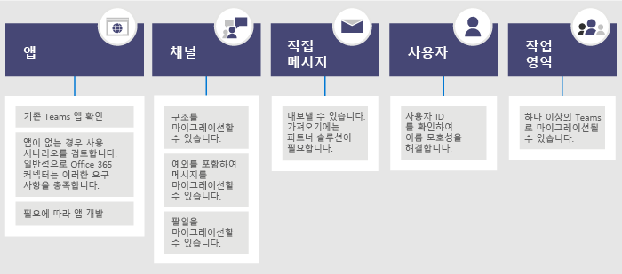

# <a name="migrate-from-slack-to-microsoft-teams"></a>Slack에서 Microsoft Teams로 마이그레이션

이 문서에서는 Slack에서 Microsoft Teams로 전환하는 여정에 대해 안내합니다.

Slack에서 Teams로 전환하는 계획을 수립할 때는 유지해야 하는 항목 (있을 경우)을 결정하는 것이 중요합니다. 먼저 마이그레이션할 수 있는 데이터 형식에 대해 설명하고, 사용자의 요구를 평가하고, 이동을 계획하고 나서, 이동하는 방법을 단계별로 안내하겠습니다.

아래 다이어그램에는 높은 수준에서 Slack 아키텍처를 보여줍니다.


## <a name="plan-your-migration-from-slack"></a>Slack에서 마이그레이션 계획
### <a name="what-you-can-and-cant-migrate"></a>마이그레이션할 수 있는 항목과 마이그레이션할 수 없는 항목
Slack 서비스 플랜에 따라 마이그레이션할 수 있는 항목과 마이그레이션 불가능한 항목이 결정됩니다. 예를 들어, 일부 Slack 서비스 플랜에서는 공용 채널 기록 및 파일만 내보낼 수 있고, 다른 플랜에서는 전용 채널 및 다이렉트 메시지를 포함하기 위해 DocoSign 요청이 필요합니다. 

Slack Workspace 서비스 수준을 확인하려면 Slack에 로그인하여 **이 Workspace 정보** 페이지에서 계획 유형을 확인합니다.

Slack 내보내기 옵션에 대한 자세한 내용을 알아보려면 Slack 웹 사이트를 참조하세요. https://get.slack.help/hc/articles/204897248-Guide-to-Slack-import-and-export-tools 

아래 다이어그램에는 이 문서에서 다룰 Slack 마이그레이션 계획을 개괄적으로 살펴봅니다. 



이 섹션을 다 읽으면 다음 사항에 대해 이해할 수 있게 됩니다.
- Slack 워크스페이스의 서비스 수준
- 내보낼 수 있는 항목과 내보낼 수 없는 항목
- 내보내기에 대한 일반적인 접근 방식

### <a name="assess-your-slack-workspaces"></a>Slack 워크스페이스 평가
조직의 마이그레이션 계획을 계획하기 전에 사용자의 Slack 워크스페이스에 대한 정보를 수집해야 합니다. 사용자가 Slack 워크스페이스를 어떻게 사용하는지 이해하면 마이그레이션 범위를 결정하는 데 도움이 됩니다. 예를 들어 옮기는 워크스페이스가 몇 개나 있나요? 특정 부서에서 사용되나요, 아니면 전체 조직에서 사용하나요?

마이그레이션할 Slack 워크스페이스의 구성원인 경우 *\<your Slack workspace\>slack.com/stats* 로 이동하여 직접 사용 현황을 분석할 수 있습니다. 채널 및 구성원 탭을 검토하여 사용 패턴을 찾습니다. 어떤 워크스페이스를 마이그레이션하고 어떤 워크스페이스를 남겨 둘지를 결정합니다. 

> [!NOTE]
> 통계 페이지에 액세스할 수 없는 경우, 사용자는 관리자 또는 소유자가 아닙니다. 

### <a name="export-channels"></a>채널 내보내기

Slack에서 사용자는 Slack 워크스페이스의 일부인 채널에 참가하는 반면 Teams 사용자는 채널 모음인 팀에 참가합니다. 이동할 채널을 결정하는 데 도움이 되도록 각 채널에서 얼마나 많은 활동이 발생하는지 확인하기 위해 Slack 분석을 사용하는 것이 좋습니다. 결과 목록을 사용하여 Slack 채널을 Teams의 팀으로 그룹화하는 방법과 누가 각 팀의 구성원이 되어야 하는지 파악합니다.

유료 Slack 서비스 플랜(무료 이외의 요금제)에 가입한 경우, Slack의 분석(\<your Slack workspace\>.slack.com/admin/stats#channels)을 사용하여 채널의 활성 상태, 마지막 사용 시간, 구성원의 수를 확인할 수 있습니다. 이는 채널의 마이그레이션 여부를 결정하는 데 도움이 될 수 있습니다. 기본적으로 공개 채널 콘텐츠(메시지와 파일)를 내보낼 수 있습니다. Slack 서비스 플랜과 Slack에서 개인 채널과 다이렉트 메시지를 요청했는지에 따라 내보내질 수 있습니다.

Slack 내보내기 옵션에 대한 자세한 내용을 알아보려면 Slack 웹 사이트를 참조하세요. https://get.slack.help/hc/articles/204897248-Guide-to-Slack-import-and-export-tools 

> [!IMPORTANT]
> 채널 데이터에 대한 조직의 개인 정보 보호 및 규정 준수 요구 사항을 확인하세요. 조직은 최종 EUI(최종 사용자 식별 가능 콘텐츠) 수명 주기를 준수하는 것 외에도 이 데이터의 처리, 저장 및 처리에 대한 규정 준수 요구 사항이 있을 수 있습니다.

### <a name="export-direct-messages"></a>다이렉트 메시지 내보내기
다이렉트 메시지는 Teams의 채팅과 같은 1:1 또는 일대다 비 채널 대화입니다. 내보내기 기능은 Slack 서비스 플랜과 Slack 내보내기에 다이렉트 메시지를 포함하도록 요청했는지에 따라 다릅니다. Teams는 현재 다이렉트 메시지 가져오기를 지원하지 않습니다. Microsoft 파트너에게 문의하여 다이렉트 메시지 콘텐츠를 Teams로 가져오는 데 사용할 수 있는 타사 솔루션에 대해 알아보세요.

다이렉트 메시지를 내보내려면 Slack 앱 스토어에서 Export와 같은 도구를 확인해보세요.

### <a name="apps-and-custom-integrations"></a>앱 및 사용자 지정 통합

Slack의 앱은 팀의 Teams와 같습니다. 작업 영역에 앱 및 앱 구성의 목록이 있으면 Teams 앱 스토어에서 검색하여 Teams*에 사용할 수 있는지 확인할 수 있습니다. 

\<your Slack workspace\>.slack.com/apps/manage로 이동하여 앱 및 사용자 지정 통합 목록을 확인합니다. 이 페이지에서는 각 앱이 사용 중인 구성의 수도 보여줍니다. 사용자 지정 통합은 "마이그레이션 기능"에 따라 다릅니다. Web Hook인 경우 일반적으로 Microsoft 365 또는 Office 365 커넥터로 보내 워크플로를 Teams로 전환할 수 있습니다. 사례별로 봇과 다른 앱을 평가하여 Teams로 옮길 방법을 계획합니다.

\* 관리자가 앱 사용을 제한하는 경우 사용 가능한 앱의 전체 목록을 확인하지 못할 수 있습니다.

### <a name="users"></a>사용자
Slack에서 사용한 ID 체계가 Microsoft 365 또는 Office 365에 직접 매핑되지 않을 수 있습니다. 예를 들어, Slack 사용자의 전자 메일 주소는 Microsoft 365 또는 Office 365 회사 또는 학교 계정으로 매핑되지 않을 수 있습니다. Teams 롤아웃 계획을 시작하기 전에 사용자 ID 맵을 만들어야 합니다.

유료 Slack 서비스 플랜을 사용하는 경우 *\<your Slack workspace\>.slack.com/admin/stats#members* 로 이동하여 각 사용자의 전자 메일 주소와 계정 유형 같은 구성원 세부 정보를 확인할 수 있습니다. (예: 싱글 및 멀티 채널 게스트).

다음은 이름을 명확하게 하기 위해 전자 메일 주소를 Slack 내보내기에서 Azure AD와 비교하는 데 사용할 수 있는 스크립트입니다. 또한 사용자가 Teams 사용할 수 있는지 보고합니다. PowerShell에 관한 도움이 필요한 경우 [Azure PowerShell 시작](/powershell/azure/get-started-azureps)을 읽어보세요.

```azurepowershell
Connect-AzureAD
Function Get-TimeStamp {
    return "[{0:MM/dd/yy} {0:HH:mm:ss}]" -f (Get-Date)
}

class User {
    [ValidateNotNullOrEmpty()] $ID
    [ValidateNotNullOrEmpty()] $FullName
    [string] $Email
    [string] $UPN
    [ValidateNotNullOrEmpty()][bool] $ExistsAzureAD
    [ValidateNotNullOrEmpty()][bool] $TeamsEnabled
}

$output = New-Object -type System.Collections.ObjectModel.Collection["User"]

$users = Get-Content -Raw -Path .\slackHistory\users.json | ConvertFrom-Json

Write-Host -ForegroundColor Green "$(Get-Timestamp) User Count: " $users.Count

$i=1
Write-Host "$(Get-Timestamp) Attempting direct email match.. `n"
foreach ($slackUser in $users) {
    $user = New-Object User
    $user.id = $slackUser.id
    $user.FullName = $slackUser.name
    try {
        if ($null -ne $slackUser.profile.email) {
            $user.email = $slackUser.profile.email
            $emailSplit = $slackUser.profile.email.Split('@')
            $mailNickName = $emailSplit[0]
            $result = Get-AzureADUser -Filter "MailNickName eq '$($mailNickName)' or UserPrincipalName eq '$($slackUser.profile.email)' or proxyAddresses/any(c:c eq 'smtp:$($slackUser.profile.email)')"
            if ($null -ne $result) {
                $user.ExistsAzureAD = $true
                $user.UPN = $result.UserPrincipalName
                $assignedPlans = $result.assignedPlans
                foreach ($plan in $assignedPlans) {
                    if ($plan.ServicePlanId -eq "57ff2da0-773e-42df-b2af-ffb7a2317929") {
                        if ($plan.CapabilityStatus -eq "Enabled") {
                            $user.TeamsEnabled = $true
                        }
                        else {
                            $user.TeamsEnabled = $false
                        }
                    }
                }
                Write-Host -ForegroundColor Green "$(Get-Timestamp) Current User $($i) - AzureAD object found:" $result.MailNickName
                Write-Host -ForegroundColor Green "$(Get-Timestamp) Current User $($i) - Teams Enabled:" $user.TeamsEnabled
            }
            else {
                $user.ExistsAzureAD = $false
                Write-Host -ForegroundColor Yellow "$(Get-Timestamp) Current User $($i) - AzureAD object not found: " $slackUser.profile.email
            }
        }
        $i++
    }   
    catch
    {
        $user.ExistsAzureAD = $false
        Write-Host -ForegroundColor Yellow "$(Get-Timestamp) Current User $($i) - AzureAD object not found: $($i)" $user.profile.email
        $i++
    }
    $output.Add($user)
}

$output | Export-Csv -Path .\SlackToAzureADIdentityMapping.csv -NoTypeInformation
Write-Host "`n $(Get-Timestamp) Generated SlackToAzureADIdentityMapping.csv. Exiting..."
```

이 섹션을 다 읽었다면 다음이 있어야 합니다.
- 사용 현황 통계를 포함하는 워크스페이스당 채널 목록입니다.
- 채널당 구성을 포함하는 Slack 앱 목록입니다.
- 내보낼 Slack 메시지 기록 유형(있을 경우)을 결정합니다.
- Slack 계정이 Microsoft 회사 또는 학교 계정에 매핑되는 사용자 목록과 해당 사용자가 보유한 Teams 라이선스입니다.

## <a name="plan-your-teams-deployment"></a>Teams 배포 계획
Slack에서 필요한 항목을 내보냈습니다(그리고 필요하지 않은 모든 항목을 남겼습니다.). 이번에는 Teams를 어떻게 배포하고 Slack 데이터를 가져올지를 계획해야 합니다. 이는 사용 현황을 기반으로 팀에 잘 작동한 것을 평가하고 해당 요소를 Teams 배포 계획에 포함시킬 수 있는 좋은 기회입니다. 이 섹션의 끝에서는 Teams 사용자, 채널 및 앱의 청사진을 사용할 수 있게 됩니다. 

아래 다이어그램에서는 Teams 배포에서 다룰 항목에 대한 개요를 제공합니다.

:::image type="content" source="media/migrate-slack-to-teams-image3.png" alt-text="Slack에서 Teams의 배포 계획에 대한 개요":::

### <a name="team-and-channel-structure"></a>팀 및 채널 구조

Slack 워크스페이스에는 하나의 팀, 여러 팀 또는 조직 전체를 나타낼 수 있습니다. 구조를 결정할 때 워크스페이스의 범위를 이해하는 것이 중요합니다. Slack의 Teams 팀과 가장 가까운 관계는 채널 모음을 포함하는 워크스페이스입니다. 아래 다이어그램에서는 세 가지 다른 Slack에서 Teams 매핑과 각 워크스페이스에 적합한 매핑을 선택하기 위한 지침을 보여줍니다.


|Slack에서 Teams 매핑 | 설명 |
|---------|---------|
|1 Slack 워크스페이스:오른쪽_화살표: 1 팀   | 200개 미만의 채널이 필요한 작은 Slack 워크스페이스의 경우<br>확장 및 개인 채널 계획에 대한 버퍼를 포함합니다.  |
|1 Slack 워크스페이스:오른쪽_화살표: 여러 팀     | Slack 워크스페이스 분석 데이터를 사용하여 팀의 기초가되는 논리 채널 그룹을 만듭니다.        |
|2+ Slack 워크스페이스:오른쪽_화살표: 여러 팀     | Slack 워크스페이스 분석 데이터를 사용하여 팀의 기초가되는 논리 팀과 채널 그룹을 만듭니다.        |

타사 솔루션에는 채널 활성 상태와 게시물 수를 평가하는 데 도움이 되는 사용 현황 통계가 있습니다. 일반적으로는 자주 사용되는 채널이 팀 계획에 포함될 후보입니다.

> [!TIP]
> Teams에서 다시 생성할 채널을 결정하는데 필요한 항목만 유지합니다. 자세한 내용은 [팀 및 채널 개요](teams-channels-overview.md)를 참조하세요. 

#### <a name="team-planning"></a>팀 계획
위의 계획 섹션에서 컴파일한 채널 인벤터리를 사용해서 Slack 소유자 및 관리자와 협력하여 팀에서 어떤 채널이 팀이 되고 어떤 채널이 팀에서 채널이 될지를 파악합니다. Excel 또는 Power BI를 사용하여 이 분석에 도움을 줄 수 있습니다. 둘 다 어느 채널을 유지할지에 대한 토론을 유도하는 데 도움이 되도록 추가 정보를 제공할 수 있습니다.

> [!TIP]
> 현재 Teams는 팀당 200채널 제한을 두고 있습니다. 채널 목록이 해당 제한에 가까워지면 채널 목록을 두 팀으로 나눌 수 있는 방법을 찾아야 합니다.

### <a name="channel-history"></a>채널 기록

조직의 채널 기록 공개 및 비공개 채널 유지 요건에 따라 GitHub에서 무료 솔루션과 사용할 수 있는 유료 솔루션이 모두 제공됩니다. 또한 이 스크립트는 Teams로 작성할 수 있습니다.

Teams에서 새 팀과 채널 구조를 설정한 후 내보낸 파일을 Teams 채널의 적절한 문서 라이브러리에 복사할 수 있습니다.

콘텐츠 가져오기를 자동화하기 위해 고려할 수 있는 몇 가지 방법이 있습니다. GitHub의 무료 솔루션([ChannelSurf](https://github.com/tamhinsf/ChannelSurf) 또는 [Slack 내보내기 뷰어](https://github.com/hfaran/slack-export-viewer))과 파트너 솔루션이 있습니다. 조직의 필요에 따라 솔루션을 선택합니다. 

### <a name="channel-files"></a>채널 파일

대부분의 솔루션은 파일을 내보내지만 일반적으로 채널 기록에 프로그래밍 방식으로 검색하기 위해 API 키가 필요한 링크로 제공됩니다.

Slack에 저장된 파일의 경우 Teams에 팀과 채널을 설정한 후 프로그래밍 방식으로 Slack에서 파일을 대상 Teams 채널에 복사할 수 있습니다.

다음 스크립트는 Slack에서 파일을 검색합니다. 컴퓨터에서 지정된 Slack 내보내기를 검색하고 각 대상 채널에 폴더를 만들고 해당 위치로 모든 파일을 다운로드합니다. 데이터를 추출할 수 있는 타사 솔루션이 있습니다. PowerShell에 관한 도움이 필요한 경우 [Azure PowerShell 시작](/powershell/azure/get-started-azureps)을 읽어보세요.


```azurepowershell
$ExportPath = ".\slackHistory"
$ExportContents = Get-ChildItem -path $ExportPath -Recurse
Function Get-TimeStamp {
    return "[{0:MM/dd/yy} {0:HH:mm:ss}]" -f (Get-Date)
}

class File {
    [string] $Name
    [string] $Title
    [string] $Channel
    [string] $DownloadURL
    [string] $MimeType
    [double] $Size
    [string] $ParentPath
    [string] $Time
}

$channelList = Get-Content -Raw -Path .\slackHistory\channels.json | ConvertFrom-Json
$Files = New-Object -TypeName System.Collections.ObjectModel.Collection["File"]

Write-Host -ForegroundColor Green "$(Get-TimeStamp) Starting Step 1 (processing channel export for files) of 2. Total Channel Count: $($channelList.Count)"
#Iterate through each Channel listed in the Archive
foreach ($channel in $channelList) {
    #Iterate through Channel folders from the Export
    foreach ($folder in $ExportContents)
    {
        #If Channel Name matches..
        if ($channel.name -eq $folder){
            $channelJsons = Get-ChildItem -Path $folder.FullName -File
            Write-Host -ForegroundColor White "$(Get-TimeStamp) Info: Starting to process $($channelJsons.Count) days of content for #$($channel.name)."
            #Start processing the daily JSON for files
            foreach ($json in $channelJsons){
                $currentJson = Get-Content -Raw -Path $json.FullName | ConvertFrom-Json
                #Write-Host -ForegroundColor Yellow "$(Get-TimeStamp) Info: Processing $($json.Name) in #$($channel.name).."
                #Iterate through every action
                foreach ($entry in $currentJson){
                    #If the action contained file(s)..
                    if($null -ne $entry.files){
                        #Iterate through each file and add it to the List of Files to download
                        foreach ($item in $entry.Files) {
                        $file = New-Object -TypeName File
                            if ($null -ne $item.url_private_download){
                                $file.Name = $item.name
                                $file.Title = $item.Title
                                $file.Channel = $channel.name
                                $file.DownloadURL = $item.url_private_download
                                $file.MimeType = $item.mimetype
                                $file.Size = $item.size
                                $file.ParentPath = $folder.FullName
                                $file.Time = $item.created
                                $files.Add($file)
                            }
                        }
                    }
                }
            }
        }
    }
}
Write-Host -ForegroundColor Green "$(Get-TimeStamp) Step 1 of 2 complete. `n"

Write-Host -ForegroundColor Green "$(Get-TimeStamp) Starting step 2 (creating folders and downloading files) of 2."
#Determine which Files folders need to be created
$FoldersToMake = New-Object System.Collections.ObjectModel.Collection["string"]
foreach ($file in $files){
    if ($FoldersToMake -notcontains $file.Channel){
        $FoldersToMake.Add($file.Channel)
    }
}

#Create Folders
foreach ($folder in $FoldersToMake){
    #$fullFolderPath = $file.ParentPath + "\Files"
    $fullFolderPath = $ExportPath +"\$($folder)"
    $fullFilesPath = $ExportPath +"\$($folder)\Files"
    if (-not (Test-Path $fullFilesPath)){
        New-Item -Path $fullFolderPath  -Name "Files" -ItemType "directory"
    }
}

#Downloading Files
foreach ($file in $files)
{
    Write-Host -ForegroundColor Yellow "$(Get-TimeStamp) Downloading $($file.Name)."
    $fullFilePath = $file.ParentPath + "\Files\" + $file.Name
        if (-not (Test-Path $fullFilePath)){
            try{
                $request = (New-Object System.Net.WebClient).DownloadFile($file.DownloadURL, $fullFilePath)
            }
            catch [System.Net.WebException]{
                Write-Host -ForegroundColor Red "$(Get-TimeStamp) Error: Unable to download $($file.Name) to $($fullFilePath)"
            }   
        }
        else {
            try{
                $extensionPosition = $file.name.LastIndexOf('.')
                $splitFileName = $file.name.Substring(0,$extensionPosition)
                $splitFileExtention = $file.name.Substring($extensionPosition)
                $newFileName = $splitFileName + $file.Time + $splitFileExtention
                $fullFilePath = $file.ParentPath + "\Files\" + $newFileName
                $request = (New-Object System.Net.WebClient).DownloadFile($file.DownloadURL, $fullFilePath)
            }
            catch [System.Net.WebException]{
                Write-Host -ForegroundColor Red "$(Get-TimeStamp) Error: Unable to download $($file.Name) to $($fullFilePath)"
            }   
        }
}
Write-Host -ForegroundColor Green "$(Get-TimeStamp) Step 2 of 2 complete. `n"
Write-Host -ForegroundColor Green "$(Get-TimeStamp) Exiting.."
```


### <a name="apps-and-custom-integrations"></a>앱 및 사용자 지정 통합
Slack 앱 목록과 사용자 지정 통합(구성을 포함)을 검토하고 Teams로 옮길 항목을 결정합니다. Teams 마켓플레이스를 확인하여 앱을 사용할 수 있는지 확인합니다. 사용할 수 없는 경우 대체 방법이 있을 수 있습니다. 

Teams에 추가할 앱을 파악하려면 앱을 사용하는 방법을 이해하는 것이 중요 합니다. "앱이 이 채널에 제공하는 기능은 무엇인가요?"라는 질문을 하면 앱에서 제공하는 결과에 관해 배울 수 있습니다. 

대부분의 경우, 앱에서는 외부 서비스에서 주로 이벤트 기반 데이터(예: 모니터링 시스템)를 받고 메시지를 Slack으로 푸시합니다. 이벤트에 따라 Teams에 메시지를 푸시할 수 있는 Microsoft 365 커넥터를 사용하여 동일한 결과를 얻을 수 있습니다.

다음은 통합을 위해 Teams에서 Microsoft 365 커넥터를 사용하는 Slack 솔루션의 예입니다.
- Ansible
  - [Ansible webhook](https://docs.ansible.com/ansible-tower/latest/html/userguide/notifications.html#webhook)를 통해 Teams에 알림을 보낼 수 있습니다.
- New Relic
  - [Teams에 New Relic 알림 보내기](https://discuss.newrelic.com/t/new-relic-alerts-not-working-with-microsoft-teams/48609/3)는 이 사용자 솔루션을 확인하세요.
- Nagios
  - 알림은 커넥터를 통해 오늘 통합될 수 있습니다. https://github.com/isaac-galvan/nagios-teams-notify
- ZenDesk
  - Teams Store에 앱이 있습니다.
- Jenkins
  - [Jenkins의 Office 365 커넥터](https://plugins.jenkins.io/Office-365-Connector)를 사용하여 Teams에 알림을 보낼 수 있습니다.


### <a name="user-readiness-and-adoption-plan"></a>사용자 준비 및 채택 계획
모든 성공적인 소프트웨어 배포의 초석은 사용자가 변화에 얼마나 준비되어 있는지에 달려있습니다. Slack을 사용하는 조직의 사용자는 Teams의 개념을 쉽게 이해할 수 있지만 원활한 전환에 도움이 되는 교육이 여전히 필요합니다. 포괄적인 Teams 도입 리소스에 관한 내용은 [Teams 도입 허브](adopt-microsoft-teams-landing-page.md)를 참조하세요.

예를 들어, 두 제품에는 채널이 있지만 제품마다 다르게 사용됩니다. 예를 들어, Slack의 채널은 종종 단기 업무 대화를 위한 Teams의 채팅처럼 사용됩니다. 기타 주목할 만한 차이점은 스레드/스레드가 아닌 대화와 알림 설정 조정입니다.

풍부한 [최종 사용자 Teams 비디오 교육](https://support.office.com/article/microsoft-teams-video-training-4f108e54-240b-4351-8084-b1089f0d21d7) 라이브러리를 확인하세요. 

## <a name="move-to-teams"></a>Teams로 이동 
이제 전환 계획을 정의했으므로 Teams에서 팀과 채널을 만들 수 있습니다. 

팀과 채널을 만든 후에는 Slack 채널에서 Teams로 파일을 복사하고 앱을 구성하기 시작합니다. 솔루션을 사용하여 기록을 유지하는 경우 지금 구성할 수도 있습니다. 이제 사용자에게 라이선스를 부여하고(아직 라이선스가 없는 경우) 적절한 팀에 추가할 준비가 되었습니다. 추가 내보내기와 파일 복사본의 필요성을 줄이려면 각 사용자의 팀 추가와 일치하는 합의된 날짜에 Slack 액세스를 제거하는 것이 좋습니다. 이렇게 하면 파일 및 기록에서 델타 변경 내용을 다시 내보내고 가져올 필요가 없습니다.

아래 다이어그램에 나와 있는 단계를 따라 조직에 Teams를 배포합니다. 자세한 내용은 [Teams를 배포하는 방법](./deploy-overview.md)을 참조하세요.


:::image type="content" source="media/migrate-slack-to-teams-image4.png" alt-text="Slack에서 Teams로 이동하는 단계를 보여주는 다이어그램.":::