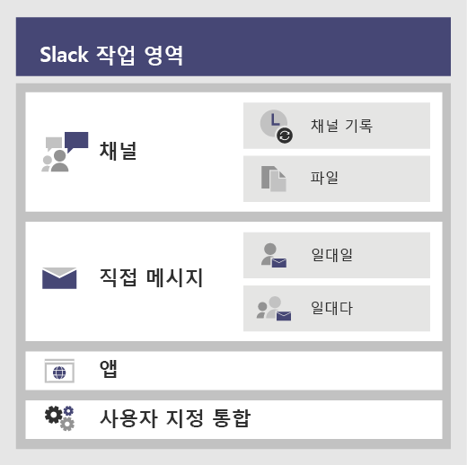

# <a name="migrate-from-slack-to-microsoft-teams"></a><span data-ttu-id="1d5d3-103">Slack에서 Microsoft Teams로 마이그레이션</span><span class="sxs-lookup"><span data-stu-id="1d5d3-103">Migrate from Slack to Microsoft Teams</span></span>

<span data-ttu-id="1d5d3-104">이 문서에서는 Slack에서 Microsoft Teams로 전환하는 여정에 대해 안내합니다.</span><span class="sxs-lookup"><span data-stu-id="1d5d3-104">This article walks you through the journey of moving to Microsoft Teams from Slack.</span></span>

<span data-ttu-id="1d5d3-105">Slack에서 Teams로 전환하는 계획을 수립할 때는 유지해야 하는 항목 (있을 경우)을 결정하는 것이 중요합니다.</span><span class="sxs-lookup"><span data-stu-id="1d5d3-105">When planning your organization’s move to Teams from Slack, it is important to decide what you need to keep (if anything).</span></span> <span data-ttu-id="1d5d3-106">먼저 마이그레이션할 수 있는 데이터 형식에 대해 설명하고, 사용자의 요구를 평가하고, 이동을 계획하고 나서, 이동하는 방법을 단계별로 안내하겠습니다.</span><span class="sxs-lookup"><span data-stu-id="1d5d3-106">We'll start off by describing what types of data can be migrated and then walk you through how to assess your needs, plan your move, and then make the move.</span></span>

<span data-ttu-id="1d5d3-107">아래 다이어그램에는 높은 수준에서 Slack 아키텍처를 보여줍니다.</span><span class="sxs-lookup"><span data-stu-id="1d5d3-107">The diagram below shows the Slack architecture at a high level.</span></span>



## <a name="plan-your-migration-from-slack"></a><span data-ttu-id="1d5d3-109">Slack에서 마이그레이션 계획</span><span class="sxs-lookup"><span data-stu-id="1d5d3-109">Plan your migration from Slack</span></span>
### <a name="what-you-can-and-cant-migrate"></a><span data-ttu-id="1d5d3-110">마이그레이션할 수 있는 항목과 마이그레이션할 수 없는 항목</span><span class="sxs-lookup"><span data-stu-id="1d5d3-110">What you can and can’t migrate</span></span>
<span data-ttu-id="1d5d3-111">Slack 서비스 플랜에 따라 마이그레이션할 수 있는 항목과 마이그레이션할 수 없는 항목이 결정됩니다.</span><span class="sxs-lookup"><span data-stu-id="1d5d3-111">Your Slack service plan will determine what you can and can’t migrate.</span></span> <span data-ttu-id="1d5d3-112">예를 들어, 일부 Slack 서비스 플랜에서는 공개 채널 기록과 파일만 내보낼 수 있으며, 다른 일부는 개인 채널과 다이렉트 메시지를 포함하기 위해 DocuSign 요청이 필요합니다. </span><span class="sxs-lookup"><span data-stu-id="1d5d3-112">For example, some Slack service plans only let you export public channels history and files, other require a DocuSign request to include Private Channels and Direct Messages.</span></span> 

<span data-ttu-id="1d5d3-113">Slack Workspace 서비스 수준을 확인하려면 Slack에 로그인하여 **이 Workspace 정보** 페이지에서 계획 유형을 확인합니다.</span><span class="sxs-lookup"><span data-stu-id="1d5d3-113">To determine your Slack Workspace service level, log into Slack and note your plan type on the **About this Workspace** page.</span></span>

<span data-ttu-id="1d5d3-114">Slack 내보내기 옵션에 대한 자세한 내용을 알아보려면 Slack 웹 사이트를 참조하세요. https://get.slack.help/hc/articles/204897248-Guide-to-Slack-import-and-export-tools</span><span class="sxs-lookup"><span data-stu-id="1d5d3-114">To learn more about Slack export options, go to the Slack website: https://get.slack.help/hc/articles/204897248-Guide-to-Slack-import-and-export-tools</span></span> 

<span data-ttu-id="1d5d3-115">아래 다이어그램에는 이 문서에서 다룰 Slack 마이그레이션 계획을 개괄적으로 살펴봅니다.</span><span class="sxs-lookup"><span data-stu-id="1d5d3-115">The diagram below gives you a high-level look at the Slack migration landscape that we’ll cover in this article.</span></span> 

<span data-ttu-id="1d5d3-116">:::image type="content" source="media/migrate-slack-to-teams-image2.png" alt-text="Slack 내보내기 환경을 보여주는 다이어그램.":::</span><span class="sxs-lookup"><span data-stu-id="1d5d3-116">:::image type="content" source="media/migrate-slack-to-teams-image2.png" alt-text="Diagram that shows the Slack export landscape.":::</span></span>

<span data-ttu-id="1d5d3-117">이 섹션을 다 읽으면 다음 사항에 대해 이해할 수 있게 됩니다.</span><span class="sxs-lookup"><span data-stu-id="1d5d3-117">When you're done with this section, you should understand:</span></span>
- <span data-ttu-id="1d5d3-118">Slack 워크스페이스의 서비스 수준</span><span class="sxs-lookup"><span data-stu-id="1d5d3-118">The service level of your Slack Workspaces</span></span>
- <span data-ttu-id="1d5d3-119">내보낼 수 있는 항목과 내보낼 수 없는 항목</span><span class="sxs-lookup"><span data-stu-id="1d5d3-119">What can and can't be exported</span></span>
- <span data-ttu-id="1d5d3-120">내보내기에 대한 일반적인 접근 방식</span><span class="sxs-lookup"><span data-stu-id="1d5d3-120">Common approaches to exporting</span></span>

### <a name="assess-your-slack-workspaces"></a><span data-ttu-id="1d5d3-121">Slack 워크스페이스 평가</span><span class="sxs-lookup"><span data-stu-id="1d5d3-121">Assess your Slack workspaces</span></span>
<span data-ttu-id="1d5d3-122">조직의 마이그레이션 계획을 계획하기 전에 사용자의 Slack 워크스페이스에 대한 정보를 수집해야 합니다.</span><span class="sxs-lookup"><span data-stu-id="1d5d3-122">Before you can plan your organization’s migration plan, you need to pull together some information about your Slack workspaces.</span></span> <span data-ttu-id="1d5d3-123">사용자가 Slack 워크스페이스를 어떻게 사용하는지 이해하면 마이그레이션 범위를 결정하는 데 도움이 됩니다.</span><span class="sxs-lookup"><span data-stu-id="1d5d3-123">Understanding how your Slack workspaces are being used helps you determine the scope of your migration.</span></span> <span data-ttu-id="1d5d3-124">예를 들어 옮기는 워크스페이스가 몇 개나 있나요?</span><span class="sxs-lookup"><span data-stu-id="1d5d3-124">For example, how many workspaces are being moved?</span></span> <span data-ttu-id="1d5d3-125">특정 부서에서 사용되나요, 아니면 전체 조직에서 사용하나요?</span><span class="sxs-lookup"><span data-stu-id="1d5d3-125">Are they used by a specific department, many, or in use by an entire organization?</span></span>

<span data-ttu-id="1d5d3-126">마이그레이션할 Slack 워크스페이스의 구성원인 경우 *<your Slack workspace>slack.com/stats*으로 이동하여 직접 사용 현황을 분석할 수 있습니다. 채널 및 구성원 탭을 검토하여 사용 패턴을 찾습니다.</span><span class="sxs-lookup"><span data-stu-id="1d5d3-126">If you’re a member of the Slack Workspaces you want to migrate, you can analyze the usage yourself by going to *<your Slack workspace>.slack.com/stats*. Review the Channels and Members tabs to look for usage patterns.</span></span> <span data-ttu-id="1d5d3-127">마이그레이션할 워크스페이스(및 어느 것을 남길 것인지)를 결정합니다.</span><span class="sxs-lookup"><span data-stu-id="1d5d3-127">Decide which workspaces you want to migrate (and which ones you want to leave behind).</span></span> 

> [!NOTE]
> <span data-ttu-id="1d5d3-128">통계 페이지에 액세스할 수 없는 경우, 사용자는 관리자 또는 소유자가 아닙니다.</span><span class="sxs-lookup"><span data-stu-id="1d5d3-128">If you don’t have access to the stats page, you’re not an admin or owner.</span></span> 

### <a name="export-channels"></a><span data-ttu-id="1d5d3-129">채널 내보내기</span><span class="sxs-lookup"><span data-stu-id="1d5d3-129">Export Channels</span></span>

<span data-ttu-id="1d5d3-130">Slack에서 사용자는 Slack 워크스페이스의 일부인 채널에 참가하는 반면 Teams 사용자는 채널 모음인 팀에 참가합니다.</span><span class="sxs-lookup"><span data-stu-id="1d5d3-130">In Slack, users join a channel which is part of a Slack Workspace, whereas in Teams users join a team which is a collection of channels.</span></span> <span data-ttu-id="1d5d3-131">이동할 채널을 결정하는 데 도움이 되도록 각 채널에서 얼마나 많은 활동이 발생하는지 확인하기 위해 Slack 분석을 사용하는 것이 좋습니다.</span><span class="sxs-lookup"><span data-stu-id="1d5d3-131">We recommend that you use Slack analytics to see how much activity happens in each channel to help you decide which channels to move.</span></span> <span data-ttu-id="1d5d3-132">결과 목록을 사용하여 Slack 채널을 Teams의 팀으로 그룹화하는 방법과 누가 각 팀의 구성원이 되어야 하는지 파악합니다.</span><span class="sxs-lookup"><span data-stu-id="1d5d3-132">You’ll use the resulting list to figure out how to group your Slack channels into teams in Teams as well as who should be members of each team.</span></span>

<span data-ttu-id="1d5d3-133">유료 Slack 서비스 플랜(무료 이외의 요금제)에 가입한 경우, Slack의 분석(<your Slack workspace>.slack.com/admin/stats#channels)을 사용하여 채널의 활성 상태, 마지막 사용 시간, 구성원의 수를 확인할 수 있습니다.</span><span class="sxs-lookup"><span data-stu-id="1d5d3-133">If you have a paid Slack service plan (anything other than Free), you can use Slack’s analytics (<your Slack workspace>.slack.com/admin/stats#channels) to see how active a channel is, when it was last used, and how many people are members.</span></span> <span data-ttu-id="1d5d3-134">이는 채널의 마이그레이션 여부를 결정하는 데 도움이 될 수 있습니다.</span><span class="sxs-lookup"><span data-stu-id="1d5d3-134">This can help you decide whether to migrate the channel.</span></span> <span data-ttu-id="1d5d3-135">기본적으로 공개 채널 콘텐츠(메시지와 파일)를 내보낼 수 있습니다.</span><span class="sxs-lookup"><span data-stu-id="1d5d3-135">By default, public channels content (messages and files) can be exported.</span></span> <span data-ttu-id="1d5d3-136">Slack 서비스 플랜과 Slack에서 개인 채널과 다이렉트 메시지를 요청했는지에 따라 내보내질 수 있습니다.</span><span class="sxs-lookup"><span data-stu-id="1d5d3-136">Depending on your Slack service plan and whether you’ve requested Private Channels and Direct Messages from Slack, those can be exported.</span></span>

<span data-ttu-id="1d5d3-137">Slack 내보내기 옵션에 대한 자세한 내용을 알아보려면 Slack 웹 사이트를 참조하세요. https://get.slack.help/hc/articles/204897248-Guide-to-Slack-import-and-export-tools</span><span class="sxs-lookup"><span data-stu-id="1d5d3-137">To learn more about Slack export options, go to the Slack website: https://get.slack.help/hc/articles/204897248-Guide-to-Slack-import-and-export-tools</span></span> 

> [!IMPORTANT]
> <span data-ttu-id="1d5d3-138">채널 데이터와 관련하여 조직의 개인 정보 보호 및 규정 준수 요구 사항을 확인하세요.</span><span class="sxs-lookup"><span data-stu-id="1d5d3-138">Check your organization’s privacy and compliance requirements around channel data.</span></span> <span data-ttu-id="1d5d3-139">사용자의 조직에 EUII(최종 사용자 식별 가능 콘텐츠)의 수명 주기를 준수하는 것뿐만 아니라, 이 데이터를 다루고, 저장하고, 처리하는 것에 관한 규정 준수 요구 사항이 있을 수 있습니다.</span><span class="sxs-lookup"><span data-stu-id="1d5d3-139">Your organization may have compliance requirements around the handling, storage, and processing of this data, in addition to complying with the lifecycle of end-user identifiable content (EUII).</span></span>

### <a name="export-direct-messages"></a><span data-ttu-id="1d5d3-140">다이렉트 메시지 내보내기</span><span class="sxs-lookup"><span data-stu-id="1d5d3-140">Export Direct Messages</span></span>
<span data-ttu-id="1d5d3-141">다이렉트 메시지는 Teams의 채팅과 같은 1:1 또는 일대다 비 채널 대화입니다.</span><span class="sxs-lookup"><span data-stu-id="1d5d3-141">Direct Messages are the same as chats in Teams, which are 1:1 or 1-to-many non-channel conversations.</span></span> <span data-ttu-id="1d5d3-142">내보내기 기능은 Slack 서비스 플랜과 Slack 내보내기에 다이렉트 메시지를 포함하도록 요청했는지에 따라 다릅니다.</span><span class="sxs-lookup"><span data-stu-id="1d5d3-142">Export-ability depends on your Slack service plan and if you’ve requested Direct Messages to be included in your Slack Export.</span></span> <span data-ttu-id="1d5d3-143">Teams는 현재 다이렉트 메시지 가져오기를 지원하지 않습니다.</span><span class="sxs-lookup"><span data-stu-id="1d5d3-143">Teams doesn’t support importing Direct messages currently.</span></span> <span data-ttu-id="1d5d3-144">Microsoft 파트너에게 문의하여 다이렉트 메시지 콘텐츠를 Teams로 가져오는 데 사용할 수 있는 타사 솔루션에 대해 알아보세요.</span><span class="sxs-lookup"><span data-stu-id="1d5d3-144">Consult a Microsoft partner to learn about third-party solutions you can explore that bring Direct Messages content into Teams.</span></span>

<span data-ttu-id="1d5d3-145">다이렉트 메시지를 내보내려면 Slack 앱 스토어에서 Export와 같은 도구를 확인해보세요.</span><span class="sxs-lookup"><span data-stu-id="1d5d3-145">For exporting Direct Messages, check out tools, such as Export, in the Slack App Store.</span></span>

### <a name="apps-and-custom-integrations"></a><span data-ttu-id="1d5d3-146">앱 및 사용자 지정 통합</span><span class="sxs-lookup"><span data-stu-id="1d5d3-146">Apps and custom integrations</span></span>

<span data-ttu-id="1d5d3-147">Slack 내 앱은 Teams의 앱과 유사합니다.</span><span class="sxs-lookup"><span data-stu-id="1d5d3-147">Apps in Slack are like apps in Teams.</span></span> <span data-ttu-id="1d5d3-148">워크스페이스에 앱과 해당 구성 목록이 있는 경우, Teams 앱 스토에서 검색하여 Teams에서 사용할 수 있는지 확인할 수 있습니다\*.</span><span class="sxs-lookup"><span data-stu-id="1d5d3-148">Once you have a list of apps and their configurations in the Workspace, you can search in the Teams App store to see if they’re available for Teams\*.</span></span> 

<span data-ttu-id="1d5d3-149"><your Slack workspace>.slack.com/apps/manage로 이동하여 앱 및 사용자 지정 통합 목록을 확인합니다.</span><span class="sxs-lookup"><span data-stu-id="1d5d3-149">Go to <your Slack workspace>.slack.com/apps/manage to get a list of Apps and Custom Integrations.</span></span> <span data-ttu-id="1d5d3-150">이 페이지에서는 각 앱이 사용 중인 구성의 수도 보여줍니다.</span><span class="sxs-lookup"><span data-stu-id="1d5d3-150">This page also shows you the number of configurations where each app is in use.</span></span> <span data-ttu-id="1d5d3-151">사용자 지정 통합은 "마이그레이션 기능"에 따라 다릅니다.</span><span class="sxs-lookup"><span data-stu-id="1d5d3-151">Custom Integrations vary in their “migrate-ability.”</span></span> <span data-ttu-id="1d5d3-152">Web Hook인 경우 일반적으로 Office 365 커넥터로 보내 워크플로를 Teams로 전환할 수 있습니다.</span><span class="sxs-lookup"><span data-stu-id="1d5d3-152">If it’s a Web Hook, you can usually send it to an Office 365 Connector to shift the workflow into Teams.</span></span> <span data-ttu-id="1d5d3-153">사례별로 봇과 다른 앱을 평가하여 Teams로 옮길 방법을 계획합니다.</span><span class="sxs-lookup"><span data-stu-id="1d5d3-153">Assess bots and other apps on a case-by-case basis to plan for moving them to Teams.</span></span>

<span data-ttu-id="1d5d3-154">\*관리자가 앱 사용을 제한하는 경우 사용 가능한 앱의 전체 목록을 볼 수 없습니다.</span><span class="sxs-lookup"><span data-stu-id="1d5d3-154">\*If your administrator has restricted apps usage, you may not be looking at the full list of available apps.</span></span>

### <a name="users"></a><span data-ttu-id="1d5d3-155">사용자</span><span class="sxs-lookup"><span data-stu-id="1d5d3-155">Users</span></span>
<span data-ttu-id="1d5d3-156">Slack에서 사용한 ID 체계가 Office 365에 직접 매핑되지 않을 수 있습니다.</span><span class="sxs-lookup"><span data-stu-id="1d5d3-156">The identity schemes you used in Slack might not map directly to Office 365.</span></span> <span data-ttu-id="1d5d3-157">예를 들어, Slack 사용자의 전자 메일 주소는 Office 365 회사 또는 학교 계정으로 매핑되지 않을 수 있습니다.</span><span class="sxs-lookup"><span data-stu-id="1d5d3-157">For example, the email addresses of your Slack users may not map to Office 365 work or school accounts.</span></span> <span data-ttu-id="1d5d3-158">Teams 롤아웃 계획을 시작하기 전에 사용자 ID 맵을 만들어야 합니다.</span><span class="sxs-lookup"><span data-stu-id="1d5d3-158">You should create a user-ID map before you start planning your Teams rollout.</span></span>

<span data-ttu-id="1d5d3-159">유료 Slack 서비스 플랜을 사용하는 경우 *<your Slack workspace>.slack.com/admin/stats#members*로 이동하여 각 사용자의 전자 메일 주소와 계정 유형 같은 구성원 세부 정보를 확인할 수 있습니다. (예: 싱글 및 멀티 채널 게스트).</span><span class="sxs-lookup"><span data-stu-id="1d5d3-159">If you’re on a paid Slack service plan, you can go to *<your Slack workspace>.slack.com/admin/stats#members* to get member details such as email address and account type for each user (for example, single vs. multi-channel guest).</span></span>

<span data-ttu-id="1d5d3-160">다음은 이름을 명확하게 하기 위해 전자 메일 주소를 Slack 내보내기에서 Azure AD와 비교하는 데 사용할 수 있는 스크립트입니다.</span><span class="sxs-lookup"><span data-stu-id="1d5d3-160">Here’s a script you can use to compare email addresses from a Slack export against Azure AD to help solve for name ambiguity.</span></span> <span data-ttu-id="1d5d3-161">또한 사용자가 Teams 사용할 수 있는지 보고합니다.</span><span class="sxs-lookup"><span data-stu-id="1d5d3-161">It’ll also report if the user is enabled for Teams.</span></span> <span data-ttu-id="1d5d3-162">PowerShell에 관한 도움이 필요한 경우 [Azure PowerShell 시작](https://docs.microsoft.com/powershell/azure/get-started-azureps)을 읽어보세요.</span><span class="sxs-lookup"><span data-stu-id="1d5d3-162">If you need help with PowerShell, read [Get started with Azure PowerShell](https://docs.microsoft.com/powershell/azure/get-started-azureps).</span></span>

```azurepowershell
Connect-AzureAD
Function Get-TimeStamp {
    return "[{0:MM/dd/yy} {0:HH:mm:ss}]" -f (Get-Date)
}

class User {
    [ValidateNotNullOrEmpty()] $ID
    [ValidateNotNullOrEmpty()] $FullName
    [string] $Email
    [string] $UPN
    [ValidateNotNullOrEmpty()][bool] $ExistsAzureAD
    [ValidateNotNullOrEmpty()][bool] $TeamsEnabled
}

$output = New-Object -type System.Collections.ObjectModel.Collection["User"]

$users = Get-Content -Raw -Path .\slackHistory\users.json | ConvertFrom-Json

Write-Host -ForegroundColor Green "$(Get-Timestamp) User Count: " $users.Count

$i=1
Write-Host "$(Get-Timestamp) Attempting direct email match.. `n"
foreach ($slackUser in $users) {
    $user = New-Object User
    $user.id = $slackUser.id
    $user.FullName = $slackUser.name
    try {
        if ($null -ne $slackUser.profile.email) {
            $user.email = $slackUser.profile.email
            $emailSplit = $slackUser.profile.email.Split('@')
            $mailNickName = $emailSplit[0]
            $result = Get-AzureADUser -Filter "MailNickName eq '$($mailNickName)' or UserPrincipalName eq '$($slackUser.profile.email)' or proxyAddresses/any(c:c eq 'smtp:$($slackUser.profile.email)')"
            if ($null -ne $result) {
                $user.ExistsAzureAD = $true
                $user.UPN = $result.UserPrincipalName
                $assignedPlans = $result.assignedPlans
                foreach ($plan in $assignedPlans) {
                    if ($plan.ServicePlanId -eq "57ff2da0-773e-42df-b2af-ffb7a2317929") {
                        if ($plan.CapabilityStatus -eq "Enabled") {
                            $user.TeamsEnabled = $true
                        }
                        else {
                            $user.TeamsEnabled = $false
                        }
                    }
                }
                Write-Host -ForegroundColor Green "$(Get-Timestamp) Current User $($i) - AzureAD object found:" $result.MailNickName
                Write-Host -ForegroundColor Green "$(Get-Timestamp) Current User $($i) - Teams Enabled:" $user.TeamsEnabled
            }
            else {
                $user.ExistsAzureAD = $false
                Write-Host -ForegroundColor Yellow "$(Get-Timestamp) Current User $($i) - AzureAD object not found: " $slackUser.profile.email
            }
        }
        $i++
    }   
    catch
    {
        $user.ExistsAzureAD = $false
        Write-Host -ForegroundColor Yellow "$(Get-Timestamp) Current User $($i) - AzureAD object not found: $($i)" $user.profile.email
        $i++
    }
    $output.Add($user)
}

$output | Export-Csv -Path .\SlackToAzureADIdentityMapping.csv -NoTypeInformation
Write-Host "`n $(Get-Timestamp) Generated SlackToAzureADIdentityMapping.csv. Exiting..."
$output | Export-Csv -Path .\SlackToAzureADIdentityMapping.csv -NoTypeInformation
Write-Host "`n $(Get-Timestamp) Generated SlackToAzureADIdentityMapping.csv. Exiting..."
```

<span data-ttu-id="1d5d3-163">이 섹션을 다 읽었다면 다음이 있어야 합니다.</span><span class="sxs-lookup"><span data-stu-id="1d5d3-163">When you’re done with this section, you should have:</span></span>
- <span data-ttu-id="1d5d3-164">사용 현황 통계를 포함하는 워크스페이스당 채널 목록</span><span class="sxs-lookup"><span data-stu-id="1d5d3-164">A list of Channels per Workspace with usage stats</span></span>
- <span data-ttu-id="1d5d3-165">채널당 구성을 포함하는 Slack 앱 목록</span><span class="sxs-lookup"><span data-stu-id="1d5d3-165">A list of Slack Apps with configurations per channel</span></span>
- <span data-ttu-id="1d5d3-166">내보낼 Slack 메시지 기록 유형(있을 경우)을 결정합니다.</span><span class="sxs-lookup"><span data-stu-id="1d5d3-166">Determined what type of Slack message history you want to export (if any)</span></span>
- <span data-ttu-id="1d5d3-167">Slack 계정이 Microsoft 회사 또는 학교 계정에 매핑되는 사용자 목록과 해당 사용자가 보유한 Teams 라이선스</span><span class="sxs-lookup"><span data-stu-id="1d5d3-167">A list of users whose Slack accounts map to Microsoft work or school accounts and which Teams license they have</span></span>

## <a name="plan-your-teams-deployment"></a><span data-ttu-id="1d5d3-168">Teams 배포 계획</span><span class="sxs-lookup"><span data-stu-id="1d5d3-168">Plan your deployment</span></span>
<span data-ttu-id="1d5d3-169">Slack에서 필요한 항목을 내보냈습니다(그리고 필요하지 않은 모든 항목을 남겼습니다.).</span><span class="sxs-lookup"><span data-stu-id="1d5d3-169">You’ve exported what you need from Slack (and left behind anything you don’t need).</span></span> <span data-ttu-id="1d5d3-170">이번에는 Teams를 어떻게 배포하고 Slack 데이터를 가져올지를 계획해야 합니다.</span><span class="sxs-lookup"><span data-stu-id="1d5d3-170">Now it’s time to plan how you’ll roll out Teams and import your Slack data.</span></span> <span data-ttu-id="1d5d3-171">이는 사용 현황을 기반으로 팀에 잘 작동한 것을 평가하고 해당 요소를 Teams 배포 계획에 포함시킬 수 있는 좋은 기회입니다.</span><span class="sxs-lookup"><span data-stu-id="1d5d3-171">This is a great opportunity to assess what's worked well for the team based on usage and include those elements in your Teams deployment plan.</span></span> <span data-ttu-id="1d5d3-172">이 섹션의 끝에서는 Teams 사용자, 채널 및 앱의 청사진을 사용할 수 있게 됩니다.</span><span class="sxs-lookup"><span data-stu-id="1d5d3-172">At the end of this section, you’ll have a blueprint for your Teams users, channels, and apps.</span></span> 

<span data-ttu-id="1d5d3-173">아래 다이어그램에서는 Teams 배포에서 다룰 항목에 대한 개요를 제공합니다.</span><span class="sxs-lookup"><span data-stu-id="1d5d3-173">The diagram below gives you a high-level outline of the things you’ll address in your Teams deployment.</span></span>

<span data-ttu-id="1d5d3-174">:::image type="content" source="media/migrate-slack-to-teams-image3.png" alt-text="Slack에서 Teams의 배포 계획에 대한 개요":::</span><span class="sxs-lookup"><span data-stu-id="1d5d3-174">:::image type="content" source="media/migrate-slack-to-teams-image3.png" alt-text="High-level outline of planning a Teams deployment from Slack.":::</span></span>

### <a name="team-and-channel-structure"></a><span data-ttu-id="1d5d3-175">팀 및 채널 구조</span><span class="sxs-lookup"><span data-stu-id="1d5d3-175">Team and channel structure</span></span>

<span data-ttu-id="1d5d3-176">Slack 워크스페이스에는 하나의 팀, 여러 팀 또는 조직 전체를 나타낼 수 있습니다.</span><span class="sxs-lookup"><span data-stu-id="1d5d3-176">A Slack Workspace may represent a single team, multiple teams or an entire organization.</span></span> <span data-ttu-id="1d5d3-177">구조를 결정할 때 워크스페이스의 범위를 이해하는 것이 중요합니다.</span><span class="sxs-lookup"><span data-stu-id="1d5d3-177">It’s important to understand the scope of the Workspaces as you determine the structure.</span></span> <span data-ttu-id="1d5d3-178">Slack의 Teams 팀과 가장 가까운 관계는 채널 모음을 포함하는 워크스페이스입니다.</span><span class="sxs-lookup"><span data-stu-id="1d5d3-178">The closest relationship to a Teams team in Slack is the Workspace, which contains a collection of channels.</span></span> <span data-ttu-id="1d5d3-179">아래 다이어그램에서는 세 가지 다른 Slack에서 Teams 매핑과 각 워크스페이스에 적합한 매핑을 선택하기 위한 지침을 보여줍니다.</span><span class="sxs-lookup"><span data-stu-id="1d5d3-179">The diagram below demonstrates 3 different Slack-to-Teams mappings, and guidance for picking the right one for each Workspace.</span></span>


|<span data-ttu-id="1d5d3-180">Slack에서 Teams 매핑</span><span class="sxs-lookup"><span data-stu-id="1d5d3-180">Slack-to-Teams mapping</span></span> |  |
|---------|---------|
|<span data-ttu-id="1d5d3-181">1 Slack 워크스페이스:오른쪽_화살표: 1 팀</span><span class="sxs-lookup"><span data-stu-id="1d5d3-181">1 Slack Workspace :arrow_right: 1 team</span></span>   | <span data-ttu-id="1d5d3-182">200개 미만의 채널이 필요한 작은 Slack 워크스페이스의 경우</span><span class="sxs-lookup"><span data-stu-id="1d5d3-182">For smaller Slack workspaces that need fewer than 200 channels</span></span><br><span data-ttu-id="1d5d3-183">확장 및 개인 채널 계획에 대한 버퍼를 포함합니다.</span><span class="sxs-lookup"><span data-stu-id="1d5d3-183">Include a buffer for growth and private channel planning</span></span>  |
|<span data-ttu-id="1d5d3-184">1 Slack 워크스페이스:오른쪽_화살표: 여러 팀</span><span class="sxs-lookup"><span data-stu-id="1d5d3-184">1 Slack Workspace :arrow_right: multiple teams</span></span>     | <span data-ttu-id="1d5d3-185">Slack 워크스페이스 분석 데이터를 사용하여 팀의 기초가되는 논리 채널 그룹을 만듭니다.</span><span class="sxs-lookup"><span data-stu-id="1d5d3-185">Use your Slack Workspace analytics data to create logical channel groupings, which become the basis of your teams</span></span>        |
|<span data-ttu-id="1d5d3-186">2+ Slack 워크스페이스:오른쪽_화살표: 여러 팀</span><span class="sxs-lookup"><span data-stu-id="1d5d3-186">2+ Slack Workspaces :arrow_right: multiple teams</span></span>     | <span data-ttu-id="1d5d3-187">Slack 워크스페이스 분석 데이터를 사용하여 팀의 기초가되는 논리 팀과 채널 그룹을 만듭니다.</span><span class="sxs-lookup"><span data-stu-id="1d5d3-187">Use your Slack Workspace analytics data to create logical team and channel groupings, which become the basis of your teams</span></span>        |

<span data-ttu-id="1d5d3-188">타사 솔루션에는 채널 활성 상태와 게시물 수를 평가하는 데 도움이 되는 사용 현황 통계가 있습니다.</span><span class="sxs-lookup"><span data-stu-id="1d5d3-188">Third-party solutions have usage statistics to help you assess how active the channel is and how many posts there are.</span></span> <span data-ttu-id="1d5d3-189">일반적으로는 자주 사용되는 채널이 팀 계획에 포함될 후보입니다.</span><span class="sxs-lookup"><span data-stu-id="1d5d3-189">Typically, channels that are frequently used would be candidates to include in your team planning.</span></span>

> [!TIP]
> <span data-ttu-id="1d5d3-190">Teams에서 다시 생성할 채널을 결정하는데 필요한 항목만 유지합니다.</span><span class="sxs-lookup"><span data-stu-id="1d5d3-190">Retain only what is required in your approach to determine which channels to recreate in Teams.</span></span> <span data-ttu-id="1d5d3-191">자세한 내용은 [팀 및 채널 개요](teams-channels-overview.md)를 참조하세요.</span><span class="sxs-lookup"><span data-stu-id="1d5d3-191">To learn more, read [Overview of teams and channels](teams-channels-overview.md).</span></span> 

#### <a name="team-planning"></a><span data-ttu-id="1d5d3-192">팀 계획</span><span class="sxs-lookup"><span data-stu-id="1d5d3-192">Team Planning</span></span>
<span data-ttu-id="1d5d3-193">위의 계획 섹션에서 컴파일한 채널 인벤터리를 사용해서 Slack 소유자 및 관리자와 협력하여 팀에서 어떤 채널이 팀이 되고 어떤 채널이 팀에서 채널이 될지를 파악합니다.</span><span class="sxs-lookup"><span data-stu-id="1d5d3-193">Using the Channel inventory you compiled in the Planning section above, work with your Slack owners and admins to figure out which channels should become teams and which ones should become channels in a team.</span></span> <span data-ttu-id="1d5d3-194">Excel 또는 PowerBI를 사용하여 이 분석에 도움을 줄 수 있습니다. 둘 다 어느 채널을 유지할지에 대한 토론을 유도하는 데 도움이 되도록 추가 정보를 제공할 수 있습니다.</span><span class="sxs-lookup"><span data-stu-id="1d5d3-194">Use either Excel or PowerBI to help with this analysis - both can provide additional insights to help drive these discussions on which channels to retain.</span></span>

> [!TIP]
> <span data-ttu-id="1d5d3-195">Teams는 현재 팀당 채널 200개가 한도입니다.</span><span class="sxs-lookup"><span data-stu-id="1d5d3-195">Teams currently has a 200-channel limit per team.</span></span> <span data-ttu-id="1d5d3-196">채널 목록이 한도에 가까워지면 이를 두 개의 개별 팀으로 분할하는 방법을 찾아야 합니다.</span><span class="sxs-lookup"><span data-stu-id="1d5d3-196">If your list of channels is getting close to that limit, you should figure out a way to split them into two separate teams.</span></span>

### <a name="channel-history"></a><span data-ttu-id="1d5d3-197">채널 기록</span><span class="sxs-lookup"><span data-stu-id="1d5d3-197">Channel History</span></span>

<span data-ttu-id="1d5d3-198">조직의 필요에 따라 공개 및 개인 채널의 채널 기록을 유지하는 데 사용할 수 있는 GitHub의 무료 솔루션과 유료 솔루션이 모두 있습니다.</span><span class="sxs-lookup"><span data-stu-id="1d5d3-198">There are both free solutions on GitHub and paid solutions you can use, depending on your organization’s requirements to retain Channel History of Public and Private channels.</span></span> <span data-ttu-id="1d5d3-199">또한 채널 기록을 Teams에 스크립팅할 수도 있습니다.</span><span class="sxs-lookup"><span data-stu-id="1d5d3-199">Additionally, this could be scripted into Teams.</span></span>

<span data-ttu-id="1d5d3-200">Teams에서 새 팀과 채널 구조를 설정한 후 내보낸 파일을 Teams 채널의 적절한 문서 라이브러리에 복사할 수 있습니다.</span><span class="sxs-lookup"><span data-stu-id="1d5d3-200">Once you’ve set up your new team and channel structure in Teams, you can copy the exported files into the appropriate document libraries in your Teams channels.</span></span>

<span data-ttu-id="1d5d3-201">콘텐츠 가져오기를 자동화하기 위해 고려할 수 있는 몇 가지 방법이 있습니다.</span><span class="sxs-lookup"><span data-stu-id="1d5d3-201">To automate the importing of your content, there are several approaches you can consider.</span></span> <span data-ttu-id="1d5d3-202">GitHub의 무료 솔루션([ChannelSurf](https://github.com/tamhinsf/ChannelSurf) 또는 [Slack 내보내기 뷰어](https://github.com/hfaran/slack-export-viewer))과 파트너 솔루션이 있습니다.</span><span class="sxs-lookup"><span data-stu-id="1d5d3-202">There are  free solutions on GitHub ([ChannelSurf](https://github.com/tamhinsf/ChannelSurf) or [Slack Export Viewer](https://github.com/hfaran/slack-export-viewer)) and partner solutions.</span></span> <span data-ttu-id="1d5d3-203">조직의 필요에 따라 솔루션을 선택합니다.</span><span class="sxs-lookup"><span data-stu-id="1d5d3-203">Choose a solution based on your organization’s needs.</span></span> 

### <a name="channel-files"></a><span data-ttu-id="1d5d3-204">채널 파일</span><span class="sxs-lookup"><span data-stu-id="1d5d3-204">Channel Files</span></span>

<span data-ttu-id="1d5d3-205">대부분의 솔루션에서 파일을 내보냅니다.</span><span class="sxs-lookup"><span data-stu-id="1d5d3-205">Most solutions will export files.</span></span> <span data-ttu-id="1d5d3-206">그러나 일반적으로 채널 기록에서 프로그래밍 방식으로 검색하는 데 API 키가 필요한 링크를 제공합니다.</span><span class="sxs-lookup"><span data-stu-id="1d5d3-206">However, they’re typically provided as links in the Channel History that require an API key to programmatically retrieve.</span></span>

<span data-ttu-id="1d5d3-207">Slack에 저장된 파일의 경우 Teams에 팀과 채널을 설정한 후 프로그래밍 방식으로 Slack에서 파일을 대상 Teams 채널에 복사할 수 있습니다.</span><span class="sxs-lookup"><span data-stu-id="1d5d3-207">For files stored in Slack, once you’ve set up your teams and channels in Teams, you can programmatically copy them from Slack into the target Teams channel.</span></span>

<span data-ttu-id="1d5d3-208">다음 스크립트는 Slack에서 파일을 검색합니다.</span><span class="sxs-lookup"><span data-stu-id="1d5d3-208">The following script retrieves files from Slack.</span></span> <span data-ttu-id="1d5d3-209">컴퓨터에서 지정된 Slack 내보내기를 검색하고 각 대상 채널에 폴더를 만들고 해당 위치로 모든 파일을 다운로드합니다.</span><span class="sxs-lookup"><span data-stu-id="1d5d3-209">It searches the specified Slack export on your computer, creates a folder in each target channel, and downloads all of the files to that location.</span></span> <span data-ttu-id="1d5d3-210">데이터를 추출할 수 있는 타사 솔루션이 있습니다.</span><span class="sxs-lookup"><span data-stu-id="1d5d3-210">Third-party solutions exist that can extract data.</span></span> <span data-ttu-id="1d5d3-211">PowerShell에 관한 도움이 필요한 경우 [Azure PowerShell 시작](https://docs.microsoft.com/powershell/azure/get-started-azureps)을 읽어보세요.</span><span class="sxs-lookup"><span data-stu-id="1d5d3-211">If you need help with PowerShell, read [Get started with Azure PowerShell](https://docs.microsoft.com/powershell/azure/get-started-azureps).</span></span>


```azurepowershell
$ExportPath = ".\slackHistory"
$ExportContents = Get-ChildItem -path $ExportPath -Recurse
Function Get-TimeStamp {
    return "[{0:MM/dd/yy} {0:HH:mm:ss}]" -f (Get-Date)
}

class File {
    [string] $Name
    [string] $Title
    [string] $Channel
    [string] $DownloadURL
    [string] $MimeType
    [double] $Size
    [string] $ParentPath
    [string] $Time
}

$channelList = Get-Content -Raw -Path .\slackHistory\channels.json | ConvertFrom-Json
$Files = New-Object -TypeName System.Collections.ObjectModel.Collection["File"]

Write-Host -ForegroundColor Green "$(Get-TimeStamp) Starting Step 1 (processing channel export for files) of 2. Total Channel Count: $($channelList.Count)"
#Iterate through each Channel listed in the Archive
foreach ($channel in $channelList) {
    #Iterate through Channel folders from the Export
    foreach ($folder in $ExportContents)
    {
        #If Channel Name matches..
        if ($channel.name -eq $folder){
            $channelJsons = Get-ChildItem -Path $folder.FullName -File
            Write-Host -ForegroundColor White "$(Get-TimeStamp) Info: Starting to process $($channelJsons.Count) days of content for #$($channel.name)."
            #Start processing the daily JSON for files
            foreach ($json in $channelJsons){
                $currentJson = Get-Content -Raw -Path $json.FullName | ConvertFrom-Json
                #Write-Host -ForegroundColor Yellow "$(Get-TimeStamp) Info: Processing $($json.Name) in #$($channel.name).."
                #Iterate through every action
                foreach ($entry in $currentJson){
                    #If the action contained file(s)..
                    if($null -ne $entry.files){
                        #Iterate through each file and add it to the List of Files to download
                        foreach ($item in $entry.Files) {
                        $file = New-Object -TypeName File
                            if ($null -ne $item.url_private_download){
                                $file.Name = $item.name
                                $file.Title = $item.Title
                                $file.Channel = $channel.name
                                $file.DownloadURL = $item.url_private_download
                                $file.MimeType = $item.mimetype
                                $file.Size = $item.size
                                $file.ParentPath = $folder.FullName
                                $file.Time = $item.created
                                $files.Add($file)
                            }
                        }
                    }
                }
            }
        }
    }
}
Write-Host -ForegroundColor Green "$(Get-TimeStamp) Step 1 of 2 complete. `n"

Write-Host -ForegroundColor Green "$(Get-TimeStamp) Starting step 2 (creating folders and downloading files) of 2."
#Determine which Files folders need to be created
$FoldersToMake = New-Object System.Collections.ObjectModel.Collection["string"]
foreach ($file in $files){
    if ($FoldersToMake -notcontains $file.Channel){
        $FoldersToMake.Add($file.Channel)
    }
}

#Create Folders
foreach ($folder in $FoldersToMake){
    #$fullFolderPath = $file.ParentPath + "\Files"
    $fullFolderPath = $ExportPath +"\$($folder)"
    $fullFilesPath = $ExportPath +"\$($folder)\Files"
    if (-not (Test-Path $fullFilesPath)){
        New-Item -Path $fullFolderPath  -Name "Files" -ItemType "directory"
    }
}

#Downloading Files
foreach ($file in $files)
{
    Write-Host -ForegroundColor Yellow "$(Get-TimeStamp) Downloading $($file.Name)."
    $fullFilePath = $file.ParentPath + "\Files\" + $file.Name
        if (-not (Test-Path $fullFilePath)){
            try{
                $request = (New-Object System.Net.WebClient).DownloadFile($file.DownloadURL, $fullFilePath)
            }
            catch [System.Net.WebException]{
                Write-Host -ForegroundColor Red "$(Get-TimeStamp) Error: Unable to download $($file.Name) to $($fullFilePath)"
            }   
        }
        else {
            try{
                $extensionPosition = $file.name.LastIndexOf('.')
                $splitFileName = $file.name.Substring(0,$extensionPosition)
                $splitFileExtention = $file.name.Substring($extensionPosition)
                $newFileName = $splitFileName + $file.Time + $splitFileExtention
                $fullFilePath = $file.ParentPath + "\Files\" + $newFileName
                $request = (New-Object System.Net.WebClient).DownloadFile($file.DownloadURL, $fullFilePath)
            }
            catch [System.Net.WebException]{
                Write-Host -ForegroundColor Red "$(Get-TimeStamp) Error: Unable to download $($file.Name) to $($fullFilePath)"
            }   
        }
}
Write-Host -ForegroundColor Green "$(Get-TimeStamp) Step 2 of 2 complete. `n"
Write-Host -ForegroundColor Green "$(Get-TimeStamp) Exiting.."
```


### <a name="apps-and-custom-integrations"></a><span data-ttu-id="1d5d3-212">앱 및 사용자 지정 통합</span><span class="sxs-lookup"><span data-stu-id="1d5d3-212">Apps and Custom Integrations</span></span>
<span data-ttu-id="1d5d3-213">Slack 앱 목록과 사용자 지정 통합(구성을 포함)을 검토하고 Teams로 옮길 항목을 결정합니다.</span><span class="sxs-lookup"><span data-stu-id="1d5d3-213">Review your list of Slack apps and custom integrations (with configurations) and decide which ones you want to move to Teams.</span></span> <span data-ttu-id="1d5d3-214">Teams 마켓플레이스를 확인하여 앱을 사용할 수 있는지 확인합니다.</span><span class="sxs-lookup"><span data-stu-id="1d5d3-214">Check the Teams Marketplace to see if an app is available.</span></span> <span data-ttu-id="1d5d3-215">사용할 수 없는 경우 대체 방법이 있을 수 있습니다.</span><span class="sxs-lookup"><span data-stu-id="1d5d3-215">If not, there are likely alternatives.</span></span> 

<span data-ttu-id="1d5d3-216">Teams에 추가할 앱을 파악하려면 앱을 사용하는 방법을 이해하는 것이 중요 합니다.</span><span class="sxs-lookup"><span data-stu-id="1d5d3-216">To figure out which apps to add to Teams, it’s important to understand how the app is being used.</span></span> <span data-ttu-id="1d5d3-217">"앱이 이 채널에 제공하는 기능은 무엇인가요?"라는 질문을 하면 앱에서 제공하는 결과에 관해 배울 수 있습니다.</span><span class="sxs-lookup"><span data-stu-id="1d5d3-217">By asking the question "what functionality is the app providing to this channel?", you'll learn about the outcome the app is delivering.</span></span> 

<span data-ttu-id="1d5d3-218">대부분의 경우, 앱에서는 외부 서비스에서 주로 이벤트 기반 데이터(예: 모니터링 시스템)를 받고 메시지를 Slack으로 푸시합니다.</span><span class="sxs-lookup"><span data-stu-id="1d5d3-218">In many cases, apps primarily receive event-driven data from an external service (for example, monitoring system) and push a message into Slack.</span></span> <span data-ttu-id="1d5d3-219">이벤트에 따라 Teams에 메시지를 푸시할 수 있는 Microsoft 365 커넥터를 사용하여 동일한 결과를 얻을 수 있습니다.</span><span class="sxs-lookup"><span data-stu-id="1d5d3-219">You can achieve the same outcome by using a Microsoft 365 Connector that can push messages into Teams based on events.</span></span>

<span data-ttu-id="1d5d3-220">다음은 통합을 위해 Teams에서 Office 365 커넥터를 사용하는 Slack 솔루션의 예입니다.</span><span class="sxs-lookup"><span data-stu-id="1d5d3-220">Below are examples of Slack solutions where an Office 365 Connector was used in Teams for integration.</span></span>
- <span data-ttu-id="1d5d3-221">Ansible</span><span class="sxs-lookup"><span data-stu-id="1d5d3-221">Ansible</span></span>
  - <span data-ttu-id="1d5d3-222">[Ansible webhook](https://docs.ansible.com/ansible-tower/latest/html/userguide/notifications.html#webhook)를 통해 Teams에 알림을 보낼 수 있습니다.</span><span class="sxs-lookup"><span data-stu-id="1d5d3-222">Alerts can be sent to Teams via [Ansible webhook](https://docs.ansible.com/ansible-tower/latest/html/userguide/notifications.html#webhook)</span></span>
- <span data-ttu-id="1d5d3-223">New Relic</span><span class="sxs-lookup"><span data-stu-id="1d5d3-223">New Relic</span></span>
  - <span data-ttu-id="1d5d3-224">[Teams에 New Relic 알림 보내기](https://discuss.newrelic.com/t/new-relic-alerts-not-working-with-microsoft-teams/48609/3)는 이 사용자 솔루션을 확인하세요.</span><span class="sxs-lookup"><span data-stu-id="1d5d3-224">Check out this user solution for [sending New Relic alerts to Teams](https://discuss.newrelic.com/t/new-relic-alerts-not-working-with-microsoft-teams/48609/3)</span></span>
- <span data-ttu-id="1d5d3-225">Nagios</span><span class="sxs-lookup"><span data-stu-id="1d5d3-225">Nagios</span></span>
  - <span data-ttu-id="1d5d3-226">알림은 커넥터를 통해 오늘 통합될 수 있습니다.</span><span class="sxs-lookup"><span data-stu-id="1d5d3-226">Alerts can be integrated today via Connectors.</span></span> <span data-ttu-id="1d5d3-227">https://github.com/isaac-galvan/nagios-teams-notify</span><span class="sxs-lookup"><span data-stu-id="1d5d3-227"></span></span>
- <span data-ttu-id="1d5d3-228">ZenDesk</span><span class="sxs-lookup"><span data-stu-id="1d5d3-228">ZenDesk</span></span>
  - <span data-ttu-id="1d5d3-229">Teams Store에 앱이 있습니다.</span><span class="sxs-lookup"><span data-stu-id="1d5d3-229">App exists in Teams Store</span></span>
- <span data-ttu-id="1d5d3-230">Jenkins</span><span class="sxs-lookup"><span data-stu-id="1d5d3-230">Jenkins</span></span>
  - <span data-ttu-id="1d5d3-231">[Jenkins의 Office 365 커넥터](https://plugins.jenkins.io/Office-365-Connector)를 사용하여 Teams에 알림을 보낼 수 있습니다.</span><span class="sxs-lookup"><span data-stu-id="1d5d3-231">Alerts can be sent to Teams using [Jenkins’s Office 365 Connector](https://plugins.jenkins.io/Office-365-Connector)</span></span>


### <a name="user-readiness-and-adoption-plan"></a><span data-ttu-id="1d5d3-232">사용자 준비 및 채택 계획</span><span class="sxs-lookup"><span data-stu-id="1d5d3-232">User readiness and adoption plan</span></span>
<span data-ttu-id="1d5d3-233">모든 성공적인 소프트웨어 배포의 초석은 사용자가 변화에 얼마나 준비되어 있는지에 달려있습니다.</span><span class="sxs-lookup"><span data-stu-id="1d5d3-233">The cornerstone of any successful software deployment hinges on how prepared users are for the change.</span></span> <span data-ttu-id="1d5d3-234">Slack을 사용하는 조직의 사용자는 Teams의 개념을 쉽게 이해할 수 있지만 원활한 전환에 도움이 되는 교육이 여전히 필요합니다.</span><span class="sxs-lookup"><span data-stu-id="1d5d3-234">Users in your organization using Slack will easily understand Teams concepts, but training is still needed to help them make a smooth transition.</span></span> <span data-ttu-id="1d5d3-235">포괄적인 Teams 도입 리소스에 관한 내용은 [Teams 도입 허브](adopt-microsoft-teams-landing-page.md)를 참조하세요.</span><span class="sxs-lookup"><span data-stu-id="1d5d3-235">For a comprehensive set of Teams adoption resources, go to the [Teams adoption hub](adopt-microsoft-teams-landing-page.md).</span></span>

<span data-ttu-id="1d5d3-236">예를 들어, 두 제품에는 채널이 있지만 제품마다 다르게 사용됩니다.</span><span class="sxs-lookup"><span data-stu-id="1d5d3-236">For example, both products feature channels, but they’re used differently in each product.</span></span> <span data-ttu-id="1d5d3-237">예를 들어, Slack의 채널은 종종 단기 업무 대화를 위한 Teams의 채팅처럼 사용됩니다.</span><span class="sxs-lookup"><span data-stu-id="1d5d3-237">For example, often a Channel in Slack is used like a chat in Teams for short-term, transactional conversations.</span></span> <span data-ttu-id="1d5d3-238">기타 주목할 만한 차이점은 스레드/스레드가 아닌 대화와 알림 설정 조정입니다.</span><span class="sxs-lookup"><span data-stu-id="1d5d3-238">Other notable differences are around threaded/non-threaded conversations and tuning notification settings.</span></span>

<span data-ttu-id="1d5d3-239">풍부한 [최종 사용자 Teams 교육](enduser-training.md) 라이브러리를 확인 하세요.</span><span class="sxs-lookup"><span data-stu-id="1d5d3-239">Check out our rich library of [End-user Teams training](enduser-training.md).</span></span> 

## <a name="move-to-teams"></a><span data-ttu-id="1d5d3-240">Teams로 이동</span><span class="sxs-lookup"><span data-stu-id="1d5d3-240">Move users from on-premises to Teams</span></span> 
<span data-ttu-id="1d5d3-241">이제 전환 계획을 정의했으므로 Teams에서 팀과 채널을 만들 수 있습니다.</span><span class="sxs-lookup"><span data-stu-id="1d5d3-241">Now that your transition plan is defined, you can begin creating your teams and channels in Teams.</span></span> 

<span data-ttu-id="1d5d3-242">팀과 채널을 만든 후에는 Slack 채널에서 Teams로 파일을 복사하고 앱을 구성하기 시작합니다.</span><span class="sxs-lookup"><span data-stu-id="1d5d3-242">Once you’ve created your teams & channels, begin copying files from Slack channels into Teams and configuring your apps.</span></span> <span data-ttu-id="1d5d3-243">솔루션을 사용하여 기록을 유지하는 경우 지금 구성할 수도 있습니다.</span><span class="sxs-lookup"><span data-stu-id="1d5d3-243">If you’re using a solution to retain history, that can be configured now as well.</span></span> <span data-ttu-id="1d5d3-244">이제 사용자에게 라이선스를 부여하고(아직 라이선스가 없는 경우) 적절한 팀에 추가할 준비가 되었습니다.</span><span class="sxs-lookup"><span data-stu-id="1d5d3-244">Then you’re ready to start licensing users (if they aren’t licensed already) and adding them to the appropriate teams.</span></span> <span data-ttu-id="1d5d3-245">추가 내보내기와 파일 복사본의 필요성을 줄이려면 각 사용자의 팀 추가와 일치하는 합의된 날짜에 Slack 액세스를 제거하는 것이 좋습니다.</span><span class="sxs-lookup"><span data-stu-id="1d5d3-245">To reduce the need for additional exports and file copies, consider removing Slack access at an agreed-upon date that coincides with each user’s addition to the team.</span></span> <span data-ttu-id="1d5d3-246">이렇게 하면 파일 및 기록에서 델타 변경 내용을 다시 내보내고 가져올 필요가 없습니다.</span><span class="sxs-lookup"><span data-stu-id="1d5d3-246">This avoids needing to re-export and import delta changes on files and history.</span></span>

<span data-ttu-id="1d5d3-247">아래 다이어그램에 나와 있는 단계를 따라 조직에 Teams를 배포합니다.</span><span class="sxs-lookup"><span data-stu-id="1d5d3-247">Follow the steps in the diagram below to roll out Teams in your organization.</span></span> <span data-ttu-id="1d5d3-248">자세한 내용은 [Teams를 배포하는 방법](How-to-roll-out-teams.md)을 참조하세요.</span><span class="sxs-lookup"><span data-stu-id="1d5d3-248">For more information, check out [How to roll out Teams](How-to-roll-out-teams.md).</span></span>


<span data-ttu-id="1d5d3-249">:::image type="content" source="media/migrate-slack-to-teams-image4.png" alt-text="Slack에서 Teams로 이동하는 단계를 보여주는 다이어그램.":::</span><span class="sxs-lookup"><span data-stu-id="1d5d3-249">:::image type="content" source="media/migrate-slack-to-teams-image4.png" alt-text="Diagram listing the steps of moving to Teams from Slack.":::</span></span>