# Microsoft Teams 탐색

이제 조직의 고유한 경로와 요구 사항을 명확하게 이해했으므로 이제 Microsoft Teams 강력한 협업으로의 여정을 시작할 차례입니다. 다음 섹션을 사용하여 Teams 내에서 Kaizala 기능을 탐색하는 방법을 알아봅니다.

| Kaizala | Teams |
|---------|-----------------------|
| 시작 – 로그인 및 프로필 설정| [Teams 시작](#getting-started) |
| 새 채팅 시작, 1:1 오디오 및 영상 통화 | [Teams, 오디오 및 영상 통화의 채팅](#starting-new-chats-11-audio-and-video-calls) |
| Kaizala 그룹| [Kaizala 그룹을 Teams 이동](#moving-your-kaizala-groups-to-microsoft-teams) |
| 소비자 앱 메시징 환경 모방| [소비자 앱 메시징 환경 모방](#mimic-the-consumer-app-messaging-experience) |
| Out of Box Action 카드 |  [Teams 작업 완료](#getting-work-done-in-teams) |
| 설문 조사, 설문 조사, 검사 목록| [Teams 설문 조사, 설문 조사, 검사 목록 실행](#polls-surveys-and-checklists-in-teams) |
| 모임 - 작업 카드| [모임 – Teams 모임](#getting-work-done-in-teams) |
| 알림 - 작업 카드| [Teams 공지 사항](#announcements-in-teams) |
| 사진 체크 인 작업 카드| [Teams 사진 체크인](#photo-check-ins)
| 퀴즈 - 액션 카드| [Teams 퀴즈](#quiz-in-teams)
| 교육 - 작업 카드| [Teams 교육](#training-in-teams) |
| 사용자 지정 작업 카드 | [Teams 사용자 지정 솔루션](#moving-kaizala-custom-solutions-to-microsoft-teams) |
| Kaizala 관리 포털| [IT 전문가용](#it-professionals) |
| | [최종 사용자용](#end-user-guidance) |
| Kaizala 그룹 해산| [Kaizala 그룹 해산](#kaizala-group-dissolution) |
| 테넌트 데이터 내보내기 Kaizala| [Kaizala 테넌트 데이터 내보내기](#export-kaizala-tenant-data)  |
| 외부 사용자(공급업체/공급업체/파트너)와 공동 작업| [채팅에 Teams 조직 외부의 사용자 추가 또는 초대](#collaborating-with-external-usersvendorssupplierspartners) |

## 시작

시작 가이드를 통해 Kaizala Teams 이동을 시작하는 것이 그 어느 때보다 쉽습니다. Microsoft Teams 여정을 시작하는 방법에 대한 자세한 내용은 [Teams 시작을](https://support.microsoft.com/office/start-and-pin-chats-a864b052-5e4b-4ccf-b046-2e26f40e21b5?wt.mc_id=otc_microsoft_teams&ui=en-us&rs=en-us&ad=us) 참조하세요.

## 새 채팅 시작, 1:1 오디오 및 영상 통화

1:1 또는 그룹 채팅을 만들어 소규모 그룹과 공동 작업하거나 Teams 내에서 비공개로 대화할 수 있습니다. 빠른 액세스를 위해 채팅을 고정하고 메시지를 저장할 수 있습니다. 서식 있는 텍스트 서식, 이모지 및 GIF로 채팅을 시작하려면 [Teams 채팅을](https://support.microsoft.com/office/start-and-pin-chats-a864b052-5e4b-4ccf-b046-2e26f40e21b5?wt.mc_id=otc_microsoft_teams&ui=en-us&rs=en-us&ad=us) 참조하세요.

1:1을 시작하거나 조직의 모든 사용자와 통화를 그룹화하여 효율적으로 통신합니다. Teams 사용하면 오디오 및 영상 통화를 유연하게 수행할 수 있습니다.  시작하려면 [전화 걸기를 참조하세요](https://www.microsoft.com/videoplayer/embed/RE4rxv0?pid=ocpVideo0-innerdiv-oneplayer&postJsllMsg=true&maskLevel=20&market=en-us).

Teams Teams, 채널 및 그룹 채팅을 만들어 Kaizala 그룹에서 Microsoft Teams 이동할 수 있습니다.

Teams 조직 내의 다양한 프로젝트와 결과를 둘러싼 사람, 콘텐츠 및 도구의 모음입니다.

Teams **팀 동료와** 나눈 토픽별 대화인 채널로 구성됩니다. 각 채널은 특정 주제, 부서 또는 프로젝트에만 적용됩니다. 채널은 애플리케이션으로 확장할 때 가장 중요합니다. 자세한 내용은 [채널의 작업을 참조하세요](https://support.microsoft.com/office/teams-and-channels-df38ae23-8f85-46d3-b071-cb11b9de5499?ui=en-us&rs=en-us&ad=us#ID0EAABAAA=Work_in_channels).

**그룹 채팅을** 사용하면 메신저 대화를 통해 동료를 빠르게 모을 수 있습니다.

### Teams 채팅 및 팀 채널의 대화

|채팅의 대화 | 팀 채널의 대화 |
|---------|---------|
|간단한 대화의 경우 받는 사람에게 직접 메시지를 보냅니다.   | 열린 공간에서 여러 항목이 논의되는 상호 작용의 경우  |
|비공개 채팅은 채팅에 있는 사용자만 볼 수 있습니다.     | 팀의 모든 사용자에게 표시        |
|읽지 않은 연속 대화 1개     | 구조적, 여러 스레드 대화        |
|최대 250명     | 최대 25,000명        |
|새 채팅 참가자와 채팅 기록을 공유할지 선택     | 기록은 모든 새 팀 구성원과 공유됩니다.        |
|채팅에 이미 있는 사용자가 새 채팅 받는 사람을 추가해야 합니다.     | 사용자는 검색하여 팀에 참가할 수 있습니다. 프라이빗 Teams Teams 관리자가 새 구성원을 승인합니다. 채널 멤버는 새 멤버가 관리자 승인 없이 직접 참가할 수 있도록 코드를 생성할 수 있습니다.        |
|스폿 화면 공유, 오디오 및 비디오 통화. 모든 채팅 참가자와 Teams 모임의 간편한 일정 예약     | 현장 및 예약된 오디오 및 비디오 통화        |
|앱의 일부 확장성     | 앱으로 전체 확장성 및 사용자 지정        |

Teams, 채널 및 그룹 채팅에 대한 개요는 [Microsoft Teams 팀과 채널을 참조하세요](teams-channels-overview.md).

## Kaizala 그룹을 Microsoft Teams 이동

Kaizala 그룹은 사람들의 컬렉션입니다. Kaizala 내에는 플랫 그룹, 계층 구조 그룹 및 브로드캐스트 그룹의 세 가지 유형의 그룹 구조가 있습니다. Microsoft Teams 전환하면 Teams, 채널 및 그룹 채팅을 사용하여 조직에 유사한 커뮤니케이션 구조를 만들 수 있습니다.

그룹에서 Teams, 채널 및 그룹 채팅으로 전환하는 방법에 대한 지침은 다음 지침을 사용합니다.

Kaizala 플랫 그룹을 Teams 이동하는 두 가지 방법이 있습니다.

- 옵션 1: Kaizala 플랫 그룹에서 Teams 그룹 채팅으로 전환

- 옵션 2: Kaizala 플랫 그룹에서 Teams 팀으로 전환

**옵션 1: Kaizala 플랫 그룹에서 Teams 그룹 채팅으로 전환**:

Teams 그룹 채팅을 만들어 최대 250명의 참가자와 빠른 허들 및 일시적인 대화를 할 수 있습니다. 그룹 채팅을 통해 조직의 사용자는 누구나 채팅에 추가할 수 있는 열린 대화를 위한 중앙 위치를 가질 수 있습니다.

1. 그룹 채팅을 시작하고 이름을 지정합니다.

    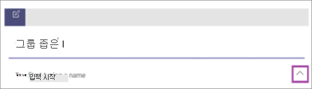

    그룹 채팅에 액세스할 수 있는 모든 사용자는 [메시지를 보낼](https://support.microsoft.com/office/send-and-read-messages-in-teams-b29e60ec-76af-4d97-8c3c-a4e36f2b64aa?ui=en-us&rs=en-us&ad=us) 수 있습니다.

2. 대화에 사람을 추가합니다.

    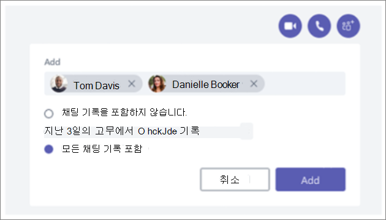

   그룹 채팅에 사용자를 추가할 때(일대일이 아님) 채팅 **기록** 및 공유하려는 **기록 기간을** 포함할 수 있습니다.

3. 그룹 채팅을 관리합니다.
  
    

   그룹 채팅의 사용자를 확인하려면 채팅 헤더의 참가자 수를 마우스로 가리키면 모든 사람의 이름 목록을 표시합니다.

**옵션 2: Kaizala 플랫 그룹에서 Teams 팀으로 전환**:

대상 그룹 통신의 경우 플랫 그룹에 대한 팀을 만들 수 있습니다. 최대 25,000명의 멤버를 추가하여 스레드 대화와 구조화된 통신을 수행할 수 있습니다. 이러한 유형의 통신을 통해 조정 및 관리 역할이 원활하게 실행되도록 할 수 있습니다.

1. 팀 만들기: Teams 시작하고 실행하려면 팀을 만들고, 사람을 추가하고, 채널을 추가해야 합니다. 자세한 내용은 [첫 번째 팀을 참조하세요](get-started-with-teams-create-your-first-teams-and-channels.md).
2. 팀 소유자에 대한 가이드를 검토합니다.

   [팀 소유자는](https://support.microsoft.com/office/go-to-guide-for-team-owners-92d238e6-0ae2-447e-af90-40b1052c4547?ui=en-us&rs=en-us&ad=us) 새 구성원과 게스트를 추가하고, 구성원을 소유자로 변경하고, 채널 및 설정을 관리하고, 더 이상 사용되지 않는 팀을 보관할 수 있습니다.

3. 팀에 대량 멤버를 추가합니다.

    팀 소유자인 경우 팀 목록의 팀 이름으로 이동하여 **추가 옵션** 단추를 선택한 > **구성원 추가를 선택합니다**.

    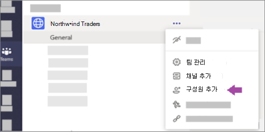

    메일 그룹, 보안 그룹 또는 Microsoft 365 그룹을 입력하여 팀에 추가할 수 있습니다. 자세한 내용은 [Teams 팀에 구성원 추가](https://support.microsoft.com/office/add-members-to-a-team-in-teams-aff2249d-b456-4bc3-81e7-52327b6b38e9?ui=en-us&rs=en-us&ad=us)를 참조하세요.

### 소비자 앱 메시징 환경 모방

사용자에게 간소화된 환경을 선호하는 경우 사용자가 이미 사용 중인 소비자 도구를 모방하도록 조직의 Teams 환경을 구성하도록 선택할 수 있습니다.

간소화된 통신 및 교대 근무(선택 사항)를 사용하도록 설정된 **채팅에서 즐겨찾는 채널 표시** 를 사용하여 Kaizala 사용자의 Teams 여정을 시작하는 것이 좋습니다.

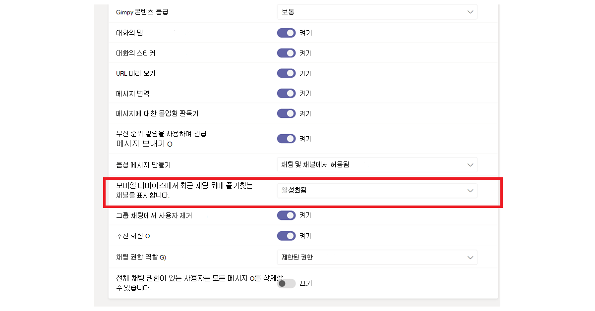

다음은 Shifts를 사용하는 팀 인터페이스의 예 **입니다.**

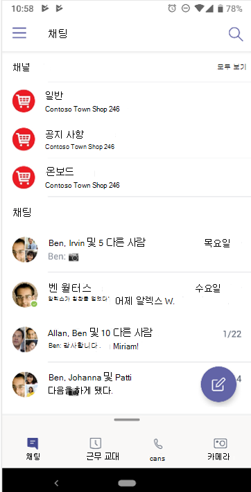

**다음은 Shifts가 없는** 팀 인터페이스의 예입니다.

 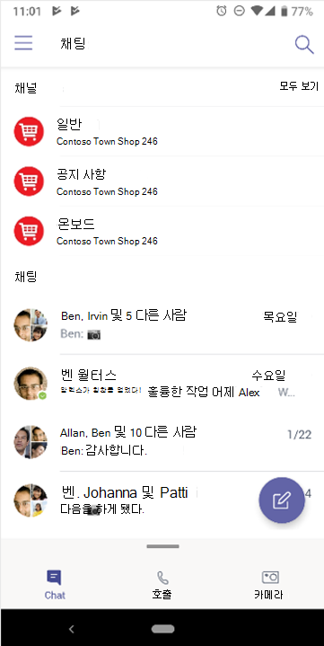

> [!NOTE]
> Teams 단추에 대한 액세스를 제거하여 위의 채팅에 강조 표시된 채널만 있는 최전방 작업자를 위한 간소화된 인터페이스를 만들 수 있습니다. 자세한 내용은 [Teams 메시징 정책 관리를](messaging-policies-in-teams.md) 참조하세요.

### Teams 및 채널을 사용하여 계층적 그룹 구조 만들기

Kaizala 계층적 그룹을 사용하면 조직에서 구성원 간의 통신 유형에 따라 다른 그룹 구조에서 상호 작용할 수 있습니다.  Teams 조직도와 일치하는 Teams 및 채널을 만들고 계층 기반 통신을 설정할 수 있습니다. Teams 내의 계층 구조를 사용하여 필요한 작업, 중요한 뉴스 및 업데이트를 멤버에게 경고할 수 있습니다.

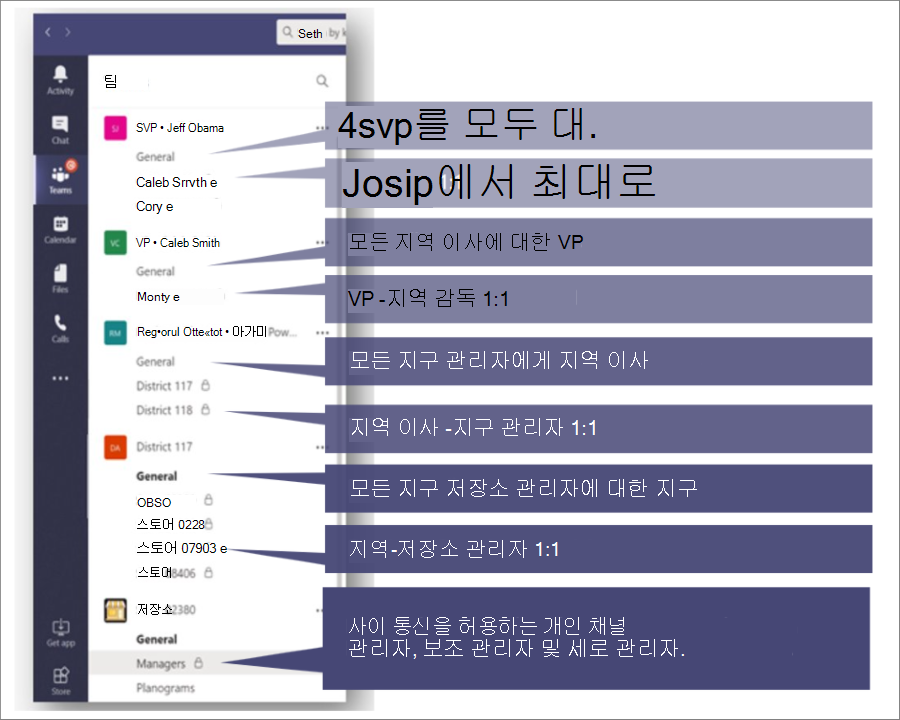

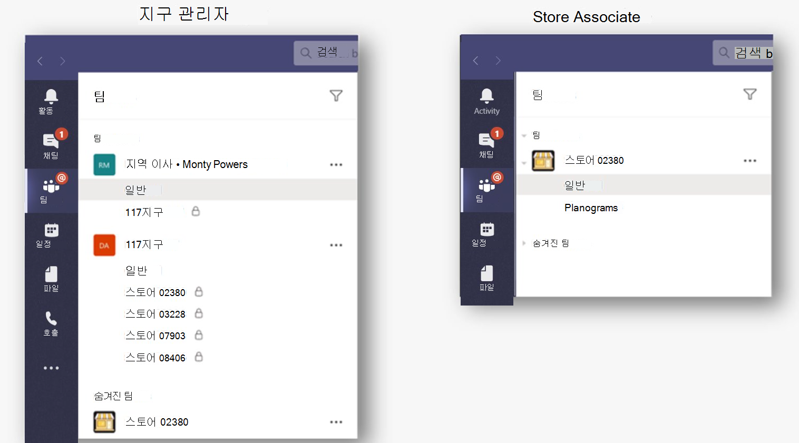

자세한 내용은 [Microsoft Teams 팀을 구성하기 위한 모범 사례를](best-practices-organizing.md) 참조하세요.

### Teams 및 채널을 사용하여 중요한 뉴스 브로드캐스트

Kaizala 브로드캐스트 그룹에서 관리자는 대상 그룹에 메시지와 작업을 보낼 수 있습니다. 마찬가지로 여러 채널에 게시하여 Teams 메시지를 브로드캐스트할 수 있습니다. 중요한 메시지에 주의를 기울이려면 알림 게시물을 만듭니다.

채널 조정을 사용하면 메시지를 게시하고 회신할 수 있는 사용자를 제어할 수 있습니다. 방송사가 더 많은 시청자에게 도달할 수 있도록 팀 전체에서 채널을 선택할 수 있습니다. 알림에 대한 상호 작용을 제한하여 응답할 수 있는 기능을 가진 관리자 및 중재자만 선택할 수 있도록 할 수 있습니다. 다음 단계에 따라 Teams 채널 내에서 채널 조정을 설정합니다.

**1단계**: 채널 조정 설정

- 브로드캐스트 채널 선택

- **채널 설정을** 선택하여 조정 설정

- "중재자가 Who?"로 이동합니다. 채널에 대한 중재자를 수동으로 선택하려면

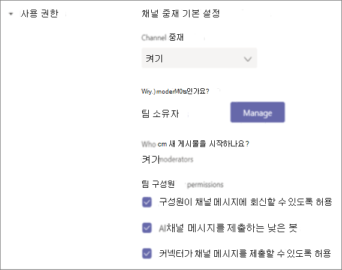

**2단계**: 메시지 서식 지정
팀 구성원에게 중요한 뉴스 또는 작업을 알리는 공지 사항을 만듭니다.

   

- 채널에서 메시지를 입력하는 상자에서 서식을 선택합니다.

- 표시되는 상자 맨 위에서 새 대화 > 알림 옆에 있는 화살표를 선택합니다.

- 제목을 입력하거나 배경색을 변경하거나 헤드라인 영역에 대한 배경 이미지를 추가합니다.

- 하위 헤드 추가 영역에 공지의 제목을 입력한 다음 메시지 본문을 입력하고 보내기 단추를 선택합니다.

    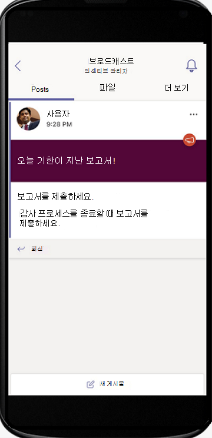

**3단계**: 메시지 브로드캐스트에 대한 채널을 선택합니다.

대규모 그룹에 도달해야 하는 중요한 공지 사항 및 정보가 있는 경우 여러 Teams 및 채널에 교차 게시할 수 있습니다.

  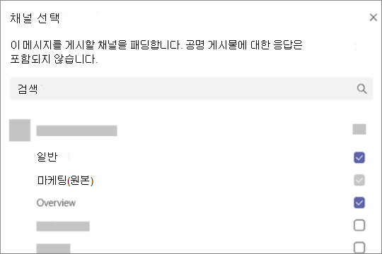

자세한 내용은 [Teams 채널 대화 교차 게시를](https://support.microsoft.com/office/cross-post-a-channel-conversation-in-teams-9c1252a3-67ef-498e-a7c1-dd7147b3d295?ui=en-us&rs=en-us&ad=us) 참조하세요.

## Teams 작업 완료

작업을 완료하는 데 있어 올바른 도구를 사용하면 효율성을 높일 수 있습니다. Kaizala [OOB(기본 제공) 작업 카드를](/kaizala/partnerdocs/kaizalaactioncards) 사용하여 일상적인 작업을 더 쉽고 효율적으로 관리할 수 있습니다.
Microsoft Teams Kaizala 기본 실행 카드에 대한 몇 가지 기능과 솔루션을 제공합니다.

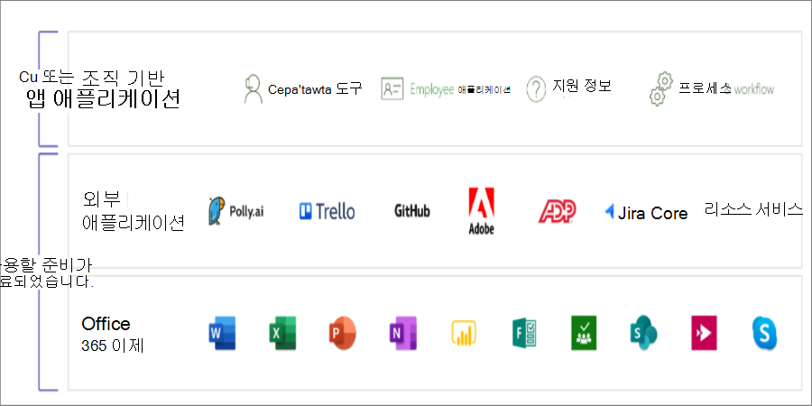

Teams 플랫폼을 사용하면 즉시 사용할 수 있는 Microsoft 365 애플리케이션 및 타사 앱과 함께 Microsoft Teams 통합을 통해 기존 조직 도구를 사용할 수 있습니다. 현재 Microsoft Teams 800개가 넘는 외부 애플리케이션을 사용할 수 있습니다.

### Teams 설문 조사, 설문 조사 및 검사 목록

[설문 조사](https://github.com/OfficeDev/microsoft-teams-apps-poll/wiki), [설문 조사](https://github.com/OfficeDev/microsoft-teams-apps-survey) 및 [검사 목록](https://github.com/OfficeDev/microsoft-teams-app-checklist) 작업 카드는 이제 [GitHub 즉시 설치할 Teams 메시지 확장](/microsoftteams/platform/messaging-extensions/what-are-messaging-extensions) 앱 템플릿으로 사용할 수 있습니다.

**설문 조사를** 통해 사용자는 채팅 또는 채널에서 신속하게 설문 조사를 만들고 보내 팀의 의견을 알 수 있습니다. 폴링 앱은 데스크톱, 브라우저, iOS 및 Android 클라이언트와 Teams 모든 플랫폼에서 지원됩니다. 기존 Microsoft 365 구독의 일부로 배포할 준비가 완료되었습니다.

**설문 조사를** 통해 사용자는 채팅 또는 채널에서 설문 조사를 만들어 일련의 질문을 하고 실행 가능한 인사이트를 얻을 수 있습니다. 등록, 등록, 피드백, 평가, 잠재 고객 캡처, 보고, 불만 및 평가에 대한 설문 조사를 사용합니다. 설문 조사 앱은 데스크톱, 브라우저, iOS 및 Android 클라이언트와 Teams 모든 플랫폼에서 지원됩니다. 기존 Microsoft 365 구독의 일부로 배포할 준비가 된 것입니다.

**검사 목록을** 사용하면 채팅 또는 채널에서 공유 검사 목록을 만들어 팀과 공동 작업할 수 있습니다. 체크리스트 앱은 데스크톱, 브라우저, iOS 및 Android 클라이언트와 Teams 모든 플랫폼에서 지원됩니다. 기존 Microsoft 365 구독의 일부로 배포할 준비가 된 것입니다.

또한 기존 Microsoft 365 및 타사 앱을 사용하여 팀에 빠른 설문 조사, 설문 조사 및 검사 목록을 즉시 보낼 수 있습니다.

[Microsoft Forms](https://techcommunity.microsoft.com/t5/microsoft-forms-blog/microsoft-forms-works-great-with-microsoft-teams/ba-p/109915) 통해 정보를 수집하고 신속하게 의사 결정을 내릴 수 있습니다. 양식이 Teams 통합되어 있으므로 폼 탭을 쉽게 설정하고, 양식에 대한 알림을 만들고, 빠른 설문 조사를 수행할 수 있습니다. 방법을 알아보려면 [Microsoft Teams 양식 만들기, 편집 및 검토를](https://support.microsoft.com/office/work-with-colleagues-to-create-edit-and-review-forms-in-microsoft-teams-333b97a3-41d9-48bc-a1cb-84a96bd44e14#:~:text=1%20In%20Teams%2C%20go%20to%20the%20channel%20you,name%20for%20your%20new%20form.%20More%20items...%20) 참조하세요.

Polly 및 SurveyMonkey와 같은 타사 앱을 사용하면 Teams 설문 조사 및 설문 조사를 추가로 수행할 수 있습니다.

- **Polly**  를 사용하면 실시간 설문 조사 인사이트를 확보하여 더 나은 비즈니스 의사 결정을 내리고 포괄적인 대시보드 보기를 통해 설문 조사에서 팀 참여를 측정할 수 있습니다.

- **SurveyMonkey** 는 Microsoft Teams 이미 비즈니스를 수행하고 있는 위치에 대한 설문 조사를 제공하므로 일상적인 워크플로에 설문 조사를 쉽게 추가할 수 있습니다. Microsoft Teams 내부에서 간단한 한 질문 설문 조사를 작성하고 보낸 다음 팀 동료의 결과가 들어오는 것을 지켜봅니다.

### Teams 작업

**[Microsoft Planner 사용하여 Teams](https://support.microsoft.com/office/organize-your-team-s-tasks-in-microsoft-planner-c931a8a8-0cbb-4410-b66e-ae13233135fb?ui=en-us&rs=en-us&ad=us)** 작업을 실행합니다. 팀과 프로젝트를 공동 작업하고, 진행률 보고서를 보고, 개별 과제를 추적할 수 있습니다.

Microsoft Teams 사용하는 동안 팀 채널에 하나 이상의 Planner 탭을 추가하여 작업을 구성할 수 있습니다. 그런 다음, Teams 내에서 또는 웹용 Planner에서 계획을 작업하고, 계획을 제거하거나 삭제하고, Planner에서 작업이 할당될 때 Teams 알림을 받을 수 있습니다.

### Teams 공지 사항

[회사 통신기](/microsoftteams/platform/samples/app-templates#company-communicator) 앱과의 채팅을 통해 여러 팀 또는 많은 수의 직원을 위한 메시지를 만들고 보냅니다. 이 인터페이스를 사용하면 지정된 사용자가 대상 방식으로 메시지를 만들고, 미리 보기하고, 공동 작업하고, 보낼 수 있습니다. 관리 결정에 직접 연결된 인사이트를 사용하여 메시지를 승인하거나 상호 작용한 사용자 수에 대한 사용자 지정 개인 데이터와 같은 사용자 지정 대상 통신 기능을 빌드합니다.

### 사진 체크 인

Teams Smart 카메라 사용하여 주석이 추가된 이미지를 캡처하고 팀과 공유합니다. 손쉽게 위치를 정밀하게 공유하여 팀을 파악할 수 있습니다. Kaizala 기능이 Teams 매핑하는 방법을 전달하려면 더 많은 정보가 필요합니다. 확실히 우리가 문서에 할 수있는 슬라이드 데크에서 많은 정보를 가지고있다.

[직원 체크 인](/microsoftteams/platform/samples/app-templates#staff-check-ins) 앱 템플릿을 사용하여 일선 직원이 Teams 직접 예약 또는 임시로 시간에 중요한 정보 및 상태 업데이트를 쉽게 제공할 수 있습니다. 앱은 실시간 위치, 사진, 메모, 미리 알림 알림 및 자동화된 워크플로를 지원합니다.

### Teams 퀴즈

퀴즈는 사용자 지정 [Teams 메시징 확장](/microsoftteams/platform/messaging-extensions/what-are-messaging-extensions)으로, 채팅 또는 채널 내에서 지식 점검 및 즉각적인 결과를 위한 퀴즈를 만들 수 있습니다. 퀴즈, 수업 내 및 오프라인 시험, 팀 내 지식 점검, 팀 내에서 재미있는 퀴즈를 사용할 수 있습니다. 퀴즈 앱은 Teams 데스크톱, 브라우저, iOS 및 Android 클라이언트와 같은 여러 플랫폼에서 지원됩니다. 이 앱은 기존 Microsoft 365 구독의 일부로 배포할 준비가 된 것입니다.

[GitHub](https://github.com/OfficeDev/microsoft-teams-apps-quiz)

  

### Teams 교육

[직원 체크 인](/microsoftteams/platform/samples/app-templates#staff-check-ins) 앱 템플릿을 사용하여 일선 직원이 Teams 직접 예약 또는 임시로 시간에 중요한 정보 및 상태 업데이트를 쉽게 제공할 수 있습니다. 앱은 실시간 위치, 사진, 메모, 미리 알림 알림 및 자동화된 워크플로를 지원합니다.

Teams 사용하여 조직에서 교육을 쉽게 수행할 수 있습니다. 교육은 사용자가 오프라인 지식 공유 및 업스킬링을 위해 채팅 또는 채널 내에서 교육을 게시할 수 있도록 하는 사용자 지정 [Teams 메시징 확장](/microsoftteams/platform/what-are-messaging-extensions) 앱입니다. 이 앱은 데스크톱, 브라우저, iOS 및 Android 같은 여러 Teams 플랫폼 클라이언트에서 지원됩니다. 이 앱은 Microsoft 365 구독의 일부로 배포할 준비가 된 것입니다.

[GitHub](https://github.com/OfficeDev/microsoft-teams-apps-training)

컨텍스트 정보에 대한 액세스를 제공하여 온보딩을 간소화할 수 있습니다.  직원 가이드, 교육 및 보다 쉽게 사용 가능하고 최신 상태로 만들어 기술을 통해 조직의 역량을 강화합니다. 교육 시나리오에 대한 자세한 내용은 [새 직원 온보딩을 참조하세요](https://support.microsoft.com/office/effectively-onboard-new-employees-691faccd-1d1a-4f47-99ac-b6c82973f5ee).

## Kaizala 사용자 지정 솔루션을 Microsoft Teams 이동

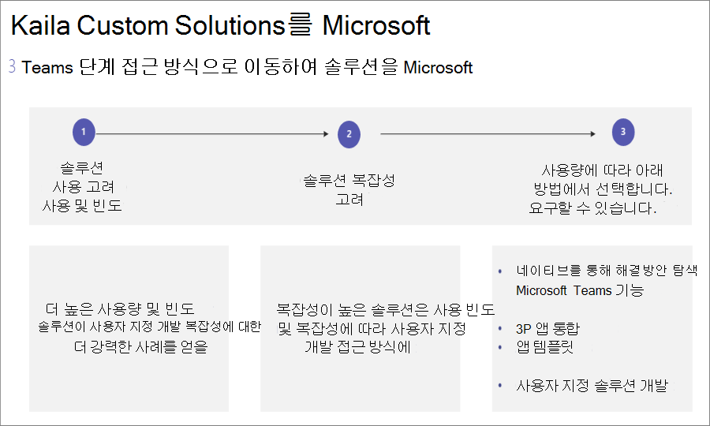

이 3단계 접근 방식을 따라 솔루션을 Microsoft Teams 수 있습니다.

1. 솔루션 사용량 및 빈도를 고려합니다.

    솔루션에 대한 높은 사용량과 빈도는 사용자 지정 개발에 더 강력한 사례를 제공합니다.

2. 솔루션 복잡성을 고려합니다.

    복잡성이 높은 솔루션은 사용자 지정 개발을 위해 더 강력한 사례를 보증할 수 있습니다.

3. 사용 빈도 및 복잡성당 다음 방법을 살펴봅니다.

    - 네이티브 Microsoft Teams 기능 활용

    - [타사 앱 통합 사용 및 앱 스토어 탐색](deploy-apps-microsoft-teams-landing-page.md)

    - [앱 템플릿 검색](/microsoftteams/platform/samples/app-templates)

    - [Teams 플랫폼을 사용하여 사용자 지정 앱](/microsoftteams/platform/overview) 빌드

## Microsoft Teams 관리

### IT 전문가

Kaizala 관리 포털에서 Microsoft Teams 관리 센터로 관리를 전환합니다. Teams 관리 센터는 주로 관리자 역할만 사용하기 위한 것입니다.

관리자는 전체 Teams 워크로드를 관리하거나 통화 품질 문제를 해결하거나 조직의 전화 통신 요구 사항을 관리하기 위한 위임된 권한을 가질 수 있습니다.

관리 센터를 탐색하려면 [Microsoft Teams 관리 센터를 방문하세요](https://admin.teams.microsoft.com/).

Microsoft Purview 규정 준수 포털 및 [Microsoft Security Center](/microsoft-365/security/defender/overview-security-center)를 사용하여 Microsoft 365 조직의 [보안 및 규정](/microsoft-365/compliance/microsoft-365-compliance-center) 준수를 모니터링할 수 있습니다.

Microsoft 365 그룹, ID, 라이선스 및 액세스를 검토할 수 있는 [Azure Active Directory 관리 센터에서](https://aad.portal.azure.com/#@microsoft.onmicrosoft.com/dashboard/private/c7736064-7b28-4f3d-b366-2740a8d48020) 비즈니스를 보호하고 사용자에게 권한을 부여합니다.

## Teams 관리 센터로 Kaizala 관리 포털

### 최종 사용자 지침

다음 표를 사용하여 Kaizala 관리 포털에서 Microsoft Teams 해당 기능을 탐색합니다.

| Kaizala 관리 포털 | Microsoft Teams 앱|
|---------|-----------------------|
| 그룹 만들기(조직에 연결됨) | 데스크톱 또는 모바일 앱을 통해 **팀 만들기** |
| 대량으로 사용자 추가 | 팀에 사용자를 대량으로 추가하려면 O365 그룹, O365 DL 또는 보안 그룹을 통해 팀을 만드는 것이 좋습니다. |
| 디렉터리 | 팀의 **검색 표시** 줄을 통해 조직의 모든 사용자를 검색합니다. 검색 결과는 파일, 메시지 및 게시물도 반환합니다. |
| 분석(작업 카드) | **설문 조사**, **설문 조사** 및 **검사 목록은** 다운로드 가능한 데이터를 사용하여 보고서를 작성했습니다. 사용자가 사용할 수 있는 Teams 작업 앱의 도움으로 작업을 할당할 수도 있습니다. 더 많은 시나리오의 경우 **Trello**, **Asana** 와 같은 타사 앱도 Teams 내에서 사용하도록 탐색할 수 있습니다. |
| 확장 – 커넥터 | **커넥터** 가 필요한 채널의 메뉴(...)에서 커넥터 옵션을 사용합니다. |
| [분석(사용량) 채택 보고서](teams-analytics-and-reports/view-analytics.md), [사용 현황 보고서](teams-analytics-and-reports/teams-usage-report.md), [활동 보고서](teams-analytics-and-reports/user-activity-report.md) | 팀 소유자는 메뉴(...)를 탐색하여 **팀 분석을 관리하여 팀의** >  보고서에 액세스할 수 **있습니다**. |

> [!NOTE]
> Teams 최종 사용자는 데스크톱 또는 모바일에서 Teams 사용하여 개별 팀과 채널을 관리할 수 있으며 Teams 관리 센터에 액세스할 필요가 없습니다.

## Kaizala 그룹 해산

Teams 채널 및 채팅으로 전환할 때 Kaizala 그룹 해산을 고려하여 조직에 커뮤니케이션의 중심이 되도록 할 수 있습니다. Kaizala 그룹을 삭제하면 채팅 목록에서 그룹이 제거됩니다. 그룹의 유일한 관리자인 경우 삭제하기 전에 그룹의 한 명 이상에게 관리자 역할을 할당해야 합니다.

### Kaizala 그룹을 Teams 이동하려면

 1. Kaizala 그룹 구성원과 Teams 티저 공유

 2. Teams 사이트 설정

 3. Teams 사용자 추가

 4. 모든 Kaizala 그룹 구성원에게 전환 알림

 5. 설정에서 [Kaizala 그룹을](#to-switch-to-kaizala-group-to-read-only) **읽기 전용** 으로 전환합니다.

 6. Teams Kaizala 그룹 구성원과 더 나은 옵션인 이유에 대한 이유 공유

 7. 예를 들어 Teams 사용할 수 있는 시기와 Teams 사용 방법 등 지침을 공유합니다.

 8. 참여 콘테스트 시작

 9. 리더십 참여 설정

 10. 구성원의 피드백 검색

 11. 콘텐츠 달력 팔로우

 12. [Kaizala 그룹 삭제](#to-delete-a-group)

### Kaizala 그룹으로 읽기 **전용** 으로 전환하려면

1. Kaizala 관리 포털에 로그인합니다.

2. 왼쪽 탐색 패널에서 **그룹** 탭을 선택하고 **읽기 전용** 으로 설정할 그룹을 선택합니다.

    

3. 드롭다운 목록에서 **정책 편집** 을 선택합니다.
  
    

4. **그룹 정책** 창에서 다음 옵션을 선택 취소합니다.

     - 새 참가자가 채팅 기록을 볼 수 있도록 허용합니다. 지금부터 보낸 메시지가 표시됩니다.

     - 구성원이 메시지 및 첨부 파일을 보낼 수 있도록 허용합니다.

       

     > [!NOTE]
     > 관리자는 그룹에 게시할 수 있습니다.

### 그룹을 삭제하려면

1. 채팅 목록에서 그룹 대화를 길게 누릅니다.

2. 그룹 삭제를 탭합니다.

## Kaizala 테넌트 데이터 내보내기

Kaizala 테넌트 관리자/전역 관리자는 Kaizala 관리 포털에서 Kaizala 테넌트 데이터를 내보낼 수 있습니다. Teams 사용하는 동안 Kaizala 회사 데이터를 계속 제어할 수 있습니다. 자세한 내용은 [관리 포털에서 테넌트 데이터 내보내기를 참조하세요](/office365/kaizala/export-or-delete-your-data).

### 데이터를 내보내려면

 1. 왼쪽 탐색 패널에서 **분석** 탭을 선택하고 **테넌트 데이터 내보내기를** 선택합니다.
  
    

 2. **내보내기** 선택

    

 3. 그룹 이름/타임스탬프에 대한 필터와 함께 테넌트 메시지 파일을 사용하여 그룹 수준 채팅 데이터에 액세스합니다.

    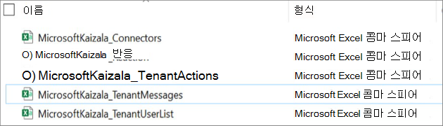

## Kaizala 그룹 삭제

Kaizala 그룹을 삭제하면 채팅 목록에서 그룹이 제거됩니다. 그룹의 유일한 관리자인 경우 삭제하기 전에 그룹의 한 명 이상에게 관리자 역할을 할당해야 합니다.

그룹을 삭제하려면 다음을 수행합니다.

- 채팅 목록에서 그룹 대화를 길게 누릅니다.

- 그룹 삭제를 탭합니다.

## 테넌트 데이터 내보내기 Kaizala

Teams 사용하는 동안 Kaizala 회사 데이터를 계속 제어할 수 있습니다. 자세한 내용은 [관리 포털에서 테넌트 데이터 내보내기를 참조하세요](/office365/kaizala/export-or-delete-your-data).

## 외부 사용자(공급업체/공급업체/파트너)와 공동 작업

Microsoft Teams 외부 당사자와 공동 작업할 수 있는 안전한 솔루션을 제공하며, Microsoft Teams 연결 통해 조직 외부의 모든 사용자와 더욱 쉽게 작업할 수 있습니다. Teams 상업용 사용자가 외부 상용 사용자, 즉 다른 조직의 상용 사용자와 채팅할 수 있도록 합니다. 이 권한을 바탕으로 Teams 개인 계정을 사용하는 경우에도 조직 외부의 팀 구성원과 채팅할 수 있습니다. 이러한 계정은 SMB에서 자주 사용되므로 이 새로운 기능은 외부 파트너와의 관계를 강화하는 데 도움이 됩니다.

이전에 [Ignite](https://techcommunity.microsoft.com/t5/microsoft-teams-blog/microsoft-ignite-fall-2021-innovations-coming-to-microsoft-teams/ba-p/2824127)에서 발표한 대로 연결하려는 전체 전자 메일 주소 또는 전화 번호를 입력하여 채팅에 Teams 사용자를 초대하고 테넌트 전환이 필요하지 않은 Microsoft 개인 계정을 가진 모든 사용자와 일대일 또는 그룹 채팅을 시작할 수 있습니다.

테넌트 전환 없이 외부 사용자와 채팅하면 필요한 결과를 더 빠르게 얻을 수 있습니다. 작동 방식을 좀 더 자세히 살펴보겠습니다.

조직의 관리 설정 및 Teams 개인 계정 사용자의 관리 설정에 따라 외부 Teams 개인 계정 사용자와 대화를 시작할 수 있으며 외부 Teams 개인 계정 사용자는 회사 사용자의 Teams 대화를 시작할 수 있습니다.

조직에서 관리하는 Teams 사용자는 전체 전자 메일 주소 또는 전화 번호를 입력하여 채팅하려는 Teams 개인 계정 사용자를 초대할 수 있습니다. Teams 개인 사용자는 연결하려는 사용자의 정확한 조직 전자 메일 주소를 입력하고 채팅을 시작할 수 있습니다.

채팅하려는 사용자가 아직 Teams 않은 경우 개인 계정을 사용하여 대화에 참여하도록 초대하는 전자 메일 또는 문자 메시지를 받게 됩니다. Teams 개인 계정에 등록하고 로그인하면 채팅에 참가할 수 있습니다.

초대한 사용자가 초대를 수락하면 새로운 일대일 또는 그룹 채팅을 시작하거나 기존 외부 그룹 채팅에 추가할 수도 있습니다. 이 채팅 스레드는 다른 채팅과 함께 표시되며 채팅을 보는 데 테넌트 전환이 필요하지 않습니다.

채팅의 일부로 풍부한 메시지, GIF 및 미디어를 보내고 받아 자신을 표현할 수 있습니다.

원하는 대화에만 남아 있도록 선택할 수 있습니다. 외부 사용자의 메시지를 차단하거나 그룹 채팅을 떠날 수 있습니다.

조직 및 Teams 개인 계정 사용자가 관리하는 Teams 사용자는 외부 초대를 거절할 수 있습니다. 외부 사용자가 수락하기 전에 최대 10번까지 메시지를 보낼 수 있지만, 10개의 메시지 후에 수락하지 않으면 이 사용자에게 추가 메시지를 보낼 수 없습니다.

[지원 페이지를](https://support.microsoft.com/en-us/office/add-or-invite-people-outside-your-teams-org-to-a-chat-6897ab47-9f60-4db6-8b95-18599714fe57) 보고 [블로그](https://techcommunity.microsoft.com/t5/microsoft-teams-blog/microsoft-teams-users-can-now-chat-with-any-teams-user-outside/ba-p/3070832)를 읽어 Teams 신뢰할 수 있는 Teams 작업 영역의 안전 및 보안 내에서 외부 고객 및 파트너와 원활하게 협업할 수 있는 방법에 대해 자세히 알아보세요.

## 다음 단계

[최전방 근로자를 위한 Microsoft Teams](/MicrosoftTeams/drive-adoption-optimize-kaizala)
