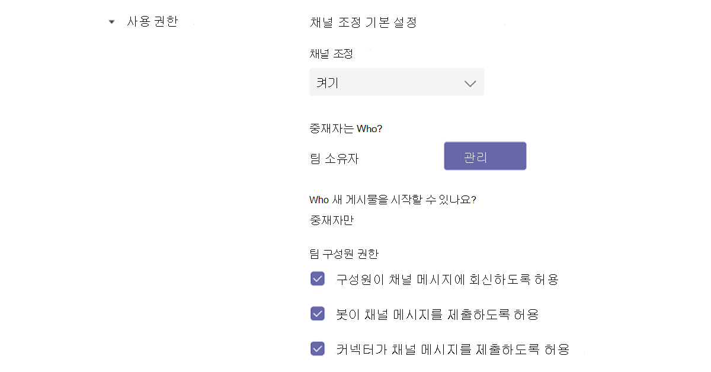
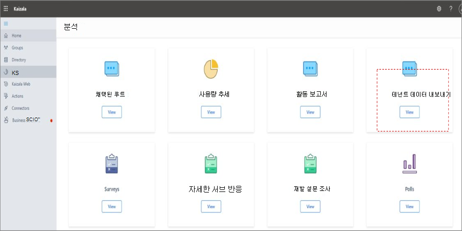

# 탐색 Microsoft Teams

조직의 고유한 경로와 요구 사항을 명확히 이해하게 됐기 위해 이제는 조직과의 강력한 공동 작업으로의 여정을 시작할 Microsoft Teams. 다음 섹션을 사용하여 Kaziala의 기능을 탐색하는 방법을 Teams.

| 에서 Kaizala | Teams |
|---------|-----------------------|
| 시작 - 로그인 및 프로필 설정| [시작 Teams](#getting-started) |
| 새 채팅 시작, 1:1 오디오 및 비디오 통화 | [채팅, Teams, 화상 통화](#starting-new-chats-11-audio-and-video-calls) |
| 사용자 Kaizala 그룹| [Kaizala 그룹으로 Teams](#moving-your-kaizala-groups-to-microsoft-teams) |
| 소비자 앱 메시징 환경 모방| [소비자 앱 메시징 환경 모방](#mimic-the-consumer-app-messaging-experience) |
| 상자 안의 작업 카드 |  [작업 수행 Teams](#getting-work-done-in-teams) |
| 설문 조사, 설문 조사, 검사 목록| [설문 조사, 설문 조사, 체크리스트를 Teams](#polls-surveys-and-checklists-in-teams) |
| 모임 - 작업 카드| [모임 - 모임을 Teams](#getting-work-done-in-teams) |
| 공지사항 - 작업 카드| [의 Teams](#announcements-in-teams) |
| 사진 체크 인 작업 카드| [사진 체크 인 Teams](#photo-check-ins)
| 퀴즈 - 작업 카드| [퀴즈의 Teams](#quiz-in-teams)
| 교육 - 작업 카드| [Teams](#training-in-teams) |
| 사용자 지정 작업 카드 | [사용자 지정 솔루션 Teams](#moving-kaizala-custom-solutions-to-microsoft-teams) |
| Kaizala 관리 포털| [IT 프로의 경우](#it-professionals) |
| | [최종 사용자의 경우](#end-user-guidance) |
| Kaizala 그룹 해산| [Kaizala 그룹 해산](#kaizala-group-dissolution) |
| Kaizala 테넌트 데이터 내보내기| [테넌트 Kaizala 내보내기](#export-kaizala-tenant-data)  |
| 외부 사용자(공급업체/공급업체/파트너)와 공동 작업| [개인 Teams 작업 및 Teams 사용](#collaborating-with-external-usersvendorssupplierspartners) |

## 시작

시작 가이드를 통해 Kaizala Teams 보다 쉽게 시작할 수 있습니다. 여정을 시작하는 Microsoft Teams 자세한 내용은 시작을 [Teams.](https://support.microsoft.com/office/start-and-pin-chats-a864b052-5e4b-4ccf-b046-2e26f40e21b5?wt.mc_id=otc_microsoft_teams&ui=en-us&rs=en-us&ad=us)

## 새 채팅 시작, 1:1 오디오 및 비디오 통화

1:1 또는 그룹 채팅을 만들어 소규모 그룹과 공동 작업하거나 개인적으로 대화할 Teams. 채팅을 고정하고 메시지를 저장하여 빠르게 액세스할 수 있습니다. 서식이 풍부한 텍스트 서식, 이모티콘 및 gif로 채팅을 시작한 경우 이모티[콘](https://support.microsoft.com/office/start-and-pin-chats-a864b052-5e4b-4ccf-b046-2e26f40e21b5?wt.mc_id=otc_microsoft_teams&ui=en-us&rs=en-us&ad=us)의 채팅을 Teams.

조직의 모든 사용자와 1:1 또는 그룹 통화를 시작하여 효율적으로 통신합니다. 이 Teams 사용하면 오디오 및 비디오 통화를 모두 유연하게 할 수 있습니다.  시작은 통화 [만들기를 참조합니다](https://www.microsoft.com/videoplayer/embed/RE4rxv0?pid=ocpVideo0-innerdiv-oneplayer&postJsllMsg=true&maskLevel=20&market=en-us).

그룹에서 Kaizala 그룹으로 Microsoft Teams, 채널 및 그룹 Teams 만들기를 통해 Teams.

Teams 조직 내에서 다양한 프로젝트 및 결과를 둘러싼 사람, 콘텐츠 및 도구의 모음입니다.

Teams 팀원과의 토픽별 대화인 채널로 구성됩니다. 각 채널은 특정 토픽, 부서 또는 프로젝트에 전념합니다. 채널은 애플리케이션으로 확장할 때 가장 가치가 있습니다. 자세한 내용은 채널 [에서 작업을 참조하세요](https://support.microsoft.com/office/teams-and-channels-df38ae23-8f85-46d3-b071-cb11b9de5499?ui=en-us&rs=en-us&ad=us#ID0EAABAAA=Work_in_channels).

**그룹 채팅** 을 사용하면 인스턴트 메시징을 통해 동료를 빠르게 수집할 수 있습니다.

### 채팅 및 Teams 대화

|채팅의 대화 | 팀 채널의 대화 |
|---------|---------|
|간단한 대화의 경우 받는 사람에게 직접 메시지를 보냅니다.   | 열려 있는 공간에서 여러 토픽이 논의되는 상호 작용의 경우  |
|비공개 채팅은 채팅의 사용자만 볼 수 있습니다.     | 팀의 모든 사람이 볼 수 있습니다.        |
|연속적이지 않은 대화     | 구조화된 여러 스레드 대화        |
|최대 250명     | 최대 25,000명        |
|새 채팅 참가자와 채팅 기록을 공유할지 선택     | 기록은 모든 새 팀 구성원과 공유됩니다.        |
|채팅에 이미 있는 사용자에 의해 새 채팅 받는 사람을 추가해야 합니다.     | 사용자는 검색하여 팀에 참가할 수 있습니다. 개인 Teams Teams 새 구성원을 승인합니다. 채널 구성원은 관리자 승인 없이 새 멤버가 직접 참가할 수 있도록 코드를 생성할 수 있습니다.        |
|스팟 화면 공유 및 오디오 및 비디오 통화. 모든 채팅 참가자와 Teams 쉽게 모임을 계획할 수 있습니다.     | 현장에서 예약된 오디오 및 비디오 통화        |
|앱의 일부 사용 가능성     | 앱으로 전체 사용 가능성 및 사용자 지정        |

채팅, Teams 및 그룹 채팅에 대한 개요는 팀 및 [Microsoft Teams.](teams-channels-overview.md)

## 그룹 Kaizala 그룹으로 Microsoft Teams

Kaizala 그룹은 사용자 컬렉션입니다. 플랫 그룹, 계층 구조 그룹 및 브로드캐스트 Kaizala 세 가지 유형의 그룹 구조가 있습니다. 전환할 때 Microsoft Teams, 채널 및 그룹 Teams 채팅을 사용하여 조직에 대한 유사한 통신 구조를 만들 수 있습니다.

그룹에서 그룹, 채널 및 그룹 채팅으로 전환하는 Teams 지침을 따르세요.

플랫 그룹을 Kaizala 두 가지 방법으로 Teams.

- 옵션 1: Kaizala 그룹 채팅에서 그룹 채팅으로 전환하는 Teams

- 옵션 2: Kaizala 그룹에서 팀으로 Teams 전환

**옵션 1: Kaizala 그룹에서 그룹 채팅으로 전환 Teams**

최대 250명 Teams 빠른 허들 및 일시적인 대화를 개최할 수 있는 그룹 채팅을 만들 수 있습니다. 그룹 채팅을 사용하면 조직의 사용자가 누구나 채팅에 추가할 수 있는 공개 대화를 위한 중앙 장소를 사용할 수 있습니다.

1. 그룹 채팅을 시작하고 이름을 지정합니다.

    

    그룹 채팅에 액세스할 수 있는 모든 사람은 메시지를 [보낼 수 있습니다](https://support.microsoft.com/office/send-and-read-messages-in-teams-b29e60ec-76af-4d97-8c3c-a4e36f2b64aa?ui=en-us&rs=en-us&ad=us).

2. 대화에 사용자 추가

    
    
   그룹 채팅에 다른 사람을 추가할 때(일대일이 아닌) 채팅 기록 및 공유하려는 기록  기간을 포함할  수 있습니다.

3. 그룹 채팅을 관리합니다.
  
    
    
   그룹 채팅에 참여하는 사람을 표시하기 위해 채팅 헤더에 있는 참가자 수를 마우스로 마우스로 하여 모든 사용자 이름 목록을 표시하세요.

**옵션 2: Kaizala 그룹에서 팀으로 Teams 전환**
   
대상이 큰 그룹 통신의 경우 플랫 그룹에 대한 팀을 만들 수 있습니다. 최대 25,000명까지 멤버를 추가하여 스레드 대화와 구조화된 통신에 참여할 수 있습니다. 이러한 유형의 통신을 사용하면 중재 및 관리 역할이 원활하게 실행되도록 할 수 있습니다.

1. 팀 만들기: 팀을 만들고 실행하기 Teams 팀을 만들고, 사용자 추가하고, 채널을 추가해야 합니다. 자세한 내용은 첫 번째 [팀을 참조합니다](get-started-with-teams-create-your-first-teams-and-channels.md).
2. 팀 소유자에 대한 가이드를 검토합니다.

팀 소유자 [는](https://support.microsoft.com/office/go-to-guide-for-team-owners-92d238e6-0ae2-447e-af90-40b1052c4547?ui=en-us&rs=en-us&ad=us) 새 멤버와 게스트를 추가하고, 구성원을 소유자로 변경하고, 채널 및 설정을 관리하고, 더 이상 사용하지 못하고 있는 팀을 보관할 수 있습니다.

3. 팀에 대량 멤버 추가:

    팀 소유자인 경우 팀 목록의 팀 이름으로 이동한 다음, 추가 옵션 단추를 > **선택합니다**.

    

    팀에 추가할 메일 그룹, 보안 그룹 또는 Microsoft 365 입력을 시작할 수 있습니다. 자세한 내용은 해당 팀의 팀에 멤버 [추가를 Teams](https://support.microsoft.com/office/add-members-to-a-team-in-teams-aff2249d-b456-4bc3-81e7-52327b6b38e9?ui=en-us&rs=en-us&ad=us).

### 소비자 앱 메시징 환경 모방

사용자에 대해 간소화된 환경을 선호하는 경우 사용자가 이미 사용하고 있는 소비자 도구를 모방하도록 조직의 Teams 환경을 구성하도록 선택할 수 있습니다.

간편한 통신 및 Shifts(선택 사항)에 Kaizala 채팅에서 즐겨찾  기 채널 표시를 사용하도록 설정하여 사용자에 대한 Teams 여정을 시작하는 것이 좋습니다.

Shifts와 팀의 인터페이스의 **예는 다음과 같습니다**.

Shifts가 없는 Team 인터페이스의 **예는 다음과 같습니다**.

 

> [!NOTE]
> 대화에 대한 액세스를 제거하여 Teams 위에 표시된 채널만 표시하는 간소화된 프런트라인 작업자 인터페이스를 만들 수 있습니다. 자세한 내용은 에서 메시징 [정책 관리를](messaging-policies-in-teams.md) Teams.

### 계층 Teams 및 채널을 사용하여 계층 구조체 만들기

이 Kaizala 계층적 그룹을 사용하면 조직이 구성원 간의 통신 유형에 따라 서로 다른 그룹 구조에서 상호 작용할 수 있습니다.  Teams 차트에 Teams 및 채널을 만들고 계층 구조 기반 통신을 설정할 수 있습니다. 필요한 작업, 중요 뉴스 및 업데이트의 구성원에게 경고하는 데 Teams 계층 구조를 사용할 수 있습니다.

자세한 내용은 팀 구성에 대한 모범 사례를 [Microsoft Teams.](best-practices-organizing.md)

### 중요한 Teams 및 채널을 사용하여 중요한 뉴스를 브로드캐스트합니다.

Kaizala 그룹에서 관리자는 대상 그룹에 메시지 및 작업을 보낼 수 있습니다. 마찬가지로 여러 채널에 게시하여 메시지를 브로드캐스트할 Teams. 중요한 메시지에 주의를 기울이기 위해 공지 게시물을 생성합니다.

채널 중재를 사용하면 메시지를 게시하고 회신할 수 있는 사용자도 제어할 수 있습니다. 브로드캐스터가 더 많은 청중에게 도달할 수 있도록 팀 전체에서 채널을 선택해 볼 수 있습니다. 회신 기능을 사용하여 관리자 및 중재자 선택만 허용하는 공지에 대한 상호 작용을 제한할 수 있습니다. 다음 단계에 따라 채널 내에서 채널 Teams 수 있습니다.

**1단계**: 채널 중재 설정.

- 브로드캐스트 채널 선택

- 채널 **설정을 선택하여** 중재를 설정합니다.

- "Who 진행자인가요?"로 이동합니다. 채널에 대한 중재자 수동으로 선택

**2단계**: 메시지 서식 지정
팀 구성원에게 중요한 뉴스 또는 작업을 알리는 공지를 만들 수 있습니다.

   

- 채널에서 메시지를 입력하는 상자 아래에 있는 서식을 선택합니다.

- 나타나는 상자 맨 위에 새 대화 옆의 > 선택합니다.

- 헤드라인을 입력하거나, 배경색을 변경하거나, 헤드라인 영역에 대한 배경 이미지를 추가합니다.

- 하위 헤드 추가 영역에 공지의 제목을 입력한 다음 메시지 본문을 입력하고 보내기 단추를 선택합니다.
    

**3단계**: 메시지 브로드캐스트에 대한 채널을 선택합니다.

여러 사용자 그룹에 도달해야 하는 중요한 Teams 정보가 있는 경우 여러 채널 및 채널을 교차 게시할 수 있습니다.

  

자세한 [내용은 채널 대화](https://support.microsoft.com/office/cross-post-a-channel-conversation-in-teams-9c1252a3-67ef-498e-a7c1-dd7147b3d295?ui=en-us&rs=en-us&ad=us) 게시를 Teams.

## 작업 수행 Teams

작업을 완료하는 데 필요한 경우 올바른 도구로 효율성을 설정할 수 있습니다. 이 Kaizala [OOB(Out-of-Box)](/kaizala/partnerdocs/kaizalaactioncards) 작업 카드를 사용하여 일상적인 작업 관리를 쉽고 효율적으로 만들 수 있습니다.
Microsoft Teams 에서 Box Out-Action 카드에 대한 몇 가지 기능과 솔루션을 Kaizala.

이 Teams 플랫폼을 사용하면 애플리케이션 및 타사 앱과 함께 Microsoft Teams 통합을 통해 기존 조직 도구를 사용할 Microsoft 365 수 있습니다. 현재 300개가 넘는 외부 애플리케이션을 사용할 수 Microsoft Teams.

### 설문 조사, 설문 조사 및 Teams

[이제 설문 조사](https://github.com/OfficeDev/microsoft-teams-apps-poll/wiki), [설문](https://github.com/OfficeDev/microsoft-teams-apps-survey) 조사 및  검사 목록 작업 카드를 즉시 설치할 수 Teams 확장 앱 템플릿으로 사용할  수 GitHub.

**설문** 조사를 사용하면 채팅 또는 채널에서 신속하게 설문 조사를 만들고 보내 팀의 의견을 알 수 있습니다. 설문 조사 앱은 데스크톱, 브라우저Teams iOS 및 Android 클라이언트와 같은 모든 플랫폼에서 지원됩니다. 기존 구독의 일부로 배포할 Microsoft 365 준비되었습니다.

**설문** 조사를 통해 사용자는 채팅 또는 채널에서 설문 조사를 만들어 일련의 질문을 던지며 실행 가능한 인사이트를 얻을 수 있습니다. – 등록, 등록, 피드백, 평가, 잠재 고객 캡처, 보고, 불만 및 평가에 대한 설문 조사를 사용 합니다. 설문 조사 앱은 데스크톱, 브라우저Teams iOS 및 Android 클라이언트 등 모든 플랫폼에서 지원됩니다. 기존 구독의 일부로 배포할 Microsoft 365 있습니다.

**체크리스트** 를 사용하면 채팅 또는 채널에서 공유 검사 목록을 만들어 팀과 공동 작업할 수 있습니다. 체크리스트 앱은 데스크톱, 브라우저Teams iOS 및 Android 클라이언트 등 모든 플랫폼에서 지원됩니다. 기존 구독의 일부로 배포할 Microsoft 365 있습니다.

또한 기존 앱 및 타사 앱으로 빠른 설문 조사, 설문 조사 및 체크리스트를 Microsoft 365 수 있습니다.

[Microsoft Forms](https://techcommunity.microsoft.com/t5/microsoft-forms-blog/microsoft-forms-works-great-with-microsoft-teams/ba-p/109915) 를 사용하면 정보를 수집하고 결정을 빠르게 얻을 수 있습니다. 양식이 통합된 Teams 폼 탭을 쉽게 설정하고, 양식에 대한 알림을 만들고, 빠른 설문 조사를 할 수 있습니다. 방법을 찾으신 경우 양식 만들기[, 편집 및 검토를 Microsoft Teams](https://support.microsoft.com/office/work-with-colleagues-to-create-edit-and-review-forms-in-microsoft-teams-333b97a3-41d9-48bc-a1cb-84a96bd44e14#:~:text=1%20In%20Teams%2C%20go%20to%20the%20channel%20you,name%20for%20your%20new%20form.%20More%20items...%20).

Polly 및 SurveyMonkey와 같은 타사 앱을 사용하면 사용자와 함께 설문 조사 및 설문 조사를 Teams.

- **Polly**  를 사용하면 실시간 설문 조사 정보를 확보하여 더 나은 비즈니스 의사 결정을 내리고 포괄적인 대시보드 보기를 통해 설문 조사 전반에 걸쳐 팀 참여도를 측정할 수 있습니다.

- **SurveyMonkey** 는 이미 비즈니스를 하고 있는 Microsoft Teams 설문 조사를 제공함으로써 일상적인 워크플로에 설문 조사를 쉽게 추가할 수 있습니다. 내부에서 간단한 질문 설문 조사를 작성하고 보내고 Microsoft Teams 팀원이 결과를 볼 수 있습니다.

### Teams

**[Microsoft Planner를](https://support.microsoft.com/office/organize-your-team-s-tasks-in-microsoft-planner-c931a8a8-0cbb-4410-b66e-ae13233135fb?ui=en-us&rs=en-us&ad=us)** 사용하여 Teams. 팀과 함께 프로젝트에서 공동 작업하고, 진행률 보고서를 보고, 개별 과제를 추적할 수 있습니다.

팀 Microsoft Teams 하나 이상의 Planner 탭을 팀 채널에 추가하여 작업을 구성할 수 있습니다. 그런 다음, 웹용 Planner에서 Teams 계획에 대해 작업하고, 계획을 제거하거나 삭제하고, Planner에서 사용자에게 Teams 알림을 받을 수 있습니다.

### 의 Teams

회사 communicator 앱과 채팅을 통해 여러 팀 또는 많은 수의 직원을 위한 메시지를 [만들고 전송](/microsoftteams/platform/samples/app-templates#company-communicator) 합니다. 이 간편한 인터페이스를 통해 지정된 사용자가 대상 방식으로 메시지를 만들고, 미리 보고, 공동 작업하고, 보낼 수 있습니다. 관리 의사 결정과 직접적으로 연결되는 인사이트를 사용하여 메시지를 인정하거나 상호 작용하는 사용자 수에 대한 사용자 지정 개인 데이터와 같은 사용자 지정 대상 통신 기능을 빌드합니다.

### 사진 체크 인

이 Teams 스마트 카메라를 사용하여 팀과 주석이 추가된 이미지를 캡처하고 공유합니다. 위치를 정밀하게 공유하여 팀을 쉽게 알 수 있습니다. 더 많은 정보를 통해 Kaizala 기능을 매핑하는 방법을 Teams. 슬라이드 데크에서 doc에 사용할 수 있는 만큼 많은 정보가 있습니다.

[직원 체크 인](/microsoftteams/platform/samples/app-templates#staff-check-ins) 앱 템플릿을 사용하여 일선 직원이 예약된 정보 및 상태 업데이트를 직접 예약된 또는 부수적으로 쉽게 제공할 수 Teams. 앱은 실시간 위치, 사진, 노트, 미리 알림 및 자동화된 워크플로를 지원합니다.

### 퀴즈의 Teams

퀴즈는 채팅 또는 Teams 즉  석 결과를 위한 채널 내에서 퀴즈를 만들 수 있는 사용자 지정 메시지 확장입니다. 퀴즈를 사용하여 수업 내 및 오프라인 시험, 팀 내에서 기술 검사 및 팀 내에서 재미있는 퀴즈를 사용할 수 있습니다. 퀴즈 앱은 데스크톱, 브라우저, iOS 및 Android 클라이언트와 Teams 플랫폼에서 지원됩니다. 이 앱은 기존 구독의 일부로 배포할 Microsoft 365 있습니다.

[이 GitHub](https://github.com/OfficeDev/microsoft-teams-apps-quiz)

  

### Teams

[Staff checkins](/microsoftteams/platform/samples/app-templates#staff-check-ins) 앱 템플릿을 사용하여 일선 직원이 예약된 정보 및 상태 업데이트를 예약된 시간에서 직접 직접 제공할 수 있도록 Teams. 앱은 실시간 위치, 사진, 노트, 미리 알림 및 자동화된 워크플로를 지원합니다.

조직에서 Teams 쉽게 교육할 수 있습니다. 교육은 사용자가 Teams  공유 및 업스킬링을 위해 채팅 또는 채널 내에서 교육을 게시할 수 있도록 하는 사용자 지정 메시징 확장 앱입니다. 앱은 데스크톱, 브라우저Teams iOS 및 Android와 같은 여러 플랫폼 클라이언트에서 지원됩니다. 이 앱은 구독의 일부로 배포할 Microsoft 365 있습니다.

[이 GitHub](https://github.com/OfficeDev/microsoft-teams-apps-training)

상황에 맞는 정보에 대한 액세스를 제공하여 온보더링을 간소화할 수 있습니다.  직원 가이드, 교육 및 보다 쉽게 사용할 수 있는 최신 정보를 만들어 기술을 통해 조직에 권한을 부여합니다. 교육 시나리오에 대한 자세한 내용은 새 [직원 온보드를 참조합니다](https://support.microsoft.com/office/effectively-onboard-new-employees-691faccd-1d1a-4f47-99ac-b6c82973f5ee).

## 사용자 Kaizala 사용자 지정 솔루션으로 Microsoft Teams

다음 3단계 접근 방식을 따라 솔루션을 Microsoft Teams.

1. 솔루션 사용 현황 및 빈도를 고려합니다.

    솔루션에 대한 사용량과 빈도가 높을 경우 사용자 지정 개발을 위해 더 강력한 사례를 사용할 수 있습니다.

2. 솔루션 복잡성을 고려합니다.

    복잡성이 높은 솔루션은 사용자 지정 개발을 위해 더 강력한 사례를 요구할 수 있습니다.

3. 사용량 빈도 및 복잡성에 따라 다음 방법을 탐색합니다.

    - 네이티브 기능으로 해결 [Microsoft Teams 탐색](/microsoftteams/platform/concepts/capabilities-overview)

    - [3P 앱 통합 사용](deploy-apps-microsoft-teams-landing-page.md)

    - 앱 [템플릿 검색](/microsoftteams/platform/samples/app-templates)

    - 사용자 [지정 솔루션 개발 빌드](/microsoftteams/platform/overview)

## 관리 Microsoft Teams

### IT 전문가

관리 포털에서 관리 Kaizala 관리 센터로 Microsoft Teams 합니다. Teams 관리 센터는 주로 관리자 역할만 사용하기 위한 것입니다.

관리자는 전체 작업 Teams 관리할 수 있습니다. 또는 통화 품질 문제 해결 또는 조직의 전화 통신 요구 사항을 관리하기 위한 권한을 위임할 수 있습니다.

관리 센터를 탐색하려면 관리 [Microsoft Teams 방문하세요](https://admin.teams.microsoft.com/).

규정 준수 센터 및 보안 센터를 사용하여 Microsoft 365 조직의 보안 및 [규정 준수를](/microsoft-365/compliance/microsoft-365-compliance-center) Microsoft 365 [수 있습니다](/microsoft-365/security/defender/overview-security-center).

비즈니스를 보호하고 Azure Active Directory 그룹, ID[,](https://aad.portal.azure.com/#@microsoft.onmicrosoft.com/dashboard/private/c7736064-7b28-4f3d-b366-2740a8d48020) 라이선스 및 액세스 권한을 검토할 수 있는 관리 센터에서 사용자를 Microsoft 365.

## Kaizala 관리 포털 Teams 관리 센터를 사용할 수 있습니다.

### 최종 사용자 지침

다음 표를 사용하여 관리 포털에서 Microsoft Teams 해당 Kaizala 탐색합니다.

| Kaizala 관리 포털 | Microsoft Teams 앱|
|---------|-----------------------|
| 그룹 만들기(조직에 연결) | **데스크톱 또는** 모바일 앱을 통해 팀 만들기 |
| 대량으로 사용자 추가 | 팀에 사용자를 대량으로 추가하는 경우 - O365 그룹, O365 DLS 또는 보안 그룹을 통해 팀 만들기를 고려합니다. |
| 디렉터리 | 팀의 **검색** 표시줄을 통해 조직의 모든 사람을 검색합니다. 검색 결과도 파일, 메시지 및 게시물을 반환합니다. |
| 분석(작업 카드) | **설문 조사**, **설문 조사 및** Checklistshave는 다운로드 가능한 데이터가 있는 보고서에 기본 **제공되어 있습니다. 작업도** Tasksin 플래너의 도움으로 **할당할 수 있습니다. Trello****,** Wrike**와 같은 다른 타사 앱도 쉽게 사용할 수 Microsoft Teams |
| 확장 - 커넥터 | 커넥터 **가** 필요한 모든 채널에 대해 메뉴(...)의 커넥터 옵션을 사용합니다. |
| 분석(사용량) 채택 보고서, 사용 현황 보고서, 활동 보고서 | 팀 소유자는 메뉴(...) > 를 통해 팀에 대한 보고서에 액세스할 수 **있습니다**. |

> [!NOTE]
> Teams 최종 사용자는 데스크톱 또는 모바일 Teams 사용하여 개별 팀 및 채널을 관리할 수 있으며 관리 센터에 Teams 필요가 없습니다.

## Kaizala 그룹 해산

채널 및 Teams 전환할 때 조직에 통신을 위한 Kaizala 그룹 해산을 고려할 수 있습니다. 그룹 Kaizala 삭제하면 채팅 목록에서 그룹이 제거됩니다. 그룹의 유일한 관리자인 경우 삭제하기 전에 그룹에서 하나 이상의 사용자에게 관리자 역할을 할당해야 합니다.

### Kaizala 그룹을 Teams

 1. 그룹 Teams 공유 Kaizala 티저 공유

 2. 사이트 Teams 설정

 3. 사용자 추가 Teams

 4. 모든 그룹 구성원에게 전환을 Kaizala 발표

 5. 설정에서 [그룹 Kaizala](#to-switch-to-kaizala-group-to-read-only) **읽기 전용으로 전환**

 6. 그룹 구성원과 함께 Teams 더 나은 옵션인 Kaizala 공유

 7. 예를 들어 사용 가능한 경우와 Teams 사용 방법과 같은 지침을 Teams

 8. 참여 콘테스트 시작

 9. 지도력 참여 설정

 10. 구성원으로부터 피드백을 구합니다.

 11. 콘텐츠 일정 팔로우

 12. [그룹 Kaizala 삭제](#to-delete-a-group)

### 읽기 전용으로 Kaizala **그룹으로 전환**

1. 관리 포털에 Kaizala 로그인합니다.

2. 왼쪽 **탐색 패널** 에서 그룹 탭을 선택하고 읽기 전용으로 설정할 그룹을 **선택합니다**.

    

3. 드롭다운 목록에서 정책 편집 **을 선택합니다**.
  
    

4. 그룹 **정책 창에서** 다음 옵션을 선택하지 않습니다.

     - 새 참가자가 채팅 기록을 볼 수 있도록 허용합니다. 지금부터 보낸 메시지가 표시됩니다.

     - 구성원이 메시지 및 첨부 파일을 보낼 수 있도록 허용합니다.

       

     > [!NOTE]
     > 관리자는 여전히 그룹에 게시할 수 있습니다.

### 그룹을 삭제하려면

1. 채팅 목록에서 그룹 대화를 누를 수 있습니다.

2. 그룹 삭제를 탭합니다.

## 테넌트 Kaizala 내보내기

테넌트 Kaizala/전역 관리자인 경우 Kaizala 관리 포털에서 테넌트 Kaizala 수 있습니다. Teams 회사 데이터를 계속 제어할 수 Kaizala. 자세한 내용은 관리 포털 [에서 테넌트 데이터 내보내기 를 참조하세요](/office365/kaizala/export-or-delete-your-data).

### 데이터를 내보내기 위해

 1. 왼쪽 **탐색** 패널에서 분석 탭을 선택하고 테넌 **트 데이터 내보내기를 선택합니다**.
  
    

 2. 내보내 **기 를 선택합니다**.

    

 3. 그룹 이름/타임스탬프에 필터가 있는 테넌트 메시지 파일을 사용하여 그룹 수준 채팅 데이터에 액세스합니다.

    

## 그룹 Kaizala 삭제

그룹 Kaizala 삭제하면 채팅 목록에서 그룹이 제거됩니다. 그룹의 유일한 관리자인 경우 삭제하기 전에 그룹에서 하나 이상의 사용자에게 관리자 역할을 할당해야 합니다.

그룹을 삭제하려면:

- 채팅 목록에서 그룹 대화를 누를 수 있습니다.

- 그룹 삭제를 탭합니다.

## Kaizala 테넌트 데이터 내보내기

Teams 회사 데이터를 계속 제어할 수 Kaizala. 자세한 내용은 관리 포털 [에서 테넌트 데이터 내보내기 를 참조하세요](/office365/kaizala/export-or-delete-your-data).

## 외부 사용자와 공동 작업(공급업체/공급업체/파트너)

공급업체, 공급업체, 파트너 및 기타 외부 사용자와의 공동 작업도 그 Microsoft Teams. 이 Teams 경우 사용자는 전화 번호로 외부 사용자를 추가할 수 있습니다. 이 지원은 Microsoft Teams 커넥트. 조직 내의 사용자는 업무용 Teams 개인 계정 상호 Teams 사용하여 외부 사용자와 통신할 수 있습니다. 개인 또는 Teams 전자 메일을 사용하여 게스트 액세스로 외부 사용자 공동 작업을 할 수도 있습니다. 팀 및 채널 간 공지 사항을 교차 게시하는 것은 Teams. 예를 들어 공급업체와 공급업체는 서로 별도의 채널 또는 팀에 Teams 수 있습니다. 채널[에](https://support.microsoft.com/office/send-an-announcement-to-a-channel-8f244ea6-235a-4dcc-9143-9c5b801b4992) 공지 보내기 를 방문하여 지원되는 내용을 Teams.

## 외부 액세스란 Teams?

외부 액세스는 전체 외부 도메인의 Teams 사용자가 Teams에서 검색, 통화, 채팅 및 사용자와의 모임을 설정할 수 있는 방법입니다. 외부 액세스 관리에 대한 자세한 내용은 외부 액세스 관리를 [방문합니다](/microsoftteams/manage-external-access).

## 게스트 액세스란 Teams?

게스트 [액세스를 통해](/MicrosoftTeams/guest-access) 회사 데이터에 대한 제어를 유지하면서 팀, 채널, 리소스, 채팅 및 애플리케이션에 대한 액세스를 조직 외부 사용자에게 제공할 수 있습니다. 게스트를 추가하려면 추가 라이선스가 필요하지 Teams.

## Who 게스트가 될 수 Teams?

게스트는 직원 또는 조직의 구성원이 아닌 사람입니다. 조직에 직장 계정이 없습니다. 예를 들어, 게스트에는 파트너, 공급 업체, 공급자 또는 컨설턴트 등이 포함될 수 있습니다.
조직의 일부가 아닌 모든 사람은 해당 조직에서 게스트[로 추가할 수 Teams](/MicrosoftTeams/guest-access#how-a-guest-becomes-a-member-of-a-team). 즉, 비즈니스 계정(예: Azure Active Directory 계정) 또는 소비자 전자 메일 계정(예: outlook.com, gmail.com 등)이 있는 모든 사람이 팀 및 채널 경험에 Teams 게스트로 참여할 수 있습니다.

## 다음 단계

[Microsoft Teams 작업자를 위한 지원](/MicrosoftTeams/drive-adoption-optimize-kaizala)
