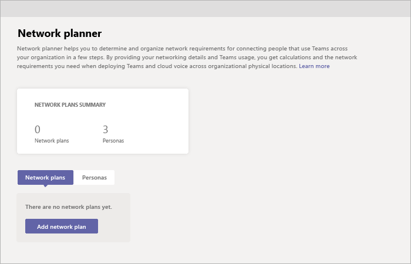

# 네트워크 플래너를 사용하여 Microsoft Teams

Network Planner는 관리 센터에서 사용할 수 있는 Teams 도구입니다. 계획 네트워크 플래너로   >  **가면 찾을 수 있습니다.** 네트워크 플래너는 몇 단계만 수행하면 조직 전체에서 사용자 연결에 Microsoft Teams 네트워크 요구 사항을 결정하고 구성할 수 있습니다. 네트워크 세부 정보 및 Teams 사용을 제공하는 경우 네트워크 플래너는 조직에서 실제 위치에 Teams와 Cloud Voice를 배포하는데 필요한 네트워크 요구 사항을 계산합니다.

네트워크 플래너를 사용하면 다음을 할 수 있습니다.

- 사이트 및 Microsoft 권장 사용자(사무실 근로자, 원격 근로자 및 Teams 시스템)를 사용하여 조직의 표현을 만들 수 있습니다.

    > [!NOTE]
    > 권장되는 인물은 사용 시나리오 및 일반적인 사용 Teams 데이터를 기반으로 개발되었습니다. 그러나 권장되는 세 개의 사용자 지정 사용자 외에 최대 3개의 사용자 지정을 만들 수 있습니다.

- 보고서 생성 및 사용량에 Teams 요구 사항을 계산합니다.

네트워크 플래너를 사용하려면 전역 관리자, Teams 관리자 또는 Teams 있어야 합니다.

## 사용자 지정 persona 만들기

다음 단계를 수행하여 사용자 지정 persona를 만들 수 있습니다.

1. 관리 센터의 네트워크 Microsoft Teams 이동하세요.

2. **Personas 탭에서** **+ 사용자 지정 persona 를 클릭합니다.** 

3. 새 사용자 **지정 persona 창에서 새 persona에** 대한 이름 및 설명을 추가합니다.

4. 이 persona가 조직 내에서 사용할 권한을 선택합니다.

5. **저장** 을 클릭합니다.

## 계획 빌드

다음 단계를 수행하여 네트워크 계획 구축을 시작하세요.

1. 관리 센터의 네트워크 Microsoft Teams 이동하세요.

2. 네트워크 계획 **탭에서** 네트워크 계획 **추가 를 클릭합니다.**

3. 네트워크 계획에 대한 이름 및 설명을 입력합니다. 네트워크 계획은 사용 가능한 계획 목록에 표시됩니다.

4. 계획 이름을 클릭하여 새 계획을 선택합니다.

5. 사이트를 추가하여 조직의 네트워크 설정의 표현을 만들 수 있습니다.

    조직의 네트워크에 따라 사이트를 사용하여 건물, 사무실 위치 또는 다른 것을 나타내는 것이 좋습니다. 사이트는 인터넷 및/또는 PSTN 연결 공유를 허용하도록 WAN에 의해 연결될 수 있습니다. 최상의 결과를 얻기 위해 인터넷 또는 PSTN에 원격으로 연결하는 사이트를 만들기 전에 로컬 연결이 있는 사이트를 만들어야 합니다.

    사이트를 만들 경우:

    1. 사이트에 대한 이름 및 설명을 추가합니다.

    2. 네트워크 **설정에서** 해당 사이트의 네트워크 사용자 수를 추가합니다(필수).

    3. 네트워크 세부 정보 추가: WAN 사용, WAN 용량, 인터넷egress(로컬 또는 **원격)** 및 PSTN(없음, 로컬 또는 원격)을 추가합니다.

      > [!NOTE]
      > 보고서를 생성할 때 특정 대역폭 권장 사항을 표시하려면 WAN 및 인터넷 용량 번호를 추가해야 합니다.

    4. **저장** 을 클릭합니다.

## 보고서 만들기

모든 사이트를 추가한 후 다음과 같이 보고서를 만들 수 있습니다.

1. 보고서 **탭에서** 보고서 **시작 을 클릭합니다.**

2. 만드는 각 사이트에 대해 사용 가능한 사용자 수를 배포합니다. Microsoft 권장 인물인 경우 수가 자동으로 분산됩니다(사무실 작업자 80%, 원격 작업자 20%).

3. 배포를 완료한 후 보고서 **생성 을 클릭합니다.**

    생성된 보고서는 출력을 명확하게 이해할 수 있도록 여러 다른 보기에서 대역폭 요구 사항을 보여 주게 됩니다.
    - 개별 계산이 있는 테이블은 허용되는 각 활동에 대한 대역폭 요구 사항을 표시합니다.
    - 추가 보기는 권장 사항과 함께 전체 대역폭 요구 사항을 보여 주게 됩니다.

4. **저장** 을 클릭합니다. 보고서는 나중에 볼 수 있도록 보고서 목록에서 사용할 수 있습니다.

## 시나리오 예

네트워크 플래너를 사용하여 네트워크 계획을 설정하고 이러한 단계를 사용하여 보고서를 생성하는 방법에 대한 예제는 네트워크 플래너 How-To PowerPoint [데크(영어만)를](https://github.com/MicrosoftDocs/OfficeDocs-SkypeForBusiness/blob/live/Teams/downloads/network-planner-how-to.pptx?raw=true) 다운로드합니다.
