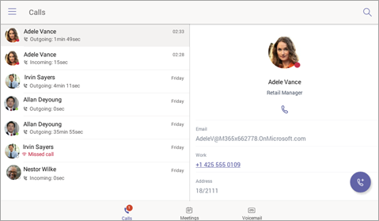
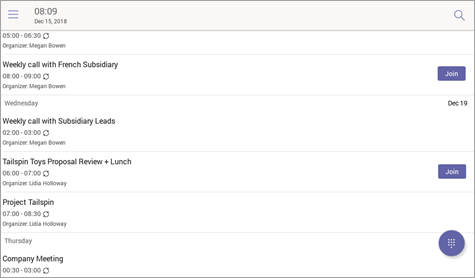
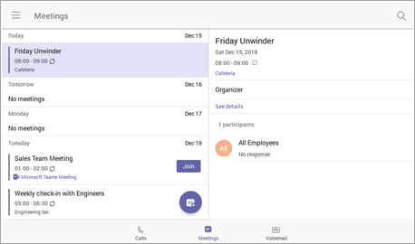

# Microsoft 팀 용 전화

Microsoft 팀은 일반 전화 환경을 필요로 하는 사용자를 위한 일반 전화기 포트폴리오를 지원 합니다. 이 문서에서는 Microsoft 팀에 대해 인증 되는 전화 목록과 Microsoft 팀을 위해 인증 된 전화에서 지원 되는 기능에 대해 설명 합니다. 팀 인증 장치에 대 한 최신 정보를 얻으려면 [팀 마켓플레이스](https://office.com/teamsdevices)로 이동 하세요.

## 팀 인증 된 IP 전화

휴대폰을 사용 하 여 고품질의 안정적인 Microsoft 팀 환경을 제공 하기 위해, 전세계의 다양 한 전화 접속 및 회의실 오디오 장치를 개발 하 고 인증 하기 위해 옛 Alink, Crestron, Polycom,와 함께 작업 하는 것은 파트너와 활발 하 게 작동 하는 것입니다. 현재 지원 되는 디바이스에 대해 [현재 인증 된 IP 전화](teams-ip-phones.md#currently-certified-ip-phones) 를 확인 합니다.

## Microsoft 팀 전화 기능 집합

팀 인증 IP 전화에서 지원 되는 상위 수준의 기능 집합은 다음 표에 나와 있습니다.

|기능 |일반 전화기 (개인 모드) |회의실 전화 (공유 모드)|
|---------|---------|---------|
|**인증** | |  |
|사용자 자격 증명으로 로그인 |  예 | 예|
|PC/스마트폰를 사용 하 여 로그인  | 예 |예|
|최신 인증 | 예 |예 |
|전화 잠금/잠금 해제 | 예 |아니요 |
|**전화** |  |  |
|수신/발신 P2P 통화 | 예  |예 |
|UI를 통한 통화 중 컨트롤 (음소거, 보류/다시 시작, 전송, 통화 종료)| 예  |예 |
|PSTN 통화| 예  |예 |
|시각적 보이스 메일 | 예 | 아니요 |
|911 지원  | 예  |예 |
|**일정 및 현재 상태**|   | |
|일정 액세스 및 모임 세부 정보|예 |예|
|현재 상태 통합 |예|예|
|Exchange 일정 통합 |예|예|
|연락처 사진 통합  |예|예|
|회사 디렉터리 액세스 | 예|예|
|**Meeting**|   ||
|한 번 클릭으로 모임 참가  | 예  |예 |
|비즈니스용 Skype 모임 참가 | 예  | 예|
|모임 통화 제어 (음소거/음소거 해제, 보류/다시 시작, 전화 끊기, 참가자 추가/제거)|예|예|
|모임 세부 정보|예|아니요|

저희는 사용자가 휴대폰에서 팀의 경험을 향상 시키는 데 도움이 되는 기능을 지속적으로 추가 하는 작업 중입니다. 아래 스크린샷은 현재 지원 되는 경험을 보여줍니다.

## 로그인 환경

사용자가 팀의 로그인 단추를 클릭 하면 회사 포털을 통해 로그인이 시작 됩니다. 사용자에 게 휴대폰에 사용자 자격 증명을 입력 하거나 다른 장치에서 로그인을 선택 하 여 로그인 할 수 있는 옵션이 있습니다. 사용자가 다른 장치에서 로그인 하기로 선택한 경우 사용자는 PC 또는 smartphone에서 인증을 완료할 수 있습니다.

**자격 증명을 사용 하 여 사용자 로그인**

**PC/스마트폰을 통한 사용자 로그인**

## 개인/공유 모드

로그인이 완료 되 면 개인 용도 또는 공유 회의실에 장치를 사용할지 여부를 사용자가 선택할 수 있습니다.

팀 전화 환경은 사용자의 선택에 따라 최적화 됩니다.

**개인 모드**

**공유 모드**

## 전화 환경

Microsoft 팀 사용자는 송수화기를 들어올리고 스피커 버튼을 눌러 통화 화면에서 다이얼 패드를 실행할 수 있습니다. 또는 사용자가 하드웨어 단추 (사용 가능한 경우)를 사용 하 여 전화를 걸 수도 있습니다.

**화상 다이얼 패드**

**통화 화면**

## 모임 환경

Microsoft 팀 사용자는 모임 탭으로 이동 하 여 모임을 확인 하 고 **참가** 단추를 사용 하 여 팀 모임에 참가할 수 있습니다.

**달력 보기**

**모임 참가 보기**

## 음성 메일

Microsoft 팀 사용자가 보이스 **메일** 탭으로 이동할 때 자신의 보이스 메일에 액세스할 수 있습니다.

## 사용자 로그 아웃

팀 전화 사용자는 왼쪽 위 메뉴에서 **로그 아웃** 옵션을 선택 하 여 로그 아웃을 선택할 수 있습니다.

## 모바일 장치에서 펌웨어 버전 찾기

오른쪽 위 모서리에 있는 **설정** 아이콘을 선택한 다음 **정보**를 클릭 하 여 팀 로그인 페이지에서 최소 펌웨어 버전을 확인할 수 있습니다.

**팀 로그인 페이지**

**설정 페이지**

## 필수 라이선스

Microsoft 팀 라이선스는 [Office 365 구독의](Office-365-licensing.md)일부로 구매할 수 있습니다. 휴대폰에서 Microsoft 팀을 사용 하는 데 필요한 라이선스에 대해 자세히 알아보려면 사용 가능한 [전화 시스템 라이선스](https://products.office.com/microsoft-teams/voice-calling)를 참조 하세요.

팀을 가져오는 방법에 대 한 자세한 내용은 [Microsoft 팀에 대 한 액세스 권한을 얻는 방법](https://support.office.com/article/fc7f1634-abd3-4f26-a597-9df16e4ca65b) 확인을 참조 하세요.

## 참고 항목

[팀 마켓플레이스](https://office.com/teamsdevices)

[Microsoft 팀에 대해 인증 된 IP 전화](teams-ip-phones.md)
