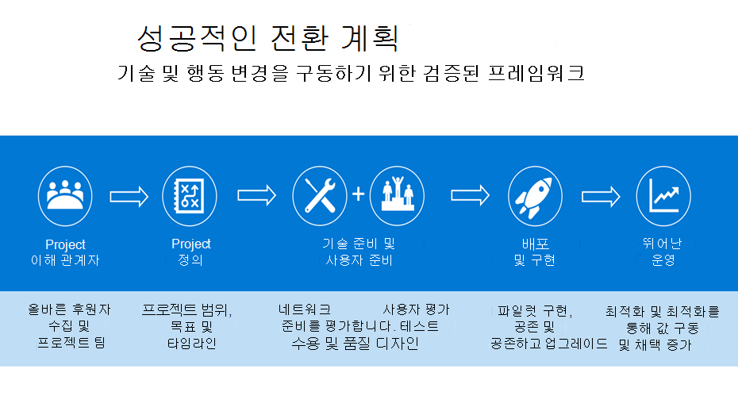

# 성공적인 전환을 계획하는 Kaizala Microsoft Teams

이동을 시작하면 Kaizala Microsoft Teams 전환을 계획하는 데 시간을 들이는 것이 중요합니다. 견고한 전환 계획은 이동에 대한 구조를 제공하며 모든 이해 관계자가 공통의 목표를 향해 노력하고 있습니다. 검증된 프레임워크를 사용하여 변경을 구현하면 현재 전환을 시작하는 데 도움이 될 수 있습니다.

## 전환 프레임워크

아래에서 성공적인 전환에 대한 권장 방법을 간략하게 설명하고 프레임워크의 각 단계가 이전 단계에 따라 빌드되는 순서대로 단계를 따르는 것이 좋습니다.

- 조직에 대한 팀워크 구상

- 챔피언 및 중요한 이해 관계자 식별

- 프로젝트 범위 정의

- 파일럿 Microsoft Teams

시작하기 전에 다음을 선택해야 합니다.

- [Teams 라이선스](/microsoftteams/get-clients)가 사용자 [환경에](/office365/servicedescriptions/teams-service-description) 할당됩니다. 최소 라이선스는 핵심 팀 및 초기 프로젝트 단계에 참여할 초기 채택자들에게 할당해야 합니다.

- 데스크톱 및 모바일 애플리케이션을 다운로드했습니다.

### 조직에 대한 구상 팀워크

건전한 기술 환경, 지속적인 사용자 채택 및 비즈니스 목표의 달성은 모두 적절한 계획에서 시작됩니다. 견고한 계획은 업그레이드 프로젝트에 대한 프레임워크를 제공하며 모든 이해 관계자가 동일한 목표를 향해 작업하도록 보장합니다. 사용 중인 현재 시나리오를 나열하는 데 Kaizala 시간이 걸릴 수 있습니다. 다음으로, 최신 작업 공간에서 이상으로 사용 시나리오를 Microsoft Teams. 사용 시나리오 정의를 시작하기 위해 사용 시나리오 정의를 [Microsoft Teams.](/microsoftteams/teams-adoption-define-usage-scenarios)

### 챔피언 및 중요한 이해 관계자 식별

먼저 올바른 이해 관계자를 모아 업그레이드 계획을 정의합니다. 적절한 계획에는 범위, 목표 및 전환에 대한 명확한 타임라인이 포함되어야 합니다. 합의된 계획이 준비되어 있는 경우 기술 환경과 최종 사용자가 계획에 대해 준비되어 Teams. 새로운 기술에 관심이 있는 사용자 및 다른 사용자들을 식별합니다. 전환 [전반](/microsoftteams/teams-adoption-create-champions-program) 에 걸쳐 흥분, 인식 및 채택을 구동하는 챔피언 프로그램을 만들 수 있습니다. 챔피언 프로그램 가이드를 만들어 조직에서 이 프로그램을 시작하고, 자세한 내용은 챔피언 프로그램 빌드 [를 참조하세요](https://view.officeapps.live.com/op/view.aspx?src=https://fto365dev.blob.core.windows.net:443/media/Default/DocResources/Adoption/Build_Champions_Program_Guide.pptx).

### 프로젝트 범위 정의

비즈니스로의 이동을 계획할 Microsoft Teams 비즈니스에 대한 성공의 모양을 정의하는 것이 중요합니다.  프로젝트 범위는 현재 프로젝트의 포커스를 정의하고 프로젝트 팀이 현재 작업에 집중하여 장기 비전을 실현할 수 있도록 하는 역할을 합니다.

결과 및 성공을 정의하기 위한 권장 전략에 대해 자세히 알아보고자 하는 경우 결과 정의 및 성공 사례를 [Microsoft Teams.](/microsoftteams/teams-adoption-define-outcomes)

### 파일럿 Microsoft Teams

프로젝트 범위 및 비전을 정의한 후 파일럿을 Microsoft Teams. 초기 실험에 참여할 [early adopters](/microsoftteams/teams-adoption-onboard-early-adopters)의 사용자 그룹을 Teams. 파일럿 수행에는 사용자와의 통신, 네트워크 및 사용 현황 모니터링, 네트워크 성능 및 통화 품질이 정상 상태로 유지되도록 보장하고, 참가자의 피드백을 수집하고, 지원 센터 티켓과 관련된 질문에 대한 지원 센터 티켓을 검토하는 Teams.

## 조직 준비

조직에서 성공적인 전환을 계획하기 위한 권장 Kaizala 후 조직에서 성공적인 전환을 Microsoft Teams.

### 준비해

 1. 모든 사용자에 Teams 라이선스가 있는지 확인 [Teams 플랜](/microsoft-teams/compare-microsoft-teams-options?rtc=1)과 [Microsoft Teams 서비스 설명](/office365/servicedescriptions/teams-service-description)을 확인하세요.

 2. 조직 [Microsoft Teams 채택](https://adoption.microsoft.com/microsoft-teams/#get-started) 지침을 사용하여 조직 Teams 롤아웃합니다.

 3. 관리자, 챔피언 및 더 큰 조직이 기술 및 채택 리소스를 통해 사용자와의 Teams 수용할 수 있도록 준비합니다.  

 4. 이러한 교육 리소스를 사용하여 조직의 사용자가 다음 정보를 배우고 활용하는 데 도움이 Teams.

    - IT 관리자 준비에 대한 자세한 내용은 [관리자 교육 리소스를 참조하세요](/microsoftteams/itadmin-readiness).

    - 강사 주도 교육은 강사 주도 [교육을 Microsoft Teams](/microsoftteams/instructor-led-training-teams-landing-page).
  
    - 교육 비디오는 비디오 Microsoft Teams [참조하세요](https://support.microsoft.com/office/microsoft-teams-video-training-4f108e54-240b-4351-8084-b1089f0d21d7?ui=en-us&rs=en-us&ad=us).

## 챔피언 Microsoft Teams 채택

사용자 [Microsoft Teams](/microsoftteams/teams-adoption-get-started) 도입을 주도하면 회사 내에서 우수한 사용자 환경과 비즈니스 가치를 향상할 수 있습니다.

이 Teams 롤아웃 전반에 걸쳐 이러한 리소스를 활용하고 채택을 Teams  수 있습니다.

관리자 및 사용자에 대한 Teams 조직에서 사용 현황 및 드라이브에 대한 지식을 강화합니다. 교육 리소스는 교육 Microsoft Teams [참조합니다](/microsoftteams/training-microsoft-teams-landing-page).

조직에서 사용 현황 및 채택 계획에 맞게 사용자 지정 가능한 환경이 필요한 경우 여기를 참조하여 주문형 교육 Microsoft 365 학습 경로에 대해 자세히 알아보  십시오.

조직의 제품 및 서비스를 Teams 및 기타 모든 Microsoft 365 Office 365 메시지 센터 및 Teams 확인[해야 합니다](https://www.microsoft.com/microsoft-365/roadmap?rtc=2&filters=Microsoft%20Teams). 사용자에게 계속해서 정보를 제공하고 준비된 상태로 유지를 시켜주는데 도움이 되는 새로운 기능과 업데이트된 기능, 계획된 변경 사항 그리고 문제에 대한 공지 사항을 확인할 수 있습니다.

## 추가 리소스

모든 사람을 한데 모아 효과적으로 대화를 진행하고, 직원과 연결하고, 일상적인 작업을 디지털화하여 Microsoft Teams. Teams 작업자, 구성원, 고객 및 배포자와 쉽게 연결하고 조정할 수 있습니다.

추가 리소스의 경우 관리자 및 IT Microsoft Teams 설명서 라이브러리  를 컴파일했습니다. 이 설명서를 사용하여 조직이 2016년 1월부터 Kaizala 준비되도록 Microsoft Teams.

## 다음 단계

[Microsoft Teams Kaizala](/MicrosoftTeams/navigate-teams)
