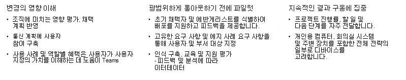

# Kaizala에서 Microsoft Teams로의 성공적인 이동 계획

> [!Important]
> Microsoft Kaizala는 2023년 8월 31일에 사용 중지됩니다. 지속적인 연결, 공유 및 공동 작업을 위해 Microsoft Teams로 이동하는 것이 좋습니다. 사용 중지 날짜가 지나면 Kaizala에 대한 액세스 및 지원이 중단됩니다.

Kaizala에서 Microsoft Teams로의 이동에 착수할 때는 성공적인 전환을 [계획](/microsoftteams/deploy-enterprise-setup?tabs=ChatTeamsChannels#plan-your-deployment) 하는 데 시간을 할애하는 것이 중요합니다. 견고한 전환 계획은 이동에 대한 구조를 제공하고 모든 이해 관계자가 공통의 목표를 향해 노력하고 있는지 확인합니다. 검증된 프레임워크를 사용하여 변경 내용을 구현하면 현재 전환을 시작하는 데 도움이 될 수 있습니다.

## 이동에 대한 프레임워크

아래의 성공적인 전환에 대한 권장 접근 방식을 설명하고 프레임워크의 각 단계가 이전 단계에 따라 빌드되므로 순서대로 단계를 수행하는 것이 좋습니다.

- 조직을 위한 팀워크 구상

- 챔피언 및 중요 이해 관계자 식별

- 프로젝트 범위 정의

- Microsoft Teams 파일럿

시작하기 전에 다음을 확인합니다.

- [Teams가 설치되고](/microsoftteams/get-clients) [사용자 환경에 라이선스가 할당됩니다](/office365/servicedescriptions/teams-service-description) . 최소한 이 초기 프로젝트 단계에 참여할 핵심 팀과 얼리어답터에게 최소 라이선스를 할당해야 합니다.

- 데스크톱 및 모바일 애플리케이션을 다운로드했습니다.

### 조직을 위한 팀워크 구상

건강한 기술 환경, 지속적인 사용자 채택 및 비즈니스 목표 실현은 모두 적절한 계획으로 시작됩니다. 견고한 계획은 업그레이드 프로젝트에 대한 프레임워크를 제공하고 모든 이해 관계자가 동일한 목표를 향해 작업하도록 합니다. 시간을 내어 Kaizala가 사용되는 현재 시나리오를 나열합니다. 다음으로, Microsoft Teams를 사용하여 최신 작업 공간에서 위와 그 너머의 사용 시나리오를 구상합니다. 사용 시나리오 정의를 시작하려면 [Microsoft Teams에 대한 사용 시나리오 정의를 참조하세요](/microsoftteams/teams-adoption-define-usage-scenarios).

### 챔피언 및 중요 이해 관계자 식별

먼저 올바른 이해 관계자를 한데 모아 업그레이드 계획을 정의합니다. 적절한 계획에는 범위, 목표 및 전환에 대한 명확한 타임라인이 포함되어야 합니다. 합의된 계획을 수립하고 기술 환경과 최종 사용자가 Teams에 대한 준비가 되는지 확인합니다. 새로운 기술에 관심이 있고 다른 사람을 돕는 사람을 식별합니다. 전환 전반에 걸쳐 흥분, 인식 및 채택을 촉진하는 [챔피언 프로그램을](/microsoftteams/teams-adoption-create-champions-program) 만듭니다. 조직에서 이 프로그램을 시작하기 위한 챔피언 프로그램 가이드를 만들었습니다. 자세한 내용은 [챔피언 프로그램 빌드를](https://view.officeapps.live.com/op/view.aspx?src=https://fto365dev.blob.core.windows.net:443/media/Default/DocResources/Adoption/Build_Champions_Program_Guide.pptx) 참조하세요.

### 프로젝트 범위 정의

Microsoft Teams로의 이전을 계획할 때 비즈니스의 성공을 정의하는 것이 중요합니다.  프로젝트 범위는 현재 프로젝트의 포커스를 정의하고 프로젝트 팀이 현재 작업에 집중할 수 있도록 하여 장기적인 비전을 실현할 수 있도록 합니다.

결과와 성공을 정의하기 위한 권장 전략에 대해 자세히 알아보려면 [Microsoft Teams를 채택하기 위한 결과 및 성공 정의를 참조하세요](/microsoftteams/teams-adoption-define-outcomes).

### Microsoft Teams 파일럿

프로젝트 범위와 비전을 정의한 후에는 Microsoft Teams를 파일럿해야 합니다. Teams를 사용한 초기 실험에 참여할 [얼리 어답터](/microsoftteams/teams-adoption-onboard-early-adopters) 의 사용자 그룹을 식별합니다. 파일럿 수행에는 사용자와의 통신, 네트워크 성능 및 통화 품질 유지를 위한 네트워크 및 사용량 모니터링, 참가자의 피드백 수집, Teams 관련 질문에 대한 지원 센터 티켓 검토가 포함됩니다.

## 조직 준비

Kaizala에서 성공적인 전환을 계획하기 위한 권장 프레임워크를 수행한 후 조직이 Microsoft Teams의 성공적인 전환을 준비합니다.

### 준비해

 1. 모두를 위한 Teams 라이선스가 있는지 확인합니다. [Teams 플랜](https://www.microsoft.com/microsoft-teams/compare-microsoft-teams-options?activetab=pivot%3aprimaryr1)과 [Microsoft Teams 서비스 설명](/office365/servicedescriptions/teams-service-description)을 확인하세요.

 2. [Microsoft Teams 채택](https://adoption.microsoft.com/microsoft-teams/#get-started) 지침을 사용하여 조직 전체에 Teams를 배포합니다.

 3. 기술 및 채택 리소스를 통해 Teams와의 커뮤니케이션을 수용하도록 관리자, 챔피언 및 더 큰 조직을 준비합니다.  

 4. 이러한 교육 리소스를 사용하여 조직의 사용자가 Teams를 배우고 최대한 활용할 수 있도록 지원합니다.

    - IT 관리 준비 상태의 경우 [관리 교육 리소스를 참조하세요](/microsoftteams/itadmin-readiness).

    - 강사 주도 교육은 [Microsoft Teams에 대한 강사 주도 교육을 참조하세요](/microsoftteams/instructor-led-training-teams-landing-page).
  
    - 교육 비디오는 [Microsoft Teams 비디오 교육을](https://support.microsoft.com/office/microsoft-teams-video-training-4f108e54-240b-4351-8084-b1089f0d21d7?ui=en-us&rs=en-us&ad=us) 참조하세요.

## 챔피언 Microsoft Teams 채택

Microsoft Teams의 [채택을 촉진](/microsoftteams/teams-adoption-get-started) 하여 회사 내에서 뛰어난 사용자 환경과 향상된 비즈니스 가치를 제공할 수 있습니다.

Teams 출시 전체에서 Teams 채택을 유도하는 지침과 함께 [이러한](/microsoftteams/adopt-microsoft-teams-landing-page) 리소스를 활용해야 합니다.

관리자 및 사용자를 위한 교육을 통해 Teams에 대한 지식을 강화하고 조직의 사용을 촉진합니다. 교육 리소스는 [Microsoft Teams 교육을](/microsoftteams/training-microsoft-teams-landing-page) 참조하세요.

조직에서 사용 및 채택 계획에 맞게 사용자 지정 가능한 환경에 관심이 있는 경우 Microsoft [365 학습 경로](https://adoption.microsoft.com/microsoft-365-learning-pathways/) 주문형 교육 솔루션에 대해 자세히 알아보려면 여기를 참조하세요.

Teams 및 조직의 다른 모든 Microsoft 365 또는 Office 365 제품 및 서비스에 대한 최신 정보를 확인하려면 [메시지](https://admin.microsoft.com/AdminPortal/Home?ref=/MessageCenter) 센터 및 [Teams 로드맵](https://www.microsoft.com/microsoft-365/roadmap?rtc=2&filters=Microsoft%20Teams)을 확인해야 합니다. 사용자에게 계속해서 정보를 제공하고 준비된 상태로 유지를 시켜주는데 도움이 되는 새로운 기능과 업데이트된 기능, 계획된 변경 사항 그리고 문제에 대한 공지 사항을 확인할 수 있습니다.

## 추가 리소스

모든 사람을 한데 모으고, 효과적으로 대화를 나누고, 직원과 연결하고, Microsoft Teams를 사용하여 일상적인 작업을 디지털화합니다. Teams를 사용하면 일선 직원, 멤버, 고객 및 배포자와 쉽게 연결하고 조정할 수 있습니다.

추가 리소스의 경우 관리자 및 IT 전문가를 위해 Microsoft Teams에 대한 [설명서 라이브러리](/microsoftteams/) 를 컴파일했습니다. 설명서를 사용하여 Kaizala에서 Microsoft Teams로의 여정을 따라 조직이 준비되었는지 확인합니다.

## 다음 단계

[Kaizala에서 Microsoft Teams 탐색](/MicrosoftTeams/navigate-teams)
