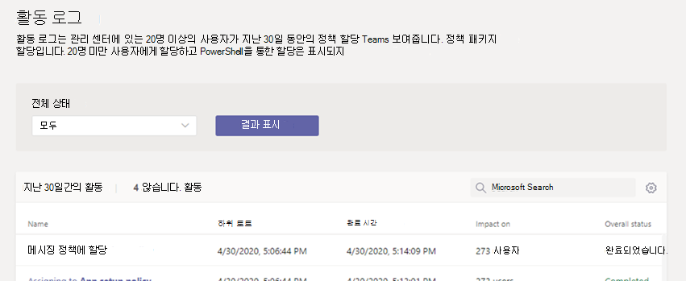

# <a name="assign-policies-in-teams--getting-started"></a><span data-ttu-id="785bb-103">Teams에서 정책 할당 - 시작</span><span class="sxs-lookup"><span data-stu-id="785bb-103">Assign policies in Teams – getting started</span></span>

<span data-ttu-id="785bb-104">관리자는 정책을 사용하여 조직의 사용자가 사용할 수 있는 Teams 기능을 제어합니다.</span><span class="sxs-lookup"><span data-stu-id="785bb-104">As an admin, you use policies to control the Teams features that are available to users in your organization.</span></span> <span data-ttu-id="785bb-105">예를 들어 몇 가지 이름을 지정하는 호출 정책, 모임 정책 및 메시징 정책이 있습니다.</span><span class="sxs-lookup"><span data-stu-id="785bb-105">For example, there are calling policies, meeting policies, and messaging policies, to name just a few.</span></span>

<span data-ttu-id="785bb-106">조직에는 고유한 요구 사항을 가지는 다양한 유형의 사용자가 있습니다.</span><span class="sxs-lookup"><span data-stu-id="785bb-106">Organizations have different types of users with unique needs.</span></span> <span data-ttu-id="785bb-107">만들고 할당하는 사용자 지정 정책을 사용하면 이러한 요구에 따라 다양한 사용자 집합에 정책 설정을 조정할 수 있습니다.</span><span class="sxs-lookup"><span data-stu-id="785bb-107">Custom policies that you create and assign let you tailor policy settings to different sets of users based on those needs.</span></span>

<span data-ttu-id="785bb-108">조직의 정책을 쉽게 관리하기 위해 Teams는 사용자에게 정책을 할당하는 여러 가지 방법을 제공합니다.</span><span class="sxs-lookup"><span data-stu-id="785bb-108">To easily manage policies in your organization, Teams offers several ways to assign policies to users.</span></span> <span data-ttu-id="785bb-109">일괄 처리 할당을 통해 개별적으로 또는 규모에 따라 사용자에게 직접 정책을 할당하거나 사용자가 구성원인 그룹에 할당합니다.</span><span class="sxs-lookup"><span data-stu-id="785bb-109">Assign a policy directly to users, either individually or at scale through a batch assignment, or to a group that the users are members of.</span></span> <span data-ttu-id="785bb-110">정책 패키지를 사용하여 유사한 역할이 있는 조직의 사용자에게 미리 설정한 정책 컬렉션을 할당할 수도 있습니다.</span><span class="sxs-lookup"><span data-stu-id="785bb-110">You can also use policy packages to assign a preset collection of policies to users in your organization who have similar roles.</span></span> <span data-ttu-id="785bb-111">선택하는 옵션은 관리하는 정책의 수와 정책을 할당하는 사용자 수에 따라 달라 습니다.</span><span class="sxs-lookup"><span data-stu-id="785bb-111">The option that you choose depends on the number of policies that you're managing and the number of users you're assigning policies to.</span></span> <span data-ttu-id="785bb-112">전역(조직 전체 기본값) 정책은 조직의 가장 많은 사용자 수에 적용됩니다.</span><span class="sxs-lookup"><span data-stu-id="785bb-112">Global (Org-wide default) policies apply to the largest number of users in your organization.</span></span> <span data-ttu-id="785bb-113">특수한 정책이 필요한 사용자에게만 정책을 할당해야 합니다.</span><span class="sxs-lookup"><span data-stu-id="785bb-113">You only have to assign policies to those users that require specialized policies.</span></span>

<span data-ttu-id="785bb-114">이 문서에서는 사용자에게 정책을 할당할 수 있는 다양한 방법과 이를 사용할 때 권장되는 시나리오에 대해 설명합니다.</span><span class="sxs-lookup"><span data-stu-id="785bb-114">This article describes the different ways that you can assign policies to users and the recommended scenarios for when to use what.</span></span>

<span data-ttu-id="785bb-115">사용자 및 그룹에 정책을 할당하는 방법에 대한 자세한 내용은 **사용자** 및 그룹에 정책 [할당을 참조합니다.](assign-policies-users-and-groups.md)</span><span class="sxs-lookup"><span data-stu-id="785bb-115">For details on how to **assign policies to users and groups**, see [assigning policies to users and groups](assign-policies-users-and-groups.md).</span></span> <span data-ttu-id="785bb-116">정책 패키지를 할당하는 방법에 대한 자세한 내용은 **정책** 패키지 [할당을 참조합니다.](assign-policy-packages.md)</span><span class="sxs-lookup"><span data-stu-id="785bb-116">For details on how to **assign policy packages**, see [assign policy packages](assign-policy-packages.md).</span></span>

## <a name="which-policy-takes-precedence"></a><span data-ttu-id="785bb-117">우선 순위는 어떤 정책인가요?</span><span class="sxs-lookup"><span data-stu-id="785bb-117">Which policy takes precedence?</span></span>

<span data-ttu-id="785bb-118">사용자에게는 각 정책 유형에 대해 하나의 효과적인 정책이 있습니다.</span><span class="sxs-lookup"><span data-stu-id="785bb-118">A user has one effective policy for each policy type.</span></span> <span data-ttu-id="785bb-119">사용자가 정책을 직접 할당하고 동일한 유형의 정책을 할당한 하나 이상의 그룹의 구성원일 수도 있습니다.</span><span class="sxs-lookup"><span data-stu-id="785bb-119">It's possible, or even likely, that a user is directly assigned a policy and is also a member of one or more groups that's assigned a policy of the same type.</span></span> <span data-ttu-id="785bb-120">이러한 종류의 시나리오에서 어떤 정책이 우선인가요?</span><span class="sxs-lookup"><span data-stu-id="785bb-120">In these kinds of scenarios, which policy takes precedence?</span></span> <span data-ttu-id="785bb-121">사용자의 유효 정책은 다음과 같이 우선 순위 규칙에 따라 결정됩니다.</span><span class="sxs-lookup"><span data-stu-id="785bb-121">A user's effective policy is determined according to rules of precedence, as follows.</span></span>

<span data-ttu-id="785bb-122">사용자가 정책(개별적으로 또는 일괄 처리 할당을 통해)을 직접 할당하는 경우 해당 정책이 우선합니다.</span><span class="sxs-lookup"><span data-stu-id="785bb-122">If a user is directly assigned a policy (either individually or through a batch assignment), that policy takes precedence.</span></span> <span data-ttu-id="785bb-123">다음 시각적 예제에서 사용자의 효과적인 정책은 사용자에게 직접 할당되는 Lincoln Square 모임 정책입니다.</span><span class="sxs-lookup"><span data-stu-id="785bb-123">In the following visual example, the user's effective policy is the Lincoln Square meeting policy, which is directly assigned to the user.</span></span>


<span data-ttu-id="785bb-125">사용자가 지정된 유형의 정책을 직접 할당하지 않은 경우 사용자가 구성원인 그룹에 할당된 정책이 우선합니다.</span><span class="sxs-lookup"><span data-stu-id="785bb-125">If a user isn't directly assigned a policy of a given type, the policy assigned to a group that the user is a member of takes precedence.</span></span> <span data-ttu-id="785bb-126">사용자가 여러 그룹의 구성원인 경우 지정한 정책 유형에 대해 가장 높은(그룹 할당 순위)를 가지는 정책이 우선합니다.[](assign-policies-users-and-groups.md#group-assignment-ranking)</span><span class="sxs-lookup"><span data-stu-id="785bb-126">If a user is a member of multiple groups, the policy that has the highest ([group assignment ranking](assign-policies-users-and-groups.md#group-assignment-ranking)) for the given policy type takes precedence.</span></span>

<span data-ttu-id="785bb-127">이 시각적 예제에서 사용자의 효과적인 정책은 Exec Teams 및 HD 정책으로, 이 정책은 사용자가 구성원으로 있는 다른 그룹에 비해 가장 높은 할당 순위를 가지며 동일한 정책 유형의 정책도 할당됩니다.</span><span class="sxs-lookup"><span data-stu-id="785bb-127">In this visual example, the user's effective policy is the Exec Teams and HD policy, which has the highest assignment ranking relative to other groups that the user is a member of and that are also assigned a policy of the same policy type.</span></span>  


<span data-ttu-id="785bb-129">사용자가 정책을 직접 할당하지 않은 경우 또는 정책이 할당된 그룹의 구성원이 아닌 경우 사용자는 해당 정책 유형에 대한 전역(Org-wide default) 정책을 얻습니다.</span><span class="sxs-lookup"><span data-stu-id="785bb-129">If a user isn't directly assigned a policy or isn't a member of any groups that are assigned a policy, the user gets the global (Org-wide default) policy for that policy type.</span></span> <span data-ttu-id="785bb-130">다음은 시각적 예제입니다.</span><span class="sxs-lookup"><span data-stu-id="785bb-130">Here's a visual example.</span></span>


<span data-ttu-id="785bb-132">자세한 내용은[(우선 순위 규칙)를 참조합니다.](assign-policies-users-and-groups.md#precedence-rules)</span><span class="sxs-lookup"><span data-stu-id="785bb-132">To learn more, see ([Precedence rules](assign-policies-users-and-groups.md#precedence-rules)).</span></span>

## <a name="ways-to-assign-policies"></a><span data-ttu-id="785bb-133">정책을 할당하는 방법</span><span class="sxs-lookup"><span data-stu-id="785bb-133">Ways to assign policies</span></span>

<span data-ttu-id="785bb-134">사용자에게 정책을 할당할 수 있는 방법과 각 시나리오에 대해 권장되는 시나리오에 대한 개요는 다음과 같습니다.</span><span class="sxs-lookup"><span data-stu-id="785bb-134">Here's an overview of the ways that you can assign policies to users and the recommended scenarios for each.</span></span> <span data-ttu-id="785bb-135">자세한 내용은 링크를 선택합니다.</span><span class="sxs-lookup"><span data-stu-id="785bb-135">Select the links to learn more.</span></span>

<span data-ttu-id="785bb-136">개별 사용자 또는 그룹에 정책을 할당하기 전에 먼저 조직에서 가장 많은 사용자 수에 적용할 수 있도록 전역(조직 전체 [기본값)](#set-the-global-policies) 정책을 설정해야 합니다.</span><span class="sxs-lookup"><span data-stu-id="785bb-136">Before assigning policies to individual users or groups, start by [setting the global (Org-wide default) policies](#set-the-global-policies) so that they apply to the largest number of users in your organization.</span></span>  <span data-ttu-id="785bb-137">전역 정책을 설정하면 특수한 정책이 필요한 사용자에게만 정책을 할당해야 합니다.</span><span class="sxs-lookup"><span data-stu-id="785bb-137">Once the global policies are set, you'll only need to assign policies to those users that require specialized policies.</span></span>

|<span data-ttu-id="785bb-138">이 작업을</span><span class="sxs-lookup"><span data-stu-id="785bb-138">Do this</span></span>  |<span data-ttu-id="785bb-139">경우...</span><span class="sxs-lookup"><span data-stu-id="785bb-139">If...</span></span>  | <span data-ttu-id="785bb-140">사용 중...</span><span class="sxs-lookup"><span data-stu-id="785bb-140">Using...</span></span>
|---------|---------|----|
|[<span data-ttu-id="785bb-141">개별 사용자에게 정책 할당</span><span class="sxs-lookup"><span data-stu-id="785bb-141">Assign a policy to individual users</span></span>](assign-policies-users-and-groups.md#assign-a-policy-to-individual-users)   | <span data-ttu-id="785bb-142">Teams를 새로 시작하거나 소수의 사용자에게 정책 하나 또는 몇 개만 할당하면 됩니다.</span><span class="sxs-lookup"><span data-stu-id="785bb-142">You're new to Teams and just getting started or you only need to assign one or a couple of policies to a small number of users.</span></span> |<span data-ttu-id="785bb-143">Teams PowerShell 모듈의 Microsoft Teams 관리 센터 또는 PowerShell cmdlet</span><span class="sxs-lookup"><span data-stu-id="785bb-143">The Microsoft Teams admin center or PowerShell cmdlets in the Teams PowerShell module</span></span>
|[<span data-ttu-id="785bb-144">그룹에 정책 할당</span><span class="sxs-lookup"><span data-stu-id="785bb-144">Assign a policy to a group</span></span>](assign-policies-users-and-groups.md#assign-a-policy-to-a-group) |<span data-ttu-id="785bb-145">사용자의 그룹 구성원 자격에 따라 정책을 할당합니다.</span><span class="sxs-lookup"><span data-stu-id="785bb-145">Assign policies based on a user's group membership.</span></span> <span data-ttu-id="785bb-146">예를 들어 보안 그룹 또는 메일 그룹의 모든 사용자에게 정책을 할당합니다.</span><span class="sxs-lookup"><span data-stu-id="785bb-146">For example, assign a policy to all users in a security group or distribution list.</span></span>| <span data-ttu-id="785bb-147">Teams PowerShell 모듈의 Microsoft Teams 관리 센터 또는 PowerShell cmdlet</span><span class="sxs-lookup"><span data-stu-id="785bb-147">The Microsoft Teams admin center or PowerShell cmdlets in the Teams PowerShell module</span></span>|
|[<span data-ttu-id="785bb-148">사용자 일괄 처리에 정책 할당</span><span class="sxs-lookup"><span data-stu-id="785bb-148">Assign a policy to a batch of users</span></span>](assign-policies-users-and-groups.md#assign-a-policy-to-a-batch-of-users)   | <span data-ttu-id="785bb-149">대규모 사용자 집합에 정책을 할당합니다.</span><span class="sxs-lookup"><span data-stu-id="785bb-149">Assign policies to large sets of users.</span></span> <span data-ttu-id="785bb-150">예를 들어 조직에서 수백 또는 수천 명의 사용자에게 정책을 할당합니다.</span><span class="sxs-lookup"><span data-stu-id="785bb-150">For example, assign a policy to hundreds or thousands of users in your organization at a time.</span></span> |<span data-ttu-id="785bb-151">Teams PowerShell 모듈의 Microsoft Teams 관리 센터 또는 PowerShell cmdlet</span><span class="sxs-lookup"><span data-stu-id="785bb-151">The Microsoft Teams admin center or PowerShell cmdlets in the Teams PowerShell module</span></span>|
|[<span data-ttu-id="785bb-152">사용자에게 정책 패키지 할당</span><span class="sxs-lookup"><span data-stu-id="785bb-152">Assign a policy package to users</span></span>](assign-policy-packages.md#assign-a-policy-package-to-users)  |<span data-ttu-id="785bb-153">동일한 역할 또는 유사한 역할이 있는 조직의 특정 사용자 집합에 여러 정책을 할당합니다.</span><span class="sxs-lookup"><span data-stu-id="785bb-153">Assign multiple policies to specific sets of users in your organization who have the same or similar roles.</span></span> <span data-ttu-id="785bb-154">예를 들어 학교의 교사에게 교육(교사) 정책 패키지를 할당하여 채팅, 통화 및 모임에 대한 모든 액세스 권한을 부여합니다.</span><span class="sxs-lookup"><span data-stu-id="785bb-154">For example, assign the Education (Teacher) policy package to teachers in your school to give them full access to chats, calling, and meetings.</span></span> <span data-ttu-id="785bb-155">중등 학생에게 교육(중등 학생) 정책 패키지를 할당하여 개인 통화와 같은 특정 기능을 제한합니다.</span><span class="sxs-lookup"><span data-stu-id="785bb-155">Assign the Education (Secondary school student) policy package to secondary students to limit certain capabilities such as private calling.</span></span>  |<span data-ttu-id="785bb-156">Teams PowerShell 모듈의 Microsoft Teams 관리 센터 또는 PowerShell cmdlet</span><span class="sxs-lookup"><span data-stu-id="785bb-156">The Microsoft Teams admin center or PowerShell cmdlets in the Teams PowerShell module</span></span>|
|<span data-ttu-id="785bb-157">[그룹에 정책 패키지](assign-policy-packages.md#assign-a-policy-package-to-a-group) 할당(비공개 미리 보기에서)</span><span class="sxs-lookup"><span data-stu-id="785bb-157">[Assign a policy package to a group](assign-policy-packages.md#assign-a-policy-package-to-a-group) (in private preview)</span></span>   |<span data-ttu-id="785bb-158">동일한 역할 또는 유사한 역할이 있는 조직의 사용자 그룹에 여러 정책을 할당합니다.</span><span class="sxs-lookup"><span data-stu-id="785bb-158">Assign multiple policies to a group of users in your organization who have the same or similar roles.</span></span> <span data-ttu-id="785bb-159">예를 들어 보안 그룹 또는 메일 그룹의 모든 사용자에게 정책 패키지를 할당합니다.</span><span class="sxs-lookup"><span data-stu-id="785bb-159">For example, assign a policy package to all users in a security group or distribution list.</span></span> |<span data-ttu-id="785bb-160">Teams PowerShell 모듈의 Microsoft Teams 관리 센터(곧) 또는 PowerShell cmdlet</span><span class="sxs-lookup"><span data-stu-id="785bb-160">The Microsoft Teams admin center (coming soon) or PowerShell cmdlets in the Teams PowerShell module</span></span>|
|[<span data-ttu-id="785bb-161">사용자 일괄 처리에 정책 패키지 할당</span><span class="sxs-lookup"><span data-stu-id="785bb-161">Assign a policy package to a batch of users</span></span>](assign-policy-packages.md#assign-a-policy-package-to-a-batch-of-users)|<span data-ttu-id="785bb-162">동일한 역할 또는 유사한 역할이 있는 조직의 사용자 일괄 처리에 여러 정책을 할당합니다.</span><span class="sxs-lookup"><span data-stu-id="785bb-162">Assign multiple policies to a batch of users in your organization who have the same or similar roles.</span></span> <span data-ttu-id="785bb-163">예를 들어 일괄 처리 과제를 사용하여 학교의 모든 교사에게 교육(교사) 정책 패키지를 할당하여 채팅, 통화 및 모임에 대한 모든 액세스 권한을 부여합니다.</span><span class="sxs-lookup"><span data-stu-id="785bb-163">For example, assign the Education (Teacher) policy package to all teachers in your school using batch assignment to give them full access to chats, calling, and meetings.</span></span> <span data-ttu-id="785bb-164">사설 통화와 같은 특정 기능을 제한하기 위해 중등 학생 일괄 처리에 교육(중등 학생) 정책 패키지를 할당합니다.</span><span class="sxs-lookup"><span data-stu-id="785bb-164">Assign the Education (Secondary school student) policy package to a batch of secondary students to limit certain capabilities such as private calling.</span></span>|<span data-ttu-id="785bb-165">Teams PowerShell 모듈의 PowerShell cmdlet</span><span class="sxs-lookup"><span data-stu-id="785bb-165">PowerShell cmdlets in the Teams PowerShell module</span></span>|

## <a name="set-the-global-policies"></a><span data-ttu-id="785bb-166">전역 정책 설정</span><span class="sxs-lookup"><span data-stu-id="785bb-166">Set the global policies</span></span>

<span data-ttu-id="785bb-167">다음 단계를 수행하여 각 정책 유형에 대해 전역(Org-wide default) 정책을 설정합니다.</span><span class="sxs-lookup"><span data-stu-id="785bb-167">Follow these steps to set the global (Org-wide default) policies for each policy type.</span></span>

### <a name="using-the-microsoft-teams-admin-center"></a><span data-ttu-id="785bb-168">Microsoft Teams 관리 센터 사용</span><span class="sxs-lookup"><span data-stu-id="785bb-168">Using the Microsoft Teams admin center</span></span>

1. <span data-ttu-id="785bb-169">Microsoft Teams 관리 센터의 왼쪽 탐색에서 업데이트할 정책 유형에 대한 정책 페이지로 이동합니다.</span><span class="sxs-lookup"><span data-stu-id="785bb-169">In the left navigation of the Microsoft Teams admin center, go to the policy page for the policy type you want to update.</span></span> <span data-ttu-id="785bb-170">예를 들어 **Teams**  >  **Teams 정책,** **모임** 모임  >  정책, 메시징 **정책** 또는 **음성** 통화 정책이  >  **있습니다.**</span><span class="sxs-lookup"><span data-stu-id="785bb-170">For example, **Teams** > **Teams policies**, **Meetings** > **Meetings policies**, **Messaging policies**, or **Voice** > **Calling policies**.</span></span>
2. <span data-ttu-id="785bb-171">**전역(Org-wide 기본값)** 정책을 선택하여 현재 설정을 확인합니다.</span><span class="sxs-lookup"><span data-stu-id="785bb-171">Select the **Global (Org-wide default)** policy to view the current settings.</span></span>
3. <span data-ttu-id="785bb-172">필요한 경우 정책을 업데이트한 다음 적용을 **선택합니다.**</span><span class="sxs-lookup"><span data-stu-id="785bb-172">Update the policy as needed, and then select **Apply**.</span></span>


### <a name="using-powershell"></a><span data-ttu-id="785bb-174">PowerShell 사용</span><span class="sxs-lookup"><span data-stu-id="785bb-174">Using PowerShell</span></span>

<span data-ttu-id="785bb-175">PowerShell을 사용하여 전역 정책을 설정하기 위해 전역 식별자를 사용 합니다.</span><span class="sxs-lookup"><span data-stu-id="785bb-175">To set the global policies using PowerShell, use the Global identifier.</span></span>  <span data-ttu-id="785bb-176">먼저 현재 전역 정책을 검토하여 변경할 설정을 파악합니다.</span><span class="sxs-lookup"><span data-stu-id="785bb-176">Start by reviewing the current Global policy to determine which setting you want to change.</span></span>

```powershell
Get-CsTeamsMessagingPolicy -Identity Global
 
Identity                      : Global
Description                   :
AllowUrlPreviews              : True
AllowOwnerDeleteMessage       : False
AllowUserEditMessage          : True
AllowUserDeleteMessage        : True
AllowUserChat                 : True
AllowRemoveUser               : True
AllowGiphy                    : True
GiphyRatingType               : Moderate
AllowMemes                    : True
AllowImmersiveReader          : True
AllowStickers                 : True
AllowUserTranslation          : False
ReadReceiptsEnabledType       : UserPreference
AllowPriorityMessages         : True
ChannelsInChatListEnabledType : DisabledUserOverride
AudioMessageEnabledType       : ChatsAndChannels
Expand (20 lines) Collapse 
```

<span data-ttu-id="785bb-177">다음으로, 필요한 경우 전역 정책을 업데이트합니다.</span><span class="sxs-lookup"><span data-stu-id="785bb-177">Next, update the Global policy as needed.</span></span>  <span data-ttu-id="785bb-178">변경할 설정의 값만 지정하면 됩니다.</span><span class="sxs-lookup"><span data-stu-id="785bb-178">You only need to specify values for the settings that you want to change.</span></span>

```powershell
Set-CsTeamsMessagingPolicy -Identity Global -AllowUserEditMessage $false
```

## <a name="view-your-policy-assignments-in-the-activity-log"></a><span data-ttu-id="785bb-179">활동 로그에서 정책 할당 보기</span><span class="sxs-lookup"><span data-stu-id="785bb-179">View your policy assignments in the Activity log</span></span>

<span data-ttu-id="785bb-180">Microsoft Teams 관리 센터의 사용자에게 정책을 할당하는 경우 활동 로그에서 해당 정책 할당의 상태를 볼 수 있습니다.</span><span class="sxs-lookup"><span data-stu-id="785bb-180">When you assign policies to users in the Microsoft Teams admin center, you can view the status of those policy assignments in the Activity log.</span></span> <span data-ttu-id="785bb-181">활동 로그는 지난 30일 동안 Microsoft Teams 관리 센터를 통해 20명 이상의 사용자 일괄 처리에 대한 정책 할당을 보여줍니다.</span><span class="sxs-lookup"><span data-stu-id="785bb-181">The Activity log shows policy assignments to batches of more than 20 users through the Microsoft Teams admin center from the last 30 days.</span></span> <span data-ttu-id="785bb-182">활동 로그는 Microsoft Teams 관리 센터를 통해 20명 미만의 일괄 처리에 대한 정책 패키지 할당, 정책 할당 또는 PowerShell을 통한 정책 할당을 표시하지 않습니다.</span><span class="sxs-lookup"><span data-stu-id="785bb-182">Keep in mind that the Activity log doesn't show policy package assignments, policy assignments to batches of less than 20 users through the Microsoft Teams admin center, or policy assignments through PowerShell.</span></span>



## <a name="view-your-policy-assignment-activities-in-the-activity-log"></a><span data-ttu-id="785bb-184">활동 로그에서 정책 할당 활동 보기</span><span class="sxs-lookup"><span data-stu-id="785bb-184">View your policy assignment activities in the Activity log</span></span>

<span data-ttu-id="785bb-185">활동 로그에서 정책 할당을 확인하려면 다음을 수행합니다.</span><span class="sxs-lookup"><span data-stu-id="785bb-185">To view your policy assignments in the Activity log:</span></span>

1. <span data-ttu-id="785bb-186">Microsoft Teams 관리 센터의 왼쪽 탐색에서 대시보드로 이동한 다음 활동 **로그에서** 세부 **정보 보기를 선택합니다.**</span><span class="sxs-lookup"><span data-stu-id="785bb-186">In the left navigation of the Microsoft Teams admin center, go to **Dashboard**, and then under **Activity Log**, select **View details**.</span></span>
2. <span data-ttu-id="785bb-187">모든 정책 할당을 보거나 상태를 통해 목록을 필터링하여 시작되지 않은  **과제,** 진행 중 또는 완료된 과제만 **표시할 수 있습니다.**</span><span class="sxs-lookup"><span data-stu-id="785bb-187">You can view all policy assignments or filter the list by status to show only assignments that are **Not started**, **In progress**, or **Completed**.</span></span> <span data-ttu-id="785bb-188">각 과제에 대한 다음 정보가 표시됩니다.</span><span class="sxs-lookup"><span data-stu-id="785bb-188">You'll see the following information about each assignment:</span></span>
    - <span data-ttu-id="785bb-189">**이름**: 정책 할당의 이름입니다.</span><span class="sxs-lookup"><span data-stu-id="785bb-189">**Name**: The name of the policy assignment.</span></span> <span data-ttu-id="785bb-190">링크를 클릭하여 자세한 내용을 볼 수 있습니다.</span><span class="sxs-lookup"><span data-stu-id="785bb-190">Click the link to view more details.</span></span> <span data-ttu-id="785bb-191">여기에는 정책이 할당된 사용자 수와 완료된 과제 수가 포함되고 진행 중입니다.</span><span class="sxs-lookup"><span data-stu-id="785bb-191">This includes the number of users the policy was assigned to and the number of assignments completed, in progress, and not started.</span></span> <span data-ttu-id="785bb-192">또한 일괄 처리의 사용자 목록과 각 사용자의 상태 및 결과가 표시됩니다.</span><span class="sxs-lookup"><span data-stu-id="785bb-192">You'll also see the list of users in the batch, and the status and result for each user.</span></span> <span data-ttu-id="785bb-193">다음은 예제입니다.</span><span class="sxs-lookup"><span data-stu-id="785bb-193">Here's an example:</span></span>

        

    - <span data-ttu-id="785bb-195">**제출**: 정책 할당이 제출된 날짜 및 시간입니다.</span><span class="sxs-lookup"><span data-stu-id="785bb-195">**Submitted**: Date and time the policy assignment was submitted.</span></span>
    - <span data-ttu-id="785bb-196">**완료 시간**: 정책 할당이 완료된 날짜 및 시간입니다.</span><span class="sxs-lookup"><span data-stu-id="785bb-196">**Completion time**: Date and time the policy assignment was completed.</span></span>
    - <span data-ttu-id="785bb-197">**영향**: 일괄 처리의 사용자 수입니다.</span><span class="sxs-lookup"><span data-stu-id="785bb-197">**Impact on**: Number of users in the batch.</span></span>
    - <span data-ttu-id="785bb-198">**전체 상태**: 정책 할당의 상태입니다.</span><span class="sxs-lookup"><span data-stu-id="785bb-198">**Overall status**: Status of the policy assignment.</span></span>

> [!NOTE]
> <span data-ttu-id="785bb-199">사용자 페이지에서 활동 로그에 **얻을** 수도 있습니다.</span><span class="sxs-lookup"><span data-stu-id="785bb-199">You can also get to the Activity log from the **Users** page.</span></span> <span data-ttu-id="785bb-200">적용을  클릭하여 대량 정책 할당을 제출하면 페이지 맨 위에 배너가 표시됩니다.</span><span class="sxs-lookup"><span data-stu-id="785bb-200">After you click **Apply** to submit a bulk policy assignment, you'll see a banner at the top of the page.</span></span> <span data-ttu-id="785bb-201">**배너에서 활동 로그** 링크를 클릭합니다.</span><span class="sxs-lookup"><span data-stu-id="785bb-201">Click the **Activity log** link in the banner.</span></span>

## <a name="related-topics"></a><span data-ttu-id="785bb-202">관련 항목</span><span class="sxs-lookup"><span data-stu-id="785bb-202">Related topics</span></span>

- [<span data-ttu-id="785bb-203">사용자 및 그룹에 정책 할당</span><span class="sxs-lookup"><span data-stu-id="785bb-203">Assign policies to users and groups</span></span>](assign-policies-users-and-groups.md)
- [<span data-ttu-id="785bb-204">사용자 및 그룹에 정책 패키지 할당</span><span class="sxs-lookup"><span data-stu-id="785bb-204">Assign policy packages to users and groups</span></span>](assign-policy-packages.md)
- [<span data-ttu-id="785bb-205">정책으로 Teams 관리</span><span class="sxs-lookup"><span data-stu-id="785bb-205">Manage Teams with policies</span></span>](manage-teams-with-policies.md)
- [<span data-ttu-id="785bb-206">Teams PowerShell 개요</span><span class="sxs-lookup"><span data-stu-id="785bb-206">Teams PowerShell Overview</span></span>](teams-powershell-overview.md)