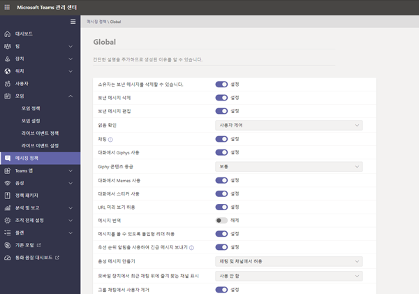
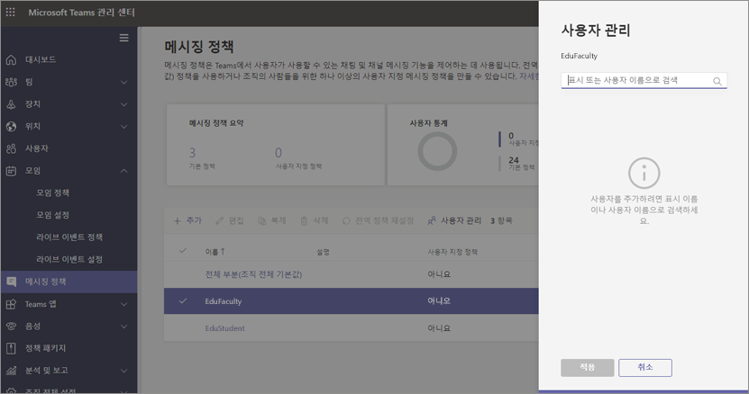
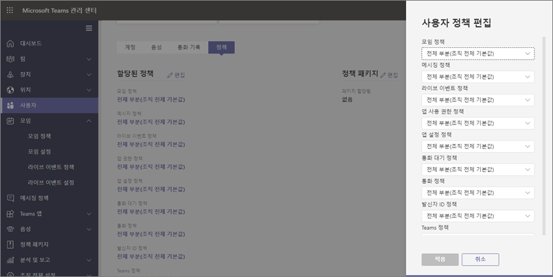
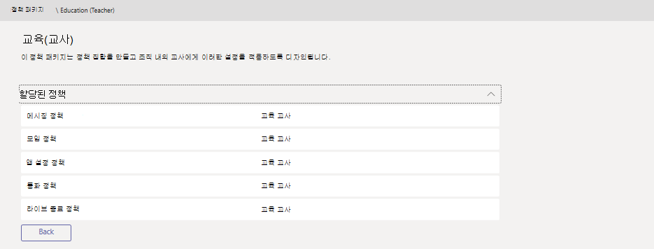

# 교육용 Teams 정책 및 정책 패키지

[!INCLUDE [policy-wizard-edu](includes/policy-wizard-edu.md)]

> [!NOTE]
> Microsoft Teams의 정책에 대한 자세한 내용은 [Microsoft Teams에서 사용자에게 정책 할당](assign-policies.md)을 검토하세요.

## 관리자: Microsoft Teams 정책 관리로 시작하기

Microsoft Teams의 핵심은 사용자가 모임 또는 라이브 이벤트로 이동, 채팅, 통화, 앱 사용 등의 작업을 수행할 수 있다는 점입니다. 올바른 Microsoft Teams 관리 정책을 설정하는 것은 Teams이 학생에게 안전한 학습 환경인지 확인하는 데 있어 중요한 단계입니다. 관리자는 정책을 사용하여 교육 기관에서 사용자에게 제공되는 Teams 기능을 제어할 수 있습니다. 대부분의 경우, 환경을 안전하게 유지하기 위해 학생과 교육자 모두에게 정책이 조정되어야 합니다.  

다음은 Microsoft Teams에서 찾을 수 있는 주요 정책 영역 목록입니다. 각 영역의 정책과 해당 정책이 제어하는 기능에 대해 자세히 알아보려면 아래 링크를 사용합니다.

- [모임](meeting-policies-in-teams.md)
- [라이브 이벤트](teams-live-events/configure-teams-live-events.md)
- [통화](teams-calling-policy.md) 
- [메시지](messaging-policies-in-teams.md)
- [Teams](teams-policies.md)
- [App 사용 권한](teams-app-permission-policies.md)

:::image type="content" source="media/edu-admin-center-users.png" alt-text="적용된 정책과 함께 사용자 스크린샷":::

관리자 자격 증명으로 로그인하여 [Microsoft Teams 관리 센터](https://admin.teams.microsoft.com)에서 모든 Teams 정책을 관리할 수 있습니다.

### Microsoft Teams 정책의 위치

Teams 관리 센터에 로그인하면 Teams 관리 센터의 왼쪽 탐색에서 정책 옵션을 클릭하여 관리해야 하는 Teams의 모든 영역에 대한 정책 설정으로 이동할 수 있습니다. 메시징 정책의 위치 스크린샷을 포함했습니다.

:::image type="content" source="media/edu-messaging-policies.png" alt-text="Teams 관리 센터에서 메시지 정책 위치":::

### 정책 정의의 생성 및 업데이트 방법

사용자에게 정책을 할당하기 전에 먼저 Teams에서 각 기능 영역에 대해 정책 정의를 추가하고 생성해야 합니다.

> [!NOTE]
> 학생과 교육 담당자를 위한 다른 정책 정의를 설정하는 것이 좋습니다.

기본적으로 모든 신규 사용자(학생 또는 교육 담당자)에게는 각 기능 영역에 대해 전역(조직 차원에서 기본값) 정책 정의가 할당됩니다. 가장 엄격한 정책 정의 집합에 전체(조직 전체 기본값)를 사용하는 것이 좋습니다. 대부분의 경우, 이 엄격한 정책 세트가 학생들에게 더 적합할 것입니다. 이러한 방식으로 전체(조직 전체 기본값) 정책 정의를 사용하면 새 사용자가 테넌트에 추가될 때 가장 엄격한 제한이 적용됩니다. 이 지침을 준수하려면 다음 단계를 따르는 것이 좋습니다.

1. 교육자의 요구에 맞는 정책 값을 사용하여 각 Teams 역량 영역에 대한 사용자 지정 정책 정의를 작성합니다(이 정의가 없으면 교육자는 전체(조직 전체 기본값) 정책 정의에 정의된 것과 동일한 제한된 액세스를 갖게 됩니다).

1. 이러한 새로운 사용자 지정 정책 정의를 교육자에게 할당합니다.

1. 각 기능 영역에 대한 전체(조직 전체의 기본값) 정책 정의를 학생에 적합한 값으로 편집합니다.

1. 전체(조직 전체의 기본값) 정책 정의는 다른 정책 정의가 할당되지 않는 한 학생들에게 적용됩니다.

정책 정의를 생성하거나 편집하려면 작업하려는 정책 기능 영역(예: 메시지 정책)으로 이동합니다. **추가** 를 선택하여 새 사용자 지정 정책 정의를 생성합니다. 기존 정책 정의를 변경하려면 **편집** 을 선택합니다.

:::image type="content" source="media/edu-messaging-policies-add-closeup.png" alt-text="추가 단추 보기가 있는 메시지 정책 섹션을 닫습니다.":::

정책 정의 추가 또는 편집을 선택한 경우 해당 정책 영역과 관련된 모든 정책 옵션이 나열되어 있는 보기로 이동합니다. 해당 목록을 사용하여 정책 정의에 설정하려는 값을 선택합니다.

> [!IMPORTANT]
> 페이지를 떠날 때 반드시 **저장** 을 선택해야 합니다.

### 정책 정의 할당 
사용자에게 정책 정의를 할당하는 데 사용할 수 있는 여러 가지 방법이 있습니다. 각 방법에는 장점과 단점이 있으며, 이는 기관의 고유한 요구에 따라 달라집니다.  

대부분의 경우 그룹 정책 할당을 사용하여 사용자에게 정책을 할당하는 것이 좋습니다. 이 방법을 사용하면 더 빠르고 원활한 정책 적용을 수행할 수 있습니다.  정책 정의가 할당된 그룹에 사용자를 추가하면 새 사용자가 자동으로 그룹의 정책을 상속합니다.  이를 통해 예를 들어 학기의 시작과 종료와 같이 환경에 많은 수의 사용자가 추가 및 제거될 때 보다 쉽게 정책을 관리할 수 있습니다.  

대규모 조직의 경우 대규모 사용자에게 정책을 할당해야 하는 경우에 적합한 일괄 정책 할당도 권장합니다. 이러한 응용 프로그램 방법에 대한 자세한 내용은 [학교의 대규모 사용자에게 정책 할당](batch-group-policy-assignment-edu.md)을 참조하시기 바랍니다.

소규모 기관이 있거나 개별 학생 또는 교육자의 정책 설정을 업데이트해야 하는 경우 아래 지침을 따릅니다.  

> [!IMPORTANT]
> 개별 사용자 수준에서 지정된 정책 할당은 사용자에게 할당된 모든 그룹 정책을 재정의합니다. 그룹 정책 설정을 재정의하려면 개별 정책 할당만 사용해야 합니다. 

#### 사용자에게 정책 정의를 할당하는 방법

> [!NOTE]
> 모든 사용자 및 클라이언트에게 정책 정의를 할당하는 작업에는 시간이 소요될 수 있습니다. Azure/M365에 사용자 계정을 처음 생성할 때 및 새 학생이 교육 기관에 참여할 때마다 해당 작업이 필요할 수 있습니다.

정책 정의를 생성하거나 업데이트한 후에는 정책 페이지에서 **사용자 관리** 를 선택하고 원하는 사용자를 검색한 다음 정책을 적용하여 사용자에게 할당할 수 있습니다.

또한 **사용자** 로 이동하고 정책을 업데이트하려는 사용자를 선택하고 **정책** 을 선택한 후 **편집** 을 선택하여 사용자에게 정책을 할당할 수도 있습니다. 여기에서 각 기능 영역에 대해 사용자에게 할당하려는 정책 정의를 선택할 수 있습니다.

### Microsoft Teams의 정책 패키지
> [!NOTE]
> 자세한 내용은 [Microsoft Teams의 정책 패키지 관리](manage-policy-packages.md)를 참조하여 단일 사용자에게 패키지 할당, 최대 5,000명의 사용자에게 패키지 대량 할당, 각 패키지에 연결된 정책 관리 및 업데이트에 대한 단계별 지침을 확인하세요.

Teams의 정책 패키지는 위에서 살펴본 사전 정의된 정책 및 정책 설정을 수집하고 수집한 것을 기관에서 유사한 역할을 가진 사용자에게 할당합니다. 정책 패키지는 정책 관리 시 이를 단순화 및 간소화하고 일관성을 제공하도록 돕습니다. 기본 사례에서 정책 패키지를 각 사용자에게 할당하고 해당 사용자 그룹의 요구에 따라 각 패키지의 정책을 재정의할 수 있습니다. 패키지의 설정을 업데이트하면 해당 패키지에 할당된 모든 사용자는 대량 업데이트로 변경됩니다.

일반적으로 교육 기관에는 학생 나이 및 성숙도에 따라 부분적으로 고유한 요구 사항을 지닌 다양한 사용자가 있습니다. 예를 들어 교육 담당자 및 직원에게 Microsoft Teams의 모든 액세스 권한을 부여할 수 있지만 안전하고 집중된 교육 환경을 장려하기 위해 학생용 Microsoft Teams 기능은 제한할 수 있습니다. 교육 기관 공동체에서 다양한 코호트 요구 사항에 따라 정책 패키지를 사용하여 설정을 조정할 수 있습니다.

> [!IMPORTANT] 
> 기본 권장 사항은 정책 패키지 대신 전체(조직 전체의 기본값) 정책 정의를 사용하는 것입니다. 이렇게 하면 조직의 새 사용자가 항상 학생들에게 가장 엄격한 정책 집합을 가질 수 있습니다. 이 권장 사항이 해당 기관의 요구를 충족하지 못할 경우 아래의 학생 정책 패키지 중 하나가 좋은 대안이 될 수 있습니다. 

해당 문서의 앞 부분에서 설명한 대로 정책 패키지는 다음 작업에 대해 정책을 사전 정의합니다.

- 모임
- 라이브 이벤트
- 통화
- 메시지
- 앱 사용 권한

Microsoft Teams는 현재 다음 정책 패키지를 포함하고 있습니다.

|Microsoft Teams 관리 센터에 나열된 패키지 이름 |최적 용도  |설명 |
|:--- |:--- |:--- |
|**Education_Teacher**| 교육 담당자 및 직원| 해당 정책의 집합 및 정책 설정을 사용하여 조직 내 교육 담당자 및 직원에게 Microsoft Teams를 통해 채팅, 통화 및 모임에 대한 모든 액세스 권한을 부여합니다. |
|**Education_PrimaryStudent**| 초등 연령 이하의 학생  | 기관 내 초등 연령 이하의 학생에게는 Microsoft Teams 내에서 더 많은 제한이 필요할 수 있습니다. 해당 정책의 집합 및 정책 설정을 사용하여 모임 생성 및 관리, 채팅 관리, 비공개 통화 등의 기능을 제한할 수 있습니다. |
|**Education_SecondaryStudent**| 중등 연령의 학생 | 기관 내 중등 연령의 학생에게는 Microsoft Teams 내에서 더 많은 제한이 필요할 수 있습니다. 해당 정책의 집합 및 정책 설정을 사용하여 모임 생성 및 관리, 채팅 관리, 비공개 통화 등의 기능을 제한할 수 있습니다. |
|**Education_HigherEducationStudent**| 고등 교육 학생 | 기관 내 고등 교육 학생에게는 해당 연령 이하의 학생보다 필요한 제한 사항이 더 적을 수 있지만 일부 기능의 제한은 권장될 수 있습니다. 해당 정책의 집합 및 정책 설정을 사용하여 조직 내에서 채팅, 통화 및 모임에 대한 액세스 권한을 부여할 수 있지만 외부 참석자와 함께 Microsoft Teams를 사용하는 방법을 제한할 수 있습니다. |
|**Education_PrimaryTeacher_RemoteLearning**| 교육 담당자 및 직원 | 초등학교 교사에게 적용되는 정책 집합을 만들어 원격 학습을 사용할 때 학생의 보안 및 공동 작업을 극대화합니다. |
|**Education_PrimaryStudent_RemoteLearning**| 초등 연령 이하의 학생| 초등학교 학생에게 적용되는 정책 집합을 만들어 원격 학습을 사용할 때 학생의 보안 및 공동 작업을 극대화합니다.
|||

:::image type="content" source="media/edu-policy-packages-list.png" alt-text="선택할 수 있는 정책 패키지 목록을 포함한 정책 패키지 페이지":::

정책 패키지에 연결된 정책을 식별할 수 있도록 각 개별 정책에는 정책 패키지의 이름이 지정됩니다. 예를 들어 교육 기관의 교육 담당자자에게 Education_Teacher 정책 패키지를 할당하는 경우 패키지의 각 정책에 대해 Education_Teacher 이름의 정책이 생성됩니다.

> [!NOTE]
> 교육 담당자 및 관리 지원 직원에게 다른 정책이 필요하다고 결정한 경우 기존 패키지의 용도를 변경할 수 있습니다. (현재 사용하지 않는 패키지를 식별하고 해당 그룹에 맞게 설정을 변경할 수 있습니다.) 어떤 그룹에 어떤 패키지를 지정해야 하는지 직접 메모해야 할 수도 있지만 이는 패키지의 용도를 변경하는 데 있어서 유일한 제한이 됩니다.

## 정책 패키지 관리

### 보기

패키지를 할당하기 전에 정책 패키지에서 각 정책의 설정을 확인합니다. Microsoft Teams 관리 센터의 왼쪽 탐색 모음에서 **정책 패키지** 를 선택하고 패키지 이름을 선택한 다음 정책 이름을 선택합니다.

미리 정의된 값이 조직에 적합한지 또는 조직의 요구 사항에 따라 더 엄격하거나 관대하게 사용자 지정해야하는지 결정합니다.

### 사용자 지정

필요한 경우, 조직의 요구 사항에 맞게 정책 패키지에서 정책의 설정을 사용자 지정합니다. 정책 설정에 대한 모든 변경 내용은 패키지가 할당된 사용자에게 자동으로 적용됩니다. 정책 패키지에서 정책 설정을 편집하려면 Microsoft Teams 관리 센터에서 정책 패키지를 선택하고 편집하려는 정책 이름을 선택한 다음 **편집** 을 선택합니다.

정책 패키지를 할당한 다음에도 패키지에서 정책 설정을 변경할 수 있다는 점을 잊지 마세요. 자세한 내용은 [정책 패키지에서 정책 사용자 지정](manage-policy-packages.md#customize-policies-in-a-policy-package)을 참조하세요. 

### 할당

정책 패키지를 사용자에 할당합니다. 사용자에게 정책이 할당된 후 나중에 다른 정책을 할당하는 경우 가장 최근의 할당이 우선됩니다.

> [!NOTE]
> 사용자 지정 정책 패키지 할당을 받으려면 각 사용자에게 고급 통신 추가 기능이 필요합니다. 자세한 내용은 [Microsoft Teams를 위한 고급 통신 추가 기능](/microsoftteams/teams-add-on-licensing/advanced-communications)을 참조하세요.

#### 한 명의 사용자나 여러 사용자에게 정책 패키지 할당

한 명의 사용자나 여러 사용자에게 정책 패키지를 할당하려면 Microsoft Teams 관리 센터의 왼쪽 탐색에서 **정책 패키지** 로 이동한 다음 **사용자 관리** 를 선택합니다.  

자세한 내용은 [정책 패키지 할당](manage-policy-packages.md#assign-a-policy-package)을 참조하세요.

사용자에게 정책이 할당된 후 나중에 다른 정책을 할당하는 경우 가장 최근의 할당이 우선됩니다.

#### 그룹에 정책 패키지 할당

**이 기능은 비공개 리미 보기에 있습니다.**

그룹에 정책 패키지 할당을 사용하면 보안 그룹이나 배포 목록과 같은 사용자 그룹에 여러 정책을 할당할 수 있습니다. 정책 할당은 선행 규칙에 따라 그룹의 구성원에게 전파됩니다. 그룹에서 구성원이 추가되거나 제거되면 상속된 정책 할당이 그에 따라 업데이트됩니다. 이 방법은 최대 50,000명의 사용자가 있는 그룹에 적합하지만, 더 큰 그룹에도 적용됩니다.

자세한 내용은 [그룹에 정책 패키지 할당](assign-policies.md#assign-a-policy-package-to-a-group)을 참조하세요.

#### 대규모 사용자 집합(배치)에 정책 패키지 할당

한 번에 많은 사용자에게 정책 패키지를 할당하려면 배치 정책 패키지를 사용합니다. [New-CsBatchPolicyPackageAssignmentOperation](/powershell/module/teams/new-csbatchpolicypackageassignmentoperation) cmdlet을 사용하여 대규모 사용자와 할당하려는 정책 패키지를 제출합니다. 할당은 백그라운드 작업으로 처리되고 각 배치에 작업 ID가 생성됩니다.

배치에는 최대 5천 명의 사용자가 포함될 수 있습니다. 개체 ID, UPN, SIP 주소 또는 전자 메일 주소로 사용자를 지정할 수 있습니다. 자세한 내용은 [배치 사용자에게 정책 패키지 할당](assign-policies.md#assign-a-policy-package-to-a-batch-of-users)을 참조하세요.

## 학생 안전을 위해 할당해야 하는 정책

사용자 환경에서 학생을 보호하기 위해 수행해야 하는 단계에 대한 자세한 내용은 [원격 학습을 위해 Teams을 사용하는 동안 학생을 안전하게 유지](https://support.office.com/article/keeping-students-safe-while-using-meetings-in-teams-for-distance-learning-f00fa399-0473-4d31-ab72-644c137e11c8)를 주의 깊게 검토합니다.
