# 교육용 Teams 정책 및 정책 패키지

> [!NOTE]
> Microsoft Teams의 정책에 대한 자세한 내용은 [Microsoft Teams에서 사용자에게 정책 할당](assign-policies.md)을 검토하세요.

이 문서는 Teams에서 사용자에게 정책을 할당하는 여러 방법에 대해 다룹니다.

- 개별 사용자에게 수동으로 할당합니다.
- PowerShell을 통해 여러 사용자에게 일괄적으로 할당합니다.
- 개별 또는 여러 사용자에게 정책 패키지를 할당합니다.

해당 접근 방식의 장점 및 단점은 교육 기관의 개별 요구 사항으로 설명됩니다.

## 관리자: Microsoft Teams 정책 관리로 시작하기

Microsoft Teams의 핵심은 사용자가 모임 또는 라이브 이벤트로 이동, 채팅, 통화, 앱 사용 등의 작업을 수행할 수 있다는 점입니다. Teams 내에서 학생을 위한 안전한 교육 환경을 만드는 데에는 적절한 Microsoft Teams 관리 정책을 설정하는 것이 중요합니다. 관리자는 정책을 사용하여 교육 기관에서 사용자에게 제공되는 Teams 기능을 제어할 수 있습니다.

Microsoft Teams에서 확인할 수 있는 정책 영역 목록은 다음과 같습니다.

- 모임
- 라이브 이벤트
- 통화
- 메시지
- Teams
- 앱 사용 권한

:::image type="content" source="media/edu-admin-center-users.png" alt-text="적용된 정책과 함께 사용자 스크린샷":::

관리자 자격 증명으로 로그인하여 [Microsoft Teams 관리자 센터](https://admin.teams.microsoft.com)에서 모든 Teams 정책을 손쉽게 관리할 수 있습니다.

### Microsoft Teams 정책의 위치

Teams 관리 센터에 로그인하면 Teams 관리 센터의 왼쪽 탐색에서 정책 옵션을 클릭하여 관리해야 하는 Teams의 모든 영역에 대한 정책 설정으로 이동할 수 있습니다. 메시지 정책의 위치 스크린샷이 포함되어 있습니다.

:::image type="content" source="media/edu-messaging-policies.png" alt-text="Teams 관리 센터에서 메시지 정책 위치":::

### 정책 정의의 생성 및 업데이트 방법

사용자에게 정책을 할당하기 전에 먼저 Teams에서 각 기능 영역에 대해 정책 정의를 추가하고 생성해야 합니다.

> [!NOTE]
> 학생과 교육 담당자를 위한 다른 정책 정의를 설정하는 것이 좋습니다.

기본적으로 모든 신규 사용자(학생 또는 교육 담당자)에게는 각 기능 영역에 대해 전역(조직 차원에서 기본값) 정책 정의가 할당됩니다. 다음 단계를 수행하는 것이 좋습니다.

1. 교육 담당자에게 할당할 수 있는 Teams의 각 기능 영역에 대해 사용자 지정 정책 정의를 생성합니다. (해당 단계를 수행하지 않으면 전역 정책에 대한 모든 변경 사항은 교육 담당자를 위한 정책을 생성하기 전까지 교육 담당자에게 제한됩니다.)
1. 해당 새 정책 정의를 교육 담당자에게 할당합니다.
1. 전역(조직 차원에서 기본값) 정책 정의를 업데이트한 후 학생에게 할당합니다.

정책 정의를 생성하거나 편집하려면 작업하려는 정책 기능 영역(예: 메시지 정책)으로 이동합니다. 새 사용자 지정 정책 정의 (교육 담당자용으로 생성한 사용자 지정 정책 정의)를 생성하려면 **추가**를 선택합니다. 그렇지 않고 기존 정책 정의를 변경하려면 **편집**(학생을 위한 전역 정책 업데이트를 선택한 경우 수행해야 하는 작업)을 선택합니다.

:::image type="content" source="media/edu-messaging-policies-add-closeup.png" alt-text="추가 단추 보기가 있는 메시지 정책 섹션을 닫습니다.":::

정책 정의 추가 또는 편집을 선택한 경우 해당 정책 영역과 관련된 모든 정책 옵션이 나열되어 있는 보기로 이동합니다. 해당 목록을 사용하여 정책 정의에 설정하려는 값을 선택합니다.

> [!IMPORTANT]
> 페이지를 떠날 때 반드시 **저장**을 선택해야 합니다.

### 사용자에게 정책 정의를 할당하는 방법

> [!NOTE]
> 모든 사용자 및 클라이언트에게 정책 정의를 할당하는 작업에는 시간이 소요될 수 있습니다. Azure/M365에 사용자 계정을 처음 생성할 때 및 새 학생이 교육 기관에 참여할 때마다 해당 작업이 필요할 수 있습니다.

정책 정의를 생성하거나 업데이트하면 정책 페이지에서 **사용자 관리**를 선택하고 원하는 사용자를 검색한 후 정책을 적용하여 사용자에게 해당 정책 정의를 할당할 수 있습니다.

또한 사용자로 이동하고 정책을 업데이트하려는 사용자를 선택하고 정책을 선택한 후 편집을 선택하여 사용자에게 정책을 할당할 수도 있습니다. 여기에서 각 기능 영역에 대해 사용자에게 할당하고 사용하려는 정책 정의를 선택할 수 있습니다.

> [!IMPORTANT]
> 사용자가 대규모 교육 기관에 소속되어 있는 경우 Microsoft Teams 관리 포털 환경을 사용하여 각 사용자에 대해 정책을 설정하는 작업이 어려울 수 있습니다. PowerShell을 통해 일괄적으로 정책을 할당하는 것이 좋습니다. 사용자에게 필요한 경우 [교육 기관에서 대규모 사용자 집합에 정책을 할당](batch-policy-assignment-edu.md)하는 방법에 대해 몇 가지 EDU 관련 정보를 제공하며 대규모 사용자 그룹에 대한 정책 및 설정을 관리하는 또 다른 유용한 방법인 정책 패키지에서 아래 섹션을 확인할 수도 있습니다.

### Microsoft Teams의 정책 패키지

Teams의 정책 패키지는 위에서 살펴본 사전 정의된 정책 및 정책 설정을 수집하고 수집한 것을 기관에서 유사한 역할을 가진 사용자에게 할당합니다. 정책 패키지는 정책 관리 시 이를 단순화 및 간소화하고 일관성을 제공하도록 돕습니다. 기본 사례에서 정책 패키지를 각 사용자에게 할당하고 해당 사용자 그룹의 요구에 따라 각 패키지의 정책을 재정의할 수 있습니다. 패키지의 설정을 업데이트하면 해당 패키지에 할당된 모든 사용자는 대량 업데이트로 변경됩니다.

일반적으로 교육 기관에는 학생 나이 및 성숙도에 따라 부분적으로 고유한 요구 사항을 지닌 다양한 사용자가 있습니다. 예를 들어 교육 담당자 및 직원에게 Microsoft Teams의 모든 액세스 권한을 부여할 수 있지만 안전하고 집중된 교육 환경을 장려하기 위해 학생용 Microsoft Teams 기능은 제한할 수 있습니다. 교육 기관 공동체에서 다양한 코호트 요구 사항에 따라 정책 패키지를 사용하여 설정을 조정할 수 있습니다.

> [!NOTE]
> 자세한 내용은 [Microsoft Teams의 정책 패키지 관리](manage-policy-packages.md)를 참조하여 단일 사용자에게 패키지 할당, 최대 5,000명의 사용자에게 패키지 대량 할당, 각 패키지에 연결된 정책 관리 및 업데이트에 대한 단계별 지침을 확인하세요.

해당 문서의 앞 부분에서 설명한 대로 정책 패키지는 다음 작업에 대해 정책을 사전 정의합니다.

- 모임
- 라이브 이벤트
- 통화
- 메시지
- Teams
- 앱 사용 권한

Microsoft Teams는 현재 다음 정책 패키지를 포함하고 있습니다.

|Microsoft Teams 관리 센터에 나열된 패키지 이름 |최적 용도  |설명 |
|:--- |:--- |:--- |
|**Education_Teacher**| 교육 담당자 및 직원| 해당 정책의 집합 및 정책 설정을 사용하여 조직 내 교육 담당자 및 직원에게 Microsoft Teams를 통해 채팅, 통화 및 모임에 대한 모든 액세스 권한을 부여합니다. |
|**Education_PrimaryStudent**| 초등 연령 이하의 학생  | 기관 내 초등 연령 이하의 학생에게는 Microsoft Teams 내에서 더 많은 제한이 필요할 수 있습니다. 해당 정책의 집합 및 정책 설정을 사용하여 모임 생성 및 관리, 채팅 관리, 비공개 통화 등의 기능을 제한할 수 있습니다. |
|**Education_SecondaryStudent**| 중등 연령의 학생 | 기관 내 중등 연령의 학생에게는 Microsoft Teams 내에서 더 많은 제한이 필요할 수 있습니다. 해당 정책의 집합 및 정책 설정을 사용하여 모임 생성 및 관리, 채팅 관리, 비공개 통화 등의 기능을 제한할 수 있습니다. |
|**Education_HigherEducationStudent**| 고등 교육 학생 | 기관 내 고등 교육 학생에게는 해당 연령 이하의 학생보다 필요한 제한 사항이 더 적을 수 있지만 일부 기능의 제한은 권장될 수 있습니다. 해당 정책의 집합 및 정책 설정을 사용하여 조직 내에서 채팅, 통화 및 모임에 대한 액세스 권한을 부여할 수 있지만 외부 참석자와 함께 Microsoft Teams를 사용하는 방법을 제한할 수 있습니다. |
|**Education_PrimaryTeacher_RemoteLearning**| 교육 담당자 및 직원 | 초등학교 교사에게 적용되는 정책 집합을 만들어 원격 학습을 사용할 때 학생의 보안 및 공동 작업을 극대화합니다. |
|**Education_PrimaryStudent_RemoteLearning**| 초등 연령 이하의 학생| 초등학교 학생에게 적용되는 정책 집합을 만들어 원격 학습을 사용할 때 학생의 보안 및 공동 작업을 극대화합니다.
|||

:::image type="content" source="media/edu-policy-packages-list.png" alt-text="선택할 수 있는 정책 패키지 목록을 포함한 정책 패키지 페이지":::

각 개별 정책은 정책 패키지의 이름이 지정되며 정책 패키지에 연결된 정책을 쉽게 식별할 수 있습니다. 예를 들어 교육 기관의 교육 담당자자에게 Education_Teacher 정책 패키지를 할당하는 경우 패키지의 각 정책에 대해 Education_Teacher 이름의 정책이 생성됩니다.

> [!NOTE]
> 교육 담당자 및 관리 지원 직원에게 다른 정책이 필요하다고 결정한 경우 기존 패키지의 용도를 변경할 수 있습니다. (현재 사용하지 않는 패키지를 식별하고 해당 그룹에 맞게 설정을 변경할 수 있습니다.) 어떤 그룹에 어떤 패키지를 지정해야 하는지 직접 메모해야 할 수도 있지만 이는 패키지의 용도를 변경하는 데 있어서 유일한 제한이 됩니다.

## 학생 안전을 위해 할당해야 하는 정책

### 모임 정책

#### 모임 생성 및 시작 기능 해제

학생이 무인 통신을 위해 모임을 예약할 수 없도록 하려면 모임 정책에서 해당 일반 설정을 통해 모임 생성 기능을 **해제**로 설정하세요.

- **채널에서 모임 시작 허용**: 해제
- **Outlook 추가 기능 허용**: 해제
- **채널 모임 예약 허용**: 해제
- **비공개 모임 예약 허용**: 해제

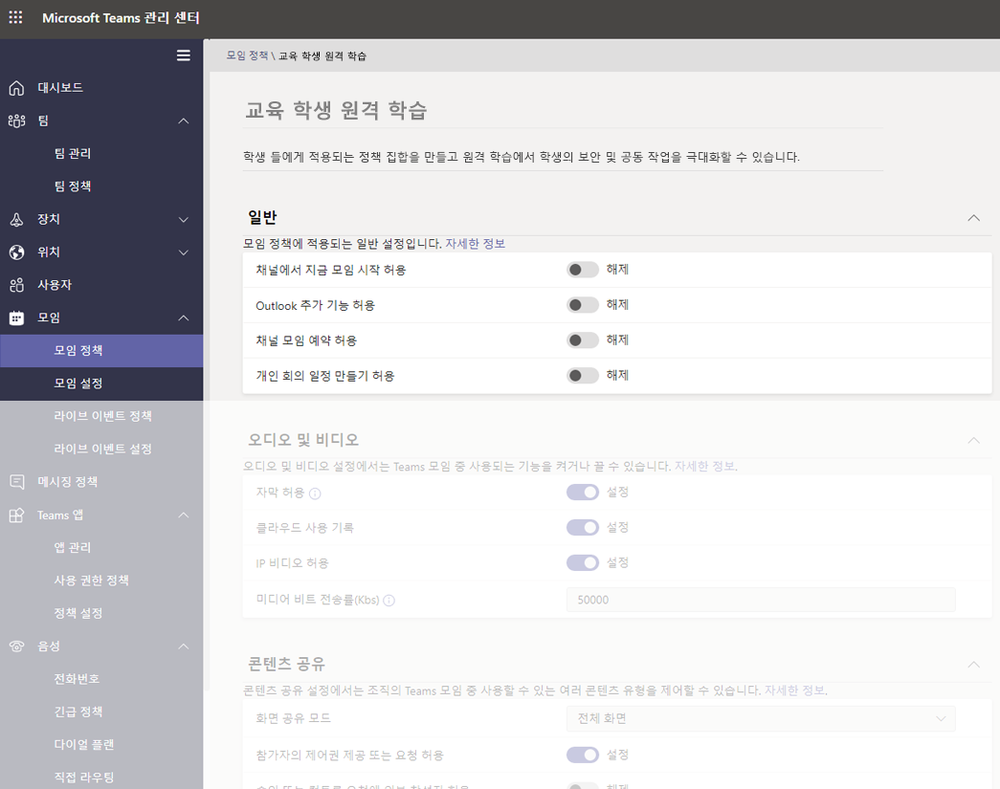

- 동일한 페이지에서 모임의 참석자 및 게스트 섹션에서 다음과 같이 설정합니다.
  - **비공개 모음에서 지금 모임 시작 허용**: 해제
  - **모임에서 채팅 허용**: 사용 안 함

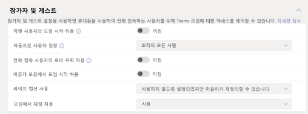

학생에 대한 **채널에서 지금 모임 시작을 허용**, **채널 모임 예약을 허용**, **비공개 모임의 예약을 허용** 그리고 **비공개 모임에서 지금 모임**을 해제하는 경우, 학생의 주최자로서의 모임 예약을 차단할 뿐만 아니라 교육에 대한 다음과 같은 보안 조치가 제공됩니다.

- 학생들이 강사보다 먼저 모임에 참가하려고 시도하는 경우, 최신 버전의 Teams 앱에서는 모임에 참가할 수 없게 됩니다.
- 모임 만들기는 모든 사용자와 라이선스에 적용되지만 앞서 설명한 모임 참가 차단에 대한 보안 조치는 사용자의 라이선스 유형을 기반으로 Teams의 교육 고객에게만 적용됩니다.

앞에서와 같이 **모임에서 채팅 허용** 정책을 사용하지 않도록 변경하고 학생의 모임 예약을 차단한 상태에서 이 정책을 강사에게 설정하는 경우(채널 혹은 채널의 지금 모임에서 예약하지 않은 모임에 대해), 학생은 강사가 모임에 참가하기 전 혹은 후에 채팅을 할 수 없게 됩니다. 학생은 모임 이전, 진행 중 그리고 후에 여전히 채팅 기록을 확인할 수 있습니다. 예를 들어, 모임이 녹음/녹화된 경우 학생은 교사의 메시지 또는 모임 녹음/녹화 링크를 볼 수 있습니다.

학생과 강사 모두에 대해 **모임에서 채팅 허용** 정책이 해제된 경우, 아무도 모임 채팅 창에서 채팅할 수 없습니다. 위에서 설명한 모임 채팅 제한에 대한 보안 조치는 사용자의 라이선스 유형을 기반으로 Teams의 교육 고객에게만 적용됩니다.

#### 학생이 통화 및 모임 중에 비디오를 공유할 수 있는지 여부를 제어합니다.

모임 정책 섹션에서 학생에 대해 설정하는 오디오 및 시각적 값이 교육 기관의 지침 및 학생, 교육 담당자, 학부모 및 보호자의 요청에 부합하는지 확인합니다. (**해제**하는 것이 좋은 **클라우드 녹음/녹화 허용**은 제외)

옵션은 다음과 같습니다.

- **기록 허용**: 해제/설정
- **클라우드 녹음/녹화 허용**: **해제**
- **IP 비디오 허용**: 해제/설정

:::image type="content" source="media/edu-policy-list-b.png" alt-text="원격 학습 페이지의 학생 교육, 비디오 옵션 표시":::

### 라이브 이벤트 정책

#### 라이브 이벤트 생성 및 시작 기능 해제

학생이 무인 통신을 위해 라이브 이벤트를 예약할 수 없도록 하려면 학생에 대해 **예약 허용** 정책을 **해제**로 설정하여 사용하지 못하게 합니다.

:::image type="content" source="media/edu-allow-scheduling-off.png" alt-text="원격 학습 페이지의 학생 교육, 예약 허용 옵션 해제":::

### 통화 정책

#### 비공개 통화를 설정하는 기능을 해제합니다.

학생이 다른 학생 또는 교육 담당자와 비공개 통화를 생성할 수 없도록 하려면 학생에 대해 **비공개 통화 생성** 정책을 **해제**로 설정하여 사용하지 못하게 합니다.

:::image type="content" source="media/edu-private-calls-off.png" alt-text="원격 학습 페이지의 학생 교육, 비공개 통화 생성 해제":::

### 메시지 정책

#### 보낸 메시지 삭제 또는 편집 기능 해제

- 학생용: 학생이 보낸 메시지를 삭제 또는 변경하지 않도록 하려면 학생은 해당 설정을 **해제**해야 합니다.
  - **보낸 메시지 삭제**
  - **보낸 메시지 편집**
- 교육 담당자용: 교육 담당자가 학생이 보낸 부적절한 메시지를 조정 또는 삭제할 수 있도록 하려면 교육 담당자는 해당 설정을 **설정**해야 합니다.
  - **소유자는 보낸 메시지를 삭제할 수 있습니다.** (해당 설정을 사용하면 교육 담당자는 학생이 보낸 부적절한 메시지를 삭제할 수 있습니다.)
  - **보낸 메시지 삭제**
  - **보낸 메시지 편집**

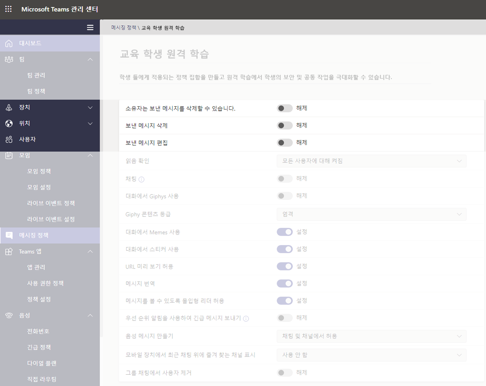

> [!NOTE]
> 해당 항목에 대한 자세한 내용은 [수업 팀에서 학생 의견 차단](https://support.office.com/article/Mute-student-comments-in-a-class-team-a378de16-ffc0-420c-b08d-e17ec08e7c17)을 참조하세요.

#### 학생이 비공개로 채팅을 할 수 있는지 여부를 제어합니다.

학생에 대해 설정된 **채팅 설정/해제** 값이 교육 기관의 지침 및 학생, 교육 담당자의 요구에 부합하는지 확인합니다. 해당 제어는 Teams에서 사용자가 1:1 채팅 또는 그룹 채팅에서 비공개로 통신하는 기능을 설정 또는 해제합니다.

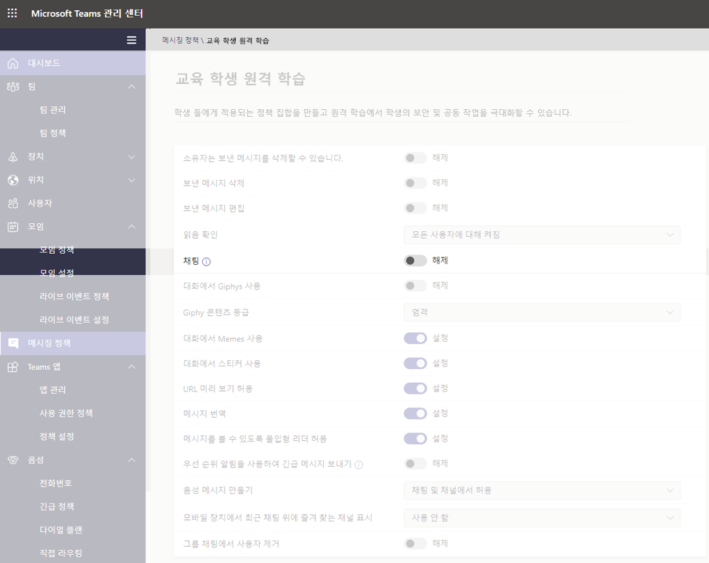

#### 학생이 자신의 메시지를 개인 설정할 수 있는지 여부를 제어합니다.

학생에 대해 설정된 값이 교육 기관의 지침 및 학생, 교육 담당자, 학부모 및 보호자의 요구에 부합하는지 확인합니다. **학생에 대해 Giphy**를 **해제**로 설정하고 **밈 및 스티커**를 계속 **설정**한 상태로 두는 것이 좋습니다.

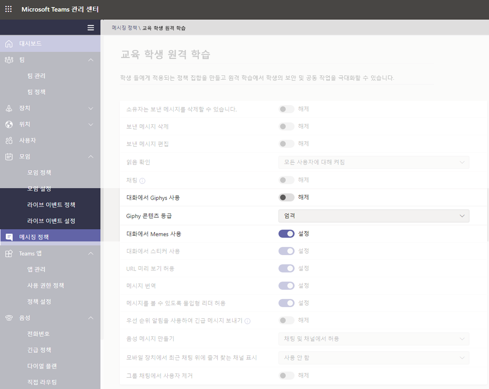

#### 학생이 음성 메시지를 전송할 수 있는지 여부를 제어합니다.

학생을 위한 **음성 메시지 생성**에 대해 설정된 값이 교육 기관의 지침 및 학생, 교육 담당자의 요구에 부합하는지 확인합니다.

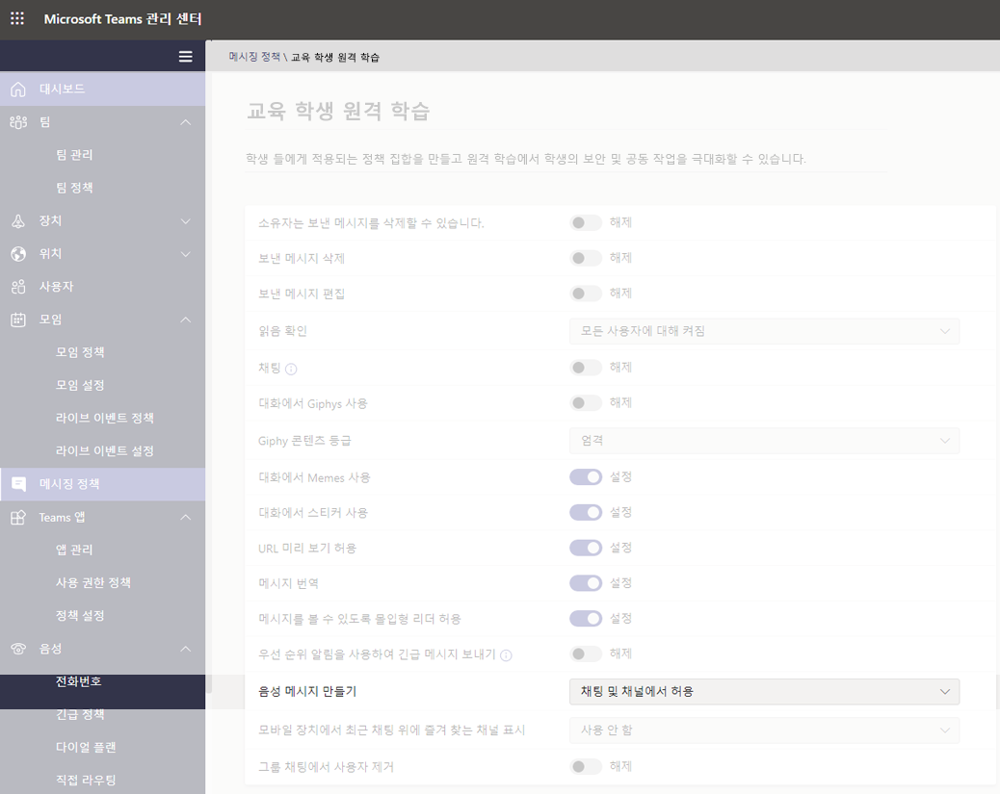

#### 학생용 채팅에서 사용자를 제거하는 기능을 해제합니다.

학생은 자신이 포함된 채팅에서 다른 사용자를 제거할 수 있는 기능을 사용할 수 없습니다. **그룹 채팅에서 사용자 제거**는 **해제**로 설정되어야 합니다.

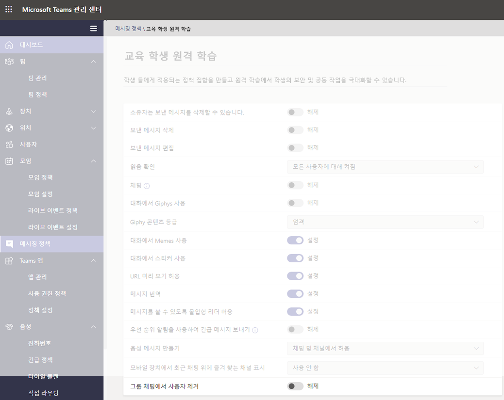

### Teams 정책

#### 비공개 채널 검색 및 생성 기능 해제

학생이 보호자의 지도 없이 통신하기 위한 개인 공간으로 개인 채널을 만들 수 없도록 하려면 학생에 대한 **개인 채널 생성** 정책을 **해제**로 설정합니다.

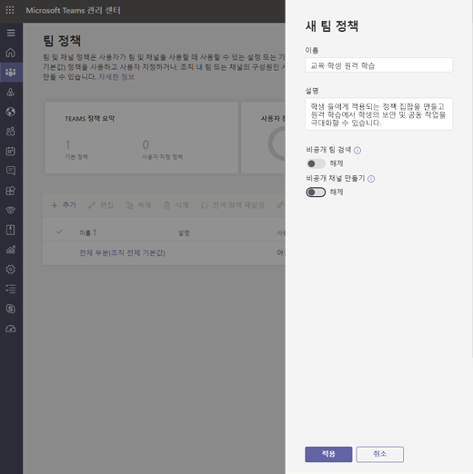

> [!IMPORTANT]
> 또한 Microsoft Teams에서 학생이 새 팀을 생성하지 못하도록 할 수 있습니다. 이는 실제로 M365 그룹 설정이며 자세한 내용은 [여기](https://docs.microsoft.com/microsoft-365/admin/create-groups/manage-creation-of-groups)를 참조하세요.

### 앱 사용 권한 정책

#### 학생이 Teams 내에서 앱을 추가할 수 있는지 여부를 제어합니다.

학생에 대해 설정된 값이 교육 기관의 지침에 부합하는지 확인합니다. 예를 들어 승인하는 앱에 학생이 노출되게 하려면 다음을 선택할 수 있습니다.

- **Microsoft 앱**: **모든 앱 허용**
- **타사 앱의 경우**: **특정 앱을 허용하고 다른 모든 앱 차단**
- **테넌트 앱의 경우**: **특정 앱을 허용하고 다른 모든 앱 차단**

:::image type="content" source="media/edu-policies-apps.png" alt-text="원격 학습 페이지의 학생 교육, 앱 정책 옵션 설정":::

> [!NOTE]
> 위에 언급된 대로 이는 예시이며 교육 기관의 지침에 따라 해당 정책을 설정해야 합니다.

## 교육 담당자에 대해 할당해야 하는 정책

이는 교육 담당자가 학생에게 안전한 수업 환경을 제공할 수 있도록 교육 담당자에 대해 적용하는 관리자용 권장 정책 설정입니다.

> [!NOTE]
> 핵상에 대한 정책 권장 사항은 아래에서 확인할 수 있는 교육 담당자의 섹션보다 더 많은 정보를 포함하고 있습니다. 교육 기관의 자체 정책 및 절차를 사용하여 정책 설정을 즉시 설정할 수 있는 반면, 여기에서 제공하는 권장 사항은 학생의 안전 및 보안과 엄격히 관련되어 있습니다.

### 모임 정책

해당 설정을 사용하여 교육 담당자는 자신의 모임에 대한 액세스를 제어할 수 있습니다.

- **익명 사용자의 모임 시작 허용**: **해제**
- **자동으로 사용자 허용**: **조직의 모든 사용자**
- **전화 접속 사용자의 로비 우회 허용**: **해제**
- 1**DesignatedPresenterRoleMode**: **OrganizerOnlyUserOverride**

1 이 설정은 Microsoft Teams 관리 센터에는 없습니다. 따라서 PowerShell을 사용하여 [Set-CsTeamsMeetingPolicy](https://docs.microsoft.com/powershell/module/skype/set-csteamsmeetingpolicy) 또는 [New-CsTeamsMeetingPolicy](https://docs.microsoft.com/powershell/module/skype/new-csteamsmeetingpolicy) cmdlet을 사용 하여 **DesignatedPresenterRoleMode** 매개 변수를 설정해야 합니다. 이 값은 Teams의 **모임 옵션**에서 **발표할 수 있는 사람** 의 기본값을 **본인만**으로 설정합니다. 이 설정을 사용하면 모임 이끌이만 발표자가 될 수 있으며 다른 모든 모임 참가자는 참석자로 지정됩니다. 자세한 내용은 [모임 정책 설정 - 지정된 발표자 역할 모드](meeting-policies-in-teams.md#meeting-policy-settings---designated-presenter-role-mode)를 참조하세요.

> [!NOTE]
> 교육자가 아닌 직원의 경우, 매개 변수를 **EveryoneUserOverride** (Teams의 **모든 사람** 설정에 해당) 또는 **EveryoneInCompanyUserOverride**(Teams에서 **조직 내 사용자**에 해당)로 설정하는 것이 좋습니다.

### 메시징 정책

**소유자는 보낸 메시지 삭제 가능**을 **설정**으로 설정하면 교육 담당자는 채널 모임에서 채팅 세션을 모니터링하고 부적절한 메시지를 삭제할 수 있습니다.

> [!NOTE]
> 교육 담당자는 채널 내에 모임 생성 시 수업 채팅에 부적절한 메시지를 삭제하거나 채널 자체 내에서 메시지를 삭제할 수 있습니다.

## 교육 담당자가 학생을 보호하기 위해 수행할 수 있는 작업

물론, 정책을 설정하는 것은 관리자가 Teams 설정에서 학생을 사전에 보호하는 유익한 방법입니다. 교육 담당자는 정기적으로 학생과 상호 작용하는 사용자이며 학생의 안전 유지에 중요한 역할을 담당하고 있습니다. 관리자는 함께 작업 중인 교육 담당자와 다음의 정보를 논의할 수 있습니다.

### 모임 옵션을 통해 모임 역할 설정

모임 옵션을 사용하여 모임 참석자가 모임을 참가자 또는 발표자로 참가하는지 여부를 제어할 수 있습니다. 옵션은 다음과 같습니다.

- **일정**으로 이동하여 업데이트하려는 모임으로 이동합니다. 모임 참가 링크 옆의 **모임 옵션**을 클릭하거나 탭하여 **모임 옵션**을 엽니다.

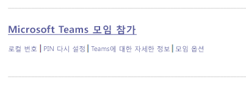

- **대기실 우회가 가능한 사용자** 선택 영역에서 모임을 직접 입력할 수 있는 사용자를 제어합니다. **조직 내 사용자**로 설정하여 외부 사용자가 입력할 옵션을 사용하지 않도록 하고 **호출자가 대기실을 항상 우회하도록 허용**을 **해제**로 전환하여 참석자가 모임에 즉시 참가하는 대신 대기하도록 합니다. 또한 **호출자가 참가하거나 떠나는 경우 알림** 옵션도 있습니다. 해당 옵션은 모임에 참여하는 사용자를 항상 알 수 있도록 **설정**되어 있어야 합니다.
- 발표자 또는 참가자로 모임에 참가하는 사용자를 제어합니다. **자신만**을 선택하여 다른 모든 참석자를 참가자로 지정할 수 있습니다. 교실 설정에서 생성하는 모임에 대한 가장 안전한 설정입니다.
  - 모임에 한 명 이상의 발표자가 있을 것으로 예상되면 **특정 사용자**를 선택하고 발표자로 참가해야 하는 다른 참석자를 선택합니다. 모든 참석자가 모임에 발표자로 참여하게 하려면 **모든 참석자**를 선택합니다.

:::image type="content" source="media/edu-meeting-options.png" alt-text="조직에서 선택한 사용자와 함께 대기실 드롭다운을 우회할 수 있는 사용자 및 내가 선택한 사용자와 함께 드롭다운을 표시할 수 있는 사용자":::

### 온라인 모임에서의 역할

모임의 모든 참석자를 발표자 또는 참가자로 역할을 지정합니다. 참석자의 역할은 모임에서 수행할 수 있는 작업을 제어합니다. 아래 표를 참조하세요.

|기능  |주최자/발표자  |참가자  |
|---------|---------|---------|
|발언 및 비디오 공유     |     Y     |     Y     |
|모임 채팅 참여     |     Y     |     Y     |
|다른 사용자가 공유하는 PowerPoint 파일 비공개로 보기     |     Y     |     Y     |
|콘텐츠 공유     |     Y     |     N     |
|다른 참가자 음소거|     Y     |     N     |
|참석자 제거      |     Y     |     N     |
|대기실에서 참석자 허용|     Y     |     N     |
|다른 참석자의 역할 변경     |     Y     |     N     |
|녹화 시작 또는 중지     |     Y     |     N     |

### 모임 중 역할 변경

모임의 모든 참석자를 발표자 또는 참가자로 역할을 지정합니다. 참석자의 역할은 모임에서 수행할 수 있는 작업을 제어합니다.

- 참석자의 역할을 변경하려면 통화 컨트롤에서 **참석자 표시**를 클릭하거나 탭합니다. 변경해야 하는 역할의 참석자를 마우스 오른쪽 단추로 클릭한 다음 **참가자 지정** 또는 **발표자 지정**을 선택합니다.

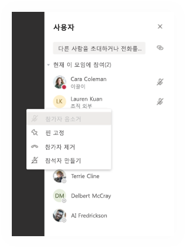

- 모임 옵션에 신속하게 액세스하고 현재 참석자 및 추후 모임에 참여하는 모든 사용자에 대해 모임 역할 설정을 변경하려면 통화 제어에서 **추가 작업**을 클릭하거나 탭한 다음 **모임 세부 정보 표시**를 클릭하거나 탭합니다. 모임에 대한 참가 링크 옆에 **모임 옵션**에 대한 링크를 확인할 수 있습니다.

:::image type="content" source="media/edu-meeting-details.png" alt-text="오른쪽에 모임 세부 정보 창이 있는 모임 창":::

### 학생 의견 차단

모임 후 채널 모임을 예약하면 학생 의견을 차단할 수 있습니다.

#### 특정 모임용

채널에서 모임 예약 시 모임 자체가 채널 게시물이며 모임 채팅은 게시물의 복제본입니다. 팀 소유자는 해당 게시물에 대한 **추가 작업**을 클릭하거나 탭할 수 있고 **편집**을 클릭할 수 있습니다.

:::image type="content" source="media/edu-meeting-edit.png" alt-text="채널 게시물에서 추가 옵션을 선택하고 팝업 메뉴의 두 번째 옵션으로 편집 메뉴 옵션을 확인합니다.":::

편집 창에서 드롭다운 옵션을 **사용자 및 진행자 회신 가능**으로 설정할 수 있습니다.

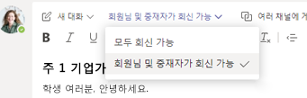

### 팀의 모든 모임 및 게시물용

학생이 수업 팀 및 모임 채팅에서 게시하고 회신할 수 있는 시기를 제어할 수 있습니다. 팀의 **추가 작업**을 클릭하거나 탭하고 **팀 관리**를 클릭하고 **구성원**으로 이동한 다음 음소거할 개별 사용자 선택 또는 **모든 학생 음소거**를 선택합니다.

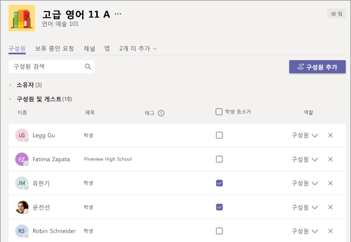

## 추가 자료

학생 보호에 대한 자세한 내용은 [Teams에서 원격 학습을 위한 모임을 사용하는 동안 학생 안전 유지](https://support.office.com/article/keeping-students-safe-while-using-meetings-in-teams-for-distance-learning-f00fa399-0473-4d31-ab72-644c137e11c8)를 검토하세요.
