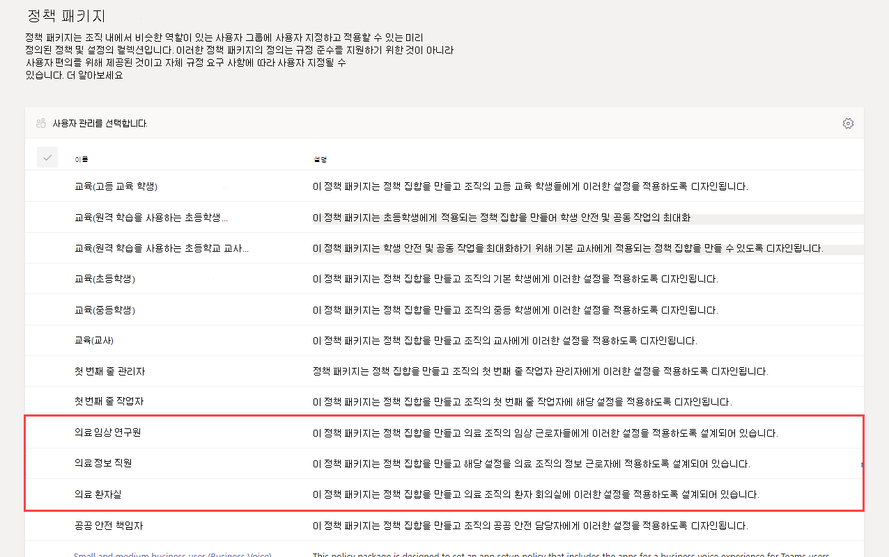

# 의료용 Teams 정책 패키지Teams policy packages for healthcare

## 개요Overview

Microsoft Teams의 [정책 패키지](manage-policy-packages.md)는 조직에서 유사한 역할을 가진 사용자에게 할당할 수 있는 미리 정의된 정책 및 정책 설정의 모음입니다.A [policy package](manage-policy-packages.md) in Microsoft Teams is a collection of predefined policies and policy settings that you can assign to users who have similar roles in your organization. 정책 패키지는 정책 관리 시 이를 단순화 및 간소화하고 일관성을 제공하도록 돕습니다.Policy packages simplify, streamline, and help provide consistency when managing policies. 사용자의 요구 사항에 맞게 패키지의 정책 설정을 사용자 정의할 수 있습니다.You can customize the settings of the policies in the package to suit the needs of your users. 정책 패키지의 정책 설정을 변경하면 해당 패키지에 할당된 모든 사용자에게 업데이트된 설정이 제공됩니다.When you change the settings of policies in a policy package, all users who are assigned to that package get the updated settings. Microsoft Teams 관리자 센터 또는 PowerShell을 사용하여 정책 패키지를 관리할 수 있습니다.You can manage policy packages by using the Microsoft Teams admin center or PowerShell.

> [!VIDEO https://www.microsoft.com/videoplayer/embed/RE4Ht2o]

정책 패키지는 패키지에 따라 다음에 대한 정책을 미리 정의합니다.Policy packages pre-define policies for the following, depending on the package:

- 메시지Messaging
- 모임Meetings
- 통화Calling
- 앱 설정App setup
- 라이브 이벤트Live events

Teams는 현재 다음 의료 정책 패키지를 포함하고 있습니다.Teams currently includes the following healthcare policy packages.

|Microsoft Teams 관리 센터의 패키지 이름Package name in the Microsoft Teams admin center|최적 용도Best used for|설명Description |
|---------|---------|---------|
|의료 임상 연구원Healthcare clinical worker  |의료 조직의 임상 연구원Clinical workers in your healthcare organization  |등록된 간호사, 유료 간호사, 의사 및 사회복지사와 같은 의료진에게 채팅, 통화, 이동 관리 및 회의에 대한 완전한 액세스를 제공하는 정책 및 정책 설정을 만듭니다.Creates a set of policies and policy settings that give clinical workers such as registered nurses, charge nurses, physicians, and social workers full access to chat, calling, shift management, and meetings. |
|의료 정보 직원Healthcare information worker  |의료 조직의 정보 연구원Information workers in your healthcare organization |IT 직원, 정보 전문가, 재무 담당자 및 규정 준수 담당자와 같은 정보 직원에게 채팅, 통화 및 모임에 대한 전체 액세스 권한을 부여하는 정책 및 정책 설정 집합을 만듭니다.Creates a set of policies and policy settings that give information workers such as IT personnel, informatics staff, finance personnel, and compliance officers, full access to chat, calling, and meetings.|
|의료 환자실Healthcare patient room  |환자실 장치Patient room devices|의료 조직의 환자실에 적용되는 정책 및 정책 설정 집합을 만듭니다.Creates a set of policies and policy settings that apply to patient rooms in your healthcare organization.|

각 개별 정책은 정책 패키지의 이름이 지정되며 정책 패키지에 연결된 정책을 쉽게 식별할 수 있습니다.Each individual policy is given the name of the policy package so you can easily identify the policies that are linked to a policy package. 예를 들어 조직의 임상 연구원에게 의료 임상 작업자 정책 패키지를 할당할 때 패키지의 각 정책에 대해 Healthcare_ClinicalWorker라는 정책이 생성됩니다.For example, when you assign the Healthcare clinical worker policy package to clinicians in your organization, a policy named Healthcare_ClinicalWorker is created for each policy in the package.

## 정책 패키지로 시작Get started with policy packages

의료 정책 패키지를 시작하려면 Microsoft 관리 센터 온보드 허브에서 **의료** 를 선택한 다음 **역할별 정책 설정 할당** 을 선택하세요.To get you started with Healthcare policy packages, on the Microsoft Admin Center onboarding hub, select **Healthcare**, and then select **Assign policy settings by role**. 시작할 준비가 되었으면 조직의 개인을 할당할 정책 패키지를 결정합니다.Once you’re ready to get started, decide which policy packages you'd like to assign individuals in your organization to.

패키지의 특정 정책과 해당 설정에 대해 자세히 알아보려면 **정책 세부 정보 보기** 를 선택합니다.Select **View policy details** to learn more about the specific policies in a package and their respective settings. Teams 관리 센터에서 할당한 후 [사용자 정의할 수 있습니다](manage-policy-packages.md#customize-policies-in-a-policy-package).These [can be customized](manage-policy-packages.md#customize-policies-in-a-policy-package) after assignment in the Teams Admin Center.

할당할 패키지를 하나 또는 여러 개 선택하고 **다음** 을 누르세요.Choose one or multiple packages to assign and then click **Next**. 역할에 가장 적합한 정책 패키지를 검색하여 추가할 수 있습니다.You can search for and add people to the policy package best suited for their role. 개인은 한 번에 둘 이상의 정책 패키지에 할당할 수 없습니다.An individual can't be assigned to more than one policy package at one time.

올바른 정책 패키지에 사용자를 추가하면 선택사항이 **완료** 됩니다.Once you’ve added people to the right policy package, **Finish** finalizes your selections. Microsoft Teams 관리자 센터에서 정책 패키지를 계속 사용자 정의하고 관리할 수 있습니다.You can continue to customize and manage policy packages in the Microsoft Teams admin center.

## 정책 패키지 관리Manage policy packages

### 보기View

패키지를 할당하기 전에 정책 패키지에서 각 정책의 설정을 확인합니다.View the settings of each policy in a policy package before you assign a package. Microsoft Teams 관리 센터의 왼쪽 탐색 모음에서 **정책 패키지** 로 이동하고 패키지 이름을 선택한 다음 정책 이름을 선택합니다.In the left navigation of the Microsoft Teams admin center, go to **Policy packages**, select the package name, and then select the policy name.

미리 정의된 값이 조직에 적합한지 또는 조직의 요구 사항에 따라 더 엄격하거나 관대하게 사용자 지정해야하는지 결정합니다.Decide whether the predefined values are appropriate for your organization or whether you need to customize them to be more restrictive or lenient based on your organization's needs.

### 사용자 지정Customize

필요한 경우, 조직의 요구 사항에 맞게 정책 패키지에서 정책의 설정을 사용자 지정합니다.Customize the settings of policies in the policy package, as needed, to fit the needs of your organization. 정책 설정에 대한 모든 변경 내용은 패키지가 할당된 사용자에게 자동으로 적용됩니다.Any changes you make to policy settings are automatically applied to users who are assigned the package. 정책 패키지의 정책 설정을 편집하려면 Microsoft Teams 관리자 센터의 왼쪽 탐색에서 **정책 패키지** 로 이동하여 정책 패키지를 선택하고 편집할 정책 이름을 선택한 다음 **편집** 을 선택하세요.To edit the settings of a policy in a policy package, in the left navigation of the Microsoft Teams admin center, go to **Policy packages**, select the policy package, select the name of the policy you want to edit, and then select **Edit**.

정책 패키지를 할당한 다음에도 패키지에서 정책 설정을 변경할 수 있다는 점을 잊지 마세요.Keep in mind that you can also change the settings of policies in a package after you assign the policy package. 자세한 내용은 [정책 패키지에서 정책 사용자 지정](manage-policy-packages.md#customize-policies-in-a-policy-package)을 참조하세요.To learn more, see [Customize policies in a policy package](manage-policy-packages.md#customize-policies-in-a-policy-package).

### 할당Assign

정책 패키지를 사용자에 할당합니다. 사용자에게 정책이 할당된 후 나중에 다른 정책을 할당하는 경우 가장 최근의 할당이 우선됩니다.Assign the policy package to users. If a user has a policy assigned, and then later you assign a different policy, the most recent assignment will take priority.

#### 한 명의 사용자나 여러 사용자에게 정책 패키지 할당Assign a policy package to one or several users

한 명의 사용자나 여러 사용자에게 정책 패키지를 할당하려면 Microsoft Teams 관리 센터의 왼쪽 탐색에서 **정책 패키지** 로 이동한 다음 **사용자 관리** 를 선택합니다.To assign a policy package to one or multiple users, in the left navigation of the Microsoft Teams admin center, go to **Policy packages**, and then select **Manage users**.  

자세한 내용은 [정책 패키지 할당](manage-policy-packages.md#assign-a-policy-package)을 참조하세요.To learn more, see [Assign a policy package](manage-policy-packages.md#assign-a-policy-package).

사용자에게 정책이 할당된 후 나중에 다른 정책을 할당하는 경우 가장 최근의 할당이 우선됩니다.If a user has a policy assigned, and then later you assign a different policy, the most recent assignment will take priority.

#### 그룹에 정책 패키지 할당Assign a policy package to a group

**이 기능은 비공개 리미 보기에 있습니다.****This feature is in private preview**

그룹에 정책 패키지 할당을 사용하면 보안 그룹이나 배포 목록과 같은 사용자 그룹에 여러 정책을 할당할 수 있습니다.Policy package assignment to groups let you assign multiple policies to a group of users, such as a security group or distribution list. 정책 할당은 선행 규칙에 따라 그룹의 구성원에게 전파됩니다.The policy assignment is propagated to members of the group according to precedence rules. 그룹에서 구성원이 추가되거나 제거되면 상속된 정책 할당이 그에 따라 업데이트됩니다.As members are added to or removed from a group, their inherited policy assignments are updated accordingly. 이 방법은 최대 50,000명의 사용자가 있는 그룹에 적합하지만, 더 큰 그룹에도 적용됩니다.This method is recommended for groups of up to 50,000 users but will also work with larger groups.

자세한 내용은 [그룹에 정책 패키지 할당](assign-policies.md#assign-a-policy-package-to-a-group)을 참조하세요.To learn more, see [Assign a policy package to a group](assign-policies.md#assign-a-policy-package-to-a-group).

#### 대규모 사용자 집합(배치)에 정책 패키지 할당Assign a policy package to a large set (batch) of users

한 번에 많은 사용자에게 정책 패키지를 할당하려면 배치 정책 패키지를 사용합니다.Use batch policy package assignment to assign a policy package to large sets of users at a time. [New-CsBatchPolicyPackageAssignmentOperation](/powershell/module/teams/new-csbatchpolicypackageassignmentoperation) cmdlet을 사용하여 대규모 사용자와 할당하려는 정책 패키지를 제출합니다.You use the [New-CsBatchPolicyPackageAssignmentOperation](/powershell/module/teams/new-csbatchpolicypackageassignmentoperation) cmdlet to submit a batch of users and the policy package that you want to assign. 할당은 백그라운드 작업으로 처리되고 각 배치에 작업 ID가 생성됩니다.The assignments are processed as a background operation and an operation ID is generated for each batch.

배치에는 최대 5천 명의 사용자가 포함될 수 있습니다.A batch can contain up to 5,000 users. 개체 ID, UPN, SIP 주소 또는 전자 메일 주소로 사용자를 지정할 수 있습니다.You can specify users by their object Id, UPN, SIP address, or email address. 자세한 내용은 [배치 사용자에게 정책 패키지 할당](assign-policies.md#assign-a-policy-package-to-a-batch-of-users)을 참조하세요.To learn more, see [Assign a policy package to a batch of users](assign-policies.md#assign-a-policy-package-to-a-batch-of-users).

## 관련 주제Related topics

[Teams에서 정책 패키지 관리Manage policy packages in Teams](manage-policy-packages.md)

[Teams에서 사용자에게 정책 할당Assign policies to your users in Teams](assign-policies.md)