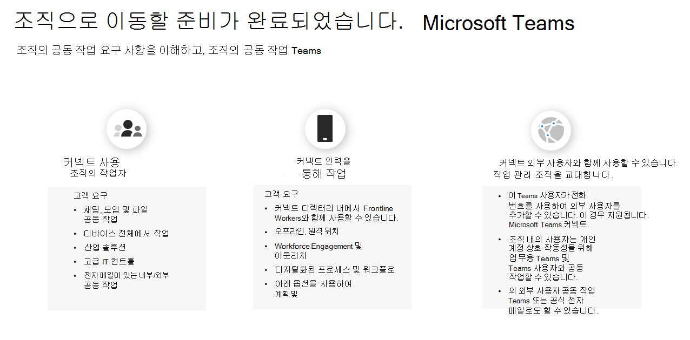

# 여정에 Kaizala Teams 차트

에서 Kaizala 이동하기로 Microsoft Teams.

시작하기 전에 다음 두 가지 질문에 대답하는 것이 중요합니다.

- 어떤 사용자 그룹으로 이동할 Teams?  

- 사용자에 대한 경로는 Teams?

## 사용자 그룹 식별

*조직에 어떤 그룹이 있나요? Who 어떻게 Teams? 이러한 그룹이 효과적인 팀워크를 위해 필요한 요구는 무엇입니까?* 전환을 위한 여정을 Teams 전환에 대한 사용자 그룹을 **먼저 식별합니다.**  사용자 그룹은 비즈니스의 유사한 영역에서 작업을 수행하는 직원의 집합입니다. 

공동 작업 요구 사항을 식별하는 데 지원하기 위해 세 가지 일반적인 사용자 그룹을 식별했습니다. 모든 사용자 그룹은 통신 측면에서 고유한 요구 사항을 가지고 있습니다. 

 1. **정보 작업자** 는 작업 과정에서 정보를 만들고, 사용, 변환, 사용 또는 관리하는 직원입니다.

 2. **프런트라인** 작업자는 주로 고객 또는 일반 대중과 직접 작업하는 서비스, 지원 및 판매 제품 또는 제품/서비스의 제조에 직접 관여하는 업무를 하는 데스크가 없는 근로자입니다.

 3. **외부 사용자는** 공급업체, 공급업체, 비즈니스 파트너, 클라이언트 또는 고객과 같은 조직 외부 사용자입니다.

인력에서 다른 정보 작업자와 연결하는 사용자는:

- 채팅, 모임, 파일 공동 작업

- 디바이스 전체에서 작업

- 산업 솔루션

- 고급 IT 컨트롤
  
- 전자 메일로 내부 및 외부 공동 작업

Frontline 인력과 연결하는 사용자는 다음이 필요합니다.

- 조직의 디렉터리 내에서 Frontline 작업자와 연결

- 오프라인, 원격 위치

- 인력 참여 및 아웃리치

- 디지털화된 프로세스 및 워크플로

- 교대 근무일정 및 작업 관리

외부 사용자(공급자/공급업체)와 연결하는 사용자는 다음을 사용할 수 있습니다.

- [게스트 액세스 공동](/MicrosoftTeams/guest-joins) 작업

- [페더레이션](/microsoftteams/manage-external-access)

## 경로 확인

사용자 그룹의 공동 작업 요구 사항을 확인한 후 사용자 그룹의 경로가 어떻게 Kaizala Teams 수 있습니다. 모든 조직은 고유하며, 인력의 여정은 동일하지 않습니다. 현재 사용되지 않는 조직은 Teams 전환 여정을 보장하기 위해 추가 전략적 결정을 내릴 필요가 있습니다. 경로를 결정하면 성공적인 전환을 위해 완료해야 하는 중요한 작업을 식별하는 데 도움이 됩니다.

현재 조직의 사용량에 따라 경로가 구성될 수 있는 방법을 간략하게 설명했습니다.  

조직에서 다음 **을 사용하지 Teams**.

 1. 조직에 대한 구상 팀워크

 2. 파일럿 Teams
  
 3. 배포 Teams
  
 4. Kaizala 및 Teams
  
 5. 변경 관리

 6. 사용자에 대한 Teams

 7. 조직을 Teams

이미 다음을 사용하는 **Teams**.

 1. 전환 계획

 2. 변경 관리

## 다음 단계

[성공적인 전환을 위한 Microsoft Teams](/MicrosoftTeams/plan-your-move-kaizala)
