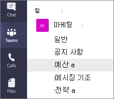
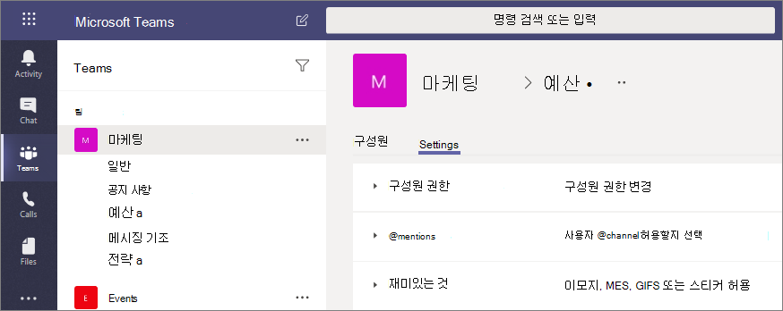

# Microsoft Teams의 비공개 채널Private channels in Microsoft Teams

Microsoft Teams의 비공개 채널은 팀 내 공동 작업을 위한 집중적인 공간을 만들어 줍니다.Private channels in Microsoft Teams create focused spaces for collaboration within your teams. 비공개 채널의 소유자나 구성원인 팀 사용자만 채널에 액세스할 수 있습니다.Only the users on the team who are owners or members of the private channel can access the channel. 이미 팀 구성원인 경우 게스트를 포함한 모든 사용자가 비공개 채널의 구성원으로 추가될 수 있습니다.Anyone, including guests, can be added as a member of a private channel as long as they are already members of the team.

관리할 추가 팀을 따로 만들 필요 없이 정보를 알아야 하는 사람에게만 공동 작업을 제한하려거나 특정 프로젝트에 할당된 그룹 간의 커뮤니케이션을 용이하게 하려는 경우 비공개 채널을 사용하는 것이 좋습니다.You might want to use a private channel if you want to limit collaboration to those who have a need to know or if you want to facilitate communication between a group of people assigned to a specific project, without having to create an additional team to manage.

예를 들어 다음과 같은 경우에 비공개 채널이 유용합니다.For example, a private channel is useful in these scenarios:

- 팀의 여러 사용자가 별도의 팀을 만들지 않고도 공동 작업을 할 수 있는 집중적인 공간입니다.A group of people in a team want a focused space to collaborate without having to create a separate team.
- 팀 내 일부 그룹의 사람들은 예산, 자원 조달, 전략적 배치 등과 같은 중요한 정보를 논의하기 위해 비공개 채널을 희망합니다.A subset of people in a team want a private channel to discuss sensitive information, such as budgets, resourcing, strategic positioning, and so on.

비공개 채널을 나타내는 자물쇠 아이콘. 비공개 채널의 구성원으로 추가된 사용자만 비공개 채널을 볼 수 있고 여기에 참여할 수 있습니다.A lock icon indicates a private channel. Only members of private channels can see and participate in private channels that they are added to.

비공개 채널이 만들어지면 해당 채널이 상위 팀에 연결되어 다른 팀으로 이동할 수 없습니다.When a private channel is created, it's linked to the parent team and can't be moved to a different team. 또한 비공개 채널은 표준 채널로 전환할 수 없으며, 그 반대로도 전한할 수 없습니다.Additionally, private channels can't be converted to standard channels and vice versa.

## 비공개 채널 만들기Private channel creation

기본적으로 팀 소유자 또는 팀 구성원은 비공개 채널을 만들 수 있습니다.By default, any team owner or team member can create a private channel. 게스트는 만들 수 없습니다.Guests can't create them. 비공개 채널을 만드는 기능은 팀 수준 및 조직 수준에서 관리됩니다.The ability to create private channels can be managed at the team level and at the organization level. 관리자는 [정책](teams-policies.md)을 사용하여 조직의 어떤 사용자가 비공개 채널을 만들도록 허용되는지를 제어할 수 있습니다.Use [policies](teams-policies.md) to control which users in your organization are allowed to create private channels. 정책을 설정한 후 팀의 **설정** 탭에서 팀 소유자는 구성원이 비공개 채널을 만들 수 있는 기능을 설정하거나 해제할 수 있습니다.Once you've set the policies, team owners can turn off or turn on the ability for members to create private channels in the **Settings** tab for a team.

비공개 채널을 만드는 사람은 비공개 채널 소유자가 되며 비공개 채널 소유자만 구성원을 직접 채널에 추가하거나 채널에서 제거할 수 있습니다.The person who creates a private channel is the private channel owner and only the private channel owner can directly add or remove people from it. 비공개 채널 소유자는 본인이 만든 비공개 채널에 팀 구성원(게스트 포함)을 추가할 수 있습니다.A private channel owner can add any team member to a private channel they created, including guests. 비공개 채널의 구성원은 보안이 적용된 대화 공간을 갖게 되며, 새로 추가된 구성원도 해당 비공개 채널의 모든 대화(기존 대화도)를 볼 수 있습니다.Members of a private channel have a secure conversation space, and when new members are added, they can see all conversations (even old conversations) in that private channel.

팀 소유자는 팀 내 모든 비공개 치널의 이름을 볼 수 있으며, 팀 내 어떤 비공개 채널이든 삭제할 수도 있습니다.Team owners can see the names of all private channels in their team and can also delete any private channel in the team. (삭제된 비공개 채널은 삭제된 후 30일 이내에 복원할 수 있습니다.)(A deleted private channel can be restored within 30 days after it's deleted). 팀 소유자가 비공개 채널의 구성원이 아니면 대화 또는 비공개 채널 내 파일 및 비공개 채널의 구성원 목록을 볼 수 없습니다.Team owners can't see the files in a private channel or the conversations and member list of a private channel unless they are members of that private channel.

팀 구성원은 자신이 추가된 비공개 채널만 볼 수 있습니다.Team members can only see private channels that they've been added to.

## 소유자와 구성원 추가 및 제거Adding and removing owners and members

비공개 채널 소유자가 하나 이상의 비공개 채널을 운영하는 마지막 소유자일 경우 Teams 클라이언트를 통해 제거할 수 없습니다.A private channel owner can't be removed through the Teams client if they are the last owner of one or more private channels.

비공개 채널 소유자가 조직을 떠나거나 팀과 연결된 Microsoft 365 그룹에서 제거될 경우 비공개 채널의 구성원이 자동으로 비공개 채널 소유자로 승격합니다.If a private channel owner leaves your organization or if they are removed from the Microsoft 365 group associated with the team, a member of the private channel is automatically promoted to be the private channel owner.

팀 구성원이 나가거나 팀에서 제거될 경우 해당 사용자는 팀 내 모든 비공개 채널에서도 나가거나 제거됩니다.If a team member leaves or is removed from a team, that user will also leave or be removed from all private channels in the team. 사용자가 팀에 다시 추가될 경우 팀 내 비공개 채널에도 다시 추가되어야 합니다.If the user is added back to the team, they must be added back to the private channels in the team.

## 채널 소유자 설정Channel owner settings

각 비공개 채널에는 구성원 추가 및 제거, 탭 추가, 그리고 전체 채널에 대한 @멘션 기능 등 채널 소유자가 관리할 수 있는 고유한 설정이 있습니다.Each private channel has its own settings that the channel owner can manage, including the ability to add and remove members, add tabs, and @mentioning for the entire channel. 이러한 설정은 상위 팀 설정과는 독립됩니다.These settings are independent of the parent team settings. 비공개 채널을 만들면 상위 팀에서 설정이 상속되며, 이후에 해당 설정을 변경하면 상위 팀 설정과 독립적으로 지정됩니다.When a private channel is created, it inherits settings from the parent team, after which its settings can be changed independently of the parent team settings.

비공개 채널 소유자는 **채널 관리** 를 클릭한 후 **구성원** 및 **설정** 탭을 사용하여 구성원을 추가하거나 제거하고 설정을 편집할 수 있습니다.The private channel owner can click **Manage channel**, and then use the **Members** and **Settings** tabs to add or remove members and edit settings.

## 비공개 채널 소유자 및 구성원 작업Private channel owner and member actions

다음 표에는 소유자, 구성원 및 게스트가 비공개 채널에서 수행할 수 있는 작업이 나와 있습니다.The following table outlines what actions owners, members, and guests can do in private channels.

|작업Action  |팀 소유자Team owner|팀 구성원Team member|팀 게스트Team guest|비공개 채널 소유자Private channel owner|비공개 채널 구성원Private channel member|비공개 채널 게스트Private channel guest|
|---------|---------|---------|---------|---------|---------|---------|
|비공개 채널 만들기Create private channel|관리자가 제어Admin controlled|관리자 및 팀 소유자가 제어Admin and team owner controlled|아니요No|해당 없음N/A|해당 없음N/A|해당 없음N/A|
|비공개 채널 삭제Delete private channel|예Yes|아니요No|아니요No|예Yes|아니요No|아니요No|
|비공개 채널 나가기Leave private channel|해당 없음N/A|해당 없음N/A|해당 없음N/A|예(마지막 소유자가 아닌 경우)Yes unless they are the last owner|예Yes|예Yes|
|비공개 채널 편집Edit private channel|아니요No|해당 없음N/A|해당 없음N/A|예Yes|아니요No|아니요No|
|삭제된 비공개 채널 복원Restore deleted private channel|예Yes|아니요No|아니요No|예Yes|아니요No|아니요No|
|구성원 추가Add members|아니요No|해당 없음N/A|해당 없음N/A|예Yes|아니요No|아니요No|
|설정 편집Edit settings|아니요No|해당 없음N/A|해당 없음N/A|예Yes|아니요No|아니요No|
|탭 및 앱 관리Manage tabs and apps|아니요No|해당 없음N/A|해당 없음N/A|예, 팀용 앱을 설치해야 합니다.Yes, apps must be installed for the team|채널 소유자가 제어Channel owner controlled|아니요No|

## 비공개 채널의 수명 주기 관리Manage the lifecycle of private channels

조직 내 비공개 채널의 수명 주기를 관리하는 방법에 대한 지침은 [Teams 내 비공개 채널의 수명 주기 관리](private-channels-life-cycle-management.md)를 참조하세요.See [Manage the lifecycle of private channels in Teams](private-channels-life-cycle-management.md) for guidance on how to manage the lifecycle of private channels in your organization. 여기에는 조직 내 어떤 사용자가 비공개 채널을 만들 수 있도록 할지 여부를 제어하는 방법, 팀 소유자 대신 비공개 채널을 만드는 방법, 보관 및 감사 목적으로 모든 비공개 채널 메시지 목록을 얻는 방법, 및 기타 관리 작업에 대한 설명이 포함되어 있습니다.This includes how to control whether users in your organization can create private channels, how to create a private channel on behalf of a team owner, how to get a list of all private channel messages for archiving and auditing purposes, and other management tasks.  

## 비공개 채널 SharePoint 사이트Private channel SharePoint sites

각 비공개 채널에는 고유한 SharePoint 사이트가 있습니다.Each private channel has its own SharePoint site. 별도의 사이트는 비공개 채널 파일에 대한 액세스 권한이 비공개 채널의 구성원에게만 제한되도록 하기 위함입니다.The separate site is to ensure access to private channel files is restricted to only members of the private channel. 이러한 사이트는 기본적으로 문서 라이브러리를 통해 만들어지며, [사이트 관리 인터페이스](https://support.office.com/article/A2F2A5C2-093D-4897-8B7F-37F86D83DF04)를 통해 전체 기능이 적용된 사이트로 손쉽게 업그레이드할 수 있습니다.These sites are created with a document library by default, and can be easily enhanced to a full-featured site through the [site management interface](https://support.office.com/article/A2F2A5C2-093D-4897-8B7F-37F86D83DF04). 각 사이트는 상위 팀의 사이트와 동일한 지역에서 만들어집니다.Each site is created in the same geographic region as the site for the parent team. 이러한 간단한 사이트에는 사용자 지정 템플릿 ID인 "TEAMCHANNEL#0"이 있어 PowerShell 및 Graph API를 통해 더욱 손쉽게 관리할 수 있습니다.These lightweight sites have a custom template ID, "TEAMCHANNEL#0", for easier management through PowerShell and Graph API. 

>[!NOTE]
>비공개 채널 SharePoint 사이트는 새 SharePoint 관리 센터의 활성 사이트 페이지에 포함되지 않습니다.Private channel SharePoint sites aren't included in the Active sites page of the new SharePoint admin center.
>2021년 6월 28일 이후에 생성된 비공개 채널 SharePoint 사이트에는 사용자 지정 템플릿 ID TEAMCHANNEL#1이 포함됩니다.Private channel SharePoint sites created after June 28, 2021 will have the custom template ID TEAMCHANNEL#1.

비공개 채널 사이트는 데이터 분류를 동기화하고 게스트 액세스 권한을 상위 팀의 사이트에서 상속합니다.A private channel site syncs data classification and inherits guest access permissions from the site of the parent team. 사이트 소유자와 구성원 그룹의 구성원 자격은 Teams 내 비공개 채널의 구성원 자격과 동기화되어 유지됩니다.Membership to the site owner and member groups are kept in sync with the membership of the private channel within Teams. SharePoint의 소유자 및 구성원 그룹의 구성원 자격에 변경 사항이 발생할 경우 4시간 이내에 자동으로 비공개 채널 구성원 자격으로 되돌아갑니다.Any changes to the membership of Owner or Member groups in SharePoint will be reverted to private channel membership within four hours automatically. 특정 사용자가 비공개 채널 메시지에 액세스하지 않고 문서에 액세스해야 할 경우 해당 사용자를 문서 및 라이브러리의 방문자 그룹에 추가하거나 소유자 및 구성원과 구분된 새 그룹에 추가하세요.In scenarios where certain users need to access documents without needing to access private channel messages, add them to the Visitors group on the document and library, or to a new group that's separate from Owners and Members.

Teams는 비공개 채널 사이트의 수명 주기를 관리합니다.Teams manages the lifecycle of the private channel site. 사이트가 Teams 외부에서 삭제될 경우 비공개 채널이 여전히 활성화되어 있는 상태이면 백그라운드 작업에서 4시간 내에 사이트를 복원합니다.If the site is deleted outside of Teams, a background job restores the site within four hours as long as the private channel is still active. 사이트가 영구적으로 삭제될 경우 새 사이트가 비공개 채널에 대해 프로비전됩니다.If the site is permanently deleted, a new site is provisioned for the private channel.

비공개 채널 또는 비공개 채널을 포함하는 팀이 복원되면 사이트도 함께 복원됩니다.If a private channel or a team containing a private channel is restored, the sites are restored with it. 비공개 채널 사이트가 복원된 상태에서 비공개 채널에 대해 30일의 일시 삭제 기간이 지난 경우 해당 사이트는 독립 실행형 사이트로 작동합니다.If a private channel site is restored and it's beyond the 30-day soft delete window for the private channel, the site operates as a standalone site.

## 비공개 채널 메시지 규정 준수 레코드Private channel message compliance records

비공개 채널에 전송된 메시지 레코드는 그룹 사서함이 아닌 모든 비공개 채널 구성원의 사서함에 전달됩니다.Records for messages sent in a private channel are delivered to the mailbox of all private channel members, rather than to a group mailbox. 레코드 제목은 출처 비공개 채널을 표시하도록 형식이 지정됩니다.The titles of the records are formatted to indicate which private channel they were sent from.

비공개 채널 메시지의 eDiscovery 검색을 수행하는 방법에 대한 자세한 내용은 [비공개 채널의 eDiscovery](ediscovery-investigation.md#ediscovery-of-private-channels)를 참조하세요.For more information about performing an eDiscovery search for private channel messages, see [eDiscovery of private channels](ediscovery-investigation.md#ediscovery-of-private-channels).

## 비공개 채널의 파일 액세스에 대한 고려 사항Considerations around file access in private channels

비공개 채널에서 새 OneNote 전자 필기장을 만든 경우 추가 사용자도 해당 전자 필기장에 액세스할 수 있습니다. 이는 비공개 채널 SharePoint 사이트에 있는 다른 항목에 대한 액세스를 사용자와 공유하는 것과 같은 방식입니다.When a new OneNote notebook is created in a private channel, additional users can still get access to the notebook because the behavior is the same as sharing access to any other item in a private channel SharePoint site with a user.

사용자에게 SharePoint를 통해 비공개 채널의 전자 필기장에 대한 액세스를 부여할 경우 팀 또는 비공개 채널에서 해당 사용자를 제거해도 전자 필기장에 대한 사용자의 액세스 권한은 제거되지 않습니다.If a user is granted access to a notebook in a private channel through SharePoint, removing the user from the team or private channel won't remove the user's access to the notebook.

기존 전자 필기장이 비공개 채널의 탭으로 추가될 경우 비공개 채널에 대한 액세스는 변경되지 않습니다. 전자 필기장은 기존 사용 권한을 보존합니다.If an existing notebook is added as a tab to a private channel, access to the private channel isn't changed and the notebook retains its existing permissions.

## 비공개 채널 제한 사항Private channel limitations

현재 비공개 채널은 커넥터와 탭(Stream, Planner 및 Forms 제외)만 지원합니다.Currently, private channels support connectors and tabs (except Stream, Planner, and Forms). Microsoft에서는 메시징 확장 기능과 Bot을 포함하여 모든 앱을 개인 채널에 대해 지원하기 위한 작업을 진행하고 있습니다.We're working on full apps support for private channels, including messaging extensions and bots.

각 팀에는 최대 30개의 비공개 채널이 있을 수 있으며 각 비공개 채널은 최대 250명의 구성원을 보유할 수 있습니다.Each team can have a maximum of 30 private channels and each private channel can have a maximum of 250 members. 팀당 표준 채널이 200개로 제한된 데에 더해 비공개 채널도 30개로 제한되는 것입니다.The 30 private channel limit is in addition to the 200 standard channel limit per team. 

기존 팀에서 팀을 만들면 기존 팀의 비공개 채널은 복사되지 않습니다.When you create a team from an existing team, any private channels in the existing team won't be copied over.

현재 비공개 채널의 알림은 누락된 활동 전자 메일에 포함되지 않습니다.Notifications from private channels are not included in missed activity emails at this time.

## 관련 항목Related topics

[Teams의 팀 및 채널 개요Overview of teams and channels in Teams](teams-channels-overview.md)

[Teams PowerShell 개요Teams PowerShell overview](teams-powershell-overview.md)

[Microsoft Graph API를 사용하여 Teams에서 작업Use the Microsoft Graph API to work with Teams](/graph/api/resources/teams-api-overview)
