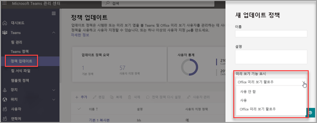

# <a name="microsoft-teams-public-preview"></a>Microsoft Teams 공개 미리 보기

> [!NOTE] 
> 미리 보기에 포함된 기능은 완전하지 않을 수 있으며, 일반에 정식으로 공개되기 전에 변경될 수 있습니다. 단지 평가 및 탐색 용도로만 제공됩니다. 미리 보기 기능은 Office 365 GCC(정부 커뮤니티 클라우드)에서 지원되지 않습니다.

Microsoft Teams의 공개 미리 보기는 Teams에서 릴리스되지 않은 기능에 대한 조기 액세스를 제공합니다. 미리 보기를 사용하여 예정된 기능을 탐색하고 테스트할 수 있습니다. 당사는 또한 공개 미리 보기의 모든 기능에 대한 피드백을 환영합니다. Teams 사용자별로 공개 미리 보기를 사용하도록 설정했으므로 전체 조직에 영향을 미칠 걱정을 할 필요가 없습니다.

Teams 미리 보기에서 사용할 수 있는 항목 목록은 [Microsoft Teams 공용 미리 보기 기술 노트](https://techcommunity.microsoft.com/t5/microsoft-teams-public-preview/bd-p/MicrosoftTeamsPublicPreview), [Teams 관리자 기능 릴리스 노트](/OfficeUpdates/teams-admin), [Teams 새로운 기능](https://support.microsoft.com/office/what-s-new-in-microsoft-teams-d7092a6d-c896-424c-b362-a472d5f105de)을 참조하세요.

## <a name="set-the-update-policy"></a>업데이트 정책 설정

공용 미리 보기는 사용자별로 사용 가능하며 공용 미리 보기 설정 옵션은 관리 정책에서 제어됩니다. 업데이트 정책은 Teams 앱의 시험판 또는 미리 보기 기능을 볼 수 있는 Teams 및 Office 미리 보기 사용자를 관리하는 데 사용됩니다. 전역(조직 전체의 기본) 정책을 사용하여 사용자 지정하거나 사용자에 대해 하나 이상의 사용자 지정 정책을 만들 수 있습니다.

1. [Microsoft Teams 관리 센터](https://admin.teams.microsoft.com/)에 로그인합니다.

2. **Teams** > **Teams 업데이트 정책** 을 선택합니다.

1. **추가** 를 선택하여 새 정책을 만들거나 기존 정책을 선택하여 **정책 업데이트** 를 엽니다.

2. 업데이트 정책 이름을 지정하고 설명을 추가하고 **미리 보기 기능 표시** 설정을 선택합니다.

   -   **Office 미리 보기 팔로우**(기본)
       - 이 새로운 기본 옵션은 Office 현재 채널(프리뷰)에 등록된 모든 사용자에 대해 Teams 공개 미리 보기 기능을 자동으로 활성화합니다. 
       - 최종 사용자에게 필요한 작업이 더 이상 없습니다.
   -   **사용**
       - 이 옵션을 사용하면 사용자가 Office 현재 채널(프리뷰)에 등록되었는지 여부에 관계없이 Teams 공개 미리 보기를 사용할 수 있습니다. 
       - 또한 최종 사용자는 Teams 앱에서 Teams 공개 미리 보기에 옵트인해야 합니다.

   > [!NOTE]  
   > **현재 채널(프리뷰)** 에 있지 않은 Teams 공개 미리 보기의 기존 사용자의 경우 IT 관리자는 기본에서 **Office 미리 보기 허용** 을 **사용** 으로 전환해야 합니다.
 
   - **사용 안 함** 
     - 최종 사용자는 Teams 공개 미리 보기 기능을 사용할 수 없습니다.

      

`-AllowPublicPreview` 매개 변수와 PowerShell `Set-CsTeamsUpdateManagementPolicy` cmdlet을 사용하여 정책을 설정할 수도 있습니다.

## <a name="enable-public-preview"></a>공개 미리 보기 사용

데스크톱 혹은 웹 클라이언트에서 공개 미리 보기를 사용하도록 설정하려면 다음 작업을 완료해야 합니다.

1. 프로필 왼쪽에 있는 세 개의 점을 선택하여 Teams 메뉴를 표시합니다.
2. **정보** > **공개 미리 보기** 를 선택합니다.
3. **개발자 미리 보기로 전환** 을 선택합니다.

> [!NOTE]  
> 이 옵션은 **미리 보기 기능 표시** 가 **사용** 으로 설정된 경우에만 사용할 수 있습니다.

### <a name="public-preview-for-microsoft-teams-rooms-on-windows"></a>Windows용 Microsoft Teams 룸에 대한 공개 미리 보기

공개 미리 보기는 기본적으로 꺼져 있습니다. 공개 미리 보기가 켜져 있으면 최종 사용자는 활성화된 Teams 룸에서 공개 미리 보기에 있는 기능에 액세스할 수 있습니다. 공개 미리 보기를 켜려면 XML 구성 파일에 ```<EnablePublicPreview>True</EnablePublicPreview>```을 추가하세요.

공개 미리 보기에 5-10개의 장치를 등록하는 것이 좋습니다. 

모든 공개 미리 보기 기능은 [Microsoft Teams 공개 미리 보기 - Microsoft 기술 커뮤니티](https://techcommunity.microsoft.com/t5/microsoft-teams-public-preview/bd-p/MicrosoftTeamsPublicPreview)에서 발표됩니다.

## <a name="teams-now-follows-office-preview-users"></a>이제 Teams가 Office 미리 보기 사용자를 허용합니다.

새 전역 정책 기본값인 **Office 미리 보기 팔로우** 를 사용하면 사용자가 Windows 및 Mac용 Office 365 클라이언트에 대한 현재 채널(프리뷰)에 있는 경우 Teams의 공개 미리 보기 채널에 자동으로 포함될 수 있습니다.

Microsoft Office에서 현재 채널(프리뷰)에서 업데이트를 계속 받고 Teams 클라이언트는 공개 미리 보기 채널을 통해 업데이트를 받습니다. 이 정책은 Teams 채널을 기반으로 Office 채널을 전환하지 않습니다. 

**Office 현재 채널(미리 보기)을 사용하지 않는 사용자는 어떻게 기존 Teams 미리 보기를 유지할 수 있나요?**

Teams 공개 미리 보기를 선택 또는 해제할 수 있으며 현재 양식에서 이 설정을 유지하려는 기존 사용자의 경우, 새로운 기본값인 **Office 미리 보기 허용** 에서 **사용** 으로 전환해야 합니다([업데이트 정책 설정](#set-the-update-policy) 참조).

**이 설정을 어떻게 옵트아웃해야 하나요?**

Teams 관리 센터에서 설정을 **Office 미리 보기 허용** 에서 **사용하지 않음**([업데이트 정책 설정](#set-the-update-policy) 참조)으로 설정할 수 있습니다.

## <a name="related-topics"></a>관련 항목

[공개 개발자 미리 보기](/microsoftteams/platform/resources/dev-preview/developer-preview-intro)
