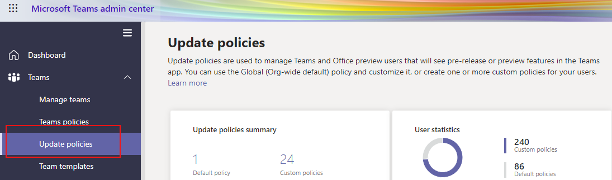

# Microsoft Teams 공개 미리 보기

> [!NOTE]
> 미리 보기에 포함된 기능은 완전하지 않을 수 있으며, 일반에 정식으로 공개되기 전에 변경될 수 있습니다. 단지 평가 및 탐색 용도로만 제공됩니다.

Microsoft Teams의 공개 미리 보기는 Teams에서 릴리스되지 않은 기능에 대한 조기 액세스를 제공합니다. 미리 보기를 사용하여 예정된 기능을 탐색하고 테스트할 수 있습니다. 당사는 또한 공개 미리 보기의 모든 기능에 대한 피드백을 환영합니다. 모든 Teams 사용자에 대해 공개 미리 보기를 사용하도록 설정했으므로 전체 조직에 영향을 미칠 걱정을 할 필요가 없습니다.

## 업데이트 정책 설정

 각 사용자에 대해 공개 미리 보기를 사용하도록 설정하였고 공개 미리 보기를 설정하는 옵션은 관리자 정책에서 제어합니다. 업데이트 정책은 Teams 앱의 시험판 또는 미리 보기 기능을 볼 수 있는 Teams 및 Office 미리 보기 사용자를 관리하는 데 사용됩니다. 전역(전제 조직의 기본) 정책을 사용하여 사용자 지정하거나 사용자에게 하나 이상의 사용자 지정 정책을 만들 수 있습니다.

1. 관리 센터에 로그인합니다.
2. **Teams**>**업데이트 정책** 을 선택합니다.

   

3. **추가** 를 선택합니다.
4. 업데이트 정책에 이름을 지정하고, 설명을 추가하고, **미리 보기 기능 표시** 를 설정합니다.

## 공개 미리 보기 사용

데스크톱 혹은 웹 클라이언트에서 공개 미리 보기를 사용하도록 설정하려면 다음 작업을 수행해야 합니다.

1. 프로필을 선택하여 Teams 메뉴를 표시합니다.
2. **정보** → **개발자 미리 보기** 를 선택합니다.
3. **개발자 미리 보기로 전환** 을 선택합니다.

## 관련 항목

[공개 개발자 미리 보기](https://docs.microsoft.com/microsoftteams/platform/resources/dev-preview/developer-preview-intro)
