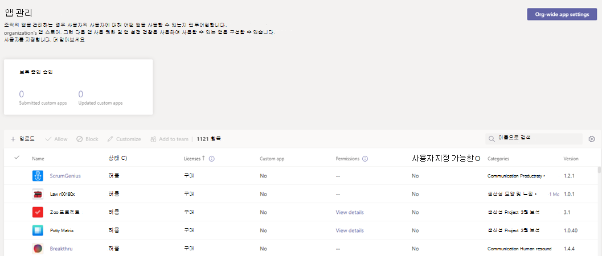

# Teams용 타사 앱 구매

Teams 앱은 무료로 설치할 수 있으며 일부는 앱의 전체 기능 및 범위를 경험하기 위해 서비스 구독을 구매해야 할 수 있습니다. 이러한 서비스 구독을 SaaS(Software as a Service) 제품이라고 하며, [AppSource](https://appsource.microsoft.com/) 를 통해 지금 [Microsoft Teams 관리 센터를](https://admin.teams.microsoft.com) 통해 구매할 수 있습니다.

Microsoft Teams 관리 센터의 [앱 관리](manage-apps.md) 페이지는 조직의 모든 Teams 앱을 보고 관리하는 위치입니다. 예를 들어 앱의 조직 수준 상태 및 속성을 확인하고, 조직의 앱 스토어에 새 사용자 지정 앱을 업로드하고, 조직 수준에서 앱을 차단 또는 허용하고, 조직 전체 앱 설정을 관리할 수 있습니다.

여기서는 조직의 사용자를 위해 타사 앱에서 제공하는 서비스에 대한 라이선스를 구매할 수도 있습니다. 테이블의 **라이선스** 열은 앱이 구매를 위해 SaaS 구독을 제공하는지 여부를 나타냅니다.

## Teams 관리 센터에서 앱 구매

> [!IMPORTANT]
> 앱 구매를 사용하도록 설정하면 앱 내 구매도 켜집니다. 사용자는 앱에 대해 ISV에서 제어하는 앱 내 구매 제품을 볼 수 있습니다. 사용자가 앱을 구매하지 못하도록 차단하려면 앱을 차단해야 합니다. 앱을 차단하는 방법에 대한 자세한 내용은 [앱 정책 관리를](app-policies.md) [참조하거나 조직 수준에서 앱을 차단하는 방법을 알아보세요](manage-apps.md#allow-and-block-apps).

1. Microsoft Teams 관리 센터의 왼쪽 창에서 **Teams 앱****[관리 앱](https://admin.teams.microsoft.com/policies/manage-apps)** > 으로 이동합니다. 페이지에 액세스하려면 전역 관리자 또는 Teams 서비스 관리자여야 합니다.

1. 이름으로 원하는 앱을 검색합니다. 유료 SaaS 구독이 있는 앱을 식별하려면 라이선스 열을 확인 **합니다** . 각 앱에는 다음 값 중 하나가 있습니다.
    * **구매**: 앱은 SaaS 구독을 제공하며 구매할 수 있습니다.  
    * **구매:** 앱은 SaaS 구독을 제공하고 라이선스를 구입했습니다.
    * **- -**: 앱에서 SaaS 구독을 제공하지 않습니다.

1. 앱을 찾으면 **구매** 를 선택하여 앱 세부 정보 페이지의 **계획 및 가격 책정** 탭으로 이동합니다. 앱에 대한 SaaS 제품에 대한 계획 및 가격 정보를 검토합니다. 자세한 정보가 필요한 경우 **자세히 알아보** 기를 선택하여 [AppSource](https://appsource.microsoft.com/)에서 앱 페이지로 이동합니다.

   > [!NOTE]
   > 개인 플랜은 조직이 이전에 ISV와 협상한 특별 가격 책정을 포함하는 구매를 위해 나열될 수도 있습니다. 이러한 계획에는 플랜 이름 아래에 **프라이빗 플랜** 이라는 레이블이 있습니다.

1. 앱을 구독하려면 원하는 플랜을 선택하고 **구매** 를 선택합니다. 체크 아웃 흐름은 Teams 관리 센터에서 직접 열립니다.

1. 구입하려는 사용자 라이선스 수를 선택합니다.

1. 청구 계정 및 판매 대상 주소가 올바른지 확인합니다. 아직 없는 경우 **추가** 를 선택합니다. 청구 계정에 대한 자세한 내용은 [청구 계정 이해를 참조하세요](/microsoft-365/commerce/manage-billing-accounts).

   > [!NOTE]
   > 전역 관리 새 청구 계정을 추가할 수 있습니다.

1. 올바른 청구 프로필이 선택되어 있는지 확인합니다. 아직 없는 경우 **새로 추가** 를 선택합니다. 신용 카드, 직불 카드 또는 [송장 청구](#invoice-billing)로 결제할 수 있습니다. 또한 청구 프로필을 사용하면 구매 주문 번호를 추가하여 나중에 주문을 식별할 수 있습니다. 청구 프로필에 대한 자세한 내용은 [청구 프로필 이해를 참조하세요](/microsoft-365/commerce/billing-and-payments/manage-billing-profiles).

1. **순서를** 선택합니다.

1. 게시자 웹 사이트에서 구독을 활성화하려면 **[설정** ]을 선택합니다. 구매 후 구독을 설정하지 않은 경우 나중에 **라이선스 관리를** 선택하여 구독을 설정할 수 있습니다.

Teams 앱과 연결된 SaaS 제품을 구매한 후에는 앱 세부 정보 페이지의 **계획 및 가격 책정** 탭에서 다음 구매 세부 정보를 볼 수 있습니다.

* **라이선스 활성화 날짜**: 라이선스가 활성화된 날짜입니다. 계정이 아직 설정되지 않은 경우 **활성화 보류 중인 구독** 으로 표시됩니다.
* **라이선스**: 구매한 라이선스 수입니다.

:::image type="content" source="media/purchase-third-party-apps-details-page.png" alt-text="Teams 관리 센터의 앱 세부 정보 페이지에 있는 계획 및 가격 책정 탭의 스크린샷.":::

구매한 라이선스를 보고 관리하려면 **라이선스 관리를** 선택하여 Microsoft 365 관리 센터 액세스합니다.

전역 관리자는 더 많은 라이선스를 추가하고, 라이선스를 제거하고, 조직의 모든 사용자가 구매한 구독을 취소할 수 있습니다. Teams 서비스 관리자는 자체 구매에 대해 동일한 작업을 수행할 수 있습니다. 그러나 Teams 서비스 관리자에게 청구 관리자 역할도 있는 경우 조직의 모든 사용자가 구매한 내용을 관리할 수 있습니다.

> [!NOTE]
> Global 관리 다른 Global 관리 구매한 구독을 관리하려는 경우 동일한 청구 계정에 있어야 합니다. Microsoft 365 관리 센터 앱을 선택하여 구매한 구독에 대한 다른 Global [관리](https://admin.microsoft.com) 액세스 권한을 부여할 수 있습니다. 여기에서 **청구 프로필** >  보기로 이동하여 **청구 계정** > **할당 역할** > **다른 전역 관리자를 추가합니다**.

### 청구서 청구

* 청구서 청구는 일부 트랜잭션에 대한 결제 옵션으로 사용할 수 있습니다.
* 청구서 청구를 처음 사용할 때 신용 검토가 필요하며 승인에는 최대 24~48시간이 걸릴 수 있습니다. 신용 검사가 완료될 때까지 청구서 청구를 사용할 수 없습니다. 신용 카드로 주문을 하거나 나중에 신용 검토가 승인된 후 다시 시도할 수 있습니다.
* 청구서 청구는 전역 관리자 또는 Teams 서비스 관리자 및 청구 관리자 권한이 있는 관리자만 사용할 수 있습니다.
* 30일 무료 평가판으로 플랜을 구매하는 경우에는 청구서 청구를 사용할 수 없습니다.

## Teams 앱에 대한 SaaS 제품 나열 및 판매

개발자는 Teams 앱과 연결된 SaaS 제품을 만들 수 있습니다. 이러한 제품은 [파트너 센터를](https://partner.microsoft.com) 통해 게시되며 조직에서 [AppSource](https://appsource.microsoft.com/) 및 Microsoft Teams 관리 센터를 통해 구매할 수 있습니다.

타사 앱 개발자에 대한 자세한 내용은 [SaaS 제품 만들기를](/azure/marketplace/partner-center-portal/create-new-saas-offer) 참조하세요.

## 관련 기사

* [Microsoft Teams 관리 센터에서 앱 관리](manage-apps.md)
* [SaaS 제품 만들기](/azure/marketplace/partner-center-portal/create-new-saas-offer)
* [Azure Active Directory 기본 제공 역할](/azure/active-directory/roles/permissions-reference)
* [Microsoft 365 관리자 역할](/microsoft-365/admin/add-users/about-admin-roles)
