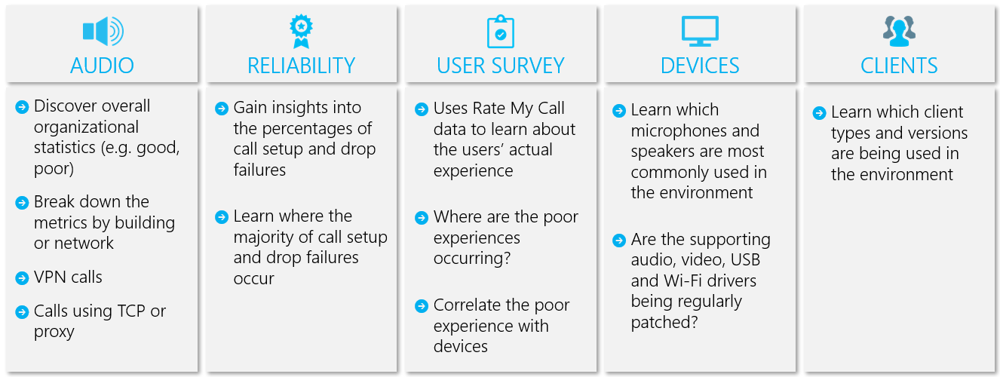
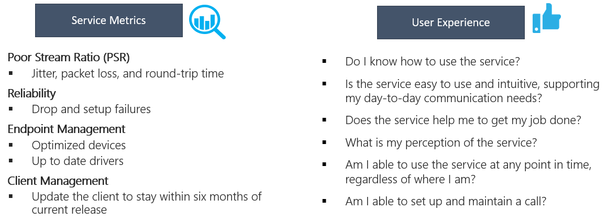
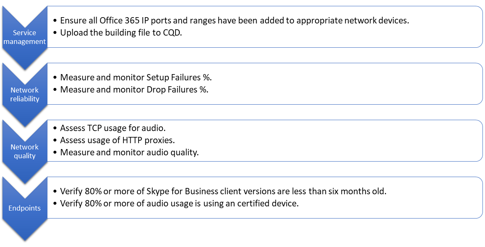
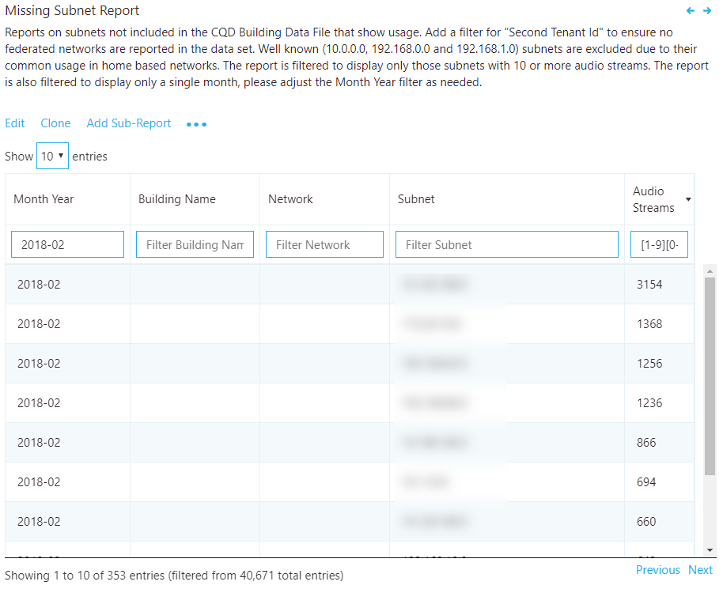
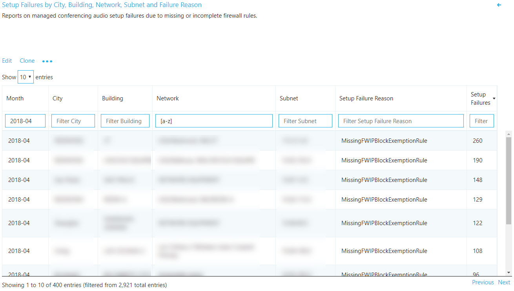
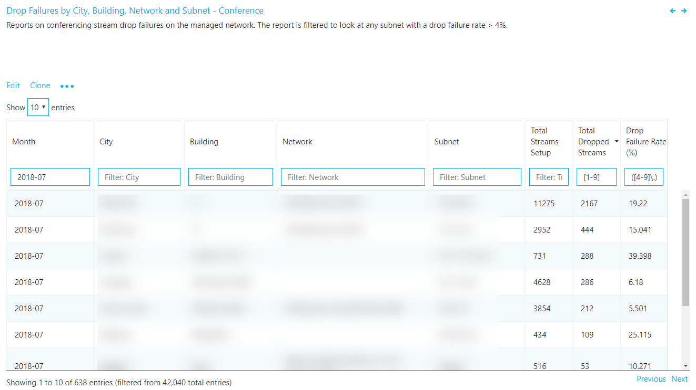
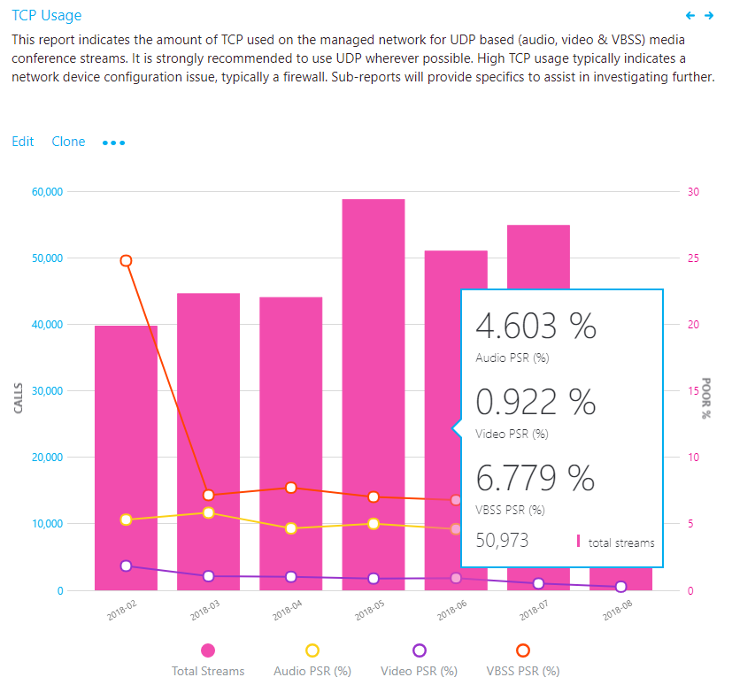

# <a name="quality-of-experience-review-guide"></a><span data-ttu-id="e1cd2-103">QoE(체감 품질) 검토 가이드</span><span class="sxs-lookup"><span data-stu-id="e1cd2-103">Quality of Experience Review Guide</span></span>

<!-- Note that this link to the Word doc is intentionally NOT the aka.ms/qerquide link -->
<span data-ttu-id="e1cd2-104">이 가이드는 Microsoft 팀과 비즈니스용 Skype Online의 드라이브 가치 단계에 대해 설명 합니다.</span><span class="sxs-lookup"><span data-stu-id="e1cd2-104">This guide is about the Drive Value phase for Microsoft Teams and Skype for Business Online.</span></span> <span data-ttu-id="e1cd2-105">이 가이드의 [Word 버전을 다운로드할](https://github.com/MicrosoftDocs/OfficeDocs-SkypeForBusiness/blob/live/Teams/downloads/quality-of-experience-review-guide.docx?raw=true) 수 있습니다.</span><span class="sxs-lookup"><span data-stu-id="e1cd2-105">You can [download a Word version](https://github.com/MicrosoftDocs/OfficeDocs-SkypeForBusiness/blob/live/Teams/downloads/quality-of-experience-review-guide.docx?raw=true) of this guide.</span></span>

## <a name="introduction"></a><span data-ttu-id="e1cd2-106">소개</span><span class="sxs-lookup"><span data-stu-id="e1cd2-106">Introduction</span></span>

<span data-ttu-id="e1cd2-107">사용자 환경을 개선 하는 데 가장 큰 영향을 operationalize 조직은 다음 그림에 나와 있는 주요 영역을 사용 해야 합니다.</span><span class="sxs-lookup"><span data-stu-id="e1cd2-107">To have the greatest impact on improving the user experience, organizations need to operationalize the key areas that are shown in the following figure.</span></span> <span data-ttu-id="e1cd2-108">추가 영역에는 운영 작업 식별, 품질 메트릭의 목표 지정, 조직 성공을 측정 하는 데 사용할 ascertaining, 필요한 경우 조사 영역 축소 등이 포함 됩니다.</span><span class="sxs-lookup"><span data-stu-id="e1cd2-108">Additional areas include identifying operational tasks, establishing targets for quality metrics, ascertaining the metrics to use to gauge organizational success, and narrowing areas of investigation as needed.</span></span>


<span data-ttu-id="e1cd2-109"></span><span class="sxs-lookup"><span data-stu-id="e1cd2-109"></span></span>

<span data-ttu-id="e1cd2-110">_그림 1-이 가이드 전체에서 다룬 주요 작업 영역_</span><span class="sxs-lookup"><span data-stu-id="e1cd2-110">_Figure 1 - Key operational areas covered throughout this guide_</span></span>

<span data-ttu-id="e1cd2-111">이 가이드에서 설명 하는 영역을 지속적으로 평가 하 고 수정 사용자 환경의 품질에 부정적인 영향을 줄 수 있습니다.</span><span class="sxs-lookup"><span data-stu-id="e1cd2-111">By continually assessing and remediating the areas described in this guide, you can reduce their potential to negatively affect the quality of your users’ experience.</span></span> <span data-ttu-id="e1cd2-112">배포에서 발생 하는 대부분의 사용자 경험 문제는 다음 범주로 그룹화 할 수 있습니다.</span><span class="sxs-lookup"><span data-stu-id="e1cd2-112">Most user-experience problems encountered in a deployment can be grouped into the following categories:</span></span>

-   <span data-ttu-id="e1cd2-113">방화벽 또는 프록시 구성이 완료 되지 않음</span><span class="sxs-lookup"><span data-stu-id="e1cd2-113">Incomplete firewall or proxy configuration</span></span>
-   <span data-ttu-id="e1cd2-114">불량 Wi-fi 서비스</span><span class="sxs-lookup"><span data-stu-id="e1cd2-114">Poor Wi-Fi coverage</span></span>
-   <span data-ttu-id="e1cd2-115">대역폭 부족</span><span class="sxs-lookup"><span data-stu-id="e1cd2-115">Insufficient bandwidth</span></span>
-   <span data-ttu-id="e1cd2-116">VPN</span><span class="sxs-lookup"><span data-stu-id="e1cd2-116">VPN</span></span>
-   <span data-ttu-id="e1cd2-117">일관성 없거나 오래 된 클라이언트 버전 및 드라이버</span><span class="sxs-lookup"><span data-stu-id="e1cd2-117">Inconsistent or outdated client versions and drivers</span></span>
-   <span data-ttu-id="e1cd2-118">최적화 되지 않음 또는 내장 오디오 장치</span><span class="sxs-lookup"><span data-stu-id="e1cd2-118">Unoptimized or built-in audio devices</span></span>
-   <span data-ttu-id="e1cd2-119">문제가 있는 서브넷 또는 네트워크 장치</span><span class="sxs-lookup"><span data-stu-id="e1cd2-119">Problematic subnets or network devices</span></span>

<span data-ttu-id="e1cd2-120">팀 또는 비즈니스용 Skype Online을 배포 하기 전에 적절 한 계획과 디자인을 통해 고품질 환경을 유지 하는 데 필요한 작업량을 줄일 수 있습니다.</span><span class="sxs-lookup"><span data-stu-id="e1cd2-120">Through proper planning and design before deploying Teams or Skype for Business Online, you can reduce the amount of effort that will be required to maintain high-quality experiences.</span></span>

<span data-ttu-id="e1cd2-121">이 가이드에서는 사용자의 각 영역을 보고 하 고 조사 하는 기본 도구로 서 CQD (통화 품질 대시보드)를 온라인으로 사용 하는 데 초점을 두어, 채택 및 영향을 최대화 하기 위해 오디오를 강조 합니다.</span><span class="sxs-lookup"><span data-stu-id="e1cd2-121">This guide focuses on using the Call Quality Dashboard (CQD) Online as the primary tool to report and investigate each area, with a special emphasis on audio to maximize adoption and impact.</span></span> <span data-ttu-id="e1cd2-122">오디오 환경을 개선 하기 위해 네트워크에 대 한 개선 사항은 비디오 및 데스크톱 공유의 향상 된 기능으로 직접 번역 될 수 있습니다.</span><span class="sxs-lookup"><span data-stu-id="e1cd2-122">Any improvements made to the network to improve the audio experience will also directly translate to improvements in video and desktop sharing.</span></span>

<span data-ttu-id="e1cd2-123">평가의 속도를 높이려면 모든 네트워크를 관리 하는 방법과 다른 하나는 관리 되는 (내부) 네트워크용으로 필터링 된 [두 개의 큐 레이 팅 CQD 템플릿을](https://aka.ms/qertemplates) 제공 합니다.</span><span class="sxs-lookup"><span data-stu-id="e1cd2-123">To accelerate your assessment, [two curated CQD templates](https://aka.ms/qertemplates) are provided: one is for managing all networks and the other is filtered for managed (internal) networks only.</span></span> <span data-ttu-id="e1cd2-124">모든 네트워크 템플릿 보고서는 빌드 및 네트워크 정보를 표시 하도록 구성 되지만, 빌드 정보를 수집 하 고 업로드 하는 동안에도 계속 사용할 수 있습니다.</span><span class="sxs-lookup"><span data-stu-id="e1cd2-124">Although the All Networks template reports are configured to display building and network information, they can still be used while you work toward collecting and uploading building information.</span></span> <span data-ttu-id="e1cd2-125">CQD에 빌드 정보를 업로드 하면 외부 서브넷에서 내부를 구분 하는 동안 사용자 지정 빌드, 네트워크 및 위치 정보를 추가 하 여 해당 서비스에서 보고 기능을 향상 시킬 수 있습니다.</span><span class="sxs-lookup"><span data-stu-id="e1cd2-125">Uploading building information into CQD enables the service to enhance reporting by adding custom building, network, and location information while differentiating internal from external subnets.</span></span> <span data-ttu-id="e1cd2-126">자세한 내용은이 가이드의 뒷부분에 있는 [매핑 빌드](#building-mapping) 를 참조 하세요.</span><span class="sxs-lookup"><span data-stu-id="e1cd2-126">For more information, see [Building mapping](#building-mapping) later in this guide.</span></span>

### <a name="intended-audience"></a><span data-ttu-id="e1cd2-127">대상 청중</span><span class="sxs-lookup"><span data-stu-id="e1cd2-127">Intended audience</span></span>

<span data-ttu-id="e1cd2-128">이 가이드는 협력 책임자/설계자, 컨설턴트, 변경 관리/채택 전문가, 지원/지원 센터 리더, 네트워크 리드, 데스크톱 리더, IT 관리자 등의 역할을 담당 하는 파트너 및 고객 관련자 들이 사용 합니다.</span><span class="sxs-lookup"><span data-stu-id="e1cd2-128">This guide is intended to be used by partner and customer stakeholders with roles such as Collaboration Lead/Architect, Consultant, Change Management/Adoption Specialist, Support/Help Desk Lead, Network Lead, Desktop Lead, and IT Admin.</span></span>

<span data-ttu-id="e1cd2-129">이 가이드는 지정 된 품질 챔피언에도 사용 됩니다.</span><span class="sxs-lookup"><span data-stu-id="e1cd2-129">This guide is also intended to be used by the designated quality champion(s).</span></span> <span data-ttu-id="e1cd2-130">자세한 내용은 [품질 챔피언 역할](4-envision-plan-my-service-management.md#the-quality-champion-role)을 참조 하세요.</span><span class="sxs-lookup"><span data-stu-id="e1cd2-130">For more information, see [the Quality Champion role](4-envision-plan-my-service-management.md#the-quality-champion-role).</span></span>

## <a name="assign-roles-for-accessing-cqd"></a><span data-ttu-id="e1cd2-131">CQD에 액세스 하기 위한 역할 할당</span><span class="sxs-lookup"><span data-stu-id="e1cd2-131">Assign roles for accessing CQD</span></span>

<span data-ttu-id="e1cd2-132">이 가이드를 사용 하기 전에 CQD에 액세스할 수 있도록 적절 한 테 넌 트 [역할이](https://docs.microsoft.com/office365/admin/add-users/about-admin-roles) 할당 되어 있는지 확인 합니다.</span><span class="sxs-lookup"><span data-stu-id="e1cd2-132">Before using this guide, make sure you have the proper tenant [roles](https://docs.microsoft.com/office365/admin/add-users/about-admin-roles) assigned so that you can access CQD.</span></span>

<span data-ttu-id="e1cd2-133">다음 표에서는 각 역할이 CQD에서 수행할 수 있는 작업을 보여 줍니다.</span><span class="sxs-lookup"><span data-stu-id="e1cd2-133">This table shows you what each role can do in CQD:</span></span>


|  |<span data-ttu-id="e1cd2-134">보고서 보기</span><span class="sxs-lookup"><span data-stu-id="e1cd2-134">View reports</span></span>  |<span data-ttu-id="e1cd2-135">EUII 필드 보기</span><span class="sxs-lookup"><span data-stu-id="e1cd2-135">View EUII fields</span></span>  |<span data-ttu-id="e1cd2-136">보고서 만들기</span><span class="sxs-lookup"><span data-stu-id="e1cd2-136">Create reports</span></span>  |<span data-ttu-id="e1cd2-137">빌드 데이터 업로드</span><span class="sxs-lookup"><span data-stu-id="e1cd2-137">Upload building data</span></span>  |
|---------|:-------:|:-------:|:-------:|:-------:|
|<span data-ttu-id="e1cd2-138">Office 365 전역 관리자</span><span class="sxs-lookup"><span data-stu-id="e1cd2-138">Office 365 Global Administrator</span></span>     |<span data-ttu-id="e1cd2-139">예</span><span class="sxs-lookup"><span data-stu-id="e1cd2-139">Yes</span></span>         |<span data-ttu-id="e1cd2-140">예</span><span class="sxs-lookup"><span data-stu-id="e1cd2-140">Yes</span></span>         |<span data-ttu-id="e1cd2-141">예</span><span class="sxs-lookup"><span data-stu-id="e1cd2-141">Yes</span></span>         |<span data-ttu-id="e1cd2-142">예</span><span class="sxs-lookup"><span data-stu-id="e1cd2-142">Yes</span></span>         |
|<span data-ttu-id="e1cd2-143">Teams 서비스 관리자</span><span class="sxs-lookup"><span data-stu-id="e1cd2-143">Teams Service Administrator</span></span>     |<span data-ttu-id="e1cd2-144">예</span><span class="sxs-lookup"><span data-stu-id="e1cd2-144">Yes</span></span>         |<span data-ttu-id="e1cd2-145">예</span><span class="sxs-lookup"><span data-stu-id="e1cd2-145">Yes</span></span>         |<span data-ttu-id="e1cd2-146">예</span><span class="sxs-lookup"><span data-stu-id="e1cd2-146">Yes</span></span>         |<span data-ttu-id="e1cd2-147">예</span><span class="sxs-lookup"><span data-stu-id="e1cd2-147">Yes</span></span>         |
|<span data-ttu-id="e1cd2-148">Teams 커뮤니케이션 관리자</span><span class="sxs-lookup"><span data-stu-id="e1cd2-148">Teams Communications Administrator</span></span>     |<span data-ttu-id="e1cd2-149">예</span><span class="sxs-lookup"><span data-stu-id="e1cd2-149">Yes</span></span>         |<span data-ttu-id="e1cd2-150">예</span><span class="sxs-lookup"><span data-stu-id="e1cd2-150">Yes</span></span>         |<span data-ttu-id="e1cd2-151">예</span><span class="sxs-lookup"><span data-stu-id="e1cd2-151">Yes</span></span>         |<span data-ttu-id="e1cd2-152">예</span><span class="sxs-lookup"><span data-stu-id="e1cd2-152">Yes</span></span>         |
|<span data-ttu-id="e1cd2-153">Teams 커뮤니케이션 지원 엔지니어</span><span class="sxs-lookup"><span data-stu-id="e1cd2-153">Teams Communications Support Engineer</span></span>     |<span data-ttu-id="e1cd2-154">예</span><span class="sxs-lookup"><span data-stu-id="e1cd2-154">Yes</span></span>         |<span data-ttu-id="e1cd2-155">예</span><span class="sxs-lookup"><span data-stu-id="e1cd2-155">Yes</span></span>         |<span data-ttu-id="e1cd2-156">예</span><span class="sxs-lookup"><span data-stu-id="e1cd2-156">Yes</span></span>         |<span data-ttu-id="e1cd2-157">아니요</span><span class="sxs-lookup"><span data-stu-id="e1cd2-157">No</span></span>         |
|<span data-ttu-id="e1cd2-158">팀 의사 소통 지원 전문가</span><span class="sxs-lookup"><span data-stu-id="e1cd2-158">Teams Communications Support Specialist</span></span>     |<span data-ttu-id="e1cd2-159">예</span><span class="sxs-lookup"><span data-stu-id="e1cd2-159">Yes</span></span>         |<span data-ttu-id="e1cd2-160">아니요</span><span class="sxs-lookup"><span data-stu-id="e1cd2-160">No</span></span>         |<span data-ttu-id="e1cd2-161">예</span><span class="sxs-lookup"><span data-stu-id="e1cd2-161">Yes</span></span>         |<span data-ttu-id="e1cd2-162">아니요</span><span class="sxs-lookup"><span data-stu-id="e1cd2-162">No</span></span>         |
|<span data-ttu-id="e1cd2-163">비즈니스용 Skype 관리자</span><span class="sxs-lookup"><span data-stu-id="e1cd2-163">Skype for Business Administrator</span></span>     |<span data-ttu-id="e1cd2-164">예</span><span class="sxs-lookup"><span data-stu-id="e1cd2-164">Yes</span></span>         |<span data-ttu-id="e1cd2-165">예</span><span class="sxs-lookup"><span data-stu-id="e1cd2-165">Yes</span></span>         |<span data-ttu-id="e1cd2-166">예</span><span class="sxs-lookup"><span data-stu-id="e1cd2-166">Yes</span></span>         |<span data-ttu-id="e1cd2-167">예</span><span class="sxs-lookup"><span data-stu-id="e1cd2-167">Yes</span></span>         |
|<span data-ttu-id="e1cd2-168">Azure AD 전역 읽기 프로그램</span><span class="sxs-lookup"><span data-stu-id="e1cd2-168">Azure AD Global Reader</span></span> |<span data-ttu-id="e1cd2-169">예</span><span class="sxs-lookup"><span data-stu-id="e1cd2-169">Yes</span></span>         |<span data-ttu-id="e1cd2-170">예</span><span class="sxs-lookup"><span data-stu-id="e1cd2-170">Yes</span></span>         |<span data-ttu-id="e1cd2-171">예</span><span class="sxs-lookup"><span data-stu-id="e1cd2-171">Yes</span></span>         |<span data-ttu-id="e1cd2-172">아니요</span><span class="sxs-lookup"><span data-stu-id="e1cd2-172">No</span></span>         |
|<span data-ttu-id="e1cd2-173">Office 365 보고서 리더기<sup>1</sup></span><span class="sxs-lookup"><span data-stu-id="e1cd2-173">Office 365 Reports Reader<sup>1</sup></span></span>     |<span data-ttu-id="e1cd2-174">예</span><span class="sxs-lookup"><span data-stu-id="e1cd2-174">Yes</span></span>         |<span data-ttu-id="e1cd2-175">아니요</span><span class="sxs-lookup"><span data-stu-id="e1cd2-175">No</span></span>         |<span data-ttu-id="e1cd2-176">예</span><span class="sxs-lookup"><span data-stu-id="e1cd2-176">Yes</span></span>         |<span data-ttu-id="e1cd2-177">아니요</span><span class="sxs-lookup"><span data-stu-id="e1cd2-177">No</span></span>         |

<span data-ttu-id="e1cd2-178"><sup>1</sup> CQD 보고서 읽기 외에도, Office 365 보고서 구독자는 관리 센터의 모든 [활동 보고서](https://support.office.com/article/activity-reports-0d6dfb17-8582-4172-a9a9-aed798150263) 와 [Microsoft 365 채택 콘텐츠 팩](https://support.office.com/article/Office-365-Adoption-content-pack-77ff780d-ab19-4553-adea-09cb65ad0f1f)의 모든 보고서를 볼 수 있습니다.</span><span class="sxs-lookup"><span data-stu-id="e1cd2-178"><sup>1</sup> In addition to reading CQD reports, the Office 365 Reports Reader can view all the [activity reports](https://support.office.com/article/activity-reports-0d6dfb17-8582-4172-a9a9-aed798150263) in the admin center and any reports from the [Microsoft 365 Adoption content pack](https://support.office.com/article/Office-365-Adoption-content-pack-77ff780d-ab19-4553-adea-09cb65ad0f1f).</span></span>

> [!NOTE]
> <span data-ttu-id="e1cd2-179">EUII (최종 사용자 식별 가능 정보)가 표시 되지 않고 이러한 정보를 볼 수 있는 역할 중 하나가 있는 경우 CQD는 30 일간 EUII을 유지 한다는 점에 유의 하세요.</span><span class="sxs-lookup"><span data-stu-id="e1cd2-179">If you're not seeing EUII (end-user identifiable information) and you have one of the roles that's permitted to see this information, keep in mind that CQD only keeps EUII for 30 days.</span></span> <span data-ttu-id="e1cd2-180">30 일이 지난 모든 항목이 삭제 됩니다.</span><span class="sxs-lookup"><span data-stu-id="e1cd2-180">Anything older than 30 days is deleted.</span></span>

## <a name="what-is-quality"></a><span data-ttu-id="e1cd2-181">품질 이란?</span><span class="sxs-lookup"><span data-stu-id="e1cd2-181">What is quality?</span></span>

<span data-ttu-id="e1cd2-182">팀과 비즈니스용 Skype의 품질을 논의할 때 일반적인 개념을 달성 하는 용어를 정의 하는 것이 중요 합니다.</span><span class="sxs-lookup"><span data-stu-id="e1cd2-182">When discussing quality in Teams and Skype for Business, it’s important to define the term to achieve a common understanding.</span></span> <span data-ttu-id="e1cd2-183">여기에 정의 된 대로 품질은 서비스 메트릭과 사용자 환경의 조합입니다.</span><span class="sxs-lookup"><span data-stu-id="e1cd2-183">Quality, as defined here, is a combination of service metrics and user experience.</span></span>

<!-- Note: need to update graphic-->
<span data-ttu-id="e1cd2-184"></span><span class="sxs-lookup"><span data-stu-id="e1cd2-184"></span></span>

<span data-ttu-id="e1cd2-185">_그림 2-품질 이란?_</span><span class="sxs-lookup"><span data-stu-id="e1cd2-185">_Figure 2 - What is quality?_</span></span>

### <a name="service-metrics"></a><span data-ttu-id="e1cd2-186">서비스 메트릭</span><span class="sxs-lookup"><span data-stu-id="e1cd2-186">Service metrics</span></span>

<span data-ttu-id="e1cd2-187">서비스 메트릭은 특정 클라이언트 기반 메트릭으로 구성 됩니다.</span><span class="sxs-lookup"><span data-stu-id="e1cd2-187">Service metrics consist of specific client-based metrics.</span></span> <span data-ttu-id="e1cd2-188">각 호출 동안 클라이언트는 호출에 대 한 원격 분석 정보를 수집 하 고, 나중에 CQD 또는 [Call 분석](https://techcommunity.microsoft.com/t5/Skype-for-Business-Blog/Introducing-Call-Analytics/ba-p/57309)을 통해 액세스할 수 있는 각 호출이 끝날 때 보고서를 제출 합니다.</span><span class="sxs-lookup"><span data-stu-id="e1cd2-188">During each call, the client collects telemetry information about the call and submits a report at the end of each call that can be later accessed through CQD or [Call Analytics](https://techcommunity.microsoft.com/t5/Skype-for-Business-Blog/Introducing-Call-Analytics/ba-p/57309).</span></span> <span data-ttu-id="e1cd2-189">이러한 메트릭은 다음과 같습니다.</span><span class="sxs-lookup"><span data-stu-id="e1cd2-189">These metrics include:</span></span>

-   <span data-ttu-id="e1cd2-190">불량 스트림 속도</span><span class="sxs-lookup"><span data-stu-id="e1cd2-190">Poor Stream Rate</span></span>
-   <span data-ttu-id="e1cd2-191">설치 실패 비율</span><span class="sxs-lookup"><span data-stu-id="e1cd2-191">Setup Failure Rate</span></span>
-   <span data-ttu-id="e1cd2-192">실패 율의 낙하</span><span class="sxs-lookup"><span data-stu-id="e1cd2-192">Drop Failure Rate</span></span>


#### <a name="poor-stream-rate"></a><span data-ttu-id="e1cd2-193">불량 스트림 속도</span><span class="sxs-lookup"><span data-stu-id="e1cd2-193">Poor Stream Rate</span></span>

<span data-ttu-id="e1cd2-194">PSR (불량 스트림 속도)은 품질이 좋지 않은 조직의 전반적인 스트림 백분율을 나타냅니다.</span><span class="sxs-lookup"><span data-stu-id="e1cd2-194">The poor stream rate (PSR) represents the organization’s overall percentage of streams that have poor quality.</span></span> <span data-ttu-id="e1cd2-195">이 메트릭은이 값을 줄이고 사용자 환경을 개선 하는 데 가장 큰 영향을 줄 수 있는 영역을 강조 표시 하는 데 사용 되며,이 경우 PSR을 볼 때 [관리 네트워크가](#managed-vs-unmanaged-networks) 기본 포커스가 됩니다.</span><span class="sxs-lookup"><span data-stu-id="e1cd2-195">This metric is meant to highlight areas where your organization can concentrate effort to have the strongest impact toward reducing this value and improving the user experience, which is why [managed networks](#managed-vs-unmanaged-networks) are the primary focus when looking at PSR.</span></span> <span data-ttu-id="e1cd2-196">외부 사용자도 중요 하지만 조사가 조직의 기준에 따라 달라 집니다.</span><span class="sxs-lookup"><span data-stu-id="e1cd2-196">External users are important too, but investigation differs on an organizational basis.</span></span> <span data-ttu-id="e1cd2-197">외부 사용자에 게 모범 사례를 제공 하 고 전체 조직과 관계 없이 외부 통화를 조사 하는 것이 좋습니다.</span><span class="sxs-lookup"><span data-stu-id="e1cd2-197">Consider providing best practices for external users, and investigate external calls independently from the overall organization.</span></span>

<span data-ttu-id="e1cd2-198">CQD의 실제 측정은 작업 부하에 따라 다르지만, 품질 경험 검토의 목적으로 주로 _오디오 불량 백분율_ 측정에 초점을 두고 있습니다.</span><span class="sxs-lookup"><span data-stu-id="e1cd2-198">The actual measurement in CQD varies by workload, but for the purposes of the Quality Experience Review we focus primarily on the _Audio Poor Percentage_ measurement.</span></span> <span data-ttu-id="e1cd2-199">PSR은 다음 표에 설명 된 다섯 가지 네트워크 메트릭 평균값으로 구성 됩니다.</span><span class="sxs-lookup"><span data-stu-id="e1cd2-199">PSR is made up of the five network metric averages described in the following table.</span></span> <span data-ttu-id="e1cd2-200">스트림이 불량으로 분류 되는 경우 한 메트릭으로 정의 된 임계값을 초과 해야 합니다.</span><span class="sxs-lookup"><span data-stu-id="e1cd2-200">For a stream to be classified as poor, only one metric needs to exceed the defined threshold.</span></span> <span data-ttu-id="e1cd2-201">스트림 분류 프로세스에 대 한 자세한 내용은 [이 문서](stream-classification-in-call-quality-dashboard.md)를 참조 하세요.</span><span class="sxs-lookup"><span data-stu-id="e1cd2-201">For more information about the stream classification process, see [this article](stream-classification-in-call-quality-dashboard.md).</span></span>

> [!Note]
> <span data-ttu-id="e1cd2-202">CQD는 "낮은 기한 ..."을 제공 합니다.</span><span class="sxs-lookup"><span data-stu-id="e1cd2-202">CQD provides the “Poor Due To…”</span></span> <span data-ttu-id="e1cd2-203">측정값을 더 잘 이해 하기 위해 스트림을 불량으로 분류 한 상태입니다.</span><span class="sxs-lookup"><span data-stu-id="e1cd2-203">measurements to better understand what condition caused the stream to be classified as poor.</span></span>


<span data-ttu-id="e1cd2-204">_표 1-잘못 된 오디오 음질 메트릭_</span><span class="sxs-lookup"><span data-stu-id="e1cd2-204">_Table 1 - Audio poor quality metrics_</span></span>

| <span data-ttu-id="e1cd2-205">메트릭 평균</span><span class="sxs-lookup"><span data-stu-id="e1cd2-205">Metric average</span></span>     | <span data-ttu-id="e1cd2-206">설명</span><span class="sxs-lookup"><span data-stu-id="e1cd2-206">Description</span></span>     | <span data-ttu-id="e1cd2-207">사용자 환경</span><span class="sxs-lookup"><span data-stu-id="e1cd2-207">User experience</span></span> |
|-------------|-----------------|-----------------|
| <span data-ttu-id="e1cd2-208">지터 \>30 밀리초</span><span class="sxs-lookup"><span data-stu-id="e1cd2-208">Jitter \>30 ms</span></span>        | <span data-ttu-id="e1cd2-209">연속 된 패킷 간의 지연 시간 변경입니다.</span><span class="sxs-lookup"><span data-stu-id="e1cd2-209">This is the average change in delay between successive packets.</span></span> <span data-ttu-id="e1cd2-210">팀과 비즈니스용 Skype는 버퍼링을 통해 일부 지터 수준에 적응할 수 있습니다.</span><span class="sxs-lookup"><span data-stu-id="e1cd2-210">Teams and Skype for Business can adapt to some levels of jitter through buffering.</span></span> <span data-ttu-id="e1cd2-211">이는 지터가 지터의 효과를 통지 하는 버퍼링을 초과 하는 경우에만 해당 됩니다.</span><span class="sxs-lookup"><span data-stu-id="e1cd2-211">It’s only when the jitter exceeds the buffering that a participant notices the effects of jitter.</span></span>      | <span data-ttu-id="e1cd2-212">다른 속도로 도착 하는 패킷은 스피커의 음성을 사운드를 통해 로보틱 할 수 있습니다.</span><span class="sxs-lookup"><span data-stu-id="e1cd2-212">The packets arriving at different speeds cause a speaker’s voice to sound robotic.</span></span>   |
| <span data-ttu-id="e1cd2-213">패킷 손실 율 \>10% 또는 0.1</span><span class="sxs-lookup"><span data-stu-id="e1cd2-213">Packet loss rate \>10% or 0.1</span></span>        | <span data-ttu-id="e1cd2-214">이는 일반적으로 손실 되는 패킷의 백분율로 정의 됩니다.</span><span class="sxs-lookup"><span data-stu-id="e1cd2-214">This is often defined as a percentage of packets that are lost.</span></span> <span data-ttu-id="e1cd2-215">패킷 손실은 오디오 품질에 직접적인 영향을 주며,이는 오디오가 완전히 잘리는 것을 초래 하는 백 투 백 버스트 손실에 거의 영향을 주지 않는 작은 개인 패킷</span><span class="sxs-lookup"><span data-stu-id="e1cd2-215">Packet loss directly affects audio quality—from small, individual lost packets that have almost no impact to back-to-back burst losses that cause audio to cut out completely.</span></span>     | <span data-ttu-id="e1cd2-216">손실 되 고 있는 패킷으로 인해 미디어의 의도 하지 않은 공간에 도달 하지 않고, 음절과 단어가 손실 되거나, 비디오 및 공유가 고르지 않게 됩니다.</span><span class="sxs-lookup"><span data-stu-id="e1cd2-216">The packets being dropped and not arriving at their intended destination cause gaps in the media, resulting in missed syllables and words, and choppy video and sharing.</span></span> |
| <span data-ttu-id="e1cd2-217">왕복 시간 \>500 ms</span><span class="sxs-lookup"><span data-stu-id="e1cd2-217">Round-trip time \>500 ms</span></span>        | <span data-ttu-id="e1cd2-218">이는 지점간 A에서 점 B로, 그리고 점 A로 다시 IP 패킷을 가져오는 데 걸리는 시간입니다. 이 네트워크 전파 지연은 두 점과 빛의 속도 사이의 물리적 거리에 연결 되며 네트워크 경로의 다양 한 장치에서 발생 하는 추가 오버 헤드를 포함 합니다.</span><span class="sxs-lookup"><span data-stu-id="e1cd2-218">This is the time it takes to get an IP packet from point A to point B and back to point A. This network propagation delay is tied to the physical distance between the two points and the speed of light, and includes additional overhead taken by the various devices in the network path.</span></span>      | <span data-ttu-id="e1cd2-219">목적지에 도달 하는 데 너무 오랜 시간이 걸리는 패킷이 walkie-talkie 효과를 일으킵니다.</span><span class="sxs-lookup"><span data-stu-id="e1cd2-219">The packets taking too long to arrive at their destination cause a walkie-talkie effect.</span></span>   |
| <span data-ttu-id="e1cd2-220">NMOS 성능 저하 \>평균 1.0</span><span class="sxs-lookup"><span data-stu-id="e1cd2-220">NMOS degradation average \>1.0</span></span>         | <span data-ttu-id="e1cd2-221">스트림의 [NMOS (평균 네트워크 평균 평가 점수)](https://docs.microsoft.com/previous-versions/office/communications-server/bb894481(v=office.12)#network-mos) 성능 저하입니다.</span><span class="sxs-lookup"><span data-stu-id="e1cd2-221">Average [Network Mean Opinion Score (NMOS)](https://docs.microsoft.com/previous-versions/office/communications-server/bb894481(v=office.12)#network-mos) degradation for the stream.</span></span> <span data-ttu-id="e1cd2-222">네트워크 손실 및 지터로 인해 NMOS를 두 개 이상의 점에서 삭제 하는 수신 오디오의 품질에 영향을 줄 수 있는 정도를 나타냅니다.</span><span class="sxs-lookup"><span data-stu-id="e1cd2-222">Represents how much the network loss and jitter has affected the quality of received audio that caused the NMOS to drop by more than one point.</span></span> | <span data-ttu-id="e1cd2-223">이는 지터, 패킷 손실, 그리고 적은 각도 (왕복 시간)의 조합입니다.</span><span class="sxs-lookup"><span data-stu-id="e1cd2-223">This is a combination of jitter, packet loss, and—to a lesser degree—increased round-trip time.</span></span> <span data-ttu-id="e1cd2-224">사용자에 게 이러한 증상이 조합 되어 있을 수 있습니다.</span><span class="sxs-lookup"><span data-stu-id="e1cd2-224">The user might be experiencing a combination of these symptoms.</span></span>   |
| <span data-ttu-id="e1cd2-225">숨겨진 샘플 \>7% 또는 0.07의 평균 비율</span><span class="sxs-lookup"><span data-stu-id="e1cd2-225">Average ratio of concealed samples \>7% or 0.07</span></span> | <span data-ttu-id="e1cd2-226">패킷 손실 치유에서 생성 된 숨겨진 샘플이 총 오디오 프레임 수에 해당 하는 오디오 프레임 수의 평균 비율입니다.</span><span class="sxs-lookup"><span data-stu-id="e1cd2-226">Average ratio of the number of audio frames with concealed samples generated by packet loss healing to the total number of audio frames.</span></span> <span data-ttu-id="e1cd2-227">숨겨진 오디오 샘플은 일반적으로 손실 된 네트워크 패킷으로 인해 발생 하는 갑작스런 전환을 매끄럽게 하는 데 사용 되는 기술입니다.</span><span class="sxs-lookup"><span data-stu-id="e1cd2-227">A concealed audio sample is a technique used to smooth out the abrupt transition that would usually be caused by dropped network packets.</span></span>      | <span data-ttu-id="e1cd2-228">값이 높으면 손실 concealment의 상당 부분이 적용 되었고 왜곡 되거나 손실 된 것을 나타냅니다.</span><span class="sxs-lookup"><span data-stu-id="e1cd2-228">High values indicate that significant levels of loss concealment were applied and resulted in distorted or lost audio.</span></span>     |

#### <a name="setup-failure-rate"></a><span data-ttu-id="e1cd2-229">설치 실패 비율</span><span class="sxs-lookup"><span data-stu-id="e1cd2-229">Setup Failure Rate</span></span>

<span data-ttu-id="e1cd2-230">CQD의 _총 통화 설정 실패 백분율_ 측정치 라고도 하는 설치 실패 비율은 통화 시작 시 끝점 간에 미디어 경로를 설정할 수 없는 스트림의 수입니다.</span><span class="sxs-lookup"><span data-stu-id="e1cd2-230">The setup failure rate, otherwise known as the _Total Call Setup Failure Percentage_ measurement in CQD, is the number of streams where the media path couldn’t be established between the endpoints at the start of the call.</span></span>

<span data-ttu-id="e1cd2-231">이는 설정할 수 없는 모든 미디어 스트림을 나타냅니다.</span><span class="sxs-lookup"><span data-stu-id="e1cd2-231">This represents any media stream that couldn’t be established.</span></span> <span data-ttu-id="e1cd2-232">여기서 측정 하는 사용자 환경에 대 한 영향의 심각도를 감안 하면,이 값을 0에 가까운 수 만큼 줄이는 것이 목표입니다.</span><span class="sxs-lookup"><span data-stu-id="e1cd2-232">Given the severity of the impact on the user experience measured here, the goal is to reduce this value to as close to zero as possible.</span></span> <span data-ttu-id="e1cd2-233">이 메트릭의 값이 높으면 완벽 하 게 배포 되는 것 보다 더 많은 수의 방화벽 규칙이 적용 되지만, 정기적으로 감시 해야 하는 것은 여전히 중요 합니다.</span><span class="sxs-lookup"><span data-stu-id="e1cd2-233">A high value for this metric is more common in new deployments with incomplete firewall rules than a mature deployment, but it’s still important to watch on a regular basis.</span></span>

<span data-ttu-id="e1cd2-234">이 메트릭은 CDR (성공적인 호출 정보 기록)를 제출한 총 스트림 수로 나누기를 설정 하지 못한 총 스트림 수를 가져와 계산 합니다.</span><span class="sxs-lookup"><span data-stu-id="e1cd2-234">This metric is calculated by taking the total number of streams that failed to set up divided by the total number of streams that submitted a successful call detail record (CDR):</span></span>

-   <span data-ttu-id="e1cd2-235">**설치 실패 비율** = 총 통화 설정 실패 스트림 수/총 CDR 사용 가능한 스트림 수</span><span class="sxs-lookup"><span data-stu-id="e1cd2-235">**Setup Failure Rate** = Total Call Setup Failed Stream Count / Total CDR Available Stream Count</span></span>

#### <a name="drop-failure-rate"></a><span data-ttu-id="e1cd2-236">실패 율의 낙하</span><span class="sxs-lookup"><span data-stu-id="e1cd2-236">Drop Failure Rate</span></span>

<span data-ttu-id="e1cd2-237">CQD의 _총 통화 손실 실패 백분율_ 측정치 라고도 하는 낙하 오류 발생률은 미디어 경로가 정상적으로 종료 되지 않은 성공적으로 설정 된 스트림의 백분율입니다.</span><span class="sxs-lookup"><span data-stu-id="e1cd2-237">The drop failure rate, otherwise known as the _Total Call Dropped Failure Percentage_ measurement in CQD, is the percentage of successfully established streams where the media path didn’t terminate normally.</span></span>

<span data-ttu-id="e1cd2-238">이는 예기치 않게 종료 된 모든 미디어 스트림을 나타냅니다.</span><span class="sxs-lookup"><span data-stu-id="e1cd2-238">This represents any media stream that terminated unexpectedly.</span></span> <span data-ttu-id="e1cd2-239">이는 설정에 실패 한 스트림으로 인해 영향이 심각 하지는 않지만 사용자 환경에 부정적인 영향을 줍니다.</span><span class="sxs-lookup"><span data-stu-id="e1cd2-239">Although the impact of this isn’t as severe as a stream that failed to set up, it will negatively affect the user experience.</span></span> <span data-ttu-id="e1cd2-240">갑작스런 빈번한 미디어는 사용자 환경에 심각한 영향을 미칠 수 있을 뿐 아니라, 사용자가 다시 연결 하 여 생산성을 손실할 필요가 없습니다.</span><span class="sxs-lookup"><span data-stu-id="e1cd2-240">Sudden and frequent media drops not only can have a severe impact on the user experience, they result in the need for users to reconnect, resulting in a loss in productivity.</span></span>

<span data-ttu-id="e1cd2-241">메트릭은 성공적으로 설정 된 총 스트림 개수로 나눈 총 끌어 놓은 스트림의 수를 계산 합니다.</span><span class="sxs-lookup"><span data-stu-id="e1cd2-241">The metric is calculated by taking the total number of dropped streams divided by the total count of streams that set up successfully:</span></span>

-   <span data-ttu-id="e1cd2-242">**낙하 실패 비율** = 총 통화 손실 됨 스트림 수/총 통화 설정 성공 스트림 수</span><span class="sxs-lookup"><span data-stu-id="e1cd2-242">**Drop Failure Rate** = Total Call Dropped Stream Count / Total Call Setup Succeeded Stream Count</span></span>

### <a name="define-your-target-metrics"></a><span data-ttu-id="e1cd2-243">대상 메트릭 정의</span><span class="sxs-lookup"><span data-stu-id="e1cd2-243">Define your target metrics</span></span>

<span data-ttu-id="e1cd2-244">이 섹션에서는 서비스 환경 상태를 평가 하는 데 사용 하는 몇 가지 핵심 서비스 메트릭에 대해 설명 합니다.</span><span class="sxs-lookup"><span data-stu-id="e1cd2-244">This section discusses some of the core service metrics that we use to assess how services experience health.</span></span> <span data-ttu-id="e1cd2-245">이러한 메트릭을 정의 된 대상 보다 더 낮은 상태로 유지 하기 위해 지속적으로 평가 하 고 추진 하면 사용자에 게 일관성 있고 안정적인 통화 품질을 제공 하는 데 도움이 됩니다.</span><span class="sxs-lookup"><span data-stu-id="e1cd2-245">By continually assessing and driving efforts to keep these metrics below their defined targets, you’ll help ensure that your users experience consistent, reliable call quality.</span></span> <span data-ttu-id="e1cd2-246">시작 하기 위해 다음 대상이 제공 됩니다.</span><span class="sxs-lookup"><span data-stu-id="e1cd2-246">To get you started, the following targets are provided.</span></span>

<span data-ttu-id="e1cd2-247">_표 2-코어 대상 상태 평가 메트릭_</span><span class="sxs-lookup"><span data-stu-id="e1cd2-247">_Table 2 - Core target health assessment metrics_</span></span>
<table>
<tr>
<th rowspan="2" colspan="2" valign="center"><span data-ttu-id="e1cd2-248">네트워크 유형</span><span class="sxs-lookup"><span data-stu-id="e1cd2-248">Network type</span></span></th><th rowspan="1"><span data-ttu-id="e1cd2-249">품질 표적</span><span class="sxs-lookup"><span data-stu-id="e1cd2-249">Quality targets</span></span></th><th colspan="2"><span data-ttu-id="e1cd2-250">안정성 표적</span><span class="sxs-lookup"><span data-stu-id="e1cd2-250">Reliability targets</span></span></th></tr>
<tr><th><span data-ttu-id="e1cd2-251">오디오 불량 스트림 속도</span><span class="sxs-lookup"><span data-stu-id="e1cd2-251">Audio Poor Stream Rate</span></span></th><th><span data-ttu-id="e1cd2-252">설치 실패 비율</span><span class="sxs-lookup"><span data-stu-id="e1cd2-252">Setup Failure Rate</span></span></th><th><span data-ttu-id="e1cd2-253">실패 율의 낙하</span><span class="sxs-lookup"><span data-stu-id="e1cd2-253">Drop Failure Rate</span></span></th></tr>
<tr><td rowspan="2"><span data-ttu-id="e1cd2-254"><strong>모든</strong></span><span class="sxs-lookup"><span data-stu-id="e1cd2-254"><strong>All</strong></span></span></td><td><span data-ttu-id="e1cd2-255">내부용</span><span class="sxs-lookup"><span data-stu-id="e1cd2-255">Internal</span></span></td><td><span data-ttu-id="e1cd2-256">2.0%</span><span class="sxs-lookup"><span data-stu-id="e1cd2-256">2.0%</span></span></td><td><span data-ttu-id="e1cd2-257">0.5%</span><span class="sxs-lookup"><span data-stu-id="e1cd2-257">0.5%</span></span></td><td><span data-ttu-id="e1cd2-258">2.0%</span><span class="sxs-lookup"><span data-stu-id="e1cd2-258">2.0%</span></span></td></tr>
<tr><td><span data-ttu-id="e1cd2-259">총</span><span class="sxs-lookup"><span data-stu-id="e1cd2-259">Overall</span></span></td><td><span data-ttu-id="e1cd2-260">3.0%</span><span class="sxs-lookup"><span data-stu-id="e1cd2-260">3.0%</span></span></td><td><span data-ttu-id="e1cd2-261">1.0%</span><span class="sxs-lookup"><span data-stu-id="e1cd2-261">1.0%</span></span></td><td><span data-ttu-id="e1cd2-262">3.0%</span><span class="sxs-lookup"><span data-stu-id="e1cd2-262">3.0%</span></span></td></tr>
<tr><td rowspan="5"><span data-ttu-id="e1cd2-263"><strong>회의</strong></span><span class="sxs-lookup"><span data-stu-id="e1cd2-263"><strong>Conferencing</strong></span></span></td><td><span data-ttu-id="e1cd2-264">내부용</span><span class="sxs-lookup"><span data-stu-id="e1cd2-264">Internal</span></span></td><td><span data-ttu-id="e1cd2-265">2.0%</span><span class="sxs-lookup"><span data-stu-id="e1cd2-265">2.0%</span></span></td><td><span data-ttu-id="e1cd2-266">0.5%</span><span class="sxs-lookup"><span data-stu-id="e1cd2-266">0.5%</span></span></td><td><span data-ttu-id="e1cd2-267">2.0%</span><span class="sxs-lookup"><span data-stu-id="e1cd2-267">2.0%</span></span></td></tr>
<tr><td><span data-ttu-id="e1cd2-268">유선 내부</span><span class="sxs-lookup"><span data-stu-id="e1cd2-268">Wired internal</span></span></td><td><span data-ttu-id="e1cd2-269">1.0%</span><span class="sxs-lookup"><span data-stu-id="e1cd2-269">1.0%</span></span></td><td><span data-ttu-id="e1cd2-270">0.5%</span><span class="sxs-lookup"><span data-stu-id="e1cd2-270">0.5%</span></span></td><td><span data-ttu-id="e1cd2-271">1.0%</span><span class="sxs-lookup"><span data-stu-id="e1cd2-271">1.0%</span></span></td></tr>
<tr><td><span data-ttu-id="e1cd2-272">Wi-fi 5 GHz 내부</span><span class="sxs-lookup"><span data-stu-id="e1cd2-272">Wi-Fi 5 GHz internal</span></span></td><td><span data-ttu-id="e1cd2-273">1.0%</span><span class="sxs-lookup"><span data-stu-id="e1cd2-273">1.0%</span></span></td><td><span data-ttu-id="e1cd2-274">0.5%</span><span class="sxs-lookup"><span data-stu-id="e1cd2-274">0.5%</span></span></td><td><span data-ttu-id="e1cd2-275">1.0%</span><span class="sxs-lookup"><span data-stu-id="e1cd2-275">1.0%</span></span></td></tr>
<tr><td><span data-ttu-id="e1cd2-276">Wi-fi 2.4 GHz 내부</span><span class="sxs-lookup"><span data-stu-id="e1cd2-276">Wi-Fi 2.4 GHz internal</span></span></td><td><span data-ttu-id="e1cd2-277">2.0%</span><span class="sxs-lookup"><span data-stu-id="e1cd2-277">2.0%</span></span></td><td><span data-ttu-id="e1cd2-278">0.5%</span><span class="sxs-lookup"><span data-stu-id="e1cd2-278">0.5%</span></span></td><td><span data-ttu-id="e1cd2-279">2.0%</span><span class="sxs-lookup"><span data-stu-id="e1cd2-279">2.0%</span></span></td></tr>
<tr><td><span data-ttu-id="e1cd2-280">총</span><span class="sxs-lookup"><span data-stu-id="e1cd2-280">Overall</span></span></td><td><span data-ttu-id="e1cd2-281">2.0%</span><span class="sxs-lookup"><span data-stu-id="e1cd2-281">2.0%</span></span></td><td><span data-ttu-id="e1cd2-282">0.5%</span><span class="sxs-lookup"><span data-stu-id="e1cd2-282">0.5%</span></span></td><td><span data-ttu-id="e1cd2-283">3.0%</span><span class="sxs-lookup"><span data-stu-id="e1cd2-283">3.0%</span></span></td></tr>
<tr><td rowspan="4"><span data-ttu-id="e1cd2-284"><strong>P2P</strong></span><span class="sxs-lookup"><span data-stu-id="e1cd2-284"><strong>P2P</strong></span></span></td><td><span data-ttu-id="e1cd2-285">내부용</span><span class="sxs-lookup"><span data-stu-id="e1cd2-285">Internal</span></span></td><td><span data-ttu-id="e1cd2-286">2.0%</span><span class="sxs-lookup"><span data-stu-id="e1cd2-286">2.0%</span></span></td><td><span data-ttu-id="e1cd2-287">0.5%</span><span class="sxs-lookup"><span data-stu-id="e1cd2-287">0.5%</span></span></td><td><span data-ttu-id="e1cd2-288">2.0%</span><span class="sxs-lookup"><span data-stu-id="e1cd2-288">2.0%</span></span></td></tr>
<tr><td><span data-ttu-id="e1cd2-289">유선/Wi-fi 5 GHz 내부</span><span class="sxs-lookup"><span data-stu-id="e1cd2-289">Wired/Wi-Fi 5 GHz internal</span></span></td><td><span data-ttu-id="e1cd2-290">1.0%</span><span class="sxs-lookup"><span data-stu-id="e1cd2-290">1.0%</span></span></td><td><span data-ttu-id="e1cd2-291">0.5%</span><span class="sxs-lookup"><span data-stu-id="e1cd2-291">0.5%</span></span></td><td><span data-ttu-id="e1cd2-292">1.0%</span><span class="sxs-lookup"><span data-stu-id="e1cd2-292">1.0%</span></span></td></tr>
<tr><td><span data-ttu-id="e1cd2-293">유선/Wi-fi 5 GHz 전반적</span><span class="sxs-lookup"><span data-stu-id="e1cd2-293">Wired/Wi-Fi 5 GHz overall</span></span></td><td><span data-ttu-id="e1cd2-294">2.0%</span><span class="sxs-lookup"><span data-stu-id="e1cd2-294">2.0%</span></span></td><td><span data-ttu-id="e1cd2-295">1.0%</span><span class="sxs-lookup"><span data-stu-id="e1cd2-295">1.0%</span></span></td><td><span data-ttu-id="e1cd2-296">1.0%</span><span class="sxs-lookup"><span data-stu-id="e1cd2-296">1.0%</span></span></td></tr>
<tr><td><span data-ttu-id="e1cd2-297">총</span><span class="sxs-lookup"><span data-stu-id="e1cd2-297">Overall</span></span></td><td><span data-ttu-id="e1cd2-298">2.0%</span><span class="sxs-lookup"><span data-stu-id="e1cd2-298">2.0%</span></span></td><td><span data-ttu-id="e1cd2-299">1.0%</span><span class="sxs-lookup"><span data-stu-id="e1cd2-299">1.0%</span></span></td><td><span data-ttu-id="e1cd2-300">3.0%</span><span class="sxs-lookup"><span data-stu-id="e1cd2-300">3.0%</span></span></td></tr>
</table>


<span data-ttu-id="e1cd2-301">비즈니스 목표를 달성 하기 위해 조직의 대상을 논의 하 고 정의 하는 것이 중요 합니다.</span><span class="sxs-lookup"><span data-stu-id="e1cd2-301">It's important to discuss and define your organization’s targets to meet your business objectives.</span></span>

### <a name="user-experience"></a><span data-ttu-id="e1cd2-302">사용자 환경</span><span class="sxs-lookup"><span data-stu-id="e1cd2-302">User experience</span></span>

<span data-ttu-id="e1cd2-303">여기에 수집 된 메트릭은 네트워크 또는 서비스에 문제가 있다는 것을 의미 하는 것이 아니라 사용자가 문제를 인식 하 고 있다는 것을 나타내므로 사용자 경험을 분석 하는 것은 과학 보다 더 많은 것입니다.</span><span class="sxs-lookup"><span data-stu-id="e1cd2-303">Analyzing the user experience is more art than science, because the metrics gathered here don’t always mean that there’s a problem with the network or service but rather, they simply indicate that the user perceives a problem.</span></span> <span data-ttu-id="e1cd2-304">Microsoft는 전체 사용자 환경을 평가 하는 데 도움이 되도록 내 통화 요금 (RMC)으로 기본 제공 되는 설문 조사 메커니즘을 제공 합니다.</span><span class="sxs-lookup"><span data-stu-id="e1cd2-304">Microsoft offers a built-in survey mechanism—known as Rate My Call (RMC)—to help gauge overall user experience.</span></span> <span data-ttu-id="e1cd2-305">RMC는 사용자 관점에서 다음 질문에 대답할 수 있도록 도와줍니다.</span><span class="sxs-lookup"><span data-stu-id="e1cd2-305">RMC will help you answer the following questions from your users’ perspective:</span></span>

-   <span data-ttu-id="e1cd2-306">솔루션을 사용 하는 방법을 알고 계십니까?</span><span class="sxs-lookup"><span data-stu-id="e1cd2-306">Do I know how to use the solution?</span></span>
-   <span data-ttu-id="e1cd2-307">솔루션을 사용 하는 것이 쉽고 직관적 이며 일일 통신 요구를 지원 하나요?</span><span class="sxs-lookup"><span data-stu-id="e1cd2-307">Is the solution easy to use and intuitive, and does it support my day-to-day communication needs?</span></span>
-   <span data-ttu-id="e1cd2-308">해결 방법이 작업을 수행 하는 데 도움이 되나요?</span><span class="sxs-lookup"><span data-stu-id="e1cd2-308">Does the solution help me get my job done?</span></span>
-   <span data-ttu-id="e1cd2-309">솔루션의 전반적인 인식</span><span class="sxs-lookup"><span data-stu-id="e1cd2-309">What’s my overall perception of the solution?</span></span>
-   <span data-ttu-id="e1cd2-310">어디에 있든 관계 없이 언제 든 지 솔루션을 사용할 수 있나요?</span><span class="sxs-lookup"><span data-stu-id="e1cd2-310">Can I use the solution at any point in time, regardless of where I am?</span></span>
-   <span data-ttu-id="e1cd2-311">전화를 설정 하 고 유지 관리할 수 있나요?</span><span class="sxs-lookup"><span data-stu-id="e1cd2-311">Can I set up and maintain a call?</span></span>

#### <a name="rate-my-call"></a><span data-ttu-id="e1cd2-312">통화 요금 평가</span><span class="sxs-lookup"><span data-stu-id="e1cd2-312">Rate My Call</span></span> 

<span data-ttu-id="e1cd2-313">내 통화 속도 (RMC)는 팀과 비즈니스용 Skype에 기본적으로 제공 되며, 모든 10 개 통화 또는 10%에 참가 하 여 참가자에 게 자동으로 표시 되도록 구성 됩니다.</span><span class="sxs-lookup"><span data-stu-id="e1cd2-313">Rate My Call (RMC) is built into Teams and Skype for Business and is automatically configured to be displayed to the participant after one in every 10 calls, or 10 percent.</span></span> <span data-ttu-id="e1cd2-314">이 간단한 설문 조사를 통해 사용자에 게 통화를 평가 하 고 통화 품질이 좋지 않은 이유에 대 한 약간의 컨텍스트를 제공 하는 것을 요청 합니다.</span><span class="sxs-lookup"><span data-stu-id="e1cd2-314">This brief survey asks the user to rate the call and provide a little context for why the call quality might have been poor.</span></span> <span data-ttu-id="e1cd2-315">하나 또는 두 개의 등급이 낮은 것으로 간주 되 고, 3에서 4로 양호 하며 5는 매우 우수 합니다.</span><span class="sxs-lookup"><span data-stu-id="e1cd2-315">A one or two rating is considered poor, three to four is good, and five is excellent.</span></span> <span data-ttu-id="e1cd2-316">이는 lagging 지표 중 일부 지만, 서비스 메트릭에서 놓치지 못하는 uncovering 문제에 대 한 유용한 메트릭입니다.</span><span class="sxs-lookup"><span data-stu-id="e1cd2-316">Although it’s somewhat of a lagging indicator, this is a useful metric for uncovering issues that service metrics can miss.</span></span>

> [!Note]
> <span data-ttu-id="e1cd2-317">사용자가 overwhelmingly에 좋은 피드백을 제공 하 여 RMC 설문 조사에 응답 하도록 교육을 하 게 될 때까지 일반적으로 응답은 자동으로 부정으로 다시 제공 됩니다.</span><span class="sxs-lookup"><span data-stu-id="e1cd2-317">Until users are educated to respond to RMC surveys by giving good feedback in addition to bad, responses typically come back as overwhelmingly negative.</span></span> <span data-ttu-id="e1cd2-318">대부분의 사용자는 통화 품질이 좋지 않은 경우에만 응답 합니다.</span><span class="sxs-lookup"><span data-stu-id="e1cd2-318">Most users only respond when call quality is poor.</span></span> <span data-ttu-id="e1cd2-319">이 때문에, 서비스 메트릭이 적절 한 경우에도 RMC 보고서가 낮은 쪽에 맞게 왜곡 될 수 있습니다.</span><span class="sxs-lookup"><span data-stu-id="e1cd2-319">Because of this, your RMC reports might be skewed to the poor side even while service metrics are good.</span></span>

<span data-ttu-id="e1cd2-320">CQD를 사용 하 여 RMC 사용자 응답을 보고 하 고, 예제 보고서가 CQD 템플릿에 포함 될 수 있습니다.</span><span class="sxs-lookup"><span data-stu-id="e1cd2-320">You can use CQD to report on RMC user responses, and sample reports are included in the CQD template.</span></span> <span data-ttu-id="e1cd2-321">그러나이 가이드에서는 자세히 설명 하지 않습니다.</span><span class="sxs-lookup"><span data-stu-id="e1cd2-321">However, they aren’t discussed in detail in this guide.</span></span> <span data-ttu-id="e1cd2-322">비즈니스용 Skype Online의 RMC에 대 한 자세한 내용과 유용한 RMC 응답을 제공 하기 위해 사용자를 교육 하는 지침에 대 한 자세한 내용은 [이 블로그 게시물](https://blogs.technet.microsoft.com/jenstr/2015/05/05/rate-my-call-in-skype-for-business-2015/)을 참조 하세요.</span><span class="sxs-lookup"><span data-stu-id="e1cd2-322">For more information about RMC in Skype for Business Online and guidance for educating users to give useful RMC responses, see [this blog post](https://blogs.technet.microsoft.com/jenstr/2015/05/05/rate-my-call-in-skype-for-business-2015/).</span></span>

#### <a name="client-and-device-readiness"></a><span data-ttu-id="e1cd2-323">클라이언트 및 장치 준비</span><span class="sxs-lookup"><span data-stu-id="e1cd2-323">Client and device readiness</span></span>

<span data-ttu-id="e1cd2-324">사용자에 게 일관 되 고 긍정적인 사용자 환경을 제공 하는 데 도움이 되는 견고한 클라이언트 및 디바이스 전략이 필요 합니다.</span><span class="sxs-lookup"><span data-stu-id="e1cd2-324">You need a solid client and device strategy to help ensure that your users have a consistent and positive user experience.</span></span> <span data-ttu-id="e1cd2-325">각 준비 전략은 몇 가지 주요 원칙을 통해 구동 됩니다.</span><span class="sxs-lookup"><span data-stu-id="e1cd2-325">A few key principles drive each readiness strategy.</span></span>

##### <a name="client-readiness"></a><span data-ttu-id="e1cd2-326">클라이언트 준비</span><span class="sxs-lookup"><span data-stu-id="e1cd2-326">Client readiness</span></span>

<span data-ttu-id="e1cd2-327">강력한 클라이언트 준비 전략을 사용 하면 최상의 환경을 유지 하면서 사용자가 최신 버전의 클라이언트를 실행 하 고 있는지 확인할 수 있습니다.</span><span class="sxs-lookup"><span data-stu-id="e1cd2-327">A strong client readiness strategy ensures that your users are running the most recent version of the client while enjoying the best experience possible.</span></span> <span data-ttu-id="e1cd2-328">Microsoft는 비즈니스용 Skype 클라이언트를 정기적으로 패치 합니다. 사용자의 환경에서 최신 상태를 유지 하는 것이 전체적으로 성공에 필수적입니다.</span><span class="sxs-lookup"><span data-stu-id="e1cd2-328">Microsoft routinely patches the Skype for Business client; ensuring that you keep it up to date in your environment is vital to your overall success.</span></span> <span data-ttu-id="e1cd2-329">네트워크, 비디오, USB, 오디오 드라이버는 종종 간과 되며 사용자 환경에 영향을 줄 수 있으므로 패치 하는 것도 중요 합니다.</span><span class="sxs-lookup"><span data-stu-id="e1cd2-329">It’s also important to remember to patch network, video, USB, and audio drivers, because they’re often overlooked and can affect the user’s experience.</span></span> <span data-ttu-id="e1cd2-330">네트워크, Wi-fi, 비디오, USB, 오디오 드라이버를 현재 패치 관리 프로세스에 추가 하는 것이 좋습니다.</span><span class="sxs-lookup"><span data-stu-id="e1cd2-330">Consider adding network, Wi-Fi, video, USB, and audio drivers to your current patch management process.</span></span>

<span data-ttu-id="e1cd2-331">클라이언트 버전이 6 개월을 넘을 수 없도록 하는 것이 좋습니다.</span><span class="sxs-lookup"><span data-stu-id="e1cd2-331">We recommend that you not let your client versions fall behind by more than six months.</span></span> <span data-ttu-id="e1cd2-332">Office 간편 실행을 사용 하는 경우 서비스에서 이미 최신 상태를 유지 하 고 있는 것입니다.</span><span class="sxs-lookup"><span data-stu-id="e1cd2-332">If you’re using Office Click-to-Run, you’re already being kept up to date by the service.</span></span> <span data-ttu-id="e1cd2-333">이 프로세스를 지원 하기 위해이 가이드의 뒷부분에 설명 된 것 처럼 포함 된 [클라이언트 버전](#client-versions)을 사용 합니다.</span><span class="sxs-lookup"><span data-stu-id="e1cd2-333">Use the included [client versions](#client-versions), as described later in this guide, to assist you with this process.</span></span> <span data-ttu-id="e1cd2-334">또한 통화 속도 평가 샘플 보고서를 활용 하 여 클라이언트 준비 전략을 더욱 향상 시킬 수 있습니다.</span><span class="sxs-lookup"><span data-stu-id="e1cd2-334">You can also leverage the Rate My Call sample reports to further enhance your client readiness strategy.</span></span>

> [!IMPORTANT]
> <span data-ttu-id="e1cd2-335">현재 팀 클라이언트는 Azure 콘텐츠 배달 네트워크를 통해 자동으로 배포 되 고 업데이트 되며 서비스에 의해 최신 상태로 유지 됩니다.</span><span class="sxs-lookup"><span data-stu-id="e1cd2-335">Currently, Teams clients are distributed and updated automatically through the Azure Content Delivery Network and will be kept up to date by the service.</span></span> <span data-ttu-id="e1cd2-336">이로 인해 클라이언트 준비 및 investigative 활동은 팀에 적용 되지 않습니다.</span><span class="sxs-lookup"><span data-stu-id="e1cd2-336">Due to this, client readiness and investigative activities aren’t applicable to Teams.</span></span>


##### <a name="device-readiness"></a><span data-ttu-id="e1cd2-337">디바이스 준비</span><span class="sxs-lookup"><span data-stu-id="e1cd2-337">Device readiness</span></span>

<span data-ttu-id="e1cd2-338">한 가지 방법으로 장치 준비 전략 보다 사용자 환경에 영향을 줄 수 있습니다.</span><span class="sxs-lookup"><span data-stu-id="e1cd2-338">No one single strategy can affect the user experience more than your device readiness strategy.</span></span> <span data-ttu-id="e1cd2-339">대부분의 조직은 사용자 로부터 불필요 한 장치 (예: 데스크 전화 또는 다른 전용 오디오 장치)를 제거 하는 것이 좋습니다 .이는 주로 팀 또는 비즈니스용 Skype로 전환 하기 위한 핵심 비즈니스 정당성입니다.</span><span class="sxs-lookup"><span data-stu-id="e1cd2-339">Most organizations are happy to remove unnecessary devices (for example, desk phones or other dedicated audio devices) from users, and this is often a core business justification for switching to Teams or Skype for Business.</span></span> <span data-ttu-id="e1cd2-340">그러나 이러한 장치가 저렴 한 경우에도 동일한 조직이 대체 장치를 제공 하는 경우가 연락해.</span><span class="sxs-lookup"><span data-stu-id="e1cd2-340">However, those same organizations sometimes hesitate to provide replacement devices, even if those devices are less expensive.</span></span> <span data-ttu-id="e1cd2-341">내장형 마이크와 스피커가 장착 되어 있는 최신 랩톱과 Pc는 비즈니스용 VoIP (voice over IP)에 최적화 되지 않았습니다.</span><span class="sxs-lookup"><span data-stu-id="e1cd2-341">Modern-day laptops and PCs, though equipped with built-in microphone and speaker, aren’t optimized for business-class voice over IP (VoIP).</span></span> <span data-ttu-id="e1cd2-342">이는 특히 스피커가 소음이 많은 환경에 있는 경우 모든 참가자에 게 좋지 않은 경험을 제공 합니다.</span><span class="sxs-lookup"><span data-stu-id="e1cd2-342">This often creates a poor experience for all participants, especially if the speaker is in a noisy environment.</span></span> <span data-ttu-id="e1cd2-343">Microsoft의 장치 인증 프로그램을 사용 하면 사용자가 팀 또는 비즈니스용 Skype에 대해 인증 된 장치를 통해 전화 통화에 참여할 때 인증 되지 않은 디바이스에 더 뛰어난 환경을 만들 수 있습니다.</span><span class="sxs-lookup"><span data-stu-id="e1cd2-343">Microsoft’s device certification program ensures that when a user participates in a phone call by using any device certified for Teams or Skype for Business, it produces an experience that’s superior to a non-certified device.</span></span> 

<span data-ttu-id="e1cd2-344">데스크톱 클라이언트를 통해 음성 통화에 참가 하는 경우 팀과 비즈니스용 Skype 사용자가 인증 된 헤드셋 또는 스피커를 사용 하는 것이 좋습니다.</span><span class="sxs-lookup"><span data-stu-id="e1cd2-344">We always recommend that Teams and Skype for Business users use a certified headset or speaker when participating in a voice call through the desktop client.</span></span> <span data-ttu-id="e1cd2-345">Microsoft 인증 디바이스에 대 한 자세한 내용은 [인증 프로그램](/SkypeForBusiness/certification/overview) 에 대 한 다음 문서를 검토 하 고 [파트너 솔루션 카탈로그](https://partnersolutions.skypeforbusiness.com/solutionscatalog/personal-peripherals-pcs)를 참조 하세요.</span><span class="sxs-lookup"><span data-stu-id="e1cd2-345">For more information about Microsoft certified devices, review these articles about the [certification program](/SkypeForBusiness/certification/overview) and view the [partner solutions catalog](https://partnersolutions.skypeforbusiness.com/solutionscatalog/personal-peripherals-pcs).</span></span> <span data-ttu-id="e1cd2-346">장치 관리에 대 한 자세한 내용은이 가이드의 뒷부분에 설명 된 [장치 보고서](#devices)를 사용 합니다.</span><span class="sxs-lookup"><span data-stu-id="e1cd2-346">Use the [Devices report](#devices), described later in this guide, for assistance with managing your devices.</span></span>


### <a name="categories-of-quality"></a><span data-ttu-id="e1cd2-347">품질 범주</span><span class="sxs-lookup"><span data-stu-id="e1cd2-347">Categories of quality</span></span>

<span data-ttu-id="e1cd2-348">고품질 및 안정적인 배포의 성공 여부는 건물 운영 rigor에 따라 달라 operationalizing.</span><span class="sxs-lookup"><span data-stu-id="e1cd2-348">The success of operationalizing a high-quality and reliable deployment depends on your building operational rigor.</span></span> <span data-ttu-id="e1cd2-349">특히 다음 그림에서 설명 하는 세 가지 범주에 주의를 기울여야 합니다. 이 가이드에서는 다음 내용을 중점적으로 설명 합니다.</span><span class="sxs-lookup"><span data-stu-id="e1cd2-349">Specifically, pay special attention to the three categories illustrated in the following figure; these are the focus of this guide:</span></span>

-   <span data-ttu-id="e1cd2-350">**네트워크:** PSR (불량 스트림 비율) 메트릭, TCP 사용, 유선 및 무선 서브넷, 그리고 HTTP 프록시 및 VPN 사용을 식별 하는 오디오 음질을 중점적으로 확인 합니다.</span><span class="sxs-lookup"><span data-stu-id="e1cd2-350">**Network:** Audio quality focused on the Poor Stream Ratio (PSR) metric, TCP usage, wired and wireless subnets, and identifying the use of HTTP proxies and VPN.</span></span>

-   <span data-ttu-id="e1cd2-351">**끝점:** 오디오 장치 및 클라이언트 버전 (비즈니스용 Skype에만 해당)</span><span class="sxs-lookup"><span data-stu-id="e1cd2-351">**Endpoints:** Audio devices and client versions (Skype for Business only).</span></span>

-   <span data-ttu-id="e1cd2-352">**서비스 관리:** 이 범주는 다음 두 섹션으로 이루어집니다.</span><span class="sxs-lookup"><span data-stu-id="e1cd2-352">**Service Management:** This category comprises two sections:</span></span>

    -   <span data-ttu-id="e1cd2-353">첫 번째는 팀과 비즈니스용 Skype Online 서비스를 관리 하 고 유지 관리 하는 데 있어 Microsoft의 책임입니다.</span><span class="sxs-lookup"><span data-stu-id="e1cd2-353">First is Microsoft’s responsibility to manage and maintain the Teams and Skype for Business Online services.</span></span>

    -   <span data-ttu-id="e1cd2-354">두 번째는 서비스에 인프라를 추가 하는 경우 조직에서 관리 해야 하는 작업 (예: 빌드 정보 업데이트 및 새 Office 365 IP 주소에 대 한 방화벽 유지 관리)을 보장 하는 데 사용 됩니다.</span><span class="sxs-lookup"><span data-stu-id="e1cd2-354">Second are tasks your organization must manage to ensure reliable access to the service, such as updating building information and maintaining firewalls for new Office 365 IP addresses as infrastructure is added to the service.</span></span>

<span data-ttu-id="e1cd2-355">입니다.")</span><span class="sxs-lookup"><span data-stu-id="e1cd2-355"></span></span>

<span data-ttu-id="e1cd2-356">_그림 3-팀과 비즈니스용 Skype Online 배포에 대 한 중요 범주_</span><span class="sxs-lookup"><span data-stu-id="e1cd2-356">_Figure 3 - Critical categories for Teams and Skype for Business Online deployment_</span></span>

<span data-ttu-id="e1cd2-357">다음 그래픽에서는 각 범주에 대해 실행 해야 하는 작업을 요약 하 여 설명 합니다.</span><span class="sxs-lookup"><span data-stu-id="e1cd2-357">The following graphic outlines the tasks you must execute for each category.</span></span> <span data-ttu-id="e1cd2-358">이 작업은 최소한 일주일에 한 번만 실행 하는 것이 좋습니다.</span><span class="sxs-lookup"><span data-stu-id="e1cd2-358">We recommend that you run these tasks once a week, at a minimum.</span></span>

<span data-ttu-id="e1cd2-359">이러한 범주 중 상당수는 배포 구성의 유효성을 검사 해야 하기 때문에 이러한 작업을 처음 수행 하는 경우에는 이후 반복 보다 더 많은 노력이 소요 됩니다.</span><span class="sxs-lookup"><span data-stu-id="e1cd2-359">The first time you perform these tasks will take more effort than subsequent iterations, because many of these categories require that you validate your deployment configurations.</span></span> <span data-ttu-id="e1cd2-360">정의한 대상을 사용 하 여 원하는 상태를 달성 한 후에는 이러한 작업을 수행 하는 데 도움이 됩니다.</span><span class="sxs-lookup"><span data-stu-id="e1cd2-360">After you’ve achieved the state you want by meeting the targets you’ve defined, performing these tasks will help you maintain that state.</span></span>

<!--  This is a net new graphic, never was included in the online article. OOPS! -->
<span data-ttu-id="e1cd2-361"></span><span class="sxs-lookup"><span data-stu-id="e1cd2-361"></span></span>

#### <a name="service-management-tasks"></a><span data-ttu-id="e1cd2-362">서비스 관리 작업</span><span class="sxs-lookup"><span data-stu-id="e1cd2-362">Service management tasks</span></span>

<span data-ttu-id="e1cd2-363">클라우드-처음에는 특정 서비스 관리 작업을 수행 하 여 고품질 사용자 환경을 유지 해야 합니다.</span><span class="sxs-lookup"><span data-stu-id="e1cd2-363">In a cloud-first world, you must perform certain service management tasks to maintain high-quality user experiences.</span></span> <span data-ttu-id="e1cd2-364">이러한 작업은 포화 인터넷 링크 없이 서비스에 도달 하기에 충분 한 대역폭이 있는지 확인 하 고, 서비스 품질 (QoS)이 모든 관리 되는 네트워크 영역에서 적절 한지, 아니면 [방화벽에서 Office 365 IP 범위](https://aka.ms/o365ips)를 맨 위로 유지 하는 것이 좋습니다.</span><span class="sxs-lookup"><span data-stu-id="e1cd2-364">These tasks range from ensuring there is sufficient bandwidth to reach the service without saturating internet links, validating that quality of service (QoS) is in place on all managed network areas, and—lastly—staying on top of [Office 365 IP ranges on firewalls](https://aka.ms/o365ips).</span></span>

#### <a name="network-tasks"></a><span data-ttu-id="e1cd2-365">네트워크 작업</span><span class="sxs-lookup"><span data-stu-id="e1cd2-365">Network tasks</span></span>

<span data-ttu-id="e1cd2-366">네트워크 작업에는 안정성 및 품질 이라는 두 가지 범주가 있습니다.</span><span class="sxs-lookup"><span data-stu-id="e1cd2-366">There are two categories of network tasks: reliability and quality.</span></span> <span data-ttu-id="e1cd2-367">안정성은 전화를 걸고 연결을 유지 하는 사용자의 기능을 측정 하는 데 중점을 둡니다.</span><span class="sxs-lookup"><span data-stu-id="e1cd2-367">Reliability focuses on measuring the user’s ability to make calls successfully and stay connected.</span></span> <span data-ttu-id="e1cd2-368">품질은 팀에 게 전송 되는 집계 된 원격 분석 및 종료 후 사용자의 클라이언트에의 한 비즈니스용 Skype Online에 중점을 둔 것입니다.</span><span class="sxs-lookup"><span data-stu-id="e1cd2-368">Quality focuses on the aggregated telemetry sent to Teams and Skype for Business Online by the user’s client during the call and after it has ended.</span></span> 

<span data-ttu-id="e1cd2-369">안정성이 사용자 환경에 미치는 중대 한 영향을 감안 하 여 품질을 파악 하기 전에 해당 메트릭의 평가 및 조사를 시작 하는 것이 중요 합니다.</span><span class="sxs-lookup"><span data-stu-id="e1cd2-369">Given the critical impact that reliability has on the user experience, it’s important to begin assessing and investigating those metrics before diving into quality.</span></span> 

#### <a name="endpoints-tasks"></a><span data-ttu-id="e1cd2-370">끝점 작업</span><span class="sxs-lookup"><span data-stu-id="e1cd2-370">Endpoints tasks</span></span>

<span data-ttu-id="e1cd2-371">이 범주의 기본 작업은 사용자가 비즈니스용 skype 데스크톱 클라이언트에 대 한 지속적인 최적화의 이점을 얻을 수 있도록 지난 6 개월 동안 비즈니스용 Skype를 실행 중인 클라이언트 버전을 확인 하는 것입니다.</span><span class="sxs-lookup"><span data-stu-id="e1cd2-371">The main task in this category is validating which client versions are running Skype for Business on desktop builds from the last six months, to ensure users are getting the benefit of the continual optimizations made to the Skype for Business desktop client.</span></span> <span data-ttu-id="e1cd2-372">또한 전체적인 클라이언트 관리 작업을 단순화 하 고 일관 된 사용자 환경을 제공 합니다.</span><span class="sxs-lookup"><span data-stu-id="e1cd2-372">Additionally, this simplifies overall client management tasks and provides a consistent user experience.</span></span>

<span data-ttu-id="e1cd2-373">다른 중요 한 영역은 배포에 널리 사용 되는 디바이스를 모니터링 하 고 최상의 사용자 환경을 제공 하기 위해 인증 된 장치를 이용 하는 것입니다.</span><span class="sxs-lookup"><span data-stu-id="e1cd2-373">The other important area is monitoring which devices are prevalent in your deployment and driving the use of certified devices to provide the best user experience.</span></span>


> [!IMPORTANT]
> <span data-ttu-id="e1cd2-374">현재 팀 클라이언트는 Azure 콘텐츠 배달 네트워크를 통해 자동으로 배포 되 고 업데이트 되며 서비스에 의해 최신 상태로 유지 됩니다.</span><span class="sxs-lookup"><span data-stu-id="e1cd2-374">Currently, Teams clients are distributed and updated automatically through the Azure Content Delivery Network and will be kept up to date by the service.</span></span> <span data-ttu-id="e1cd2-375">클라이언트 준비 및 investigative 활동은 팀에 적용 되지 않습니다.</span><span class="sxs-lookup"><span data-stu-id="e1cd2-375">Client readiness and investigative activities aren’t applicable to Teams.</span></span>

## <a name="cqd-basics"></a><span data-ttu-id="e1cd2-376">CQD 기본 사항</span><span class="sxs-lookup"><span data-stu-id="e1cd2-376">CQD basics</span></span>

<span data-ttu-id="e1cd2-377">이 섹션에서는 CQD 작업의 기본 사항에 대해 설명 합니다.</span><span class="sxs-lookup"><span data-stu-id="e1cd2-377">This section describes the fundamentals of working with CQD.</span></span> <span data-ttu-id="e1cd2-378">다음 항목에 대 한 지침이 제공 됩니다.</span><span class="sxs-lookup"><span data-stu-id="e1cd2-378">Guidance is given for the following topics:</span></span>

-   <span data-ttu-id="e1cd2-379">CQD 란 무엇 인가요?</span><span class="sxs-lookup"><span data-stu-id="e1cd2-379">What is CQD?</span></span>
-   <span data-ttu-id="e1cd2-380">CQD 사용 예상</span><span class="sxs-lookup"><span data-stu-id="e1cd2-380">Expectations using CQD</span></span>
-   <span data-ttu-id="e1cd2-381">테 넌 트 ID 찾기</span><span class="sxs-lookup"><span data-stu-id="e1cd2-381">Finding your tenant ID</span></span>
-   <span data-ttu-id="e1cd2-382">Microsoft 팀 및 비즈니스용 Skype에 대 한 보고</span><span class="sxs-lookup"><span data-stu-id="e1cd2-382">Reporting on Microsoft Teams versus Skype for Business</span></span>
-   <span data-ttu-id="e1cd2-383">첫 번째 및 두 번째 분류</span><span class="sxs-lookup"><span data-stu-id="e1cd2-383">First versus second classifications</span></span>
-   <span data-ttu-id="e1cd2-384">차원, 측정값 및 필터</span><span class="sxs-lookup"><span data-stu-id="e1cd2-384">Dimensions, measures, and filters</span></span>
-   <span data-ttu-id="e1cd2-385">스트림 및 통화</span><span class="sxs-lookup"><span data-stu-id="e1cd2-385">Streams versus calls</span></span>
-   <span data-ttu-id="e1cd2-386">좋음, 나쁨, 미분류 통화</span><span class="sxs-lookup"><span data-stu-id="e1cd2-386">Good, poor, and unclassified calls</span></span>
-   <span data-ttu-id="e1cd2-387">공통 서브넷</span><span class="sxs-lookup"><span data-stu-id="e1cd2-387">Common subnets</span></span>

<span data-ttu-id="e1cd2-388">상세한 교육 및 리소스에 대 한 자세한 내용은 [부록](#other-resources)을 참조 하세요.</span><span class="sxs-lookup"><span data-stu-id="e1cd2-388">For more in-depth training and resources, see the [Appendix](#other-resources).</span></span>

### <a name="what-is-cqd"></a><span data-ttu-id="e1cd2-389">CQD 란 무엇 인가요?</span><span class="sxs-lookup"><span data-stu-id="e1cd2-389">What is CQD?</span></span>

<span data-ttu-id="e1cd2-390">CQD (통화 품질 대시보드)를 사용 하 여 팀과 비즈니스용 Skype 서비스를 사용 하 여 통화 품질을 파악할 수 있습니다.</span><span class="sxs-lookup"><span data-stu-id="e1cd2-390">You use the Call Quality Dashboard (CQD) to gain insight into the quality of calls made by using Teams and Skype for Business services.</span></span> <span data-ttu-id="e1cd2-391">CQD는 비즈니스용 Skype와 팀 관리자 및 네트워크 엔지니어가 네트워크를 최적화 하 고 품질, 안정성 및 사용자 환경에 대 한 가까운 시각을 유지할 수 있도록 설계 되었습니다.</span><span class="sxs-lookup"><span data-stu-id="e1cd2-391">CQD is designed to help Skype for Business and Teams admins and network engineers optimize the network and keep a close eye on quality, reliability, and the user experience.</span></span> <span data-ttu-id="e1cd2-392">CQD는 전체적인 패턴이 명확 하 게 표시 되는 전체 조직에 대 한 집계 원격 분석을 살펴보고, 직원 들이 문제를 해결 하 고 업데이트를 계획 하 여 영향을 최대화할 수 있습니다.</span><span class="sxs-lookup"><span data-stu-id="e1cd2-392">CQD looks at aggregate telemetry for an entire organization where overall patterns can become apparent, allowing staff to make informed assessments and plan remediation activities to maximize impact.</span></span> <span data-ttu-id="e1cd2-393">CQD는 전반적인 품질, 안정성 및 사용자 환경에 대 한 통찰력을 제공 하는 메트릭의 보고서를 제공 합니다.</span><span class="sxs-lookup"><span data-stu-id="e1cd2-393">CQD provides reports of metrics that provide insight into overall quality, reliability, and user experience.</span></span>

<span data-ttu-id="e1cd2-394">이 가이드는 비즈니스용 Skype Online 또는 팀과의 사용자 경험을 향상 시킬 수 있는 영향을 최대화 하는 데 도움이 되는 CQD의 핵심 개념을 이해 하는 데 도움이 됩니다.</span><span class="sxs-lookup"><span data-stu-id="e1cd2-394">This guide will help in understanding the core concepts of CQD to help maximize the impact you can make in improving your users’ experience with Teams or Skype for Business Online.</span></span> <span data-ttu-id="e1cd2-395">[부록](#other-resources)에서 추가 CQD 리소스를 찾을 수 있습니다.</span><span class="sxs-lookup"><span data-stu-id="e1cd2-395">Additional CQD resources can be found in the [Appendix](#other-resources).</span></span>

### <a name="expectations-using-cqd"></a><span data-ttu-id="e1cd2-396">CQD 사용 예상</span><span class="sxs-lookup"><span data-stu-id="e1cd2-396">Expectations using CQD</span></span>

<span data-ttu-id="e1cd2-397">CQD는 경향과 서브넷을 분석 하는 데 유용 하지만 항상 지정 된 시나리오에 대 한 특정 원인을 제공 하지는 않습니다.</span><span class="sxs-lookup"><span data-stu-id="e1cd2-397">CQD, although useful for analyzing trends and subnets, doesn’t always provide a specific cause for a given scenario.</span></span> <span data-ttu-id="e1cd2-398">CQD를 사용 하는 경우이를 이해 하 고 올바른 기대치를 설정 하는 것이 중요 합니다.</span><span class="sxs-lookup"><span data-stu-id="e1cd2-398">It’s important to understand this and set the correct expectation when using CQD:</span></span>

-   <span data-ttu-id="e1cd2-399">CQD는 모든 시나리오에 대 한 근본 원인을 제공 하지 않습니다.</span><span class="sxs-lookup"><span data-stu-id="e1cd2-399">CQD won’t provide the root cause for every scenario.</span></span>
-   <span data-ttu-id="e1cd2-400">CQD에는 전화 시스템 또는 오디오 회의 스트림이 포함 되지 않습니다.</span><span class="sxs-lookup"><span data-stu-id="e1cd2-400">CQD won’t contain Phone System or Audio Conferencing streams.</span></span>
-   <span data-ttu-id="e1cd2-401">CQD는 추세에 따라 추가 조사를 위해 영역을 호출 합니다.</span><span class="sxs-lookup"><span data-stu-id="e1cd2-401">CQD will call out areas for further investigation based on trends.</span></span>

### <a name="report-editions"></a><span data-ttu-id="e1cd2-402">보고서 버전</span><span class="sxs-lookup"><span data-stu-id="e1cd2-402">Report editions</span></span>

<span data-ttu-id="e1cd2-403">CQD Online에는 두 개의 보고서 버전, 즉 요약 및 상세 정보가 있습니다.</span><span class="sxs-lookup"><span data-stu-id="e1cd2-403">There are two report editions in CQD Online: Summary and Detailed.</span></span> <span data-ttu-id="e1cd2-404">화면 위쪽에 있는 표시줄에 있는 드롭다운 메뉴를 사용 하 여 보고서 버전을 엽니다.</span><span class="sxs-lookup"><span data-stu-id="e1cd2-404">Use the drop-down menu located in the bar at the top of the screen to open a report edition.</span></span> <span data-ttu-id="e1cd2-405">선택한 보고서 에디션의 이름이 화면 맨 위에 표시 됩니다.</span><span class="sxs-lookup"><span data-stu-id="e1cd2-405">The name of the selected report edition is displayed at the top of the screen.</span></span>

-   <span data-ttu-id="e1cd2-406">요약 보고서는 정적 이므로 편집, 다운로드 또는 내보낼 수 없습니다.</span><span class="sxs-lookup"><span data-stu-id="e1cd2-406">Summary reports are static and can’t be edited, downloaded, or exported.</span></span> 
-   <span data-ttu-id="e1cd2-407">상세 보고서는 완전 하 게 사용자 지정할 수 있으며 CSV 파일에 다운로드, 내보내기 또는 복제 됩니다.</span><span class="sxs-lookup"><span data-stu-id="e1cd2-407">Detailed reports are fully customizable and can be downloaded to a CSV file, exported, or cloned.</span></span>

<span data-ttu-id="e1cd2-408">두 버전 간의 차이에 대 한 자세한 설명은 [이 문서](turning-on-and-using-call-quality-dashboard.md)를 참조 하세요.</span><span class="sxs-lookup"><span data-stu-id="e1cd2-408">For a full description of the difference between the two editions, see [this article](turning-on-and-using-call-quality-dashboard.md).</span></span>

<span data-ttu-id="e1cd2-409">T e 2020의 새로운 [기능: CQD 용 POWER BI 쿼리 서식 파일을 다운로드](https://github.com/MicrosoftDocs/OfficeDocs-SkypeForBusiness/blob/live/Teams/downloads/CQD-Power-BI-query-templates.zip?raw=true)합니다.</span><span class="sxs-lookup"><span data-stu-id="e1cd2-409">New in January 2020: [Download Power BI query templates for CQD](https://github.com/MicrosoftDocs/OfficeDocs-SkypeForBusiness/blob/live/Teams/downloads/CQD-Power-BI-query-templates.zip?raw=true).</span></span> <span data-ttu-id="e1cd2-410">CQD 데이터를 분석 하 고 보고 하는 데 사용할 수 있는 사용자 지정 가능한 Power BI 서식 파일입니다.</span><span class="sxs-lookup"><span data-stu-id="e1cd2-410">Customizable Power BI templates you can use to analyze and report your CQD data.</span></span>

<span data-ttu-id="e1cd2-411">_그림 4-CQD 보고서 범주_</span><span class="sxs-lookup"><span data-stu-id="e1cd2-411">_Figure 4 - CQD report categories_</span></span>

<span data-ttu-id="e1cd2-412">요약 보고서는 4 개의 범주로 나뉩니다.</span><span class="sxs-lookup"><span data-stu-id="e1cd2-412">The summary reports are divided into four categories:</span></span>

-   <span data-ttu-id="e1cd2-413">**요약 보고서** 는 품질이 좋지 않은 서브넷을 식별 하는 데 도움이 되도록 일일, 월별 및 테이블 보고서를 사용 하 여 품질 추세 분석에 집중 합니다.</span><span class="sxs-lookup"><span data-stu-id="e1cd2-413">**Summary Reports** focus on analyzing quality trends with daily, monthly, and table reports to assist with identifying subnets that have poor quality.</span></span> <span data-ttu-id="e1cd2-414">이는 처음으로 CQD에 로그인 할 때 기본 랜딩 페이지입니다.</span><span class="sxs-lookup"><span data-stu-id="e1cd2-414">This is the default landing page when you first sign in to CQD Online.</span></span>
-   <span data-ttu-id="e1cd2-415">**위치 향상 보고서** 는 위치 정보를 기반으로 품질 추세 분석에 집중 합니다.</span><span class="sxs-lookup"><span data-stu-id="e1cd2-415">**Location-Enhanced Reports** focus on analyzing quality trends based on location information.</span></span> <span data-ttu-id="e1cd2-416">이러한 보고서를 사용 하려면 문서 파일을 업로드 해야 합니다.</span><span class="sxs-lookup"><span data-stu-id="e1cd2-416">To use these reports, you must have uploaded a building file.</span></span>
-   <span data-ttu-id="e1cd2-417">**안정성 보고서** 는 오디오, 비디오, 비디오 기반 화면 공유 (vbss) 및 앱 공유에 대 한 안정성 추세 분석에 집중 합니다.</span><span class="sxs-lookup"><span data-stu-id="e1cd2-417">**Reliability Reports** focus on analyzing reliability trends for audio, video, video-based screen sharing (VBSS), and app sharing.</span></span>
-   <span data-ttu-id="e1cd2-418">**경력 보고서의 품질** 은 오디오 품질 및 안정성 분석을 위한 주요 영역에 중점을 둘 수 있는 자세한 qer 템플릿의 "slimmed" 버전입니다.</span><span class="sxs-lookup"><span data-stu-id="e1cd2-418">**Quality of Experience Reports** are a “slimmed-down” version of the detailed QER templates, focusing on key areas for analyzing audio quality and reliability.</span></span>

### <a name="report-types"></a><span data-ttu-id="e1cd2-419">보고서 형식</span><span class="sxs-lookup"><span data-stu-id="e1cd2-419">Report types</span></span>

<span data-ttu-id="e1cd2-420">데이터를 보는 방법에 따라 CQD의 두 가지 보고서 유형 중에서 선택할 수 있습니다.</span><span class="sxs-lookup"><span data-stu-id="e1cd2-420">You can choose from two types of reports in CQD, depending on how you want to view your data.</span></span> <span data-ttu-id="e1cd2-421">이 가이드에서는 한 가지 유형의 보고서를 만드는 방법에 대해서는 다루지 않지만, QER CQD 서식 파일은 사용자 지정할 수 있는 차트와 표 보고서를 혼합 하 여 사용할 수 있습니다.</span><span class="sxs-lookup"><span data-stu-id="e1cd2-421">Although this guide doesn’t cover the specifics of creating one type of report over another, the QER CQD templates provide a mix of customizable chart and table reports for you to use:</span></span>

-   <span data-ttu-id="e1cd2-422">차트 보고서 시각적 형식으로 데이터를 표시 하는 그래픽 막대 차트를 만듭니다.</span><span class="sxs-lookup"><span data-stu-id="e1cd2-422">Chart reports create graphical bar charts to represent data in a visual format.</span></span> <span data-ttu-id="e1cd2-423">차트 보고서는 지정 된 기간 동안 데이터를 시각화 하는 데 가장 적합 합니다.</span><span class="sxs-lookup"><span data-stu-id="e1cd2-423">Chart reports are best used to visualize data over a given time period.</span></span>
-   <span data-ttu-id="e1cd2-424">테이블 보고서는 Microsoft Excel에서 조작할 수 있도록 보고서를 CSV 파일로 내보낼 때 개별 측정값 및 차원을 찾는 데 유용 합니다.</span><span class="sxs-lookup"><span data-stu-id="e1cd2-424">Table reports are useful for looking at individual measurements and dimensions when you export the reports to CSV files for manipulation in Microsoft Excel.</span></span>

### <a name="tenant-id"></a><span data-ttu-id="e1cd2-425">테 넌 트 ID</span><span class="sxs-lookup"><span data-stu-id="e1cd2-425">Tenant ID</span></span>

<span data-ttu-id="e1cd2-426">일부 CQD 보고서에는 테 넌 트 ID에 대 한 필터를 포함 해야 합니다.</span><span class="sxs-lookup"><span data-stu-id="e1cd2-426">Some CQD reports require that you include a filter for your tenant ID.</span></span> <span data-ttu-id="e1cd2-427">CQD가 데이터를 집계 하는 방식 때문에 페더레이션된 참가자 원격 분석이 포함 됩니다.</span><span class="sxs-lookup"><span data-stu-id="e1cd2-427">Due to the way CQD aggregates data, federated participant telemetry is included.</span></span> <span data-ttu-id="e1cd2-428">이는 추세 분석 시 귀중 한 의미를 가질 수 있지만, 클라이언트 및 장치 보고서에서는 특정 테 넌 트에 대 한 데이터를 필터링 하 여 페더레이션 참가자 원격 분석을 제외 해야 합니다.</span><span class="sxs-lookup"><span data-stu-id="e1cd2-428">Although this can prove valuable when analyzing trends, client and device reports require that you filter data to a specific tenant to exclude federated participant telemetry.</span></span> <span data-ttu-id="e1cd2-429">테 넌 트 ID를 모르는 경우 다음 방법 중 하나를 사용 하 여 찾을 수 있습니다.</span><span class="sxs-lookup"><span data-stu-id="e1cd2-429">If you don’t know your tenant ID, you can use one of the following methods to find it.</span></span>

> [!Note]
> <span data-ttu-id="e1cd2-430">이러한 메서드에는 다음 권한이 필요 합니다.</span><span class="sxs-lookup"><span data-stu-id="e1cd2-430">These methods require the following permissions:</span></span><ul><li><span data-ttu-id="e1cd2-431">전역 관리자 역할</span><span class="sxs-lookup"><span data-stu-id="e1cd2-431">Global Administrator Role</span></span></li><li><span data-ttu-id="e1cd2-432">비즈니스용 Skype 관리자 역할</span><span class="sxs-lookup"><span data-stu-id="e1cd2-432">Skype for Business Administrator Role</span></span></li></ul>

#### <a name="azure-portal"></a><span data-ttu-id="e1cd2-433">Azure 포털</span><span class="sxs-lookup"><span data-stu-id="e1cd2-433">Azure portal</span></span>

1.  <span data-ttu-id="e1cd2-434">Microsoft Azure 포털에 로그인 합니다.<https://portal.azure.com></span><span class="sxs-lookup"><span data-stu-id="e1cd2-434">Sign in to the Microsoft Azure portal: <https://portal.azure.com></span></span>

2.  <span data-ttu-id="e1cd2-435">**Azure Active Directory**를 선택 합니다.</span><span class="sxs-lookup"><span data-stu-id="e1cd2-435">Select **Azure Active Directory**.</span></span>

3.  <span data-ttu-id="e1cd2-436">**관리**에서 **속성**을 선택 합니다.</span><span class="sxs-lookup"><span data-stu-id="e1cd2-436">Under **Manage**, select **Properties**.</span></span> <span data-ttu-id="e1cd2-437">**디렉터리 ID** 상자에 테 넌 트 ID가 표시 됩니다.</span><span class="sxs-lookup"><span data-stu-id="e1cd2-437">The tenant ID is shown in the **Directory ID** box.</span></span>

#### <a name="azure-powershell"></a><span data-ttu-id="e1cd2-438">Azure PowerShell</span><span class="sxs-lookup"><span data-stu-id="e1cd2-438">Azure PowerShell</span></span>

1. <span data-ttu-id="e1cd2-439">[Microsoft Azure PowerShell 서비스 관리 모듈을 설치](https://docs.microsoft.com/powershell/azure/servicemanagement/install-azure-ps?view=azuresmps-4.0.0)합니다.</span><span class="sxs-lookup"><span data-stu-id="e1cd2-439">[Install the Microsoft Azure PowerShell Service Management module](https://docs.microsoft.com/powershell/azure/servicemanagement/install-azure-ps?view=azuresmps-4.0.0).</span></span>

2. <span data-ttu-id="e1cd2-440">Azure PowerShell 명령 창을 열고 다음 스크립트를 실행 하 고 메시지가 표시 되 면 Office 365 자격 증명을 입력 합니다.</span><span class="sxs-lookup"><span data-stu-id="e1cd2-440">Open an Azure PowerShell command window and run the following script, entering your Office 365 credentials when prompted:</span></span> 

   ```PowerShell
   Login-AzureRmAccount
   ```

3. <span data-ttu-id="e1cd2-441">테 넌 트 ID가 출력에 나열 됩니다.</span><span class="sxs-lookup"><span data-stu-id="e1cd2-441">The tenant ID is listed in the output.</span></span>

#### <a name="skype-for-business-online-admin-center"></a><span data-ttu-id="e1cd2-442">비즈니스용 Skype Online 관리 센터</span><span class="sxs-lookup"><span data-stu-id="e1cd2-442">Skype for Business Online Admin Center</span></span>

1.  <span data-ttu-id="e1cd2-443"><https://portal.office.com>(으)로 이동합니다.</span><span class="sxs-lookup"><span data-stu-id="e1cd2-443">Go to <https://portal.office.com>.</span></span>

2.  <span data-ttu-id="e1cd2-444">테 넌 트 관리자 조직 계정으로 로그인 합니다.</span><span class="sxs-lookup"><span data-stu-id="e1cd2-444">Sign in with your tenant administrator organizational account.</span></span>

3.  <span data-ttu-id="e1cd2-445">**관리 센터**에서 **비즈니스용 Skype를** 선택 합니다.</span><span class="sxs-lookup"><span data-stu-id="e1cd2-445">Select **Skype for Business** under **Admin Centers**.</span></span>

4.  <span data-ttu-id="e1cd2-446">테 넌 트 ID는 시작 페이지에 **조직 ID** 로 나열 됩니다.</span><span class="sxs-lookup"><span data-stu-id="e1cd2-446">The tenant ID is listed as **Organization ID** on the Welcome page.</span></span>

#### <a name="skype-for-business-online-using-powershell"></a><span data-ttu-id="e1cd2-447">PowerShell을 사용 하는 비즈니스용 Skype Online</span><span class="sxs-lookup"><span data-stu-id="e1cd2-447">Skype for Business Online using PowerShell</span></span>

1. <span data-ttu-id="e1cd2-448">[Windows PowerShell 용 컴퓨터를 설정](/SkypeForBusiness/set-up-your-computer-for-windows-powershell/set-up-your-computer-for-windows-powershell)합니다.</span><span class="sxs-lookup"><span data-stu-id="e1cd2-448">[Set up your computer for Windows PowerShell](/SkypeForBusiness/set-up-your-computer-for-windows-powershell/set-up-your-computer-for-windows-powershell).</span></span>

2. <span data-ttu-id="e1cd2-449">다음 명령을 실행 합니다.</span><span class="sxs-lookup"><span data-stu-id="e1cd2-449">Run the following command:</span></span>

   ```PowerShell
   (Get-cstenant).tenantid
   ```

3. <span data-ttu-id="e1cd2-450">테 넌 트 ID는 GUID로 표시 됩니다.</span><span class="sxs-lookup"><span data-stu-id="e1cd2-450">The tenant ID is displayed as a GUID.</span></span>

### <a name="teams-vs-skype-for-business"></a><span data-ttu-id="e1cd2-451">팀과 비즈니스용 Skype 비교</span><span class="sxs-lookup"><span data-stu-id="e1cd2-451">Teams vs. Skype for Business</span></span>

<span data-ttu-id="e1cd2-452">CQD는 팀과 비즈니스용 Skype 원격 분석을 모두 보고할 수 있습니다.</span><span class="sxs-lookup"><span data-stu-id="e1cd2-452">CQD can report on both Teams and Skype for Business telemetry.</span></span> <span data-ttu-id="e1cd2-453">그러나 비즈니스용 Skype와 별도로 팀 원격 분석을 보기 위해 보고서를 개발 해야 하는 경우가 있을 수 있습니다.</span><span class="sxs-lookup"><span data-stu-id="e1cd2-453">However, there might be times when you want to develop a report to look at Teams telemetry separate from Skype for Business.</span></span>

#### <a name="summary-reports"></a><span data-ttu-id="e1cd2-454">요약 보고서</span><span class="sxs-lookup"><span data-stu-id="e1cd2-454">Summary reports</span></span>

<span data-ttu-id="e1cd2-455">요약 보고서 페이지를 수정 하 여 팀만 또는 비즈니스용 Skype를 보려면 화면 맨 위에서 **제품 필터** 드롭다운 메뉴를 선택 하 고 원하는 제품을 선택 합니다.</span><span class="sxs-lookup"><span data-stu-id="e1cd2-455">To modify the summary reports page to look at only Teams or Skype for Business, select the **Product Filter** drop-down menu from the top of the screen, and then select the product you want.</span></span>


<span data-ttu-id="e1cd2-457">_그림 5-제품 필터 선택_</span><span class="sxs-lookup"><span data-stu-id="e1cd2-457">_Figure 5 - Select a Product Filter_</span></span>

#### <a name="detailed-reports"></a><span data-ttu-id="e1cd2-458">자세한 보고서</span><span class="sxs-lookup"><span data-stu-id="e1cd2-458">Detailed reports</span></span>

<span data-ttu-id="e1cd2-459">모든 자세한 보고서를 필터링 하려면 브라우저 표시줄에서 URL 끝에 다음을 추가 합니다.</span><span class="sxs-lookup"><span data-stu-id="e1cd2-459">To filter all detailed reports, in the browser bar, append the following to the end of the URL:</span></span>

```PowerShell
/filter/[AllStreams].[Is Teams]|[FALSE]
```

<span data-ttu-id="e1cd2-460">**예**</span><span class="sxs-lookup"><span data-stu-id="e1cd2-460">**Example:**</span></span>

```https://cqd.lync.com/cqd/#/1234567/2018-5/filter/[AllStreams].[Is Teams]|[FALSE]```

<span data-ttu-id="e1cd2-461">URL 필터에 대 한 자세한 내용은이 섹션의 뒷부분에 나오는 [보고서 필터링](#filtering-reports) 을 참조 하세요.</span><span class="sxs-lookup"><span data-stu-id="e1cd2-461">For more information about URL filters, see [Filtering reports](#filtering-reports) later in this section.</span></span>

<span data-ttu-id="e1cd2-462">개별 세부 보고서를 필터링 하려면 보고서에 필터 ``Is Teams`` 를 추가 하 고 True 또는 False로 설정 합니다.</span><span class="sxs-lookup"><span data-stu-id="e1cd2-462">To filter an individual detailed report, add the filter ``Is Teams`` to the report and set it to True or False.</span></span> <span data-ttu-id="e1cd2-463">자세한 내용은이 섹션의 뒷부분에 나오는 [보고서 편집](#editing-reports) 을 참조 하세요.</span><span class="sxs-lookup"><span data-stu-id="e1cd2-463">For more information, see [Editing reports](#editing-reports) later in this section.</span></span>


<span data-ttu-id="e1cd2-465">_그림 6-보고서에 Microsoft 팀 필터링 필터 추가_</span><span class="sxs-lookup"><span data-stu-id="e1cd2-465">_Figure 6 - Adding a Microsoft Teams filter to a report_</span></span>


### <a name="managed-vs-unmanaged-networks"></a><span data-ttu-id="e1cd2-466">관리 네트워크나 관리 되지 않는 네트워크 비교</span><span class="sxs-lookup"><span data-stu-id="e1cd2-466">Managed vs. unmanaged networks</span></span>

<span data-ttu-id="e1cd2-467">기본적으로 CQD의 모든 끝점은 외부로 분류 됩니다.</span><span class="sxs-lookup"><span data-stu-id="e1cd2-467">By default, all endpoints in CQD are classified as external.</span></span> <span data-ttu-id="e1cd2-468">빌드 파일이 도입 되는 즉시 관리 되는 끝점 데이터를 볼 수 있습니다.</span><span class="sxs-lookup"><span data-stu-id="e1cd2-468">As soon as a building file is introduced, we can begin to look at managed endpoint data.</span></span> <span data-ttu-id="e1cd2-469">앞에서 설명한 대로 CQD의 네트워크는 다음과 같이 정의 됩니다.</span><span class="sxs-lookup"><span data-stu-id="e1cd2-469">As previously discussed, networks in CQD are defined as:</span></span>

-   <span data-ttu-id="e1cd2-470">내부 또는 내부 라고도 하는 _관리 되는 네트워크_는 조직에 의해 영향을 받을 수 있습니다.</span><span class="sxs-lookup"><span data-stu-id="e1cd2-470">A _managed network_, often referred to as internal or inside, can be influenced and controlled by the organization.</span></span> <span data-ttu-id="e1cd2-471">여기에는 내부 LAN, 원격 WAN, VPN이 포함 됩니다.</span><span class="sxs-lookup"><span data-stu-id="e1cd2-471">This includes the internal LAN, the remote WAN, and VPN.</span></span>
-   <span data-ttu-id="e1cd2-472">일반적으로 외부 또는 외부 라고도 하는 _관리 되지 않는 네트워크_는 조직에서 영향을 받지 않거나 제어할 수 없습니다.</span><span class="sxs-lookup"><span data-stu-id="e1cd2-472">An _unmanaged network_, often referred to as external or outside, can’t be influenced or controlled by the organization.</span></span> <span data-ttu-id="e1cd2-473">관리 되지 않는 네트워크의 예로는 호텔 또는 공항 네트워크를 들 수 있습니다.</span><span class="sxs-lookup"><span data-stu-id="e1cd2-473">An example of an unmanaged network is a hotel or airport network.</span></span>

### <a name="dimensions-measures-and-filters"></a><span data-ttu-id="e1cd2-474">차원, 측정값 및 필터</span><span class="sxs-lookup"><span data-stu-id="e1cd2-474">Dimensions, measures, and filters</span></span>

<span data-ttu-id="e1cd2-475">올바른 형식의 CQD 쿼리는 다음 세 가지 매개 변수를 모두 포함 합니다.</span><span class="sxs-lookup"><span data-stu-id="e1cd2-475">A well-formed CQD query contains all three of the following parameters:</span></span>

-   <span data-ttu-id="e1cd2-476">**차원:** 데이터를 피벗 하는 방법</span><span class="sxs-lookup"><span data-stu-id="e1cd2-476">**Dimension:** How I want to pivot on the data.</span></span>

-   <span data-ttu-id="e1cd2-477">**측정값:** 보고 하려는 항목</span><span class="sxs-lookup"><span data-stu-id="e1cd2-477">**Measure:** What I want to report on.</span></span>

-   <span data-ttu-id="e1cd2-478">**필터:** 쿼리를 통해 반환 되는 데이터 집합을 줄이는 방법</span><span class="sxs-lookup"><span data-stu-id="e1cd2-478">**Filter:** How I want to reduce the dataset the query returns.</span></span>

<span data-ttu-id="e1cd2-479">이를 확인 하는 또 다른 방법은 _차원이_ 그룹화 함수이 고, _측정값_ 은 관심이 있는 데이터 이며, _필터가_ 결과를 쿼리에 관련 된 것으로 좁히는 방법입니다.</span><span class="sxs-lookup"><span data-stu-id="e1cd2-479">Another way to look at this is that a _dimension_ is the grouping function, a _measure_ is the data I’m interested in, and a _filter_ is how I want to narrow down the results to those that are relevant to my query.</span></span>

<span data-ttu-id="e1cd2-480">제대로 구성 된 쿼리의 예는 **건물 6 [Filter]에 대해 서브넷 [Dimension]에 따라 불량 스트림 [Measure]을 표시**합니다.</span><span class="sxs-lookup"><span data-stu-id="e1cd2-480">An example of a well-formed query is **Show me Poor Streams [Measure] by Subnet [Dimension] for Building 6 [Filter]**.</span></span> <span data-ttu-id="e1cd2-481">자세한 내용은 [CQD에서 사용할 수 있는 차원 및 측정값](https://aka.ms/cqd-dm)을 참조 하세요.</span><span class="sxs-lookup"><span data-stu-id="e1cd2-481">For more information, see [Dimensions and measures available in CQD](https://aka.ms/cqd-dm).</span></span>

### <a name="first-vs-second"></a><span data-ttu-id="e1cd2-482">첫 번째와 두 번째 비교</span><span class="sxs-lookup"><span data-stu-id="e1cd2-482">First vs. second</span></span> 

<span data-ttu-id="e1cd2-483">CQD의 여러 차원과 측정값은 first 또는 second로 분류 됩니다.</span><span class="sxs-lookup"><span data-stu-id="e1cd2-483">Many of the dimensions and measures in CQD are classified as first or second.</span></span> <span data-ttu-id="e1cd2-484">CQD는 호출자/호출 수신자 필드를 사용 하지 않으며, 호출자와 호출 수신자 사이에는 _다른_ 단계가 있으므로 _먼저_ 이름이 변경 되었습니다.</span><span class="sxs-lookup"><span data-stu-id="e1cd2-484">CQD doesn’t use caller/callee fields—these have been renamed _first_ and _second_ because there are intervening steps between the caller and callee.</span></span> <span data-ttu-id="e1cd2-485">다음 논리는 관련 된 끝점에 첫 번째 레이블을 지정 합니다.</span><span class="sxs-lookup"><span data-stu-id="e1cd2-485">The following logic determines which endpoint involved is labeled as first:</span></span>

-   <span data-ttu-id="e1cd2-486">서버가 스트림이나 통화에 관여 하는 경우 **첫 번째** 는 항상 서버 끝점 (회의 서버, 중재 서버 등)입니다.</span><span class="sxs-lookup"><span data-stu-id="e1cd2-486">**First** will always be a server endpoint (Conference Server, Mediation Server, and so on) if a server is involved in the stream or call.</span></span>

-   <span data-ttu-id="e1cd2-487">**두 서버** 끝점 사이에 스트림이 없으면 항상 클라이언트 끝점이 됩니다.</span><span class="sxs-lookup"><span data-stu-id="e1cd2-487">**Second** will always be a client endpoint unless the stream is between two server endpoints.</span></span>

-   <span data-ttu-id="e1cd2-488">두 끝점의 유형이 같은 경우 첫 번째 항목은 사용자 에이전트 범주의 내부 순서 지정을 기준으로 합니다.</span><span class="sxs-lookup"><span data-stu-id="e1cd2-488">If both endpoints are the same type, the choice of which is first is based on internal ordering of the user agent category.</span></span> <span data-ttu-id="e1cd2-489">이렇게 하면 순서가 일치 합니다.</span><span class="sxs-lookup"><span data-stu-id="e1cd2-489">This ensures the ordering is consistent.</span></span>

<span data-ttu-id="e1cd2-490">둘 다 같은 경우 첫 번째 또는 두 번째 끝점을 확인 하는 방법에 대 한 자세한 내용은 [CQD에서 사용할 수 있는 차원 및 측정값](https://aka.ms/cqd-dm)을 참조 하세요.</span><span class="sxs-lookup"><span data-stu-id="e1cd2-490">For more information about determining the first or second endpoint when they’re both the same, see [Dimensions and measures available in CQD](https://aka.ms/cqd-dm).</span></span>

### <a name="stream-vs-call"></a><span data-ttu-id="e1cd2-491">스트림 vs 통화</span><span class="sxs-lookup"><span data-stu-id="e1cd2-491">Stream vs. call</span></span>

<span data-ttu-id="e1cd2-492">CQD에서 보고 싶은 치수나 측정값을 적절히 선택 하기 위해 호출과 스트림 간의 차이를 이해 해야 합니다.</span><span class="sxs-lookup"><span data-stu-id="e1cd2-492">You need to understand the difference between a call and a stream to properly choose which dimensions or measures you’ll be looking at in CQD.</span></span> <span data-ttu-id="e1cd2-493">CQD의 기본 포커스는 스트림에 있지만, 통화 기반 측정도 사용할 수 있습니다.</span><span class="sxs-lookup"><span data-stu-id="e1cd2-493">Although CQD’s primary focus is on streams, call-based measurements are also available.</span></span>

-   <span data-ttu-id="e1cd2-494">**스트림:** _스트림이_ 두 끝점 사이에 있습니다.</span><span class="sxs-lookup"><span data-stu-id="e1cd2-494">**Stream:** A _stream_ exists between only two endpoints.</span></span> <span data-ttu-id="e1cd2-495">각 방향에 대해 하나의 스트림만 있고 통신에는 두 개의 스트림이 필요 합니다.</span><span class="sxs-lookup"><span data-stu-id="e1cd2-495">There is only one stream for each direction, and two streams are required for communication.</span></span> <span data-ttu-id="e1cd2-496">스트림은 건물, 네트워크 또는 서브넷을 조사 하는 데 유용 합니다.</span><span class="sxs-lookup"><span data-stu-id="e1cd2-496">Streams are useful for investigating buildings, networks, or subnets.</span></span> <span data-ttu-id="e1cd2-497">경우에 따라 호출 및 스트림을 측정 이름 (예: 호출 설정 스트림 또는 호출 끊김 스트림)에 사용 합니다.</span><span class="sxs-lookup"><span data-stu-id="e1cd2-497">In some cases, both call and stream are used in the measurement’s name (for example, Call Setup Stream or Call Dropped Stream).</span></span> <span data-ttu-id="e1cd2-498">이는 여전히 스트림으로 분류 되어 있습니다.</span><span class="sxs-lookup"><span data-stu-id="e1cd2-498">These are still classified as streams.</span></span>

-   <span data-ttu-id="e1cd2-499">**통화:** _통화_ 는 모든 참가자의 모든 스트림을 그룹화 한 것입니다.</span><span class="sxs-lookup"><span data-stu-id="e1cd2-499">**Call:** A _call_ is a grouping of all streams from all participants.</span></span> <span data-ttu-id="e1cd2-500">통화는 최소 두 개의 스트림으로 이루어집니다.</span><span class="sxs-lookup"><span data-stu-id="e1cd2-500">A call consists of—at minimum—two streams.</span></span> <span data-ttu-id="e1cd2-501">단일 호출에는 두 개 이상의 종점이 있으며, 각 끝점에는 최소한 하나의 스트림이 있습니다.</span><span class="sxs-lookup"><span data-stu-id="e1cd2-501">A single call will have at least two endpoints, each with a minimum of one stream.</span></span>

<span data-ttu-id="e1cd2-502">차원 또는 측정값이 호출이 나 스트림을 참조 하는지 여부에 대 한 자세한 내용은 [CQD에서 사용할 수 있는 차원 및 측정값](https://aka.ms/cqd-dm) 을 참조 하세요.</span><span class="sxs-lookup"><span data-stu-id="e1cd2-502">For additional guidance on whether the dimension or measure is referring to a call or a stream, see [Dimensions and measures available in CQD](https://aka.ms/cqd-dm)</span></span>

### <a name="good-poor-and-unclassified-calls"></a><span data-ttu-id="e1cd2-503">좋음, 나쁨, 미분류 통화</span><span class="sxs-lookup"><span data-stu-id="e1cd2-503">Good, poor, and unclassified calls</span></span>

<span data-ttu-id="e1cd2-504">통화는 정상, 나쁨 또는 분류 되지 않은 것으로 분류 됩니다.</span><span class="sxs-lookup"><span data-stu-id="e1cd2-504">A call is categorized either as good, poor, or unclassified.</span></span> <span data-ttu-id="e1cd2-505">각 항목에 대해 자세히 설명 하겠습니다.</span><span class="sxs-lookup"><span data-stu-id="e1cd2-505">Let’s take a moment to talk about each one in more detail.</span></span>

-   <span data-ttu-id="e1cd2-506">**좋음 또는 나쁨:** 정상 또는 불량 통화는 서비스에 의해 전체 체감 품질 보고서가 생성 되 고 수신 된 전체 서비스 메트릭 집합을 포함 하는 호출로 구성 됩니다.</span><span class="sxs-lookup"><span data-stu-id="e1cd2-506">**Good or poor:** A good or poor call consists of a call that contains a complete set of service metrics, for which a full QoE report was generated and received by the service.</span></span> <span data-ttu-id="e1cd2-507">[이 가이드의 앞부분에](#poor-stream-rate)는 스트림의 정상 또는 불량 여부를 결정 하는 방법이 나와 있습니다.</span><span class="sxs-lookup"><span data-stu-id="e1cd2-507">Determining whether a stream is good or poor is described [earlier in this guide](#poor-stream-rate).</span></span>

-   <span data-ttu-id="e1cd2-508">**분류** 되지 않음: 분류 되지 않은 스트림은 전체 서비스 메트릭스 집합을 포함 하지 않습니다.</span><span class="sxs-lookup"><span data-stu-id="e1cd2-508">**Unclassified:** An unclassified stream doesn’t contain a full set of service metrics.</span></span> <span data-ttu-id="e1cd2-509">이것은 평균을 계산할 수 없고 체감 품질 보고서가 생성 되지 않은 짧은 통화 (일반적으로 60 초 미만) 일 수 있습니다.</span><span class="sxs-lookup"><span data-stu-id="e1cd2-509">These can be short calls—usually less than 60 seconds—where averages couldn’t be computed and a QoE report wasn’t generated.</span></span> <span data-ttu-id="e1cd2-510">미분류로 거는 것이 가장 일반적인 이유는 패킷 사용률이 거의 없다는 것입니다.</span><span class="sxs-lookup"><span data-stu-id="e1cd2-510">The most common reason for calls to be unclassified is that there was little to no packet utilization.</span></span> <span data-ttu-id="e1cd2-511">예를 들어 음소거로 모임에 참가 하 고 말할 수 없는 참가자가 있습니다.</span><span class="sxs-lookup"><span data-stu-id="e1cd2-511">An example of this would be a participant who joins a meeting on mute and never speaks.</span></span> <span data-ttu-id="e1cd2-512">참가자가 미디어를 받고 있지만 전송 하지는 않습니다.</span><span class="sxs-lookup"><span data-stu-id="e1cd2-512">The participant is receiving, but not transmitting, media.</span></span> <span data-ttu-id="e1cd2-513">미디어를 전송 하지 않으면 CQD에서 끝점의 아웃 바운드 미디어 스트림을 분류 하는 데 사용할 수 있는 메트릭이 없습니다.</span><span class="sxs-lookup"><span data-stu-id="e1cd2-513">Without media being transmitted, there won’t be any metrics available for CQD to use to classify the endpoint’s outbound media stream.</span></span>

<span data-ttu-id="e1cd2-514">스트림 분류 프로세스에 대 한 자세한 내용은 [이 문서](stream-classification-in-call-quality-dashboard.md)를 참조 하세요.</span><span class="sxs-lookup"><span data-stu-id="e1cd2-514">For more information about the stream classification process, see [this article](stream-classification-in-call-quality-dashboard.md).</span></span>

### <a name="common-subnets"></a><span data-ttu-id="e1cd2-515">공통 서브넷</span><span class="sxs-lookup"><span data-stu-id="e1cd2-515">Common subnets</span></span>

<span data-ttu-id="e1cd2-516">공용 서브넷은 호텔, 가정용 네트워크, 핫스폿, 유사한 영역에 사용 되는 특정 개인 서브넷입니다.</span><span class="sxs-lookup"><span data-stu-id="e1cd2-516">Common subnets are specific private subnets that are used by hotels, home networks, hotspots, and similar areas.</span></span> <span data-ttu-id="e1cd2-517">이러한 서브넷은 광범위 하 게 사용 되기 때문에 심사 하기가 어렵습니다.</span><span class="sxs-lookup"><span data-stu-id="e1cd2-517">These subnets are difficult to triage due to their widespread use.</span></span> <span data-ttu-id="e1cd2-518">조직에서 이러한 공통 서브넷 중 하나를 사용 하는 경우 해당 네트워크를 다른 서브넷으로 이동 하는 것이 좋습니다.</span><span class="sxs-lookup"><span data-stu-id="e1cd2-518">If your organization uses one of these common subnets, we recommend that you move that network to another subnet.</span></span> <span data-ttu-id="e1cd2-519">이를 통해 CQD에서 더욱 쉽게 보고할 수 있습니다.</span><span class="sxs-lookup"><span data-stu-id="e1cd2-519">This will make reporting easier in CQD.</span></span> <span data-ttu-id="e1cd2-520">참고로, 모든 네트워크 템플릿의 보고서는 이러한 서브넷을 제외 하 여 낮은 품질의 원본으로 제거 하도록 구성 되었습니다.</span><span class="sxs-lookup"><span data-stu-id="e1cd2-520">When noted, reports in the All Networks template have been configured to exclude these subnets to eliminate them as a source of poor quality.</span></span> <span data-ttu-id="e1cd2-521">공통 서브넷은 다음과 같이 정의 됩니다. 조직의 영향은 조직에 따라 달라 집니다.</span><span class="sxs-lookup"><span data-stu-id="e1cd2-521">Common subnets are defined below; their impact will vary by organization.</span></span>

-   <span data-ttu-id="e1cd2-522">10.0.0.0/24</span><span class="sxs-lookup"><span data-stu-id="e1cd2-522">10.0.0.0/24</span></span>
-   <span data-ttu-id="e1cd2-523">192.168.0.0/24</span><span class="sxs-lookup"><span data-stu-id="e1cd2-523">192.168.0.0/24</span></span>
-   <span data-ttu-id="e1cd2-524">192.168.1.0/24</span><span class="sxs-lookup"><span data-stu-id="e1cd2-524">192.168.1.0/24</span></span>
-   <span data-ttu-id="e1cd2-525">192.168.2.0/24</span><span class="sxs-lookup"><span data-stu-id="e1cd2-525">192.168.2.0/24</span></span>
-   <span data-ttu-id="e1cd2-526">172.20.10.0/24</span><span class="sxs-lookup"><span data-stu-id="e1cd2-526">172.20.10.0/24</span></span>
-   <span data-ttu-id="e1cd2-527">192.168.43.0/24</span><span class="sxs-lookup"><span data-stu-id="e1cd2-527">192.168.43.0/24</span></span>

<span data-ttu-id="e1cd2-528">공용 서브넷을 사용 하는 관리 되는 네트워크를 조사할 때는 두 번째 재귀 로컬 IP 차원을 그룹 서브넷에 사용 해야 합니다.</span><span class="sxs-lookup"><span data-stu-id="e1cd2-528">When investigating a managed network that uses a common subnet, you’ll need to use the Second Reflexive Local IP dimension to group subnets.</span></span> <span data-ttu-id="e1cd2-529">이 차원에는 끝점의 공용 IP 주소가 포함 됩니다.</span><span class="sxs-lookup"><span data-stu-id="e1cd2-529">This dimension contains the endpoint’s public IP address.</span></span>

## <a name="cqd-online"></a><span data-ttu-id="e1cd2-530">CQD 온라인</span><span class="sxs-lookup"><span data-stu-id="e1cd2-530">CQD Online</span></span>

<span data-ttu-id="e1cd2-531">이 섹션에서는 CQD에 액세스 하는 기본 사항에 대해 설명 합니다.</span><span class="sxs-lookup"><span data-stu-id="e1cd2-531">This section describes the fundamentals of accessing CQD.</span></span> <span data-ttu-id="e1cd2-532">다음 항목에 대 한 지침이 제공 됩니다.</span><span class="sxs-lookup"><span data-stu-id="e1cd2-532">Guidance is given for the following topics:</span></span>

-   <span data-ttu-id="e1cd2-533">온라인으로 CQD 액세스</span><span class="sxs-lookup"><span data-stu-id="e1cd2-533">Accessing CQD online</span></span>
-   <span data-ttu-id="e1cd2-534">CQD 시작 하기</span><span class="sxs-lookup"><span data-stu-id="e1cd2-534">Getting started with CQD</span></span>
-   <span data-ttu-id="e1cd2-535">CQD에서 보고서 편집</span><span class="sxs-lookup"><span data-stu-id="e1cd2-535">Editing reports in CQD</span></span>
-   <span data-ttu-id="e1cd2-536">CQD에서 보고서 필터링</span><span class="sxs-lookup"><span data-stu-id="e1cd2-536">Filtering reports in CQD</span></span>
-   <span data-ttu-id="e1cd2-537">CQD에서 보고서 가져오기</span><span class="sxs-lookup"><span data-stu-id="e1cd2-537">Importing reports in CQD</span></span>

<span data-ttu-id="e1cd2-538">상세한 교육 및 리소스에 대 한 자세한 내용은 [부록](#other-resources)을 참조 하세요.</span><span class="sxs-lookup"><span data-stu-id="e1cd2-538">For more in-depth training and resources, see the [Appendix](#other-resources).</span></span>

### <a name="access-cqd-online"></a><span data-ttu-id="e1cd2-539">온라인으로 CQD 액세스</span><span class="sxs-lookup"><span data-stu-id="e1cd2-539">Access CQD Online</span></span>

<span data-ttu-id="e1cd2-540">다음 세 가지 방법 중 하나를 사용 하 여 CQD에 액세스할 수 있습니다.</span><span class="sxs-lookup"><span data-stu-id="e1cd2-540">You can access CQD one of three ways:</span></span>

-   <span data-ttu-id="e1cd2-541"><https://cqd.lync.com>(으)로 이동합니다.</span><span class="sxs-lookup"><span data-stu-id="e1cd2-541">Go to <https://cqd.lync.com>.</span></span>

-   <span data-ttu-id="e1cd2-542">**Microsoft 팀 관리 센터로** 이동 하 여 다음 그림에 표시 된 대로 CQD에 대 한 링크를 선택 합니다.</span><span class="sxs-lookup"><span data-stu-id="e1cd2-542">Go to **Microsoft Teams admin center** and select the link to CQD, as shown in the following illustration.</span></span>

<span data-ttu-id="e1cd2-543"></span><span class="sxs-lookup"><span data-stu-id="e1cd2-543"></span></span>

<span data-ttu-id="e1cd2-544">_그림 7 – Microsoft 팀 관리 센터를 통해 CQD에 액세스_</span><span class="sxs-lookup"><span data-stu-id="e1cd2-544">_Figure 7 – Accessing CQD through the Microsoft Teams admin center_</span></span>

-   <span data-ttu-id="e1cd2-545">레거시 **비즈니스용 Skype 관리 센터** > **도구로**이동 하 여 다음 그림과 같이 cqd에 대 한 링크를 선택 합니다.</span><span class="sxs-lookup"><span data-stu-id="e1cd2-545">Go to the legacy **Skype for Business admin center** > **tools**, and select the link to CQD, as shown in the following illustration.</span></span>

<span data-ttu-id="e1cd2-546"></span><span class="sxs-lookup"><span data-stu-id="e1cd2-546"></span></span>

<span data-ttu-id="e1cd2-547">_그림 8-비즈니스용 Skype 관리 센터를 통해 CQD에 액세스_</span><span class="sxs-lookup"><span data-stu-id="e1cd2-547">_Figure 8 - Accessing CQD through the Skype for Business admin center_</span></span>


### <a name="getting-started"></a><span data-ttu-id="e1cd2-548">시작</span><span class="sxs-lookup"><span data-stu-id="e1cd2-548">Getting started</span></span>

<span data-ttu-id="e1cd2-549">처음으로 CQD로 이동 하면 요약 보고서 페이지가 표시 됩니다.</span><span class="sxs-lookup"><span data-stu-id="e1cd2-549">When you first browse to CQD, you’ll see the Summary Reports page.</span></span> <span data-ttu-id="e1cd2-550">이 가이드에서 설명 하는 대부분의 보고서는 사용자 지정 상세 보고서입니다.</span><span class="sxs-lookup"><span data-stu-id="e1cd2-550">Most of the reports described in this guide are custom detailed reports.</span></span> <span data-ttu-id="e1cd2-551">자세한 보고서 사용을 시작 하려면 페이지 맨 위에 있는 **요약 보고서** 를 선택한 다음 **상세 보고서**를 선택 합니다.</span><span class="sxs-lookup"><span data-stu-id="e1cd2-551">To get started using the detailed reports, select **Summary Reports** at the top of the page, and then choose **Detailed Reports**.</span></span>


<span data-ttu-id="e1cd2-553">_그림 9-상세 보고서로 이동_</span><span class="sxs-lookup"><span data-stu-id="e1cd2-553">_Figure 9 - Navigating to Detailed Reports_</span></span>

<span data-ttu-id="e1cd2-554">CQD의 자세한 보고서 페이지는 다음 그림과 같습니다.</span><span class="sxs-lookup"><span data-stu-id="e1cd2-554">The Detailed Reports page in CQD looks like the following illustration.</span></span>


|             |           |
| ------------|-----------|
| <span data-ttu-id="e1cd2-556"></span><span class="sxs-lookup"><span data-stu-id="e1cd2-556"></span></span> | <span data-ttu-id="e1cd2-557">요약 창에는 오른쪽에 표시 되는 보고서 집합에 대 한 컨텍스트가 표시 됩니다.</span><span class="sxs-lookup"><span data-stu-id="e1cd2-557">The summary pane shows context for the report set that appears to the right.</span></span> |
| <span data-ttu-id="e1cd2-558"></span><span class="sxs-lookup"><span data-stu-id="e1cd2-558"></span></span> | <span data-ttu-id="e1cd2-559">요약 창에서 **편집** 을 선택 하 여 보고서 – 수준 속성 (y 축 높이 포함)을 설정 하 고 새 서식 파일을 가져올 수 있습니다.</span><span class="sxs-lookup"><span data-stu-id="e1cd2-559">You can select **Edit** in the summary pane to set report–level properties (including y-axis height) and to import new templates.</span></span> |
| <span data-ttu-id="e1cd2-560"></span><span class="sxs-lookup"><span data-stu-id="e1cd2-560"></span></span> | <span data-ttu-id="e1cd2-561">이동 경로는 사용자가 보고서 집합 계층 구조에서 현재 위치를 식별 하는 데 도움이 됩니다.</span><span class="sxs-lookup"><span data-stu-id="e1cd2-561">The breadcrumb helps users identify their current location in the report set hierarchy.</span></span> |
| <span data-ttu-id="e1cd2-562"></span><span class="sxs-lookup"><span data-stu-id="e1cd2-562"></span></span> | <span data-ttu-id="e1cd2-563">하위 보고서가 있는 보고서가 파란색 링크로 표시 됩니다.</span><span class="sxs-lookup"><span data-stu-id="e1cd2-563">Reports that have child reports are shown with a blue link.</span></span> <span data-ttu-id="e1cd2-564">링크를 선택 하 여 하위 보고서로 드릴 다운할 수 있습니다.</span><span class="sxs-lookup"><span data-stu-id="e1cd2-564">By selecting the link, you can drill down to the child reports.</span></span> |

<span data-ttu-id="e1cd2-565">_그림 10-자세한 보고서 페이지_</span><span class="sxs-lookup"><span data-stu-id="e1cd2-565">_Figure 10 - Detailed Reports page_</span></span>

<span data-ttu-id="e1cd2-566">보고서의 막대형 차트 및 추세 선을 가리키면 세부 값이 표시 됩니다.</span><span class="sxs-lookup"><span data-stu-id="e1cd2-566">Point to bar charts and trend lines in the report to display detailed values.</span></span> <span data-ttu-id="e1cd2-567">포커스가 있는 보고서에는 **보고서 트리** **편집**, **복제**, **삭제**, **다운로드**, 내보내기 등의 작업 메뉴가 표시 됩니다.</span><span class="sxs-lookup"><span data-stu-id="e1cd2-567">The report that has focus will show the action menu: **Edit**, **Clone**, **Delete**, **Download**, and **Export Report Tree**.</span></span>

### <a name="editing-reports"></a><span data-ttu-id="e1cd2-568">보고서 편집</span><span class="sxs-lookup"><span data-stu-id="e1cd2-568">Editing reports</span></span>

<span data-ttu-id="e1cd2-569">보고서의 동작 메뉴에서 **편집** 을 선택 하면 쿼리 편집기가 열립니다.</span><span class="sxs-lookup"><span data-stu-id="e1cd2-569">When you select **Edit** on the action menu of a report, you’ll open Query Editor.</span></span> <span data-ttu-id="e1cd2-570">각 보고서는 CQD에 대 한 쿼리에 의해 지원 됩니다.</span><span class="sxs-lookup"><span data-stu-id="e1cd2-570">Each report is backed by a query to CQD.</span></span> <span data-ttu-id="e1cd2-571">보고서는 해당 쿼리에서 반환 된 데이터를 시각화 한 것입니다.</span><span class="sxs-lookup"><span data-stu-id="e1cd2-571">A report is a visualization of the data returned by its query.</span></span> <span data-ttu-id="e1cd2-572">쿼리 편집기는 다음 그림과 같이 보고서의 표시 옵션 외에도 이러한 쿼리를 편집할 수 있는 UI입니다.</span><span class="sxs-lookup"><span data-stu-id="e1cd2-572">The Query Editor is a UI for editing these queries in addition to the display options for the report, as illustrated in the following figure.</span></span>


|             |           |
| ------------|-----------|
| <span data-ttu-id="e1cd2-574"></span><span class="sxs-lookup"><span data-stu-id="e1cd2-574"></span></span> | <span data-ttu-id="e1cd2-575">왼쪽 창에서 차원, 측정값 및 필터를 선택 합니다.</span><span class="sxs-lookup"><span data-stu-id="e1cd2-575">You choose dimensions, measures, and filters from the left pane.</span></span> <span data-ttu-id="e1cd2-576">기존 값을 가리키면 값을 제거 하기 위해 선택할 수 있는 닫기 단추 (**X**)가 표시 됩니다.</span><span class="sxs-lookup"><span data-stu-id="e1cd2-576">Pointing to an existing value displays a close button (**X**) you can select to remove the value.</span></span><ul><li><span data-ttu-id="e1cd2-577">차원 또는 측정값을 선택 하 여 **제목** 필드를 편집 하 여 제목을 변경할 수 있습니다.</span><span class="sxs-lookup"><span data-stu-id="e1cd2-577">By selecting the dimension or measure, you can change the title by editing the **Title** field.</span></span> <span data-ttu-id="e1cd2-578">위쪽 창에서 파란색 위쪽 또는 아래 화살표를 선택 하 여 순서를 변경할 수도 있습니다.</span><span class="sxs-lookup"><span data-stu-id="e1cd2-578">You can also change the order by selecting the blue Up or Down arrows in the top pane.</span></span></li><li><span data-ttu-id="e1cd2-579">제목 옆**+** 의 ()를 선택 하면 새 차원, 측정값 또는 필터를 추가할 수 있는 대화 상자가 열립니다.</span><span class="sxs-lookup"><span data-stu-id="e1cd2-579">Selecting (**+**) next to a heading opens the dialog box for adding a new dimension, measure, or filter.</span></span></li><li><span data-ttu-id="e1cd2-580">**찾기** 필드에 차원, 측정값 또는 필터의 처음 몇 글자를 입력 하 여 더 쉽게 검색할 수 있도록 목록을 필터링 합니다.</span><span class="sxs-lookup"><span data-stu-id="e1cd2-580">Enter the first few letters of the dimension, measure, or filter in the **Find a** field to filter the list for easier searching.</span></span></li></ul> |
| <span data-ttu-id="e1cd2-581"></span><span class="sxs-lookup"><span data-stu-id="e1cd2-581"></span></span> | <span data-ttu-id="e1cd2-582">위쪽 창에는 차트 사용자 지정에 대 한 옵션이 표시 됩니다.</span><span class="sxs-lookup"><span data-stu-id="e1cd2-582">The top pane shows options for chart customization.</span></span> |
| <span data-ttu-id="e1cd2-583"></span><span class="sxs-lookup"><span data-stu-id="e1cd2-583"></span></span> | <span data-ttu-id="e1cd2-584">쿼리 편집기에 보고서의 미리 보기가 표시 됩니다.</span><span class="sxs-lookup"><span data-stu-id="e1cd2-584">The Query Editor shows a preview of the report.</span></span> |
| <span data-ttu-id="e1cd2-585"></span><span class="sxs-lookup"><span data-stu-id="e1cd2-585"></span></span> | <span data-ttu-id="e1cd2-586">화면 아래쪽에 있는 **입력란** 을 사용 하 여 보고서에 대 한 자세한 설명을 만들거나 편집 합니다.</span><span class="sxs-lookup"><span data-stu-id="e1cd2-586">Use the **Edit** box at the bottom of the screen to create or edit a detailed description of the report.</span></span> |

<span data-ttu-id="e1cd2-587">_그림 11-쿼리 편집기_</span><span class="sxs-lookup"><span data-stu-id="e1cd2-587">_Figure 11 - Query Editor_</span></span>

### <a name="filtering-reports"></a><span data-ttu-id="e1cd2-588">보고서 필터링</span><span class="sxs-lookup"><span data-stu-id="e1cd2-588">Filtering reports</span></span>

<span data-ttu-id="e1cd2-589">제공 되는 서식 파일에는 여러 가지 기본 제공 쿼리 및 보고서 필터가 포함 되어 있습니다.</span><span class="sxs-lookup"><span data-stu-id="e1cd2-589">The templates provided include several built-in queries and report filters.</span></span> <span data-ttu-id="e1cd2-590">다음 섹션에서는 서식 파일 전체에서 사용 되는 가장 일반적인 필터에 대해 설명 합니다.</span><span class="sxs-lookup"><span data-stu-id="e1cd2-590">The following sections describe the most common filters used throughout the templates.</span></span>

#### <a name="url-filter"></a><span data-ttu-id="e1cd2-591">URL 필터</span><span class="sxs-lookup"><span data-stu-id="e1cd2-591">URL filter</span></span>

<span data-ttu-id="e1cd2-592">URL 필터를 사용 하 여 특정 차원에 대 한 모든 보고서를 필터링 할 수 있습니다.</span><span class="sxs-lookup"><span data-stu-id="e1cd2-592">You can use a URL filter to filter every report for a specific dimension.</span></span> <span data-ttu-id="e1cd2-593">가장 일반적인 URL 필터는 페더레이션 참가자 원격 분석을 제외 하도록 보고서를 필터링 하거나, 팀 또는 비즈니스용 Skype Online에 집중 하는 데 사용 됩니다.</span><span class="sxs-lookup"><span data-stu-id="e1cd2-593">The most common URL filters are used to filter reports to exclude federated participant telemetry, or focus on Teams or Skype for Business Online.</span></span> <span data-ttu-id="e1cd2-594">필터를 사용 하는 경우 쉽게 참조할 수 있도록 책갈피를 지정 하는 것이 좋습니다.</span><span class="sxs-lookup"><span data-stu-id="e1cd2-594">We recommend that when using filters, you bookmark them for easy reference.</span></span> 

<span data-ttu-id="e1cd2-595">페더레이션된 끝점이 보고서에 영향을 줄 수 있는 관리 되는 건물이 나 네트워크를 수정 하는 경우 CQD 보고서의 페더레이션된 데이터를 제외 하는 것이 유용 합니다.</span><span class="sxs-lookup"><span data-stu-id="e1cd2-595">Excluding federated data from CQD reports is useful when you’re remediating managed buildings or networks where federated endpoints might influence your reports.</span></span>

<span data-ttu-id="e1cd2-596">URL 필터를 구현 하려면 브라우저 주소 표시줄에서 URL의 끝에 다음을 추가 합니다.</span><span class="sxs-lookup"><span data-stu-id="e1cd2-596">To implement a URL filter, in the browser address bar, append the following to the end of the URL:</span></span>

```PowerShell
/filter/[AllStreams].[Second Tenant Id]\|[YOUR TENANT ID HERE]
```

<span data-ttu-id="e1cd2-597">예</span><span class="sxs-lookup"><span data-stu-id="e1cd2-597">Example:</span></span>  

```https://cqd.lync.com/cqd/#/1234567/2018-08/filter/[AllStreams].[Second Tenant Id]|[TENANTID]```

<span data-ttu-id="e1cd2-598">팀 또는 비즈니스용 Skype에 대 한 보고서를 필터링 하려면 URL의 끝에 다음을 추가 합니다.</span><span class="sxs-lookup"><span data-stu-id="e1cd2-598">To filter the reports for Teams or Skype for Business, append the following to the end of the URL:</span></span>

```PowerShell
/filter/[AllStreams].[Is Teams]|[TRUE | FALSE]
```

<span data-ttu-id="e1cd2-599">예</span><span class="sxs-lookup"><span data-stu-id="e1cd2-599">Example:</span></span>

```https://cqd.lync.com/cqd/#/1234567/2018-08/filter/[AllStreams].[Is Teams]|[TRUE]```


> [!NOTE]
> <span data-ttu-id="e1cd2-600">위의 URL 예제는 시각적 표현에만 해당 됩니다.</span><span class="sxs-lookup"><span data-stu-id="e1cd2-600">The URL examples above are for visual representation only.</span></span> <span data-ttu-id="e1cd2-601">의 <https://cqd.lync.com>기본 CQD 링크를 사용 하세요.</span><span class="sxs-lookup"><span data-stu-id="e1cd2-601">Please use the default CQD link of <https://cqd.lync.com>.</span></span>


#### <a name="query-filters"></a><span data-ttu-id="e1cd2-602">쿼리 필터</span><span class="sxs-lookup"><span data-stu-id="e1cd2-602">Query filters</span></span>

<span data-ttu-id="e1cd2-603">쿼리 필터는 CQD의 쿼리 편집기를 사용 하 여 구현 됩니다.</span><span class="sxs-lookup"><span data-stu-id="e1cd2-603">Query filters are implemented by using the Query Editor in CQD.</span></span> <span data-ttu-id="e1cd2-604">이러한 필터는 CQD에서 반환 되는 레코드 수를 줄여 보고서의 전체 크기와 쿼리 시간을 최소화 하는 데 사용 됩니다.</span><span class="sxs-lookup"><span data-stu-id="e1cd2-604">These filters are used to reduce the number of records returned by CQD, thus minimizing the report’s overall size and query times.</span></span> <span data-ttu-id="e1cd2-605">이는 관리 되지 않는 네트워크를 필터링 하는 데 특히 유용 합니다.</span><span class="sxs-lookup"><span data-stu-id="e1cd2-605">This is especially useful for filtering out unmanaged networks.</span></span> <span data-ttu-id="e1cd2-606">다음 표에 나열 된 필터는 정규식 (RegEx)을 사용 합니다.</span><span class="sxs-lookup"><span data-stu-id="e1cd2-606">The filters listed in the following table use regular expressions (RegEx).</span></span>

<span data-ttu-id="e1cd2-607">_표 3-쿼리 필터_</span><span class="sxs-lookup"><span data-stu-id="e1cd2-607">_Table 3 - Query filters_</span></span>

| <span data-ttu-id="e1cd2-608">Filter</span><span class="sxs-lookup"><span data-stu-id="e1cd2-608">Filter</span></span>         | <span data-ttu-id="e1cd2-609">설명</span><span class="sxs-lookup"><span data-stu-id="e1cd2-609">Description</span></span>          | <span data-ttu-id="e1cd2-610">CQD 쿼리 필터 예제</span><span class="sxs-lookup"><span data-stu-id="e1cd2-610">CQD query filter example</span></span>      |
|----------------|----------------------|-------------------------------|
| <span data-ttu-id="e1cd2-611">빈 값 없음</span><span class="sxs-lookup"><span data-stu-id="e1cd2-611">No blank values</span></span>   | <span data-ttu-id="e1cd2-612">일부 필터에는 빈 값을 필터링 하는 옵션이 없습니다.</span><span class="sxs-lookup"><span data-stu-id="e1cd2-612">Some filters don’t have the option to filter for blank values.</span></span> <span data-ttu-id="e1cd2-613">빈 값을 수동으로 필터링 하려면 필요에 따라 빈 식을 사용 하 고 필터를 같음 또는 같지 않음으로 설정 합니다.</span><span class="sxs-lookup"><span data-stu-id="e1cd2-613">To filter blank values manually, use the blank expression and set the filter to Equals or Not Equals, depending on your needs.</span></span>      | <span data-ttu-id="e1cd2-614">두 번째 건물 \< \> \^ \\이름 s\*\$</span><span class="sxs-lookup"><span data-stu-id="e1cd2-614">Second Building Name \<\> \^\\s\*\$</span></span>                       |
| <span data-ttu-id="e1cd2-615">공용 서브넷 제외</span><span class="sxs-lookup"><span data-stu-id="e1cd2-615">Exclude common subnets</span></span> | <span data-ttu-id="e1cd2-616">관리 되지 않는 네트워크를 구분 하기 위해 올바른 빌드 파일이 없는 경우 홈 네트워크는 보고서에 포함 됩니다.</span><span class="sxs-lookup"><span data-stu-id="e1cd2-616">Without a valid building file to separate managed from unmanaged networks, home networks will be included in the reports.</span></span> <span data-ttu-id="e1cd2-617">이러한 홈 서브넷은 해당 컨트롤의 범위를 벗어나므로 보고서에서 빠르게 제외할 수 있습니다.</span><span class="sxs-lookup"><span data-stu-id="e1cd2-617">These home subnets are outside the scope of IT’s control and can be quickly excluded from a report.</span></span> <span data-ttu-id="e1cd2-618">이 가이드에 정의 된 대로 일반적인 서브넷은 10.0.0.0, 192.168.1.0, 192.168.0.0입니다.</span><span class="sxs-lookup"><span data-stu-id="e1cd2-618">Common subnets, as defined in this guide, are 10.0.0.0, 192.168.1.0 and 192.168.0.0.</span></span> | <span data-ttu-id="e1cd2-619">두 번째 \< \> 서브넷 \| 10.0.0.0 \| 192.168.0.0 192.168.1.0</span><span class="sxs-lookup"><span data-stu-id="e1cd2-619">Second Subnet \<\> 10.0.0.0 \| 192.168.0.0 \| 192.168.1.0</span></span> |
| <span data-ttu-id="e1cd2-620">안쪽만 보기</span><span class="sxs-lookup"><span data-stu-id="e1cd2-620">View inside only</span></span>  | <span data-ttu-id="e1cd2-621">관리 (내부) 또는 비관리형 (외부)에 대 한 보고서를 필터링 하는 데 사용 됩니다.</span><span class="sxs-lookup"><span data-stu-id="e1cd2-621">Used to filter a report for managed (inside) or unmanaged (outside).</span></span> <span data-ttu-id="e1cd2-622">관리 되는 CQD 템플릿은이 필터를 사용 하 여 이미 미리 구성 되었습니다.</span><span class="sxs-lookup"><span data-stu-id="e1cd2-622">The managed CQD template is already preconfigured with these filters.</span></span>       | <span data-ttu-id="e1cd2-623">두 번째 내부의 Corp = 인사이드</span><span class="sxs-lookup"><span data-stu-id="e1cd2-623">Second Inside Corp = Inside</span></span>        |

#### <a name="report-filters"></a><span data-ttu-id="e1cd2-624">보고서 필터</span><span class="sxs-lookup"><span data-stu-id="e1cd2-624">Report filters</span></span>

<span data-ttu-id="e1cd2-625">보고서 필터는 쿼리 편집기에서 렌더링 된 보고서에 필터를 추가 하거나 보고서에 직접 추가할 때 구현 됩니다.</span><span class="sxs-lookup"><span data-stu-id="e1cd2-625">Report filters are implemented by adding a filter to the rendered report either in the Query Editor or directly to the report.</span></span> <span data-ttu-id="e1cd2-626">다음 보고서 필터는 서식 파일 전체에서 사용 됩니다.</span><span class="sxs-lookup"><span data-stu-id="e1cd2-626">The following report filters are used throughout the template.</span></span>

<span data-ttu-id="e1cd2-627">_표 4-보고서 필터_</span><span class="sxs-lookup"><span data-stu-id="e1cd2-627">_Table 4 - Report filters_</span></span>

| <span data-ttu-id="e1cd2-628">Filter</span><span class="sxs-lookup"><span data-stu-id="e1cd2-628">Filter</span></span>     | <span data-ttu-id="e1cd2-629">설명</span><span class="sxs-lookup"><span data-stu-id="e1cd2-629">Description</span></span>                            | <span data-ttu-id="e1cd2-630">CQD 보고서 필터 예제</span><span class="sxs-lookup"><span data-stu-id="e1cd2-630">CQD report filter example</span></span>         |
|------------|----------------------------------------|-----------------------------------|
| <span data-ttu-id="e1cd2-631">달은</span><span class="sxs-lookup"><span data-stu-id="e1cd2-631">Month</span></span>      | <span data-ttu-id="e1cd2-632">먼저 1 년부터 시작 합니다.</span><span class="sxs-lookup"><span data-stu-id="e1cd2-632">Start with the year first, then month.</span></span> | <span data-ttu-id="e1cd2-633">2017-10</span><span class="sxs-lookup"><span data-stu-id="e1cd2-633">2017-10</span></span>                           |
| <span data-ttu-id="e1cd2-634">가</span><span class="sxs-lookup"><span data-stu-id="e1cd2-634">Alphabetic</span></span> | <span data-ttu-id="e1cd2-635">모든 알파벳 문자에 대 한 필터입니다.</span><span class="sxs-lookup"><span data-stu-id="e1cd2-635">Filters for any alphabetic characters.</span></span> | <span data-ttu-id="e1cd2-636">[a-z]</span><span class="sxs-lookup"><span data-stu-id="e1cd2-636">[a-z]</span></span>                             |
| <span data-ttu-id="e1cd2-637">번호</span><span class="sxs-lookup"><span data-stu-id="e1cd2-637">Numeric</span></span>    | <span data-ttu-id="e1cd2-638">임의의 숫자 문자에 대 한 필터입니다.</span><span class="sxs-lookup"><span data-stu-id="e1cd2-638">Filters for any numeric characters.</span></span>    | <span data-ttu-id="e1cd2-639">[0-9]</span><span class="sxs-lookup"><span data-stu-id="e1cd2-639">[0-9]</span></span>                             |
| <span data-ttu-id="e1cd2-640">많은</span><span class="sxs-lookup"><span data-stu-id="e1cd2-640">Percentage</span></span> | <span data-ttu-id="e1cd2-641">백분율에 대 한 필터입니다.</span><span class="sxs-lookup"><span data-stu-id="e1cd2-641">Filters for a percentage.</span></span>              | <span data-ttu-id="e1cd2-642">([3-9]\\). \|([3-9])\|([1-9] [0-9])</span><span class="sxs-lookup"><span data-stu-id="e1cd2-642">([3-9]\\.)\|([3-9])\|([1-9][0-9])</span></span> |

## <a name="import-the-cqd-templates"></a><span data-ttu-id="e1cd2-643">CQD 서식 파일 가져오기</span><span class="sxs-lookup"><span data-stu-id="e1cd2-643">Import the CQD templates</span></span>

<span data-ttu-id="e1cd2-644">이 가이드에는 [두 개의 큐 레이 팅 CQD 서식 파일이](https://aka.ms/qertemplates)포함 되어 있습니다.</span><span class="sxs-lookup"><span data-stu-id="e1cd2-644">This guide includes [two curated CQD templates](https://aka.ms/qertemplates).</span></span> <span data-ttu-id="e1cd2-645">이러한 서식 파일은 CQD의 사용량을 가속화 하 고 CQD의 기능을 빠르게 활용 하 여 사용자의 팀 또는 비즈니스용 Skype 환경에 영향을 줄 수 있는 기회를 제공 합니다.</span><span class="sxs-lookup"><span data-stu-id="e1cd2-645">These templates accelerate your usage of CQD and provide you an opportunity to quickly leverage CQD’s capabilities to make an impact on your users’ Teams or Skype for Business experience.</span></span> <span data-ttu-id="e1cd2-646">모든 네트워크 템플릿은 빌드 데이터 파일을 사용 하 여 작업 하도록 최적화 되었지만 다음 섹션에서 설명 하는 대로 CQD에 빌드 정보를 수집 하 고 업로드 하는 데 사용 될 수 있습니다.</span><span class="sxs-lookup"><span data-stu-id="e1cd2-646">The All Networks template, though optimized to work with a building data file, can be used while you work toward collecting and uploading building information into CQD, as described in the next section.</span></span>

<span data-ttu-id="e1cd2-647">**템플릿을 가져오려면 (. CQDX)를 CQDX 온라인으로**</span><span class="sxs-lookup"><span data-stu-id="e1cd2-647">**To import the templates (.CQDX) into CQD Online**</span></span>

1. <span data-ttu-id="e1cd2-648"><https://cqd.lync.com>(으)로 이동합니다.</span><span class="sxs-lookup"><span data-stu-id="e1cd2-648">Go to <https://cqd.lync.com>.</span></span>

2. <span data-ttu-id="e1cd2-649">Office 365 관리 자격 증명을 사용 하 여 인증 합니다.</span><span class="sxs-lookup"><span data-stu-id="e1cd2-649">Authenticate by using your Office 365 Administrative credentials.</span></span>

   > [!NOTE]
   > <span data-ttu-id="e1cd2-650">CQD에 액세스 하려면 Office 365 전역 관리자, 비즈니스용 Skype 관리자 또는 보고서 독자 역할이 있어야 합니다.</span><span class="sxs-lookup"><span data-stu-id="e1cd2-650">You must have the Office 365 Global Administrator, Skype for Business Administrator, or Report Readers role to access CQD.</span></span> 

3. <span data-ttu-id="e1cd2-651">페이지 맨 위에 있는 **요약 보고서** 메뉴를 선택한 다음 **자세한 보고서**를 선택 합니다.</span><span class="sxs-lookup"><span data-stu-id="e1cd2-651">Select the **Summary Reports** menu at the top of the page, and then choose **Detailed Reports**.</span></span>

4. <span data-ttu-id="e1cd2-652">요약 창에서 **가져오기를**선택 합니다.</span><span class="sxs-lookup"><span data-stu-id="e1cd2-652">On the summary pane, select **Import**.</span></span> <span data-ttu-id="e1cd2-653">CQDX 저장 된 위치로 이동 하 여 CQDX 템플릿을 선택한 다음 **열기**를 선택 합니다.</span><span class="sxs-lookup"><span data-stu-id="e1cd2-653">Go to the CQDX saved location, select the CQDX template, and then select **Open**.</span></span>

5. <span data-ttu-id="e1cd2-654">서식 파일을 업로드 한 후 팝업 창에 "보고서를 성공적으로 가져오기 했습니다." 라는 메시지가 표시 됩니다.</span><span class="sxs-lookup"><span data-stu-id="e1cd2-654">After the template is uploaded, a pop-up window will display the message “Report import was successful.”</span></span> <span data-ttu-id="e1cd2-655">**확인을 선택 합니다.**</span><span class="sxs-lookup"><span data-stu-id="e1cd2-655">Select **OK.**</span></span>

   <span data-ttu-id="e1cd2-656"></span><span class="sxs-lookup"><span data-stu-id="e1cd2-656"></span></span>

6. <span data-ttu-id="e1cd2-657">두 번째 CQD 템플릿에 대해 4 ~ 5 단계를 반복 합니다.</span><span class="sxs-lookup"><span data-stu-id="e1cd2-657">Repeat steps 4 and 5 for the second CQD template.</span></span>

> [!NOTE]
> <span data-ttu-id="e1cd2-658">CQD 템플릿은 사용자 당 가져옵니다.</span><span class="sxs-lookup"><span data-stu-id="e1cd2-658">The CQD templates are imported per user.</span></span> <span data-ttu-id="e1cd2-659">다른 사용자가 보고서를 사용 해야 하는 경우에는 로그인 하 여 해당 템플릿을 CQD 인스턴스로 가져와야 합니다.</span><span class="sxs-lookup"><span data-stu-id="e1cd2-659">If additional users need to use the report, they must sign in and import the templates into their CQD instance.</span></span> 


## <a name="building-mapping"></a><span data-ttu-id="e1cd2-660">건물 매핑</span><span class="sxs-lookup"><span data-stu-id="e1cd2-660">Building mapping</span></span>

<span data-ttu-id="e1cd2-661">비즈니스용 또는 비즈니스용 Skype Online 배포에서는 모든 클라이언트가 외부에 있습니다.</span><span class="sxs-lookup"><span data-stu-id="e1cd2-661">In a Teams or Skype for Business Online deployment, all clients are external.</span></span> <span data-ttu-id="e1cd2-662">기본적으로 모든 클라이언트는 클라이언트가 내부 회사 네트워크에 연결 되어 있는지 여부에 관계 없이 CQD Online에서 외부로 보고 됩니다.</span><span class="sxs-lookup"><span data-stu-id="e1cd2-662">That has the implication that by default, all clients are reported as outside in CQD Online, regardless of whether the client was connected on an internal corporate network.</span></span>

<span data-ttu-id="e1cd2-663">CQD를 사용 하는 경우 끝점의 위치와 관리할 수 있는 네트워크에 연결 되었는지 여부, 관리할 수 있는 네트워크만을 관리 하는 것이 가능 하다는 것을 알고 있어야 합니다.</span><span class="sxs-lookup"><span data-stu-id="e1cd2-663">When you work with CQD, you need to know the location of an endpoint and whether it was connected to a network you can manage or a network you can’t manage—the assumption being that you can only improve networks you can manage.</span></span> <span data-ttu-id="e1cd2-664">CQD Online에 서브넷을 업로드 하 고 정보를 작성 하면 CQD를 사용 하 여 끝점이 내부 기업/관리 네트워크에 연결 되었는지 또는 외부/관리 되지 않는 네트워크에 있는지를 확인할 수 있습니다.</span><span class="sxs-lookup"><span data-stu-id="e1cd2-664">By uploading subnet and building information to CQD Online, you enable CQD to determine whether the endpoint was connected to an internal corporate/managed network or to an external/unmanaged network.</span></span>

### <a name="building-data-file-structure"></a><span data-ttu-id="e1cd2-665">데이터 파일 구조 작성</span><span class="sxs-lookup"><span data-stu-id="e1cd2-665">Building data file structure</span></span>

<span data-ttu-id="e1cd2-666">업로드 하는 데이터 파일의 형식은 업로드 하기 전에 유효성 검사를 통과 하기 위해 다음 요구 사항을 충족 해야 합니다.</span><span class="sxs-lookup"><span data-stu-id="e1cd2-666">The format of the data file you upload must meet the following requirements to pass the validation check before uploading.</span></span>

-   <span data-ttu-id="e1cd2-667">파일은 각 행에 대해 각 열을 탭 문자로 구분 하거나 각 열이 쉼표로 구분 되는 CSV 파일 중 하나 여야 합니다 (TSV 파일).</span><span class="sxs-lookup"><span data-stu-id="e1cd2-667">The file must be either a TSV file—which means that for each row, each column is separated by a Tab character—or a CSV file in which each column is separated by a comma.</span></span>

-   <span data-ttu-id="e1cd2-668">파일은 50 MB 보다 클 수 없습니다.</span><span class="sxs-lookup"><span data-stu-id="e1cd2-668">The file can’t be larger than 50 MB.</span></span>

-   <span data-ttu-id="e1cd2-669">데이터 파일의 콘텐츠에는 *테이블 헤더가 포함 되지 않아야*합니다.</span><span class="sxs-lookup"><span data-stu-id="e1cd2-669">The content of the data file *must not include table headers*.</span></span> <span data-ttu-id="e1cd2-670">즉, 데이터 파일의 첫 줄은 "Network"와 같은 열 머리글이 아닌 실제 데이터 여야 합니다.</span><span class="sxs-lookup"><span data-stu-id="e1cd2-670">In other words, the first line of the data file must be real data, not column headings such as “Network.”</span></span>

-   <span data-ttu-id="e1cd2-671">각 열에 대해 데이터 형식은 문자열, 숫자 또는 Bool만 가능 합니다.</span><span class="sxs-lookup"><span data-stu-id="e1cd2-671">For each column, the data type can only be String, Number, or Bool.</span></span> <span data-ttu-id="e1cd2-672">데이터 형식이 Number 인 경우 값은 숫자 값 이어야 합니다. Bool 인 경우 값은 0 또는 1 이어야 합니다.</span><span class="sxs-lookup"><span data-stu-id="e1cd2-672">If the data type is Number, the value must be a numeric value; if it’s Bool, the value must be either 0 or 1.</span></span>

-   <span data-ttu-id="e1cd2-673">각 열에 대해 데이터 형식이 문자열이 면 데이터는 비어 있을 수 있지만 적절 한 구분 기호 (즉, 탭 문자 또는 쉼표)로 구분 되어야 합니다.</span><span class="sxs-lookup"><span data-stu-id="e1cd2-673">For each column, if the data type is String, the data can be empty (but still must be separated by an appropriate delimiter—that is, a Tab character or comma).</span></span> <span data-ttu-id="e1cd2-674">이렇게 하면 해당 필드에 빈 문자열 값이 할당 됩니다.</span><span class="sxs-lookup"><span data-stu-id="e1cd2-674">This just assigns that field an empty string value.</span></span>

-   <span data-ttu-id="e1cd2-675">각 행에 대해 14 개의 열이 있어야 합니다.</span><span class="sxs-lookup"><span data-stu-id="e1cd2-675">There must be 14 columns for each row.</span></span> <span data-ttu-id="e1cd2-676">각 열은 다음 표에 설명 된 데이터 형식 이어야 하 고 열은 표에 나열 된 순서 대로 있어야 합니다.</span><span class="sxs-lookup"><span data-stu-id="e1cd2-676">Each column must have the data type described in the following table, and the columns must be in the order listed in the table.</span></span>

<span data-ttu-id="e1cd2-677">_표 5-파일 구조 작성_</span><span class="sxs-lookup"><span data-stu-id="e1cd2-677">_Table 5 - Building file structure_</span></span>

| <span data-ttu-id="e1cd2-678">열 이름</span><span class="sxs-lookup"><span data-stu-id="e1cd2-678">Column name</span></span>        | <span data-ttu-id="e1cd2-679">데이터 형식</span><span class="sxs-lookup"><span data-stu-id="e1cd2-679">Data type</span></span> | <span data-ttu-id="e1cd2-680">예</span><span class="sxs-lookup"><span data-stu-id="e1cd2-680">Example</span></span>                   | <span data-ttu-id="e1cd2-681">지침</span><span class="sxs-lookup"><span data-stu-id="e1cd2-681">Guidance</span></span>    |
|--------------------|-----------|---------------------------|-------------|
| <span data-ttu-id="e1cd2-682">네트워크</span><span class="sxs-lookup"><span data-stu-id="e1cd2-682">Network</span></span>            | <span data-ttu-id="e1cd2-683">문자열</span><span class="sxs-lookup"><span data-stu-id="e1cd2-683">String</span></span>    | <span data-ttu-id="e1cd2-684">192.168.1.0</span><span class="sxs-lookup"><span data-stu-id="e1cd2-684">192.168.1.0</span></span>               | <span data-ttu-id="e1cd2-685">필수</span><span class="sxs-lookup"><span data-stu-id="e1cd2-685">Required</span></span>    |
| <span data-ttu-id="e1cd2-686">NetworkName</span><span class="sxs-lookup"><span data-stu-id="e1cd2-686">NetworkName</span></span>        | <span data-ttu-id="e1cd2-687">문자열</span><span class="sxs-lookup"><span data-stu-id="e1cd2-687">String</span></span>    | <span data-ttu-id="e1cd2-688">미국/시애틀/시애틀-해상-1</span><span class="sxs-lookup"><span data-stu-id="e1cd2-688">USA/Seattle/SEATTLE-SEA-1</span></span> | <span data-ttu-id="e1cd2-689">필수\*</span><span class="sxs-lookup"><span data-stu-id="e1cd2-689">Required\*</span></span>  |
| <span data-ttu-id="e1cd2-690">네트워크 범위</span><span class="sxs-lookup"><span data-stu-id="e1cd2-690">NetworkRange</span></span>       | <span data-ttu-id="e1cd2-691">숫자로</span><span class="sxs-lookup"><span data-stu-id="e1cd2-691">Number</span></span>    | <span data-ttu-id="e1cd2-692">kbps</span><span class="sxs-lookup"><span data-stu-id="e1cd2-692">26</span></span>                        | <span data-ttu-id="e1cd2-693">필수</span><span class="sxs-lookup"><span data-stu-id="e1cd2-693">Required</span></span>    |
| <span data-ttu-id="e1cd2-694">BuildingName</span><span class="sxs-lookup"><span data-stu-id="e1cd2-694">BuildingName</span></span>       | <span data-ttu-id="e1cd2-695">문자열</span><span class="sxs-lookup"><span data-stu-id="e1cd2-695">String</span></span>    | <span data-ttu-id="e1cd2-696">시애틀-해상-1</span><span class="sxs-lookup"><span data-stu-id="e1cd2-696">SEATTLE-SEA-1</span></span>             | <span data-ttu-id="e1cd2-697">필수\*</span><span class="sxs-lookup"><span data-stu-id="e1cd2-697">Required\*</span></span>  |
| <span data-ttu-id="e1cd2-698">소유자 배송 유형</span><span class="sxs-lookup"><span data-stu-id="e1cd2-698">OwnershipType</span></span>      | <span data-ttu-id="e1cd2-699">문자열</span><span class="sxs-lookup"><span data-stu-id="e1cd2-699">String</span></span>    | <span data-ttu-id="e1cd2-700">Contoso.com</span><span class="sxs-lookup"><span data-stu-id="e1cd2-700">Contoso</span></span>                   | <span data-ttu-id="e1cd2-701">선택</span><span class="sxs-lookup"><span data-stu-id="e1cd2-701">Optional</span></span>    |
| <span data-ttu-id="e1cd2-702">BuildingType</span><span class="sxs-lookup"><span data-stu-id="e1cd2-702">BuildingType</span></span>       | <span data-ttu-id="e1cd2-703">문자열</span><span class="sxs-lookup"><span data-stu-id="e1cd2-703">String</span></span>    | <span data-ttu-id="e1cd2-704">IT 종료</span><span class="sxs-lookup"><span data-stu-id="e1cd2-704">IT Termination</span></span>            | <span data-ttu-id="e1cd2-705">선택</span><span class="sxs-lookup"><span data-stu-id="e1cd2-705">Optional</span></span>    |
| <span data-ttu-id="e1cd2-706">BuildingOfficeType</span><span class="sxs-lookup"><span data-stu-id="e1cd2-706">BuildingOfficeType</span></span> | <span data-ttu-id="e1cd2-707">문자열</span><span class="sxs-lookup"><span data-stu-id="e1cd2-707">String</span></span>    | <span data-ttu-id="e1cd2-708">공정</span><span class="sxs-lookup"><span data-stu-id="e1cd2-708">Engineering</span></span>               | <span data-ttu-id="e1cd2-709">선택</span><span class="sxs-lookup"><span data-stu-id="e1cd2-709">Optional</span></span>    |
| <span data-ttu-id="e1cd2-710">곳</span><span class="sxs-lookup"><span data-stu-id="e1cd2-710">City</span></span>               | <span data-ttu-id="e1cd2-711">문자열</span><span class="sxs-lookup"><span data-stu-id="e1cd2-711">String</span></span>    | <span data-ttu-id="e1cd2-712">시애틀</span><span class="sxs-lookup"><span data-stu-id="e1cd2-712">Seattle</span></span>                   | <span data-ttu-id="e1cd2-713">권장</span><span class="sxs-lookup"><span data-stu-id="e1cd2-713">Recommended</span></span> |
| <span data-ttu-id="e1cd2-714">ZipCode</span><span class="sxs-lookup"><span data-stu-id="e1cd2-714">ZipCode</span></span>            | <span data-ttu-id="e1cd2-715">문자열</span><span class="sxs-lookup"><span data-stu-id="e1cd2-715">String</span></span>    | <span data-ttu-id="e1cd2-716">98001</span><span class="sxs-lookup"><span data-stu-id="e1cd2-716">98001</span></span>                     | <span data-ttu-id="e1cd2-717">권장</span><span class="sxs-lookup"><span data-stu-id="e1cd2-717">Recommended</span></span> |
| <span data-ttu-id="e1cd2-718">명칭</span><span class="sxs-lookup"><span data-stu-id="e1cd2-718">Country</span></span>            | <span data-ttu-id="e1cd2-719">문자열</span><span class="sxs-lookup"><span data-stu-id="e1cd2-719">String</span></span>    | <span data-ttu-id="e1cd2-720">보세요</span><span class="sxs-lookup"><span data-stu-id="e1cd2-720">US</span></span>                        | <span data-ttu-id="e1cd2-721">권장</span><span class="sxs-lookup"><span data-stu-id="e1cd2-721">Recommended</span></span> |
| <span data-ttu-id="e1cd2-722">상태</span><span class="sxs-lookup"><span data-stu-id="e1cd2-722">State</span></span>              | <span data-ttu-id="e1cd2-723">문자열</span><span class="sxs-lookup"><span data-stu-id="e1cd2-723">String</span></span>    | <span data-ttu-id="e1cd2-724">WA</span><span class="sxs-lookup"><span data-stu-id="e1cd2-724">WA</span></span>                        | <span data-ttu-id="e1cd2-725">권장</span><span class="sxs-lookup"><span data-stu-id="e1cd2-725">Recommended</span></span> |
| <span data-ttu-id="e1cd2-726">지역</span><span class="sxs-lookup"><span data-stu-id="e1cd2-726">Region</span></span>             | <span data-ttu-id="e1cd2-727">문자열</span><span class="sxs-lookup"><span data-stu-id="e1cd2-727">String</span></span>    | <span data-ttu-id="e1cd2-728">MSUS</span><span class="sxs-lookup"><span data-stu-id="e1cd2-728">MSUS</span></span>                      | <span data-ttu-id="e1cd2-729">권장</span><span class="sxs-lookup"><span data-stu-id="e1cd2-729">Recommended</span></span> |
| <span data-ttu-id="e1cd2-730">InsideCorp</span><span class="sxs-lookup"><span data-stu-id="e1cd2-730">InsideCorp</span></span>         | <span data-ttu-id="e1cd2-731">부울</span><span class="sxs-lookup"><span data-stu-id="e1cd2-731">Bool</span></span>      | <span data-ttu-id="e1cd2-732">1</span><span class="sxs-lookup"><span data-stu-id="e1cd2-732">1</span></span>                         | <span data-ttu-id="e1cd2-733">필수</span><span class="sxs-lookup"><span data-stu-id="e1cd2-733">Required</span></span>    |
| <span data-ttu-id="e1cd2-734">ExpressRoute</span><span class="sxs-lookup"><span data-stu-id="e1cd2-734">ExpressRoute</span></span>       | <span data-ttu-id="e1cd2-735">부울</span><span class="sxs-lookup"><span data-stu-id="e1cd2-735">Bool</span></span>      | <span data-ttu-id="e1cd2-736">0</span><span class="sxs-lookup"><span data-stu-id="e1cd2-736">0</span></span>                         | <span data-ttu-id="e1cd2-737">필수</span><span class="sxs-lookup"><span data-stu-id="e1cd2-737">Required</span></span>    |

<span data-ttu-id="e1cd2-738">\*CQD에는 필요 하지 않지만,이 템플릿은 빌드 및 네트워크 이름을 표시 하도록 구성 됩니다.</span><span class="sxs-lookup"><span data-stu-id="e1cd2-738">\*While not required by CQD, the templates are configured to display Building and Network name.</span></span>

#### <a name="supernetting"></a><span data-ttu-id="e1cd2-739">Supernetting</span><span class="sxs-lookup"><span data-stu-id="e1cd2-739">Supernetting</span></span>

<span data-ttu-id="e1cd2-740">각 서브넷을 정의 하는 대신, 일반적으로 클래스 간 라우팅 (CIDR) 이라고 하는 supernetting를 사용할 수 있습니다.</span><span class="sxs-lookup"><span data-stu-id="e1cd2-740">You can use supernetting, commonly called Classless Inter-Domain Routing (CIDR,) in place of defining each subnet.</span></span> <span data-ttu-id="e1cd2-741">*수퍼 네트* 는 단일 라우팅 접두사를 공유 하는 여러 서브넷의 조합입니다.</span><span class="sxs-lookup"><span data-stu-id="e1cd2-741">A *supernet* is a combination of several subnets that share a single routing prefix.</span></span> <span data-ttu-id="e1cd2-742">각 서브넷에 대 한 항목을 추가 하는 대신 수퍼 네트 주소를 사용할 수 있습니다.</span><span class="sxs-lookup"><span data-stu-id="e1cd2-742">Instead of adding an entry for each subnet, you can use the supernetted address.</span></span> <span data-ttu-id="e1cd2-743">Supernetting 지원 되지만이를 사용 하지 않는 것이 좋습니다.</span><span class="sxs-lookup"><span data-stu-id="e1cd2-743">Supernetting is supported, but we don’t recommend using it.</span></span>

<span data-ttu-id="e1cd2-744">예를 들어 Contoso의 마케팅 문서는 다음 서브넷으로 구성 됩니다.</span><span class="sxs-lookup"><span data-stu-id="e1cd2-744">For example, Contoso’s marketing building is made up of the subnets below:</span></span>

-   <span data-ttu-id="e1cd2-745">10.1.0.0/24-첫 번째 층</span><span class="sxs-lookup"><span data-stu-id="e1cd2-745">10.1.0.0/24—first floor</span></span>
-   <span data-ttu-id="e1cd2-746">10.1.1.0/24-2 층</span><span class="sxs-lookup"><span data-stu-id="e1cd2-746">10.1.1.0/24—second floor</span></span>
-   <span data-ttu-id="e1cd2-747">10.1.2.0/24-1/3 바닥</span><span class="sxs-lookup"><span data-stu-id="e1cd2-747">10.1.2.0/24—third floor</span></span>
-   <span data-ttu-id="e1cd2-748">10.1.3.0/24-4 층</span><span class="sxs-lookup"><span data-stu-id="e1cd2-748">10.1.3.0/24—fourth floor</span></span>

<span data-ttu-id="e1cd2-749">각 서브넷에 대 한 항목을 추가 하는 대신이 예제에서 10.1.0.0/22의 수퍼 네트 주소를 사용할 수 있습니다.</span><span class="sxs-lookup"><span data-stu-id="e1cd2-749">Instead of adding an entry for each subnet, you can use the supernetted address—in this example, 10.1.0.0/22.</span></span>

-   <span data-ttu-id="e1cd2-750">Network = 10.1.0.0</span><span class="sxs-lookup"><span data-stu-id="e1cd2-750">Network = 10.1.0.0</span></span>
-   <span data-ttu-id="e1cd2-751">네트워크 범위 = 22</span><span class="sxs-lookup"><span data-stu-id="e1cd2-751">Network Range = 22</span></span>

<span data-ttu-id="e1cd2-752">Supernetting를 구현 하기 전에 다음과 같은 몇 가지 사항을 고려해 야 합니다.</span><span class="sxs-lookup"><span data-stu-id="e1cd2-752">Here are a few things to consider before you implement supernetting:</span></span>

-   <span data-ttu-id="e1cd2-753">Supernetting는 8 비트 ~ 28 비트 마스크로 서브넷 매핑에서 사용할 수 있습니다.</span><span class="sxs-lookup"><span data-stu-id="e1cd2-753">Supernetting can only be used in a subnet mapping with 8-bit to 28-bit mask.</span></span>

-   <span data-ttu-id="e1cd2-754">Supernetting는 시간을 덜 차지 하지만, 데이터의 다양성을 줄이는 비용을 제공 합니다.</span><span class="sxs-lookup"><span data-stu-id="e1cd2-754">Supernetting takes less time up front, but it comes at the cost of reducing the richness of your data.</span></span> <span data-ttu-id="e1cd2-755">서브넷 200.1.2.0 관련 하 여 품질 문제가 있다고 가정해 보겠습니다.</span><span class="sxs-lookup"><span data-stu-id="e1cd2-755">Let’s say there’s a quality problem involving subnet 200.1.2.0.</span></span> <span data-ttu-id="e1cd2-756">Supernetting를 구현한 경우 서브넷이 있는 건물 위치 또는 네트워크 종류 (예: 랩)를 알 수 없습니다.</span><span class="sxs-lookup"><span data-stu-id="e1cd2-756">If you implemented supernetting, you won’t know where in the building the subnet is located or what type of network it is (for example, a lab).</span></span> <span data-ttu-id="e1cd2-757">건물 및 업로드 된 밑면 위치 정보에 대 한 모든 서브넷을 정의한 경우 해당 차이점을 볼 수 있습니다.</span><span class="sxs-lookup"><span data-stu-id="e1cd2-757">If you’d defined all the subnets for a building and uploaded floor location information, you’d be able to see that distinction.</span></span>

-   <span data-ttu-id="e1cd2-758">수퍼 네트 주소가 올바르며 원하지 않는 서브넷을 catch 하지 않도록 하는 것이 중요 합니다.</span><span class="sxs-lookup"><span data-stu-id="e1cd2-758">It’s important to ensure that the supernetted address is correct and isn’t catching unwanted subnets.</span></span>

-   <span data-ttu-id="e1cd2-759">데이터에서 192.168.0.0을 찾는 것은 매우 일반적입니다.</span><span class="sxs-lookup"><span data-stu-id="e1cd2-759">It’s quite common to find 192.168.0.0 in data.</span></span> <span data-ttu-id="e1cd2-760">대부분의 조직에서이는 사용자가 집에 있음을 나타냅니다.</span><span class="sxs-lookup"><span data-stu-id="e1cd2-760">For many organizations, this indicates that the user is at home.</span></span> <span data-ttu-id="e1cd2-761">다른 사용자의 경우이는 위성 사무실의 IP 주소 스키마입니다.</span><span class="sxs-lookup"><span data-stu-id="e1cd2-761">For others, this is the IP address scheme for a satellite office.</span></span> <span data-ttu-id="e1cd2-762">조직에이 구성을 사용 하는 사무실이 있는 경우에는 공용 서브넷을 사용 하 여 홈 네트워크와 내부 네트워크가 구분 되기 어렵기 때문에 문서 파일에 포함 하지 마세요.</span><span class="sxs-lookup"><span data-stu-id="e1cd2-762">If your organization does have offices that use this configuration, don’t include it in your building file because it’s difficult to distinguish between home and internal networks by using common subnets.</span></span> <span data-ttu-id="e1cd2-763">이 가이드의 앞부분에 나오는 [일반 서브넷](#common-subnets)에 대 한 섹션을 참조 하세요.</span><span class="sxs-lookup"><span data-stu-id="e1cd2-763">See the section about [common subnets](#common-subnets), earlier in this guide.</span></span>

> [!IMPORTANT]
> <span data-ttu-id="e1cd2-764">네트워크 범위를 사용 하 여 수퍼 네트를 표현할 수 있습니다.</span><span class="sxs-lookup"><span data-stu-id="e1cd2-764">The network range can be used to represent a supernet.</span></span> <span data-ttu-id="e1cd2-765">모든 새 빌드 데이터 파일 업로드는 겹치는 범위를 선택 합니다.</span><span class="sxs-lookup"><span data-stu-id="e1cd2-765">All new building data file uploads will be checked for any overlapping ranges.</span></span> <span data-ttu-id="e1cd2-766">이전에 문서 파일을 업로드 한 경우에는 현재 파일을 다운로드 한 후 다시 업로드 하 여 겹치는 내용을 확인 하 고 문제를 해결 해야 합니다.</span><span class="sxs-lookup"><span data-stu-id="e1cd2-766">If you’ve previously uploaded a building file, you should download the current file and upload it again to identify any overlaps and fix the issue.</span></span> <span data-ttu-id="e1cd2-767">이전에 업로드 한 파일의 겹치기로 인해 보고서의 건물에 대해 잘못 된 서브넷 매핑이 발생할 수 있습니다.</span><span class="sxs-lookup"><span data-stu-id="e1cd2-767">Any overlap in previously uploaded files might result in the wrong mappings of subnets to buildings in the reports.</span></span>

#### <a name="vpn"></a><span data-ttu-id="e1cd2-768">VPN</span><span class="sxs-lookup"><span data-stu-id="e1cd2-768">VPN</span></span>

<span data-ttu-id="e1cd2-769">CQD 데이터를 원본으로 하는 Office 365에 클라이언트가 보내는 체감 품질 (환경 품질) 데이터에는 VPN 플래그가 포함 됩니다.</span><span class="sxs-lookup"><span data-stu-id="e1cd2-769">The quality of experience (QoE) data that clients send to Office 365—which is where CQD data is sourced from—includes a VPN flag.</span></span> <span data-ttu-id="e1cd2-770">CQD는 첫 번째 VPN 및 두번째 VPN 치수로이를 볼 수 있습니다.</span><span class="sxs-lookup"><span data-stu-id="e1cd2-770">CQD will see this as the First VPN and Second VPN dimensions.</span></span> <span data-ttu-id="e1cd2-771">그러나이 플래그는 Windows에 대 한 VPN 공급 업체의 보고 기능을 사용 하므로, 등록 된 VPN 네트워크 어댑터가 원격 액세스 어댑터입니다.</span><span class="sxs-lookup"><span data-stu-id="e1cd2-771">However, this flag relies on VPN vendors’ reporting to Windows that the VPN network adapter registered is a Remote Access adapter.</span></span> <span data-ttu-id="e1cd2-772">모든 VPN 공급 업체가 원격 액세스 어댑터를 제대로 등록 하지는 않습니다.</span><span class="sxs-lookup"><span data-stu-id="e1cd2-772">Not all VPN vendors properly register Remote Access adapters.</span></span> <span data-ttu-id="e1cd2-773">이 때문에 기본 제공 VPN 쿼리 필터를 사용 하지 못할 수 있습니다.</span><span class="sxs-lookup"><span data-stu-id="e1cd2-773">Because of this, you might not be able to use the built-in VPN query filters.</span></span> <span data-ttu-id="e1cd2-774">건물 정보 파일에서 VPN 서브넷을 수용 하는 방법에는 두 가지가 있습니다.</span><span class="sxs-lookup"><span data-stu-id="e1cd2-774">There are two approaches to accommodating VPN subnets in the building information file:</span></span>

- <span data-ttu-id="e1cd2-775">이 필드에서 VPN 서브넷에 대 한 "VPN" 텍스트를 사용 하 여 **네트워크 이름을** 정의 합니다.</span><span class="sxs-lookup"><span data-stu-id="e1cd2-775">Define a **Network Name** by using the text “VPN” in this field for VPN subnets.</span></span>

  

  <span data-ttu-id="e1cd2-777">_그림 12-네트워크 이름을 사용 하는 VPN_</span><span class="sxs-lookup"><span data-stu-id="e1cd2-777">_Figure 12 - VPN using network name_</span></span>

- <span data-ttu-id="e1cd2-778">이 필드에서 VPN 서브넷에 대 한 "VPN" 텍스트를 사용 하 여 **건물 이름을** 정의 합니다.</span><span class="sxs-lookup"><span data-stu-id="e1cd2-778">Define a **Building Name** by using the text “VPN” in this field for VPN subnets.</span></span>

  

  <span data-ttu-id="e1cd2-780">_그림 13-건물 이름을 사용한 VPN_</span><span class="sxs-lookup"><span data-stu-id="e1cd2-780">_Figure 13 - VPN using building name_</span></span>

> [!IMPORTANT]
> <span data-ttu-id="e1cd2-781">특정 VPN 구현에서는 서브넷 정보를 정확 하 게 보고 하지 않습니다.</span><span class="sxs-lookup"><span data-stu-id="e1cd2-781">Certain VPN implementations don’t accurately report subnet information.</span></span> <span data-ttu-id="e1cd2-782">보고에이 문제가 발생 하는 경우 서브넷에 대 한 하나의 항목 대신 VPN 서브넷을 건물 파일에 추가 하는 경우 VPN 서브넷의 각 주소에 대해 별도의 32 비트 네트워크로 별도의 항목을 추가 하는 것이 좋습니다.</span><span class="sxs-lookup"><span data-stu-id="e1cd2-782">If this occurs in your reporting, we recommend that when you add a VPN subnet to the building file, instead of one entry for the subnet, add separate entries for each address in the VPN subnet as a separate 32-bit network.</span></span> <span data-ttu-id="e1cd2-783">각 행은 동일한 빌드 메타 데이터를 가질 수 있습니다.</span><span class="sxs-lookup"><span data-stu-id="e1cd2-783">Each row can have the same building metadata.</span></span> <span data-ttu-id="e1cd2-784">예를 들어 172.16.18.0/24에 대 한 한 행을 포함 하는 대신 172.16.18.1/32부터 172.16.18.254/32까지 포함 하는 각 주소에 대해 한 행을 포함 하는 253 행이 있습니다.</span><span class="sxs-lookup"><span data-stu-id="e1cd2-784">For example, instead of one row for 172.16.18.0/24, you have 253 rows, with one row for each address from 172.16.18.1/32 through 172.16.18.254/32, inclusive.</span></span>


> [!NOTE]
> <span data-ttu-id="e1cd2-785">기본 인터넷 연결이 무선 인 경우 VPN 연결이 유선으로 네트워크 연결을 misidentify 하는 것으로 알려져 있습니다.</span><span class="sxs-lookup"><span data-stu-id="e1cd2-785">VPN connections have been known to misidentify the network connection as wired when the underlying internet connection is wireless.</span></span> <span data-ttu-id="e1cd2-786">VPN 연결을 통해 화질을 볼 때 연결 형식이 정확 하 게 식별 되었다고 가정할 수 없습니다.</span><span class="sxs-lookup"><span data-stu-id="e1cd2-786">When looking at quality over VPN connections, you can’t assume that the connection type has been accurately identified.</span></span>

### <a name="uploading-building-information"></a><span data-ttu-id="e1cd2-787">빌드 정보 업로드</span><span class="sxs-lookup"><span data-stu-id="e1cd2-787">Uploading building information</span></span>

<span data-ttu-id="e1cd2-788">CQD 요약 보고서 대시보드에는 오른쪽 위 모서리에 있는 **테 넌 트 데이터 업로드** 링크 태그를 선택 하 여 액세스할 **테 넌 트 데이터 업로드** 페이지가 포함 됩니다 (기어 아이콘을 찾습니다).</span><span class="sxs-lookup"><span data-stu-id="e1cd2-788">The CQD Summary Reports dashboard includes a **Tenant Data Upload** page, accessed by selecting the **Tenant Data Upload** link tag in the upper-right corner (look for the gear icon).</span></span> <span data-ttu-id="e1cd2-789">이 페이지는 관리자가 IP 주소와 지리 정보 매핑, 각 무선 액세스 지점과 해당 MAC 주소 매핑 등 자신의 정보를 업로드 하는 데 사용 됩니다.</span><span class="sxs-lookup"><span data-stu-id="e1cd2-789">This page is used for admins to upload their own information, such as mapping of IP address and geographical information, mapping each wireless access point and its MAC address, and so on.</span></span>

1. <span data-ttu-id="e1cd2-790">으로 <https://cqd.lync.com>이동 하 여 온라인으로 이동할 수 있습니다.</span><span class="sxs-lookup"><span data-stu-id="e1cd2-790">Go to CQD Online by browsing to <https://cqd.lync.com>.</span></span>

2. <span data-ttu-id="e1cd2-791">오른쪽 위 모서리에 있는 기어 아이콘을 선택 하 고 **요약 보고서** 페이지에서 **테 넌 트 데이터 업로드** 를 선택 합니다.</span><span class="sxs-lookup"><span data-stu-id="e1cd2-791">Select the gear icon in the upper-right corner, and choose **Tenant Data Upload** from the **Summary Reports** page.</span></span>

   

   <span data-ttu-id="e1cd2-793">_그림 14-테 넌 트 데이터 업로드 메뉴_</span><span class="sxs-lookup"><span data-stu-id="e1cd2-793">_Figure 14 - Tenant Data Upload menu_</span></span>

3. <span data-ttu-id="e1cd2-794">또는 처음으로 CQD를 방문 하는 경우에는 데이터를 업로드 하 라는 메시지가 표시 됩니다.</span><span class="sxs-lookup"><span data-stu-id="e1cd2-794">Alternatively, if this is your first time visiting CQD, you’ll be asked to upload building data.</span></span> <span data-ttu-id="e1cd2-795">**지금 업로드** 를 선택 하 여 **테 넌 트 데이터 업로드** 페이지로 신속 하 게 이동할 수 있습니다.</span><span class="sxs-lookup"><span data-stu-id="e1cd2-795">You can select **Upload Now** to quickly navigate to the **Tenant Data Upload** page.</span></span>

   

   <span data-ttu-id="e1cd2-797">_그림 15-데이터 구성 업로드 배너_</span><span class="sxs-lookup"><span data-stu-id="e1cd2-797">_Figure 15 - Building data upload banner_</span></span>

4. <span data-ttu-id="e1cd2-798">**테 넌 트 데이터 업로드** 페이지에서 **찾아보기를** 선택 하 여 데이터 파일을 선택 합니다.</span><span class="sxs-lookup"><span data-stu-id="e1cd2-798">On the **Tenant Data Upload** page, select **Browse** to choose a data file.</span></span>

5. <span data-ttu-id="e1cd2-799">데이터 파일을 선택한 후 **시작 날짜** 를 지정 하 고 필요에 따라 끝 날짜를 지정 합니다.</span><span class="sxs-lookup"><span data-stu-id="e1cd2-799">After selecting a data file, specify **Start date** and, optionally, specify an end date.</span></span>

6. <span data-ttu-id="e1cd2-800">**시작 날짜**를 선택한 후 **업로드** 를 선택 하 여 파일을 cqd에 업로드 합니다.</span><span class="sxs-lookup"><span data-stu-id="e1cd2-800">After selecting **Start date**, select **Upload** to upload the file to CQD.</span></span> <br><br><span data-ttu-id="e1cd2-801">파일을 업로드 하기 전에 유효성을 검사 합니다.</span><span class="sxs-lookup"><span data-stu-id="e1cd2-801">Before the file is uploaded, it’s validated.</span></span> <span data-ttu-id="e1cd2-802">유효성 검사에 실패 하면 파일을 수정 하 라는 오류 메시지가 표시 됩니다.</span><span class="sxs-lookup"><span data-stu-id="e1cd2-802">If validation fails, an error message is displayed requesting that you correct the file.</span></span> <span data-ttu-id="e1cd2-803">다음 그림에서는 데이터 파일의 열 수가 올바르지 않은 경우 발생 하는 오류를 보여 줍니다.</span><span class="sxs-lookup"><span data-stu-id="e1cd2-803">The following figure shows an error occurring when the number of columns in the data file is incorrect.</span></span>

   
 
   <span data-ttu-id="e1cd2-805">_그림 16-건물 데이터 업로드 오류_</span><span class="sxs-lookup"><span data-stu-id="e1cd2-805">_Figure 16 - Building data upload error_</span></span>

7. <span data-ttu-id="e1cd2-806">유효성 검사 중에 오류가 발생 하지 않으면 파일 업로드가 성공적으로 수행 됩니다.</span><span class="sxs-lookup"><span data-stu-id="e1cd2-806">If no errors occur during validation, the file upload will succeed.</span></span> <span data-ttu-id="e1cd2-807">그런 다음 업로드 된 데이터 파일을 해당 페이지의 맨 아래에 있는 현재 테 넌 트에 대해 업로드 된 모든 파일의 전체 목록을 보여 주는 **My 업로드** 테이블에서 확인할 수 있습니다.</span><span class="sxs-lookup"><span data-stu-id="e1cd2-807">You can then see the uploaded data file in the **My uploads** table, which shows the full list of all uploaded files for the current tenant at the bottom of that page.</span></span>

> [!NOTE]
> <span data-ttu-id="e1cd2-808">문서 파일 처리를 완료 하는 데 최대 4 시간까지 걸릴 수 있습니다.</span><span class="sxs-lookup"><span data-stu-id="e1cd2-808">It can take up to four hours to finish processing the building file.</span></span> <br><br> <span data-ttu-id="e1cd2-809">이미 빌드 파일을 업로드 한 경우 누락 되거나 제외 된 서브넷을 추가 해야 하는 경우 새 서브넷을 추가 하 여 원본 파일을 수정한 다음 현재 파일을 제거 하 고 새로 편집한 파일을 다시 업로드 합니다.</span><span class="sxs-lookup"><span data-stu-id="e1cd2-809">If you’ve already uploaded a building file and need to add subnets that might have been missed or excluded, modify the original file by adding the new subnets, remove the current file, and re-upload the newly edited file.</span></span> <span data-ttu-id="e1cd2-810">CQD에는 하나의 활성 빌드 데이터 파일만 있을 수 있습니다.</span><span class="sxs-lookup"><span data-stu-id="e1cd2-810">There can be only one active building data file in CQD.</span></span> 


### <a name="updating-a-building-file"></a><span data-ttu-id="e1cd2-811">문서 파일 업데이트</span><span class="sxs-lookup"><span data-stu-id="e1cd2-811">Updating a building file</span></span>

<span data-ttu-id="e1cd2-812">빌드 및 서브넷 정보를 수집 하는 동안에는 관리자가 새 서브넷과 해당 건물 정보를 추가 하는 시간에 따라 빌드 파일을 여러 번에 업로드 하는 경우가 자주 있습니다.</span><span class="sxs-lookup"><span data-stu-id="e1cd2-812">While gathering building and subnet information, administrators will often upload the building file in multiple iterations over time, adding new subnets and their building information as it becomes available.</span></span> <span data-ttu-id="e1cd2-813">이 문제가 발생 하면 문서 파일을 다시 업로드 해야 합니다.</span><span class="sxs-lookup"><span data-stu-id="e1cd2-813">When this occurs, you’ll need to re-upload your building file.</span></span> <span data-ttu-id="e1cd2-814">이 프로세스는 다음 섹션에서 설명 하는 몇 가지 예외를 포함 하 여 이전 섹션의 초기 업로드와 유사 합니다.</span><span class="sxs-lookup"><span data-stu-id="e1cd2-814">This process is like the initial upload as described in the previous section, with a few exceptions as noted in the following section.</span></span>

> [!Important]
> <span data-ttu-id="e1cd2-815">한 번에 하나의 빌드 파일만 활성화 될 수 있습니다.</span><span class="sxs-lookup"><span data-stu-id="e1cd2-815">Only one building file can be active at a time.</span></span> <span data-ttu-id="e1cd2-816">여러 빌드 파일이 누적 되지 않습니다.</span><span class="sxs-lookup"><span data-stu-id="e1cd2-816">Multiple building files aren’t cumulative.</span></span>

#### <a name="adding-net-new-subnets"></a><span data-ttu-id="e1cd2-817">Net new 서브넷 추가</span><span class="sxs-lookup"><span data-stu-id="e1cd2-817">Adding net new subnets</span></span>

<span data-ttu-id="e1cd2-818">원래 네트워크 토폴로지에 속하지 않는 CQD에 net new 서브넷을 추가 해야 하는 경우가 있습니다.</span><span class="sxs-lookup"><span data-stu-id="e1cd2-818">There are times when you’ll need to add net new subnets to CQD that weren’t originally part of your network topology.</span></span> <span data-ttu-id="e1cd2-819">Net new 서브넷을 추가 하려면 CQD 테 넌 트 데이터 업로드 포털에서 다음을 수행 합니다.</span><span class="sxs-lookup"><span data-stu-id="e1cd2-819">To add net new subnets, do the following in the CQD Tenant Data Upload portal:</span></span>

1.  <span data-ttu-id="e1cd2-820">원본 문서 파일을 편집 하 고 net 새 서브넷을 확보 하기 전에 하루에 한 번 이상 발생 하는 끝 날짜를 제공 합니다.</span><span class="sxs-lookup"><span data-stu-id="e1cd2-820">Edit the original building file and provide an end date that occurs at least one day before the net new subnets were acquired.</span></span>
2.  <span data-ttu-id="e1cd2-821">최신 복사본이 아직 없는 경우 원본 파일을 다운로드 합니다.</span><span class="sxs-lookup"><span data-stu-id="e1cd2-821">Download the original file, if you don’t already have an up-to-date copy.</span></span>
3.  <span data-ttu-id="e1cd2-822">원본 빌드 파일에 net new 서브넷을 추가 합니다.</span><span class="sxs-lookup"><span data-stu-id="e1cd2-822">Append the net new subnets to the original building file.</span></span>
4.  <span data-ttu-id="e1cd2-823">위와 같은 프로세스에 따라 새로 수정한 빌드 파일을 업로드 하 고 이전 문서 파일 종료 후 1 일 동안 시작 날짜를 설정 합니다.</span><span class="sxs-lookup"><span data-stu-id="e1cd2-823">Upload the newly modified building file following the same process as above, and set the start date for one day after the previous building file ends.</span></span>

#### <a name="updating-the-current-building-file"></a><span data-ttu-id="e1cd2-824">현재 문서 파일 업데이트</span><span class="sxs-lookup"><span data-stu-id="e1cd2-824">Updating the current building file</span></span>

<span data-ttu-id="e1cd2-825">빌드 파일이 이미 업로드 되었지만 누락 된 서브넷을 추가 해야 하는 경우 CQD 테 넌 트 데이터 업로드 포털에서 다음을 수행 합니다.</span><span class="sxs-lookup"><span data-stu-id="e1cd2-825">If a building file is already uploaded but you need to add missing subnets, do the following in the CQD Tenant Data Upload portal:</span></span>

1.  <span data-ttu-id="e1cd2-826">최신 복사본이 아직 없는 경우 원본 파일을 다운로드 합니다.</span><span class="sxs-lookup"><span data-stu-id="e1cd2-826">Download the original file, if you don’t already have an up-to-date copy.</span></span>
2.  <span data-ttu-id="e1cd2-827">CQD에서 현재 파일을 제거 합니다.</span><span class="sxs-lookup"><span data-stu-id="e1cd2-827">Remove the current file in CQD.</span></span>
3.  <span data-ttu-id="e1cd2-828">원본 파일에 새 서브넷을 추가 합니다.</span><span class="sxs-lookup"><span data-stu-id="e1cd2-828">Append the new subnets to the original file.</span></span>
4.  <span data-ttu-id="e1cd2-829">문서 파일을 업로드 합니다.</span><span class="sxs-lookup"><span data-stu-id="e1cd2-829">Upload the building file.</span></span> <span data-ttu-id="e1cd2-830">CQD가 기록 데이터를 처리 하기 위해서는 시작 날짜를 최소 8 개월 이상으로 설정 해야 합니다.</span><span class="sxs-lookup"><span data-stu-id="e1cd2-830">Be sure to set the start date to at least eight months prior so that CQD will process historical data.</span></span>

### <a name="missing-subnets"></a><span data-ttu-id="e1cd2-831">누락 된 서브넷</span><span class="sxs-lookup"><span data-stu-id="e1cd2-831">Missing subnets</span></span>

<span data-ttu-id="e1cd2-832">관리 네트워크에 대 한 빌드 정보를 업로드 한 후에는 모든 관리 네트워크에 빌드 연결이 있어야 합니다.</span><span class="sxs-lookup"><span data-stu-id="e1cd2-832">After you upload building information for managed networks, every managed network should have a building association.</span></span> <span data-ttu-id="e1cd2-833">그러나 항상이 경우에 해당 되는 것은 아닙니다. 일반적으로 일부 서브넷이 누락 되었습니다.</span><span class="sxs-lookup"><span data-stu-id="e1cd2-833">However, this won’t always be the case; typically, a few subnets are missed.</span></span> <span data-ttu-id="e1cd2-834">이 섹션에서는 누락 된 네트워크의 유효성을 검사 하는 방법에 대해 설명 합니다.</span><span class="sxs-lookup"><span data-stu-id="e1cd2-834">This section covers how to validate those missing networks.</span></span>

<span data-ttu-id="e1cd2-835">CQD Online의 **자세한 보고서** 페이지로 이동 하 여 cqd 템플릿에 포함 된 **누락 된 서브넷 보고서** 로 이동할 수 있습니다.</span><span class="sxs-lookup"><span data-stu-id="e1cd2-835">Browse to the **Detailed Reports** page in CQD Online and navigate to the **Missing Subnet Report** included in the CQD templates.</span></span> <span data-ttu-id="e1cd2-836">이렇게 하면 건물 데이터 파일에 정의 되지 않은 10 개 이상의 오디오 스트림이 있는 모든 서브넷이 표시 되 고 바깥쪽으로 표시 됩니다.</span><span class="sxs-lookup"><span data-stu-id="e1cd2-836">This presents all the subnets with 10 or more audio streams that aren’t defined in the building data file and are being marked as outside.</span></span> <span data-ttu-id="e1cd2-837">이 목록에 관리 네트워크가 없는지 확인 합니다.</span><span class="sxs-lookup"><span data-stu-id="e1cd2-837">Ensure that there are no managed networks in this list.</span></span> <span data-ttu-id="e1cd2-838">서브넷이 없는 경우 원본 빌드 데이터 파일을 업데이트 하 고 CQD에 다시 업로드 합니다.</span><span class="sxs-lookup"><span data-stu-id="e1cd2-838">If subnets are missing, update the original building data file and re-upload it to CQD.</span></span>

> [!IMPORTANT]
> <span data-ttu-id="e1cd2-839">조직의 테 넌 트 데이터만 표시 하도록 보고서를 필터링 하려면이 보고서에 대 한 **두 번째 테** 넌 트 id에 대 한 쿼리 필터로 테 넌 트 id를 추가 해야 합니다.</span><span class="sxs-lookup"><span data-stu-id="e1cd2-839">You’ll need to add your tenant ID as a query filter for **Second Tenant ID** to this report to filter the report to view only your organization’s tenant data.</span></span> <span data-ttu-id="e1cd2-840">그렇지 않으면 보고서에 페더레이션된 서브넷이 표시 됩니다.</span><span class="sxs-lookup"><span data-stu-id="e1cd2-840">Otherwise, the report will show federated subnets.</span></span>

> [!NOTE] 
> <span data-ttu-id="e1cd2-841">이번 달에 대 한 월 연도 보고서 필터를 조정 해야 합니다.</span><span class="sxs-lookup"><span data-stu-id="e1cd2-841">Be sure to adjust the Month Year report filter to the current month.</span></span> <span data-ttu-id="e1cd2-842">**편집**을 선택 하 고 **월 연도** 보고서 필터를 조정 하 여 새 기본 달을 저장 합니다.</span><span class="sxs-lookup"><span data-stu-id="e1cd2-842">Select **Edit**, and adjust the **Month Year** report filter to save the new default month.</span></span>



<span data-ttu-id="e1cd2-844">_그림 17-건물 보고서 없음_</span><span class="sxs-lookup"><span data-stu-id="e1cd2-844">_Figure 17 - Missing Building Report_</span></span>

### <a name="building-mapping-tools"></a><span data-ttu-id="e1cd2-845">빌드 매핑 도구</span><span class="sxs-lookup"><span data-stu-id="e1cd2-845">Building mapping tools</span></span>

<span data-ttu-id="e1cd2-846">조직의 서브넷을 매핑하는 것이 어려울 수 있다는 것을 살펴보겠습니다.</span><span class="sxs-lookup"><span data-stu-id="e1cd2-846">Let’s face it, mapping out subnets in your organization can be difficult.</span></span> <span data-ttu-id="e1cd2-847">대규모 전역 네트워크는 서로 다른 팀이 각 지역을 관리 하는 매우 복잡 하며, 네트워크 토폴로지에 대해 하나의 진위 원인이 있을 수 있습니다.</span><span class="sxs-lookup"><span data-stu-id="e1cd2-847">Large global networks are very complex, with different teams managing their respective regions, and there might be no single source of truth for the network topology.</span></span> <span data-ttu-id="e1cd2-848">다음 섹션에서 설명 하는 빌드 매핑 연습을 시작 하는 데 도움이 되는 두 가지 도구가 있습니다.</span><span class="sxs-lookup"><span data-stu-id="e1cd2-848">There are two tools available to assist with starting the building mapping exercise, described in the following sections.</span></span>

#### <a name="cqd-tools"></a><span data-ttu-id="e1cd2-849">CQD 도구</span><span class="sxs-lookup"><span data-stu-id="e1cd2-849">CQD tools</span></span>

<span data-ttu-id="e1cd2-850">이러한 도구는 PowerShell을 기반으로 하며 AD (Active Directory) 사이트 및 서비스와 Microsoft DHCP 서비스를 활용 하 여 빌드 파일을 미리 채울 수 있습니다.</span><span class="sxs-lookup"><span data-stu-id="e1cd2-850">These tools are based on PowerShell and can leverage Active Directory (AD) Sites and Services and Microsoft DHCP services to help pre-populate your building file.</span></span>  <span data-ttu-id="e1cd2-851">이러한 도구는 다음 작업을 수행 하는 데 도움이 됩니다.</span><span class="sxs-lookup"><span data-stu-id="e1cd2-851">These tools will help with the following tasks:</span></span>

1.  <span data-ttu-id="e1cd2-852">광고 사이트 및 서비스를 쿼리하고에 포함 된 정보를 기반으로 문서 파일을 만듭니다.</span><span class="sxs-lookup"><span data-stu-id="e1cd2-852">Query AD Sites and Services, and create a building file based on the information contained within.</span></span>
2.  <span data-ttu-id="e1cd2-853">Microsoft DHCP 서버를 쿼리하여 서브넷 정보를 가져오고 자동으로 문서 파일을 만듭니다.</span><span class="sxs-lookup"><span data-stu-id="e1cd2-853">Query a Microsoft DHCP server or servers to pull subnet information and automatically create a building file.</span></span>
3.  <span data-ttu-id="e1cd2-854">기존 문서 파일의 유효성을 검사 하 고 중복 항목이 있는지 확인 합니다.</span><span class="sxs-lookup"><span data-stu-id="e1cd2-854">Validate an existing building file, checking for duplicates and overlaps.</span></span>
4.  <span data-ttu-id="e1cd2-855">CQD에서 매핑되지 않은 서브넷을 찾습니다.</span><span class="sxs-lookup"><span data-stu-id="e1cd2-855">Find unmapped subnets in CQD.</span></span>

<span data-ttu-id="e1cd2-856">이 도구에 대 한 자세한 내용은 [이 블로그 게시물](https://aka.ms/cqdtools)을 참조 하세요.</span><span class="sxs-lookup"><span data-stu-id="e1cd2-856">For more information about this tool, see [this blog post](https://aka.ms/cqdtools).</span></span>

#### <a name="network-planner"></a><span data-ttu-id="e1cd2-857">Network Planner</span><span class="sxs-lookup"><span data-stu-id="e1cd2-857">Network Planner</span></span>

<span data-ttu-id="e1cd2-858">네트워크 계획자는 몇 가지 간단한 단계 만으로 클라우드 음성 배포에 대 한 네트워크 요구 사항을 결정 하 고 구성 합니다.</span><span class="sxs-lookup"><span data-stu-id="e1cd2-858">The Network Planner determines and organizes your network requirements for your Cloud Voice deployment in just a few simple steps.</span></span> <span data-ttu-id="e1cd2-859">조직의 네트워킹 세부 정보 및 클라우드 음성 사용량을 제공 하 여 클라우드 음성 배포에 대 한 네트워크 요구 사항을 대략적으로 계산 하 고, 보고를 위해 이러한 세부 정보를 관리 하 고 내보내고, 추가 조사를 위해 영역을 볼 수 있습니다. 다음 단계를 수행 합니다.</span><span class="sxs-lookup"><span data-stu-id="e1cd2-859">By providing your organization's networking details and Cloud Voice usage, you can get an approximate calculation of the network requirements for your Cloud Voice deployment, manage and export these details for reporting, and view areas for further investigation and next steps.</span></span>

<span data-ttu-id="e1cd2-860">네트워크 계획자는 빌드 매핑 프로세스를 완전히 자동화 하지는 않지만, 네트워크 정보를 네트워크 계획자에 입력 한 후에는 업로드할 수 있도록 준비 된 빌드 파일로 내보낼 수 있습니다.</span><span class="sxs-lookup"><span data-stu-id="e1cd2-860">Although the Network Planner doesn’t automate the building mapping process entirely, after network information is entered into the Network Planner it can then be exported to a building file ready for upload.</span></span>

## <a name="reliability-investigations"></a><span data-ttu-id="e1cd2-861">안정성 조사</span><span class="sxs-lookup"><span data-stu-id="e1cd2-861">Reliability investigations</span></span>

<span data-ttu-id="e1cd2-862">품질을 개선 하는 첫 번째 단계는 조직에서 안정성의 상태를 평가 하는 것입니다.</span><span class="sxs-lookup"><span data-stu-id="e1cd2-862">The first step to improving quality is to assess the state of reliability across the organization.</span></span> <span data-ttu-id="e1cd2-863">안정성은 긍정적 사용자 환경에 필수적 이므로 안정성을 측정 하는 두 가지 구성 요소를 사용 하 여 시작 합니다.</span><span class="sxs-lookup"><span data-stu-id="e1cd2-863">Because reliability is vital to a positive user experience, we start with the two components that measure reliability:</span></span>

1.  <span data-ttu-id="e1cd2-864">**설치 실패:** 통화를 설정할 수 없습니다.</span><span class="sxs-lookup"><span data-stu-id="e1cd2-864">**Setup failures:** The call couldn’t be established.</span></span>

2.  <span data-ttu-id="e1cd2-865">**삭제 오류:** 통화가 설정 되었으며 예기치 않게 종료 되었습니다.</span><span class="sxs-lookup"><span data-stu-id="e1cd2-865">**Drop failures:** The call was established and unexpectedly terminated.</span></span>

<span data-ttu-id="e1cd2-866">이 섹션에서는 두 영역을 조사 하는 방법을 다루겠습니다.</span><span class="sxs-lookup"><span data-stu-id="e1cd2-866">Throughout this section, we’ll cover methods to investigate both areas.</span></span>

> [!NOTE]
> <span data-ttu-id="e1cd2-867">서식 파일에 포함 된 모든 보고서에는이 가이드에서 다루지 않습니다.</span><span class="sxs-lookup"><span data-stu-id="e1cd2-867">Not all reports included in the templates are covered in this guide.</span></span>  <span data-ttu-id="e1cd2-868">그러나 아래에 설명 된 조사 방법에도 적용 됩니다.</span><span class="sxs-lookup"><span data-stu-id="e1cd2-868">However, the methods of investigation explained below still apply.</span></span> <span data-ttu-id="e1cd2-869">자세한 내용은 개별 보고서 설명을 참조 하세요.</span><span class="sxs-lookup"><span data-stu-id="e1cd2-869">Please refer to the individual report description for more information.</span></span>


### <a name="setup-failures"></a><span data-ttu-id="e1cd2-870">설치 실패</span><span class="sxs-lookup"><span data-stu-id="e1cd2-870">Setup failures</span></span>

<span data-ttu-id="e1cd2-871">이러한 오류는 사용자 환경에 부정적인 영향을 수정 때문에 먼저이 영역에 대 한 설정 실패의 우선 순위를 지정 합니다.</span><span class="sxs-lookup"><span data-stu-id="e1cd2-871">Prioritize remediating setup failures in this area first, because these failures have a significant negative impact on the user experience.</span></span>

<span data-ttu-id="e1cd2-872">조직의 전체 설치 실패 비율을 평가한 다음 건물 또는 네트워크 별로 가장 높은 백분율을 기준으로 조사 영역에 우선 순위를 지정 하 여 조사를 시작 합니다.</span><span class="sxs-lookup"><span data-stu-id="e1cd2-872">Begin your investigation by assessing the percentage of overall setup failures for the organization, and then prioritize areas of investigation based on the highest percentage by building or network.</span></span> 

#### <a name="setup-failure-trend-analysis"></a><span data-ttu-id="e1cd2-873">설치 실패 추세 분석</span><span class="sxs-lookup"><span data-stu-id="e1cd2-873">Setup failure trend analysis</span></span>

<span data-ttu-id="e1cd2-874">이 보고서에는 스트림의 총 양, 스트림 설정 실패 및 스트림 설정 실패 비율이 표시 됩니다.</span><span class="sxs-lookup"><span data-stu-id="e1cd2-874">This report displays the total amount of streams, stream setup failures, and the stream setup failure rate.</span></span> <span data-ttu-id="e1cd2-875">다음 그림과 같이 열 중 하나를 가리켜 개별 값을 표시 합니다.</span><span class="sxs-lookup"><span data-stu-id="e1cd2-875">Point to any one of the columns to display its individual values, as shown in the following figure.</span></span> 


<span data-ttu-id="e1cd2-877">_그림 19-오디오 안정성-스트림 설정 실패_</span><span class="sxs-lookup"><span data-stu-id="e1cd2-877">_Figure 19 - Audio Reliability - Stream Setup Failures_</span></span>

##### <a name="analysis"></a><span data-ttu-id="e1cd2-878">분석</span><span class="sxs-lookup"><span data-stu-id="e1cd2-878">Analysis</span></span>

<span data-ttu-id="e1cd2-879">이 보고서를 사용 하 여 다음 질문에 답하고 다음 작업 과정을 확인할 수 있습니다.</span><span class="sxs-lookup"><span data-stu-id="e1cd2-879">By using this report, you can answer the following questions and determine your next course of action:</span></span>

-   <span data-ttu-id="e1cd2-880">현재 달의 총 통화 설정 실패 백분율은 무엇 인가요?</span><span class="sxs-lookup"><span data-stu-id="e1cd2-880">What is the total call setup failure percentage for the current month?</span></span>

-   <span data-ttu-id="e1cd2-881">정의 된 대상 메트릭 이하의 총 통화 설정 실패 백분율입니다.</span><span class="sxs-lookup"><span data-stu-id="e1cd2-881">Is the total call setup failure percentage below or above the defined target metric?</span></span>

-   <span data-ttu-id="e1cd2-882">실패 추세가 지난 달 보다 악화 되거나 더 나은 가요?</span><span class="sxs-lookup"><span data-stu-id="e1cd2-882">Is the failure trend worse or better than the previous month?</span></span>

-   <span data-ttu-id="e1cd2-883">실패 추세가 증가, 꾸준히, 감소 하는가?</span><span class="sxs-lookup"><span data-stu-id="e1cd2-883">Is the failure trend increasing, steady, or decreasing?</span></span>

<span data-ttu-id="e1cd2-884">관련 하위 보고서를 사용 하 여 수정이 필요할 수 있는 개별 건물이 나 서브넷을 확인 하 여 이전에 답 한 내용에 관계 없이 더 자세히 조사 하세요.</span><span class="sxs-lookup"><span data-stu-id="e1cd2-884">Irrespective of the previous answers, take the time to investigate further by using the companion sub-reports to look for any individual buildings or subnets that might need remediation.</span></span> <span data-ttu-id="e1cd2-885">전체 오류율이 대상 메트릭 보다 아래에 있을 수 있지만 하나 이상의 건물 또는 네트워크에 대 한 실패 비율이 대상 메트릭 위에 있을 수 있으며 조사가 필요 합니다.</span><span class="sxs-lookup"><span data-stu-id="e1cd2-885">Although the overall failure rate might be below the target metric, the failure rates for one or more buildings or networks might be above the target metric and need investigation.</span></span>

#### <a name="setup-failure-investigations"></a><span data-ttu-id="e1cd2-886">설치 실패 조사</span><span class="sxs-lookup"><span data-stu-id="e1cd2-886">Setup failure investigations</span></span> 

<span data-ttu-id="e1cd2-887">이 요약 보고서는 수정이 필요할 수 있는 모든 건물이 나 네트워크를 검색 하 고 격리 하는 데 사용 됩니다.</span><span class="sxs-lookup"><span data-stu-id="e1cd2-887">This summary report is used to discover and isolate any buildings or networks that might need remediation.</span></span>

> [!NOTE]
> <span data-ttu-id="e1cd2-888">이번 달에 대 한 월 연도 보고서 필터를 조정 해야 합니다.</span><span class="sxs-lookup"><span data-stu-id="e1cd2-888">Be sure to adjust the Month Year report filter to the current month.</span></span> <span data-ttu-id="e1cd2-889">**편집**을 선택 하 고 **월 연도** 보고서 필터를 조정 하 여 새 기본 달을 저장 합니다.</span><span class="sxs-lookup"><span data-stu-id="e1cd2-889">Select **Edit**, and adjust the **Month Year** report filter to save the new default month.</span></span>




<span data-ttu-id="e1cd2-891">_그림 20-서브넷 별 오디오 설정 실패_</span><span class="sxs-lookup"><span data-stu-id="e1cd2-891">_Figure 20 - Audio Setup Failures by Subnet_</span></span>

##### <a name="remediation"></a><span data-ttu-id="e1cd2-892">업데이트</span><span class="sxs-lookup"><span data-stu-id="e1cd2-892">Remediation</span></span> 

<span data-ttu-id="e1cd2-893">가장 큰 실패가 발생 하는 건물이 나 서브넷에 대 한 첫 번째 재구성 노력을 집중 하세요.</span><span class="sxs-lookup"><span data-stu-id="e1cd2-893">Focus your first remediation efforts on buildings or subnets that have the largest volume of failures.</span></span> <span data-ttu-id="e1cd2-894">이렇게 하면 사용자 환경에 미치는 영향을 극대화 하 고 조직의 통화 설정 실패 비율을 빠르게 줄일 수 있습니다.</span><span class="sxs-lookup"><span data-stu-id="e1cd2-894">This will maximize impact on the user experience and help to quickly reduce the rate of organizational call setup failures.</span></span> <span data-ttu-id="e1cd2-895">다음 표에는 CQD에서 보고 한 설치 실패의 두 가지 이유가 나와 있습니다.</span><span class="sxs-lookup"><span data-stu-id="e1cd2-895">The following table lists the two reasons for setup failures as reported by CQD.</span></span>

<span data-ttu-id="e1cd2-896">_표 7-통화 설정 실패의 이유_</span><span class="sxs-lookup"><span data-stu-id="e1cd2-896">_Table 7 – Reasons for Call Setup Failures_</span></span>

| <span data-ttu-id="e1cd2-897">통화 설정 실패 이유</span><span class="sxs-lookup"><span data-stu-id="e1cd2-897">Call Setup Failures reason</span></span>       | <span data-ttu-id="e1cd2-898">일반적인 원인</span><span class="sxs-lookup"><span data-stu-id="e1cd2-898">Typical cause</span></span>                    |
|----------------------------------|----------------------------------|
| <span data-ttu-id="e1cd2-899">누락 된 FW 딥 패킷 검사 예외 규칙</span><span class="sxs-lookup"><span data-stu-id="e1cd2-899">Missing FW Deep Packet Inspection Exemption Rule</span></span> | <span data-ttu-id="e1cd2-900">경로 상의 네트워크 장비에서 딥 패킷 검사 규칙으로 인해 미디어 경로가 설정 되지 않았음을 나타냅니다.</span><span class="sxs-lookup"><span data-stu-id="e1cd2-900">Indicates that network equipment along the path prevented the media path from being established due to deep packet inspection rules.</span></span> <span data-ttu-id="e1cd2-901">방화벽 규칙이 올바르게 구성 되지 않았기 때문일 수 있습니다.</span><span class="sxs-lookup"><span data-stu-id="e1cd2-901">This is likely due to firewall rules not being correctly configured.</span></span> <span data-ttu-id="e1cd2-902">이 시나리오에서는 TCP 핸드셰이크가 성공 했지만 SSL 핸드셰이크가 실패 했습니다.</span><span class="sxs-lookup"><span data-stu-id="e1cd2-902">In this scenario, the TCP handshake succeeded but the SSL handshake didn’t.</span></span>      |
| <span data-ttu-id="e1cd2-903">FW IP 차단 예외 규칙이 없음</span><span class="sxs-lookup"><span data-stu-id="e1cd2-903">Missing FW IP Block Exception Rule</span></span>      | <span data-ttu-id="e1cd2-904">경로를 따라 네트워크 장비에서 Office 365 네트워크에 미디어 경로를 설정 하지 못하도록 지정 합니다.</span><span class="sxs-lookup"><span data-stu-id="e1cd2-904">Indicates that network equipment along the path prevented the media path from being established to the Office 365 network.</span></span> <span data-ttu-id="e1cd2-905">이는 팀과 비즈니스용 Skype 트래픽에 사용 되는 IP 주소 및 포트에 대 한 액세스를 허용 하도록 프록시 또는 방화벽 규칙이 올바르게 구성 되지 않았기 때문일 수 있습니다.</span><span class="sxs-lookup"><span data-stu-id="e1cd2-905">This might be due to proxy or firewall rules not being correctly configured to allow access to IP addresses and ports used for Teams and Skype for Business traffic.</span></span> |

<span data-ttu-id="e1cd2-906">지금까지 수정을 시작 하면 특정 건물이 나 서브넷에 대 한 노력을 집중할 수 있습니다.</span><span class="sxs-lookup"><span data-stu-id="e1cd2-906">Now as you begin your remediation, you can focus your efforts on a particular building or subnet.</span></span> <span data-ttu-id="e1cd2-907">앞의 표에 나와 있는 것 처럼 이러한 문제는 방화벽 또는 프록시 구성 때문에 발생 합니다.</span><span class="sxs-lookup"><span data-stu-id="e1cd2-907">As the preceding table shows, these issues are due to firewall or proxy configurations.</span></span> <span data-ttu-id="e1cd2-908">다음 표의 옵션을 검토 하 여 업데이트 관리 작업을 수행 합니다.</span><span class="sxs-lookup"><span data-stu-id="e1cd2-908">Review the options in the following table for remediation actions.</span></span>

<span data-ttu-id="e1cd2-909">_표 8-통화 설정 실패 수정을 위한 다음 단계_</span><span class="sxs-lookup"><span data-stu-id="e1cd2-909">_Table 8 - Next Steps for Call Setup Failure Remediation_</span></span>


|      <span data-ttu-id="e1cd2-910">업데이트</span><span class="sxs-lookup"><span data-stu-id="e1cd2-910">Remediation</span></span>      |                                                                                                                                                                                                                                                                                                                                                                   <span data-ttu-id="e1cd2-911">지침</span><span class="sxs-lookup"><span data-stu-id="e1cd2-911">Guidance</span></span>                                                                                                                                                                                                                                                                                                                                                                   |
|-----------------------|----------------------------------------------------------------------------------------------------------------------------------------------------------------------------------------------------------------------------------------------------------------------------------------------------------------------------------------------------------------------------------------------------------------------------------------------------------------------------------------------------------------------------------------------------------------------------------------------------------------------------------------------------------------------------------------------------------------------------------------------|
| <span data-ttu-id="e1cd2-912">방화벽 구성</span><span class="sxs-lookup"><span data-stu-id="e1cd2-912">Configure firewall(s)</span></span> | <span data-ttu-id="e1cd2-913">네트워크 팀과 협력 하 여 [Office 365 IP 주소 목록](https://aka.ms/o365ips)에 대해 방화벽 (들) 구성을 확인 합니다.</span><span class="sxs-lookup"><span data-stu-id="e1cd2-913">Work with your network team and verify your firewall(s) configuration against [the Office 365 IP address list](https://aka.ms/o365ips).</span></span><br><br><span data-ttu-id="e1cd2-914">[미디어 서브넷](https://support.office.com/article/Office-365-URLs-and-IP-address-ranges-8548a211-3fe7-47cb-abb1-355ea5aa88a2#bkmk_teams) 및 포트가 방화벽 규칙에 포함 되어 있는지 확인 합니다.</span><span class="sxs-lookup"><span data-stu-id="e1cd2-914">Verify that the [media subnets](https://support.office.com/article/Office-365-URLs-and-IP-address-ranges-8548a211-3fe7-47cb-abb1-355ea5aa88a2#bkmk_teams) and ports are included in the firewall rules.</span></span> <br><br><span data-ttu-id="e1cd2-915">방화벽에서 필요한 포트 (아래에 나열 됨)가 열려 있는지 확인 합니다.</span><span class="sxs-lookup"><span data-stu-id="e1cd2-915">Verify that the necessary ports (listed below) are opened in the firewall.</span></span> <span data-ttu-id="e1cd2-916">TCP는 오디오, 비디오 및 비디오 기반 화면 공유에 대 한 장애 복구 프로토콜로 간주 되 고 해당 사용은 통화 품질에 영향을 주므로 UDP는 우선 순위를 부여 해야 합니다.</span><span class="sxs-lookup"><span data-stu-id="e1cd2-916">UDP should be given priority because TCP is considered a failback protocol for audio, video, and video-based screen sharing, and its use will affect the quality of the call.</span></span> <span data-ttu-id="e1cd2-917">레거시 RDP 응용 프로그램 공유는 TCP만 사용 합니다.</span><span class="sxs-lookup"><span data-stu-id="e1cd2-917">Legacy RDP application sharing uses TCP only.</span></span><br><ul><li><span data-ttu-id="e1cd2-918">**TCP:** 포트 443</span><span class="sxs-lookup"><span data-stu-id="e1cd2-918">**TCP:** port 443</span></span></li><li><span data-ttu-id="e1cd2-919">**UDP:** 포트 3478 – 3481</span><span class="sxs-lookup"><span data-stu-id="e1cd2-919">**UDP:** ports 3478–3481</span></span></li><ul> |
|        <span data-ttu-id="e1cd2-920">나타나는지</span><span class="sxs-lookup"><span data-stu-id="e1cd2-920">Verify</span></span>         |                                                                                                                                                                                                                                                                 <span data-ttu-id="e1cd2-921">[Microsoft 네트워크 평가 도구](https://www.microsoft.com/download/details.aspx?id=53885) 를 사용 하 여 연결 검사 기능을 사용 하 여 영향을 받는 건물 또는 서브넷의 연결을 확인 합니다.</span><span class="sxs-lookup"><span data-stu-id="e1cd2-921">Use the [Microsoft Network Assessment Tool](https://www.microsoft.com/download/details.aspx?id=53885) to verify connectivity from the affected building or subnet by using the connectivity check function.</span></span>                                                                                                                                                                                                                                                                  |

### <a name="drop-failures"></a><span data-ttu-id="e1cd2-922">놓기 실패</span><span class="sxs-lookup"><span data-stu-id="e1cd2-922">Drop failures</span></span>

<span data-ttu-id="e1cd2-923">설치 오류 코드와 달리 CDQ에는 드롭 실패가 발생 하는 이유를 나타내는 손실 오류 코드가 없으므로 특정 근본 원인을 격리 하기가 어렵습니다.</span><span class="sxs-lookup"><span data-stu-id="e1cd2-923">Unlike setup failure codes, CDQ has no drop failure code to indicate why drop failures occur, which makes it difficult to isolate a specific root cause.</span></span> <span data-ttu-id="e1cd2-924">삭제 오류를 더 잘 분류 하려면 유추 된 방법을 사용 합니다.</span><span class="sxs-lookup"><span data-stu-id="e1cd2-924">To better triage drop failures, use an inferred approach.</span></span> <span data-ttu-id="e1cd2-925">미디어에 관심 있는 영역을 수정, 클라이언트와 드라이버를 패치 하 고, 팀과 비즈니스용 Skype에 대해 인증 된 장치를 사용 하는 경우, 낙하에 대 한 장애가 발생 하는 것을 기대할 수 있습니다.</span><span class="sxs-lookup"><span data-stu-id="e1cd2-925">By remediating any areas of interest for media, patching clients and drivers, and driving usage of certified devices for Teams and Skype for Business, you can expect drop failures to decline.</span></span>

#### <a name="drop-failure-trend-analysis"></a><span data-ttu-id="e1cd2-926">실패 추세 분석 놓기</span><span class="sxs-lookup"><span data-stu-id="e1cd2-926">Drop failure trend analysis</span></span>

<span data-ttu-id="e1cd2-927">이 보고서는 총 오디오 스트림 양, 총 저장 실패 횟수, 낙하 실패 율을 표시 합니다.</span><span class="sxs-lookup"><span data-stu-id="e1cd2-927">This report displays the total amount of audio streams, total drop failures, and the drop failure rate.</span></span> <span data-ttu-id="e1cd2-928">다음 그림과 같이 열 중 하나를 가리켜 해당 값을 표시 합니다.</span><span class="sxs-lookup"><span data-stu-id="e1cd2-928">Point to any one of the columns to display its values, as shown in the following figure.</span></span> 


<span data-ttu-id="e1cd2-930">_그림 21-손실 된 스트림 속도_</span><span class="sxs-lookup"><span data-stu-id="e1cd2-930">_Figure 21 - Dropped stream rate_</span></span>

##### <a name="analysis"></a><span data-ttu-id="e1cd2-931">분석</span><span class="sxs-lookup"><span data-stu-id="e1cd2-931">Analysis</span></span>

<span data-ttu-id="e1cd2-932">이러한 유형의 보고서를 사용 하 여 다음 질문에 대답할 수 있습니다.</span><span class="sxs-lookup"><span data-stu-id="e1cd2-932">By using this type of report, you can answer the following questions:</span></span>

-   <span data-ttu-id="e1cd2-933">현재 낙하에 대 한 실패 율은 무엇 인가요?</span><span class="sxs-lookup"><span data-stu-id="e1cd2-933">What is the current drop failure rate?</span></span>
-   <span data-ttu-id="e1cd2-934">지정 된 대상 메트릭 이하의 낙하에 대 한 요금</span><span class="sxs-lookup"><span data-stu-id="e1cd2-934">Is the drop failure rate below the defined target metric?</span></span>
-   <span data-ttu-id="e1cd2-935">실패 추세가 지난 달 보다 악화 되거나 더 나은 가요?</span><span class="sxs-lookup"><span data-stu-id="e1cd2-935">Is the failure trend worse or better than the previous month?</span></span>
-   <span data-ttu-id="e1cd2-936">실패 추세가 증가, 꾸준히, 감소 하는가?</span><span class="sxs-lookup"><span data-stu-id="e1cd2-936">Is the failure trend increasing, steady, or decreasing?</span></span>

<span data-ttu-id="e1cd2-937">위의 질문에 대 한 답변에 관계 없이, 하위 보고서를 사용 하 여 수정이 필요한 건물이 나 네트워크를 검색 하는 시간을 조사 하세요.</span><span class="sxs-lookup"><span data-stu-id="e1cd2-937">Irrespective of the answers to the questions above, take the time to investigate using the sub-reports to look for any buildings or networks that might need remediation.</span></span> <span data-ttu-id="e1cd2-938">전체 낙하 장애가 대상 메트릭 보다 아래에 있을 수 있지만 하나 이상의 건물 또는 네트워크에 대 한 오류율이 대상 메트릭 보다 높거나 조사가 필요할 수 있습니다.</span><span class="sxs-lookup"><span data-stu-id="e1cd2-938">Although the overall drop failure rate might be below the target metric, the drop failure rate for one or more buildings or networks might be above the target metric and need investigation.</span></span>

#### <a name="drop-failure-investigations"></a><span data-ttu-id="e1cd2-939">실패 조사 삭제</span><span class="sxs-lookup"><span data-stu-id="e1cd2-939">Drop failure investigations</span></span>

<span data-ttu-id="e1cd2-940">여기에 표시 된 오류는 예기치 않게 호출을 손실 하 여 부정적인 사용자 경험을 유발한 것입니다.</span><span class="sxs-lookup"><span data-stu-id="e1cd2-940">Failures reported here indicate that the call was dropped unexpectedly and resulted in a negative user experience.</span></span> <span data-ttu-id="e1cd2-941">이 보고서는 추세 보고서와 달리 추가 조사가 필요한 특정 서브넷에 대 한 추가적인 정보를 제공 합니다.</span><span class="sxs-lookup"><span data-stu-id="e1cd2-941">Unlike the trending reports, these reports provide additional insights into specific subnets that need further investigation.</span></span>

> [!NOTE]
> <span data-ttu-id="e1cd2-942">월의 연도 필터를 현재 달로 조정 해야 합니다.</span><span class="sxs-lookup"><span data-stu-id="e1cd2-942">Be sure to adjust the Month Year filter to the current month.</span></span> <span data-ttu-id="e1cd2-943">**편집**을 선택 하 고 **월 연도** 를 조정 하 여 새 기본 달을 저장 합니다.</span><span class="sxs-lookup"><span data-stu-id="e1cd2-943">Select **Edit**, and adjust **Month Year** to save the new default month.</span></span>




<span data-ttu-id="e1cd2-945">_그림 22 – 서브넷에의 한 오류 삭제_</span><span class="sxs-lookup"><span data-stu-id="e1cd2-945">_Figure 22 – Drop failures by subnet_</span></span>

##### <a name="remediation"></a><span data-ttu-id="e1cd2-946">업데이트</span><span class="sxs-lookup"><span data-stu-id="e1cd2-946">Remediation</span></span>

<span data-ttu-id="e1cd2-947">포함 된 테이블 보고서를 사용 하면 낙하 비율이 정의한 대상 메트릭의 위쪽에 있는 네트워크의 문제 영역을 격리할 수 있습니다.</span><span class="sxs-lookup"><span data-stu-id="e1cd2-947">Using the included table reports, you can isolate problem areas in the network where the drop rate is above the target metric you’ve defined.</span></span> <span data-ttu-id="e1cd2-948">가장 높은 총 스트림 수가 있는 건물이 나 서브넷에 대 한 첫 번째 교정 노력을 집중 하 여 가장 큰 영향을 줍니다.</span><span class="sxs-lookup"><span data-stu-id="e1cd2-948">Focus your first remediation efforts on buildings or subnets that have the highest total stream count, to make the biggest impact.</span></span>

<span data-ttu-id="e1cd2-949">통화 낙하의 일반적인 원인:</span><span class="sxs-lookup"><span data-stu-id="e1cd2-949">Common causes of call drops:</span></span>

-   <span data-ttu-id="e1cd2-950">프로비저닝된 네트워크 또는 인터넷 송신</span><span class="sxs-lookup"><span data-stu-id="e1cd2-950">Under-provisioned network or internet egress</span></span>
-   <span data-ttu-id="e1cd2-951">제약이 있는 네트워크에 구성 된 QoS 없음</span><span class="sxs-lookup"><span data-stu-id="e1cd2-951">No QoS configured on constrained networks</span></span>
-   <span data-ttu-id="e1cd2-952">이전 클라이언트 버전</span><span class="sxs-lookup"><span data-stu-id="e1cd2-952">Older client versions</span></span>
-   <span data-ttu-id="e1cd2-953">사용자 동작</span><span class="sxs-lookup"><span data-stu-id="e1cd2-953">User behavior</span></span>

<span data-ttu-id="e1cd2-954">문제 영역을 발견 한 후에는 [통화 분석](https://techcommunity.microsoft.com/t5/Skype-for-Business-Blog/Introducing-Call-Analytics/ba-p/57309) 을 사용 하 여 특정 문제에 대 한 해당 건물의 사용자를 자세히 검토할 수 있습니다.</span><span class="sxs-lookup"><span data-stu-id="e1cd2-954">After you discover your problem areas, you can use [Call Analytics](https://techcommunity.microsoft.com/t5/Skype-for-Business-Blog/Introducing-Call-Analytics/ba-p/57309) to further review users in that building for specific issues.</span></span> <span data-ttu-id="e1cd2-955">통화 분석에는 추가 PII 데이터가 포함 되어 있으며,이에 대 한 잠재적인 오류 발생 이유를 더 자세히 격리 하는 데 유용할 수 있습니다.</span><span class="sxs-lookup"><span data-stu-id="e1cd2-955">Call Analytics contains additional PII data and can be useful for further isolating potential reasons for the drop failures.</span></span>

<span data-ttu-id="e1cd2-956">다음 단계에 관계 없이 특정 건물이 나 서브넷에서 문제가 발견 되었음을 헬프 데스크에 알리는 것이 좋습니다.</span><span class="sxs-lookup"><span data-stu-id="e1cd2-956">Regardless of your next step, it’s a good practice to notify the helpdesk that an issue has been discovered with specific buildings or subnets.</span></span> <span data-ttu-id="e1cd2-957">이 방법으로 수신 전화에 신속 하 게 응답 하 고 사용자에 게 더 효율적으로 대응할 수 있습니다.</span><span class="sxs-lookup"><span data-stu-id="e1cd2-957">This way, they can quickly respond to incoming calls and triage users more efficiently.</span></span> <span data-ttu-id="e1cd2-958">그러면 플래그가 지정 된 사용자는 자세히 조사를 위해 엔지니어링 팀에 게 다시 보고할 수 있습니다.</span><span class="sxs-lookup"><span data-stu-id="e1cd2-958">Flagged users can then be reported back to the engineering team for further investigation.</span></span>

<span data-ttu-id="e1cd2-959">다음 표에는 삭제 오류를 관리 하 고 수정 하는 몇 가지 일반적인 방법이 나와 있습니다.</span><span class="sxs-lookup"><span data-stu-id="e1cd2-959">The following table lists some common methods to manage and remediate drop failures.</span></span>

<span data-ttu-id="e1cd2-960">_표 9-통화 삭제 재구성에 대 한 다음 단계_</span><span class="sxs-lookup"><span data-stu-id="e1cd2-960">_Table 9 - Next steps for call drop remediation_</span></span>

| <span data-ttu-id="e1cd2-961">업데이트</span><span class="sxs-lookup"><span data-stu-id="e1cd2-961">Remediation</span></span>                              | <span data-ttu-id="e1cd2-962">지침</span><span class="sxs-lookup"><span data-stu-id="e1cd2-962">Guidance</span></span>                      |
|------------------------------------------|-------------------------------|
| <span data-ttu-id="e1cd2-963">**네트워크/인터넷**</span><span class="sxs-lookup"><span data-stu-id="e1cd2-963">**Network/internet**</span></span>                         | <span data-ttu-id="e1cd2-964">**정체**: 네트워크 팀과 협력 하 여 특정 건물/서브넷의 대역폭을 모니터링 하 여 초과 사용에 문제가 있음을 확인 합니다.</span><span class="sxs-lookup"><span data-stu-id="e1cd2-964">**Congestion**: Work with your network team to monitor bandwidth at specific buildings/subnets to confirm that there are issues with overutilization.</span></span> <span data-ttu-id="e1cd2-965">네트워크 혼잡이 있는지 확인 하는 경우 해당 빌드 또는 QoS 적용에 대 한 대역폭을 늘리는 것이 좋습니다.</span><span class="sxs-lookup"><span data-stu-id="e1cd2-965">If you do confirm that there is network congestion, consider increasing bandwidth to that building or applying QoS.</span></span> <span data-ttu-id="e1cd2-966">포함 된 [품질 불량 스트림 요약 보고서](#quality-investigations) 를 사용 하 여 문제 서브넷에서 지터, 대기 시간, 패킷 손실 등의 문제를 검토 하는 것이 일반적으로 손실 된 스트림입니다 앞에 있습니다.</span><span class="sxs-lookup"><span data-stu-id="e1cd2-966">Use the included [Quality Poor Stream summary reports](#quality-investigations) to review the problem subnets for issues with jitter, latency, and packet loss, because these will often precede a dropped stream.</span></span><br><br><span data-ttu-id="e1cd2-967">**QoS**: 대역폭 증가가 실용적이 지 않거나 비용이 너무 많은 경우 qos를 구현 하는 것이 좋습니다.</span><span class="sxs-lookup"><span data-stu-id="e1cd2-967">**QoS**: If increasing bandwidth is impractical or cost-prohibitive, consider implementing QoS.</span></span> <span data-ttu-id="e1cd2-968">이 도구는 혼잡 된 트래픽을 관리 하는 데 매우 효과적 이며, 관리 되는 네트워크의 미디어 패킷이 비 미디어 트래픽 보다 우선 순위를 가질 수 있도록 보장 합니다.</span><span class="sxs-lookup"><span data-stu-id="e1cd2-968">This tool is very effective at managing congested traffic and can guarantee that media packets on the managed network are prioritized above non-media traffic.</span></span> <span data-ttu-id="e1cd2-969">또는 대역폭의 원인에 대 한 명확한 증거가 없다면 다음 해결 방법을 고려 하세요.</span><span class="sxs-lookup"><span data-stu-id="e1cd2-969">Alternatively, if there’s no clear evidence that bandwidth is the culprit, consider these solutions:</span></span><ul><li>[<span data-ttu-id="e1cd2-970">Microsoft 팀 QoS 지침</span><span class="sxs-lookup"><span data-stu-id="e1cd2-970">Microsoft Teams QoS guidance</span></span>](qos-in-teams.md)</li></ul><br><span data-ttu-id="e1cd2-971">**네트워크 준비 평가 수행**: 네트워크 평가는 예상 대역폭 사용량, 대역폭과 네트워크 변경에 대처 하는 방법, 팀과 비즈니스용 Skype에 대해 권장 되는 네트워킹 방법에 대 한 세부 정보를 제공 합니다.</span><span class="sxs-lookup"><span data-stu-id="e1cd2-971">**Perform a network readiness assessment**: A network assessment provides details about expected bandwidth usage, how to cope with bandwidth and network changes, and recommended networking practices for Teams and Skype for Business.</span></span> <span data-ttu-id="e1cd2-972">앞의 표를 원본으로 사용 하면 평가에 대 한 훌륭한 후보자 인 건물이 나 서브넷 목록이 표시 됩니다.</span><span class="sxs-lookup"><span data-stu-id="e1cd2-972">Using the preceding table as your source, you have a list of buildings or subnets that are excellent candidates for an assessment.</span></span><ul><li>[<span data-ttu-id="e1cd2-973">Microsoft 팀 네트워크 준비 상태 평가</span><span class="sxs-lookup"><span data-stu-id="e1cd2-973">Microsoft Teams Network Readiness Assessment</span></span>](3-envision-evaluate-my-environment.md#test-the-network)</li></ul><br><span data-ttu-id="e1cd2-974">**Microsoft 네트워크 평가 도구:** 간단한 네트워크 성능을 테스트 하는 데이 도구를 사용 하 여 팀 또는 비즈니스용 Skype Online 통화에 네트워크가 얼마나 잘 작동 하는지 확인 합니다.</span><span class="sxs-lookup"><span data-stu-id="e1cd2-974">**Microsoft Network Assessment Tool:** Use this tool for a simple test of network performance to determine how well the network would perform for a Teams or Skype for Business Online call.</span></span> <span data-ttu-id="e1cd2-975">이 도구를 사용 하 여 서브넷의 성능을 평가 하 고 Microsoft 성능 [요구 사항](https://aka.ms/performancerequirements)에 대 한 네트워크 준비의 유효성을 검사할 수 있습니다.</span><span class="sxs-lookup"><span data-stu-id="e1cd2-975">The tool helps you assess the performance of a subnet and validate the readiness of the network against Microsoft performance [requirements](https://aka.ms/performancerequirements).</span></span><ul><li>[<span data-ttu-id="e1cd2-976">네트워크 평가 도구 다운로드</span><span class="sxs-lookup"><span data-stu-id="e1cd2-976">Download the Network Assessment Tool</span></span>](https://www.microsoft.com/download/details.aspx?id=53885)</li></ul> |
| <span data-ttu-id="e1cd2-977">**클라이언트 (비즈니스용 Skype Online에만 해당)**</span><span class="sxs-lookup"><span data-stu-id="e1cd2-977">**Clients (Skype for Business Online only)**</span></span> | <span data-ttu-id="e1cd2-978">일부 구형 클라이언트는 미디어 신뢰성과 관련 하 여 알려지지 않은 알려진 문제를가지고 있습니다.</span><span class="sxs-lookup"><span data-stu-id="e1cd2-978">Some older clients have known, documented issues with media reliability.</span></span> <span data-ttu-id="e1cd2-979">영향을 받는 여러 사용자의 통화 분석 보고서를 검토 하거나 총 통화 손실 실패% 측정값을 사용 하 여 특정 건물 또는 서브넷으로 필터링 된 CQD에서 사용자 지정 클라이언트 버전 테이블 보고서를 만듭니다.</span><span class="sxs-lookup"><span data-stu-id="e1cd2-979">Review the Call Analytics reports from multiple affected users, or create a custom Client Version table report in CQD filtered to specific buildings or subnets with Total Call Dropped Failure % measure.</span></span> <span data-ttu-id="e1cd2-980">이 정보는 특정 건물에서 통화를 사용 하는 경우와 특정 버전의 클라이언트에 관계가 있는지를 이해 하는 데 도움이 됩니다.</span><span class="sxs-lookup"><span data-stu-id="e1cd2-980">This information will help you understand whether a relationship exists between call drops in that specific building and a specific version of the client.</span></span>     |
| <span data-ttu-id="e1cd2-981">**장치**</span><span class="sxs-lookup"><span data-stu-id="e1cd2-981">**Devices**</span></span>                                  | <span data-ttu-id="e1cd2-982">통화를 발생 시킨 사용자, 일반 통화 불량, 그리고 통합 장치를 사용 하는 것이 적절 하지 않은 품질과 신뢰성으로 인해이를 방지 하기 위해 [인증 된 헤드셋 또는 스피커폰](https://partnersolutions.skypeforbusiness.com/solutionscatalog/personal-peripherals-pcs) 을 구축 하는 것이 좋습니다.</span><span class="sxs-lookup"><span data-stu-id="e1cd2-982">We recommend that any users who are experiencing call drops—or poor calls in general—and are using integrated devices should be provisioned a [certified headset or speakerphone](https://partnersolutions.skypeforbusiness.com/solutionscatalog/personal-peripherals-pcs)  to eliminate this as a potential source of poor quality and reliability.</span></span> |
| <span data-ttu-id="e1cd2-983">**사용자 동작**</span><span class="sxs-lookup"><span data-stu-id="e1cd2-983">**User behavior**</span></span>                            | <span data-ttu-id="e1cd2-984">네트워크, 장치 또는 클라이언트 중 어느 것도 문제가 되지 않는 것으로 판단 되는 경우 사용자가 모임 참가 및 종료 방법을 사용자에 게 교육 하도록 하는 것이 좋습니다.</span><span class="sxs-lookup"><span data-stu-id="e1cd2-984">If you determine that neither network, devices, or clients are the issue, consider developing a user adoption strategy to educate users how to best join and exit meetings.</span></span> <span data-ttu-id="e1cd2-985">더욱 현명한 팀과 비즈니스용 Skype 사용자는 모임의 모든 참가자에 게 더 나은 사용자 환경을 제공 합니다.</span><span class="sxs-lookup"><span data-stu-id="e1cd2-985">A smarter Teams and Skype for Business user will produce a better user experience for all participants in the meeting.</span></span> <span data-ttu-id="e1cd2-986">모임을 종료 하지 않고 뚜껑을 닫아 랩톱을 절전 모드로 전환 하는 사용자는 예기치 않은 통화 삭제로 분류 됩니다.</span><span class="sxs-lookup"><span data-stu-id="e1cd2-986">A user who puts their laptop to sleep (by closing the lid) without exiting the meeting will be classified as an unexpected call drop.</span></span>   |

## <a name="quality-investigations"></a><span data-ttu-id="e1cd2-987">품질 조사</span><span class="sxs-lookup"><span data-stu-id="e1cd2-987">Quality investigations</span></span>

<span data-ttu-id="e1cd2-988">조직 전체의 오디오 품질 상태를 평가 하는 다음 단계는 불량 스트림 속도 (PSR), TCP 및 프록시 사용을 조사 하는 것입니다.</span><span class="sxs-lookup"><span data-stu-id="e1cd2-988">The next step to assess the state of audio quality across the organization is to investigate Poor Stream Rate (PSR), TCP, and proxy usage.</span></span> <span data-ttu-id="e1cd2-989">CQD 데이터는 특정 근본 원인을 제공 하지 않으며 대신 문제 해결을 위해 적절 한 팀과 공동 작업을 시작 하는 데 문제가 있을 수 있습니다.</span><span class="sxs-lookup"><span data-stu-id="e1cd2-989">It’s important to remember that CQD data doesn’t provide you a specific root cause, but instead provides you with likely problem areas to begin a collaborative conversation with the appropriate teams for remediation activities.</span></span> 

> [!NOTE]
> <span data-ttu-id="e1cd2-990">서식 파일에 포함 된 모든 보고서에 대해서는이 가이드에서 설명 합니다. 그러나 아래 설명 된 조사 방법은 해당 보고서에도 적용 됩니다.</span><span class="sxs-lookup"><span data-stu-id="e1cd2-990">Not all reports included in the templates are covered in this guide; however, the methods of investigation explained below will still apply for those reports.</span></span> <span data-ttu-id="e1cd2-991">자세한 내용은 개별 보고서 설명을 참조 하세요.</span><span class="sxs-lookup"><span data-stu-id="e1cd2-991">Refer to the individual report description for more information.</span></span> 

### <a name="quality"></a><span data-ttu-id="e1cd2-992">화질은</span><span class="sxs-lookup"><span data-stu-id="e1cd2-992">Quality</span></span>

<span data-ttu-id="e1cd2-993">PSR 비율은 조직이 지정 된 포커스 영역에 대해 정의 된 미터법 대상을 충족 하는지 여부를 나타내는 데 사용 됩니다.</span><span class="sxs-lookup"><span data-stu-id="e1cd2-993">The PSR percentages are used to indicate whether the organization is meeting defined metric targets for a given focus area.</span></span> <span data-ttu-id="e1cd2-994">상위 수준 백분율이 정의 된 대상 내에 있는 경우에도 개별 서브넷 또는 건물이 정의 된 대상에 맞지 않을 수 있으므로 추가 조사가 필요 합니다.</span><span class="sxs-lookup"><span data-stu-id="e1cd2-994">It’s important to note that even if the high-level percentages are within the defined target, individual subnets or buildings might not meet the defined targets and, therefore, need further investigation.</span></span> <span data-ttu-id="e1cd2-995">예를 들어 4 월의 전체 오디오 PSR 백분율이 2% 인 경우 샘플 대상을 충족 하는 경우, 개별 건물과 서브넷에는 해당 2%의 전체적인 분포에 따라 문제가 지속 될 수 있습니다.</span><span class="sxs-lookup"><span data-stu-id="e1cd2-995">For example, if the overall audio PSR percentage is 2 percent in April, which meets the sample target, individual buildings and subnets might still be having poor experiences, depending on the overall distribution of that 2 percent.</span></span> 

<span data-ttu-id="e1cd2-996">불량 스트림의 백분율을 평가 하려면 품질 보고서를 사용 합니다.</span><span class="sxs-lookup"><span data-stu-id="e1cd2-996">To assess the percentage of poor streams, use the quality reports.</span></span> <span data-ttu-id="e1cd2-997">전체, 회의, 2-파티, PSTN 통화, VPN, 회의실에 대 한 메트릭을 검토 하기 위해 다양 한 품질 보고서가 제공 됩니다.</span><span class="sxs-lookup"><span data-stu-id="e1cd2-997">Various quality reports are provided to review metrics for overall, conferencing, two-party, PSTN calling, VPN, and meeting rooms.</span></span> <span data-ttu-id="e1cd2-998">이 프로세스를 지원 하기 위해 월, 주, 일 보고서가 제공 됩니다.</span><span class="sxs-lookup"><span data-stu-id="e1cd2-998">Monthly, weekly, and daily reports are provided to assist in this process.</span></span> <span data-ttu-id="e1cd2-999">주간 및 일일 보고서의 효율성을 높이고 노이즈를 줄이려면 관리 네트워크 서식 파일로 제한 됩니다.</span><span class="sxs-lookup"><span data-stu-id="e1cd2-999">Weekly and daily reports are limited to the Managed Networks template to increase their effectiveness and reduce noise.</span></span> 

#### <a name="quality-trend-analysis"></a><span data-ttu-id="e1cd2-1000">품질 추세 분석</span><span class="sxs-lookup"><span data-stu-id="e1cd2-1000">Quality trend analysis</span></span>

<span data-ttu-id="e1cd2-1001">추세 보고서에는 시간에 따른 품질 정보가 표시 되며 각 관심 영역 내의 품질 경향을 식별 하 고 이해 하는 데 도움이 됩니다.</span><span class="sxs-lookup"><span data-stu-id="e1cd2-1001">Trending reports display quality information over time and are used to help identify and understand quality trends within each area of interest.</span></span> <span data-ttu-id="e1cd2-1002">위에서 언급 한 것 처럼 품질을 조사 하는 데 사용할 수 있는 보고서 트리가 서식 파일에 포함 되어 있습니다. 회의, 2-파티, PSTN 통화, VPN, 회의실.</span><span class="sxs-lookup"><span data-stu-id="e1cd2-1002">As noted above, there are report trees included in the templates for investigating quality; conferencing, two-party, PSTN calling, VPN, and meeting rooms.</span></span> <span data-ttu-id="e1cd2-1003">품질 분석을 위해 investigative 프로세스는 동일 합니다.</span><span class="sxs-lookup"><span data-stu-id="e1cd2-1003">For the purposes of analyzing quality, the investigative process is the same.</span></span> <span data-ttu-id="e1cd2-1004">그러나, 컨퍼런스 품질이 향상 되어 다른 모든 영역에도 영향을 미칠 수 있으므로 먼저 회의를 시작 하는 것이 좋습니다.</span><span class="sxs-lookup"><span data-stu-id="e1cd2-1004">However, we recommend that you start with conferencing first, because any improvements in conference quality will also positively affect all other areas.</span></span> 

> [!Note]
> <span data-ttu-id="e1cd2-1005">2-파티, PSTN 통화, 회의실을 조사 하는 것은 회의를 조사 하는 것과 비슷합니다.</span><span class="sxs-lookup"><span data-stu-id="e1cd2-1005">Investigating two-party, PSTN calling, and meeting rooms are similar to investigating conferencing.</span></span> <span data-ttu-id="e1cd2-1006">포커스는 낮은 품질의 건물이 나 서브넷을 사용 하 여 품질이 좋지 않은 이유를 식별 하는 것입니다.</span><span class="sxs-lookup"><span data-stu-id="e1cd2-1006">The focus is to isloate buildings or subnets that have the worst quality and identify the reason for the poor quality.</span></span>

> [!Important]
> <span data-ttu-id="e1cd2-1007">VPN 기반 보고서는 두 번째 VPN 차원을 사용 하 여 필터링 됩니다.</span><span class="sxs-lookup"><span data-stu-id="e1cd2-1007">VPN-based reports are filtered by using the Second VPN dimension.</span></span> <span data-ttu-id="e1cd2-1008">이 차원을 사용 하려면 VPN 네트워크 어댑터가 원격 액세스 어댑터로 올바르게 등록 되어 있어야 합니다.</span><span class="sxs-lookup"><span data-stu-id="e1cd2-1008">This dimension requires that the VPN network adapter be properly registered as a Remote Access Adapter.</span></span> <span data-ttu-id="e1cd2-1009">VPN 공급 업체는이 플래그를 안정적으로 사용 하지 않으며, 조직에 배포 된 VPN 공급 업체에 따라 거리는 달라 집니다.</span><span class="sxs-lookup"><span data-stu-id="e1cd2-1009">VPN vendors don’t reliably use this flag, and your mileage will vary depending on the VPN vendor deployed at your organization.</span></span> <span data-ttu-id="e1cd2-1010">건물 또는 네트워크 이름을 사용 하 여 필요한 경우 VPN 보고서 수정을 위해 [이 가이드의 앞부분에](#vpn) 설명 된 지침을 따릅니다.</span><span class="sxs-lookup"><span data-stu-id="e1cd2-1010">Follow the guidance outlined [earlier in this guide](#vpn) for modifying the VPN reports if needed by using the building or network name.</span></span>


<span data-ttu-id="e1cd2-1012">_그림 23 – 오디오 품질-회의_</span><span class="sxs-lookup"><span data-stu-id="e1cd2-1012">_Figure 23 – Audio Quality - Conferencing_</span></span>

##### <a name="investigation"></a><span data-ttu-id="e1cd2-1013">검사</span><span class="sxs-lookup"><span data-stu-id="e1cd2-1013">Investigation</span></span>

<span data-ttu-id="e1cd2-1014">이러한 보고서를 사용 하 여 다음 질문에 대답할 수 있습니다.</span><span class="sxs-lookup"><span data-stu-id="e1cd2-1014">By using these reports, you can answer the following questions:</span></span>

-   <span data-ttu-id="e1cd2-1015">현재 달의 총 PSR은 무엇 인가요?</span><span class="sxs-lookup"><span data-stu-id="e1cd2-1015">What is the total PSR for the current month?</span></span>
-   <span data-ttu-id="e1cd2-1016">지정 된 대상 메트릭 아래에 PSR이 있습니까?</span><span class="sxs-lookup"><span data-stu-id="e1cd2-1016">Is the PSR below the defined target metric?</span></span>
-   <span data-ttu-id="e1cd2-1017">지난 달에 비해 PSR의 성능이 떨어질 수 있나요?</span><span class="sxs-lookup"><span data-stu-id="e1cd2-1017">Is PSR worse or better than the previous month?</span></span>
-   <span data-ttu-id="e1cd2-1018">PSR 추세가 증가, 일정 대로 또는 감소 되나요?</span><span class="sxs-lookup"><span data-stu-id="e1cd2-1018">Is the PSR trend increasing, steady, or decreasing?</span></span>

<span data-ttu-id="e1cd2-1019">위의 질문에 대 한 답변에 관계 없이 조사 해야 하는 건물이 나 서브넷을 찾기 위해 하위 보고서를 사용 하 여 조사 하는 시간을 고려해 야 합니다.</span><span class="sxs-lookup"><span data-stu-id="e1cd2-1019">Irrespective of the answers to the questions above, take the time to investigate by using the sub-reports to look for any buildings or subnets that might need investigation.</span></span> <span data-ttu-id="e1cd2-1020">전체 PSR이 대상 메트릭 보다 아래에 있을 수 있지만 하나 이상의 건물 또는 네트워크에 대 한 PSR이 메트릭 위에 있으며 수정이 필요 합니다.</span><span class="sxs-lookup"><span data-stu-id="e1cd2-1020">Although the overall PSR might be below the target metric, often the PSR for one or more buildings or networks is above the metric and needs remediation.</span></span>

#### <a name="quality-investigations"></a><span data-ttu-id="e1cd2-1021">품질 조사</span><span class="sxs-lookup"><span data-stu-id="e1cd2-1021">Quality investigations</span></span>

<span data-ttu-id="e1cd2-1022">품질 요약 보고서에서는 스트림에 기여 하는 부분에 대 한 자세한 정보를 제공 하 고 관리 되는 네트워크의 문제 영역을 구분 하는 데 도움을 줍니다.</span><span class="sxs-lookup"><span data-stu-id="e1cd2-1022">The quality summary reports give you deeper insight into what contributed to the streams’ being classified as poor and helps to isolate problem areas in the managed network.</span></span>

<span data-ttu-id="e1cd2-1023">사용 되는 차원은 보고서 간에 약간씩 다를 수 있지만, 각 보고서에는 총 스트림, 총 불량 스트림, PSR, 그리고 그에 따른 낮은 품질에 대 한 측정값이 포함 됩니다.</span><span class="sxs-lookup"><span data-stu-id="e1cd2-1023">Although the dimensions used might differ slightly between report, each report will include measures for total streams, total poor streams, PSR, and poor quality due to.</span></span> <span data-ttu-id="e1cd2-1024">회의, 2 면, PSTN 통화, VPN, 회의실 등과 관련 하 여 각 영역에 대 한 보고서를 만들었습니다.</span><span class="sxs-lookup"><span data-stu-id="e1cd2-1024">Reports have been created for each area of interest: conferencing, two-party, PSTN calling, VPN, and meeting rooms.</span></span> <span data-ttu-id="e1cd2-1025">관리 되는 네트워크 템플릿에는 빌드 파일을 통해 업로드 된 위치 정보를 활용 하는 추가 보고서가 포함 됩니다.</span><span class="sxs-lookup"><span data-stu-id="e1cd2-1025">The Managed Network template includes additional reports to take advantage of the location information uploaded via the building file.</span></span>

> [!NOTE]
> <span data-ttu-id="e1cd2-1026">월의 연도 필터를 현재 달로 조정 해야 합니다.</span><span class="sxs-lookup"><span data-stu-id="e1cd2-1026">Be sure to adjust the Month Year filter to the current month.</span></span> <span data-ttu-id="e1cd2-1027">**편집**을 선택 하 고 **월 연도** 를 조정 하 여 새 기본 달을 저장 합니다.</span><span class="sxs-lookup"><span data-stu-id="e1cd2-1027">Select **Edit**, and adjust **Month Year** to save the new default month.</span></span>

> [!Note]
> <span data-ttu-id="e1cd2-1028">공통 서브넷은 널리 사용 되기 때문에 심사 하기가 어렵습니다.</span><span class="sxs-lookup"><span data-stu-id="e1cd2-1028">Common subnets are difficult to triage due to their widespread use.</span></span> <span data-ttu-id="e1cd2-1029">클라이언트의 공용 IP를 표시 하는 별도의 보고서 (두 번째 재귀 로컬 IP)는 일반 네트워크를 사용 하는 수정 사무소를 지원 하기 위해 모든 네트워크 서식 파일에 추가 되었습니다.</span><span class="sxs-lookup"><span data-stu-id="e1cd2-1029">A separate report that displays the client’s public IP (Second Reflexive Local IP) has been added to the All Networks template to assist with remediating offices that use common networks.</span></span>


<span data-ttu-id="e1cd2-1031">_그림 24 – 오디오 스트림 요약 작성 및 서브넷-회의에의 한 불량_</span><span class="sxs-lookup"><span data-stu-id="e1cd2-1031">_Figure 24 – Poor Audio Stream Summary by Building and Subnet - Conferencing_</span></span>

##### <a name="remediation"></a><span data-ttu-id="e1cd2-1032">업데이트</span><span class="sxs-lookup"><span data-stu-id="e1cd2-1032">Remediation</span></span>

<span data-ttu-id="e1cd2-1033">가장 큰 스트림을 보유 하는 건물이 나 서브넷에 대 한 수정 노력에 중점을 두기 때문에이로 인해 영향이 최대화 되 고 사용자 환경을 빠르게 개선 하는 데 도움이 됩니다.</span><span class="sxs-lookup"><span data-stu-id="e1cd2-1033">Focus your remediation efforts on buildings or subnets that have the largest volume of streams, because this will maximize impact and help to improve the user experience quickly.</span></span> <span data-ttu-id="e1cd2-1034">지터, 패킷 손실, RTT (왕복 시간) 측정값을 사용 하 여 낮은 품질로 기여 하는 사항을 파악 합니다 (둘 이상의 문제가 있을 수 있음).</span><span class="sxs-lookup"><span data-stu-id="e1cd2-1034">Use the jitter, packet loss, and round-trip time (RTT) measurements to understand what’s contributing to the poor quality (it’s possible for there to be more than one problem):</span></span>

-   <span data-ttu-id="e1cd2-1035">**지터**: 미디어 패킷이 다른 속도로 도달 하 여 스피커가 사운드를 재생 하도록 합니다.</span><span class="sxs-lookup"><span data-stu-id="e1cd2-1035">**Jitter**: Media packets are arriving at different speeds, which causes a speaker to sound robotic.</span></span>
-   <span data-ttu-id="e1cd2-1036">**패킷 손실**: 미디어 패킷이 손실 되어 누락 된 단어나 음절의 효과를 생성 합니다.</span><span class="sxs-lookup"><span data-stu-id="e1cd2-1036">**Packet loss**: Media packets are being dropped, which creates the effect of missing words or syllables.</span></span>
-   <span data-ttu-id="e1cd2-1037">**RTT**: 미디어 패킷이 목적지에 도달 하는 데 시간이 오래 걸려 walkie-talkie 효과를 생성 합니다.</span><span class="sxs-lookup"><span data-stu-id="e1cd2-1037">**RTT**: Media packets are taking a long time to get to their destination, which creates a walkie-talkie effect.</span></span>

<span data-ttu-id="e1cd2-1038">품질 문제를 조사 하는 데 도움이 되도록 [통화 분석](https://techcommunity.microsoft.com/t5/Skype-for-Business-Blog/Introducing-Call-Analytics/ba-p/57309)을 활용할 수 있습니다.</span><span class="sxs-lookup"><span data-stu-id="e1cd2-1038">To assist your investigation into quality issues, you can leverage [Call Analytics](https://techcommunity.microsoft.com/t5/Skype-for-Business-Blog/Introducing-Call-Analytics/ba-p/57309).</span></span> <span data-ttu-id="e1cd2-1039">통화 분석을 사용 하 여 특정 컨퍼런스 또는 사용자의 자세한 통화 보고서를 볼 수 있습니다.</span><span class="sxs-lookup"><span data-stu-id="e1cd2-1039">With Call Analytics, you can look at a specific conference or users’ detailed call report.</span></span> <span data-ttu-id="e1cd2-1040">이 보고서에는 PII 데이터가 포함 되며 실패의 원인을 찾을 때 유용 합니다.</span><span class="sxs-lookup"><span data-stu-id="e1cd2-1040">This report will contain PII data and is useful when you’re looking for the cause of a failure.</span></span> <span data-ttu-id="e1cd2-1041">영향을 받는 빌드를 확인 한 후 해당 건물에서 사용자를 추적 하는 것은 간단 합니다.</span><span class="sxs-lookup"><span data-stu-id="e1cd2-1041">After you know which building is affected, it should be straightforward to track down users in that building.</span></span> 

<span data-ttu-id="e1cd2-1042">이 네트워크에 품질 문제가 발생 하는 것을 헬프데스크에 알려 주고 수신 전화를 신속 하 게 심사 하 고 응답할 수 있다는 것을 잊지 마세요.</span><span class="sxs-lookup"><span data-stu-id="e1cd2-1042">Don’t forget to let the helpdesk know that these networks are experiencing quality issues, so they can quickly triage and respond to incoming calls.</span></span>

<span data-ttu-id="e1cd2-1043">_표 10-최대 PSR에 대 한 일반적인 참가자_</span><span class="sxs-lookup"><span data-stu-id="e1cd2-1043">_Table 10 - Common contributors to high PSR_</span></span>

| <span data-ttu-id="e1cd2-1044">업데이트</span><span class="sxs-lookup"><span data-stu-id="e1cd2-1044">Remediation</span></span>                              | <span data-ttu-id="e1cd2-1045">지침</span><span class="sxs-lookup"><span data-stu-id="e1cd2-1045">Guidance</span></span>                         |
|------------------------------------------|----------------------------------|
| <span data-ttu-id="e1cd2-1046">**Wan**</span><span class="sxs-lookup"><span data-stu-id="e1cd2-1046">**Networks**</span></span>                                 | <span data-ttu-id="e1cd2-1047">**정체**: 과도 또는 프로비저닝된 네트워크에서 미디어 품질과 관련 된 문제가 발생할 수 있습니다.</span><span class="sxs-lookup"><span data-stu-id="e1cd2-1047">**Congestion**: An overused or under-provisioned network can cause issues with media quality.</span></span> <span data-ttu-id="e1cd2-1048">네트워크 팀과 협력 하 여 사용자가 인터넷 송신 점까지의 네트워크 연결이 미디어를 지원 하기에 충분 한 대역폭을가지고 있는지 확인 합니다.</span><span class="sxs-lookup"><span data-stu-id="e1cd2-1048">Work with the network team to determine whether the network connections from the user to the internet egress point has enough bandwidth to support media.</span></span> <br><br><span data-ttu-id="e1cd2-1049">**네트워크 준비 평가 수행**: 네트워크 평가는 예상 대역폭 사용량, 대역폭과 네트워크 변경에 대처 하는 방법, 팀과 비즈니스용 Skype에 대해 권장 되는 네트워킹 방법에 대 한 세부 정보를 제공 합니다.</span><span class="sxs-lookup"><span data-stu-id="e1cd2-1049">**Perform a network readiness assessment**: A network assessment provides details about expected bandwidth usage, how to cope with bandwidth and network changes, and recommended networking practices for Teams and Skype for Business.</span></span> <span data-ttu-id="e1cd2-1050">앞의 표를 원본으로 사용 하면 평가에 대 한 훌륭한 후보자 인 건물이 나 서브넷 목록이 표시 됩니다.</span><span class="sxs-lookup"><span data-stu-id="e1cd2-1050">Using the preceding table as your source, you have a list of buildings or subnets that are excellent candidates for an assessment.</span></span><ul><li>[<span data-ttu-id="e1cd2-1051">Microsoft 팀 네트워크 준비 상태 평가</span><span class="sxs-lookup"><span data-stu-id="e1cd2-1051">Microsoft Teams Network Readiness Assessment</span></span>](3-envision-evaluate-my-environment.md#test-the-network)</li></ul><br><span data-ttu-id="e1cd2-1052">**Microsoft 네트워크 평가 도구:** 간단한 네트워크 성능을 테스트 하는 데이 도구를 사용 하 여 팀 또는 비즈니스용 Skype Online 통화에 네트워크가 얼마나 잘 작동 하는지 확인 합니다.</span><span class="sxs-lookup"><span data-stu-id="e1cd2-1052">**Microsoft Network Assessment Tool:** Use this tool for a simple test of network performance to determine how well the network would perform for a Teams or Skype for Business Online call.</span></span> <span data-ttu-id="e1cd2-1053">이 도구를 사용 하 여 서브넷의 성능을 평가 하 고 Microsoft 성능 [요구 사항](https://aka.ms/performancerequirements)에 대 한 네트워크 준비의 유효성을 검사할 수 있습니다.</span><span class="sxs-lookup"><span data-stu-id="e1cd2-1053">The tool helps you assess the performance of a subnet and validate the readiness of the network against Microsoft performance [requirements](https://aka.ms/performancerequirements).</span></span><ul><li>[<span data-ttu-id="e1cd2-1054">네트워크 평가 도구 다운로드</span><span class="sxs-lookup"><span data-stu-id="e1cd2-1054">Download the Network Assessment Tool</span></span>](https://www.microsoft.com/download/details.aspx?id=53885)</li></ul><br> |
| <span data-ttu-id="e1cd2-1055">**QoS(서비스 품질)**</span><span class="sxs-lookup"><span data-stu-id="e1cd2-1055">**Quality of Service (QoS)**</span></span>  | <span data-ttu-id="e1cd2-1056">QoS는 대상에 게 유지 되는 시간과 시간에 도달할 수 있도록 혼잡 된 네트워크의 패킷 우선 순위를 지정 하는 데 도움이 되는 검증 된 도구입니다.</span><span class="sxs-lookup"><span data-stu-id="e1cd2-1056">QoS is a proven tool to help prioritize packets on a congested network to ensure they arrive at their destination intact and on time.</span></span> <span data-ttu-id="e1cd2-1057">대역폭을 제한 하는 사용자 환경의 품질을 최대화 하기 위해 조직 전체에 QoS를 구현 하는 것이 좋습니다.</span><span class="sxs-lookup"><span data-stu-id="e1cd2-1057">Consider implementing QoS across your organization to maximize the quality of the user experience where bandwidth is constrained.</span></span> <span data-ttu-id="e1cd2-1058">QoS는 일반적으로 높은 수준의 패킷 손실과 관련 된 문제를 해결 하는 데 도움이 되며, 더 적은 각도 (지터 및 왕복 시간)</span><span class="sxs-lookup"><span data-stu-id="e1cd2-1058">QoS will help solve issues typically associated with high levels of packet loss, and—to a lesser degree—jitter and round-trip times.</span></span><ul><li>[<span data-ttu-id="e1cd2-1059">Microsoft 팀 QoS 지침</span><span class="sxs-lookup"><span data-stu-id="e1cd2-1059">Microsoft Teams QoS guidance</span></span>](qos-in-teams.md)</li></ul> |
| <span data-ttu-id="e1cd2-1060">**Wi-fi**</span><span class="sxs-lookup"><span data-stu-id="e1cd2-1060">**Wi-Fi**</span></span>               | <span data-ttu-id="e1cd2-1061">Wi-fi는 통화 품질에 큰 영향을 미칠 수 있습니다.</span><span class="sxs-lookup"><span data-stu-id="e1cd2-1061">Wi-Fi can have a significant impact on call quality.</span></span> <span data-ttu-id="e1cd2-1062">일반적으로 wi-fi 배포는 VoIP 서비스에 대 한 네트워크 요구 사항을 고려 하지 않으며 품질이 좋지 않은 원인이 될 수 있습니다.</span><span class="sxs-lookup"><span data-stu-id="e1cd2-1062">Wi-Fi deployments don’t typically take into consideration the network requirements for VoIP services and are often a source of poor quality.</span></span> <span data-ttu-id="e1cd2-1063">Wi-fi 인프라를 최적화 하는 방법에 대 한 자세한 내용은 [wi-fi 계획에 대 한이 문서](/skypeforbusiness/certification/plan-wifi)를 참조 하세요.</span><span class="sxs-lookup"><span data-stu-id="e1cd2-1063">For more information about optimizing your Wi-Fi infrastructure, see [this article about Wi-Fi planning](/skypeforbusiness/certification/plan-wifi).</span></span><br><br><span data-ttu-id="e1cd2-1064">**무선 드라이버**: 무선 드라이버가 최신 상태 인지 확인 합니다.</span><span class="sxs-lookup"><span data-stu-id="e1cd2-1064">**Wireless driver**: Ensure that wireless drivers are up to date.</span></span> <span data-ttu-id="e1cd2-1065">이렇게 하면 오래 된 드라이버와 관련 하 여 나쁜 사용자 환경을 줄일 수 있습니다.</span><span class="sxs-lookup"><span data-stu-id="e1cd2-1065">This will help mitigate any poor user experience related to an outdated driver.</span></span> <span data-ttu-id="e1cd2-1066">대부분의 조직에서는 패치 주기에 무선 드라이버를 포함 하지 않으며 이러한 드라이버는 years에 패치가 적용 될 수 있습니다.</span><span class="sxs-lookup"><span data-stu-id="e1cd2-1066">Many organizations don’t include wireless drivers in their patch cycles, and these drivers can go unpatched for years.</span></span> <span data-ttu-id="e1cd2-1067">대부분의 무선 문제는 무선 드라이버가 최신 상태를 유지 하 여 해결 됩니다.</span><span class="sxs-lookup"><span data-stu-id="e1cd2-1067">Many wireless issues are solved by ensuring the wireless drivers are up to date.</span></span><br><br><span data-ttu-id="e1cd2-1068">**Wmm**: wi-fi 멀티미디어 라고도 하는 wmm (무선 멀티미디어 확장)은 무선 네트워크에 대 한 기본 QoS 기능을 제공 합니다.</span><span class="sxs-lookup"><span data-stu-id="e1cd2-1068">**WMM**: Wireless Multimedia Extensions (WMM), also known as Wi-Fi Multimedia, provides basic QoS features to wireless networks.</span></span> <span data-ttu-id="e1cd2-1069">최신 무선 네트워크는 여러 장치를 지원 해야 합니다.</span><span class="sxs-lookup"><span data-stu-id="e1cd2-1069">Modern wireless networks must support many devices.</span></span> <span data-ttu-id="e1cd2-1070">이러한 디바이스는 대역폭을 경합 하며, 속도와 대기 시간이 중요 한 VoIP 서비스의 품질 문제를 유발할 수 있습니다.</span><span class="sxs-lookup"><span data-stu-id="e1cd2-1070">These devices compete for bandwidth and can lead to quality issues for VoIP services, where speed and latency are vital.</span></span> <span data-ttu-id="e1cd2-1071">자세한 내용은 무선 공급 업체에 문의 하 고, 무선 네트워크 상에 서 WMM을 구현 하 여 비즈니스용 Skype 및 팀 매체에 우선 순위를 지정 해 보세요.</span><span class="sxs-lookup"><span data-stu-id="e1cd2-1071">Consult your wireless vendor for specifics and consider implementing WMM on your wireless network to prioritize Skype for Business and Teams media.</span></span><br><br><span data-ttu-id="e1cd2-1072">**액세스 지점 조밀도**: 연결점이 너무 멀리 떨어져 있거나 적절 하지 않을 수 있습니다.</span><span class="sxs-lookup"><span data-stu-id="e1cd2-1072">**Access point density**: Access points might be too far apart or not in an ideal location.</span></span> <span data-ttu-id="e1cd2-1073">잠재적인 간섭을 최소화 하려면 회의실에 추가 액세스 포인트를 배치 하 고 Wi-fi 신호가 약한 벽 또는 기타 개체에 의해 방해 받지 않는 위치에 놓습니다.</span><span class="sxs-lookup"><span data-stu-id="e1cd2-1073">To minimize potential interference, place extra access points in conference rooms and in locations that aren’t obstructed by walls or other objects where the Wi-Fi signal is weak.</span></span><br><br><span data-ttu-id="e1cd2-1074">**2.4 ghz ~ 5ghz**: 5ghz는 적은 백그라운드 간섭 및 높은 속도를 제공 하며 wi-fi를 통해 VoIP를 배포할 때 우선 순위를 지정 해야 합니다.</span><span class="sxs-lookup"><span data-stu-id="e1cd2-1074">**2.4 GHz versus 5 GHz**: 5 GHz provides less background interference and higher speeds, and should be prioritized when deploying VoIP over Wi-Fi.</span></span> <span data-ttu-id="e1cd2-1075">그러나 5ghz는 2.4 GHz 보다 강력 하지 않으며, 쉽게 벽을 관통 하지 않습니다.</span><span class="sxs-lookup"><span data-stu-id="e1cd2-1075">However, 5 GHz isn’t as strong as 2.4 GHz and doesn’t penetrate walls as easily.</span></span> <span data-ttu-id="e1cd2-1076">건물 레이아웃을 검토 하 여 가장 적합 한 연결에 대해 의존할 수 있는 빈도를 결정 합니다.</span><span class="sxs-lookup"><span data-stu-id="e1cd2-1076">Review your building layout to determine which frequency you can rely on for the best connection.</span></span> |
|<span data-ttu-id="e1cd2-1077">**네트워크 장치**</span><span class="sxs-lookup"><span data-stu-id="e1cd2-1077">**Network device**</span></span> | <span data-ttu-id="e1cd2-1078">대규모 조직에서는 수백 개의 장치가 네트워크를 통해 확산 될 수 있습니다.</span><span class="sxs-lookup"><span data-stu-id="e1cd2-1078">Larger organizations might have hundreds of devices spread out across the network.</span></span> <span data-ttu-id="e1cd2-1079">네트워크 팀과 협력 하 여 사용자의 네트워크 장치가 인터넷으로 유지 되 고 최신 상태 인지 확인 합니다.</span><span class="sxs-lookup"><span data-stu-id="e1cd2-1079">Work with your network team to ensure that the network devices from the user to the internet are maintained and up to date.</span></span> |
| <span data-ttu-id="e1cd2-1080">**VPN**</span><span class="sxs-lookup"><span data-stu-id="e1cd2-1080">**VPN**</span></span>  | <span data-ttu-id="e1cd2-1081">VPN 기기는 전통적으로 실시간 미디어 작업을 처리 하도록 디자인 되지 않았습니다.</span><span class="sxs-lookup"><span data-stu-id="e1cd2-1081">VPN appliances aren’t traditionally designed to handle real-time media workloads.</span></span> <span data-ttu-id="e1cd2-1082">일부 VPN 구성은 UDP (미디어에 대 한 기본 프로토콜) 사용을 금지 하 고 TCP에만 의존 합니다.</span><span class="sxs-lookup"><span data-stu-id="e1cd2-1082">Some VPN configurations prohibit the use of UDP (which is the preferred protocol for media) and rely on TCP only.</span></span> <span data-ttu-id="e1cd2-1083">Vpn 분할 터널 솔루션을 구현 하 여 VPN을 낮은 품질의 원본으로 줄이는 것이 좋습니다.</span><span class="sxs-lookup"><span data-stu-id="e1cd2-1083">Consider implementing a VPN split-tunnel solution to help reduce VPN as a source of poor quality.</span></span> |
| <span data-ttu-id="e1cd2-1084">**클라이언트**</span><span class="sxs-lookup"><span data-stu-id="e1cd2-1084">**Clients**</span></span> <br><span data-ttu-id="e1cd2-1085">(비즈니스용 Skype Online에만 해당)</span><span class="sxs-lookup"><span data-stu-id="e1cd2-1085">(Skype for Business Online only)</span></span> | <span data-ttu-id="e1cd2-1086">모든 클라이언트가 정기적으로 업데이트 되는지 확인 합니다.</span><span class="sxs-lookup"><span data-stu-id="e1cd2-1086">Ensure all clients are being regularly updated.</span></span> |
| <span data-ttu-id="e1cd2-1087">**장치**</span><span class="sxs-lookup"><span data-stu-id="e1cd2-1087">**Devices**</span></span> | <span data-ttu-id="e1cd2-1088">[최적화 된 장치](https://partnersolutions.skypeforbusiness.com/solutionscatalog) 를 사용 하는 것은 사용자 환경을 대폭 개선 하는 데 도움이 될 수 있습니다.</span><span class="sxs-lookup"><span data-stu-id="e1cd2-1088">The use of [optimized devices](https://partnersolutions.skypeforbusiness.com/solutionscatalog) can help to significantly improve the user experience.</span></span> <span data-ttu-id="e1cd2-1089">모든 것이 동일 하 여 최적화 된 디바이스는 팀과 비즈니스용 Skype를 사용 하 여 사용자 환경을 극대화 하 고 우수한 품질을 제공 하도록 디자인 되었습니다.</span><span class="sxs-lookup"><span data-stu-id="e1cd2-1089">With all things being equal, optimized devices are designed to maximize the user experience with Teams and Skype for Business, and produce superior quality.</span></span> |
| <span data-ttu-id="e1cd2-1090">**드라이버**</span><span class="sxs-lookup"><span data-stu-id="e1cd2-1090">**Drivers**</span></span> | <span data-ttu-id="e1cd2-1091">패치 네트워크 (이더넷과 Wi-fi), 오디오, 비디오 및 USB 드라이버는 전체 패치 관리 전략의 일부 여야 합니다.</span><span class="sxs-lookup"><span data-stu-id="e1cd2-1091">Patching network (Ethernet and Wi-Fi), audio, video, and USB drivers should be part of your overall patch management strategy.</span></span> <span data-ttu-id="e1cd2-1092">대부분의 품질 문제는 드라이버 업데이트를 통해 해결 됩니다.</span><span class="sxs-lookup"><span data-stu-id="e1cd2-1092">Many quality issues are solved by updating drivers.</span></span> |
| <span data-ttu-id="e1cd2-1093">**Wi-fi의 회의실**</span><span class="sxs-lookup"><span data-stu-id="e1cd2-1093">**Meeting rooms on Wi-Fi**</span></span> | <span data-ttu-id="e1cd2-1094">최소한 1 Gbps의 이더넷 연결을 사용 하 여 네트워크에 회의실 장치를 연결 하는 것이 좋습니다.</span><span class="sxs-lookup"><span data-stu-id="e1cd2-1094">We highly recommend that meeting room devices be connected to the network by using at least a 1-Gbps Ethernet connection.</span></span> <span data-ttu-id="e1cd2-1095">일반적으로 회의실 장치에는 화면 공유와 같은 모임 콘텐츠와 함께 다양 한 오디오 및 비디오 스트림과 다른 팀 또는 비즈니스용 Skype 끝점 보다 더 높은 네트워크 요구 사항이 있습니다.</span><span class="sxs-lookup"><span data-stu-id="e1cd2-1095">Meeting room devices typically include multiple audio and video streams, along with meeting content such as screen sharing, and have higher network requirements than other Teams or Skype for Business endpoints.</span></span> <span data-ttu-id="e1cd2-1096">회의실은 기본적으로, 설치 하는 동안에만 Wi-fi를 제공 하는 고정 장치입니다.</span><span class="sxs-lookup"><span data-stu-id="e1cd2-1096">Meeting rooms are, by definition, stationary devices where Wi-Fi affords a benefit only during installation.</span></span><br><br><span data-ttu-id="e1cd2-1097">이 장치를 사용 하는 환경이 기대 대로 진행 되 고 있는지 확인 하려면 회의실을 추가 주의 해 서 처리 해야 합니다.</span><span class="sxs-lookup"><span data-stu-id="e1cd2-1097">Meeting rooms need to be treated with extra care and attention to ensure that the experience using these devices is meeting or exceeding expectations.</span></span> <span data-ttu-id="e1cd2-1098">회의실의 품질 문제는 주로 상위 수준 직원이 사용 하 고 있기 때문에 신속 하 게 escalation 됩니다.</span><span class="sxs-lookup"><span data-stu-id="e1cd2-1098">Quality issues with meeting rooms are usually going to be escalated quickly, because they’re often used by senior-level staff.</span></span><br><br><span data-ttu-id="e1cd2-1099">모든 것 (편리성 외의 모든 기능을 사용 하는 경우)으로 Wi-fi 성능이 일반적으로 유선 연결 보다 작습니다.</span><span class="sxs-lookup"><span data-stu-id="e1cd2-1099">With all things being equal (apart from convenience), Wi-Fi performance is often less than a wired connection.</span></span> <span data-ttu-id="e1cd2-1100">"본인 소유의 장치 가져오기" 정책 및 랩톱의 확산으로 인해 Wi-fi 액세스 지점이 과도 하 게 사용 되는 경우가 많습니다.</span><span class="sxs-lookup"><span data-stu-id="e1cd2-1100">With the rise of “bring your own device” policies and the proliferation of laptops, Wi-Fi access points are often over-utilized.</span></span> <span data-ttu-id="e1cd2-1101">실시간 미디어는 Wi-fi 네트워크에서 우선 순위를 지정 하지 않을 수 있으며,이 경우 사용량이 가장 많은 시간에 품질 문제가 발생할 수 있습니다.</span><span class="sxs-lookup"><span data-stu-id="e1cd2-1101">Real-time media might not be prioritized on Wi-Fi networks, which can lead to quality issues during peak use times.</span></span> <span data-ttu-id="e1cd2-1102">이 과도 한 사용은 각 사용자의 랩톱 및 스마트폰과 사용자가 모두 동일한 Wi-fi 액세스 지점에 연결 되어 있는 모임 장소에 수십 년이 걸릴 수 있습니다.</span><span class="sxs-lookup"><span data-stu-id="e1cd2-1102">This heavy usage can coincide with a meeting where there might be a dozen people in attendance, each with their own laptop and smartphone, all connected to the same Wi-Fi access point as the meeting room device.</span></span><br><br><span data-ttu-id="e1cd2-1103">Wi-fi는 임시 솔루션으로 간주 하거나, 모바일을 설치 하거나, Wi-fi를 사용 하 여 비즈니스 수업 실시간 기반 미디어를 지원 하기 위해 적절 하 게 프로 비전 된 경우에만 사용 해야 합니다.</span><span class="sxs-lookup"><span data-stu-id="e1cd2-1103">Wi-Fi should only be considered as a temporary solution, for a mobile installation, or when Wi-Fi has been properly provisioned to support business-class, real-time–based media.</span></span> |


### <a name="tcp"></a><span data-ttu-id="e1cd2-1104">NET.TCP</span><span class="sxs-lookup"><span data-stu-id="e1cd2-1104">TCP</span></span>

<span data-ttu-id="e1cd2-1105">TCP는 실시간 미디어에 대 한 기본 전송이 아닌 장애 복구 전송으로 간주 됩니다.</span><span class="sxs-lookup"><span data-stu-id="e1cd2-1105">TCP is considered a failback transport and not the primary transport you want for real-time media.</span></span> <span data-ttu-id="e1cd2-1106">이는 장애 복구 (failback) 전송이 TCP의 상태 저장 특성으로 인해 발생 하는 이유입니다.</span><span class="sxs-lookup"><span data-stu-id="e1cd2-1106">The reason it’s a failback transport is due to the stateful nature of TCP.</span></span> <span data-ttu-id="e1cd2-1107">예를 들어, 숨어 있는 네트워크에 대 한 호출이 지연 되는 경우, 더 이상 유용 하지 않는 몇 초 전에는 패킷이 수신기에 도달 하기 위해 대역폭을 경합 하기 때문에 잘못 된 상황이 발생할 수 있습니다.</span><span class="sxs-lookup"><span data-stu-id="e1cd2-1107">For example, if a call is made on a latent network and media packets are delayed, then packets from a few seconds ago—which are no longer useful—compete for bandwidth to get to the receiver, which can make a bad situation worse.</span></span> <span data-ttu-id="e1cd2-1108">이렇게 하면 오디오 healer 오디오를 걸고 늘이고, 결과적으로 일반적으로 지터 형태를 사용 하는 소리가 들 리 게 됩니다.</span><span class="sxs-lookup"><span data-stu-id="e1cd2-1108">This makes the audio healer stitch and stretch audio, resulting in audible artifacts, often in the form of jitter.</span></span>

<span data-ttu-id="e1cd2-1109">이 섹션의 보고서는 양호한 스트림과 불량 스트림을 구분 하지 않습니다.</span><span class="sxs-lookup"><span data-stu-id="e1cd2-1109">The reports in this section don’t make a distinction between good and poor streams.</span></span> <span data-ttu-id="e1cd2-1110">UDP를 사용 하는 것이 좋습니다 .이 보고서는 오디오, 비디오, 비디오 기반 화면 공유 (VBSS)에 대해 TCP를 사용할 수 있는지 확인 합니다.</span><span class="sxs-lookup"><span data-stu-id="e1cd2-1110">Given that UDP is preferred, the reports look for the use of TCP for audio, video, and video-based screen sharing (VBSS).</span></span> <span data-ttu-id="e1cd2-1111">해당 영향이 가장 큰 부분에 집중할 수 있도록 UDP 품질과 TCP 품질을 비교 하는 데 도움이 되는 불량 스트림 요금이 제공 됩니다.</span><span class="sxs-lookup"><span data-stu-id="e1cd2-1111">Poor stream rates are provided to help compare UDP quality versus TCP quality so that you can focus your efforts where the impact is the greatest.</span></span> <span data-ttu-id="e1cd2-1112">TCP 사용은 기본적으로 불완전 한 방화벽 규칙으로 인해 발생 합니다.</span><span class="sxs-lookup"><span data-stu-id="e1cd2-1112">TCP usage is primarily caused by incomplete firewall rules.</span></span> <span data-ttu-id="e1cd2-1113">팀 및 비즈니스용 Skype Online의 방화벽 규칙에 대 한 자세한 내용은 [Office 365 url 및 IP 주소 범위](https://aka.ms/o365ips)를 참조 하세요.</span><span class="sxs-lookup"><span data-stu-id="e1cd2-1113">For more information about firewall rules for Teams and Skype for Business Online, see [Office 365 URLs and IP address ranges](https://aka.ms/o365ips).</span></span>

> [!Important]
> <span data-ttu-id="e1cd2-1114">[올바른 빌드 파일](#building-mapping) 을 업로드 하는 것이 좋습니다. TCP 사용을 조사할 때 외부 스트림 내에서 빠르게 구별할 수 있습니다.</span><span class="sxs-lookup"><span data-stu-id="e1cd2-1114">Having a [valid building file](#building-mapping) uploaded is highly recommended so you can quickly distinguish inside from outside streams when looking at TCP usage.</span></span>

> [!Note]
> <span data-ttu-id="e1cd2-1115">오디오, 비디오 및 VBSS 모두 기본 전송으로 UDP를 선호 합니다.</span><span class="sxs-lookup"><span data-stu-id="e1cd2-1115">Audio, video, and VBSS all prefer UDP as their primary transport.</span></span> <span data-ttu-id="e1cd2-1116">레거시 RDP 응용 프로그램 공유 작업 부하는 TCP만 사용 합니다.</span><span class="sxs-lookup"><span data-stu-id="e1cd2-1116">The legacy RDP Application Sharing workload only uses TCP.</span></span>

#### <a name="tcp-usage"></a><span data-ttu-id="e1cd2-1117">TCP 사용</span><span class="sxs-lookup"><span data-stu-id="e1cd2-1117">TCP usage</span></span>

<span data-ttu-id="e1cd2-1118">TCP 보고서는 지난 7 개월 동안의 전체적인 TCP 사용량을 나타냅니다.</span><span class="sxs-lookup"><span data-stu-id="e1cd2-1118">TCP reports indicates the overall TCP usage over the last seven months.</span></span> <span data-ttu-id="e1cd2-1119">이 섹션의 모든 추가 보고서는 TCP가 가장 일반적으로 사용 되는 특정 건물과 서브넷의 범위를 좁히는 데 중점을 둔 것입니다.</span><span class="sxs-lookup"><span data-stu-id="e1cd2-1119">All further reports in this section will focus on narrowing down specific buildings and subnets where TCP is most commonly used.</span></span> <span data-ttu-id="e1cd2-1120">회의 및 2-파티 스트림 모두에 대해 별도의 보고서를 사용할 수 있습니다.</span><span class="sxs-lookup"><span data-stu-id="e1cd2-1120">Separate reports are available for both conferencing and two-party streams.</span></span>

<span data-ttu-id="e1cd2-1121">
그림 25를 사용 하는 오디오 스트림의 백분율을 보여 주는 차트 _-tcp 사용이 있는 오디오 스트림_</span><span class="sxs-lookup"><span data-stu-id="e1cd2-1121">
_Figure 25 – Audio Streams with TCP Usage_</span></span>


##### <a name="investigation"></a><span data-ttu-id="e1cd2-1122">검사</span><span class="sxs-lookup"><span data-stu-id="e1cd2-1122">Investigation</span></span>

<span data-ttu-id="e1cd2-1123">이 보고서를 사용 하 여 다음 질문에 대답할 수 있습니다.</span><span class="sxs-lookup"><span data-stu-id="e1cd2-1123">By using this report, you can answer the following questions:</span></span>

-   <span data-ttu-id="e1cd2-1124">현재 달에 대 한 TCP 스트림의 총 량은 얼마 입니까?</span><span class="sxs-lookup"><span data-stu-id="e1cd2-1124">What is the total volume of TCP streams for the current month?</span></span>
-   <span data-ttu-id="e1cd2-1125">지난 달에는 더 이상 하거나 좋은 가요?</span><span class="sxs-lookup"><span data-stu-id="e1cd2-1125">Is it worse or better than the previous month?</span></span>
-   <span data-ttu-id="e1cd2-1126">TCP 사용량 추이는 증가, 일정에 또는 감소 되나요?</span><span class="sxs-lookup"><span data-stu-id="e1cd2-1126">Is the TCP usage trend increasing, steady, or decreasing?</span></span>
-   <span data-ttu-id="e1cd2-1127">TCP PSR이 내 전체 PSR과 동일 한가요?</span><span class="sxs-lookup"><span data-stu-id="e1cd2-1127">Is the TCP PSR the same as my overall PSR?</span></span>

<span data-ttu-id="e1cd2-1128">TCP 사용량 추세가 보통 월 사용량 보다 높거나 높은 경우, 검토를 필요로 하는 모든 건물이 나 네트워크를 조회 하 여 하위 보고서를 사용 하 여 조사 하는 데 시간을 찍습니다.</span><span class="sxs-lookup"><span data-stu-id="e1cd2-1128">If you notice that the TCP usage trend is increasing or above normal monthly usage, take the time to investigate by using the sub-reports to look for any buildings or networks that might need remediation.</span></span> <span data-ttu-id="e1cd2-1129">원칙적으로는 관리 되는 네트워크에서 몇 가지 TCP 기반 오디오 세션을 최대한 사용할 수 있습니다.</span><span class="sxs-lookup"><span data-stu-id="e1cd2-1129">Ideally, you want as few TCP-based audio sessions as possible on the managed network.</span></span>

#### <a name="tcp-vs-udp"></a><span data-ttu-id="e1cd2-1130">TCP와 UDP 비교</span><span class="sxs-lookup"><span data-stu-id="e1cd2-1130">TCP vs. UDP</span></span>

<span data-ttu-id="e1cd2-1131">이 보고서는 오디오, 비디오, 비디오 기반 화면 공유 (VBSS)에 대 한 최근 월에 대 한 TCP 및 UDP 사용량 보고의 볼륨을 식별 합니다.</span><span class="sxs-lookup"><span data-stu-id="e1cd2-1131">This report identifies the volume of TCP versus UDP usage reporting on the latest month for audio, video, and video-based screen sharing (VBSS).</span></span> 


<span data-ttu-id="e1cd2-1133">_그림 26 – TCP 및 UDP-회의_</span><span class="sxs-lookup"><span data-stu-id="e1cd2-1133">_Figure 26 – TCP vs. UDP - Conferencing_</span></span>

##### <a name="analysis"></a><span data-ttu-id="e1cd2-1134">분석</span><span class="sxs-lookup"><span data-stu-id="e1cd2-1134">Analysis</span></span>

<span data-ttu-id="e1cd2-1135">TCP 사용이 가능한 한 낮게 표시 되기는 하지만, 그렇지 않은 경우에는 정상적인 배포로 인해 TCP 사용량이 약간 다를 수 있습니다.</span><span class="sxs-lookup"><span data-stu-id="e1cd2-1135">Although you want TCP usage to be as low as possible, you might see a bit of TCP usage in an otherwise healthy deployment.</span></span> <span data-ttu-id="e1cd2-1136">TCP는 불량 통화에 기여 하지 않으므로 TCP 사용량이 품질이 좋지 않은 참가자 인지 여부를 식별 하는 데 도움이 되도록 스트림 요금이 제공 됩니다.</span><span class="sxs-lookup"><span data-stu-id="e1cd2-1136">TCP by itself won’t contribute to a poor call, so stream rates are provided to help identify whether TCP usage is a contributor to poor quality.</span></span> 

#### <a name="tcp-investigations"></a><span data-ttu-id="e1cd2-1137">TCP 조사</span><span class="sxs-lookup"><span data-stu-id="e1cd2-1137">TCP investigations</span></span>

<span data-ttu-id="e1cd2-1138">제공 된 CQD 템플릿에서, 관리 네트워크 또는 모든 네트워크 템플릿을 사용 하 여 보고서를 작성 하 고 서브넷으로 이동 하 여 TCP 스트림을 탐색 합니다.</span><span class="sxs-lookup"><span data-stu-id="e1cd2-1138">In the provided CQD templates, navigate to the TCP Streams by Building and Subnet reports by using either the Managed Networks or All Networks template.</span></span> <span data-ttu-id="e1cd2-1139">TCP 사용을 조사 하는 데는 프로세스가 동일 하므로 여기서는 회의에 대 한 논의에 집중 하겠습니다.</span><span class="sxs-lookup"><span data-stu-id="e1cd2-1139">For the purpose of investigating TCP usage, the process is the same, so we’ll focus the discussion here on conferencing.</span></span>

> [!IMPORTANT]
> <span data-ttu-id="e1cd2-1140">TCP 사용량을 볼 때 외부 스트림 내에서 빠르게 구별할 수 있도록 올바른 [빌드 파일](#building-mapping) 을 업로드 하는 것이 좋습니다.</span><span class="sxs-lookup"><span data-stu-id="e1cd2-1140">Having a valid [building file](#building-mapping) uploaded is recommended so you can quickly distinguish inside from outside streams when looking at TCP usage.</span></span> 

> [!NOTE]
> <span data-ttu-id="e1cd2-1141">월의 연도 필터를 현재 달로 조정 해야 합니다.</span><span class="sxs-lookup"><span data-stu-id="e1cd2-1141">Be sure to adjust the Month Year filter to the current month.</span></span> <span data-ttu-id="e1cd2-1142">**편집**을 선택 하 고 **월 연도** 를 조정 하 여 새 기본 달을 저장 합니다.</span><span class="sxs-lookup"><span data-stu-id="e1cd2-1142">Select **Edit**, and adjust **Month Year** to save the new default month.</span></span>                                  |


<span data-ttu-id="e1cd2-1144">_그림 27 – 빌드 및 서브넷 회의를 통한 TCP 스트림_</span><span class="sxs-lookup"><span data-stu-id="e1cd2-1144">_Figure 27 – TCP Streams by Building and Subnet - Conferencing_</span></span>

##### <a name="remediation"></a><span data-ttu-id="e1cd2-1145">업데이트</span><span class="sxs-lookup"><span data-stu-id="e1cd2-1145">Remediation</span></span>

<span data-ttu-id="e1cd2-1146">이 보고서는 TCP 사용량의 볼륨에 기여 하는 특정 건물과 서브넷을 식별 합니다.</span><span class="sxs-lookup"><span data-stu-id="e1cd2-1146">This report identifies specific buildings and subnets that are contributing to the volume of TCP usage.</span></span> <span data-ttu-id="e1cd2-1147">누락 된 방화벽 규칙을 격리 하는 데 도움이 되는 통화에 사용 된 Microsoft 릴레이 IP를 식별 하는 추가 보고서도 포함 됩니다.</span><span class="sxs-lookup"><span data-stu-id="e1cd2-1147">An additional report is also included to identify the Microsoft Relay IP that was used in the call to help isolate missing firewall rules.</span></span> <span data-ttu-id="e1cd2-1148">가장 높은 TCP 스트림 볼륨을 보유 하 고 있는 건물에 대 한 수정 노력을 집중 하 여 영향을 최대화 하세요.</span><span class="sxs-lookup"><span data-stu-id="e1cd2-1148">Focus your remediation efforts on those buildings that have the highest volume of TCP streams to maximize impact.</span></span>

<span data-ttu-id="e1cd2-1149">가장 일반적으로 사용 되는 방화벽 또는 프록시에는 발생 하는 예외 규칙이 없습니다.</span><span class="sxs-lookup"><span data-stu-id="e1cd2-1149">The most common cause of TCP usage is missing exception rules in firewalls or proxies.</span></span> <span data-ttu-id="e1cd2-1150">이번에는 다음 섹션의 프록시에 대해 설명 하므로 이제 방화벽에 대 한 노력에 집중 하 게 됩니다.</span><span class="sxs-lookup"><span data-stu-id="e1cd2-1150">We’ll be talking about proxies in the next section, so for now focus your efforts on the firewalls.</span></span> <span data-ttu-id="e1cd2-1151">제공 된 건물이 나 subnet을 사용 하 여 업데이트 해야 하는 방화벽을 결정할 수 있습니다.</span><span class="sxs-lookup"><span data-stu-id="e1cd2-1151">By using the building or subnet provided, you can determine which firewall needs to be updated.</span></span>


<span data-ttu-id="e1cd2-1152">_표 11-빌드 및 서브넷에의 한 TCP 스트림 재구성 지침_</span><span class="sxs-lookup"><span data-stu-id="e1cd2-1152">_Table 11 - Remediation guidance for TCP streams by building and subnet_</span></span>

| <span data-ttu-id="e1cd2-1153">업데이트</span><span class="sxs-lookup"><span data-stu-id="e1cd2-1153">Remediation</span></span>        | <span data-ttu-id="e1cd2-1154">지침</span><span class="sxs-lookup"><span data-stu-id="e1cd2-1154">Guidance</span></span>     |
|--------------------|--------------------------------------|
| <span data-ttu-id="e1cd2-1155">방화벽 구성</span><span class="sxs-lookup"><span data-stu-id="e1cd2-1155">Configure firewall</span></span> | <span data-ttu-id="e1cd2-1156">[Office 365 IP 포트 및 주소가](https://aka.ms/o365ips) 방화벽에서 제외 되는지 확인 합니다.</span><span class="sxs-lookup"><span data-stu-id="e1cd2-1156">Verify that [Office 365 IP ports and addresses](https://aka.ms/o365ips) are excluded from your firewall.</span></span> <span data-ttu-id="e1cd2-1157">미디어 관련 TCP 문제는 다음에 대 한 초기 노력을 집중 하세요.</span><span class="sxs-lookup"><span data-stu-id="e1cd2-1157">For media-related TCP issues, focus your initial efforts on the following:</span></span><ul><li><span data-ttu-id="e1cd2-1158">클라이언트 미디어 서브넷 13.107.64.0/18 및 52.112.0.0/14가 방화벽 규칙에 있는지 확인 합니다.</span><span class="sxs-lookup"><span data-stu-id="e1cd2-1158">Verify that the client media subnets 13.107.64.0/18 and 52.112.0.0/14 are in your firewall rules.</span></span></li><li><span data-ttu-id="e1cd2-1159">UDP 포트 3478 – 3481는 필수 미디어 포트 이며, 그렇지 않은 경우 클라이언트는 다시 TCP 포트 443로 장애 조치를 수행 합니다.</span><span class="sxs-lookup"><span data-stu-id="e1cd2-1159">UDP ports 3478–3481 are the required media ports and must be opened, otherwise the client will fail back to TCP port 443.</span></span></li></ul> |
| <span data-ttu-id="e1cd2-1160">나타나는지</span><span class="sxs-lookup"><span data-stu-id="e1cd2-1160">Verify</span></span>             | <span data-ttu-id="e1cd2-1161">[Microsoft 네트워크 평가 도구](https://www.microsoft.com/download/details.aspx?id=53885) 를 사용 하 여 영향을 받는 건물 또는 서브넷의 특정 OFFICE 365 IP 주소 및 포트에 대 한 연결 문제가 있는지 확인 합니다.</span><span class="sxs-lookup"><span data-stu-id="e1cd2-1161">Use the [Microsoft Network Assessment Tool](https://www.microsoft.com/download/details.aspx?id=53885) to check for issues with connectivity to specific Office 365 IP addresses and ports from the affected building or subnet.</span></span>    |

### <a name="http-proxy"></a><span data-ttu-id="e1cd2-1162">HTTP 프록시</span><span class="sxs-lookup"><span data-stu-id="e1cd2-1162">HTTP proxy</span></span>

<span data-ttu-id="e1cd2-1163">HTTP 프록시는 여러 가지 이유로 미디어 세션을 설정 하기 위한 기본 경로가 아닙니다.</span><span class="sxs-lookup"><span data-stu-id="e1cd2-1163">HTTP proxies aren’t the preferred path for establishing media sessions, for a multitude of reasons.</span></span> <span data-ttu-id="e1cd2-1164">대부분의 경우 서비스에 대 한 연결이 완료 되는 것을 방지 하 고 중단을 발생 시킬 수 있는 심층 패킷 검사 기능이 포함 되어 있습니다.</span><span class="sxs-lookup"><span data-stu-id="e1cd2-1164">Many contain deep packet inspection features that can prevent connections to the service from being completed and introduce disruptions.</span></span> <span data-ttu-id="e1cd2-1165">또한 거의 모든 프록시는 UDP를 허용 하는 대신 TCP를 강제 하 여 최적의 오디오 음질을 권장 합니다.</span><span class="sxs-lookup"><span data-stu-id="e1cd2-1165">Additionally, almost all proxies force TCP as opposed to allowing UDP, which is recommended for optimal audio quality.</span></span>

<span data-ttu-id="e1cd2-1166">항상 팀과 비즈니스용 Skype 서비스에 직접 연결 하도록 클라이언트를 구성 하는 것이 좋습니다.</span><span class="sxs-lookup"><span data-stu-id="e1cd2-1166">We always recommend that you configure the client to directly connect to Teams and Skype for Business services.</span></span> <span data-ttu-id="e1cd2-1167">이는 미디어 기반 트래픽에 특히 중요 합니다.</span><span class="sxs-lookup"><span data-stu-id="e1cd2-1167">This is especially important for media-based traffic.</span></span>


> [!IMPORTANT]
> <span data-ttu-id="e1cd2-1168">올바른 [빌드 파일](#building-mapping) 을 업로드 하면 프록시 사용을 분석할 때 외부 오디오 스트림 내에서 제대로 구분 하기가 쉽습니다.</span><span class="sxs-lookup"><span data-stu-id="e1cd2-1168">Having a valid [building file](#building-mapping) uploaded makes it easy to properly distinguish inside from outside audio streams when analyzing proxy usage.</span></span> 


#### <a name="http-proxy-usage"></a><span data-ttu-id="e1cd2-1169">HTTP 프록시 사용</span><span class="sxs-lookup"><span data-stu-id="e1cd2-1169">HTTP proxy usage</span></span>

<span data-ttu-id="e1cd2-1170">이 서식 파일 섹션의 HTTP 프록시 스트림 보고서는 TCP 보고서와 매우 유사 합니다.</span><span class="sxs-lookup"><span data-stu-id="e1cd2-1170">The HTTP proxy stream report in this section of the template is much like the TCP reports.</span></span> <span data-ttu-id="e1cd2-1171">전화가 불량 하거나 양호한 지만 호출이 HTTP를 통해 연결 되었는지 여부는 확인 하지 않습니다.</span><span class="sxs-lookup"><span data-stu-id="e1cd2-1171">It doesn’t look at whether calls are poor or good, but whether the call is connected over HTTP.</span></span>


<span data-ttu-id="e1cd2-1173">_그림 28 – HTTP 프록시 사용이 있는 오디오 스트림_</span><span class="sxs-lookup"><span data-stu-id="e1cd2-1173">_Figure 28 – Audio Streams with HTTP Proxy Usage_</span></span>

##### <a name="analysis"></a><span data-ttu-id="e1cd2-1174">분석</span><span class="sxs-lookup"><span data-stu-id="e1cd2-1174">Analysis</span></span>

<span data-ttu-id="e1cd2-1175">가능 하면 거의 HTTP 미디어 스트림을 표시 하려고 합니다.</span><span class="sxs-lookup"><span data-stu-id="e1cd2-1175">You want to see as little HTTP media streams as possible.</span></span> <span data-ttu-id="e1cd2-1176">스트림이 프록시를 통과 하는 경우에는 네트워킹 팀에 문의 하 여 클라이언트가 팀 또는 비즈니스용 Skype Online 미디어 서브넷으로 직접 라우팅 되도록 적절 한 제외가 적절 한지 확인 합니다.</span><span class="sxs-lookup"><span data-stu-id="e1cd2-1176">If you have streams traversing your proxy, consult your networking team to ensure that the proper exclusions are in place so that clients are directly routing to Teams or Skype for Business Online media subnets.</span></span>

<span data-ttu-id="e1cd2-1177">조직에 인터넷 프록시가 하나만 있는 경우 올바른 [Office 365 url 및 IP 주소 범위 제외](https://aka.ms/o365ips)를 확인 합니다.</span><span class="sxs-lookup"><span data-stu-id="e1cd2-1177">If you have only one internet proxy in your organization, verify the proper [Office 365 URLs and IP address range exclusions](https://aka.ms/o365ips).</span></span> <span data-ttu-id="e1cd2-1178">조직에 여러 인터넷 프록시가 구성 되어 있는 경우 HTTP 하위 보고서를 사용 하 여 영향을 받는 빌드 또는 서브넷을 격리 합니다.</span><span class="sxs-lookup"><span data-stu-id="e1cd2-1178">If more than one internet proxy is configured in your organization, use the HTTP sub-report to isolate which building or subnet is affected.</span></span>

<span data-ttu-id="e1cd2-1179">프록시를 우회 하지 못하는 조직의 경우 비즈니스용 Skype 클라이언트에서 [직접 연결을 시도 하는 대신 프록시 서버를 사용 하 여 로그인 해야](https://support.microsoft.com/help/3207112/skype-for-business-should-use-proxy-server-to-sign-in-instead-of-tryin)하는 경우에는 프록시 뒤에 위치 하 여 로그인 하도록 구성 되어 있는지 확인 합니다.</span><span class="sxs-lookup"><span data-stu-id="e1cd2-1179">For organizations that can’t bypass the proxy, ensure that the Skype for Business client is configured to sign in properly when it’s located behind a proxy, as outlined in the article [Skype for Business should use proxy server to sign in instead of trying direct connection](https://support.microsoft.com/help/3207112/skype-for-business-should-use-proxy-server-to-sign-in-instead-of-tryin).</span></span> 


#### <a name="http-proxy-investigations"></a><span data-ttu-id="e1cd2-1180">HTTP 프록시 조사</span><span class="sxs-lookup"><span data-stu-id="e1cd2-1180">HTTP proxy investigations</span></span>

<span data-ttu-id="e1cd2-1181">이 보고서는 HTTP 사용에 기여 하는 특정 건물과 서브넷을 식별 합니다.</span><span class="sxs-lookup"><span data-stu-id="e1cd2-1181">This report identifies specific buildings and subnets that are contributing to HTTP usage.</span></span>

> [!IMPORTANT]
> <span data-ttu-id="e1cd2-1182">올바른 [빌드 파일](#building-mapping) 을 업로드 하면 프록시 사용을 분석할 때 외부 오디오 스트림 내에서 제대로 구분 하기가 쉽습니다.</span><span class="sxs-lookup"><span data-stu-id="e1cd2-1182">Having a valid [building file](#building-mapping) uploaded makes it easy to properly distinguish inside from outside audio streams when analyzing proxy usage.</span></span>

> [!NOTE]
> <span data-ttu-id="e1cd2-1183">월의 연도 필터를 현재 달로 조정 해야 합니다.</span><span class="sxs-lookup"><span data-stu-id="e1cd2-1183">Be sure to adjust the Month Year filter to the current month.</span></span> <span data-ttu-id="e1cd2-1184">**편집**을 선택 하 고 **월 연도** 를 조정 하 여 새 기본 달을 저장 합니다.</span><span class="sxs-lookup"><span data-stu-id="e1cd2-1184">Select **Edit**, and adjust **Month Year** to save the new default month.</span></span>


<span data-ttu-id="e1cd2-1186">_그림 29 – 빌드 및 서브넷 별 HTTP 프록시 사용_</span><span class="sxs-lookup"><span data-stu-id="e1cd2-1186">_Figure 29 – HTTP Proxy Usage by Building and Subnet_</span></span>

##### <a name="remediation"></a><span data-ttu-id="e1cd2-1187">업데이트</span><span class="sxs-lookup"><span data-stu-id="e1cd2-1187">Remediation</span></span>

<span data-ttu-id="e1cd2-1188">항상 비즈니스용 Skype와 팀 (특히 미디어 트래픽)에 대 한 프록시를 우회 하는 [것이 좋습니다](proxy-servers-for-skype-for-business-online.md) .</span><span class="sxs-lookup"><span data-stu-id="e1cd2-1188">We [recommend](proxy-servers-for-skype-for-business-online.md) that you always bypass proxies for Skype for Business and Teams, especially media traffic.</span></span> <span data-ttu-id="e1cd2-1189">프록시는 트래픽이 이미 암호화 되어 있기 때문에 비즈니스용 Skype를 더 안전 하 게 만들 수 없습니다.</span><span class="sxs-lookup"><span data-stu-id="e1cd2-1189">Proxies don't make Skype for Business more secure, because its traffic is already encrypted.</span></span> <span data-ttu-id="e1cd2-1190">성능 관련 문제는 대기 시간 및 패킷 손실을 통해 환경에 도입 될 수 있습니다.</span><span class="sxs-lookup"><span data-stu-id="e1cd2-1190">Performance-related problems can be introduced to the environment through latency and packet loss.</span></span> <span data-ttu-id="e1cd2-1191">이러한 문제는 실시간 스트림이 필수적인 오디오, 비디오 및 화면 공유에 대 한 부정적 경험을 초래 합니다.</span><span class="sxs-lookup"><span data-stu-id="e1cd2-1191">Issues such as these will result in a negative experience with audio, video and screen sharing, where real-time streams are essential.</span></span>

<span data-ttu-id="e1cd2-1192">HTTP 사용의 가장 일반적인 원인에는 프록시에서 발생 하는 예외 규칙이 없습니다.</span><span class="sxs-lookup"><span data-stu-id="e1cd2-1192">The most common cause of HTTP usage is missing exception rules in proxies.</span></span> <span data-ttu-id="e1cd2-1193">제공 된 건물이 나 subnet을 사용 하 여 미디어 바이패스에 대해 구성 해야 할 프록시를 빠르게 결정할 수 있습니다.</span><span class="sxs-lookup"><span data-stu-id="e1cd2-1193">By using the building or subnet provided, you can quickly determine which proxy needs to be configured for media bypass.</span></span>

<span data-ttu-id="e1cd2-1194">필요한 [Office 365 fqdn](https://aka.ms/o365ips) 이 프록시에 허용 목록 되었는지 확인 합니다.</span><span class="sxs-lookup"><span data-stu-id="e1cd2-1194">Verify that the required [Office 365 FQDNs](https://aka.ms/o365ips) are whitelisted in your proxy.</span></span>

<span data-ttu-id="e1cd2-1195">비즈니스용 Skype Online 및 팀과 프록시를 사용 하는 방법에 대 한 자세한 내용은 [이 문서](proxy-servers-for-skype-for-business-online.md)를 참조 하세요.</span><span class="sxs-lookup"><span data-stu-id="e1cd2-1195">For more information about using proxies with Skype for Business Online and Teams, see [this article](proxy-servers-for-skype-for-business-online.md).</span></span>

## <a name="endpoint-investigations"></a><span data-ttu-id="e1cd2-1196">끝점 조사</span><span class="sxs-lookup"><span data-stu-id="e1cd2-1196">Endpoint investigations</span></span>

<span data-ttu-id="e1cd2-1197">이 섹션에서는 클라이언트 버전 보고 및 인증 디바이스 사용에 대 한 작업에 중점을 두었습니다.</span><span class="sxs-lookup"><span data-stu-id="e1cd2-1197">This section is focused on the tasks for reporting on client versions and the use of certified devices.</span></span> <span data-ttu-id="e1cd2-1198">보고서는 클라이언트 버전, 클라이언트 유형, 캡처 장치 및 드라이버 (마이크), 비디오 캡처 장치, Wi-fi 공급 업체 및 드라이버 버전에 대 한 개요 사용을 가능 하 게 합니다.</span><span class="sxs-lookup"><span data-stu-id="e1cd2-1198">Reports are available to outline usage for client versions, client type, capture devices and drivers (microphone), video capture devices, and Wi-Fi vendor and driver versions.</span></span>

> [!NOTE]
> <span data-ttu-id="e1cd2-1199">서식 파일에 포함 된 모든 보고서에 대해서는이 가이드에서 설명 합니다. 그러나 아래에 설명 된 조사 방법에도 적용 됩니다.</span><span class="sxs-lookup"><span data-stu-id="e1cd2-1199">Not all reports included in the templates are covered in this guide; however, the methods of investigation explained below still apply.</span></span> <span data-ttu-id="e1cd2-1200">자세한 내용은 개별 보고서 설명을 참조 하세요.</span><span class="sxs-lookup"><span data-stu-id="e1cd2-1200">Refer to the individual report description for more information.</span></span>

### <a name="client-versions"></a><span data-ttu-id="e1cd2-1201">클라이언트 버전</span><span class="sxs-lookup"><span data-stu-id="e1cd2-1201">Client versions</span></span>

<span data-ttu-id="e1cd2-1202">이 공간의 보고서는 사용 중인 비즈니스용 Skype 클라이언트 버전을 식별 하 고 환경에서 상대 볼륨을 확인 하는 데 중점을 둔 것입니다.</span><span class="sxs-lookup"><span data-stu-id="e1cd2-1202">The reports in this space focus on identifying Skype for Business client versions in use and their relative volume in the environment.</span></span>

> [!IMPORTANT]
> <span data-ttu-id="e1cd2-1203">현재 팀 클라이언트는 Azure 콘텐츠 배달 네트워크를 통해 자동으로 배포 되 고 업데이트 되며 서비스에 의해 최신 상태로 유지 됩니다.</span><span class="sxs-lookup"><span data-stu-id="e1cd2-1203">Currently, Teams clients are distributed and updated automatically through the Azure Content Delivery Network and will be kept up to date by the service.</span></span> <span data-ttu-id="e1cd2-1204">클라이언트 준비 및 investigative 활동은 팀에 적용 되지 않습니다.</span><span class="sxs-lookup"><span data-stu-id="e1cd2-1204">Client readiness and investigative activities aren’t applicable to Teams.</span></span>

> [!Important]
> <span data-ttu-id="e1cd2-1205">페더레이션 참가자 데이터를 제외 하지 않는 한 이러한 보고서에는 페더레이션된 끝점의 클라이언트 원격 분석이 포함 됩니다.</span><span class="sxs-lookup"><span data-stu-id="e1cd2-1205">Unless you exclude federated participant data, these reports will include client telemetry from federated endpoints.</span></span> <span data-ttu-id="e1cd2-1206">페더레이션 끝점을 제외 하려면 조직의 [테 넌 트 id](#tenant-id)에 설정 된 두 번째 테 넌 트 id에 대 한 [쿼리 필터](#query-filters) 를 추가 해야 합니다.</span><span class="sxs-lookup"><span data-stu-id="e1cd2-1206">To exclude federated endpoints, you must add a [query filter](#query-filters) for Second Tenant ID set to your organization’s [tenant ID](#tenant-id).</span></span> <span data-ttu-id="e1cd2-1207">또는 [URL 필터](#url-filter) 를 사용 하 여 페더레이션된 참가자 원격 분석을 제외할 수 있습니다.</span><span class="sxs-lookup"><span data-stu-id="e1cd2-1207">Alternatively, you can use a [URL filter](#url-filter) to exclude federated participant telemetry.</span></span>

> [!NOTE]
> <span data-ttu-id="e1cd2-1208">월의 연도 필터를 현재 달로 조정 해야 합니다.</span><span class="sxs-lookup"><span data-stu-id="e1cd2-1208">Be sure to adjust the Month Year filter to the current month.</span></span> <span data-ttu-id="e1cd2-1209">**편집**을 선택 하 고 **월 연도** 를 조정 하 여 새 기본 달을 저장 합니다.</span><span class="sxs-lookup"><span data-stu-id="e1cd2-1209">Select **Edit**, and adjust **Month Year** to save the new default month.</span></span>


<span data-ttu-id="e1cd2-1211">_그림 30-클라이언트 버전 보고서_</span><span class="sxs-lookup"><span data-stu-id="e1cd2-1211">_Figure 30 - Client version report_</span></span>

#### <a name="remediation"></a><span data-ttu-id="e1cd2-1212">업데이트</span><span class="sxs-lookup"><span data-stu-id="e1cd2-1212">Remediation</span></span>

<span data-ttu-id="e1cd2-1213">고품질 사용자 환경에서 중요 한 부분은 관리 되는 클라이언트가 최신 버전의 비즈니스용 Skype를 실행 하 고 있는지 확인 하는 것과 지원 되는 오디오, 비디오, 네트워크 및 USB 드라이버가 최신 상태 인지 확인 하는 것입니다.</span><span class="sxs-lookup"><span data-stu-id="e1cd2-1213">A critical part of driving high-quality user experiences is ensuring that managed clients are running up-to-date versions of Skype for Business, in addition to ensuring the supporting audio, video, network, and USB drivers are up to date.</span></span> <span data-ttu-id="e1cd2-1214">이는 여러 가지 이점을 제공 합니다.</span><span class="sxs-lookup"><span data-stu-id="e1cd2-1214">This provides several benefits, among them:</span></span> 

-   <span data-ttu-id="e1cd2-1215">일부 버전 및 여러 버전을 관리 하는 것이 더 쉽습니다.</span><span class="sxs-lookup"><span data-stu-id="e1cd2-1215">It’s easier to manage a few versions versus many versions.</span></span>
-   <span data-ttu-id="e1cd2-1216">이는 경험 수준의 일관성을 제공 합니다.</span><span class="sxs-lookup"><span data-stu-id="e1cd2-1216">It provides a level of consistency of experience.</span></span>
-   <span data-ttu-id="e1cd2-1217">이를 통해 통화 품질과 편리성 때문에 문제를 쉽게 해결할 수 있습니다.</span><span class="sxs-lookup"><span data-stu-id="e1cd2-1217">It makes it easier to troubleshoot problems with call quality and usability.</span></span>
-   <span data-ttu-id="e1cd2-1218">Microsoft는 제품 전반에 걸친 일반적인 개선 및 최적화 기능을 지속적으로 수행 합니다.</span><span class="sxs-lookup"><span data-stu-id="e1cd2-1218">Microsoft continually makes general improvements and optimizations across the product.</span></span> <span data-ttu-id="e1cd2-1219">사용자가 이러한 업데이트를 받을 수 있도록 하 여 이미 해결 된 문제가 발생할 위험을 줄일 수 있습니다.</span><span class="sxs-lookup"><span data-stu-id="e1cd2-1219">Ensuring that users receive these updates reduces their risk of running into a problem that has already been solved.</span></span>

<span data-ttu-id="e1cd2-1220">배포를 6 개월 미만의 클라이언트 버전으로 제한 하면 전반적인 사용자 환경이 개선 되 고 지원 해야 하는 버전 수가 줄어들기 때문에 관리 효율성이 향상 됩니다.</span><span class="sxs-lookup"><span data-stu-id="e1cd2-1220">Limiting your deployment to client versions that are less than six months old will improve the overall user experience and improve manageability by reducing the number of versions that need to be supported.</span></span>

<span data-ttu-id="e1cd2-1221">Office 간편 실행만 사용 하는 경우에는 6 개월 내에 자동으로 표시 됩니다.</span><span class="sxs-lookup"><span data-stu-id="e1cd2-1221">If you’re using only Office Click-to-Run, you’ll automatically be within the six-month window.</span></span> <span data-ttu-id="e1cd2-1222">추가 작업은 필요 하지 않습니다.</span><span class="sxs-lookup"><span data-stu-id="e1cd2-1222">No further action is required.</span></span>

<span data-ttu-id="e1cd2-1223">간편 실행 및 installer 패키지 (MSI)를 혼합 한 경우 보고서를 사용 하 여 MSI 클라이언트가 정기적으로 업데이트 되 고 있는지 확인할 수 있습니다.</span><span class="sxs-lookup"><span data-stu-id="e1cd2-1223">If you have a mix of Click-to-Run and installer packages (MSI), you can use the report to verify that the MSI clients are being updated regularly.</span></span> <span data-ttu-id="e1cd2-1224">클라이언트가 지연 되는 경우 Office 업데이트를 관리 하는 팀과 협력 하 여 클라이언트 패치를 정기적으로 승인 하 고 배포 하 고 있는지 확인 합니다.</span><span class="sxs-lookup"><span data-stu-id="e1cd2-1224">If you notice clients are falling behind, work with the team responsible for managing Office updates and ensure that they’re approving and deploying client patches regularly.</span></span>

<span data-ttu-id="e1cd2-1225">또한 네트워크, 비디오, USB 및 오디오 드라이버에도 패치가 적용 되는지 확인 하는 것이 중요 합니다.</span><span class="sxs-lookup"><span data-stu-id="e1cd2-1225">It’s also important to consider and ensure that the network, video, USB, and audio drivers are being patched as well.</span></span> <span data-ttu-id="e1cd2-1226">이러한 드라이버를 간과 하 고 패치 관리 전략에 포함 하지 않는 것이 더 쉬울 수 있습니다.</span><span class="sxs-lookup"><span data-stu-id="e1cd2-1226">It can be easy to overlook these drivers and not include them in your patch management strategy.</span></span>

<span data-ttu-id="e1cd2-1227">비즈니스용 Skype의 버전 번호는 아래 링크를 통해 볼 수 있습니다.</span><span class="sxs-lookup"><span data-stu-id="e1cd2-1227">Version numbers for Skype for Business can be found via the links below:</span></span>

-   [<span data-ttu-id="e1cd2-1228">Office ProPlus 업데이트에 대 한 릴리스 정보</span><span class="sxs-lookup"><span data-stu-id="e1cd2-1228">Release information for updates to Office ProPlus</span></span>](https://docs.microsoft.com/officeupdates/release-notes-office365-proplus)
-   [<span data-ttu-id="e1cd2-1229">Office 365 ProPlus의 업데이트 기록</span><span class="sxs-lookup"><span data-stu-id="e1cd2-1229">Update history for Office 365 ProPlus</span></span>](https://docs.microsoft.com/officeupdates/update-history-office365-proplus-by-date)
-   [<span data-ttu-id="e1cd2-1230">비즈니스용 Skype 다운로드 및 업데이트</span><span class="sxs-lookup"><span data-stu-id="e1cd2-1230">Skype for Business downloads and updates</span></span>](/SkypeForBusiness/software-updates)

### <a name="devices"></a><span data-ttu-id="e1cd2-1231">디바이스</span><span class="sxs-lookup"><span data-stu-id="e1cd2-1231">Devices</span></span>

<span data-ttu-id="e1cd2-1232">마이크 장치 보고서를 사용 하려면 SPECIALIST (평균 의견 성과)의 개념을 이해 해야 합니다.</span><span class="sxs-lookup"><span data-stu-id="e1cd2-1232">To make use of the microphone device report, we need to understand the concept of the mean opinion score (MOS).</span></span> <span data-ttu-id="e1cd2-1233">SPECIALIST는 인식 되는 음질을 측정 하는 골드 표준 단위입니다.</span><span class="sxs-lookup"><span data-stu-id="e1cd2-1233">MOS is the gold-standard measurement to gauge the perceived audio quality.</span></span> <span data-ttu-id="e1cd2-1234">0에서 5 까지의 정수 등급으로 표시 됩니다.</span><span class="sxs-lookup"><span data-stu-id="e1cd2-1234">It’s represented as an integer rating from 0 to 5.</span></span>

<span data-ttu-id="e1cd2-1235">음성 품질의 모든 측정값은 사용자가 음성 품질을 인식 하는 방법을 기반으로 합니다.</span><span class="sxs-lookup"><span data-stu-id="e1cd2-1235">The basis of all measures of voice quality is how a person perceives the quality of speech.</span></span> <span data-ttu-id="e1cd2-1236">이는 사람의 인식에 영향을 받지 않으므로 본질적으로 주관적입니다.</span><span class="sxs-lookup"><span data-stu-id="e1cd2-1236">Because it’s affected by human perception, it’s inherently subjective.</span></span> <span data-ttu-id="e1cd2-1237">주관적인 테스트에는 여러 가지 다른 방법론을 사용할 수 있습니다.</span><span class="sxs-lookup"><span data-stu-id="e1cd2-1237">There are several different methodologies for subjective testing.</span></span> <span data-ttu-id="e1cd2-1238">대부분의 음성 음질 측정은 ACR (절대 분류 등급) 배율을 기반으로 합니다.</span><span class="sxs-lookup"><span data-stu-id="e1cd2-1238">Most voice quality measures are based on an absolute categorization rating (ACR) scale.</span></span>

<span data-ttu-id="e1cd2-1239">ACR 주관적인 테스트에서 통계적으로 중요 한 사용자 수는 1 (잘못 됨)에서 5 (매우 좋음) 까지의 규모에 대 한 경험을 평가 합니다.</span><span class="sxs-lookup"><span data-stu-id="e1cd2-1239">In an ACR subjective test, a statistically significant number of people rate their quality of experience on a scale of 1 (bad) to 5 (excellent).</span></span> <span data-ttu-id="e1cd2-1240">점수 평균은 SPECIALIST입니다.</span><span class="sxs-lookup"><span data-stu-id="e1cd2-1240">The average of the scores is the MOS.</span></span> <span data-ttu-id="e1cd2-1241">결과 SPECIALIST 그룹에 노출 된 환경과 평가할 경험의 범위에 따라 달라 집니다.</span><span class="sxs-lookup"><span data-stu-id="e1cd2-1241">The resulting MOS depends on the range of experiences that were exposed to the group and to the type of experience being rated.</span></span>

<span data-ttu-id="e1cd2-1242">실시간 통신 시스템의 음성 품질에 대 한 주관적인 테스트를 수행 하는 것은 실용적이 지 않기 때문에 Microsoft 팀과 비즈니스용 Skype는 고급 알고리즘을 사용 하 여 주관적인 테스트의 결과를 객관적으로 예측 하 여 SPECIALIST 값을 생성 합니다.</span><span class="sxs-lookup"><span data-stu-id="e1cd2-1242">Because it’s impractical to conduct subjective tests of voice quality for a live communication system, Microsoft Teams and Skype for Business generate MOS values by using advanced algorithms to objectively predict the results of a subjective test.</span></span>

<span data-ttu-id="e1cd2-1243">사용할 수 있는 SPECIALIST 및 연결 된 메트릭은 오디오 장치를 통해 사용자에 게 제공 되는 환경의 품질에 대 한 보기를 제공 합니다.</span><span class="sxs-lookup"><span data-stu-id="e1cd2-1243">The available set of MOS and associated metrics provide a view into the quality of the experience being delivered to the users by an audio device.</span></span> 

<span data-ttu-id="e1cd2-1244">사용자에 게 팀과 비즈니스용 Skype에 대 한 인증 장치를 제공 하면 장치 자체에 따라 부정적인 문제가 발생할 가능성을 줄일 수 있습니다 (예: 내장형 랩탑 스피커 및 마이크 사용).</span><span class="sxs-lookup"><span data-stu-id="e1cd2-1244">By supplying users with devices certified for Teams and Skype for Business, you reduce the likelihood of encountering negative experiences due to the device itself (which is more likely, for example, with built-in laptop speakers and microphones).</span></span> <span data-ttu-id="e1cd2-1245">자세한 내용은 [인증 프로그램](/SkypeForBusiness/certification/overview) 및 [파트너 솔루션 카탈로그](https://partnersolutions.skypeforbusiness.com/solutionscatalog/personal-peripherals-pcs)에 대 한 문서를 참조 하세요.</span><span class="sxs-lookup"><span data-stu-id="e1cd2-1245">For more information, see these articles on the [certification program](/SkypeForBusiness/certification/overview) and the [partner solutions catalog](https://partnersolutions.skypeforbusiness.com/solutionscatalog/personal-peripherals-pcs).</span></span>

<span data-ttu-id="e1cd2-1246">장치 보고서는 볼륨 및 SPECIALIST 점수 (오디오만)로 디바이스 사용량을 평가 하는 데 사용 되며, 클라이언트 & 장치에서 함께 제공 된 템플릿에서 찾을 수 있습니다.</span><span class="sxs-lookup"><span data-stu-id="e1cd2-1246">The device reports are used to assess device usage by volume and MOS score (audio only), and can be found in the accompanying templates under Clients & Devices.</span></span> 

> [!IMPORTANT]
> <span data-ttu-id="e1cd2-1247">페더레이션 참가자 데이터를 제외 하지 않는 한 이러한 보고서에는 페더레이션된 끝점의 클라이언트 원격 분석이 포함 됩니다.</span><span class="sxs-lookup"><span data-stu-id="e1cd2-1247">Unless you exclude federated participant data, these reports will include client telemetry from federated endpoints.</span></span> <span data-ttu-id="e1cd2-1248">페더레이션 끝점을 제외 하려면 조직의 [테 넌 트 id](#tenant-id)에 설정 된 **두 번째 테 넌 트 id** 에 대 한 쿼리 필터를 추가 해야 합니다.</span><span class="sxs-lookup"><span data-stu-id="e1cd2-1248">To exclude federated endpoints, you must add a query filter for **Second Tenant ID** set to your organization’s [tenant ID](#tenant-id).</span></span> <span data-ttu-id="e1cd2-1249">또는 [URL 필터](#url-filter) 를 사용 하 여 페더레이션된 참가자 원격 분석을 제외할 수 있습니다.</span><span class="sxs-lookup"><span data-stu-id="e1cd2-1249">ALternatively, you can use a [URL filter](#url-filter) to exclude federated participant telemetry.</span></span>

> [!NOTE] 
> <span data-ttu-id="e1cd2-1250">월의 연도 필터를 현재 달로 조정 해야 합니다.</span><span class="sxs-lookup"><span data-stu-id="e1cd2-1250">Be sure to adjust the Month Year filter to the current month.</span></span> <span data-ttu-id="e1cd2-1251">**편집**을 선택 하 고 **월 연도** 를 조정 하 여 새 기본 달을 저장 합니다.</span><span class="sxs-lookup"><span data-stu-id="e1cd2-1251">Select **Edit**, and adjust **Month Year** to save the new default month.</span></span>

> [!Note]
> <span data-ttu-id="e1cd2-1252">이 보고서를 보면서 같은 장치가 여러 번 보고 되었음을 알 수 있습니다.</span><span class="sxs-lookup"><span data-stu-id="e1cd2-1252">You might notice when viewing this report that you see the same device reported multiple times.</span></span> <span data-ttu-id="e1cd2-1253">이는 디바이스가 CQD에 보고 되는 방식 때문입니다.</span><span class="sxs-lookup"><span data-stu-id="e1cd2-1253">This is due to the way the device is reported being reported to CQD.</span></span> <span data-ttu-id="e1cd2-1254">하드웨어 및 OS 로캘의 차이로 인해 디바이스 데이터가 보고 되는 방식이 다릅니다.</span><span class="sxs-lookup"><span data-stu-id="e1cd2-1254">Differences in hardware and OS locale cause differences in how device data is reported.</span></span>


<span data-ttu-id="e1cd2-1256">_그림 31-장치 (마이크) 보고서_</span><span class="sxs-lookup"><span data-stu-id="e1cd2-1256">_Figure 31 - Devices (Microphone) Report_</span></span>

##### <a name="remediation"></a><span data-ttu-id="e1cd2-1257">업데이트</span><span class="sxs-lookup"><span data-stu-id="e1cd2-1257">Remediation</span></span>

<span data-ttu-id="e1cd2-1258">일반적으로 인증 되지 않은 장치를 검색 하 고 단계별로 진행 하 여 인증 된 장치로 교체해 야 합니다.</span><span class="sxs-lookup"><span data-stu-id="e1cd2-1258">Typically, you’ll need to discover and phase out non-certified devices and replace them with certified devices.</span></span> <span data-ttu-id="e1cd2-1259">장치 보고서를 검토할 때 고려해 야 할 사항은 다음과 같습니다.</span><span class="sxs-lookup"><span data-stu-id="e1cd2-1259">Some considerations when reviewing the device reports include:</span></span>

-   <span data-ttu-id="e1cd2-1260">장치를 팀과 비즈니스용 Skype에 대해 인증 했습니까?</span><span class="sxs-lookup"><span data-stu-id="e1cd2-1260">Are the devices in use certified for Teams and Skype for Business?</span></span> 
-   <span data-ttu-id="e1cd2-1261">[통화 분석](https://techcommunity.microsoft.com/t5/Skype-for-Business-Blog/Introducing-Call-Analytics/ba-p/57309)을 통해 특정 디바이스의 사용자를 식별할 수 있습니다.</span><span class="sxs-lookup"><span data-stu-id="e1cd2-1261">You can identify users of a specific device through [Call Analytics](https://techcommunity.microsoft.com/t5/Skype-for-Business-Blog/Introducing-Call-Analytics/ba-p/57309).</span></span> <span data-ttu-id="e1cd2-1262">최신 장치 드라이버가 있고 장치가 USB 허브나 도킹 스테이션을 통해 연결 되지 않았는지 확인 합니다.</span><span class="sxs-lookup"><span data-stu-id="e1cd2-1262">Check to make sure they have the latest device drivers and that their device isn’t connected through a USB hub or docking station.</span></span> 
-   <span data-ttu-id="e1cd2-1263">사용 중인 다양 한 드라이버의 여러 버전이 얼마나 되나요?</span><span class="sxs-lookup"><span data-stu-id="e1cd2-1263">How many different versions of various drivers are in use?</span></span> <span data-ttu-id="e1cd2-1264">정기적으로 패치가 적용 되나요?</span><span class="sxs-lookup"><span data-stu-id="e1cd2-1264">Are they being patched regularly?</span></span> <span data-ttu-id="e1cd2-1265">오디오, 비디오 및 Wi-fi 드라이버는 정기적으로 패치 되는 것을 방지 하 여 품질 문제의 원인으로 제거 하 고 사용자 환경을 예측 가능 하 고 일관 되 게 만들 수 있습니다.</span><span class="sxs-lookup"><span data-stu-id="e1cd2-1265">Ensuring that audio, video, and Wi-Fi drivers are being patched regularly will help eliminate these as a source of quality issues and make the user experience more predictable and consistent.</span></span>

##### <a name="audio"></a><span data-ttu-id="e1cd2-1266">오디오</span><span class="sxs-lookup"><span data-stu-id="e1cd2-1266">Audio</span></span>

<span data-ttu-id="e1cd2-1267">다음 작업은 [정식 오디오 장치의](https://partnersolutions.skypeforbusiness.com/solutionscatalog/personal-peripherals-pcs)전체적인 사용을 확인 하는 것입니다.</span><span class="sxs-lookup"><span data-stu-id="e1cd2-1267">The next task is to determine the overall usage of [certified audio devices](https://partnersolutions.skypeforbusiness.com/solutionscatalog/personal-peripherals-pcs).</span></span> <span data-ttu-id="e1cd2-1268">적어도 80%의 모든 오디오 스트림은 정식 오디오 장치를 사용 하는 것이 좋습니다.</span><span class="sxs-lookup"><span data-stu-id="e1cd2-1268">We recommend that at least 80 percent of all audio streams use a certified audio device.</span></span> <span data-ttu-id="e1cd2-1269">이 작업을 수행 하는 것이 가장 좋은 방법은, 마이크 장치 보고서를 Excel로 내보내 정식 또는 승인 디바이스의 사용을 계산 하는 것입니다.</span><span class="sxs-lookup"><span data-stu-id="e1cd2-1269">This is best accomplished by exporting the microphone devices report to Excel to calculate the usage of certified or approved devices.</span></span> <span data-ttu-id="e1cd2-1270">조직에서는 일반적으로 승인 된 모든 디바이스 목록을 유지 하므로 데이터를 필터링 하 고 정렬 하는 것은 간단 합니다.</span><span class="sxs-lookup"><span data-stu-id="e1cd2-1270">Organizations typically keep a list of all approved devices, so filtering and sorting the data should be straightforward.</span></span>

##### <a name="video"></a><span data-ttu-id="e1cd2-1271">비디오만</span><span class="sxs-lookup"><span data-stu-id="e1cd2-1271">Video</span></span>

<span data-ttu-id="e1cd2-1272">비디오 드라이버는 업데이트 된 상태로 유지 하는 것이 중요 합니다.</span><span class="sxs-lookup"><span data-stu-id="e1cd2-1272">Video drivers are important to keep updated as well.</span></span> <span data-ttu-id="e1cd2-1273">비디오 카드가 정기적으로 패치 되 고 있는지 확인 하면 비디오 드라이버를 비디오 스트림 품질이 좋지 않은 원본으로 제외할 수 있습니다.</span><span class="sxs-lookup"><span data-stu-id="e1cd2-1273">Ensuring that video cards are being regularly patched will help exclude video drivers as a source of poor quality for video streams.</span></span> <span data-ttu-id="e1cd2-1274">[인증 된 비디오 장치](https://partnersolutions.skypeforbusiness.com/solutionscatalog/personal-peripherals-pcs) 를 사용 하면 원활한 고품질 사용자 환경을 유지할 수 있습니다.</span><span class="sxs-lookup"><span data-stu-id="e1cd2-1274">Using [certified video devices](https://partnersolutions.skypeforbusiness.com/solutionscatalog/personal-peripherals-pcs) will help ensure a smooth and high-quality user experience.</span></span> <span data-ttu-id="e1cd2-1275">비디오 회의 중 CPU 사용량을 줄이기 위해 H-264 네이티브 인코딩을 지 원하는 비디오 장치를 사용 하는 것이 좋습니다.</span><span class="sxs-lookup"><span data-stu-id="e1cd2-1275">Video devices that support H.264 native encoding are preferred, to reduce CPU usage during video conferencing.</span></span>

##### <a name="wi-fi"></a><span data-ttu-id="e1cd2-1276">Wi-fi</span><span class="sxs-lookup"><span data-stu-id="e1cd2-1276">Wi-Fi</span></span>

<span data-ttu-id="e1cd2-1277">Wi-fi 드라이버는 일반 흐름에도 패치를 적용 해야 하며 패치 관리 전략에 포함 시켜야 합니다.</span><span class="sxs-lookup"><span data-stu-id="e1cd2-1277">Wi-Fi drivers also need to be patched on a regular cadence as well and should be included in your patch management strategy.</span></span> <span data-ttu-id="e1cd2-1278">최신 Wi-fi 드라이버를 유지 관리 하 여 다양 한 품질 문제를 해결할 수 있습니다.</span><span class="sxs-lookup"><span data-stu-id="e1cd2-1278">Many quality issues can be corrected by maintaining up-to-date Wi-Fi drivers.</span></span> <span data-ttu-id="e1cd2-1279">Wi-fi 인프라를 최적화 하는 방법에 대 한 자세한 내용은 [wi-fi 계획에 대 한이 문서](/skypeforbusiness/certification/networking-wifi)를 참조 하세요.</span><span class="sxs-lookup"><span data-stu-id="e1cd2-1279">For more information about optimizing your Wi-Fi infrastructure, see [this article about Wi-Fi planning](/skypeforbusiness/certification/networking-wifi).</span></span>

## <a name="appendix"></a><span data-ttu-id="e1cd2-1280">부록</span><span class="sxs-lookup"><span data-stu-id="e1cd2-1280">Appendix</span></span> 

### <a name="office-365-network-connectivity-principles"></a><span data-ttu-id="e1cd2-1281">Office 365 네트워크 연결 원칙</span><span class="sxs-lookup"><span data-stu-id="e1cd2-1281">Office 365 network connectivity principles</span></span>

<span data-ttu-id="e1cd2-1282">Office 365 네트워크 연결에 대 한 네트워크 계획을 시작 하기 전에 Office 365 트래픽을 안전 하 게 관리 하 고 최상의 성능을 얻을 수 있는 연결 원칙을 이해 하는 것이 중요 합니다.</span><span class="sxs-lookup"><span data-stu-id="e1cd2-1282">Before you begin planning your network for Office 365 network connectivity, it’s important to understand the connectivity principles for securely managing Office 365 traffic and getting the best possible performance.</span></span> <span data-ttu-id="e1cd2-1283">다음 문서는 Office 365 네트워크 연결을 안전 하 게 최적화 하기 위한 최신 지침을 이해 하는 데 도움이 될 것입니다.</span><span class="sxs-lookup"><span data-stu-id="e1cd2-1283">The following article will help you understand the most recent guidance for securely optimizing Office 365 network connectivity:</span></span>

[<span data-ttu-id="e1cd2-1284">Office 365 네트워크 연결 원칙</span><span class="sxs-lookup"><span data-stu-id="e1cd2-1284">Office 365 Network Connectivity Principles</span></span>](https://aka.ms/pnc)

### <a name="planning-for-wi-fi"></a><span data-ttu-id="e1cd2-1285">Wi-fi에 대 한 계획</span><span class="sxs-lookup"><span data-stu-id="e1cd2-1285">Planning for Wi-Fi</span></span>

<span data-ttu-id="e1cd2-1286">무선 네트워크에 대 한 드라이브 품질과 민첩성에 대 한 Microsoft의 접근 방법은 종료 계획, 배포의 모범 사례, 사전 유지 관리 및 작업의 세 부분으로 구성 됩니다.</span><span class="sxs-lookup"><span data-stu-id="e1cd2-1286">Microsoft’s approach to drive quality and agility into the wireless networks comes in three parts: end to end planning, best practices in deployment, and proactive maintenance and operations.</span></span> <span data-ttu-id="e1cd2-1287">이 솔루션은 엔터프라이즈급 무선 비즈니스용 Skype 환경을 보장 하는 과정을 안내 합니다.</span><span class="sxs-lookup"><span data-stu-id="e1cd2-1287">This solution brief walks you through this process to ensure an enterprise-class wireless Skype for Business experience:</span></span>

[<span data-ttu-id="e1cd2-1288">엔터프라이즈 클래스 무선 비즈니스용 Skype 환경 보장</span><span class="sxs-lookup"><span data-stu-id="e1cd2-1288">Ensuring an Enterprise Class Wireless Skype for Business Experience</span></span>](https://www.microsoft.com/download/details.aspx?id=47257)

### <a name="lync-networking-guide"></a><span data-ttu-id="e1cd2-1289">Lync 네트워킹 가이드</span><span class="sxs-lookup"><span data-stu-id="e1cd2-1289">Lync Networking Guide</span></span>

<span data-ttu-id="e1cd2-1290">팀과 비즈니스용 Skype 네트워킹 개념에 대 한 추가 배경과 품질에 대 한 중요성에 대 한 근거를 보려면 [Lync Server 2013 네트워킹 가이드](https://blogs.technet.microsoft.com/nexthop/2013/06/03/lync-server-2013-networking-guide-network-planning-monitoring-and-troubleshooting-with-microsoft-lync-server/) 도 그대로 적용 됩니다.</span><span class="sxs-lookup"><span data-stu-id="e1cd2-1290">For more background on the Teams and Skype for Business networking concepts and rationale behind their importance to quality, the [Lync Server 2013 Networking Guide](https://blogs.technet.microsoft.com/nexthop/2013/06/03/lync-server-2013-networking-guide-network-planning-monitoring-and-troubleshooting-with-microsoft-lync-server/) is still applicable.</span></span>

### <a name="network-performance-requirements"></a><span data-ttu-id="e1cd2-1291">네트워크 성능 요구 사항</span><span class="sxs-lookup"><span data-stu-id="e1cd2-1291">Network performance requirements</span></span>

<span data-ttu-id="e1cd2-1292">IP를 통한 실시간 미디어 (오디오, 비디오 및 응용 프로그램 공유)의 품질은 종단간 네트워크 연결의 품질에 따라 크게 달라 집니다.</span><span class="sxs-lookup"><span data-stu-id="e1cd2-1292">The quality of real-time media (audio, video, and application sharing) over IP is greatly affected by the quality of end-to-end network connectivity.</span></span> <span data-ttu-id="e1cd2-1293">최적의 팀 또는 비즈니스용 Skype 미디어 품질을 위해 네트워크는 다음 네트워크 성능 메트릭을 충족 해야 합니다.</span><span class="sxs-lookup"><span data-stu-id="e1cd2-1293">For optimal Teams or Skype for Business media quality, your network must meet the following network performance metrics.</span></span>

<span data-ttu-id="e1cd2-1294">_표 12-네트워크 성능 요구 사항_</span><span class="sxs-lookup"><span data-stu-id="e1cd2-1294">_Table 12 - Network performance requirements_</span></span>

| <span data-ttu-id="e1cd2-1295">미터</span><span class="sxs-lookup"><span data-stu-id="e1cd2-1295">Metric</span></span>                            | <span data-ttu-id="e1cd2-1296">클라이언트에서 Microsoft Edge로</span><span class="sxs-lookup"><span data-stu-id="e1cd2-1296">Client to Microsoft Edge</span></span>           | <span data-ttu-id="e1cd2-1297">고객 Edge에서 Microsoft Edge로</span><span class="sxs-lookup"><span data-stu-id="e1cd2-1297">Customer Edge to Microsoft Edge</span></span>    |
|-----------------------------------|------------------------------------|------------------------------------|
| <span data-ttu-id="e1cd2-1298">대기 시간 (단방향)</span><span class="sxs-lookup"><span data-stu-id="e1cd2-1298">Latency (one way)</span></span>                 | <span data-ttu-id="e1cd2-1299">\<50 ms</span><span class="sxs-lookup"><span data-stu-id="e1cd2-1299">\<50 ms</span></span>                            | <span data-ttu-id="e1cd2-1300">\<30 밀리초</span><span class="sxs-lookup"><span data-stu-id="e1cd2-1300">\<30 ms</span></span>                            |
| <span data-ttu-id="e1cd2-1301">지연 (RTT 또는 왕복 시간)</span><span class="sxs-lookup"><span data-stu-id="e1cd2-1301">Latency (RTT, or round-trip time)</span></span> | <span data-ttu-id="e1cd2-1302">\<100 ms</span><span class="sxs-lookup"><span data-stu-id="e1cd2-1302">\<100 ms</span></span>                           | <span data-ttu-id="e1cd2-1303">\<60 ms</span><span class="sxs-lookup"><span data-stu-id="e1cd2-1303">\<60 ms</span></span>                            |
| <span data-ttu-id="e1cd2-1304">버스트 패킷 손실</span><span class="sxs-lookup"><span data-stu-id="e1cd2-1304">Burst packet loss</span></span>                 | <span data-ttu-id="e1cd2-1305">\<200 밀리초 간격 중 10%</span><span class="sxs-lookup"><span data-stu-id="e1cd2-1305">\<10% during any 200-ms interval</span></span>   | <span data-ttu-id="e1cd2-1306">\<200 밀리초 간격 중 1%</span><span class="sxs-lookup"><span data-stu-id="e1cd2-1306">\<1% during any 200-ms interval</span></span>    |
| <span data-ttu-id="e1cd2-1307">패킷 손실</span><span class="sxs-lookup"><span data-stu-id="e1cd2-1307">Packet loss</span></span>                       | <span data-ttu-id="e1cd2-1308">\<15 초 간격으로 1%</span><span class="sxs-lookup"><span data-stu-id="e1cd2-1308">\<1% during any 15-sec interval</span></span>    | <span data-ttu-id="e1cd2-1309">\<15 초 간격으로 0.1%</span><span class="sxs-lookup"><span data-stu-id="e1cd2-1309">\<0.1% during any 15-sec interval</span></span>  |
| <span data-ttu-id="e1cd2-1310">패킷 간 도착 지터</span><span class="sxs-lookup"><span data-stu-id="e1cd2-1310">Packet inter-arrival Jitter</span></span>       | <span data-ttu-id="e1cd2-1311">\<15 초 간격으로 30 밀리초</span><span class="sxs-lookup"><span data-stu-id="e1cd2-1311">\<30 ms during any 15-sec interval</span></span> | <span data-ttu-id="e1cd2-1312">\<15 초 간격으로 15 밀리초</span><span class="sxs-lookup"><span data-stu-id="e1cd2-1312">\<15 ms during any 15-sec interval</span></span> |
| <span data-ttu-id="e1cd2-1313">패킷 순서 다시 매기기</span><span class="sxs-lookup"><span data-stu-id="e1cd2-1313">Packet reorder</span></span>                    | <span data-ttu-id="e1cd2-1314">\<0.05% 주문 중 패킷</span><span class="sxs-lookup"><span data-stu-id="e1cd2-1314">\<0.05% out-of-order packets</span></span>       | <span data-ttu-id="e1cd2-1315">\<0.01% 주문 중 패킷</span><span class="sxs-lookup"><span data-stu-id="e1cd2-1315">\< 0.01% out-of-order packets</span></span>      |

<span data-ttu-id="e1cd2-1316">자세한 내용은이 문서에서 팀과 비즈니스용 Skype Online의 [미디어 품질 및 네트워크 성능에 대 한](https://aka.ms/performancerequirements) 항목을 참조 하세요.</span><span class="sxs-lookup"><span data-stu-id="e1cd2-1316">For more information, see [this article about media quality and network performance](https://aka.ms/performancerequirements) for Teams and Skype for Business Online.</span></span>

### <a name="other-resources"></a><span data-ttu-id="e1cd2-1317">기타 리소스</span><span class="sxs-lookup"><span data-stu-id="e1cd2-1317">Other resources</span></span>

#### <a name="building-data-file"></a><span data-ttu-id="e1cd2-1318">데이터 파일 작성</span><span class="sxs-lookup"><span data-stu-id="e1cd2-1318">Building data file</span></span>

-   [<span data-ttu-id="e1cd2-1319">Microsoft 팀 및 비즈니스용 Skype Online에 대 한 통화 품질 대시보드 켜기 및 사용</span><span class="sxs-lookup"><span data-stu-id="e1cd2-1319">Turning on and using Call Quality Dashboard for Microsoft Teams and Skype for Business Online</span></span>](turning-on-and-using-call-quality-dashboard.md)

#### <a name="cqd-training"></a><span data-ttu-id="e1cd2-1320">CQD 교육</span><span class="sxs-lookup"><span data-stu-id="e1cd2-1320">CQD training</span></span>

-   <https://aka.ms/sof-cqd>

-   <span data-ttu-id="e1cd2-1321">[CQD](https://www.skypeoperationsframework.com/Academy?SOFTrainings=Configuring%20Call%20Quality%20Dashboard%20to%20monitor%20your%20Skype%20for%20Business%20Online%20Environment) 가이드 및 워크숍 시작 하기</span><span class="sxs-lookup"><span data-stu-id="e1cd2-1321">[Getting started with CQD](https://www.skypeoperationsframework.com/Academy?SOFTrainings=Configuring%20Call%20Quality%20Dashboard%20to%20monitor%20your%20Skype%20for%20Business%20Online%20Environment) guide and workshop</span></span>

-   [<span data-ttu-id="e1cd2-1322">통화 품질 대시보드에서 사용할 수 있는 차원 및 측정값</span><span class="sxs-lookup"><span data-stu-id="e1cd2-1322">Dimensions and measures available in Call Quality Dashboard</span></span>](https://aka.ms/cqd-dm)

### <a name="call-analytics-training"></a><span data-ttu-id="e1cd2-1323">통화 분석 교육</span><span class="sxs-lookup"><span data-stu-id="e1cd2-1323">Call Analytics training</span></span>

-   [<span data-ttu-id="e1cd2-1324">통화 분석 소개</span><span class="sxs-lookup"><span data-stu-id="e1cd2-1324">Introducing Call Analytics</span></span>](https://techcommunity.microsoft.com/t5/Skype-for-Business-Blog/Introducing-Call-Analytics/ba-p/57309)

-   [<span data-ttu-id="e1cd2-1325">통화 분석 설정</span><span class="sxs-lookup"><span data-stu-id="e1cd2-1325">Set up Call Analytics</span></span>](set-up-call-analytics.md)

-   [<span data-ttu-id="e1cd2-1326">통화 분석 및 통화 품질 대시보드의 차이점은 무엇 인가요?</span><span class="sxs-lookup"><span data-stu-id="e1cd2-1326">What's the difference between Call Analytics and Call Quality Dashboard?</span></span>](difference-between-call-analytics-and-call-quality-dashboard.md)

-   [<span data-ttu-id="e1cd2-1327">통화 분석을 사용하여 통화 품질 저하 문제 해결</span><span class="sxs-lookup"><span data-stu-id="e1cd2-1327">Use Call Analytics to troubleshoot poor call quality</span></span>](use-call-analytics-to-troubleshoot-poor-call-quality.md)

### <a name="call-analytics-support"></a><span data-ttu-id="e1cd2-1328">통화 분석 지원</span><span class="sxs-lookup"><span data-stu-id="e1cd2-1328">Call Analytics support</span></span>

-   <span data-ttu-id="e1cd2-1329">커뮤니티: [비즈니스용 Skype 미리 보기 프로그램](https://techcommunity.microsoft.com/t5/Skype-for-Business-Preview/bd-p/SkypeforBusinessPreviewProgram)</span><span class="sxs-lookup"><span data-stu-id="e1cd2-1329">Community: [Skype for Business Preview Program](https://techcommunity.microsoft.com/t5/Skype-for-Business-Preview/bd-p/SkypeforBusinessPreviewProgram)</span></span>

### <a name="devices"></a><span data-ttu-id="e1cd2-1330">디바이스</span><span class="sxs-lookup"><span data-stu-id="e1cd2-1330">Devices</span></span>

-   [<span data-ttu-id="e1cd2-1331">비즈니스용 Skype 솔루션 카탈로그 개인 주변 기기 & Pc</span><span class="sxs-lookup"><span data-stu-id="e1cd2-1331">Skype for Business Solutions Catalog Personal Peripherals & PCs</span></span>](http://partnersolutions.skypeforbusiness.com/solutionscatalog/personal-peripherals-pcs)

### <a name="tenant-reporting"></a><span data-ttu-id="e1cd2-1332">테 넌 트 보고</span><span class="sxs-lookup"><span data-stu-id="e1cd2-1332">Tenant reporting</span></span>

-   [<span data-ttu-id="e1cd2-1333">Office 365 채택 콘텐츠 팩</span><span class="sxs-lookup"><span data-stu-id="e1cd2-1333">Office 365 Adoption Content Pack</span></span>](https://www.microsoft.com/microsoft-365/blog/2017/05/22/announcing-the-public-preview-of-the-office-365-adoption-content-pack-in-powerbi/)

-   [<span data-ttu-id="e1cd2-1334">Microsoft 365 사용 현황 분석</span><span class="sxs-lookup"><span data-stu-id="e1cd2-1334">Microsoft 365 usage analytics</span></span>](https://support.office.com/article/Microsoft-365-usage-analytics-77ff780d-ab19-4553-adea-09cb65ad0f1f)

-   [<span data-ttu-id="e1cd2-1335">비즈니스용 Skype Online 보고</span><span class="sxs-lookup"><span data-stu-id="e1cd2-1335">Skype for Business Online reporting</span></span>](/SkypeForBusiness/skype-for-business-online-reporting/skype-for-business-online-reporting)

-   [<span data-ttu-id="e1cd2-1336">Microsoft 팀 보고</span><span class="sxs-lookup"><span data-stu-id="e1cd2-1336">Microsoft Teams reporting</span></span>](https://techcommunity.microsoft.com/t5/Microsoft-Teams-Blog/New-usage-reports-for-Microsoft-Teams/ba-p/132614)
