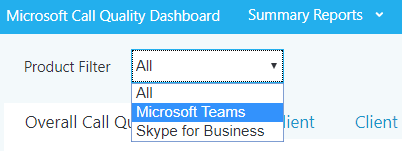

#  <a name="use-cqd-to-manage-call-and-meeting-quality-in-microsoft-teams"></a>CQD를 사용하여 통화 및 모임 품질을 Microsoft Teams 

이 문서에서는 CQD(전화 품질 Teams)를 사용하여 조직의 통화 및 모임 품질을 모니터링하고 유지 관리하기 위한 프로세스를 개발하는 데 Microsoft Teams 도움이 됩니다. 오디오 환경을 개선하기 위해 개선한 네트워크가 비디오 및 공유의 개선으로 변환될 수 있기 때문에 이 지침은 오디오 품질 시나리오를 강조합니다.

이 지침의 핵심은 큐레이터된 [두 개의 CQD](https://aka.ms/QERtemplates) 템플릿입니다. 이 문서의 지침을 진행하기 전에 다운로드하는 것이 좋습니다.

이 문서에서는 이미 [CQD를 설정했다고 가정합니다.](turning-on-and-using-call-quality-dashboard.md)


## <a name="categories-to-monitor-and-maintain"></a>모니터링 및 유지 관리하는 범주

모임 및 음성을 롤아웃한 후 Teams 모니터링 및 유지 관리에 대한 계획이 필요합니다. 이렇게 하면 Teams 항상 최적으로 실행됩니다. 이 계획에는 아래에 나열된 주요 영역이 포함되어야 합니다. 또한 품질 메트릭에 대한 대상과 문제가 발생할 때 문제 해결 및 고립을 위한 계획을 설정해야 합니다.

<table>
<thead>
<tr class="header">
<th>범주</th>
<th>설명</th>
</tr>
</thead>
<tbody>
<tr class="odd">
<td><strong>통화 품질</strong></td>
<td>
<p>내부 호출(예: VPN, WiFi, 유선) 또는 외부 통화를 통해 메트릭을 분석합니다.</p>
<p>구축 또는 네트워크로 메트릭을 분석합니다.</p>
<p>VPN 통화</p>
<p>TCP, UDP 또는 프록시를 사용하여 호출</p>
</td>
</tr>
<tr class="even">
<td><strong>통화 안정성</strong></td>
<td><p>네트워크 또는 방화벽 문제 식별 및 해결</p>
<p>호출 설정 및 실패 드롭 백분율에 대한 인사이트 확보</p>
<p>대부분의 호출 설정 및 드롭 실패가 발생하는 위치 자세히 알아보기</p>
</td>
</tr>
<tr class="odd">
<td><strong>사용자 설문 조사</strong></td>
<td>
<p>내 통화 속도 데이터를 사용하여 사용자의 실제 경험에 대해 자세히 알아보기</p>
<p>가난한 환경은 어디에서 발생하나요?</p>
<p>통화 품질, 안정성 및 디바이스와 열악한 환경의 상관 관계</p>
</td>
</tr>
<tr class="even">
<td><strong>장치</strong></td>
<td><p>가장 일반적으로 사용되는 마이크 및 스피커와 통화 품질에 미치는 영향에 대해 알아보기</p>
<p>지원되는 오디오, 비디오, USB 및 WiFi 드라이버가 정기적으로 패치되고 있나요?</p>
</td>
</tr>
<tr class="odd">
<td><strong>클라이언트</strong></td>
<td>
<p>사용되는 클라이언트 유형 및 버전과 통화 품질 및 안정성에 미치는 영향에 대해 자세히 알아보기  </p>
</ol></td>
</tr>
</tbody>
</table>

이 문서에 설명된 영역을 지속적으로 평가하고 수정하여 사용자에게 부정적인 영향을 줄 수 있습니다. 대부분의 사용자 문제는 다음 범주로 그룹화할 수 있습니다.

-   불완전한 방화벽 또는 프록시 구성
-   불량 Wi-Fi 적용 범위
-   대역폭 부족
-   VPN
-   불일치 또는 이전 클라이언트 버전 및 드라이버
-   미개인 또는 기본 제공 오디오 디바이스
-   문제가 있는 서브넷 또는 네트워크 디바이스

온라인 또는 온라인을 배포하기 Teams 비즈니스용 Skype 적절한 계획 및 디자인을 통해 고품질 환경을 유지하는 데 필요한 노력을 줄일 수 있습니다.

이 문서에서는 CQD(전화 품질 대시보드) Online을 기본 도구로 사용하여 각 영역을 보고하고 조사하는 데 중점을 두며, 채택 및 영향을 최대화하기 위해 오디오에 특별히 중점을 두는 것입니다. 오디오 환경을 개선하기 위해 네트워크를 개선하면 비디오 및 데스크톱 공유가 개선됩니다.

평가를 가속화하기 위해 [큐레이터된 두 개의 CQD](https://aka.ms/qertemplates) 템플릿이 제공됩니다. 하나는 모든 네트워크를 관리하기 위한 것이고 다른 하나는 관리되는(내부) 네트워크에만 필터링됩니다. 모든 네트워크 템플릿 보고서는 건물 및 네트워크 정보를 표시하도록 구성됩니다. 건물 정보를 수집하고 업로드하는 동안에도 사용할 수 있습니다. CQD에 건물 정보를 업로드하면 서비스는 외부 서브넷과 내부를 차별화하면서 사용자 지정 건물, 네트워크 및 위치 정보를 추가하여 보고를 강화할 수 있습니다. 자세한 내용은 건물 매핑 [을 참조하십시오.](CQD-building-mapping.md)

### <a name="intended-audience"></a>의도된 대상

이 문서는 공동 작업 리드/설계자, 컨설턴트, 변경 관리/채택 전문가, 지원/지원 데스크 리드, 네트워크 리드, 데스크톱 리드 및 IT 관리자와 같은 역할을 가진 파트너 및 고객 이해 관계자가 사용할 수 있습니다.

이 문서는 지정된 품질 챔피언이 사용할 수도 있습니다. 자세한 내용은 [Quality Champion 역할 을 참조하세요.](4-envision-plan-my-service-management.md#the-quality-champion-role)


## <a name="what-is-quality"></a>품질이란?

이 컨텍스트에서 품질은 서비스 메트릭 및 사용자 환경의 조합입니다.


### <a name="service-metrics"></a>서비스 메트릭

서비스 메트릭은 특정 클라이언트 기반 메트릭으로 구성됩니다. 각 호출 중에 클라이언트는 호출에 대한 원격 분석을 수집하고 나중에 CQD 또는 사용자당 통화 분석에서 액세스할 수 있는 각 호출의 끝에 보고서를 [제출합니다.](set-up-call-analytics.md) 이러한 메트릭에는 다음이 포함됩니다(하지만 제한되지는 않습니다).

-   가난한 스트림(수신 및 외출)
-   설정 실패율
-   실패율 드롭


#### <a name="poor-stream-rate"></a>불량 스트림 속도

PSR(가난한 스트림 속도)은 품질이 좋지 않은 조직의 전체 스트림 백분율을 나타내고 있습니다. 이 메트릭은 조직이 이 값을 줄이고 사용자 환경을 개선하는 데 가장 강력한 영향을 미치기 [](#managed-versus-unmanaged-networks) 위해 집중할 수 있는 영역을 강조하기 위한 것이기 때문에 PSR을 볼 때 관리되는 네트워크가 주요 초점입니다. 외부 사용자도 중요하지만 조사는 조직에 따라 다릅니다. 외부 사용자에 대한 모범 사례를 제공하고 전체 조직과 독립적으로 외부 호출을 조사하는 것이 고려됩니다.

CQD의 실제 측정값은 워크로드에 따라 다르지만 이 문서에서는 주로 오디오 불량 백분율 _측정에 초점을 맞추고_ 있습니다. PSR은 다음 표에 설명된 5개의 네트워크 메트릭 평균으로 구성됩니다. 스트림을 가난한 것으로 분류하기 위해 하나의 메트릭만 정의된 임계값을 초과해야 합니다. CQD는 "인해 불량..."을 제공 스트림이 불량으로 분류된 조건을 더 잘 이해하기 위한 측정값입니다. 자세한 내용은 [CQD에서 Stream 분류를 읽습니다.](stream-classification-in-call-quality-dashboard.md)

> [!Note]
> CQD는 "인해 불량..."을 제공 합니다. 스트림이 불량으로 분류된 조건을 더 잘 이해하기 위한 측정값입니다.


##### <a name="audio-poor-quality-metrics"></a>오디오 품질이 좋지 않은 메트릭

| 메트릭 평균     | 설명     | 사용자 환경 |
|-------------|-----------------|-----------------|
| 지터 \> 30 ms        | 연속 패킷 간의 평균 지연 변경입니다. Teams 및 비즈니스용 Skype 버퍼링을 통해 일부 수준의 지터에 적응할 수 있습니다. 지터가 참가자가 지터의 효과를 알 수 있는 버퍼링을 초과하는 경우만 해당됩니다.      | 다른 속도로 도착하는 패킷은 스피커의 음성이 로봇 소리로 들리게 합니다.   |
| 패킷 손실율 \> 10% 또는 0.1        | 이는 종종 손실되는 패킷의 백분율로 정의됩니다. 패킷 손실은 오디오를 완전히 차단하는 백-백 버스트 손실에 거의 영향을 주지 않습니다. 작은 개별 손실 패킷에서 오디오 품질에 직접 영향을 미치게 됩니다.     | 패킷이 삭제되고 의도된 대상에 도착하지 않은 경우 미디어의 간격이 발생하여 부재 중 운율과 단어가 누락되고 비디오와 공유가 좁아지고 있습니다. |
| 왕복 시간 \> 500 ms        | 이는 A 지점에서 B 지점으로 IP 패킷을 얻은 후 다시 A를 지점으로 되돌리는 데 걸리는 시간입니다. 이 네트워크 전파 지연은 두 지점과 광속 사이의 물리적 거리와 연결되고 네트워크 경로의 다양한 디바이스에서 취한 추가 오버헤드를 포함합니다.      | 패킷이 대상에 도착하는 데 너무 오래 걸려서 walkie-talkie 효과를 유발합니다.   |
| NMOS 성능 저하 평균 \> 1.0         | 스트림에 대한 [NMOS(평균 네트워크 평균](/previous-versions/office/communications-server/bb894481(v=office.12)#network-mos) 의견 점수) 성능 저하. 네트워크 손실 및 지터가 수신된 오디오 품질에 얼마나 영향을 미쳤는가를 나타내며 NMOS가 두 개 이상의 지점으로 떨어질 수 있습니다. | 이는 지터, 패킷 손실 및 더 적은 정도의 조합으로 왕복 시간이 증가했습니다. 사용자가 이러한 증상의 조합을 경험할 수 있습니다.   |
| 은신된 샘플의 평균 비율 \> 7% 또는 0.07 | 패킷 손실로 생성된 샘플이 총 오디오 프레임 수로 복구되는 오디오 프레임 수의 평균 비율입니다. 은닉된 오디오 샘플은 일반적으로 삭제된 네트워크 패킷으로 인해 발생할 수 있는 급작스런 전환을 원활하게 처리하는 데 사용되는 기술입니다.      | 높은 값은 상당한 수준의 손실 은신이 적용되고 오디오가 왜곡되거나 손실되었다는 것을 나타냅니다.     |

##### <a name="why-do-we-prefer-to-use-streams-instead-of-calls"></a>호출 대신 스트림을 사용하는 것을 선호하는 이유는 무엇입니까?

스트림 호출의 특정 다리가 가난한지 알 수 있습니다. 부실한 호출에 대한 호출 분석을 보고 있을 때 호출이 해당 발신자 스트림(아웃바운드) 또는 호출자 스트림(인바운드)에 기인하는지 여부를 판단합니다. 통화 품질에 영향을 미치는 스트림을 결정하는 것이 회의에서 더욱 중요합니다. 통화 데이터만 보고 있는 경우 사용자가 참가하는 회의 수를 볼 수 있지만, 가장 많은 화면 공유를 수행하여 활성 발언자인 사람이 어떤 사람을 볼 수 없습니다.

통화 데이터는 사용량 메트릭을 제공하지만 통화 품질이 좋지 않은 근본 원인으로 이어질 필요는 없습니다. 스트림 방향을 확인하면 관리되는 네트워크에 없는 통화, 비 직원의 통화(예: 다른 네트워크의 공급업체 또는 다른 네트워크의 다른 사용자)의 호출과 같은 요소를 식별할 수 있습니다. 이러한 경우 다른 사람의 네트워크 연결이 좋지 않은 경우 전체 호출에 불량으로 플래그가 지정됩니다. 외부 요인에 대해 아무 것도 할 수 없어 이 데이터는 유용하지 않습니다.

스트림 방향은 문제가 있는 디바이스 또는 클라이언트를 식별하는 데도 도움이 될 수 있습니다.

 - 예를 들어 디바이스에 대한 예산이 제한되어 있으며 오디오 사용자만 디바이스를 제공하려는 경우 VoIP(오디오 사용량 보고서)를 사용하여 아웃바운드 스트림 및 회의를 필터링합니다. 기본 제공 마이크로 말하고 있는 볼륨이 많은 오디오 사용자를 찾아보면 이러한 오디오 사용자가 통화 품질이 나쁨과 관련이 있을 수 있으며 이러한 사용자에 대한 오디오 디바이스를 제공하려는 경우도 있습니다. 명확성을 높이기 위해 패킷 사용률을 필터링하여 특히 볼륨이 많은 오디오 사용자를 대상으로 할 수 있습니다. 

  - 또 다른 예로 화면 공유가 있습니다. 고객이 이전 클라이언트를 사용하는 Teams 화면 공유 성능에 영향을 줄 수 있습니다. 화면 공유를 많이 하는 사용자에 대한 클라이언트 업그레이드의 우선 순위를 지정하여 이 문제를 해결할 수 있습니다.

 - 스트림의 방향이 통화 품질이 좋지 않은 원인을 식별하여 QoS 또는 대역폭 관련 문제가 있는지 확인할 수 있습니다. QoS를 완전히 구현하지 않은 경우 또는 클라이언트에서 패킷만 표시하고 인바운드 스트림에 표시하지 않은 경우 통화 품질이 나쁨을 볼 수 있습니다. 스트림 방향을 확인하면 패킷 손실, 대기 시간 또는 지터를 특정 방향으로 보다 세분화하여 볼 수 있습니다. 

   - 예를 들어 유선 연결(지터)에서 사용자가 로봇 오디오를 불평하는 경우를 예로 들겠습니다. 스트림 및 방향을 확인하여 특정 서브넷 집합에만 인바운드 스트림에서 문제가 발생하는지 확인할 수 있습니다. 네트워킹 팀에 이 정보를 제공한 후 미디어 트래픽을 우회하지 않은 잘못 구성된 WAN 가속기까지 추적할 수 있습니다. 네트워크 팀이 WAN 가속기 재구성하면 지터가 사라지고 통화 품질이 향상됩니다. 


#### <a name="setup-failure-rate"></a>설정 실패율

CQD의 총 호출  설정 실패 비율 측정으로 알려진 설정 실패율은 호출 시작 시 엔드포인트 간에 미디어 경로를 설정할 수 없는 스트림의 수입니다.

이는 설정될 수 없는 모든 미디어 스트림을 나타내는 것입니다. 이 문제가 사용자 환경에 미치는 영향의 심각성을 감안할 때 이 값을 가능한 한 0에 가깝게 줄이는 것이 목표입니다. 이 메트릭에 대한 높은 값은 성숙한 배포보다 불완전한 방화벽 규칙을 사용하는 새 배포에서 더 일반적이지만 정기적으로 지켜보는 것이 여전히 중요합니다.

이 메트릭은 성공적으로 CDR(통화 세부 정보 레코드)을 제출한 총 스트림 수로 설정하지 못한 총 스트림 수를 사용하여 계산됩니다.

-   **설정 실패율** = 총 통화 설정 실패 스트림 수 / 총 CDR 사용 가능한 스트림 수

#### <a name="drop-failure-rate"></a>실패율 드롭

CQD의 총 호출  삭제 실패 비율 측정으로 알려진 드롭 실패율은 미디어 경로가 정상적으로 종료되지 않은 성공적으로 설정된 스트림의 백분율입니다.

이는 예기치 않게 종료된 모든 미디어 스트림을 나타내는 것입니다. 설정하지 못한 스트림만큼 심각한 영향은 아니지만 여전히 사용자 환경에 부정적인 영향을 미치고 있습니다. 갑작스런 미디어 드롭은 사용자 환경에 심각한 영향을 줄 뿐만 아니라 사용자가 다시 연결해야 할 필요성을 초래하여 생산성이 손실됩니다(좌절은 언급하지 않습니다).

메트릭은 삭제된 스트림의 총 수를 성공적으로 설정한 스트림의 총 수로 나눈 것으로 계산됩니다.

-   **실패율** 삭제 = 총 호출 삭제된 스트림 수 / 총 호출 설정 성공 스트림 수

### <a name="define-your-target-metrics"></a>대상 메트릭 정의

이 섹션에서는 서비스의 상태를 평가하는 데 사용하는 일부 핵심 서비스 메트릭에 대해 설명합니다. 이러한 메트릭을 정의된 목표 미만으로 유지하기 위한 노력을 지속적으로 평가하고 주도하여 사용자가 일관되고 신뢰할 수 있는 통화 품질을 경험하도록 할 수 있습니다. 시작점으로 아래 표에서 제안된 대상을 사용하세요. 비즈니스 목표를 충족하기 위해 필요한 경우 대상을 조정합니다.

<table>
<tr>
<th rowspan="2" colspan="2" valign="center">네트워크 유형</th><th rowspan="1">품질 목표</th><th colspan="2">안정성 대상</th></tr>
<tr><th>오디오 불량 스트림 속도</th><th>설정 실패율</th><th>실패율 드롭</th></tr>
<tr><td rowspan="2"><strong>모두</strong></td><td>내부</td><td>2.0%</td><td>0.5%</td><td>2.0%</td></tr>
<tr><td>전체</td><td>3.0%</td><td>1.0%</td><td>3.0%</td></tr>
<tr><td rowspan="5"><strong>회의</strong></td><td>내부</td><td>2.0%</td><td>0.5%</td><td>2.0%</td></tr>
<tr><td>유선 내부</td><td>1.0%</td><td>0.5%</td><td>1.0%</td></tr>
<tr><td>Wi-Fi 5GHz 내부</td><td>1.0%</td><td>0.5%</td><td>1.0%</td></tr>
<tr><td>Wi-Fi 2.4GHz 내부</td><td>2.0%</td><td>0.5%</td><td>2.0%</td></tr>
<tr><td>전체</td><td>2.0%</td><td>0.5%</td><td>3.0%</td></tr>
<tr><td rowspan="4"><strong>P2P</strong></td><td>내부</td><td>2.0%</td><td>0.5%</td><td>2.0%</td></tr>
<tr><td>유선/Wi-Fi 5GHz 내부</td><td>1.0%</td><td>0.5%</td><td>1.0%</td></tr>
<tr><td>전체적으로 유선/Wi-Fi 5GHz</td><td>2.0%</td><td>1.0%</td><td>1.0%</td></tr>
<tr><td>전체</td><td>2.0%</td><td>1.0%</td><td>3.0%</td></tr>
</table>

### <a name="user-experience"></a>사용자 환경

여기서 수집된 메트릭이 네트워크 또는 서비스에 문제가 있는 것은 아니기 때문에 사용자 환경을 분석하는 것은 과학보다는 예술적입니다. CQD에는 전체 사용자 환경을 측정하는 데 도움이 되는 기본 제공 설문 조사 메커니즘인 RMC(평가 내 통화)가 포함되어 있습니다. RMC는 사용자의 관점에서 다음 질문에 대한 인사이트를 제공합니다.

-   솔루션을 사용하는 방법을 알고 있나요?
-   이 솔루션은 사용하기 쉽고 직관적이며, 내 일과 의사소통 요구를 지원하나요?
-   솔루션이 내 작업을 완료하는 데 도움이 하나요?
-   솔루션에 대한 전반적인 인식은 어떻게 하나요?
-   현재 위치와 관계없이 어떤 시점에서든 솔루션을 사용할 수 있나요?
-   통화를 설정하고 유지할 수 있나요?

#### <a name="rate-my-call"></a>내 통화 평가 

내 통화 속도(RMC)는 기본 Teams 비즈니스용 Skype. 10개 호출마다 하나씩 또는 10%의 후에 자동으로 팝업됩니다. 이 간략한 설문 조사는 사용자에게 통화 평가를 요청하고 통화 품질이 좋지 않은 이유에 대한 약간의 컨텍스트를 제공하도록 요청합니다. 1~2등급은 가난한 것으로 간주하고, 3~4등급은 양호하고, 5등급은 우수합니다. 다소 지루한 표시기는 하지만 서비스 메트릭이 놓칠 수 있는 문제를 해결하기 위한 유용한 메트릭입니다.

> [!Note]
> 인적 요소: 사용자는 통화 품질이 양호할 때 설문 조사를 무시하고 통화 품질이 나쁘면 설문 조사를 작성합니다. 결과적으로 서비스 메트릭이 양호한 경우에도 RMC 보고서가 가난한 쪽으로 비어 있을 수 있습니다.

CQD를 사용하여 RMC 사용자 응답을 보고할 수 있으며 샘플 보고서가 CQD 템플릿에 포함됩니다. 그러나 이 문서에서는 자세히 설명되지 않습니다. 

#### <a name="client-and-device-readiness"></a>클라이언트 및 디바이스 준비

사용자에게 일관되고 긍정적인 사용자 환경을 보장하기 위해 견고한 클라이언트 및 디바이스 전략이 필요합니다. 몇 가지 주요 원칙은 각 준비 전략을 구동합니다.

##### <a name="client-readiness"></a>클라이언트 준비

클라이언트를 Teams 최신으로 유지하면 사용자가 항상 최상의 환경을 유지할 수 있습니다. Microsoft는 Teams [](teams-client-update.md) 클라이언트에 대한 자주 업데이트를 릴리스합니다(이 기능을 해제하지 않는 한 업데이트는 백그라운드에 자체 설치됩니다. 권장하지 않습니다). 네트워크, 비디오, USB 및 오디오 드라이버를 패치하는 것이 중요합니다. 이는 종종 간과되는 경우가 며 통화 및 모임 품질에 영향을 줄 수 있기 때문에 중요합니다. 현재 패치 관리 프로세스에 네트워크, Wi-Fi, 비디오, USB 및 오디오 드라이버를 추가하는 것이 고려됩니다.


##### <a name="device-readiness"></a>디바이스 준비

디바이스 준비 전략보다 사용자 경험에 영향을 줄 수 있는 단일 전략은 없습니다. 예를 들어 랩톱 스피커와 마이크를 사용하는 사용자는 통화 및 모임에서 배경 소음이 많이 발생합니다. Teams 거의 모든 디바이스에서 작동하도록 설계되어 있지만 장치 관련 문제가 있는 경우 에 대한 전화 [를 Teams.](./devices/phones-for-teams.md)


### <a name="categories-of-quality"></a>품질 범주

품질 관리 사례 집합을 운영합니다. 이렇게 하면 통화 및 모임 품질이 가장 좋은 기회를 제공합니다. 좋은 품질 관리 계획은 다음 범주를 해결합니다.

-   **네트워크:** PSR(가난한 스트림 비율) 메트릭, TCP 사용량, 유선 및 무선 서브넷, HTTP proxies 및 VPN 사용 식별에 중점을 두는 오디오 품질

-   **엔드포인트:** 오디오 디바이스 및 최신 클라이언트

-   **서비스 관리:** 이 범주는 다음 두 섹션으로 구성됩니다.

    -   첫째, Microsoft는 온라인 서비스를 관리하고 Teams 비즈니스용 Skype 책임이 있습니다.

    -   두 번째는 인프라가 서비스에 추가될 때 건물 정보를 업데이트하고 새 IP 주소에 대한 방화벽을 Office 365 같은 서비스에 대한 신뢰할 수 있는 액세스를 보장하기 위해 조직이 관리하는 작업입니다.


품질을 유지하는 데 권장되는 작업의 다음 목록을 검토합니다. 이러한 작업을 정기적으로 수행해야 합니다( 예: 매주).

#### <a name="service-management-tasks"></a>서비스 관리 작업

이러한 작업은 인터넷 연결 포화 없이 서비스에 도달할 수 있는 충분한 대역폭을 보장하는 것, 관리되는 모든 네트워크 영역에서 QoS(서비스 [품질)가](/microsoft-365/enterprise/urls-and-ip-address-ranges)유지되고, 방화벽에서 Office 365 IP 범위를 유지해야 하는 범위입니다.

#### <a name="network-tasks"></a>네트워크 작업

네트워크 작업에는 안정성 및 품질의 두 가지 범주가 있습니다. 안정성은 호출을 성공적으로 완료하고 연결 유지를 하는 사용자의 기능을 측정하는 데 중점을 품질은 통화 중 및 종료된 Teams 클라이언트가 Teams 비즈니스용 Skype 온라인에 전송된 집계된 원격 분석에 중점을 두습니다. 

안정성이 사용자 환경에 미치는 중대한 영향을 주어 품질에 대해 조사하기 전에 안정성 메트릭을 평가하고 조사하는 것이 좋습니다. 

#### <a name="endpoints-tasks"></a>엔드포인트 작업

이 범주의 주 태스크는 클라이언트 업데이트에 대한 Teams [제거합니다.](teams-client-update.md) 기본적으로 Teams 자동으로 업데이트됩니다(해당 설정을 해제하지 않는 한 권장하지 않습니다). 

디바이스와 관련된 문제를 식별할 때마다 디바이스를 모니터링하고 업데이트를 제공해야 합니다.

## <a name="use-cqd-to-manage-call-quality"></a>CQD를 사용하여 통화 품질 관리

[CQD를](turning-on-and-using-call-quality-dashboard.md)설정한 후 이를 사용하여 조직의 통화 및 모임 품질을 관리할 준비가 됩니다.

성능에 Teams 대부분의 문제는 다음 범주로 분류됩니다.

-   불완전한 방화벽 또는 프록시 구성
-   불량 Wi-Fi 적용 범위
-   대역폭 부족
-   VPN
-   불일치 또는 이전 클라이언트 버전 및 드라이버
-   미개인 또는 기본 제공 오디오 디바이스
-   문제가 있는 서브넷 또는 네트워크 디바이스

이러한 영역을 평가하고 Teams 수정하기 전에 시간이 걸릴 경우 모든 사용자에 대해 고품질의 Teams 유지 관리에 필요한 노력을 줄일 수 있습니다. 롤아웃에 대비하여 네트워크를 평가하는 데 도움이 Teams [에 대한 Advisor를](use-advisor-teams-roll-out.md) Teams 및 네트워크 준비 를 [Teams.](prepare-network.md)

### <a name="expectations-using-cqd"></a>CQD를 사용하는 기대치

CQD(통화 품질 대시보드)를 사용하여 서비스 및 서비스 및 서비스를 사용하여 통화 품질에 Teams 비즈니스용 Skype. CQD는 관리자 및 Teams 비즈니스용 Skype 네트워크 엔지니어가 네트워크를 최적화하고 품질, 안정성 및 사용자 환경을 세밀하게 주시하도록 설계되었습니다. CQD는 전체 패턴을 알 수 있는 전체 조직에 대한 집계 원격 분석에 대해 조사합니다. 이렇게 하면 정보를 통해 평가 및 계획 수정을 할 수 있습니다. CQD는 전체 품질, 안정성 및 사용자 경험에 대한 인사이트를 제공하는 메트릭 보고서를 제공합니다.

CQD는 추세 및 서브넷을 분석하는 데 유용하나 항상 특정 시나리오에 대한 특정 원인을 제공하지는 않습니다. 이를 이해하고 CQD를 사용할 때 올바른 기대치를 설정하는 것이 중요합니다.

-   CQD는 모든 시나리오에 대한 근본 원인을 제공하지 않습니다.
-   CQD에는 오디오 전화 시스템 포함하지 않습니다.
-   CQD는 추세에 따라 추가 조사를 위해 영역을 호출합니다.

### <a name="cqd-reports-overview"></a>CQD 보고서 개요

화면 맨 위에 있는 드롭다운 메뉴를 사용하여 보고서를 니다. 각 보고서에 제공된 데이터 목록은 CQD 보고서에서 사용할 수 있는 [데이터를 읽습니다.](CQD-data-and-reports.md#data-available-in-cqd-reports)

2020년 1월의 새: [CQD에 Power BI](https://github.com/MicrosoftDocs/OfficeDocs-SkypeForBusiness/blob/live/Teams/downloads/CQD-Power-BI-query-templates.zip?raw=true)쿼리 템플릿을 다운로드합니다. CQD Power BI 분석하고 보고하는 데 사용할 수 있는 사용자 지정 가능한 템플릿입니다.


### <a name="teams-vs-skype-for-business"></a>Teams 및 비즈니스용 Skype

CQD는 모든 Teams 및 비즈니스용 Skype. 그러나 보고서를 개발하여 원격 분석과 별개로 원격 분석 Teams 수 비즈니스용 Skype.

#### <a name="summary-reports"></a>요약 보고서

요약 보고서 페이지를 수정하여 Teams 비즈니스용 Skype 화면 위쪽에서 제품 필터  드롭다운 메뉴를 선택한 다음 원하는 제품을 선택합니다.



#### <a name="detailed-reports"></a>자세한 보고서

모든 세부 보고서를 필터링하기 위해 브라우저 표시줄에서 URL 끝에 다음을 추가합니다.

```PowerShell
/filter/[AllStreams].[Is Teams]|[FALSE]
```

**예제:**

```https://cqd.teams.microsoft.com/cqd/#/1234567/2018-5/filter/[AllStreams].[Is Teams]|[FALSE]```

URL 필터에 대한 자세한 내용은 이 섹션의 나중에 [보고서 필터링을](CQD-data-and-reports.md#report-filters) 참조하세요.

개별 세부 보고서를 필터링하기 위해 보고서에 필터를 추가하고 ``Is Teams`` True 또는 False로 설정합니다.


### <a name="managed-versus-unmanaged-networks"></a>관리되는 네트워크와 관리되지 않는 네트워크

기본적으로 CQD의 모든 엔드포인트는 외부로 분류됩니다. 건물 파일이 도입되는 즉시 관리되는 엔드포인트 데이터를 살펴보기 시작할 수 있습니다. 앞서 설명했듯이 CQD의 네트워크는 다음과 같이 정의됩니다.

-   내부 _또는_ 내부라고도 하는 관리되는 네트워크는 조직에 의해 영향을 및 제어할 수 있습니다. 여기에는 내부 LAN, 원격 WAN 및 VPN이 포함됩니다.
-   외부 _또는_ 외부라고도 하는 관리되지 않는 네트워크는 조직의 영향을 주거나 제어할 수 없습니다. 관리되지 않는 네트워크의 예로 호텔 또는 공항 네트워크가 있습니다.

### <a name="dimensions-measures-and-filters"></a>차원, 측정값 및 필터

잘 형성된 CQD 쿼리에는 다음 매개 변수의 세 가지가 모두 포함됩니다.

-   **차원:** 데이터를 피벗하는 방법

-   **측정값:** 보고할 일입니다.

-   **필터:** 쿼리가 반환하는 데이터 세트를 줄이는 방법

이를 살펴보는 또 다른 방법은 차원이 그룹화  함수이고, 측정값은 관심 있는  데이터입니다. 필터는 쿼리와 관련된 결과로 결과를 좁히는 것입니다. 

잘 형성된 쿼리의 예로 건물 **6 [필터]의 서브넷 [차원]스트림 [측정값]** 표시가 있습니다. 자세한 내용은 CQD에서 사용할 수 있는 차원 및 [측정값을 참조하세요.](./dimensions-and-measures-available-in-call-quality-dashboard.md)

### <a name="first-vs-second"></a>첫 번째 및 두 번째 

CQD의 많은 차원 및 측정값은 첫 번째 또는 두 번째로 분류됩니다. CQD는 호출자/호출자 필드를 사용하지 않습니다. 발신자  및 호출자 간에 중간 단계가 있기 때문에 이름 첫 번째와 두 번째로 이름을 다시 합니다.  다음 논리는 먼저 레이블이 지정되는 엔드포인트를 결정합니다.

-   **먼저** 서버가 스트림 또는 호출에 관여하는 경우 항상 서버 엔드포인트(Conference Server, Mediation Server 등)가 됩니다.

-   **스트림이** 두 서버 엔드포인트 사이에 없는 경우 두 번째는 항상 클라이언트 엔드포인트가 됩니다.

-   두 엔드포인트가 동일한 형식인 경우 먼저 사용자 에이전트 범주의 내부 순서를 기반으로 합니다. 이렇게 하면 순서가 일치합니다.

둘 다 동일한 경우 첫 번째 또는 두 번째 엔드포인트를 결정하는 데 대한 자세한 내용은 [CQD에서](./dimensions-and-measures-available-in-call-quality-dashboard.md)사용할 수 있는 차원 및 측정값을 참조하세요.

### <a name="stream-vs-call"></a>스트림 및 통화

CQD에서 어떤 차원이나 측정값을 올바르게 선택하려면 통화와 스트림의 차이점을 이해해야 합니다. CQD의 주된 포커스가 스트림에 중점을 두지만 통화 기반 측정도 사용할 수 있습니다.

-   **스트림:** _스트림은_ 두 엔드포인트 사이에만 존재합니다. 각 방향에 대해 하나의 스트림만 있으며 통신에는 두 개의 스트림이 필요합니다. 스트림, 네트워크 또는 서브넷을 조사하는 데 유용합니다. 경우에 따라 호출 및 스트림이 측정값 이름(예: 설정 스트림 호출 또는 통화 삭제된 스트림)에 사용됩니다. 이러한 스트림은 여전히 스트림으로 분류됩니다.

-   **통화:** _호출은_ 모든 참가자의 모든 스트림을 그룹화하는 것입니다. 호출은 최소 2개의 스트림으로 구성됩니다. 단일 호출에는 하나 이상의 스트림이 있는 두 개 이상의 엔드포인트가 있습니다.

차원 또는 측정값이 호출 또는 스트림을 참조하는지 여부에 대한 추가 지침은 [CQD에서](./dimensions-and-measures-available-in-call-quality-dashboard.md) 사용할 수 있는 차원 및 측정값을 참조하세요.

### <a name="good-poor-and-unclassified-calls"></a>좋음, 불량 및 미분할된 호출

호출은 양호, 불량 또는 분류되지 않은 호출로 분류됩니다. 잠시 시간을 내어 각 내용에 대해 자세히 설명해 죠.

-   **양호하거나 가난한 경우:** 양호하거나 불량한 호출은 전체 QoE 보고서가 생성되어 서비스에 의해 수신되는 전체 서비스 메트릭 집합을 포함하는 호출로 구성됩니다. 스트림이 양호하거나 불량인지 여부를 결정하는 것은 이 문서의 앞부분에 [설명되어 있습니다.](#poor-stream-rate)

-   **Unclasified:** 분석되지 않은 스트림에는 전체 서비스 메트릭 집합이 포함되지 않습니다. 일반적으로 60초 미만의 짧은 호출일 수 있습니다. 여기서는 평균을 계산할 수 없는 경우 QoE 보고서가 생성되지 않습니다. 호출이 세분화되지 않은 가장 일반적인 이유는 패킷 사용률이 거의 없습니다. 예를 들어 음소거로 모임에 참가하고 말하지 않는 참가자가 있습니다. 참가자는 미디어를 수신하지만 전송하지 않습니다. 미디어가 전송되지 않으면 CQD에서 엔드포인트의 아웃바운드 미디어 스트림을 분류하는 데 사용할 수 있는 메트릭이 없습니다.

자세한 내용은 [CQD에서 Stream 분류를 읽습니다.](stream-classification-in-call-quality-dashboard.md)

### <a name="common-subnets"></a>일반적인 서브넷

일반적인 서브넷은 호텔, 홈 네트워크, 핫스팟 및 유사한 지역에서 사용되는 특정 개인 서브넷입니다. 이러한 서브넷은 광범위하게 사용이 까다로웠기 때문에 세분화하기가 어렵습니다. 조직에서 이러한 일반적인 서브넷 중 하나를 사용하는 경우 해당 네트워크를 다른 서브넷으로 이동하는 것이 좋습니다. 이렇게 하면 CQD에서 보다 쉽게 보고할 수 있습니다. 모든 네트워크 템플릿의 보고서는 이러한 서브넷을 제외하여 품질이 좋지 않은 원인으로 제거하도록 구성됩니다. 일반적인 서브넷은 아래에 정의되어 있습니다. 조직에 따라 영향을 줄 수 있습니다.

-   10.0.0.0/24
-   192.168.0.0/24
-   192.168.1.0/24
-   192.168.2.0/24
-   172.20.10.0/24
-   192.168.43.0/24

일반적인 서브넷을 사용하는 관리되는 네트워크를 조사할 때 두 번째 Reflexive 로컬 IP 차원을 사용하여 서브넷을 그룹화해야 합니다. 이 차원에는 엔드포인트의 공용 IP 주소가 포함되어 있습니다.


## <a name="reliability-investigations"></a>안정성 조사

품질을 개선하기 위한 첫 번째 단계는 조직 전체의 안정성 상태를 평가하는 것입니다. 안정성은 긍정적인 사용자 경험에 매우 중요하기 때문에 안정성을 측정하는 두 가지 구성 요소로 시작합니다.

1.  **설정 오류:** 호출을 설정하지 못합니다.

2.  **드롭 실패:** 호출이 설정되고 예기치 않게 종료되었습니다.

이 섹션에서는 두 영역을 모두 조사하는 방법을 설명합니다.

> [!NOTE]
> 템플릿에 포함된 모든 보고서는 이 문서에서 다루지 않습니다. 그러나 아래에 설명된 조사 방법은 여전히 적용됩니다. 자세한 내용은 개별 보고서 설명을 참조하세요.


### <a name="setup-failures"></a>설정 오류

이러한 오류는 사용자 환경에 상당한 부정적인 영향을 미치기 때문에 먼저 이 지역에서 설치 실패를 수정하는 우선 순위를 지정합니다.

조직의 전체 설정 실패 비율을 평가하여 조사를 시작한 다음, 구축 또는 네트워크를 통해 가장 높은 비율을 기준으로 조사 영역의 우선 순위를 지정합니다. 

#### <a name="setup-failure-trend-analysis"></a>설정 실패 추세 분석

이 보고서에는 스트림의 총 양, 스트림 설정 오류 및 스트림 설정 실패율이 표시됩니다. 열 중 하나를 지적하여 개별 값을 표시합니다. 

##### <a name="analysis"></a>분석

이 보고서를 사용하여 다음 질문에 답변하고 다음 작업 과정을 결정할 수 있습니다.

-   현재 달의 총 호출 설정 실패 비율은 어떻게 하나요?

-   총 호출 설정 실패 비율이 정의된 대상 메트릭보다 높습니까?

-   실패 추세가 이전 달보다 나쁘거나 나쁘나요?

-   실패 추세가 증가하고, 꾸준히 또는 감소하고 있나요?

이러한 질문에 대한 답변에 관계 없이 도우미 하위 보고서를 사용하여 수정이 필요할 수 있는 개별 건물 또는 서브넷을 찾아서 더 조사하는 데 시간이 걸릴 수 있습니다. 전체 오류율이 대상 메트릭보다 낮을 수 있습니다. 하나 이상의 건물 또는 네트워크에 대한 실패율은 대상 메트릭보다 높고 조사가 필요할 수 있습니다.

#### <a name="setup-failure-investigations"></a>오류 조사 설정 

이 요약 보고서는 수정이 필요할 수 있는 모든 건물 또는 네트워크를 검색하고 격리하는 데 사용됩니다.

> [!NOTE]
> 월별 보고서 필터를 현재 월로 조정해야 합니다. 편집 **을** 선택하고  월별 보고서 필터를 조정하여 새 기본 월을 저장합니다.

##### <a name="remediation"></a>수정 

가장 큰 오류 볼륨이 있는 건물 또는 서브넷에 첫 번째 수정 노력을 집중합니다. 이렇게 하면 사용자 환경에 미치는 영향을 최대화하고 조직 호출 설정 실패의 비율을 빠르게 줄일 수 있습니다. 다음 표에는 CQD에서 보고한 설정 실패의 두 가지 이유가 나열됩니다.

| 설정 실패 이유 호출       | 일반적인 원인                    |
|----------------------------------|----------------------------------|
| FW 딥 패킷 검사 면제 규칙 누락 | 경로에 있는 네트워크 장비가 심층 패킷 검사 규칙으로 인해 미디어 경로가 설정되지 못했다는 것을 나타냅니다. 방화벽 규칙이 올바르게 구성되지 않은 때문일 수 있습니다. 이 시나리오에서는 TCP 악수 악수가 성공했지만 SSL 핸드 악수는 그렇지 않습니다.      |
| 누락된 FW IP 블록 예외 규칙      | 경로를 따라 네트워크 장비가 미디어 경로가 네트워크 또는 네트워크로 설정되지 Microsoft 365 Office 365 나타냅니다. 이는 트래픽 및 트래픽에 사용되는 IP 주소 및 포트에 대한 액세스를 허용하도록 프록시 또는 방화벽 규칙이 올바르게 구성되지 Teams 비즈니스용 Skype 있습니다. |

수정을 시작할 때 특정 건물 또는 서브넷에 노력을 집중할 수 있습니다. 앞의 표에서 보여 주신 것 처럼 이러한 문제는 방화벽 또는 프록시 구성 때문입니다. 수정 작업을 위해 다음 표의 옵션을 검토합니다.

|      수정      |지침  |
|-----------------------|----------|
| 방화벽 구성 | 네트워크 팀과 함께 작업하고 IP 주소 목록에서 방화벽 [Office 365 확인합니다.](/microsoft-365/enterprise/urls-and-ip-address-ranges)<br><br>미디어 [서브넷](https://support.office.com/article/Office-365-URLs-and-IP-address-ranges-8548a211-3fe7-47cb-abb1-355ea5aa88a2#bkmk_teams) 및 포트가 방화벽 규칙에 포함되어 있는지 확인 합니다. <br><br>방화벽에서 필요한 [포트가](prepare-network.md) 열립니다. TCP는 오디오, 비디오 및 비디오 기반 화면 공유에 대한 장애 조치(failback) 프로토콜로 간주될 수 있으며, 이 프로토콜의 사용은 통화 품질에 영향을 미치기 때문에 우선 순위를 부여해야 합니다. 레거시 RDP 애플리케이션 공유는 TCP만 사용 합니다.|

### <a name="drop-failures"></a>오류 삭제

설정 오류 코드와 달리 CQD에는 드롭 실패가 발생하는 이유를 나타내는 드롭 실패 코드가 없습니다. 따라서 특정 근본 원인을 격리하기가 어렵습니다. 실패를 더 잘 떨어뜨리기 위해 유추 방법을 사용 합니다. 미디어에 대한 관심 영역을 수정하고, 클라이언트 및 드라이버를 패치하고, 인증된 디바이스를 사용하여 Teams 비즈니스용 Skype 감소할 수 있습니다.

#### <a name="drop-failure-trend-analysis"></a>드롭 실패 추세 분석

이 보고서에는 오디오 스트림의 총 양, 총 드롭 실패 및 드롭 실패율이 표시됩니다. 열 중 하나를 지적하여 해당 값을 표시합니다. 


##### <a name="analysis"></a>분석

이 유형의 보고서를 사용하여 다음 질문에 대답할 수 있습니다.

-   현재 드롭 실패율은 어떻게 하나요?
-   드롭 실패율이 정의된 대상 메트릭보다 떨어질까요?
-   실패 추세가 이전 달보다 나쁘거나 나쁘나요?
-   실패 추세가 증가하고, 꾸준히 또는 감소하고 있나요?

위의 질문에 대한 답변에 관계 없이 하위 보고서를 사용하여 수정이 필요할 수 있는 모든 건물 또는 네트워크를 조사하는 데 시간이 걸릴 수 있습니다. 전체 드롭 실패율이 대상 메트릭보다 낮을 수 있습니다. 하나 이상의 건물 또는 네트워크에 대한 드롭 실패율은 대상 메트릭 이상일 수 있으며 조사가 필요할 수 있습니다.

#### <a name="drop-failure-investigations"></a>실패 조사 드롭

여기에 보고된 실패는 호출이 예기치 않게 삭제된 결과 부정적인 사용자 환경을 나타냅니다. 추세 보고서와 달리 이러한 보고서는 추가 조사가 필요한 특정 서브넷에 대한 추가 정보를 제공합니다.


##### <a name="remediation"></a>수정

포함된 테이블 보고서를 사용하여 드롭 비율이 정의한 대상 메트릭보다 높은 네트워크의 문제 영역을 격리할 수 있습니다. 가장 큰 영향을 미치기 위해 총 스트림 수가 가장 높은 건물 또는 서브넷에 첫 번째 수정 노력을 집중합니다.

호출 드롭의 일반적인 원인:

-   프로비전되지 않습니다.
-   제한된 네트워크에 구성된 QoS 없음
-   이전 클라이언트 버전
-   사용자 동작

문제 영역을 발견한 후 사용자별 통화 분석을 사용하여 특정 문제에 대해 해당 건물의 사용자를 추가로 검토할 수 있습니다. [](use-call-analytics-to-troubleshoot-poor-call-quality.md) 호출 분석에는 추가 EUII 데이터가 포함되어 있으며 드롭 실패의 잠재적인 이유를 추가로 고립하는 데 유용할 수 있습니다.

다음 단계와 관계없이 지원 데스크에 특정 건물 또는 서브넷에서 문제가 발견된 것을 알리는 것이 좋습니다. 이렇게 하면 헬프데스크가 들어오는 호출에 신속하게 응답하고 사용자를 더 효율적으로 판단할 수 있습니다. 플래그가 지정된 사용자는 추가 조사를 위해 엔지니어링 팀에 다시 보고할 수 있습니다.

다음 표에서는 드롭 실패를 관리하고 수정하는 몇 가지 일반적인 방법을 나열합니다.

| 수정                              | 지침                      |
|------------------------------------------|-------------------------------|
| **네트워크/인터넷**                         | **정체**: 네트워크 팀과 함께 특정 건물/서브넷에서 대역폭을 모니터링하여 과도하게 사용에 문제가 있는지 확인합니다. 네트워크 정체가 확인되면 해당 구성에 대역폭을 늘리거나 QoS를 적용하는 것이 고려됩니다. 포함된 품질 불량 스트림 [요약](#quality-investigations) 보고서를 사용하여 삭제된 스트림보다 우선하기 때문에 지터, 대기 시간 및 패킷 손실과 관련한 문제 서브넷을 검토합니다.<br><br>**QoS:** 대역폭을 늘리는 것이 비실용적이거나 비용이 많이 드는 경우 QoS 구현을 고려합니다. 이 도구는 정체된 트래픽을 관리하는 데 매우 효과적이며 관리되는 네트워크의 미디어 패킷이 비미디어 트래픽보다 우선 순위를 지정할 수 있습니다. 또는 대역폭이 범인이 됐다는 명확한 증거가 없는 경우 다음 솔루션을 고려하세요.<ul><li>[Microsoft Teams QoS 지침](qos-in-teams.md)</li></ul><br>**네트워크 준비** 평가 수행: 네트워크 평가는 예상 대역폭 사용량, 대역폭 및 네트워크 변경에 대처하는 방법, 네트워크 및 네트워크 사용에 대한 권장되는 Teams 비즈니스용 Skype. 이전 표를 원본으로 사용하면 평가를 위한 우수한 후보가 될 건물 또는 서브넷 목록이 있습니다.<ul><li>[Teams에 대한 조직의 네트워크 준비](prepare-network.md)</li></ul> |
| **클라이언트(비즈니스용 Skype 온라인 전용)** | 일부 이전 비즈니스용 Skype 클라이언트는 미디어 안정성과 관련해 문서화된 문제를 알 수 있습니다. 영향을 받는 여러 사용자의 통화 분석 보고서를 검토하거나 총 통화 실패율 측정값을 사용하여 특정 건물 또는 서브넷으로 필터링된 CQD에서 사용자 지정 클라이언트 버전 테이블 보고서를 만들 수 있습니다. 이 정보는 특정 건물에서 호출 드롭과 클라이언트의 특정 버전 간에 관계가 있는지 여부를 이해하는 데 도움이 됩니다.     |
| **장치**                                  |디바이스가 통화 품질 문제의 주범인 경우 문제가 있는 디바이스를 업데이트하는 것입니다. 자세한 [내용은 Teams](./devices/phones-for-teams.md) 휴대폰을 읽습니다. |
| **사용자 동작**                            | 네트워크, 디바이스 또는 클라이언트가 문제가 아닐 경우 사용자에게 모임에 가장 잘 참가하고 종료하는 방법을 교육하기 위해 사용자 채택 전략을 개발하는 것이 고려됩니다. 더 스마트한 Teams 비즈니스용 Skype 사용자가 모임의 모든 참가자에게 더 나은 사용자 환경을 생성합니다. 예를 들어 모임을 종료하지 않고 랩톱을 잠자기(뚜껑을 닫음)하는 사용자는 예기치 않은 호출 드롭으로 분류됩니다.   |

## <a name="quality-investigations"></a>품질 조사

조직 전체의 오디오 품질 상태를 평가하는 다음 단계는 PSR(가난한 스트림 속도), TCP 및 프록시 사용을 조사하는 것입니다. CQD 데이터는 특정 근본 원인을 제공하지 않지만, 대신 수정 작업을 위해 적절한 팀과 공동으로 대화를 시작할 수 있는 문제 영역을 제공합니다. 

> [!NOTE]
> 템플릿에 포함된 모든 보고서는 이 문서에서 다루지 않습니다. 그러나 아래에 설명된 조사 방법은 여전히 해당 보고서에 적용됩니다. 자세한 내용은 개별 보고서 설명을 참조하세요. 

### <a name="quality"></a>품질

PSR 백분율은 조직이 특정 포커스 영역에 대해 정의된 메트릭 목표를 모임하는지 여부를 나타내는 데 사용됩니다. 높은 수준의 백분율이 정의된 대상 내에 있는 경우에도 개별 서브넷 또는 건물이 정의된 대상을 충족하지 않을 수 있으므로 추가 조사가 필요합니다. 예를 들어 전체 오디오 PSR 백분율이 샘플 대상을 충족하는 4월에 2%인 경우 개별 건물 및 서브넷은 전체 2%의 배포에 따라 여전히 나쁜 환경을 겪을 수 있습니다. 

불량 스트림의 백분율을 평가하기 위해 품질 보고서를 사용 합니다. 전체, 회의, 양자, PSTN 통화, VPN 및 회의실에 대한 메트릭을 검토하기 위해 다양한 품질 보고서가 제공됩니다. 이 프로세스를 지원하기 위해 월간, 매주 및 매일 보고서가 제공됩니다. 주간 및 일일 보고서는 효율성을 높이고 소음을 줄이기 위해 관리되는 네트워크 템플릿으로 제한됩니다. 

#### <a name="quality-trend-analysis"></a>품질 추세 분석

추세 보고서는 시간 경과에 따라 품질 정보를 표시하며 각 관심 영역 내에서 품질 추세를 식별하고 이해하는 데 사용됩니다. 위에서 설명한 대로 품질을 조사하기 위해 템플릿에 보고서 트리가 포함되어 있습니다. 회의, 양자, PSTN 통화, VPN 및 회의실 품질을 분석하기 위해 조사 프로세스는 동일합니다. 그러나 회의 품질이 개선된 경우 다른 모든 영역에 긍정적인 영향을 미치기 때문에 먼저 회의를 시작하는 것이 좋습니다. 

> [!Note]
> 양자, PSTN 통화 및 회의실 조사는 회의 조사와 비슷합니다. 최악의 품질이 있는 건물 또는 서브넷을 격리하고 품질이 좋지 않은 이유를 식별하는 데 중점을 두는 것입니다.

> [!Important]
> VPN 기반 보고서는 두 번째 VPN 차원을 사용하여 필터링됩니다. 이 차원에서는 VPN 네트워크 어댑터를 원격 액세스 어댑터로 올바르게 등록해야 합니다. VPN 공급업체는 이 플래그를 안정적으로 사용하지 않습니다. 마일리지는 조직에 배포된 VPN 공급 업체에 따라 다릅니다. 필요한 경우 [건물 또는](CQD-upload-tenant-building-data.md#vpn) 네트워크 이름을 사용하여 VPN 보고서를 수정합니다.

##### <a name="investigation"></a>조사

이러한 보고서를 사용하여 다음 질문에 대답할 수 있습니다.

-   현재 월의 총 PSR은 무엇입니까?
-   PSR이 정의된 대상 메트릭 아래에 있나요?
-   PSR이 이전 달보다 나쁘거나 나쁘나요?
-   PSR 추세가 증가하고, 꾸준히, 또는 감소하고 있나요?

위의 질문에 대한 답변에 관계 없이 하위 보고서를 사용하여 조사가 필요할 수 있는 모든 건물 또는 서브넷을 찾아 조사하는 데 시간이 걸릴 수 있습니다. 전체 PSR이 대상 메트릭보다 낮을 수 있습니다. 종종 하나 이상의 건물 또는 네트워크에 대한 PSR이 메트릭 이상이기 때문에 수정이 필요합니다.

#### <a name="quality-investigations"></a>품질 조사

품질 요약 보고서를 통해 스트림이 빈약한 것으로 분류되는 데 기여한 내용을 심층적으로 파악할 수 있으며 관리되는 네트워크의 문제 영역을 격리하는 데 도움이 됩니다.

사용되는 차원은 보고서 간에 약간 다를 수 있습니다. 각 보고서에는 총 스트림, 총 불량 스트림, PSR 및 품질이 좋지 않은 측정값이 포함됩니다. 회의, 양자, PSTN 통화, VPN 및 회의실 등 각 관심 영역에 대해 보고서가 생성되었습니다. Managed Network 템플릿에는 건물 파일을 통해 업로드된 위치 정보를 활용할 수 있는 추가 보고서가 포함되어 있습니다.


> [!Note]
> 일반적인 서브넷은 광범위하게 사용이 까다로웠기 때문에 세분화하기가 어렵습니다. 클라이언트의 공용 IP(두 번째 반사 로컬 IP)를 표시하는 별도의 보고서가 공통 네트워크를 사용하는 Office를 수정하는 데 도움이 돕기 위해 모든 네트워크 템플릿에 추가되었습니다.


##### <a name="remediation"></a>수정

영향을 최대화하고 사용자 환경을 빠르게 개선하는 데 도움이 될 수 있기 때문에 가장 큰 스트림 볼륨이 있는 건물 또는 서브넷에 대한 수정 노력에 집중합니다. 지터, 패킷 손실 및 RTT(왕복 시간) 측정을 사용하여 품질 불량에 어떤 기여를 하는지 이해합니다(두 개 이상의 문제가 있을 수 있습니다).

-   **Jitter:** 미디어 패킷이 서로 다른 속도로 도착하여 스피커가 로봇 소리가 들리게 합니다.
-   **패킷 손실**: 미디어 패킷이 삭제되어 단어 또는 율리블이 누락되는 효과가 생성됩니다.
-   **RTT**: 미디어 패킷이 대상에 도착하는 데 시간이 오래 걸려서 walkie-talkie 효과가 생성됩니다.

품질 문제에 대한 조사를 지원하기 위해 사용자당 통화 분석을 [사용하세요.](use-call-analytics-to-troubleshoot-poor-call-quality.md) Call Analytics를 사용하면 특정 회의 또는 사용자의 통화 보고서를 볼 수 있습니다. 이 보고서에는 EUII/PII 데이터가 포함되어 있으며 오류의 원인을 찾는 경우 유용합니다. 영향을 받는 건물을 알고 나면 해당 건물의 사용자를 추적하는 것이 간단해야 합니다. 

이러한 네트워크가 품질 문제가 발생하고 있으므로 수신 통화를 신속하게 판단하고 응답할 수 있도록 지원 데스크에 알려주는 것을 잊지 마세요.

| 수정                              | 지침                         |
|------------------------------------------|----------------------------------|
| **네트워크**                                 | **정체**: 과도하게 사용되거나 프로비전되지는 네트워크가 프로비전되지 않았다면 미디어 품질에 문제가 발생할 수 있습니다. 네트워크 팀과 함께 작업하여 사용자에서 인터넷으로의 네트워크 연결에 미디어를 지원하기에 충분한 대역폭이 있는지 확인합니다. <br><br>**네트워크 준비** 평가 수행: 네트워크 평가는 예상 대역폭 사용량, 대역폭 및 네트워크 변경에 대처하는 방법, 네트워크 및 네트워크 사용에 대한 권장되는 Teams 비즈니스용 Skype. 이전 표를 원본으로 사용하면 평가를 위한 우수한 후보가 될 건물 또는 서브넷 목록이 있습니다.<ul><li>[Teams에 대한 조직의 네트워크 준비](prepare-network.md)</li></ul>|
| **QoS(서비스 품질)**  | QoS는 정해진 네트워크에서 패킷의 우선 순위를 지정하여 대상에 그대로 정시에 도착하도록 하는 데 도움이 되는 검증된 도구입니다. 대역폭이 제한되는 사용자 환경의 품질을 최대화하기 위해 조직 전체에서 QoS를 구현하는 것이 고려됩니다. QoS는 일반적으로 높은 수준의 패킷 손실과 관련된 문제를 해결하는 데 도움이 며, 더 낮은 정도(지터 및 왕복 시간)를 해결하는 데 도움이 됩니다.<ul><li>[Teams QoS 지침](qos-in-teams.md)</li></ul> |
| **Wi-Fi**               | Wi-Fi 통화 품질에 상당한 영향을 줄 수 있습니다. Wi-Fi 배포는 일반적으로 VoIP 서비스에 대한 네트워크 요구 사항을 고려하지 않습니다. 종종 품질이 좋지 않은 원인일 수 있습니다. 인프라 최적화에 대한 자세한 내용은 Wi-Fi 계획에 대한 Wi-Fi [참조하세요.](/skypeforbusiness/certification/plan-wifi)<br><br>**무선 드라이버**: 무선 드라이버가 최신이 되도록 합니다. 이렇게 하면 구적 드라이버와 관련된 나쁜 사용자 환경을 완화하는 데 도움이 됩니다. 많은 조직에서 패치 주기에 무선 드라이버를 포함하지 않습니다. 이러한 드라이버는 몇 년 동안 패치되지 않습니다. 무선 드라이버가 최신으로 유지될 수 있도록 하여 많은 무선 문제가 해결됩니다.<br><br>**WMM:** WMM(무선 멀티미디어 확장)은 Wi-Fi 네트워크의 기본 QoS 기능을 제공합니다. 최신 무선 네트워크는 많은 디바이스를 지원해야 합니다. 이러한 디바이스는 대역폭을 위해 경쟁하며 VoIP 서비스에 대한 품질 문제가 발생할 수 있으며, 이 경우 속도와 대기 시간이 중요합니다. 무선 공급 업체에 자세한 정보를 문의하고 무선 네트워크에서 WMM을 구현하여 미디어 및 미디어의 비즈니스용 Skype Teams 고려합니다.<br><br>**액세스 지점 밀도:** 액세스 지점이 너무 멀리 떨어져 있을 수 있습니다. 또는 이상적인 위치에 있지 않을 수 있습니다. 잠재적인 간섭을 최소화하려면 벽이나 신호가 약한 다른 개체에 의해 방해되지 않는 회의실 및 위치에 추가 액세스 지점을 Wi-Fi 합니다.<br><br>**2.4GHz 대 5GHz: 5GHz는** 배경 간섭이 적고 속도가 높고 Wi-Fi를 통해 VoIP를 배포할 때 우선 순위를 지정해야 합니다. 그러나 5GHz는 2.4GHz만큼 강력하지 않습니다. 벽을 쉽게 관통하지 않습니다. 건물 레이아웃을 검토하여 최상의 연결에 사용할 수 있는 빈도를 확인합니다. |
|**네트워크 디바이스** | 대규모 조직에는 네트워크 전체에 수백 개의 디바이스가 분산될 수 있습니다. 네트워크 팀과 함께 작업하여 사용자에서 인터넷으로의 네트워크 디바이스가 최신으로 유지 관리되도록 합니다. |
| **VPN**  | VPN 어플라이언스는 일반적으로 실시간 미디어 워크로드를 처리하도록 설계되지 않습니다. 일부 VPN 구성에서는 UDP(미디어에서 선호하는 프로토콜)를 사용할 수 없습니다. TCP만 사용합니다. VPN을 품질이 좋지 않은 원인으로 줄이기 위해 VPN 분할 터널 솔루션을 구현하는 것이 좋습니다. |
| **클라이언트** <br>(비즈니스용 Skype 온라인 전용) | 모든 클라이언트가 정기적으로 업데이트되고 있는지 확인 |
| **장치** | 디바이스가 통화 품질 문제의 주범인 경우 문제가 있는 디바이스를 업데이트하는 것입니다. 자세한 [내용은 Teams](./devices/phones-for-teams.md) 휴대폰을 읽습니다. |
| **드라이버** | 패치 네트워크(이더넷 및 Wi-Fi), 오디오, 비디오 및 USB 드라이버는 전체 패치 관리 전략의 일부로 구성해야 합니다. 많은 품질 문제는 드라이버를 업데이트하여 해결됩니다. |
| **Wi-Fi의 회의실** | 적어도 1Gbps 이더넷 연결을 사용하여 회의실 디바이스를 네트워크에 연결하는 것이 좋습니다. 회의실 디바이스에는 일반적으로 화면 공유와 같은 모임 콘텐츠와 함께 여러 오디오 및 비디오 스트림이 포함되어 있으며 다른 엔드포인트 또는 Teams 비즈니스용 Skype 요구 사항이 있습니다. 회의실은 정의에 따라 설치하는 동안만 Wi-Fi 사용할 수 있는 비정형 디바이스입니다.<br><br>회의실은 이러한 디바이스를 사용하는 환경이 기대를 충족하거나 초과하는지 확인하려면 주의를 기울이는 것이 필요합니다. 회의실의 품질 문제는 일반적으로 고위급 직원이 자주 사용하기 때문에 빠르게 진행됩니다.<br><br>모든 것이 동일하기 때문에(편의와는 별개로) Wi-Fi 성능은 유선 연결보다 적습니다. "사용자 자신의 디바이스 가져오기" 정책이 증가하고 랩톱이 Wi-Fi 액세스 지점이 과도하게 활용되는 경우가 종종 있습니다. 실시간 미디어는 네트워크의 Wi-Fi 우선 순위가 지정되지 않을 수 있습니다. 이로 인해 사용이 가장 많은 시간 동안 품질 문제가 발생할 수 있습니다. 이 많은 사용량은 참석하는 12명이 참석할 수 있는 모임과 함께 사용할 수 있으며, 각각 자신의 랩톱과 스마트폰을 사용하여 회의실 디바이스와 동일한 Wi-Fi 액세스 지점에 연결될 수 있습니다.<br><br>Wi-Fi, 모바일 설치 또는 비즈니스 클래스 실시간 Wi-Fi 지원하기 위해 제대로 프로비전된 경우 임시 솔루션으로만 간주해야 합니다. |


### <a name="tcp"></a>TCP 

TCP(전송 제어 프로토콜)는 실시간 미디어에 대해 원하는 기본 전송이 아닌 장애 조치 전송으로 간주됩니다. 장애 조치(failback) 전송의 이유는 TCP의 상태 특성 때문입니다. 예를 들어, 지연된 네트워크에서 호출하고 미디어 패킷이 지연되는 경우 더 이상 유용하지 않은 몇 초 전의 패킷이 수신기에 액세스하기 위해 대역폭을 경쟁하여 나쁜 상황을 만들 수 있습니다. 이렇게 하면 오디오 스티치 및 스트레치 오디오가 생성되어 종종 지터 형태의 청각 아티팩트가 생성됩니다.

이 섹션의 보고서는 양호한 스트림과 불량 스트림을 구분하지 않습니다. UDP가 선호되는 경우 보고서는 오디오, 비디오 및 비디오 기반 화면 공유(VBSS)에 TCP를 사용하는 방법을 살펴볼 수 있습니다. 영향을 가장 큰 곳으로 집중할 수 있도록 UDP 품질과 TCP 품질을 비교하는 데 도움이 되는 낮은 스트림 비율이 제공됩니다. TCP 사용량은 불완전한 방화벽 규칙으로 인해 주로 발생합니다. 온라인 및 Teams 비즈니스용 Skype 방화벽 규칙에 대한 자세한 내용은 URL 및 IP Microsoft 365 Office 365 [참조하세요.](/microsoft-365/enterprise/urls-and-ip-address-ranges)

> [!Note]
> 오디오, 비디오 및 VBSS는 모두 UDP를 기본 전송으로 선호합니다. 레거시 RDP 애플리케이션 공유 워크로드는 TCP만 사용 합니다.

#### <a name="tcp-usage"></a>TCP 사용

TCP 보고서는 지난 7개월 동안 전체 TCP 사용량을 나타냅니다. 이 섹션의 모든 추가 보고서는 TCP가 가장 일반적으로 사용되는 특정 건물 및 서브넷을 좁히는 데 초점을 맞추고 있습니다. 회의 및 양자 스트림 모두에 대해 별도의 보고서를 사용할 수 있습니다.


##### <a name="investigation"></a>조사

이 보고서를 사용하여 다음 질문에 대답할 수 있습니다.

-   현재 월의 TCP 스트림의 총 볼륨은 어떻게 하나요?
-   이전 달보다 나쁘거나 더 나은가요?
-   TCP 사용량 추세가 증가하고, 꾸준히 또는 감소하고 있나요?
-   TCP PSR이 전체 PSR과 동일합니까?

TCP 사용량 추세가 일반 월별 사용량을 늘리거나 이상인 경우 하위 보고서를 사용하여 수정이 필요할 수 있는 모든 건물 또는 네트워크를 찾아 조사하는 데 시간이 걸릴 수 있습니다. 관리되는 네트워크에서 TCP 기반 오디오 세션을 가능한 한 적게 사용하려는 것이 좋습니다.

#### <a name="tcp-vs-udp"></a>TCP 및 UDP

이 보고서는 오디오, 비디오 및 비디오 기반 화면 공유(VBSS)에 대한 최신 달의 TCP 및 UDP 사용량 보고의 볼륨을 식별합니다. 


##### <a name="analysis"></a>분석

TCP 사용량을 가능한 한 낮게 설정하려는 경우 그렇지 않은 경우 정상 배포에서 TCP 사용량이 약간 표시될 수 있습니다. TCP 자체가 통화 불량에 기여하지는 않습니다. 따라서 TCP 사용이 품질이 좋지 않은 원인인지 여부를 식별하는 데 도움이 되는 스트림 속도가 제공됩니다. 

#### <a name="tcp-investigations"></a>TCP 조사

제공된 CQD 템플릿에서 관리 스트림 또는 모든 네트워크 템플릿을 사용하여 TCP 보고서 및 서브넷 보고서로 이동합니다. TCP 사용 현황을 조사하기 위해 프로세스는 동일하기 때문에 여기서는 회의에 대한 논의에 집중할 것입니다.


##### <a name="remediation"></a>수정

이 보고서는 TCP 사용량의 볼륨에 기여하는 특정 건물 및 서브넷을 식별합니다. 누락된 방화벽 규칙을 격리하는 데 도움이 되는 호출에 사용된 Microsoft Relay IP를 식별하는 추가 보고서도 포함되어 있습니다. 영향을 최대화하기 위해 TCP 스트림의 볼륨이 가장 높은 건물에 대한 수정 노력에 집중합니다.

TCP 사용의 가장 일반적인 원인은 방화벽 또는 proxies에서 예외 규칙이 누락된 것입니다. 다음 섹션에서는 프로시저에 대해 이야기할 예정이니 이제 방화벽에 집중할 것입니다. 제공된 건물 또는 서브넷을 사용하여 업데이트해야 하는 방화벽을 확인할 수 있습니다.

| 수정        | 지침     |
|--------------------|--------------------------------------|
| 방화벽 구성 | IP [Microsoft 365 Office 365 포트](/microsoft-365/enterprise/urls-and-ip-address-ranges) 및 주소가 방화벽에서 제외되어 있는지 확인하세요. 미디어 관련 TCP 문제에 대한 초기 노력을 다음에 집중합니다.<ul><li>클라이언트 미디어 서브넷 13.107.64.0/18 및 52.112.0.0/14가 방화벽 규칙에 있는지 확인</li><li>UDP 포트 3478-3481은 필수 미디어 포트로, 열면 클라이언트가 TCP 포트 443으로 다시 실패합니다.</li></ul> |
| 확인             | Microsoft [네트워크](https://www.microsoft.com/download/details.aspx?id=53885) 평가 도구를 사용하여 영향을 받는 Microsoft 365 또는 Office 365 IP 주소 및 포트에 대한 연결 문제를 확인합니다.    |

### <a name="http-proxy"></a>HTTP 프록시

HTTP proxies는 여러 가지 이유로 미디어 세션을 설정하기 위한 기본 경로가 아닙니다. 많은 경우 서비스에 대한 연결이 완료되지 않도록 방지하고 중단을 도입할 수 있는 심층 패킷 검사 기능이 포함되어 있습니다. 또한 거의 모든엑시스는 최적의 오디오 품질에 권장되는 UDP를 허용하는 것이 아니라 TCP를 강제합니다.

항상 클라이언트를 구성하여 Teams 서비스에 비즈니스용 Skype 것이 좋습니다. 미디어 기반 트래픽에 특히 중요합니다.


> [!IMPORTANT]
> 프록시 사용을 분석할 [](CQD-upload-tenant-building-data.md) 때 외부 오디오 스트림과 구분할 수 있도록 유효한 건물 파일을 업로드하는 것이 좋습니다. 


#### <a name="http-proxy-usage"></a>HTTP 프록시 사용

템플릿의 이 섹션의 HTTP 프록시 스트림 보고서는 TCP 보고서와 매우 가까우며 호출이 좋지 않은지 또는 양호한지 여부는 보지 않지만 호출이 HTTP를 통해 연결되는지 여부를 확인하지 않습니다.


##### <a name="analysis"></a>분석

HTTP 미디어 스트림을 가능한 한 적게 표시하려는 경우 프록시를 트래버스하는 스트림이 있는 경우 네트워킹 팀에 문의하여 클라이언트가 온라인 미디어 서브넷을 직접 라우팅하거나 온라인 미디어 서브넷에 Teams 비즈니스용 Skype 합니다.

조직에 하나의 인터넷 프록시가 있는 경우 URL 및 [IP](/microsoft-365/enterprise/urls-and-ip-address-ranges)주소 범위 제외를 Microsoft 365 Office 365 확인합니다. 조직에서 두 개 이상의 인터넷 프록시가 구성된 경우 HTTP 하위 보고서를 사용하여 영향을 받는 건물 또는 서브넷을 격리합니다.

프록시를 우회할 수 없는 조직의 경우 프록시 뒤에 비즈니스용 Skype 클라이언트가 제대로 로그인하도록 구성되었는지 확인합니다. 문서에 설명된 비즈니스용 Skype 직접 연결을 시도하는 대신 프록시 서버를 사용하여 로그인해야 [합니다.](https://support.microsoft.com/help/3207112/skype-for-business-should-use-proxy-server-to-sign-in-instead-of-tryin) 


#### <a name="http-proxy-investigations"></a>HTTP 프록시 조사

이 보고서는 HTTP 사용량에 기여하는 특정 건물 및 서브넷을 식별합니다.


##### <a name="remediation"></a>수정

특히 [미디어](proxy-servers-for-skype-for-business-online.md) 트래픽과 비즈니스용 Skype Teams 항상 무시하는 것이 좋습니다. 해당 트래픽이 이미 암호화되어 비즈니스용 Skype 보안이 유지되지 않습니다. 성능 관련 문제는 대기 시간 및 패킷 손실을 통해 환경에 도입될 수 있습니다. 이와 같은 문제는 실시간 스트림이 필수인 오디오, 비디오 및 화면 공유에 부정적인 환경을 제공합니다.

HTTP 사용의 가장 일반적인 원인은 proxies에서 예외 규칙이 누락된 것입니다. 제공된 건물 또는 서브넷을 사용하여 미디어 우회에 대해 구성해야 하는 프록시를 빠르게 확인할 수 있습니다.

필요한 Microsoft 365 [Office 365 FQDNs가](/microsoft-365/enterprise/urls-and-ip-address-ranges) 프록시의 허용 목록에 추가되어 있는지 확인합니다.

## <a name="endpoint-investigations"></a>엔드포인트 조사

이 섹션에서는 클라이언트 버전에 대한 보고 작업 및 인증된 디바이스 사용에 중점을 니다. 보고서는 클라이언트 버전, 클라이언트 유형, 캡처 디바이스 및 드라이버(마이크), 비디오 캡처 디바이스 및 공급업체 및 드라이버 버전에 대한 사용량을 간략하게 Wi-Fi 수 있습니다.

> [!NOTE]
> 템플릿에 포함된 모든 보고서는 이 문서에서 다루지 않습니다. 그러나 아래에 설명된 조사 방법은 여전히 적용됩니다. 자세한 내용은 개별 보고서 설명을 참조하세요.

### <a name="client-versions"></a>클라이언트 버전

이러한 보고서는 사용 비즈니스용 Skype 클라이언트 버전 및 환경의 상대 볼륨을 식별하는 데 중점을

> [!IMPORTANT]
> 현재 Teams 클라이언트는 Azure Content Delivery Network 자동으로 배포되고 업데이트되며 서비스에 의해 최신으로 유지됩니다. 따라서 클라이언트 버전이 Teams 모니터링할 필요가 없습니다(자동 업데이트를 해제하지 않는 한 권장하지 않습니다).

페더러드 참가자 데이터를 제외하지 않는 한 이러한 보고서에는 페더러드 엔드포인트에서 클라이언트 원격 분석이 포함됩니다. 페더리된 엔드포인트를 제외하려면 조직의 테넌트 ID로 설정된 두 번째 테넌트 ID에 대한 쿼리 필터를 [추가해야 합니다.](CQD-data-and-reports.md#how-to-find-your-tenant-id) 또는 URL 필터를 [](CQD-data-and-reports.md#url-filters) 사용하여 페더리된 참가자 원격 분석은 제외할 수 있습니다.


#### <a name="remediation"></a>수정

고품질 사용자 환경을 구동하는 데 중요한 부분은 지원되는 오디오, 비디오비즈니스용 Skype 및 USB 드라이버를 최신 버전으로 설정하는 것 외에도 관리되는 클라이언트가 최신 버전을 실행하도록 하는 것입니다. 이 기능은 여러 가지 이점을 제공합니다. 

-   여러 버전에 비하여 몇 가지 버전을 더 쉽게 관리할 수 있습니다.
-   경험의 일관성 수준을 제공합니다.
-   통화 품질 및 사용성 문제를 더 쉽게 해결할 수 있습니다.
-   Microsoft는 제품 전체에서 지속적으로 일반적인 개선 및 최적화를 제공합니다. 사용자가 이러한 업데이트를 받을 수 있도록 하면 이미 해결된 문제로 실행될 위험이 줄어듭화됩니다.

배포를 6개월 미만의 클라이언트 버전으로 제한하면 지원해야 하는 버전 수를 줄여 전반적인 사용자 환경을 개선하고 관리가 향상됩니다.

클릭-실행 Office 사용 중이면 자동으로 6개월 이내입니다. 추가 작업이 필요하지 않습니다.

MSI(Click-to-Run 및 installer 패키지)가 혼합된 경우 보고서를 사용하여 MSI 클라이언트가 정기적으로 업데이트되고 있는지 확인할 수 있습니다. 클라이언트가 뒤떨어지고 있는 것으로 확인되면 업데이트 업데이트를 관리하는 Office 팀과 함께 작업하고 클라이언트 패치를 정기적으로승인하고 배포하는지 확인합니다.

또한 네트워크, 비디오, USB 및 오디오 드라이버도 패치되고 있는 것을 고려하고 보장하는 것이 중요합니다. 이러한 드라이버를 간과하기 쉽고 패치 관리 전략에 포함하지 않을 수 있습니다.

버전 번호는 비즈니스용 Skype 링크를 통해 찾을 수 있습니다.

-   [업데이트에 대한 릴리스 Microsoft 365 앱](/officeupdates/release-notes-office365-proplus)
-   [업데이트 기록에 엔터프라이즈용 Microsoft 365 앱](/officeupdates/update-history-office365-proplus-by-date)
-   [비즈니스용 Skype 다운로드 및 업데이트](/SkypeForBusiness/software-updates)

### <a name="devices"></a>디바이스

마이크 디바이스 보고서를 사용하려면 MOS(평균 의견 점수)의 개념을 이해해야 합니다. MOS는 인식된 오디오 품질을 측정하는 금 표준 측정입니다. 정수 등급은 0에서 5로 나타났습니다.

모든 음성 품질 측정값의 기초는 사람이 음성의 품질을 인식하는 방식입니다. 사람의 지각에 영향을 미치기 때문에 본질적으로 주관적입니다. 주관적 테스트에는 여러 가지 방법이 있습니다. 대부분의 음성 품질 측정값은 ACR(절대 분류 등급) 규모를 기반으로 합니다.

ACR 주관적 테스트에서 통계적으로 상당한 수의 사람들이 1(나쁜) 5(우수)의 규모로 경험의 품질을 평가합니다. 점수의 평균은 MOS입니다. 결과 MOS는 그룹에 노출된 환경의 범위와 등급이 매기는 환경 유형에 따라 다릅니다.

라이브 통신 시스템에 대한 주관적 음성 품질 테스트를 수행하기에는 비현실적이기 때문에 고급 알고리즘을 사용하여 moS Microsoft Teams 비즈니스용 Skype 결과를 객관적으로 예측하여 MOS 값을 생성합니다.

사용 가능한 MOS 및 관련 메트릭 집합은 오디오 디바이스를 통해 사용자에게 전달되는 환경의 품질에 대한 보기를 제공합니다. 

사용자에 Teams 비즈니스용 Skype 인증된 디바이스를 제공하면 디바이스 자체로 인해 부정적인 환경이 발생할 가능성이 줄어듭니다(예: 기본 제공 랩톱 스피커 및 마이크). 자세한 내용은 인증 프로그램 및 [](/SkypeForBusiness/certification/overview) 파트너 솔루션 카탈로그의 [이러한 문서를 참조하세요.](https://partnersolutions.skypeforbusiness.com/solutionscatalog/personal-peripherals-pcs)

디바이스 보고서는 볼륨 및 MOS 점수(오디오만 해당)에 따라 디바이스 사용량을 평가하는 데 사용하며, 클라이언트 및 디바이스 & 서식 파일에서 찾을 수 있습니다. 

> [!IMPORTANT]
> 페더러드 참가자 데이터를 제외하지 않는 한 이러한 보고서에는 페더러드 엔드포인트에서 클라이언트 원격 분석이 포함됩니다. 페더리된 엔드포인트를 제외하려면 조직의 테넌트 ID로 설정된 두 번째 **테넌트 ID에** 대한 쿼리 필터를 [추가해야 합니다.](CQD-data-and-reports.md#how-to-find-your-tenant-id) ALternatively, [URL](CQD-data-and-reports.md#url-filters) 필터를 사용하여 페더리된 참가자 원격 분석은 제외할 수 있습니다.


> [!Note]
> 이 보고서를 볼 때 동일한 디바이스가 여러 번 보고된 것으로 표시될 수 있습니다. 이는 디바이스가 CQD에 보고되는 방식에 기인합니다. 하드웨어 및 OS 로일의 차이로 인해 디바이스 데이터가 보고되는 방식에 차이가 있습니다.

##### <a name="remediation"></a>수정

일반적으로 인증되지 않은 디바이스를 검색하고 단계적으로 진행하고 인증된 디바이스로 교체해야 합니다. 디바이스 보고서를 검토할 때 고려해야 할 몇 가지 고려 사항은 다음과 같습니다.

-   사용중인 디바이스가 인증된 Teams 비즈니스용 Skype? 
-   사용자별 통화 분석을 사용하여 특정 디바이스의 사용자를 [식별할 수 있습니다.](use-call-analytics-to-troubleshoot-poor-call-quality.md) 최신 디바이스 드라이버가 있는지, 디바이스가 USB 허브 또는 도킹 스테이션을 통해 연결되어 있지 않은지 확인합니다. 
-   사용 가능한 다양한 드라이버의 버전은 몇 개인가요? 정기적으로 패치되고 있나요? 오디오, 비디오 및 Wi-Fi 드라이버가 정기적으로 패치되는 것을 확인하면 품질 문제의 원인으로 이러한 문제를 제거하고 사용자 환경을 보다 예측 가능하고 일관되게 만드는 데 도움이 됩니다.

##### <a name="audio"></a>오디오

다음 작업은 인증된 오디오 디바이스의 전체 사용을 [결정하는 것입니다.](https://partnersolutions.skypeforbusiness.com/solutionscatalog/personal-peripherals-pcs) 모든 오디오 스트림의 80% 이상이 인증된 오디오 디바이스를 사용하는 것이 좋습니다. 인증 또는 승인된 디바이스의 사용량을 계산하기 위해 마이크 Excel 보고서를 내보낼 때 가장 좋습니다. 조직은 일반적으로 승인된 모든 디바이스 목록을 유지하기 때문에 데이터를 필터링하고 정렬하는 것이 간단해야 합니다.

##### <a name="video"></a>비디오

비디오 드라이버도 업데이트하는 것이 중요합니다. 비디오 카드가 정기적으로 패치되는지 확인하면 비디오 스트림의 품질이 좋지 않은 원인으로 비디오 드라이버를 제외하는 데 도움이 됩니다. 인증된 [비디오 디바이스를 사용하면](https://partnersolutions.skypeforbusiness.com/solutionscatalog/personal-peripherals-pcs) 원활하고 고품질의 사용자 환경을 보장하는 데 도움이 됩니다. 비디오 회의 중에 CPU 사용량을 줄이기 위해 H.264 네이티브 인코딩을 지원하는 비디오 디바이스가 선호됩니다.

##### <a name="wi-fi"></a>Wi-Fi

Wi-Fi 드라이버도 정기적으로 패치해야 하며 패치 관리 전략에 포함되어야 합니다. 최신 드라이버를 유지 관리하여 많은 품질 Wi-Fi 수 있습니다. 인프라 최적화에 대한 자세한 내용은 Wi-Fi 계획에 대한 Wi-Fi [참조하세요.](/skypeforbusiness/certification/networking-wifi)


## <a name="related-topics"></a>관련 주제

[Advisor를 사용하여 Teams](use-advisor-teams-roll-out.md)

[Teams에 맞게 네트워크 준비](prepare-network.md)

[Office 365 네트워크 연결 원칙](/microsoft-365/enterprise/microsoft-365-network-connectivity-principles)

[Teams 분석 및 보고](teams-analytics-and-reports/teams-reporting-reference.md)

[Teams에서 디바이스 관리](./devices/device-management.md)

[통화 품질 향상 및 모니터링 Teams](monitor-call-quality-qos.md)

[CQD란?](CQD-what-is-call-quality-dashboard.md)

[CQD(통화 품질 대시보드) 설정](turning-on-and-using-call-quality-dashboard.md)

[업로드 데이터 구축](CQD-upload-tenant-building-data.md)

[CQD 데이터 및 보고서](CQD-data-and-reports.md)

[CQD에서 사용할 수 있는 차원 및 측정값](dimensions-and-measures-available-in-call-quality-dashboard.md)

[CQD의 스트림 분류](stream-classification-in-call-quality-dashboard.md)

[CQD Power BI 분석하는 데 Power BI 사용](CQD-Power-BI-query-templates.md)