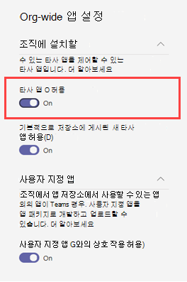
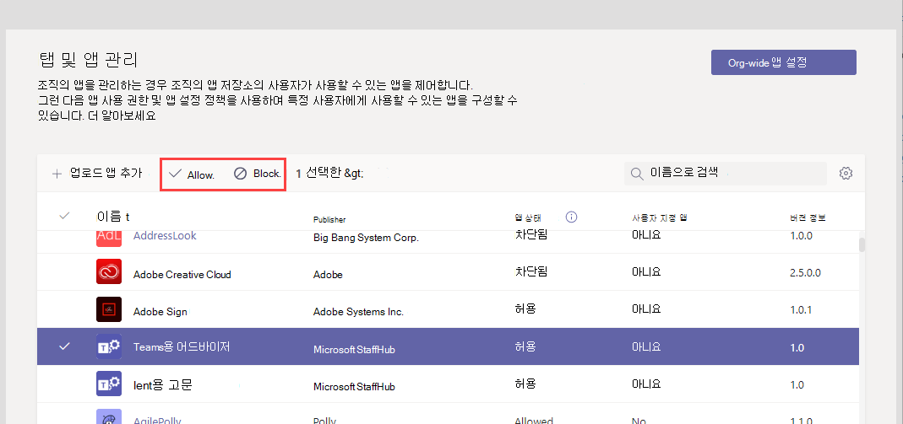

# Microsoft Teams의 리소스별 동의Resource-specific consent in Microsoft Teams

[!INCLUDE [preview-feature](includes/preview-feature.md)]

Microsoft Teams의 리소스별 동의를 통해 팀 소유자는 앱에 팀 데이터에 액세스하는 데 동의할 수 있습니다.Resource-specific consent in Microsoft Teams lets team owners give consent to apps to access team data. 이러한 액세스의 예로는 채널 메시지를 읽고, 채널을 만들고 삭제하고, 채널 탭을 만들고 제거할 수 있는 기능을 들 수 있습니다.Examples of such access include the ability to read channel messages, create and delete channels, and create and remove channel tabs.

관리자는 조직의 팀 소유자가 Azure AD(Azure Active Directory) PowerShell 모듈 또는 Azure Portal 및 Microsoft Teams 관리 센터를 사용하여 구성하는 설정을 통해 동의할 수 있는지 여부를 제어합니다.As an admin, you control whether team owners in your organization can give consent through settings that you configure by using the Azure Active Directory (Azure AD) PowerShell module or the Azure portal and the Microsoft Teams admin center.  

## 팀 소유자가 앱에 동의할 수 있는지 여부 설정Set whether team owners can give consent to apps

다음은 팀 소유자가 앱에 동의할 수 있는지 여부를 제어하기 위해 설정해야 하는 설정입니다.Here are the settings that you must set to control whether team owners can give consent to apps. 다음 설정을 모두 검토해야 합니다.Be sure to review all the following settings.

### Azure AD의 설정Settings in Azure AD

다음 두 설정은 팀 소유자가 앱에 동의할 수 있는지 여부를 확인합니다.The following two settings determine whether team owners can give consent to apps.

> [!IMPORTANT]
> 이러한 설정을 변경해도 이미 동의가 부여된 앱의 데이터 액세스에는 영향을 주지 않습니다.Changing any of these settings doesn't affect data access for apps that were already granted consent. 예를 들어 팀 소유자가 동의하지 못하도록 이러한 설정을 구성하는 경우 이러한 변경 내용은 이미 부여된 데이터 액세스를 제거하지 않습니다.For example, if you configure these settings to prevent team owners from giving consent, these changes don't remove data access that's already been granted.

#### "사용자가 회사 데이터를 대신하여 액세스하는 앱에 동의할 수 있습니다" 설정The "Users can consent to apps accessing company data on their behalf" setting

이 설정은 조직의 사용자가 해당 사용자를 대신하여 앱에 동의할 수 있는지 여부를 제어합니다.This setting controls whether users in your organization can consent to apps on their behalf. 팀 소유자가 동의할 수 있도록 설정하려면 이 설정을 예로 **설정해야 합니다.**To enable team owners to give consent, this setting must be set to **Yes**. 이 설정을 관리하기 위해 다음을 합니다.To manage this setting, do the following:

1. Azure Portal에서 Enterprise **애플리케이션 사용자**  >  **설정으로 이동합니다.**In the Azure portal, go to **Enterprise applications** > **User settings**.
2. **엔터프라이즈 애플리케이션에서**  사용자가 회사 데이터를 대신하여 아니요 또는 예로 액세스하는 앱에 **동의할** 수 있도록 설정할 **수 있습니다.**Under **Enterprise applications**, set **Users can consent to apps accessing company data on their behalf** to **No** or **Yes**.

PowerShell을 사용하여 이 설정을 관리할 수 있습니다.You can also manage this setting using PowerShell. 자세한 내용은 [애플리케이션에 사용자 콘텐츠 구성을 참조하세요.](/azure/active-directory/manage-apps/configure-user-consent#configure-user-consent-to-applications)To learn more, see [Configure user content to applications](/azure/active-directory/manage-apps/configure-user-consent#configure-user-consent-to-applications).

#### "EnableGroupSpecificConsent" 설정The "EnableGroupSpecificConsent" setting

이 설정은 조직의 사용자가 소유한 그룹에 대한 회사 데이터에 액세스하는 앱에 동의할 수 있는지 여부를 제어합니다.This setting controls whether users in your organization can consent to apps accessing company data for the groups that they own. 팀 소유자가 동의를 제공하려면 이 설정을 사용하도록 설정해야 합니다.This setting must be enabled for team owners to give consent. PowerShell을 사용하여 이 설정을 관리하는 방법에 대한 단계는 그룹 데이터에 액세스하는 앱에 대한 그룹 소유자 동의 [구성을 참조하세요.](/azure/active-directory/manage-apps/configure-user-consent#configure-group-owner-consent-to-apps-accessing-group-data)For steps on how to manage this setting by using PowerShell, see [Configure group owner consent to apps accessing group data](/azure/active-directory/manage-apps/configure-user-consent#configure-group-owner-consent-to-apps-accessing-group-data).

### Microsoft Teams 관리 센터의 설정Settings in the Microsoft Teams admin center

Azure AD의 설정 외에도  앱 관리 페이지의 전체  앱 설정, 앱 관리 페이지에서 앱이 차단되거나 허용되는지  여부, 팀 소유자에게 할당된 앱 권한 정책은 팀 소유자가 동의할 수 있는지 여부를 확인합니다. In addition to settings in Azure AD, [org-wide app settings](manage-apps.md#manage-org-wide-app-settings) on the [Manage apps](manage-apps.md) page, whether an app is blocked or allowed on the [Manage apps](manage-apps.md#allow-and-block-apps) page, and the [app permission policy](teams-app-permission-policies.md) assigned to the team owner determine whether a team owner can give consent.

> [!IMPORTANT]
> 이러한 설정을 변경해도 이미 동의가 부여된 앱의 데이터 액세스에는 영향을 주지 않습니다.Changing any of these settings doesn't affect data access for apps that were already granted consent. 예를 들어 타사 앱을 전체적으로 사용하지 않도록 설정하거나 팀 소유자가 동의하지 못하도록 특정 앱을 차단하는 경우 이러한 변경 내용은 이미 부여된 데이터 액세스를 제거하지 않습니다.For example, if you disable third-party apps org-wide or if you block specific apps to prevent team owners from giving consent, these changes don't remove data access that's already been granted.  

#### 전체 앱 설정의 "타사 앱 허용" 설정The "Allow third party apps" setting in org-wide app settings

조직 전체 앱 설정은 조직의 사용자가 타사 앱을 사용할 수 있는지 여부를 제어합니다.This org-wide app setting controls whether users in your organization can use third-party apps. 이 설정은 팀 소유자가 동의할 수 있도록 설정해야 합니다.This setting must be on to enable team owners to give consent. 이 설정을 관리하기 위해 다음을 합니다.To manage this setting, do the following:

1. Microsoft Teams 관리 센터의 왼쪽 탐색에서 **Teams Apps** 관리 앱으로 이동한 다음,  >   **Org-wide 앱 설정을 클릭합니다.**In the left navigation of the Microsoft Teams admin center, go to **Teams apps** > **Manage apps**, and then click **Org-wide app settings**.
2. 타사 **앱에서** 타사 앱 허용 을 **끄거나 끄기**Under **Third party apps**, turn off or turn on **Allow third party apps**.

    

변경 내용이 적용되는 데 최대 24시간이 걸릴 수 있습니다.You may have to wait up to 24 hours for your changes to take effect.

#### Org 수준에서 앱 허용 또는 차단Allow or block the app at the org level

앱 관리 페이지에서 앱을 차단하거나 허용하면 해당 앱이 차단되거나 조직의 모든 사용자에게 허용됩니다. When you block or allow an app on the [Manage apps](manage-apps.md#allow-and-block-apps) page, that app is blocked or allowed for all users in your organization. 팀 소유자는 앱이 허용되는 경우 앱에 동의할 수 있습니다.Team owners can only give consent to an app if the app is allowed. 오그 수준에서 앱을 허용하거나 차단하기 위해 다음을 실행합니다.To allow or block an app at the org level, do the following:

1. Microsoft Teams 관리 센터의 왼쪽 탐색 창에서 **Teams 앱** > **앱 관리** 로 이동합니다.In the left navigation of the Microsoft Teams admin center, go to **Teams apps** > **Manage apps**.
2. 앱 관리 페이지에서 앱을 선택한 다음 차단을 클릭하여 차단하거나 허용을 **클릭합니다.** On the Manage apps page, select the app, and then click **Block** to block it or click **Allow** to allow it.

    

#### 팀 소유자에 할당된 앱 권한 정책App permission policy assigned to the team owner

팀 소유자는 앱 사용 권한 정책이 실행될 수 있도록 앱에 동의할 수 있습니다.Team owners can only give consent to apps that their app permission policy allows them to run. 팀 소유자에게 할당된 앱 사용 권한 정책을 보고 관리하려면 다음을 실행합니다.To view and manage the app permission policy that's assigned to a team owner, do the following:

1. Microsoft Teams 관리 센터의 왼쪽 탐색에서 사용자로 **이동합니다.**In the left navigation of the Microsoft Teams admin center, go to **Users**.
2. 팀 소유자의 표시 이름을 두 번 클릭한 다음 정책을 **클릭합니다.**Double-click the display name of the team owner, and then click **Policies**.
3. 팀 소유자에게 할당된 정책은 앱 권한 정책 **에 나열됩니다.**The policy assigned to the team owner is listed under **App permission policy**.
    - 다른 정책을 할당하려면 **편집을** 클릭한 다음 할당할 정책을 선택합니다.To assign a different policy, click **Edit**, and then select the policy that you want to assign.
    - 팀 소유자에게 할당된 정책 설정을 편집하려면 정책 이름을 클릭한 다음 원하는 내용을 변경합니다.To edit the settings of the policy that's assigned to the team owner, click the policy name, and then make the changes that you want.  

## 사용자 지정 앱 업로드Uploading custom apps

리소스별 동의를 사용하는 사용자 지정 앱(또한 알려진 사이드로드)을 업로드할 때 앱이 설치되는 테넌트에서 제공되어야 합니다.When uploading a custom app (also known sideloading) that uses resource-specific consent, the app must come from the tenant that it's being installed to. 즉, Azure AD 앱 등록은 이 테넌트에서 제공되어야 합니다.In other words, the Azure AD app registration must be from this tenant. 전역 관리자는 이 제한이 면제되고 모든 테넌트에서 사용자 지정 앱을 팀(사이드로드) 또는 테넌트 앱 카탈로그에 직접 업로드할 수 있습니다.Global admins are exempted from this restriction, and can upload custom apps from any tenant, either directly to a team (sideloading) or to the tenant app catalog.

## 관련 항목Related topics

- [사용 가능한 RSC 권한Available RSC permissions](/microsoftteams/platform/graph-api/rsc/resource-specific-consent)
- [Microsoft GraphMicrosoft Graph](https://developer.microsoft.com/graph)
- [Microsoft Teams 관리 센터에서 앱 관리Manage your apps in the Microsoft Teams admin center](manage-apps.md)
- [Teams에서 앱 사용 권한 정책 관리Manage app permission policies in Teams](teams-app-permission-policies.md)