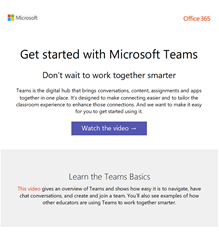
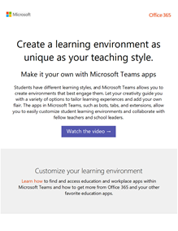
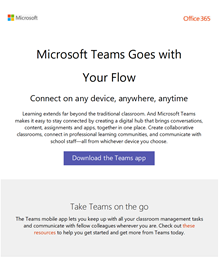
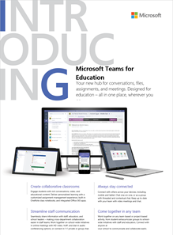

교육 관리자를 위한 Microsoft 팀 리소스
==============================================

## 채택 콘텐츠

학교 정보 및 로고를 사용 하 여 사용자 지정 된 전자 메일 메시지, 포스터, 안내물을 만듭니다. 또는 Microsoft 팀에 대 한 조직의 흥미를 얻을 수 있는 포스터, 안내물, 기타 유인물을 사용 하세요.

|사용자 지정 가능한 전자 메일 서식 파일 |         |
|---------|---------|
|**팀 기본 사항 알아보기** [.Zip 파일 다운로드](https://github.com/MicrosoftDocs/OfficeDocs-SkypeForBusiness/blob/live/Teams/downloads/edu-resources/getting-started.zip?raw=true)     |**학습 환경 사용자 지정** [.Zip 파일 다운로드](https://github.com/MicrosoftDocs/OfficeDocs-SkypeForBusiness/blob/live/Teams/downloads/edu-resources/customize-learning.zip?raw=true)        |
|**팀에서 워크플로를 간소화 하는 방법 보기** [.Zip 파일 다운로드](https://github.com/MicrosoftDocs/OfficeDocs-SkypeForBusiness/blob/live/Teams/downloads/edu-resources/workflows.zip?raw=true)      |**전문가와 유사 하 게 채팅 하는 방법 알아보기** [.Zip 파일 다운로드](https://github.com/MicrosoftDocs/OfficeDocs-SkypeForBusiness/blob/live/Teams/downloads/edu-resources/chat.zip?raw=true)         |
|**이동 중에 팀 수강** [.Zip 파일 다운로드](https://github.com/MicrosoftDocs/OfficeDocs-SkypeForBusiness/blob/live/Teams/downloads/edu-resources/get-teams.zip?raw=true)     |          |

|맞춤형 사용자 지정 및 사전 인쇄 전단 및 포스터  |        |
|---------|---------|
|**Microsoft 팀에 교육-값 소개** [사용자 지정 .docx 파일 다운로드](https://github.com/MicrosoftDocs/OfficeDocs-SkypeForBusiness/blob/live/Teams/downloads/edu-resources/teams-edu-customizable-poster-intro-values.docx?raw=true) [미리 인쇄 된 .pdf 파일 다운로드](https://github.com/MicrosoftDocs/OfficeDocs-SkypeForBusiness/blob/live/Teams/downloads/edu-resources/teams-edu-posters-values.pdf?raw=true)     |**Microsoft의 교육 팀 소개-기능** [사용자 지정 .docx 파일 다운로드](https://github.com/MicrosoftDocs/OfficeDocs-SkypeForBusiness/blob/live/Teams/downloads/edu-resources/team-edu-customizable-poster-intro-features.docx?raw=true) [미리 인쇄 된 .pdf 파일 다운로드](https://github.com/MicrosoftDocs/OfficeDocs-SkypeForBusiness/blob/live/Teams/downloads/edu-resources/teams-edu-poster-features.pdf?raw=true)           |
|**Microsoft 팀 구성원-값을 사용 하 여 능력 강화** [사용자 지정 .docx 파일 다운로드](https://github.com/MicrosoftDocs/OfficeDocs-SkypeForBusiness/blob/live/Teams/downloads/edu-resources/teams-edu-customizable-poster-empower-values.docx?raw=true) [미리 인쇄 된 .pdf 파일 다운로드](https://github.com/MicrosoftDocs/OfficeDocs-SkypeForBusiness/blob/live/Teams/downloads/edu-resources/teams-edu-posters-values.pdf?raw=true)    |**Microsoft 팀의 역량 강화-기능** [사용자 지정 .docx 파일 다운로드](https://github.com/MicrosoftDocs/OfficeDocs-SkypeForBusiness/blob/live/Teams/downloads/edu-resources/teams-edu-customizable-poster-empower-features.docx?raw=true) [미리 인쇄 된 .pdf 파일 다운로드](https://github.com/MicrosoftDocs/OfficeDocs-SkypeForBusiness/blob/live/Teams/downloads/edu-resources/teams-edu-poster-features.pdf?raw=true)           |
|**교육용 Microsoft 팀의 가치** [사용자 지정 .docx 파일 다운로드](https://github.com/MicrosoftDocs/OfficeDocs-SkypeForBusiness/blob/live/Teams/downloads/edu-resources/teams-edu-customizable-flyer-values.docx?raw=true) [미리 인쇄 된 .pdf 파일 다운로드](https://github.com/MicrosoftDocs/OfficeDocs-SkypeForBusiness/blob/live/Teams/downloads/edu-resources/teams-edu-flyer-values.pdf?raw=true)     |**Microsoft 교육 팀의 기능** [사용자 지정 .docx 파일 다운로드](https://github.com/MicrosoftDocs/OfficeDocs-SkypeForBusiness/blob/live/Teams/downloads/edu-resources/teams-edu-customizable-flyer-values.docx?raw=true) [미리 인쇄 된 .pdf 파일 다운로드](https://github.com/MicrosoftDocs/OfficeDocs-SkypeForBusiness/blob/live/Teams/downloads/edu-resources/teams-edu-flyer-features.pdf?raw=true)         |

|인쇄 준비 된 패킷  |        |
|---------|---------|
|**Microsoft 팀의 교육 시작-팁 및 요령** [미리 인쇄 된 .pdf 파일 다운로드](https://github.com/MicrosoftDocs/OfficeDocs-SkypeForBusiness/blob/live/Teams/downloads/edu-resources/teams-edu-packet-get-started.pdf?raw=true)     |

## 조치 사항

- 실무 [Microsoft 팀 대화형 데모](https://teamsdemo.office.com/) 를 확인 하세요 (완료 하는 데 5 분).
- [Microsoft 365 관리 센터](https://portal.office.com/adminportal/home#/Settings/ServicesAndAddIns) 에서 microsoft 팀 설정 (Office 365 관리자로 로그인)
- 팀 클라이언트 다운로드: [모든 장치에서 팀 가져오기](https://teams.microsoft.com/downloads)
- [교육 도움말 센터](https://support.office.com/education) 의 Office 365에 대 한 자세한 정보

## 추가 리소스

- [Microsoft 팀 로드맵](https://aka.ms/teamsroadmap)
- 당사의 [기술 커뮤니티 블로그](https://techcommunity.microsoft.com/t5/Microsoft-Teams-Blog/bg-p/MicrosoftTeamsBlog) 를 최신 상태로 유지
- Matt Soseman "생산적인 구름" 블로그 [Microsoft 팀 PowerShell 지원](https://blogs.technet.microsoft.com/skypehybridguy/2017/11/07/microsoft-teams-powershell-support/) 정보
- [제안 보내기](https://aka.ms/eduuservoice)
- [고객 지원 문의](https://aka.ms/o365portal)
- [팀 커뮤니티에 게 질문 하기](https://aka.ms/msteamscommunity)
- [교육용 추가 리소스 찾기](https://education.microsoft.com/)

