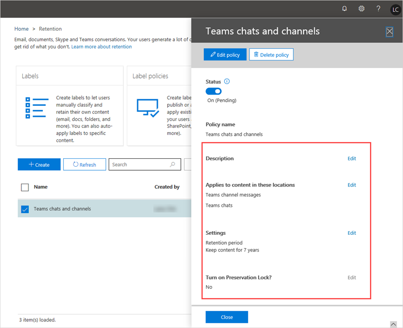

# Microsoft Teams의 보존 정책Retention policies in Microsoft Teams

보존 정책은 조직에서 정보를 더 효과적으로 관리하는 데 도움이 됩니다.Retention policies help you to more effectively manage the information in your organization. 보존 정책을 사용하여 조직의 내부 정책, 업계 규제 또는 법적 요구 사항을 준수하는 데 필요한 데이터를 유지하고, 책임으로 간주되거나, 더 이상 유지할 필요가 없거나 또는 법적 혹은 비즈니스적 가치가 없는 데이터를 삭제합니다.Use retention policies to keep data that's needed to comply with your organization's internal policies, industry regulations, or legal needs, and to delete data that's considered a liability, that you're no longer required to keep, or has no legal or business value.

보존 정책, 사용자 삭제, 관리자 삭제 등을 통해 콘텐츠를 삭제 하려고 하지 않는 한 기본적으로 팀 채팅, 채널 및 파일 데이터는 무기한 유지 됩니다. 관리자는 채팅 및 채널 메시지에 대 한 팀 보존 정책을 설정 하 고 데이터 유지, 삭제 또는 특정 기간 동안 보존 하도록 사전에 결정 하 고 삭제할 수 있습니다.By default, Teams chat, channel, and files data are retained indefinitely, unless there is an attempt to delete the content via retention policies, user deletes, admin deletes etc. As an admin, you can set up Teams retention policies for chat and channel messages and decide proactively whether to retain the data, delete it, or retain it for a specific period of time and then delete it.

[Microsoft 365 준수 센터](https://protection.office.com/) 에서 팀과 기타 작업 부하에 대 한 보존 정책을 만들고 관리 하거나 보안 & 준수 센터 PowerShell cmdlet을 사용 합니다.You create and manage retention policies for Teams and other workloads in the [Microsoft 365 compliance center](https://protection.office.com/) or by using the Security & Compliance Center PowerShell cmdlets. Teams 보존 정책을 전체 조직 또는 특정 사용자 및 팀에 적용할 수 있습니다.You can apply a Teams retention policy to your entire organization or to specific users and teams.

> [!NOTE]
> 아직 개인 채널 메시지 보존에 대 한 구성은 지원 하지 않습니다.We don't yet support configuration for retention of private channel messages. 비공개 채널에서 공유된 파일의 보존이 지원됩니다.Retention of files shared in private channels is supported.

Microsoft 365 또는 Office 365의 보존 정책에 대해 자세히 알아보려면 [보존 정책 개요](https://support.office.com/article/overview-of-retention-policies-5e377752-700d-4870-9b6d-12bfc12d2423)를 참조 하세요.To learn more about retention policies for Microsoft 365 or Office 365, see [Overview of retention policies](https://support.office.com/article/overview-of-retention-policies-5e377752-700d-4870-9b6d-12bfc12d2423).

## Teams에 대한 보존 정책은 무엇인가요?What are retention policies for Teams?

Teams 또는 다른 작업에 대한 보존 정책을 설정할 때 다음과 같이 설정할 수 있습니다.When you set up a retention policy for Teams or any other workload, you can set them up to:

- **데이터 보존**: 사용자 앱에서 일어나는 일과 관계없이 보존 정책을 사용하여 일정 기간 데이터를 보존합니다.**Retain data**: Use a retention policy to ensure that your data is retained for a specified period of time, regardless of what happens in the user app. 데이터는 규정 준수를 위해 보존되며 보존 기간이 만료될 때까지 eDiscovery에서 사용할 수 있으며, 이후 정책에 따라 아무런 작업도 수행하지 않을지 또는 데이터를 삭제할 것인지가 표시됩니다.Data is retained for compliance reasons and is available for eDiscovery until the retention period expires, after which your policy indicates whether to do nothing or delete the data. 예를 들어, 채널 메시지를 7년간 보존하는 Teams 보존 정책을 만드는 경우 사용자가 Teams에서 메시지를 삭제하더라도 7년 동안 eDiscovery를 위해 메시지가 보존됩니다.For example, if you create a Teams retention policy to retain channel messages for 7 years, the messages are retained for eDiscovery for 7 years, even if users delete their messages in Teams.
- **데이터 삭제**: 보존 정책을 사용하여 데이터를 삭제하고, 조직의 책임을 해소합니다.**Delete data**: Use a retention policy to delete data to ensure that it's not a liability for your organization. Teams 보존 정책을 통해 데이터를 삭제하면 Teams 서비스의 모든 저장 위치에서 영구적으로 삭제됩니다.With a Teams retention policy, when you delete data, it's permanently deleted from all storage locations on the Teams service.

Teams 보존 정책을 통해 다음을 수행할 수 있습니다.With retention policies for Teams, you can:

- Teams 채팅 및/또는 채널 메시지를 일정 기간 유지하고 아무런 작업도 수행하지 않습니다.Retain Teams chats and/or channel messages for a specified duration and then do nothing.
- Teams 채팅 및/또는 채널 메시지를 일정 기간 유지하고 데이터를 삭제합니다.Retain Teams chats and/or channel messages for a specified duration and then delete the data.
- Teams 채팅 및/또는 채널 메시지를 일정 기간 유지하고 아무런 작업도 수행하지 않습니다.Delete Teams chats and/or channel messages after a specified duration.

> [!NOTE]
> Teams에서 사용자가 비공개 채팅에서 공유하는 파일은 파일을 공유한 사용자의 비즈니스용 OneDrive 계정에 저장됩니다.Remember that in Teams, files that users share in private chats are stored in the OneDrive for Business account of the user who shared the file. 또한 팀 구성원이 채널 대화에 업로드하는 파일은 팀의 SharePoint 사이트에 저장됩니다.And, files that team members upload to a channel conversation are stored in the team's SharePoint site. 따라서 Teams에서 파일을 보존하거나 삭제하려면 비즈니스용 OneDrive 및 SharePoint Online에 적용되는 보존 정책을 만듭니다.Therefore, to retain or delete files in Teams, create retention policies that apply to OneDrive for Business and SharePoint Online.

데이터에 보존 정책이 적용되는 경우 데이터가 원래 위치에 그대로 유지되므로 사용자는 계속해서 작업할 수 있습니다.When data is subject to a retention policy, users can continue to work with it because the data is retained in place, in its original location. 사용자가 정책의 대상이 되는 데이터를 편집하거나 삭제하는 경우 정책이 적용되는 동안 보존되는 안전한 위치에 사본이 저장됩니다.If a user edits or deletes data that's subject to the policy, a copy is saved to a secure location where it's retained while the policy is in effect.

보존 정책에 대한 최소 라이선스 요구 사항은 Office 365 E3입니다.The minimum licensing requirement for retention policies is Office 365 E3. 라이선스에 대해 자세히 알아보려면 [Microsoft 팀 서비스 설명을](https://docs.microsoft.com/office365/servicedescriptions/teams-service-description)참조 하세요.To learn more about licensing, see [Microsoft Teams service description](https://docs.microsoft.com/office365/servicedescriptions/teams-service-description).

## Teams 보존 정책 작동 방식How Teams retention policies work

팀 채팅은 채팅에 있는 각 사용자의 사서함에 숨겨진 폴더 (Teamschat)에 저장 되며, 팀 채널 메시지는 그룹 사서함의 숨겨진 폴더 (Teamschat)에 저장 됩니다.Teams chats are stored in a hidden folder (Teamschat) in the mailbox of each user in the chat, and Teams channel messages are stored in a hidden folder(Teamschat) in the group mailbox for a team. Teams가 사용하는 Azure 기반 채팅 서비스에서도 이 데이터를 저장하고 기본적으로 이 서비스는 데이터를 영구적으로 저장합니다.Teams uses an Azure-powered chat service that also stores this data, and by default this service stores the data forever. Teams 보존 정책을 사용하여 데이터를 삭제하면 Exchange 사서함과 기본 채팅 서비스 모두에서 데이터가 영구적으로 삭제됩니다.With a Teams retention policy, when you delete data, the data is permanently deleted from both the Exchange mailboxes and the underlying chat service.

팀 대화방 또는 채널 메시지에 **보존** 정책을 적용 하면 다음과 같은 현상이 발생 합니다.When you apply a **retention-hold** policy to Teams chats or channel messages, here's what happens:

- 보존 기간 동안 사용자가 채팅 또는 채널 메시지를 편집 하거나 삭제 한 경우에는 메시지가 복사 (편집 된 경우) 되거나 이동 (삭제 된 경우) 하 고 보존 기간이 만료 될 때까지이 폴더에 저장 됩니다.If a chat or channel message is edited or deleted by a user during the retention-hold period, the message is copied (if it was edited) or moved (if it was deleted) to the SubstrateHolds folder and stored there until the retention period expires. 보존 기간이 만료될 때 데이터를 삭제하도록 정책을 구성하면 메시지는 보존 기간이 만료되는 날에 영구적으로 삭제됩니다.If the policy is configured to delete data when the retention period expires, messages are permanently deleted on the day the retention period expires.
- **보존** 기간 동안 사용자가 채팅 또는 채널 메시지를 삭제 하지 않으면 보존 기간이 만료 된 후 1 일 내에 메시지가 하위 Strate보류가 포함 된 폴더로 이동 합니다.If a chat or channel message isn't deleted by a user during the **retention-hold** period, the message is moved to the SubstrateHolds folder within one day after the retention period expires. 보존 기간이 만료될 때 데이터를 삭제하도록 정책을 구성하면 메시지가 폴더로 이동된 후 하루가 지나면 메시지가 영구적으로 삭제됩니다.If the policy is configured to delete data when the retention period expires, the message is permanently deleted one day after it's moved to the folder.

팀 대화방 및 채널 메시지에 **보존-삭제** 정책을 적용 하면 다음과 같은 현상이 발생 합니다.When you apply a **retention-delete** policy to Teams chats and channel messages, here's what happens:

- 채팅 또는 채널 메시지가 만료 되는 경우 (예: **보존-삭제** 정책, 백 엔드 서비스)가 만료 된 메시지를 식별 하 고 백엔드 저장소 (사용자 또는 그룹 사서함)에서 삭제를 시작 하는 메시지의 보관 기간When a chat or channel message expires i.e. age of message is more than allowed by **retention-delete** policy, a back-end service, identifies expired messages and starts deleting them in the backend storage (user or group mailbox). 
- 백 엔드 저장소에서 메시지가 삭제 되 면 프로세스가 트리거되어 Azure가 제공 하는 채팅 서비스와 사용자의 팀 앱에서 같은 메시지를 삭제 합니다.Once a message is deleted in back-end storage, a process is triggered to delete the same message in the Azure-powered chat service and user’s Teams app. 팀 앱에서 메시지를 삭제 하려면 앱이 인터넷에 연결 되어 있고 유휴 상태 (사용자 활동 없음)에 있어야 삭제 프로세스가 사용자 환경을 방해 하지 않습니다.For the messages to be deleted in Teams app, the app needs to be connected to internet and to be in idle state (no user activity), so that the deletion process would not interfere in user experience. 사용자에 게 여러 장치가 있을 수 있으며, 다른 상태에 있을 수 있으므로 보존 삭제가 동시에 해당 장치와 동기화 되지 않습니다.Since a user might have multiple devices, which might be in different states, retention deletes would not sync up with those devices at exactly same time.
- 백 엔드 저장소에서 메시지 삭제가 완료 되 면 eDiscovery와 같은 준수 검색 보고서에 표시 되는 메시지가 중지 됩니다.Once the deletion of messages in backend storage is complete, those messages will stop showing up in compliance search reports such as eDiscovery.

> [!NOTE]
> 비즈니스용 Skype Online 및 Teams interop 채팅에도 동일한 흐름이 적용됩니다.The same flow works for Skype for Business Online and Teams interop chats. 비즈니스용 Skype Online 채팅이 Teams로 이동하는 경우 해당 채팅은 Teams 채팅 스레드에서 메시지가 되고 해당 사서함에 수집됩니다.When a Skype for Business Online chat comes into Teams, it becomes a message in a Teams chat thread and is ingested into the appropriate mailbox. Teams 보존 정책은 이러한 메시지를 Teams 스레드에서 삭제합니다.Teams retention policies will delete these messages from the Teams thread. 그러나 비즈니스용 Skype Online 및 비즈니스용 Skype Online 클라이언트 쪽에서 대화 기록을 켜는 경우, 채팅 데이터는 사서함에 저장되고 Teams 보존 정책에 의해 처리되지 않습니다.However, if conversation history is turned on for Skype for Business Online and from the Skype for Business Online client side those are being saved into a mailbox, that chat data isn't handled by a Teams retention policy.

> [!NOTE]
> 메시지 삭제는 영구적 이며 되돌릴 수 없습니다.The deletion of messages is permanent and irreversible.

Teams의 보존 정책은 채팅 또는 채널 메시지가 생성된 날짜를 기준으로 하며 소급 적용됩니다.Retention policies in Teams are based on the date the chat or channel messages were created and are retroactive. 즉, 90일보다 오래된 데이터를 삭제하는 보존 정책을 만드는 경우 90일 전에 생성된 Teams 데이터가 삭제됩니다.In other words, if you create a retention policy to delete data older than 90 days, Teams data created more than 90 days ago is deleted.

SharePoint Online 또는 비즈니스 용 OneDrive에 적용되는 보존 정책은 해당 메시지가 삭제되기 전에 Teams 채팅 또는 채널 메시지에서 참조되는 파일을 삭제할 수 있습니다.It's possible that a retention policy that's applied to SharePoint Online or OneDrive for Business could delete a file that's referenced in a Teams chat or channel message before those messages get deleted. 이 시나리오에서는 파일이 Teams 메시지에 여전히 표시되지만, 사용자가 파일을 클릭하면 "파일을 찾을 수 없음" 오류가 발생합니다.In this scenario, the file will still show up in the Teams message, but when users click the file, they'll get a "File not found" error. 정책이 없을 때 누군가가 SharePoint Online 또는 비즈니스용 OneDrive에서 파일을 수동으로 삭제하는 경우에도 해당 문제가 발생할 수 있습니다.This can also happen in the absence of a policy, if someone manually deletes a file from SharePoint Online or OneDrive for Business.

### 고려 사항 및 제한 사항Considerations and limitations

다음은 Teams 보존 정책을 사용할 때 알아야 할 몇 가지 고려 사항과 제한 사항입니다.Here's some considerations and limitations to be aware of when working with Teams retention policies:

- Teams에는 다른 작업과는 별도의 보존 정책이 필요합니다.Teams requires a retention policy that's separate from other workloads. 즉, Teams 채팅 및/또는 채널 메시지에 대한 특정 보존 정책을 만들어야 합니다.In other words, you have to create specific retention policies for Teams chats and/or channel messages. 따라서 조직 전체 보존 정책에 Teams를 포함할 수 없습니다.For this reason, you can't include Teams in org-wide retention policies.

- 비공개 채널 메시지는 지원되지 않습니다.Private channel messages aren't supported. 현재 Teams의 보존 정책은 표준 채널 메시지에만 적용됩니다.At this time, retention policies for Teams only apply to standard channel messages.

- Teams는 키워드 또는 민감한 정보를 포함하는 콘텐츠에 정책을 적용하는 기능과 같은 고급 보존 설정을 지원하지 않습니다.Teams doesn't support advanced retention settings, such as the ability to apply a policy to content that contains keywords or sensitive information. 현재 Teams의 보존 정책은 모든 채팅 및/또는 채널 메시지 콘텐츠에 적용됩니다.Currently, retention policies in Teams apply to all chat and/or channel message content.

- 팀 보존 정책은 메시지 생성 날짜에 따라 해당 메시지가 만료 되는 경우 채팅 및 채널 메시지를 삭제 하는 프로세스를 트리거합니다.A Teams retention policy will trigger a process to delete chat and channel messages when those messages expire (based on message creation date). 그러나 서비스 로드에 따라 백엔드 저장소 및 팀 앱에서 이러한 메시지를 영구적으로 삭제 하는 데 최대 7 일이 걸릴 수 있습니다.However, depending on service load, it may take up-to seven days to permanently delete these messages from backend storage and Teams app. 또한 이러한 메시지는 사용자가 백엔드 저장소에서 영구적으로 삭제 될 때까지 준수 도구 (eDiscovery, 최종 사용자 검색)를 사용 하 여 검색할 수 있습니다.Also, these messages will be searchable with compliance tools (eDiscovery, end user search) till they are permanently deleted from backend storage.

### 복수의 보존 정책 및 보존 원칙Multiple retention policies and the principles of retention

기간이 다른 Teams 보존 정책을 여러 개 설정하는 경우 [보존 정책 원칙](https://docs.microsoft.com/microsoft-365/compliance/retention-policies#the-principles-of-retention-or-what-takes-precedence)이 적용됩니다.If you set up multiple Teams retention policies with varying durations, the [principles of retention policies](https://docs.microsoft.com/microsoft-365/compliance/retention-policies#the-principles-of-retention-or-what-takes-precedence) apply. 우선 순위에 대한 개요는 다음과 같습니다.Here's an overview of what takes precedence:

- 보존은 항상 삭제보다 우선합니다.Preservation always wins over deletion
- 가장 긴 보존 기간이 항상 우선합니다.Longest preservation period always wins
- 명시적 포함은 위치 측면에서 암시적 포함보다 우선합니다.Explicit inclusion wins over implicit inclusion in terms of locations
- 가장 짧은 삭제 기간이 우선합니다.Shortest deletion period wins

## Teams에 보존 정책을 사용하는 시기When to use retention policies for Teams

대부분의 경우 조직은 비공개 채팅 데이터를 일반적으로 프로젝트 관련 대화가 주를 이루는 채널 메시지보다 더 많은 책임으로 간주합니다.In many cases, organizations consider private chat data as more of a liability than channel messages, which are typically more project-related conversations.

비공개 채팅(1:1 또는 1:다수 채팅) 및 채널 메시지에 대해 별도의 보존 정책을 설정할 수 있습니다.You can set up separate retention policies for private chats (1:1 or 1:many chats) and channel messages. 조직의 특정 사용자 또는 팀에 적용되는 고유한 정책을 구성할 수도 있습니다.You can also configure unique policies that apply to specific users or teams in your organization. Teams 채팅의 경우 정책을 적용할 사용자를 선택할 수 있습니다.For Teams chats, you can select which users the policy applies to. Teams 채널 메시지의 경우 정책을 적용할 팀을 선택할 수 있습니다.For Teams channel messages, you can select which teams the policy applies to.

예를 들어 채널 메시지의 경우 조직의 특정 팀에는 1년 삭제 정책을 적용하고 다른 모든 팀에는 3년 삭제 정책을 적용할 수 있습니다.For example, for channel messages, you can apply a one-year deletion policy to specific teams in your organization and apply a three-year deletion policy to all other teams.

## Teams의 보존 정책 관리Manage retention policies for Teams

### 보안 및 준수 센터 사용Using the Security & Compliance Center

#### 보존 정책 만들기Create a retention policy

Teams 채팅 및 채널 메시지에 대한 보존 정책을 만들려면 다음을 수행합니다.To create a retention policy for Teams chats and channel messages, do the following:

1. 보안 및 준수 센터의 왼쪽 탐색에서 **정보 거버넌스** > **보존**으로 이동합니다.In the left navigation of the Security & Compliance Center, go to **Information governance** > **Retention**.
2. **만들기**를 선택합니다.Select **Create**.
3. **정책 이름 설정** 페이지에서 정책의 이름과 설명을 입력하고 **다음**을 클릭합니다.On the **Name your policy** page, enter a name and description for your policy, and then click **Next**.
4. **설정** 페이지에서 데이터의 보존, 삭제 또는 둘 다 수행을 지정하고 보존 기간을 선택한 후 **다음**을 클릭합니다.On the **Settings** page, specify whether you want to retain data, delete it, or both, the retention period, and then click **Next**.
5. **위치 선택** 페이지에서 다음을 수행한 후 **다음**을 클릭합니다.On the **Choose locations** page, do the following, and then click **Next**:

    - 채널 메시지에 정책을 적용하려면 **Teams 채널 메시지**를 켭니다.To apply the policy to channel messages, turn on **Teams channel messages**.  조직의 특정 팀에 정책을 적용하려면 **팀 선택**을 선택하고 원하는 팀을 선택합니다.If you want to apply the policy to specific teams in your organization, select **Choose teams**, and then select the teams that you want.
    - 채팅에 정책을 적용하려면 **Teams 채팅**을 켭니다.To apply the policy to chats, turn on **Teams chats**. 조직의 특정 사용자에게 정책을 적용하려면 **사용자 선택**을 선택하고 원하는 사용자를 선택합니다.If you want to apply the policy to specific users in your organization, select **Choose users**, and then select the users that you want.
      > [!NOTE]
      > **Teams 채널 메시지** 및/또는 **Teams 채팅**을 켜면 다른 모든 위치는 자동으로 꺼집니다.When you turn on **Teams channel messages** and/or **Teams chats**, all other locations are  automatically turned off. Teams 보존 정책에는 Teams 위치만 포함될 수 있습니다.A Teams retention policy can only include Teams locations.

        

      > [!IMPORTANT]
      > 팀 채팅 및 채널 메시지는 **Exchange 전자 메일** 또는 **Microsoft 365 그룹** 위치에서 사용자 또는 그룹 사서함에 적용 된 보존 정책의 영향을 받지 않습니다.Teams chats and channel messages aren't affected by retention policies applied to user or group mailboxes in the **Exchange email** or **Microsoft 365 groups** locations. Teams 채팅 및 채널 메시지가 Exchange에 저장되더라도 Teams 채팅 및 채널 메시지는 Teams 위치에 적용된 보존 정책의 영향만 받습니다.Even though Teams chats and channel messages are stored in Exchange, they're only affected by retention policies applied to the Teams locations.

6. 설정을 검토한 후 준비가 되면 **이 정책 만들기**를 선택합니다.Review your settings, and then when you're ready, select **Create this policy**.

#### 보존 정책 편집Edit a retention policy

Teams 보존 정책을 편집하려면 다음을 수행합니다.To edit a Teams retention policy, do the following:

1. 보안 및 준수 센터의 왼쪽 탐색에서 **정보 거버넌스** > **보존**으로 이동합니다.In the left navigation of the Security & Compliance Center, go to **Information governance** > **Retention**.
2. 보존 정책 목록에서 편집하려는 보존 정책 옆의 확인란을 선택합니다.In the list of retention policies, select the check box next to the retention policy you want to edit.
3. 편집하려는 항목 옆에 있는 **편집**을 선택하고 변경한 다음 **저장**을 클릭하고 **닫기**를 클릭합니다.Select **Edit** next to what you want to edit, make your changes, click **Save**, and then click **Close**.

    

#### 보존 정책 삭제Delete a retention policy

Teams 보존 정책을 삭제하려면 다음을 수행합니다.To delete a Teams retention policy, do the following:

1. 보안 및 준수 센터의 왼쪽 탐색에서 **정보 거버넌스** > **보존**으로 이동합니다.In the left navigation of the Security & Compliance Center, go to **Information governance** > **Retention**.
2. 보존 정책 목록에서 삭제하려는 보존 정책 옆의 확인란을 선택합니다.In the list of retention policies, select the check box next to the retention policy you want to delete.
3. **정책 삭제**를 선택합니다.Select **Delete policy**.

### PowerShell 사용Using PowerShell

[보안 & 준수 센터 PowerShell](https://docs.microsoft.com/powershell/exchange/office-365-scc/connect-to-scc-powershell/connect-to-scc-powershell)을 사용 하 여 팀 보존 정책을 만들고 관리 하려면 다음 cmdlet을 사용 합니다.To create and manage Teams retention policies by using [Security & Compliance Center PowerShell](https://docs.microsoft.com/powershell/exchange/office-365-scc/connect-to-scc-powershell/connect-to-scc-powershell), use the following cmdlets:

|정책Policy|규칙Rule|
|---|---|
|[새로운 RetentionCompliancePolicyNew-RetentionCompliancePolicy](https://docs.microsoft.com/powershell/module/exchange/policy-and-compliance-retention/new-retentioncompliancepolicy?view=exchange-ps)| [새로운 RetentionComplianceRuleNew-RetentionComplianceRule](https://docs.microsoft.com/powershell/module/exchange/policy-and-compliance-retention/new-retentioncompliancerule?view=exchange-ps)|
|[Get-RetentionCompliancePolicyGet-RetentionCompliancePolicy](https://docs.microsoft.com/powershell/module/exchange/policy-and-compliance-retention/get-retentioncompliancepolicy?view=exchange-ps)| [Get-RetentionComplianceRuleGet-RetentionComplianceRule](https://docs.microsoft.com/powershell/module/exchange/policy-and-compliance-retention/get-retentioncompliancerule?view=exchange-ps)|
|[Set-RetentionCompliancePolicySet-RetentionCompliancePolicy](https://docs.microsoft.com/powershell/module/exchange/policy-and-compliance-retention/set-retentioncompliancepolicy?view=exchange-ps)| [Set-RetentionComplianceRuleSet-RetentionComplianceRule](https://docs.microsoft.com/powershell/module/exchange/policy-and-compliance-retention/set-retentioncompliancerule?view=exchange-ps)|
|[제거-RetentionCompliancePolicyRemove-RetentionCompliancePolicy](https://docs.microsoft.com/powershell/module/exchange/policy-and-compliance-retention/remove-retentioncompliancepolicy?view=exchange-ps)| [제거-RetentionComplianceRuleRemove-RetentionComplianceRule](https://docs.microsoft.com/powershell/module/exchange/policy-and-compliance-retention/remove-retentioncompliancerule?view=exchange-ps)|

## 알려진 문제Known issues

현재 추적 및 조사 중인 Teams의 보존 정책에 대한 알려진 문제는 다음과 같습니다.The following are known issues for retention policies in Teams that are being tracked and investigated.

- **팀 채널 메시지** 위치 행의 **팀 선택** 에서 팀이 아닌 Microsoft 365 그룹이 표시 될 수 있습니다.Under **Choose teams** in the **Teams channel messages** location row, you may see Microsoft 365 Groups that aren't also Teams. 이 문제는 앞으로 해결될 예정입니다.This will be addressed in the future.

- **Teams 채팅** 위치 행의 **사용자 선택**에서 게스트 및 비사서함 사용자가 표시될 수 있습니다.Under **Choose users** in the **Teams chats** location row, you may see guests and non-mailbox users. 보존 정책은 게스트에 대한 설정이 아니며 목록에서 제거하기 위해 해결 중에 있습니다.Retention policies aren't meant to be set for guests, and we're working to remove these from the list.

- ELC(Exchange 수명 주기 도우미)는 매일 실행되지만, 7일의 SLA를 포함합니다.Exchange Life Cycle assistant (ELC) runs daily, but it has an SLA of 7 days. 따라서 60일보다 오래된 항목을 삭제하는 Teams 보존 정책이 있는 경우 이러한 항목은 최대 67일 동안 보존될 수 있습니다.As a result, it's possible that, if you have a Teams retention policy to delete items older than 60 days, these items could persist for up to 67 days. 이것은 새로운 상황이 아니며 Exchange 모델을 따릅니다.This isn't a new situation - it follows the Exchange model. 물론 대부분의 경우 지연되지 않습니다.Of course, in most cases, there's no delay.

## 관련 항목Related topics

- [보존 정책 개요Overview of retention policies](https://support.office.com/article/overview-of-retention-policies-5e377752-700d-4870-9b6d-12bfc12d2423)
