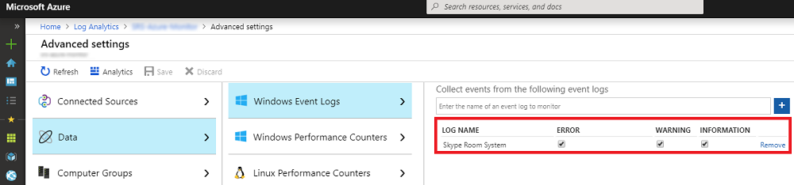

# <a name="deploy-no-loc-textmicrosoft-teams-rooms-management-with-no-loc-textazure-monitor"></a>관리 배포 대상 :::no-loc text="Microsoft Teams Rooms"::::::no-loc text="Azure Monitor":::

이 문서에서는를 사용 하 여 통합 된 디바이스의 종단 간 관리를 설정 하 고 배포 하는 방법에 대해 설명 :::no-loc text="Microsoft Teams Rooms"::: :::no-loc text="Azure Monitor"::: 합니다.

내에서 구성 하 여 회의실 :::no-loc text="Log Analytics"::: :::no-loc text="Azure Monitor"::: 장치를 관리 하는 데 도움이 되는 기본 원격 분석 및 알림을 제공할 수 있습니다 :::no-loc text="Microsoft Teams Rooms"::: . 관리 솔루션이 완성 됨에 따라 추가 데이터 및 관리 기능을 배포 하 여 디바이스 가용성 및 성능에 대 한 자세한 뷰를 만들 수 있습니다.

이 가이드를 팔 로우 하 여 다음 예제와 같은 대시보드를 사용 하 여 장치 가용성, 응용 프로그램 및 하드웨어 상태, :::no-loc text="Microsoft Teams Rooms"::: 응용 프로그램 및 운영 체제 버전 배포에 대 한 자세한 상태 보고를 얻을 수 있습니다.


상위 수준에서 다음 작업을 수행 해야 합니다.


1. [구성 유효성 검사 :::no-loc text="Log Analytics":::](azure-monitor-deploy.md#validate_LogAnalytics)
2. [관리 설정에 맞게 테스트 장치 구성 :::no-loc text="Log Analytics":::](azure-monitor-deploy.md#configure_test_devices)
3. [사용자 지정 필드 매핑](azure-monitor-deploy.md#Custom_fields)
4. [:::no-loc text="Microsoft Teams Rooms":::에서 보기 정의:::no-loc text="Log Analytics":::](azure-monitor-deploy.md#Define_Views)
5. [알림 정의](azure-monitor-deploy.md#Alerts)
6. [모든 장치에서 모니터링 하도록 구성](azure-monitor-deploy.md#configure_all_devices)
7. [추가 :::no-loc text="Azure Monitor"::: 솔루션 구성](azure-monitor-deploy.md#Solutions)

> [!IMPORTANT]
> 최소 구성에서 :::no-loc text="Azure Monitor"::: :::no-loc text="Log Analytics"::: 운영 체제를 실행 하는 컴퓨터를 모니터링할 수 있지만 :::no-loc text="Windows"::: , :::no-loc text="Microsoft Teams Rooms"::: 모든 장치에 에이전트 배포를 시작 하기 전에 수행 해야 하는 몇 가지 특정 단계가 있습니다 :::no-loc text="Microsoft Teams Rooms"::: .
> 따라서 제어 된 설정 및 구성에 대 한 올바른 순서 대로 모든 구성 단계를 수행 하는 것이 좋습니다. 최종 결과의 품질은 초기 구성의 품질에 따라 크게 달라 집니다.

## <a name="validate-no-loc-textlog-analytics-configuration"></a>구성 유효성 검사 :::no-loc text="Log Analytics":::
<a name="validate_LogAnalytics"> </a>

:::no-loc text="Log Analytics":::장치에서 로그 수집을 시작 하려면 작업 영역이 있어야 :::no-loc text="Microsoft Teams Rooms"::: 합니다. 작업 영역은 고유한 :::no-loc text="Log Analytics"::: 데이터 리포지토리, 데이터 원본 및 솔루션이 있는 고유한 환경입니다. 기존 작업 영역이 이미 있는 경우 :::no-loc text="Log Analytics"::: 이를 사용 하 여 배포를 모니터링 :::no-loc text="Microsoft Teams Rooms"::: 하거나 :::no-loc text="Log Analytics"::: :::no-loc text="Microsoft Teams Rooms"::: 모니터링 요구 사항에 맞는 전용 작업 영역을 만들 수 있습니다.

새 작업 영역을 만들어야 하는 경우 :::no-loc text="Log Analytics"::: [ :::no-loc text="Log Analytics"::: :::no-loc text="Azure"::: 포털에서 작업 영역 만들기](https://docs.microsoft.com/azure/azure-monitor/learn/quick-create-workspace) 문서의 지침을 따르세요.

> [!NOTE]
> 에서을 사용 하려면 :::no-loc text="Log Analytics"::: :::no-loc text="Azure Monitor"::: 활성 :::no-loc text="Azure"::: 구독이 있어야 합니다. 구독을 보유 하 고 있지 않은 경우 :::no-loc text="Azure"::: [무료 평가판 구독을](https://azure.microsoft.com/free) 시작 점으로 만들 수 있습니다.

### <a name="configure-no-loc-textlog-analytics-to-collect-no-loc-textmicrosoft-teams-rooms-event-logs"></a>:::no-loc text="Log Analytics":::이벤트 로그를 수집 하도록 구성 :::no-loc text="Microsoft Teams Rooms":::

:::no-loc text="Log Analytics"::::::no-loc text="Windows":::설정에 지정 된 이벤트 로그 에서만 이벤트를 수집 합니다. 각 로그에는 선택한 심각도의 이벤트만 수집 됩니다.

:::no-loc text="Log Analytics":::장치 및 응용 프로그램 상태를 모니터링 하는 데 필요한 로그를 수집 하도록 구성 해야 :::no-loc text="Microsoft Teams Rooms"::: 합니다. :::no-loc text="Microsoft Teams Rooms"::: 장치는 **:::no-loc text="Skype Room System":::** 이벤트 로그를 사용 합니다.

이벤트를 :::no-loc text="Log Analytics"::: 수집 하도록 구성 하려면 다음 :::no-loc text="Microsoft Teams Rooms"::: [ :::no-loc text="Windows"::: 의 :::no-loc text="Azure Monitor"::: 이벤트 로그 데이터 원본을](https://docs.microsoft.com/azure/azure-monitor/platform/data-sources-windows-events) 참조 하세요.



> [!IMPORTANT]
> :::no-loc text="Windows":::이벤트 로그 설정을 구성 하 고 **:::no-loc text="Skype Room System":::** 이벤트 로그 이름으로 입력 한 다음 **오류**, **경고**및 **정보** 확인란을 선택 합니다.

## <a name="configure-test-devices-for-azure-monitoring"></a>Azure 모니터링을 위한 테스트 장치 구성
<a name="configure_test_devices"> </a>

:::no-loc text="Log Analytics":::관련 이벤트를 모니터링할 수 있도록 준비 해야 :::no-loc text="Microsoft Teams Rooms"::: 합니다. 먼저 :::no-loc text="Microsoft Monitoring"::: 물리적으로 액세스할 수 있는 장치 하나 또는 두 개에 에이전트를 배포 하 :::no-loc text="Microsoft Teams Rooms"::: 고 해당 테스트 장치에서 일부 데이터를 생성 하 여 작업 영역에 푸시하는 것이 필요 :::no-loc text="Log Analytics"::: 합니다.

### <a name="install-no-loc-textmicrosoft-monitoring-agents-to-test-devices"></a>:::no-loc text="Microsoft Monitoring":::에이전트를 설치 하 여 장치 테스트

컴퓨터를 :::no-loc text="Microsoft Monitoring"::: [ :::no-loc text="Windows"::: :::no-loc text="Log Analytics"::: 서비스 :::no-loc text="Azure"::: 에 연결 ](https://docs.microsoft.com/azure/azure-monitor/platform/agent-windows)에 제공 된 지침을 사용 하 여 테스트 장치에 에이전트를 배포 합니다. 이 문서에서는 에이전트 배포 단계에 대 한 자세한 내용 :::no-loc text="Microsoft Monitoring"::: :::no-loc text="Windows"::: , :::no-loc text="Log Analytics"::: ***Workspace ID*** 배포에 연결 된 장치를 가져오는 데 사용할 ***기본 키*** , 환경에 대 한 :::no-loc text="Microsoft Teams Rooms"::: :::no-loc text="Azure Monitor"::: 에이전트 연결을 확인 :::no-loc text="Log Analytics"::: 하는 단계에 대해 설명 합니다.

### <a name="generate-sample-no-loc-textmicrosoft-teams-rooms-events"></a>샘플 :::no-loc text="Microsoft Teams Rooms"::: 이벤트 생성

:::no-loc text="Microsoft Monitoring":::에이전트가 테스트 장치에 배포 된 후에는 필요한 이벤트 로그 데이터를 수집 하 고 있는지 확인 :::no-loc text="Azure Monitor"::: 합니다.

> [!NOTE]
> 에이전트를 설치한 후 장치를 다시 부팅 하 :::no-loc text="Microsoft Monitoring"::: 고 :::no-loc text="Microsoft Teams Rooms"::: 이벤트 로그에 새 이벤트를 생성할 수 있도록 모임 앱이 시작 되었는지 확인 합니다.

1.  [ :::no-loc text="Microsoft Azure"::: 포털](https://portal.azure.com) 에 로그인 하 고 작업 영역으로 이동 하 여 :::no-loc text="Log Analytics"::: 선택 합니다.

2.  장치에서 생성 된 하트 비트 이벤트를 나열 합니다 :::no-loc text="Microsoft Teams Rooms"::: .
    1.  작업 영역을 선택 하 고 **로그** 로 이동한 후 쿼리를 사용 하 여 사용자 지정 필드가 포함 될 하트 비트 레코드를 검색 :::no-loc text="Microsoft Teams Rooms"::: 합니다.
    2.  쿼리 예제: `Event | where Source == "SRS-App" and EventID == 2000`

3.  쿼리가 모임 앱에서 생성 된 이벤트를 포함 하는 로그 레코드를 반환 하는지 확인 :::no-loc text="Microsoft Teams Rooms"::: 합니다.

4.  하드웨어 문제를 생성 하 고 필요한 이벤트가 로그인 되어 있는지 확인 :::no-loc text="Azure Log Analytics"::: 합니다.
    1.  테스트 시스템에서 주변 장치 중 하나를 분리 :::no-loc text="Microsoft Teams Rooms"::: 합니다. 카메라, 스피커폰, 마이크 또는 프론트 실 디스플레이로 표시 될 수 있습니다.
    2.  이벤트 로그가 채워질 때까지 10 분간 기다립니다 :::no-loc text="Azure Log Analytics"::: .
    3.  쿼리를 사용 하 여 하드웨어 오류 이벤트 나열: `Event | where Source == "SRS-App" and EventID == 3001`

5.  응용 프로그램 문제를 생성 하 고 필요한 이벤트가 기록 되는지 확인 합니다.
    1.  :::no-loc text="Microsoft Teams Rooms":::응용 프로그램 구성을 수정 하 고 잘못 된 SIP (세션 초기화 프로토콜) 주소/암호 쌍을 입력 합니다.
    2.  이벤트 로그가 채워질 때까지 10 분간 기다립니다 :::no-loc text="Azure Log Analytics"::: .
    3.  쿼리를 사용 하 여 응용 프로그램 오류 이벤트 나열: `Event | where Source == "SRS-App" and EventID == 2001 and EventLevel == 1`

> [!IMPORTANT]
> 사용자 지정 필드를 구성 하려면이 샘플 이벤트 로그가 필요 합니다. 필요한 이벤트 로그를 수집할 때까지 다음 단계로 진행 하지 마세요.

## <a name="map-custom-fields"></a>사용자 지정 필드 매핑
<a name="Custom_fields"> </a>

사용자 지정 필드를 사용 하 여 이벤트 로그에서 특정 데이터를 추출할 수 있습니다. 나중에 타일, 대시보드 보기 및 알림과 함께 사용 될 사용자 지정 필드를 정의 해야 합니다. 사용자 지정 필드 만들기를 시작 하기 전에 [의 :::no-loc text="Log Analytics"::: 사용자 지정 필드](https://docs.microsoft.com/azure/azure-monitor/platform/custom-fields) 를 참조 하 여 개념을 익힙니다.

캡처한 이벤트 로그에서 사용자 지정 필드의 압축을 풀려면 다음 단계를 수행 합니다.

1.  [ :::no-loc text="Microsoft Azure"::: 포털](https://portal.azure.com) 에 로그인 하 고 작업 영역으로 이동 하 여 :::no-loc text="Log Analytics"::: 선택 합니다.

2. 장치에서 생성 된 이벤트 나열 :::no-loc text="Microsoft Teams Rooms"::: :
   1.  **로그** 로 이동 하 여 쿼리를 사용 하 여 사용자 정의 필드를 포함 하는 레코드를 검색 합니다.
   2.  쿼리 예제: `Event | where Source == "SRS-App" and EventID == 2000`

3. 레코드 중 하나를 선택 하 고 왼쪽에 있는 단추를 선택한 다음 필드 추출 마법사를 시작 합니다.
4. RenderedDescription에서 추출 하려는 데이터를 강조 표시 하 고 필드 제목을 입력 합니다. 사용 해야 하는 필드 이름은 표 1에 나와 있습니다.
5. *표 1*에 표시 된 매핑을 사용 합니다. :::no-loc text="Log Analytics":::새 필드를 정의할 때 ** \_ CF** 문자열이 자동으로 추가 됩니다.

> [!IMPORTANT]
> 모든 JSON 및 필드는 :::no-loc text="Log Analytics"::: 대/소문자를 구분 한다는 점에 유의 하세요.
> 
> 아래 표의 각 사용자 정의 필드에 필요한 쿼리를 주의 해 서 살펴 보세요. :::no-loc text="Log Analytics":::사용자 지정 필드 값을 성공적으로 추출 하려면 올바른 쿼리를 사용 해야 합니다.
> 
**표 1**

| **JSON 필드**                   | **:::no-loc text="Log Analytics"::: 사용자 정의 필드** | **이벤트 ID** | **추출에 사용할 쿼리**                   |
|:---------------------------------|:-------------------------------|:-------------|:-------------------------------------------------------|
| 설명                      | SRSEventDescription         | **2000**     | \|Source = = "SRS-App" 및 EventID = = 2000 이벤트 |
| ResourceState                    | SRSResourceState            | **2000**     | \|Source = = "SRS-App" 및 EventID = = 2000 이벤트 |
| OperationName                    | SRSOperationName            | **2000**     | \|Source = = "SRS-App" 및 EventID = = 2000 이벤트 |
| OperationResult                  | SRSOperationResult          | **2000**     | \|Source = = "SRS-App" 및 EventID = = 2000 이벤트 |
| 변경할                               | SRSOSVersion                | **2000**     | \|Source = = "SRS-App" 및 EventID = = 2000 이벤트 |
| OSVersion                        | Srsos# 버전            | **2000**     | \|Source = = "SRS-App" 및 EventID = = 2000 이벤트 |
| 별칭인                            | SRSAlias                    | **2000**     | \|Source = = "SRS-App" 및 EventID = = 2000 이벤트 |
| 이름                      | SRSDisplayName              | **2000**     | \|Source = = "SRS-App" 및 EventID = = 2000 이벤트 |
| AppVersion                       | SRSAppVersion               | **2000**     | \|Source = = "SRS-App" 및 EventID = = 2000 이벤트 |
| IPv4Address                      | SRSIPv4Address              | **2000**     | \|Source = = "SRS-App" 및 EventID = = 2000 이벤트 |
| IPv6Address                      | SRSIPv6Address              | **2000**     | \|Source = = "SRS-App" 및 EventID = = 2000 이벤트 |
| 회의 마이크 상태     | SRSConfMicrophoneStatus     | **3001**     | \|Source = = "SRS-App" 및 EventID = = 3001 이벤트 |
| 컨퍼런스 스피커 상태        | SRSConfSpeakerStatus        | **3001**     | \|Source = = "SRS-App" 및 EventID = = 3001 이벤트 |
| 기본 스피커 상태           | SRSDefaultSpeakerStatus     | **3001**     | \|Source = = "SRS-App" 및 EventID = = 3001 이벤트 |
| 카메라 상태                    | SRSCameraStatus             | **3001**     | \|Source = = "SRS-App" 및 EventID = = 3001 이벤트 |
| 방 표시 상태 앞     | SRSFORDStatus               | **3001**     | \|Source = = "SRS-App" 및 EventID = = 3001 이벤트 |
| 동작 센서 상태             | SRSMotionSensorStatus       | **3001**     | \|Source = = "SRS-App" 및 EventID = = 3001 이벤트 |
| HDMI 수집 상태               | SRSHDMIIngestStatus         | **3001**     | \|Source = = "SRS-App" 및 EventID = = 3001 이벤트 |


## <a name="define-the-no-loc-textmicrosoft-teams-rooms-views-in-no-loc-textlog-analytics"></a>:::no-loc text="Microsoft Teams Rooms":::에서 보기 정의:::no-loc text="Log Analytics":::
<a name="Define_Views"> </a>

데이터를 수집 하 고 사용자 지정 필드를 매핑한 후에는 뷰 디자이너를 사용 하 여 이벤트를 모니터링 하기 위해 다양 한 타일이 포함 된 대시보드를 개발할 수 있습니다 :::no-loc text="Microsoft Teams Rooms"::: . 보기 디자이너를 사용 하 여 다음 타일을 만듭니다. 자세한 내용은 다음 [에서 :::no-loc text="Log Analytics"::: 뷰 디자이너를 사용 하 여 사용자 지정 보기 만들기](https://docs.microsoft.com/azure/azure-monitor/platform/view-designer) 를 참조 하세요.

> [!NOTE]
> 대시보드 타일이 제대로 작동 하려면이 가이드의 이전 단계를 완료 해야 합니다.

### <a name="create-a-microsoft-teams-rooms-dashboard-by-using-the-import-method"></a>Import 메서드를 사용 하 여 Microsoft 팀 회의실 대시보드 만들기

대시보드를 가져와 :::no-loc text="Microsoft Teams Rooms"::: 장치 모니터링을 빠르게 시작할 수 있습니다. 대시보드를 가져오려면 다음 단계를 수행 합니다.

1.  Omsview 대시보드 파일 SkypeRoomSystems_v2을 가져옵니다 [.](https://go.microsoft.com/fwlink/?linkid=835675)
2.  [ :::no-loc text="Microsoft Azure"::: 포털](https://portal.azure.com) 에 로그인 하 고 작업 영역으로 이동 하 여 :::no-loc text="Log Analytics"::: 선택 합니다.
3.  **뷰 디자이너**를 엽니다.
4.  **가져오기를**선택 하 고 **SkypeRoomSystems_v2 omsview** 파일을 선택 합니다.
5.  **저장**을 선택 합니다.

### <a name="create-a-microsoft-teams-rooms-dashboard-manually"></a>수동으로 Microsoft 팀 대화방 대시보드 만들기

또는 직접 대시보드를 만들어 모니터링할 타일만 추가할 수도 있습니다.

#### <a name="configure-the-overview-tile"></a>개요 타일 구성

1.  **뷰 디자이너**를 엽니다.
2.  **개요 타일**을 선택 하 고 갤러리에서 **두 숫자** 를 선택 합니다.
3.  타일의 이름을 이름으로 **:::no-loc text="Microsoft Teams Rooms":::** 합니다.
4.  **첫 번째 타일**을 정의 합니다.<br>
    **범례:** 지난 달에 하트 비트를 한 번 이상 보낸 장치<br>
    **쿼리:**```Event | where EventLog == "Skype Room System" and TimeGenerated > ago(30d) | summarize TotalSRSDevices = dcount(Computer)```
5.  **두 번째 타일**을 정의 합니다.<br>
    **범례:** 지난 시간 내에 하트 비트를 보낸 활성 장치<br>
    **쿼리:**```Event | where EventLog == "Skype Room System" and SRSOperationName_CF == "Heartbeat" and TimeGenerated > ago(1h) | summarize TotalSRSDevices = dcount(Computer)```
6.  **적용**을 선택 합니다.

### <a name="create-a-tile-that-displays-active-devices"></a>활성 장치를 표시 하는 타일 만들기

1.  **대시보드 보기** 를 선택 하 여 타일 추가를 시작 합니다.
2.  갤러리에서 **번호 & 목록을** 선택 합니다.
3.  **일반** 속성 정의:<br>
    **그룹 제목:** 하트 비트 상태<br>
    **새 그룹:** 선택한
4.  **타일** 속성 정의:<br>
    **범례:** 활성 장치 (지난 20 분 동안 보낸 하트 비트)<br>
    **타일 쿼리:**```Event | where EventLog == "Skype Room System" and SRSOperationName_CF == "Heartbeat" and TimeGenerated > ago(20m) | summarize AggregatedValue = count() by Computer | count```
5.  **목록** 속성 정의:<br>
    **목록 쿼리:**```Event | where EventLog == "Skype Room System" and SRSOperationName_CF == "Heartbeat" and TimeGenerated > ago(20m) | summarize TimeGenerated = max(TimeGenerated) by Computer | order by TimeGenerated```
6.  **열 제목**정의:<br>
    **이름:** 컴퓨터 이름<br>
    **값:** 마지막 하트 비트
7.  **탐색 쿼리**를 정의 합니다.<br>
    ```search {selected item} | where EventLog == "Skype Room System" and SRSOperationName_CF == "Heartbeat" | summarize arg_max(TimeGenerated, *) by Computer | project TimeGenerated, Computer, SRSAlias_CF, SRSAppVersion_CF, SRSOSVersion_CF, SRSOSLongVersion_CF, SRSIPv4Address_CF, SRSIPv6Address_CF, SRSOperationName_CF, SRSOperationResult_CF, SRSResourceState_CF, SRSEventDescription_CF```
8.  **적용**을 선택한 다음 **닫기를**선택 합니다.

### <a name="create-a-tile-that-displays-devices-that-have-connectivity-issues"></a>연결 문제가 있는 장치를 표시 하는 타일 만들기

1.  갤러리에서 **번호 & 목록을** 선택한 다음 새 타일을 추가 합니다.
2.  **일반** 속성 정의:<br>
    **그룹 제목:** 비워 둡니다.<br>
    **새 그룹:** 선택 되지 않음
3.  **타일** 속성 정의:<br>
    **범례:** 비활성 장치 (지난 20 분 동안 보낸 하트 비트 메시지가 없음)<br>
    **타일 쿼리:**```Event | where EventLog == "Skype Room System" and SRSOperationName_CF == "Heartbeat" | summarize LastHB = max(TimeGenerated) by Computer | where LastHB < ago(20m) | count```
4.  **목록** 속성 정의:<br>
    **목록 쿼리:**```Event | where EventLog == "Skype Room System" and SRSOperationName_CF == "Heartbeat" | summarize TimeGenerated = max(TimeGenerated) by Computer | where TimeGenerated < ago(20m) | order by TimeGenerated```
5.  **열 제목**정의:<br>
    **이름:** 컴퓨터 이름<br>
    **값:** 마지막 하트 비트
6.  **탐색 쿼리**정의:<br>
    ```search {selected item} | where EventLog == "Skype Room System" and SRSOperationName_CF == "Heartbeat" | summarize arg_max(TimeGenerated, *) by Computer | project TimeGenerated, Computer, SRSAlias_CF, SRSAppVersion_CF, SRSOSVersion_CF, SRSOSLongVersion_CF, SRSIPv4Address_CF, SRSIPv6Address_CF, SRSOperationName_CF, SRSOperationResult_CF, SRSResourceState_CF, SRSEventDescription_CF```
7.  **적용**을 선택한 다음 **닫기를**선택 합니다.

### <a name="create-a-tile-that-displays-devices-that-have-a-hardware-error"></a>하드웨어 오류가 있는 장치를 표시 하는 타일 만들기

1.  갤러리에서 **번호 & 목록을** 선택한 다음 새 타일을 추가 합니다.
2.  **일반** 속성 정의:<br>
    **그룹 제목:** 하드웨어 상태<br>
    **새 그룹:** 선택한
3.  **타일** 속성 정의:<br>
    **범례:** 지난 시간에 하드웨어 오류가 발생 한 장치<br>
    **타일 쿼리:**```Event | where EventLog == "Skype Room System" and EventLevelName == "Error" and EventID == "3001" and TimeGenerated > ago(1h) | summarize AggregatedValue = count() by Computer | count```
4.  **목록** 속성 정의:<br>
    **목록 쿼리:**```Event | where EventLog == "Skype Room System" and EventLevelName == "Error" and EventID == "3001" and TimeGenerated > ago(1h) | summarize TimeGenerated = max(TimeGenerated) by Computer | order by TimeGenerated```
5.  **열 제목**정의:<br>
    **이름:** 컴퓨터 이름<br>
    **값:** 마지막 오류
6.  **탐색 쿼리**정의:<br>
    ```search {selected item} | where EventLog == "Skype Room System" and EventID == 3001 and EventLevelName == "Error" | summarize arg_max(TimeGenerated, *) by Computer | project TimeGenerated, Computer, SRSAlias_CF, SRSAppVersion_CF, SRSOSVersion_CF, SRSOSLongVersion_CF, SRSIPv4Address_CF, SRSIPv6Address_CF, SRSOperationName_CF, SRSOperationResult_CF, SRSResourceState_CF, SRSConfMicrophoneStatus_CF, SRSConfSpeakerStatus_CF, SRSDefaultSpeakerStatus_CF, SRSCameraStatus_CF, SRSFORDStatus_CF, SRSMotionSensorStatus_CF, SRSHDMIIngestStatus_CF, SRSEventDescription_CF | sort by TimeGenerated desc```
7.  **적용**을 선택한 다음 **닫기를**선택 합니다.

### <a name="create-a-tile-that-displays-no-loc-textmicrosoft-teams-rooms-operating-system-versions"></a>운영 체제 버전을 표시 하는 타일 만들기 :::no-loc text="Microsoft Teams Rooms":::

1.  갤러리에서 **도넛 & 목록을** 선택한 다음 새 타일을 추가 합니다.
2.  **일반** 속성 정의:<br>
    **그룹 제목:** 운영 체제 세부 정보<br>
    **새 그룹:** 선택한
3.  **헤더** 속성 정의:<br>
    **제목:** 운영 체제 버전<br>
    **자막:** 특정 OS 버전을 실행 하는 장치
4.  **도넛** 속성을 정의 합니다.<br>
    **쿼리:**```Event | where EventLog == "Skype Room System" and SRSOperationName_CF == "Heartbeat" | summarize OS_Version = max(SRSOSLongVersion_CF) by Computer | summarize AggregatedValue = count() by OS_Version | sort by OS_Version asc```<br>
    **텍스트 가운데 맞춤:** 장치<br>
    **작업:** 총계
5.  **목록** 속성을 정의 합니다.<br>
    **목록 쿼리:**```Event | where EventLog == "Skype Room System" and SRSOperationName_CF == "Heartbeat" | summarize SRSOSLongVersion_CF = max(SRSOSLongVersion_CF) by Computer | sort by Computer asc```<br>
    **그래프 숨기기:** 선택한<br>
    **스파크 라인 사용:** 선택 되지 않음
6.  **열 제목을**정의 합니다.<br>
    **이름:** 컴퓨터 이름<br>
    **값:** 비워 둡니다.
7.  **탐색 쿼리**를 정의 합니다.<br>
    ```search {selected item} | where EventLog == "Skype Room System" and SRSOperationName_CF == "Heartbeat" | summarize arg_max(TimeGenerated, *) by Computer | project TimeGenerated, Computer, SRSDisplayName_CF, SRSAlias_CF, SRSAppVersion_CF, SRSOSVersion_CF, SRSOSLongVersion_CF, SRSIPv4Address_CF, SRSIPv6Address_CF, SRSOperationName_CF, SRSOperationResult_CF, SRSResourceState_CF, SRSEventDescription_CF```
8.  **적용** 을 선택한 다음 **닫기를**선택 합니다.

### <a name="create-a-tile-that-displays-no-loc-textmicrosoft-teams-rooms-application-versions"></a>응용 프로그램 버전을 표시 하는 타일 만들기 :::no-loc text="Microsoft Teams Rooms":::

1.  갤러리에서 **도넛 & 목록을** 선택한 다음 새 타일을 추가 합니다.
2.  **일반** 속성 정의:<br>
    **그룹 제목:** :::no-loc text="Microsoft Teams Rooms"::: 응용 프로그램 세부 정보<br>
    **새 그룹:** 선택한
3.  **헤더** 속성 정의:<br>
    **제목:** 응용 프로그램 버전<br>
    **자막:** 특정 응용 프로그램 버전을 실행 하는 장치
4.  **도넛** 속성을 정의 합니다.<br>
    **쿼리:**```Event | where EventLog == "Skype Room System" and SRSOperationName_CF == "Heartbeat" | summarize App_Version = max(SRSAppVersion_CF) by Computer | summarize AggregatedValue = count() by App_Version | sort by App_Version asc```<br>
    **텍스트 가운데 맞춤:** 장치<br>
    **작업:** 총계
5.  **목록** 속성을 정의 합니다.<br>
    **목록 쿼리:**```Event | where EventLog == "Skype Room System" and SRSOperationName_CF == "Heartbeat" | summarize SRSAppVersion_CF = max(SRSAppVersion_CF) by Computer | sort by Computer asc```<br>
    **그래프 숨기기:** 선택한<br>
    **스파크 라인 사용:** 선택 되지 않음
6.  **열 제목을**정의 합니다.<br>
    **이름:** 컴퓨터 이름<br>
    **값:** 비워 둡니다.
7.  **탐색 쿼리**를 정의 합니다.<br>
    ```search {selected item} | where EventLog == "Skype Room System" and SRSOperationName_CF == "Heartbeat" | summarize arg_max(TimeGenerated, *) by Computer | project TimeGenerated, Computer, SRSAlias_CF, SRSAppVersion_CF, SRSOSVersion_CF, SRSOSLongVersion_CF, SRSIPv4Address_CF, SRSIPv6Address_CF, SRSOperationName_CF, SRSOperationResult_CF, SRSResourceState_CF, SRSEventDescription_CF```
8.  **적용** 을 선택한 다음 **닫기를**선택 합니다.

### <a name="create-a-tile-that-displays-devices-that-have-an-application-error"></a>응용 프로그램 오류가 있는 장치를 표시 하는 타일 만들기

1.  갤러리에서 **번호 & 목록을** 선택한 다음 새 타일을 추가 합니다.
2.  **일반** 속성을 정의 합니다.<br>
    **그룹 제목:** 비워 둡니다.<br>
    **새 그룹:** 선택 되지 않음
3.  **타일** 속성을 정의 합니다.<br>
    **범례:** 지난 시간에 응용 프로그램 오류가 발생 한 장치<br>
    **타일 쿼리:**```Event | where EventLog == "Skype Room System" and EventLevelName == "Error" and EventID == "2001" and TimeGenerated > ago(1h) | summarize AggregatedValue = count() by Computer | count```
4.  **목록** 속성을 정의 합니다.<br>
    **목록 쿼리:**```Event | where EventLog == "Skype Room System" and EventLevelName == "Error" and EventID == "2001" and TimeGenerated > ago(1h) | summarize TimeGenerated = max(TimeGenerated) by Computer | order by TimeGenerated```
5.  **열 제목을**정의 합니다.<br>
    **이름:** 컴퓨터 이름<br>
    **값:** 마지막 오류
6.  **탐색 쿼리**를 정의 합니다.<br>
    ```search {selected item} | where EventLog == "Skype Room System" and EventID == 2001 and EventLevelName == "Error" | summarize arg_max(TimeGenerated, *) by Computer | project TimeGenerated, Computer, SRSAlias_CF, SRSAppVersion_CF, SRSOSVersion_CF, SRSOSLongVersion_CF, SRSIPv4Address_CF, SRSIPv6Address_CF, SRSOperationName_CF, SRSOperationResult_CF, SRSResourceState_CF, SRSEventDescription_CF | sort by TimeGenerated desc```
7.  **적용** 을 선택한 다음 **닫기를**선택 합니다.

### <a name="create-a-tile-that-displays-devices-that-have-been-restarted"></a>다시 시작 된 장치를 표시 하는 타일 만들기

1.  갤러리에서 **번호 & 목록을** 선택한 다음 새 타일을 추가 합니다.
2.  **일반** 속성을 정의 합니다.<br>
    **그룹 제목:** 비워 둡니다.<br>
    **새 그룹:** 선택 되지 않음
3.  **타일** 속성을 정의 합니다.<br>
    **범례:** 지난 24 시간 동안 응용 프로그램을 다시 시작 하 고 다시 시작할 수 있는 장치<br>
    **타일 쿼리:**```Event | where EventLog == "Skype Room System" and EventID == "4000" and TimeGenerated > ago(24h) | summarize AggregatedValue = count() by Computer | count```
4.  **목록** 속성을 정의 합니다.<br>
    **목록 쿼리:**```Event | where EventLog == "Skype Room System" and EventID == "4000" and TimeGenerated > ago(24h) | order by TimeGenerated | summarize AggregatedValue = count(EventID) by Computer```
5.  **열 제목을**정의 합니다.<br>
    **이름:** 컴퓨터 이름<br>
    **값:** 다시 시작 횟수
6.  **탐색 쿼리**를 정의 합니다.<br>
    ```search {selected item} | where EventLog == "Skype Room System" and EventID == "4000" and TimeGenerated > ago(24h) | project TimeGenerated, Computer, SRSAlias_CF, SRSAppVersion_CF, SRSOSVersion_CF, SRSOSLongVersion_CF, SRSIPv4Address_CF, SRSIPv6Address_CF, SRSOperationName_CF, SRSOperationResult_CF, SRSResourceState_CF, SRSEventDescription_CF```
7.  **적용** 을 선택한 다음 **닫기를**선택 합니다.
8.  **저장** 을 선택 하 여 대시보드를 저장 합니다.

이제 보기 만들기를 완료 했습니다.

## <a name="configure-alerts-in-no-loc-textazure-monitor"></a>에서 알림 구성 :::no-loc text="Azure Monitor":::
<a name="Alerts"> </a>

:::no-loc text="Azure Monitor"::: 콘솔에 문제가 발생할 경우 관리자에 게 알림을 발생 시킬 수 있습니다 :::no-loc text="Microsoft Teams Rooms"::: .

:::no-loc text="Azure Monitor"::: 예약 된 로그 검색을 규칙적인 간격으로 실행 하는 기본 제공 경고 메커니즘이 포함 되어 있습니다. 로그 검색 결과가 특정 조건에 일치 하는 경우에는 경고 레코드가 만들어집니다.

그런 다음 규칙은 자동으로 하나 이상의 작업을 실행 하 여 사용자에 게 경고를 사전에 알리거나 다른 프로세스를 호출할 수 있습니다. 알림과 관련 하 여 사용할 수 있는 옵션은 다음과 같습니다.
-   전자 메일 보내기
-   HTTP POST 요청을 통해 외부 프로세스 호출
-   서비스에서 runbook 시작 :::no-loc text="Azure Automation":::

의 알림에 대 한 자세한 내용은 [의 :::no-loc text="Azure Monitor"::: 경고 로그](https://docs.microsoft.com/azure/azure-monitor/platform/alerts-unified-log) 를 참조 하세요 :::no-loc text="Azure Monitor"::: .

> [!NOTE]
> 다음 예제에서는 :::no-loc text="Microsoft Teams Rooms"::: 장치에서 하드웨어 또는 응용 프로그램 오류를 생성할 때 전자 메일 알림을 보냅니다.

### <a name="configure-an-email-alert-for-no-loc-textmicrosoft-teams-rooms-hardware-issues"></a>하드웨어 문제에 대 한 전자 메일 알림 구성 :::no-loc text="Microsoft Teams Rooms":::

지난 시간 내에 하드웨어 문제가 발생 한 장치를 확인 하는 알림 규칙을 구성 :::no-loc text="Microsoft Teams Rooms"::: 합니다.
1.  [ :::no-loc text="Microsoft Azure"::: 포털](https://portal.azure.com) 에 로그인 하 고 작업 영역으로 이동 하 여 :::no-loc text="Log Analytics"::: 선택 합니다.

2. 작업 영역으로 이동 하 :::no-loc text="Log Analytics"::: 고 **알림을** 선택한 다음 **새 알림 규칙** 을 선택 합니다.

3. **조건 추가** 를 선택 하 고 **사용자 지정 로그 검색**

4.  검색 쿼리 텍스트 상자에 다음 쿼리를 입력 합니다.<br>
    ```
    Event
    | where EventLog == "Skype Room System" and EventLevelName == "Error" and EventID == "3001" and TimeGenerated > ago(1h)
    | summarize arg_max(TimeGenerated, *) by Computer
    | project TimeGenerated, Computer, SRSAlias_CF, SRSAppVersion_CF, SRSOSVersion_CF, SRSOSLongVersion_CF, SRSIPv4Address_CF, SRSIPv6Address_CF, SRSOperationName_CF, SRSOperationResult_CF, SRSResourceState_CF, SRSConfMicrophoneStatus_CF, SRSConfSpeakerStatus_CF, SRSDefaultSpeakerStatus_CF, SRSCameraStatus_CF, SRSFORDStatus_CF, SRSMotionSensorStatus_CF, SRSHDMIIngestStatus_CF, SRSEventDescription_CF
    |sort by TimeGenerated desc
    ```

5.  경고 논리 설정을 구성 합니다.<br>
    **기준:** 결과 수<br>
    **조건:** 더 크게<br>
    **임계값:** 0<br>

6. 평가 설정을 구성 하 고 **완료**를 선택 합니다. <br>
    **기간 (분):** 60<br>
    **빈도 (분):** 60<br>

7. 작업 그룹 구성:
    1.  **새로 만들기** 를 선택 합니다.
    2.  *작업 그룹 이름* 및 *약식 이름* 필드에 적합 한 이름을 제공 합니다.
    3.  고유한 *작업 이름을* 지정 하 고 **전자 메일/SMS/푸시/음성을**선택한 다음 **세부 정보 편집**을 선택 합니다.
    4.  **전자 메일** 확인란을 선택 하 고 알림을 받을 사용자 또는 그룹의 전자 메일 주소를 입력 합니다.
    5.  또한 전화 번호를 입력 하 여 SMS, 음성 통화 또는 두 가지 모두에 대 한 알림을 받을 수 있습니다.
    6. **확인을**선택 합니다.

8. 알림 전자 메일의 제목 줄을 재정의 하려면 **작업을 사용자 지정** 합니다.

9. 규칙 이름 및 설명을 지정 합니다.<br>
    **규칙 이름:** :::no-loc text="Microsoft Teams Rooms"::: 하드웨어 오류 알림<br>
    **설명:** 지난 시간 내에 하드웨어 문제가 발생 한 장치 목록<br>

10. 원하는 심각도를 선택 하 고 규칙을 사용할 수 있는지 확인 합니다.

11. **알림 규칙 만들기**를 선택 합니다.

### <a name="configure-an-email-alert-for-no-loc-textmicrosoft-teams-rooms-application-issues"></a>응용 프로그램 문제에 대 한 전자 메일 알림 구성 :::no-loc text="Microsoft Teams Rooms":::

마지막 시간 내에 응용 프로그램 문제가 발생 한 장치 목록을 표시 하려면 같은 절차를 반복 하 되 다음 쿼리를 사용 합니다.

    ```
    Event
    | where EventLog == "Skype Room System" and EventLevelName == "Error" and EventID == "2001" and TimeGenerated > ago(1h)
    | summarize arg_max(TimeGenerated, *) by Computer
    | project TimeGenerated, Computer, SRSAlias_CF, SRSAppVersion_CF, SRSOSVersion_CF, SRSOSLongVersion_CF, SRSIPv4Address_CF, SRSIPv6Address_CF, SRSOperationName_CF, SRSOperationResult_CF, SRSResourceState_CF, SRSEventDescription_CF
    | sort by TimeGenerated desc
    ```

이제 알림 정의를 완료 했습니다. 위의 예제를 사용 하 여 추가 알림을 정의할 수 있습니다.

경고가 생성 되 면 지난 시간 내에 문제가 발생 한 장치를 나열 하는 전자 메일을 받게 됩니다.

! [예제 :::no-loc text="Azure Monitor"::: 알림 전자 메일] (. /media/Deploy-Azure-Monitor-6.png "예제 :::no-loc text="Azure Monitor"::: 알림 전자 메일")

## <a name="configure-all-devices-for-no-loc-textazure-monitoring"></a>모든 장치 구성 :::no-loc text="Azure Monitoring":::
<a name="configure_all_devices"> </a> 대시보드와 알림을 구성한 후에는 모든 디바이스에서 에이전트를 설정 하 고 구성 :::no-loc text="Microsoft Monitoring"::: 하 여 :::no-loc text="Microsoft Teams Rooms"::: 모니터링 배포를 완료할 수 있습니다.

각 장치에서 수동으로 에이전트를 설치 하 고 구성할 수 있지만 :::no-loc text="Microsoft Monitoring"::: , 기존 소프트웨어 배포 도구 및 방법을 활용할 것을 적극 권장 합니다.

처음으로 장치를 작성 하는 경우 :::no-loc text="Microsoft Teams Rooms"::: :::no-loc text="Microsoft Monitoring"::: 빌드 프로세스의 일부로 에이전트 설정 및 구성 단계를 포함할 수 있습니다. 자세한 내용은 [명령줄을 사용 하 여 에이전트 설치](https://docs.microsoft.com/azure/azure-monitor/platform/agent-windows#install-the-agent-using-the-command-line)를 참조 하세요.

### <a name="deploying-no-loc-textmicrosoft-monitoring-agent-by-using-a-group-policy-object-gpo"></a>:::no-loc text="Microsoft Monitoring":::GPO (그룹 정책 개체)를 사용 하 여 에이전트 배포

구현 하기 전에 장치를 이미 배포한 경우 제공 된 스크립트를 사용 하 여 :::no-loc text="Microsoft Teams Rooms"::: :::no-loc text="Azure Monitoring"::: 그룹 정책 개체를 사용 하 여 에이전트를 설정 하 고 구성할 수 있습니다 :::no-loc text="Active Directory"::: .

1.  공유 네트워크 경로를 만들고 **도메인 컴퓨터** 그룹에 대 한 읽기 권한을 부여 합니다.

2.  의 에이전트 64 비트 버전을 다운로드 합니다. :::no-loc text="Microsoft Monitoring"::: :::no-loc text="Windows":::<https://go.microsoft.com/fwlink/?LinkID=517476>

3.  네트워크 공유에 설치 패키지의 콘텐츠를 추출 합니다.
    1.  명령 프롬프트 창을 열고 **MMASetup-AMD64.exe/c** 를 실행 합니다.
    2.  방금 만든 공유를 지정 하 고 콘텐츠를 추출 합니다.

4.  새 그룹 정책 개체를 만들고 컴퓨터 계정이 있는 조직 구성 단위에 할당 :::no-loc text="Microsoft Teams Rooms"::: 합니다.

5.  PowerShell 실행 정책 구성:
    1.  새로 만든 그룹 정책 개체를 편집 하 고 컴퓨터 구성 \\ 정책 ( \\ 관리 템플릿 \\ :::no-loc text="Windows"::: 구성 요소 \\ )으로 이동 합니다. :::no-loc text="Windows PowerShell":::
    2.  **스크립트 실행** 을 설정 하 고 **로컬 스크립트를 허용**하도록 **실행 정책을** 설정 합니다.

6.  시작 스크립트를 구성 합니다.
    1.  다음 스크립트를 복사 하 여 Install-MMAgent.ps1 저장 합니다.
    2.  WorkspaceId, WorkspaceKey 및 SetupPath 매개 변수를 구성에 맞게 수정 합니다.
    3.  동일한 그룹 정책 개체를 편집 하 고 컴퓨터 구성 \\ 정책 \\ :::no-loc text="Windows"::: 설정 \\ 스크립트 (시작/종료)로 이동 합니다.
    4.  **시작**을 두 번 클릭 하 여 선택 하 고 **PowerShell 스크립트**를 선택 합니다.
    5.  **파일 표시**를 선택한 다음 해당 폴더에 **Install-MMAgent.ps1** 파일을 복사 합니다.
    6.  **추가**를 선택한 다음 **찾아보기를**선택 합니다.
    7.  방금 복사한 ps1 스크립트를 선택 합니다.

7.  :::no-loc text="Microsoft Teams Rooms"::: 장치는 :::no-loc text="Microsoft Monitoring"::: 두 번째 재부팅으로 에이전트를 설치 하 고 구성 해야 합니다.

```PowerShell
# Install-MMAgent.ps1
<#
Date:        04/20/2018
Script:      Install-MMAgent.ps1
Version:     1.0
#>

# Set the parameters
$WorkspaceId = "<your workspace id>"
$WorkspaceKey = "<your workspace key>"
$SetupPath = "\\Server\Share"

$SetupParameters = "/qn NOAPM=1 ADD_OPINSIGHTS_WORKSPACE=1 OPINSIGHTS_WORKSPACE_AZURE_CLOUD_TYPE=0 OPINSIGHTS_WORKSPACE_ID=$WorkspaceId OPINSIGHTS_WORKSPACE_KEY=$WorkspaceKey AcceptEndUserLicenseAgreement=1"

# $SetupParameters = $SetupParameters + " OPINSIGHTS_PROXY_URL=<Proxy server URL> OPINSIGHTS_PROXY_USERNAME=<Proxy server username> OPINSIGHTS_PROXY_PASSWORD=<Proxy server password>"

# Start PowerShell logging
Start-Transcript -Path C:\Temp\MMA-Install.Log

# Check if the Microsoft Monitoring Agent is installed
$mma = New-Object -ComObject 'AgentConfigManager.MgmtSvcCfg'

# Check if the Microsoft Monitoring agent is installed
if (!$mma)
{
    #Install agent
    Start-Process -FilePath "$SetupPath\Setup.exe" -ArgumentList $SetupParameters -ErrorAction Stop -Wait
}

# Check if the agent has a valid configuration
$CheckMMA = $mma.GetCloudWorkspace($WorkspaceId).AgentId
if (!$CheckMMA)
{
    # Apply new configuration
    $mma.AddCloudWorkspace($WorkspaceId, $WorkspaceKey)
    $mma.ReloadConfiguration()
}

Stop-Transcript
```

> [!NOTE]
> 에이전트를 다시 구성 하거나 다른 작업 영역으로 이동 하거나 초기 설치 후 프록시 설정을 수정 해야 하는 경우 [ :::no-loc text="Log Analytics"::: 에이전트를 관리 하 고 유지](https://docs.microsoft.com/azure/azure-monitor/platform/agent-manage) 관리 하는 문서를 참조할 수 있습니다.

## <a name="additional-solutions"></a>추가 해결 방법
<a name="Solutions"> </a>

:::no-loc text="Azure Monitor":::[솔루션 갤러리](https://docs.microsoft.com/azure/azure-monitor/insights/solutions) 를 통해 기본 제공 관리 솔루션을 제공 하 여 환경을 모니터링 하는 데 도움을 줍니다. 또한 작업 영역에 [알림 관리](https://docs.microsoft.com/azure/azure-monitor/platform/alert-management-solution) 및 [ :::no-loc text="Azure Log Analytics"::: 에이전트 상태](https://docs.microsoft.com/azure/azure-monitor/insights/solution-agenthealth) 솔루션도 추가 하는 것이 좋습니다.

> [!NOTE]
> 에이전트 상태 솔루션은 환경 내에서 오래 되거나 손상 된 에이전트를 식별 하는 데 도움이 될 수 :::no-loc text="Microsoft Monitoring"::: 있으며, 알림 관리 솔루션은 지정 된 기간 내에 발생 한 경고에 대 한 세부 정보를 제공 합니다.

## <a name="see-also"></a>참고 항목

[:::no-loc text="Microsoft Teams Rooms":::관리 계획:::no-loc text="Azure Monitor":::](azure-monitor-plan.md)

[:::no-loc text="Microsoft Teams Rooms":::장치 관리:::no-loc text="Azure Monitor":::](azure-monitor-manage.md)
