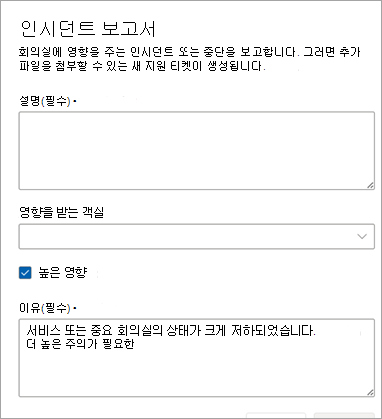

# 고객이 보고한 인시던트 티켓

Microsoft에서 플래그를 지정하지 않은 인시던트 유형 또는 서비스/기능에 대한 질문의 경우 고객 또는 고객을 대신하여 고객 또는 파트너가 보고서 인시던트 기능을 사용하여 Microsoft에 문제를 조사하거나 질문에 대답하도록 경고할 수 있습니다.

설명 필드에서 Microsoft의 도움이 필요한 문제를 최대한 잘 설명합니다. 하나 이상의 회의실을 추가할 수 있습니다.

고객 보고 인시던트(CRI)는 중요한 티켓으로 간주되므로 Teams 룸 서비스 운영 센터에서 먼저 이러한 티켓을 심사합니다. 고객이 보고한 인시던트에 대한 서비스 설명 SLA는 여기를 참조 [하세요](microsoft-teams-rooms-premium.md). 회의실이 CRI의 일부로 선택되면 CRI가 닫히기 전까지 각 회의실은 **비정상** 으로 표시됩니다.

## 고객이 보고한 인시던트 티켓 닫기

고객이 보고한 인시던트가 고객, 고객을 대신하여 회의실을 관리하는 파트너 또는 Microsoft의 서비스 운영 센터 엔지니어에 의해 폐쇄될 수 있습니다.

**인시던트를 닫려면**

1. **티켓 닫기를** 선택합니다.

   

1. 목록에서 범주를 선택하여 닫는 이유를 선택합니다.

   폐쇄 이유를 확인하면 티켓이 닫혀 **해결됨** 으로 이동됩니다.

   

티켓의 세부 정보 개요 섹션에는 관리 룸 서비스(Microsoft) 또는 고객/파트너의 이름으로 티켓이 닫혔습니다.  

 

## FAQ

**누구든지 티켓을 닫을 수 있습니까?**

사용자가 보고한 인시던트만 사용자 또는 Microsoft의 Managed Rooms 서비스 운영 센터에서 닫을 수 있습니다. 티켓 관리 권한이 있는 회의실을 관리하기 위해 파트너를 할당한 고객은 고객이 보고한 인시던트(Incidents)를 닫을 수 있습니다.

**티켓을 닫을 수 있는 사용자를 제한할 수 있나요?**

이때는 그렇지 않습니다. 티켓 관리 권한이 있는 모든 사용자는 CRI를 닫을 수 있습니다.

**고객이 보고한 인시던트 티켓이 닫히면 알림이 표시되나요?**

이때는 그렇지 않습니다.